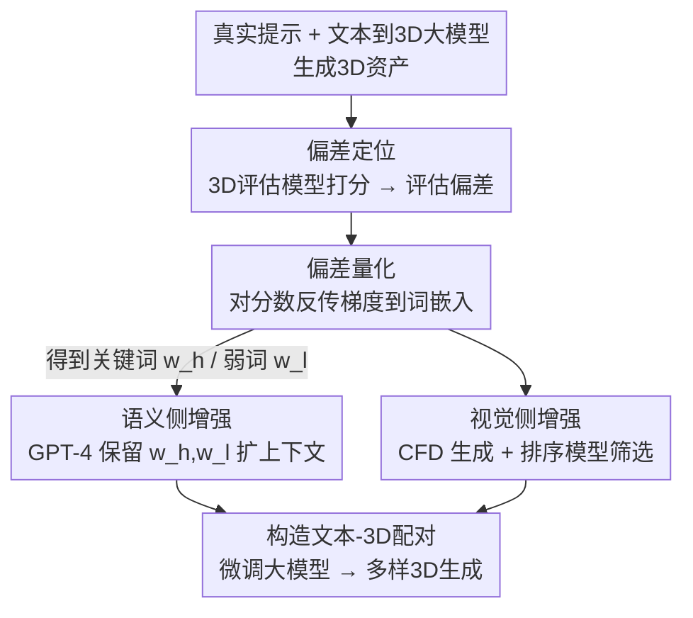

# Multimodal Semantic Bias Mitigation for Diverse Text-To-3D Generation

**会议**: CVPR 2026  
**论文**: [CVF Open Access](https://openaccess.thecvf.com/content/CVPR2026/html/Min_Multimodal_Semantic_Bias_Mitigation_for_Diverse_Text-To-3D_Generation_CVPR_2026_paper.html)  
**代码**: 无  
**领域**: 3D视觉  
**关键词**: 文本到3D生成, 偏差定位, 偏差缓解, 词级梯度, 数据增强

## 一句话总结
针对文本到 3D 大模型（如 TRELLIS）对提示词格式过度敏感、只盯住少数关键词、难懂复杂提示的「跨模态偏差」问题，本文提出一个「定位—量化—缓解」框架：用 3D 质量评估模型反传梯度在词级定位偏差，再据此用 GPT-4 和外部 3D 生成器构造语义更丰富、视觉更可靠的文本-3D 配对去微调大模型，从而生成更多样、更对齐文本的高质量 3D 内容，在 MATE-3D 与 T³Bench 上超过 8 个 SOTA。

## 研究背景与动机
**领域现状**：文本到 3D 生成早期主流靠 Score Distillation Sampling（SDS）从预训练 2D 扩散模型蒸馏 3D 表示（NeRF / 3DGS），但受 2D 扩散先验的内在偏差影响，常出现跨视角不一致、纹理模糊、Janus（多面）问题。近期 TRELLIS 这类直接在大规模 3D 资产数据集上训练的文本到 3D 大模型，能生成跨视角一致的 3D 资产，是新范式。

**现有痛点**：由于「文本-3D」配对数据相对稀缺，TRELLIS 这类大模型虽然几何一致性好，却难以做到「多样化」的文本到 3D 生成。论文用 Fig. 2 实证：TRELLIS 在不同提示类型上性能差异巨大，会过拟合特定提示词、只偏爱某一个词。例如给「A ceramic vase with a long, narrow neck（一个长而窄颈的陶瓷花瓶）」，模型几乎只盯住「vase」，生成结果与完整语义不符；对「Basic」类常见提示理解尚可，但对「Fantastical（奇幻）」「Grouped（成组）」等复杂提示理解很差。

**核心矛盾**：根源是模型存在**跨模态语义偏差**——文本侧的某些词对生成结果的影响被严重放大，导致模型「过度关注」少数词而「忽略」其余词。这种偏差来自训练数据中文本-3D 配对的语义覆盖不均，而非简单的模型容量问题。

**本文目标**：拆成两个子问题——(1) 如何在词级别**定位并量化**这种跨模态偏差；(2) 如何在不破坏模型已有通用知识的前提下**缓解**偏差，让模型理解更多样的提示。

**切入角度**：作者把问题搬到「数据层」而非改模型结构——既然偏差来自训练数据语义覆盖不均，就用一个现成的文本到 3D **评估模型**当探针，通过对预测质量分数反传梯度，看哪个词的 token 嵌入梯度大，就说明模型对该词更敏感、它就是偏差的来源。

**核心 idea**：用评估模型的梯度在词级定位偏差，再据此构造「语义更稳更丰富」的文本-3D 配对去微调大模型，把过度集中的注意力摊薄到更多词上。

## 方法详解

### 整体框架
整个方法是一条「定位 → 量化 → 缓解」的数据增强流水线，作用在已训练好的文本到 3D 大模型（TRELLIS 作为 backbone）之上。第一步**偏差定位**：用大模型对真实提示生成一批 3D 资产，再用一个多维 3D 质量评估模型给它们打分，把「评估偏差」形式化。第二步**偏差量化**：对预测分数反传梯度到文本 token 嵌入，用梯度绝对值衡量每个词对偏差的贡献，从而找出「最重要词」$w_h$ 和「最不重要词」$w_l$。第三步**偏差缓解**：基于词级偏差，分别做语义侧增强（用 GPT-4 在保留 $w_h$、$w_l$ 的前提下生成多样上下文提示）和视觉侧增强（用外部生成器 CFD 生成 3D 网格、再用排序模型筛出语义忠实的样本），构造出语义稳定且丰富的新文本-3D 配对去微调大模型。

### 关键设计

**1. 偏差定位：把「评估偏差」形式化，用 3D 质量评估模型当探针**

要缓解偏差，先得有可测量的定义。作者把模型能力视作一个理想固定量 $\phi$，评估模型基于数据 $X$ 给出估计 $\hat\phi=E(X)$，则评估偏差定义为 $\epsilon(\hat\phi)=\hat\phi-\phi$，偏差为 0 即无偏。具体地，对每个提示 $t_n$ 用大模型生成一组 $D$ 个网格 $x_n^D=\{G(t_n)\}$，再用一个带共享特征提取器 + 多映射头的多维评估模型 $\hat q_i=\psi(F(x,t)\mid\pi(f_c^i))$ 给每个网格打质量分。作者进一步区分两类偏差：**局部偏差**只在同一提示 $t_n$ 下统计，局部质量分 $q_l=\frac{1}{|x_n^D|}\sum_{x_n^d}q$；**全局偏差**则在整个数据集上平均 $q_g=\frac{1}{|\mathcal X|}\sum_{(x,t)\in\mathcal X}q$（局部偏差是全局偏差在单实例上的特例）。这一步把「模型对提示敏感」这种模糊现象，落成了可计算的分数差。

**2. 偏差量化：对预测分数反传梯度，做词级贡献归因**

定位之后要回答「到底是哪个词导致了偏差」。由于 $\epsilon(\hat\phi)=\hat\phi-\phi\propto\hat\phi$，作者直接拿预测分数 $q$（局部或全局）做归因：把提示的 token 嵌入序列记为 $\{e_0,\dots,e_n\}$，对每个嵌入计算分数对它的梯度绝对值之和 $e_i'=\sum\left|\frac{\partial q}{\partial e_i}\right|,\ q\in\{q_l,q_g\}$，把 $e_i'$ 当作 token $e_i$ 对偏差的贡献估计，再把组成同一个词的 token 梯度聚合到词级。直觉是：梯度幅度反映模型输出对该词变化的敏感度，敏感度越高说明模型越「过度依赖」这个词。为降算力，作者直接计算并统计平均梯度，而不是先算平均分数再求梯度。这一步把偏差从「整句一个分数」细化到「每个词一个贡献值」，是后续增强能精准发力的关键。

**3. 偏差缓解之语义侧增强：保留强词与弱词，用 GPT-4 扩展多样上下文**

知道了最重要词 $w_h$ 和最不重要词 $w_l$ 后，缓解的思路是：训练一个含更广语义信息、又不丢通用知识的模型。受不变风险最小化（IRM）启发，作者构造多个不同上下文环境 $C=\{C_1,C_2,\dots\}$——用 GPT-4 在**同时保留 $w_h$ 和 $w_l$** 的前提下生成不同上下文的提示。这样既保住了基础语义 $w_h$，又通过反复出现的方式强化模型对冷僻弱词 $w_l$ 的理解，把原本被 $w_h$ 垄断的注意力摊薄。生成的候选提示池再人工过滤掉重复或不当项，保证一致性与多样性。这一步直接针对「模型只盯一个词」的病根，用数据多样性把语义覆盖补齐。

**4. 偏差缓解之视觉侧增强：外部生成器 + 排序模型筛出语义忠实配对，构成偏好对**

光有多样提示还不够，得为它们配上视觉上靠谱的 3D。作者用近期文本到 3D 方法 CFD（开源）为增强提示生成对应的文本-3D 表示并转成带纹理网格，再用一个排序模型（沿用 HPSv2）挑出语义忠实的网格。具体地，对原始配对 $\{x_n,t_n\}$ 和生成的相关提示 $t_{nC}$，比较生成网格 $x_{nc}$ 与原网格 $x_n$ 得到更优 $x_{win}$ 与更差 $x_{lose}$，只选属于 $x_{win}$ 的网格构造新配对 $\{x_{nc},t_n\}$。通过这种「多对多」的文本-3D 指派，从文本模态侧丰富了监督信号（Algorithm 1）。这一步保证微调用的不是噪声数据，而是「语义对齐被筛选过」的高质量配对，避免增强反而引入新偏差。

### 一个完整示例
以提示「A ceramic vase with a long, narrow neck」为例：① 偏差定位——TRELLIS 生成多个花瓶网格，评估模型打分发现质量参差；② 偏差量化——反传梯度发现「vase」梯度最大（强词 $w_h$），「long」「narrow」「neck」梯度很小（弱词 $w_l$），说明模型只懂「花瓶」却忽略了「长窄颈」；③ 语义增强——GPT-4 在保留「vase」和「neck」的前提下生成多个不同上下文的提示，让模型反复见到「narrow neck」这类描述；④ 视觉增强——用 CFD 生成对应 3D 网格、排序模型筛出真正画出「长窄颈」的网格构成偏好配对；⑤ 用这批配对微调 TRELLIS，最终生成结果既保住花瓶主体、又正确呈现细长瓶颈。

## 实验关键数据

### 主实验
在 MATE-3D（160 提示，8 类）和 T³Bench（300 提示）两个基准上，把 TRELLIS-text 接上本文方法（w/ ours）后全面提升，并超过 8 个 SOTA。下表为 MATE-3D 各提示类别的总体质量分（节选）：

| 方法 | Basic | Complex | Fantastic | Grouped | Imaginative |
|------|------|------|------|------|------|
| One-2-3-45++ | 7.79 | 6.50 | 6.60 | 6.49 | 6.13 |
| TRELLIS-text | 7.39 | 6.50 | 6.24 | 5.73 | 5.57 |
| **TRELLIS-text w/ ours** | **8.19** | **6.72** | **6.95** | **6.64** | **6.25** |

在 T³Bench 上（分数归一到 [0,100]），本文同样在单物体、带环境单物体、多物体三类设置上均最优，例如多物体平均分从 TRELLIS-text 的 28.5 提升到 37.5：

| 方法 | 单物体均分 | 带环境单物体均分 | 多物体均分 |
|------|------|------|------|
| ProlificDreamer | 49.4 | 44.8 | 35.8 |
| TRELLIS-text | 44.8 | 43.4 | 28.5 |
| **TRELLIS-text w/ ours** | **50.2** | **47.8** | **37.5** |

相比此前最佳 One-2-3-45++，本文最小提升 0.12、最大 0.4、平均 0.19（MATE-3D 总体质量）。提升在「Fantastical」「Grouped」等复杂提示类别上尤为明显，正对应它要解决的「复杂提示理解差」痛点。

### 消融实验
在 MATE-3D 上对提示生成策略做消融，验证「梯度引导 + 强弱词协同」的必要性：

| 配置 | Basic | Fantastic | Grouped | 说明 |
|------|------|------|------|------|
| TRELLIS-text | 7.39 | 6.24 | 5.73 | 原模型 |
| w/o grad guide | 4.15 | 3.24 | 3.37 | 去掉梯度引导，大幅崩塌 |
| only $w_l$ | 4.39 | 5.23 | 3.11 | 只用弱词 |
| only $w_h$ | 7.68 | 6.43 | 5.81 | 只用强词 |
| **Ours (全)** | **8.19** | **6.95** | **6.64** | 强弱词 + 梯度引导 |

### 关键发现
- **梯度引导是命门**：去掉梯度引导（w/o grad guide）后各类别分数断崖式下跌（Basic 从 8.19 跌到 4.15），说明盲目增强提示反而有害，必须靠词级梯度精准定位偏差再增强。
- **强弱词缺一不可**：只用强词 $w_h$（7.68）虽接近原模型但提升有限，只用弱词 $w_l$（4.39）则严重退化；同时保留两者才达最优，印证 IRM 式「保基础语义 + 补冷僻语义」的设计。
- **方法可即插即用**：把同样的「prompt 增强」加到 One-2-3-45++ 上也有小幅提升（如 Basic 7.79→7.86），说明框架不绑定特定 backbone。
- **偏差可解释定位**：词级梯度统计能把特定语言概念与 3D 网格里的几何/外观失真对应起来，提供了 3D 生成偏差的可视化解释工具。

## 亮点与洞察
- **首个做文本到 3D 大模型偏差检测与缓解的工作**：把 2D 生成里成熟的「公平性/偏差」研究迁到 3D，并落在「文本对 3D 视觉的跨模态偏差」这个具体角度，选题新。
- **用评估模型的梯度当偏差探针**：不改模型结构、不要额外标注，只靠对质量分反传梯度就能在词级定位偏差，思路轻巧且可解释，可迁移到任何「有评估模型」的生成任务做归因。
- **数据层而非模型层缓解**：把问题归到训练数据语义覆盖不均，用 GPT-4 + 外部生成器 + 排序筛选构造高质量增强配对，避免动模型权重的高成本，工程上友好。
- **强弱词协同的 IRM 视角**：保留强词稳基础、反复喂弱词补冷僻语义，给「如何让大模型别只盯一个词」提供了一个干净的范式。

## 局限与展望
- 整条流水线**依赖多个外部组件**：3D 质量评估模型、GPT-4、外部生成器 CFD、排序模型 HPSv2，任一环节的偏差或错误都可能传导进最终配对，系统耦合度高。⚠️ 论文未系统分析这些外部模型自身偏差对结果的影响。
- 语义增强里有**人工过滤**步骤（去重复/不当提示），可扩展性和自动化程度受限。
- 偏差量化用「梯度绝对值」当贡献代理是一种近似，是否能完整刻画跨模态偏差（而非仅敏感度）有待更严格论证。
- 主要在 TRELLIS-text 上验证，虽声称即插即用并在 One-2-3-45++ 上小试，但对更多架构的普适性证据有限。

## 相关工作与启发
- **vs 基于 SDS 的文本到 3D（DreamFusion / ProlificDreamer 等）**：这些方法从 2D 扩散先验蒸馏，受其内在偏差影响导致跨视角不一致、Janus 问题；本文作用在 3D 大模型上，从数据层缓解文本侧偏差，互补而非竞争。
- **vs TRELLIS（backbone）**：TRELLIS 几何一致性强但难做多样化文本生成、过拟合特定词；本文正是给 TRELLIS「补语义多样性」，把其分数在复杂提示类别上拉起来。
- **vs 2D 扩散偏差缓解（FairDiffusion、ITI-GEN）**：它们在文本到图像里用公平约束或提示微调缓解偏差；本文把偏差研究扩展到 3D 模态，并用「评估模型梯度归因 + 数据增强」这套不同的技术路径解决跨模态偏差。

## 评分
- 新颖性: ⭐⭐⭐⭐ 首做文本到 3D 大模型偏差缓解、用评估模型梯度做词级归因，角度新；但单个组件（梯度归因、GPT-4 增强、偏好筛选）多是已有技术的组合。
- 实验充分度: ⭐⭐⭐⭐ 两基准 + 8 个 SOTA 对比 + 提示生成消融较扎实，但外部组件偏差未做敏感性分析、backbone 普适性证据偏少。
- 写作质量: ⭐⭐⭐ 偏差形式化与流水线讲清楚了，但 OCR 公式密集、部分符号（$w_h/w_l$、$x_{win}/x_{lose}$）交代略仓促。
- 价值: ⭐⭐⭐⭐ 给文本到 3D 大模型「理解复杂提示」提供了可落地的数据层方案，且提供了偏差可视化定位工具，实用性较好。

<!-- RELATED:START -->

## 相关论文

- [\[CVPR 2026\] Are We Ready for RL in Text-to-3D Generation? A Progressive Investigation](are_we_ready_for_rl_in_text-to-3d_generation_a_progressive_investigation.md)
- [\[CVPR 2026\] Text–Image Conditioned 3D Generation](text-image_conditioned_3d_generation.md)
- [\[CVPR 2026\] Image-to-Point Cloud Feature Back-Projection for Multimodal Training of 3D Semantic Segmentation](image-to-point_cloud_feature_back-projection_for_multimodal_training_of_3d_seman.md)
- [\[CVPR 2026\] PrITTI: Primitive-based Generation of Controllable and Editable 3D Semantic Urban Scenes](pritti_primitive-based_generation_of_controllable_and_editable_3d_semantic_urban.md)
- [\[CVPR 2026\] Artiverse: A Diverse and Physically Grounded Dataset for Articulated Objects](artiverse_a_diverse_and_physically_grounded_dataset_for_articulated_objects.md)

<!-- RELATED:END -->
