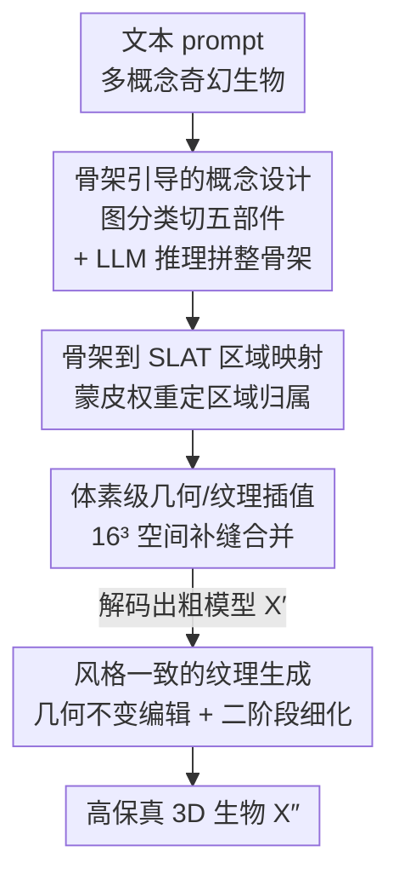

# Muses: Designing, Composing, Generating Nonexistent Fantasy 3D Creatures without Training

**会议**: CVPR 2026  
**论文**: [CVF Open Access](https://openaccess.thecvf.com/content/CVPR2026/html/Lu_Muses_Designing_Composing_Generating_Nonexistent_Fantasy_3D_Creatures_without_Training_CVPR_2026_paper.html)  
**代码**: 项目页 https://luhexiao.github.io/Muses.github.io/  
**领域**: 3D视觉  
**关键词**: 免训练3D生成、奇幻生物、3D骨架、结构化隐空间、概念组合

## 一句话总结
Muses 是首个**免训练、前馈式**的奇幻 3D 生物生成框架：它把"一个由老虎身体、龙翅膀、机器人腿、九条狐狸尾巴拼成的不存在生物"这种高度组合的文本，先解析成各部件的 3D 骨架，用图分类 + LLM 推理拼出一副合理的整体骨架，再在 Trellis 的结构化隐空间（SLAT）里按骨架做体素级几何/纹理插值组装，最后用风格一致的纹理编辑收尾，在视觉保真度和文本对齐上大幅超过 DreamBeast、OmniPart 等方法（VQAScore 0.93 vs 0.82）。

## 研究背景与动机

**领域现状**：3D 内容生成主流走三条路——把 2D 生成先验蒸馏进可优化 3D 表示（SDS 系，如 DreamFusion）、先合成多视角 2D 图再重建 3D、以及在大规模 3D 数据上训练前馈模型直接出 3D（如 Trellis）。这些方法对"普通"物体已经够用。

**现有痛点**：一旦目标是**高度创意、训练分布外**的生物（拼接多个物种、带怪异部件），现有路线都崩。基于部件操作的方法（DreamBeast 用 part-affinity、OmniPart 做部件级生成）有两个硬伤：部件粒度难控制，且即便拿到单个 3D 部件，把它们在**接缝处**融成连贯整体也极难——DreamBeast 还被 SDS 的逐实例优化拖慢、最多只支持三个部件，OmniPart 则需要人工手动拼接。基于 2D 创意图再 lift 到 3D 的路线（如 UNO+Trellis）则高度依赖 2D 图质量，且目标远在 3D 训练分布之外，realism 和 harmony 都保不住。

**核心矛盾**：直接在像素/部件层面拼接，缺一个能**显式、合理地约束"哪个部件放哪、多大、朝哪"**的结构骨干；没有这个骨干，组合就退化成接缝处的乱拼。

**本文目标**：在不训练任何新模型的前提下，生成几何连贯、纹理和谐、且忠实于创意文本的不存在 3D 生物，并把流程做成自动、前馈。

**切入角度**：作者抓住一个生物学事实——**3D 骨架是生物形态的根本表示**。骨架天然编码了"身体/翅膀/腿/头/尾"的拓扑与比例关系，把它当作设计骨干，就能把"创意组合"这件模糊的事形式化成"设计骨架 → 按骨架组装 → 按骨架生成纹理"的结构感知流水线。

**核心 idea**：用 3D 骨架替代部件级拼接和 2D 图驱动，把不存在生物的创造拆成**设计（design）→ 组合（compose）→ 生成（generate）** 三段，每段都被同一副骨架约束。

## 方法详解

### 整体框架
输入是一段描述奇幻生物的文本 $C$（如"身体是章鱼、翅膀是翠鸟、头是梅花鹿的生物"），输出是一只高保真、风格统一的 3D 生物。Muses 以 Trellis 为骨架（SLAT 表示），全程不训练，分三个阶段串行：

- **Stage I 骨架引导的概念设计**：把 $C$ 解析成 $M$ 个概念，分别生成对应 3D 资产 $\{X\}_{m=1}^M$ 和骨架 $\{G=(V,E)\}_{m=1}^M$；用图分类把每副骨架切成 body/wings/legs/head/tail 五类子骨架，再让 LLM 推理出一副文本对齐、布局合理的整体骨架 $\dot G$。
- **Stage II 基于 SLAT 的内容组合**：用蒙皮权重把骨架段映射到 SLAT 区域，在压缩的 $16^3$ 体素空间里做几何/纹理插值，组装出粗模型 $X'$ 的隐码 $Z'$。
- **Stage III 风格一致的纹理生成**：把 $X'$ 渲染成参考图，用 FLUX.1 Kontext 做几何不变的纹理编辑得到风格图 $I'$，再喂回 Trellis 第二阶段细化出最终生物 $X''$。

### 关键设计

**1. 骨架引导的概念设计：把"创意拼接"形式化成图上的部件分类 + LLM 布局推理**

部件级方法最大的痛点是部件粒度难控、朝向比例没人管。Muses 的第一步就是要造出一副**语义清晰、比例朝向都合理**的整体骨架。它先做**图分类（graph-based skeleton classification）**：给定各物种的 3D 资产和骨架 $G=(V,E)$（$V$ 是关节坐标、$E$ 是骨连接），先用连通分量分析、冗余节点删除、路径优化清掉爪子触角这类小分支得到干净骨架 $\tilde G$，再用一套启发式规则做语义分解。比如起始节点取盆骨附近的根节点 $r$：当 $\deg(r)\ge 3$ 时 $b=r$，否则取 $r$ 邻居中度数最大的节点；从叶节点里挑 $y$ 坐标低于 $b$ 的当腿候选 $V_{low}$，结合对主方向 $\delta$ 的对称性判定 $G_{leg}$；沿 $\delta$ 找第一个度数 $\ge 4$ 的躯干结点 $d=\arg\min_{v,\deg(v)\ge 4}\langle v,\hat\delta\rangle$，$b$ 到 $d$ 的路径就是 $G_{body}$，从 $d$ 对称伸出的是翅膀/腿、剩下的是头。

光有分类还不够——规则能跟着拓扑切，却**没有语义意识**去判断"这个头该多大、朝哪"。所以第二步用 **LLM 推理组装（Qwen-Plus）**：定义三个基本编辑算子 $\mathrm{Rot}(\hat G;\theta)$、$\mathrm{Trans}(\hat G;t,\lambda)$、$\mathrm{Scale}(\hat G;\alpha)$，把每个候选子骨架的类别、位置、尺寸、朝向喂给 LLM，让它推断连接关系并把组装请求分解成一串算子序列；prompt 里若出现"两个头"这类计数，LLM 就实例化多份并对称放置。整个设计阶段是一个映射 $f_{LLM}:(\bar G,\Delta,C)\to\dot G$。这一步是 Muses 区别于纯规则拼接的关键——消融里去掉 LLM 推理，会出现翅膀过大、头朝向错误、头过大等比例/朝向错误。

**2. 骨架到 SLAT 的区域映射：用蒙皮权重把"骨架语义"传到结构化隐空间，而不是手动缝部件**

有了骨架还要回答"SLAT 表示里哪些体素属于翅膀、哪些属于头"。直接按最近邻距离分配区域简单但容易过/欠分割。Muses 改用**蒙皮权重（skinning weight）**建立骨架与几何的显式对应：先预测蒙皮矩阵 $W\in\mathbb R^{Q\times J}$（$W[i,j]$ 是关节 $j$ 对网格顶点 $x_i$ 的影响），把关节级权重按子骨架聚合归一化成区域级权重 $\widetilde W[i,\ell]=\frac{\sum_{j:G_\ell}W[i,j]}{\max(\sum_{\ell'}\sum_{j':G_{\ell'}}W[i,j'],\varepsilon)}$。再把区域权重从网格顶点传到 SLAT 体素：对每个 SLAT 位置 $p_i$ 找 $k$ 个最近网格顶点，按逆距离算归一化权重 $\beta_{i,s}=\frac{\alpha_{i,s}}{\sum_{s'}\alpha_{i,s'}},\ \alpha_{i,s}=\frac{1}{\max(\|p_i-x_{i_s}\|_2,\varepsilon_d)}$，加权得到 SLAT 级区域权重 $W_{SLAT}[i,\ell]=\sum_s\beta_{i,s}\widetilde W[i_s,\ell]$。这样每个 SLAT 体素都继承了一份"自己属于哪个语义区域"的软权重，组装时才知道谁该和谁混。消融显示去掉蒙皮权重（退回最近邻）会过/欠分割。

**3. 体素级几何与纹理插值：在压缩的 $16^3$ 空间补接缝，而不是在稀疏 SLAT 上硬拼**

即便区域分好了，不同部件交界处仍有大块组合空隙。作者发现直接在显式的 $64^3$ SLAT 空间插值，因为激活体素稀疏，缝补不上、会留下可见接缝、空洞和错位。Muses 的做法是退到更紧凑、更抽象的 $16^3$ 体素空间 $S$ 做线性插值——高层语义隐空间比解码后的稀疏体素更容易跨越空隙。对几何 $S$、权重 $W_{SLAT}$、特征 $\{z_i\}$ 一起插值；当多个区域占用同一体素时，按权重合并特征 $z_{comp}=\sum_i\tilde w_i z_i=\frac{\sum_i w_i z_i}{\sum_j w_j}$（$\sum_i\tilde w_i=1$），再解码出粗模型 $X'$。这一步保证几何平滑连贯、纹理跨区域也相对和谐，是"拼接处不再有缝"的直接原因（消融去掉插值，接缝/空洞/错位明显）。

**4. 风格一致的纹理生成：先做几何不变的纹理编辑给一张"对齐的样式图"，再细化**

组装出的 $X'$ 几何合理但视觉僵硬——整体配色不协调、表面细节粗糙，因为不同部件的纹理来自不同源资产。Muses 用两步收尾。**几何不变纹理编辑**：把 $X'$ 渲染出最佳视角作参考图 $I$，用 FLUX.1 Kontext 在保持几何结构的前提下生成符合特定艺术风格（神话风、吉卜力风、蒸汽朋克风）的图 $I'\leftarrow\mathrm{FLUX\ Kontext}(I,C_{pos},C_{neg},\gamma)$，其中正/负 prompt 强调"保住输入几何、换上目标风格"。关键在于这张样式图是**和粗几何对齐**的，比直接用文字描述 $C$ 生成图更利于细纹理。**风格自洽生成**：把编辑图 $I'$ 和粗几何 $\{p'_i\}$ 一起喂回 Trellis 第二阶段 $z''\leftarrow T_L(I',\{p'_i\})$，解码得到纹理美观且几何与 $X'$ 一致的最终生物 $X''$。消融里"无几何不变编辑"（直接用文字 $C$ 出图）会出现纹理与语义区域不匹配，"无风格自洽"则停在僵硬的粗模型。

### 损失函数 / 训练策略
本方法**完全免训练**：不微调任何网络，直接复用 Trellis（SLAT 骨架，CFG scale 5.0、采样 25 步）、Puppeteer（骨架与蒙皮权重预测，block depth 1）、Qwen-Plus（LLM 组装推理）、FLUX.1 Kontext（样式编辑）。单张 NVIDIA RTX A6000 上单个实例可在一分钟内生成。

## 实验关键数据

### 主实验
在 30 个样本上评 CLIPScore，并用 VQAScore（CLIP-FlanT5）补偿 CLIP 对高度组合描述不可靠的问题；另对 10 个样例做 60 人用户研究，评视觉保真度和文本对齐偏好。

| 方法 | CLIP↑ | VQA↑ | 视觉保真度↑ | 文本对齐↑ |
|------|-------|------|------------|-----------|
| DreamBeast | 0.2450 | 0.4948 | 6.15 | 0.63 |
| GaussianDreamer | 0.2287 | 0.5009 | 2.27 | 1.27 |
| UNO + Trellis | 0.2386 | 0.5085 | 1.94 | 0.32 |
| Trellis-Text-to-3D | 0.2432 | 0.7565 | 10.36 | 2.54 |
| OmniPart（需人工拼接） | 0.2690 | 0.8151 | 12.62 | 9.84 |
| **Muses（full）** | **0.2878** | **0.9254** | **66.67** | **85.40** |

Muses 在所有指标上全面领先。尤其用户研究里视觉保真度 66.67、文本对齐 85.40，把第二名 OmniPart（12.62 / 9.84）拉开了数量级——说明人在主观偏好上压倒性地选 Muses。DreamBeast 最多只支持三个物种、SDS 优化慢；UNO+Trellis 对 2D 图质量极敏感，组合一差 3D 就崩；OmniPart 常无法正确分解动物（如分不开身体和头），还得人工拼。

### 消融实验
逐个去掉组件（VQA1 基于 CLIP-FlanT5，VQA2 基于 ShareGPT4V）：

| 配置 | CLIP↑ | VQA1↑ | VQA2↑ | 说明 |
|------|-------|-------|-------|------|
| w/o LLM 推理 | 0.2573 | 0.6967 | 0.7311 | 退回纯规则拼接，比例/朝向错 |
| w/o 蒙皮权重 | 0.2664 | 0.7090 | 0.7081 | 退回最近邻分配，过/欠分割 |
| w/o 插值 | 0.2695 | 0.7326 | 0.7366 | 直接在 64³ 拼，留接缝/空洞 |
| w/o 几何不变编辑 | 0.2532 | 0.7990 | 0.7075 | 纹理与语义区域不匹配 |
| w/o 风格自洽 | 0.2806 | 0.8359 | 0.7902 | 停在僵硬粗模型 |
| **ours（full）** | **0.2878** | **0.9254** | **0.8496** | 完整模型 |

### 鲁棒性（按骨架复杂度分级的失败率）
按关节数（<25 / [25,40] / >40）和度数 $\ge 3$ 的节点数把骨架分成 Easy/Medium/Hard 三档，每档 100 例：

| 复杂度 | Easy | Medium | Hard |
|--------|------|--------|------|
| 骨架分类失败率 | 5% | 5% | 8% |
| LLM 推理失败率 | 4% | 7% | 11% |

### 关键发现
- **去掉 LLM 推理掉点最猛**（VQA1 0.93→0.70）：纯规则能跟拓扑但没语义意识，区域比例和相对朝向会错——这印证了"骨架引导设计"是最核心的贡献，规则只是脚手架。
- **几何不变纹理编辑对 CLIP 影响最大**（去掉后 CLIP 0.2878→0.2532，比去 LLM 还低）：说明"先给一张和几何对齐的样式图"对最终文本-视觉对齐至关重要。
- **失败率随复杂度上升但整体稳定在 ~10%**：LLM 推理在 Hard 档失败率 11%，是组合越复杂越难推的直接体现，但没有崩盘，证明方法可扩展。
- **可迁移到非生物**：只要物体能被骨架化（如灯座+机翼+折扇拼的"物体"），Muses 同样适用并优于基线（Fig.7）。

## 亮点与洞察
- **"3D 骨架即设计骨干"这个切入点很巧**：它把"创意组合"从像素/部件层面的乱拼，提升到拓扑+比例可控的结构层面——骨架天然带着 body/wings/head 的语义和对称关系，等于免费拿到一份组合约束。这个 design→compose→generate 范式可迁移到任何"需要把异构部件拼成连贯整体"的生成任务。
- **在 $16^3$ 而非 $64^3$ 插值补缝**是个实用 trick：稀疏激活体素直接拼必留缝，退到更抽象的压缩隐空间反而更容易跨越空隙——"换个抽象层级解决拼接"的思路值得借鉴。
- **全程零训练却拿下数量级领先**：靠的是把 Trellis / Puppeteer / Qwen / FLUX 这些现成模型用骨架串成一条结构感知流水线，而非堆数据训练。这说明在 3D 创意生成上，"合理的结构约束 + 现成基座"可能比"训练新模型"更划算。
- **几何不变纹理编辑**把纹理和几何解耦：先在 2D 上换风格再回灌 3D 第二阶段，既保几何又换皮，顺手解锁了风格化纹理编辑这个应用。

## 局限与展望
- **作者承认的两类失败**：受限于 Trellis 的生成能力（如生不出逼真孔雀，就抽不出有意义的骨架/内容）和 Puppeteer 的骨架初始化（生不出合理 3D 骨架就没法进入设计阶段）。作者认为更强的 3D 生成和骨架建模能解决。
- **只适用可骨架化的类别**：动物、人形、机器人、虚拟角色可以，无法被骨架形式化的抽象物体不行——这是骨架范式的本质边界。
- **LLM 推理在高复杂度下失败率升到 11%**：组合越复杂越依赖 LLM 把布局推对，部件数极多时仍有约 10% 的整体失败概率。
- **评测规模偏小**：CLIPScore 仅 30 样本、用户研究仅 10 样例 60 人，定量比较的统计稳健性有限；且视觉保真度/文本对齐的绝对分差异巨大（66.67 vs 12.62），更像主观偏好投票而非可校准指标，跨方法绝对值需谨慎解读。

## 相关工作与启发
- **vs DreamBeast（part-affinity + SDS）**: 它训练 3D 部件亲和表示生成奇幻动物，但只支持三个部件、被 SDS 逐实例优化拖慢；Muses 免训练、前馈、部件数不受限，靠骨架而非亲和度组合，VQA 0.93 vs 0.49。
- **vs OmniPart（部件级生成）**: 它自回归产出包围盒序列引导部件合成，但常分不开身体和头、且组合需人工拼接；Muses 全自动、用骨架+蒙皮权重自动对齐区域，无需手动缝合。
- **vs UNO + Trellis（2D 创意图 lift 到 3D）**: 它先合成创意 2D 图再 image-to-3D，高度依赖 2D 质量、目标在分布外时崩；Muses 直接在 3D 骨架/SLAT 空间组合，绕开 2D 瓶颈，视觉保真度 66.67 vs 1.94。
- **vs Trellis-Text-to-3D（前馈直生）**: 直接喂高度组合文本给前馈模型，处理不了复杂组合描述；Muses 用骨架把组合显式化后再交给 Trellis 各阶段，相当于给前馈模型补了一个结构先验。

## 评分
- 新颖性: ⭐⭐⭐⭐⭐ 首个免训练前馈奇幻 3D 生物生成，"3D 骨架当设计骨干"的 design-compose-generate 范式确实新。
- 实验充分度: ⭐⭐⭐⭐ 五项消融 + 三档复杂度鲁棒性 + 用户研究都做了，但定量样本规模偏小、主观指标占比高。
- 写作质量: ⭐⭐⭐⭐ 三阶段流水线讲得清楚、公式完整、图示丰富；个别符号（如 $\widetilde W$ 归一化）略密。
- 价值: ⭐⭐⭐⭐⭐ 免训练即可生成高质量创意 3D 生物，并自然支持几何/纹理编辑，对游戏、VR、动画的资产创作很实用。

<!-- RELATED:START -->

## 相关论文

- [\[CVPR 2026\] ArtLLM: Generating Articulated Assets via 3D LLM](artllm_generating_articulated_assets_via_3d_llm.md)
- [\[CVPR 2026\] Real2Edit2Real: Generating Robotic Demonstrations via a 3D Control Interface](real2edit2real_generating_robotic_demonstrations_via_a_3d_control_interface.md)
- [\[CVPR 2026\] 2D-LFM: Lifting Foundation Model without 3D Supervision](2d-lfm_lifting_foundation_model_without_3d_supervision.md)
- [\[ICCV 2025\] Easi3R: Estimating Disentangled Motion from DUSt3R Without Training](../../ICCV2025/3d_vision/easi3r_estimating_disentangled_motion_from_dust3r_without_training.md)
- [\[CVPR 2026\] Fast3Dcache: Training-free 3D Geometry Synthesis Acceleration](fast3dcache_training-free_3d_geometry_synthesis_acceleration.md)

<!-- RELATED:END -->
