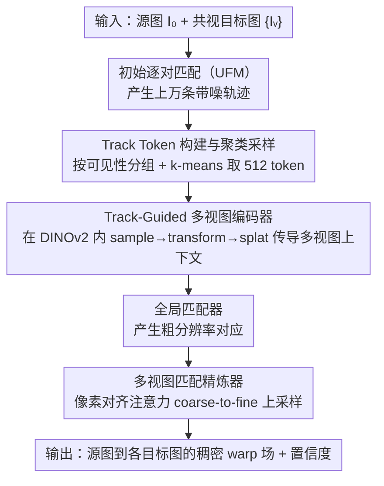

# MV-RoMa: From Pairwise Matching into Multi-View Track Reconstruction

**会议**: CVPR 2026  
**arXiv**: [2603.27542](https://arxiv.org/abs/2603.27542)  
**代码**: [项目主页](https://icetea-cv.github.io/mv-roma/)  
**领域**: 3D视觉 / 特征匹配  
**关键词**: 多视图匹配, 稠密对应, 轨迹重建, SfM, 特征融合

## 一句话总结

提出 MV-RoMa，首个多视图稠密匹配模型，通过 Track-Guided 多视图编码器和像素对齐多视图精炼器从一张源图同时估计到多个目标图的稠密对应关系，产生几何一致的轨迹用于 SfM，在 HPatches/ETH3D/IMC 等基准上全面超越现有方法。

## 研究背景与动机

1. **领域现状**：特征匹配是 3D 重建、视觉定位的基础任务。RoMa、DKM 等稠密匹配方法已能产生高质量的逐对匹配结果。
2. **现有痛点**：现有方法本质是逐对（pairwise）匹配，在 SfM 等多视图任务中需要将逐对结果串联成多视图轨迹（track），但串联过程容易产生碎片化、几何不一致的轨迹。
3. **核心矛盾**：后处理优化（如 PixSfM、DFSfM）只能在初始逐对匹配的基础上修修补补，且需对每条轨迹单独优化，计算量大且受初始匹配质量瓶颈限制。
4. **本文目标**：直接在模型层面实现多视图一致的稠密对应，消除串联累积误差。
5. **切入角度**：将稀疏几何先验（来自初始逐对匹配）作为"轨迹 token"嵌入到特征编码器中，引导多视图特征交互。
6. **核心 idea**：用 track token 引导的多视图编码器 + 像素对齐注意力精炼器，实现首个端到端多视图稠密匹配。

## 方法详解

### 整体框架

输入：一张源图 $I_0$ + 多张共视目标图 $\{I_v\}$。先用现有 matcher（默认 UFM）做初始逐对匹配，通过聚类采样构建稀疏多视图轨迹 token。然后：(1) Track-Guided 多视图编码器在 DINOv2 backbone 中注入多视图信息，产生几何一致的稠密特征；(2) 全局匹配器产生粗对应；(3) 多视图精炼器用像素对齐注意力逐级上采样到全分辨率稠密对应。输出：源图到每个目标图的稠密 warp 场 $W^{0\to v}$ 和置信度。

### 关键设计

**1. Track Token 构建与聚类采样：把逐对匹配压缩成紧凑的多视图几何先验**

多视图编码器需要一份"哪些点在哪些视图里是同一个点"的先验，但初始逐对匹配产生的轨迹动辄上万条、噪声大、空间分布不均，直接喂进网络既冗余又慢。MV-RoMa 把每条轨迹抽象成一个 token：坐标向量 $\mathbf{u}_i \in \mathbb{R}^{2V}$ 记录这条轨迹在全部 $V$ 个视图里的 2D 位置，可见性掩码 $\mathbf{m}_i \in \{0,1\}^V$ 标记它在哪些视图可见。采样时不随机抽，而是先按可见性模式把轨迹分组（"只在视图 0/2 出现"和"在全部视图出现"分到不同组），再在每组内做 k-means、取离每个簇心最近的那条真实轨迹做代表，最终固定保留 $T=512$ 个 token。这样既避免了随机采样的空间扎堆和噪声敏感，又靠可见性分组让部分可见的轨迹不被全可见轨迹淹没。

**2. Track-Guided 多视图编码器：让稀疏轨迹当"信使"，在 DINOv2 内部传导多视图上下文**

最直接的多视图特征交互是让所有视图的所有像素互相做交叉注意力，但那是 $O\big((V \cdot HW)^2\big)$ 的代价，视图一多就爆。MV-RoMa 的做法是把上一步选出的 512 条轨迹当作信息传导的媒介，在 DINOv2 backbone 后半部分的每个 Transformer block 里插入三步 sample-transform-splat 操作：先 **Attentional Sampling**——以轨迹坐标为 query、图像特征为 key/value 做交叉注意力，并加上随距离衰减的空间偏置 $B_v$，把每个视图里轨迹落点附近的图像信息"吸"到 token 上；再 **Track Transformer**——让每条轨迹沿视图轴做自注意力，不加视图索引嵌入以保持视图无关性、用可见性掩码屏蔽不可见视图，这一步才真正完成跨视图的信息交换；最后 **Attentional Splatting** 做反向操作，把已经"见过多视图"的 token 特征写回图像网格。整条链路的复杂度只有 $O(T \cdot HW \cdot V)$，因为信息始终经由 $T=512$ 条稀疏轨迹中转，而不是让稠密像素两两相乘。

**3. 多视图匹配精炼器：在高分辨率用像素对齐注意力做几何一致的细调**

编码器给出的是粗分辨率对应，要恢复到全分辨率还得在精细层注入多视图上下文，但精细层像素更多、再做全局交叉注意力更不现实。精炼器沿用 RoMa 的 coarse-to-fine 框架，只在 stride 4 和 stride 1 两层加多视图注意力，关键技巧是**像素对齐注意力**：先拿上一级预测的 warp 把各目标视图的特征对齐回源视图坐标系，于是源图的每个像素只需关注它在各目标视图里对应的那一个位置，而不必在整张图上搜索。每层交替做这种跨视图注意力和 ConvNeXt 空间传播，迭代 $N$ 次后输出 warp 残差逐级上采样。这把空间搜索问题转化为局部对齐问题，复杂度压到 $O(HW \cdot V)$，且只在真正需要的位置做精细修正。

### 一个完整示例：一条轨迹 token 如何在编码器里"看遍"多视图

设源图 $I_0$ 加 4 张目标图共 5 个视图，初始逐对匹配后聚类得到 512 条轨迹，其中第 $i$ 条只在视图 0、1、3 可见（$\mathbf{m}_i=[1,1,0,1,0]$），坐标 $\mathbf{u}_i$ 记下它在这三个视图的像素位置。进入某个 DINOv2 block：Attentional Sampling 阶段，token $i$ 用自己在视图 0/1/3 的坐标分别去对应视图的图像特征上做带空间偏置的交叉注意力，采到三份局部外观；Track Transformer 阶段，这三份外观沿视图轴互相注意——视图 3 里这块区域被遮挡得模糊，就能从视图 0/1 清晰的外观里补上一致的几何信息，而视图 2/4（掩码为 0）被屏蔽不参与；Attentional Splatting 阶段，融合后的 token 特征再被写回视图 0/1/3 的对应像素位置。多个 block 叠加后，原本逐对、彼此割裂的特征就被这条"信使"轨迹拉成了几何一致的多视图特征，最终在精炼器里产出跨视图对齐的稠密 warp。

### 损失函数 / 训练策略

- 使用 RoMa 的 robust loss，在 MegaDepth + ScanNet 上训练 200K 步
- 学习率 $3\times10^{-5}$，20K 步后衰减 10 倍，batch size 4
- 默认 1 源 + 4 目标图，512 个 track token

## 实验关键数据

### 主实验

**HPatches 单应性估计 (AUC %)**：

| 方法 | DLT @1/3/5px | RANSAC @1/3/5px |
|------|-------------|-----------------|
| RoMa | 41.0/67.9/76.9 | 44.7/72.6/81.4 |
| **MV-RoMa** | **46.1/71.9/80.1** | **47.2/73.2/81.8** |

**ETH3D 3D 三角化**：

| 方法 | Accuracy 1/2/5cm | Completeness 1/2/5cm |
|------|-------------------|----------------------|
| RoMa | 75.58/86.25/94.95 | 5.64/15.73/38.60 |
| **MV-RoMa** | **85.88/92.99/98.05** | 3.95/9.94/23.81 |
| RoMa + Dense-SfM | 84.79/92.62/97.77 | **7.38/17.06/36.35** |

**多视图位姿估计 (AUC %)**：

| 方法 | Texture-Poor @3/5/10° | IMC @3/5/10° |
|------|----------------------|--------------|
| RoMa + Dense-SfM | 49.94/66.23/81.41 | 48.48/60.79/73.90 |
| **MV-RoMa** | **51.79/66.77/81.74** | **51.31/62.92/75.92** |

### 消融实验

| 配置 | ETH3D Acc@2cm | ETH3D Comp@2cm | HPatches AUC@3px |
|------|---------------|----------------|------------------|
| RoMa baseline | 86.25 | 15.73 | 67.9 |
| + MV-Encoder | 提升 | 提升 | 提升 |
| + MV-Encoder + MV-Refiner | **92.99** | 最优 | **71.9** |

### 关键发现

- 在 HPatches @1px 严格阈值下提升最大（41.0→46.1），说明多视图一致性主要提升精细匹配精度
- DLT 和 RANSAC 差距很小（说明 inlier 比例极高），匹配质量本身就很好
- 在 Texture-Poor 数据集上优势明显，证明多视图信息交互在低纹理场景中特别有效
- MV-Encoder 和 MV-Refiner 贡献互补，缺一不可

## 亮点与洞察

- **用稀疏轨迹 token 做多视图信息传导**是核心创新，避免了全局多视图注意力的二次复杂度，同时保留了足够的几何先验。这种"稀疏代理"策略可推广到其他多视图任务
- **像素对齐注意力**的设计很巧妙——先 warp 对齐再做注意力，将空间搜索问题转化为局部对齐问题，大幅降低计算量
- **从"后处理修补"到"端到端预测"的范式转变**：不再依赖逐对匹配的质量上限

## 局限与展望

- 仍依赖现有 matcher（UFM）做初始逐对匹配来构建 track token，如果初始匹配质量差，先验不可靠
- 默认只处理 1+4=5 张图，扩展到更多视图时 track token 数量和注意力计算需重新考量
- ETH3D 上 completeness 不如一些后处理方法（Dense-SfM），因为 NMS 采样策略偏保守
- 可探索去掉初始 matcher 的依赖，直接在网络内部学习多视图先验

## 相关工作与启发

- **vs RoMa**: MV-RoMa 的直系前身，RoMa 做逐对稠密匹配已是 SOTA，MV-RoMa 在其基础上加入多视图一致性，各指标进一步提升
- **vs PixSfM / DFSfM**: 这些是后处理优化方法，在已有轨迹上做精炼。MV-RoMa 直接产生多视图一致的匹配，不需要逐轨迹优化
- **vs Tracktention**: 借鉴了其 sample-transform-splat 的设计，但 Tracktention 针对视频跟踪，MV-RoMa 将其适配到稀疏多视图匹配场景

## 评分

- 新颖性: ⭐⭐⭐⭐ 首个多视图稠密匹配模型，track token 设计优雅，但整体仍建立在 RoMa 框架上
- 实验充分度: ⭐⭐⭐⭐⭐ HPatches + ETH3D + IMC + Texture-Poor 四个基准，消融详尽
- 写作质量: ⭐⭐⭐⭐⭐ 图示清晰、pipeline 描述流畅、符号一致
- 价值: ⭐⭐⭐⭐ 对 SfM / 3D 重建领域有直接推动作用，填补了多视图稠密匹配的空白

<!-- RELATED:START -->

## 相关论文

- [\[CVPR 2026\] Coherent Human-Scene Reconstruction from Multi-Person Multi-View Video in a Single Pass](coherent_humanscene_reconstruction_from_multiperso.md)
- [\[CVPR 2025\] CoMatcher: Multi-View Collaborative Feature Matching](../../CVPR2025/3d_vision/comatcher_multi-view_collaborative_feature_matching.md)
- [\[CVPR 2026\] Intrinsic Image Fusion for Multi-View 3D Material Reconstruction](intrinsic_image_fusion_for_multi-view_3d_material_reconstruction.md)
- [\[CVPR 2026\] BRepGaussian: CAD Reconstruction from Multi-View Images with Gaussian Splatting](brepgaussian_cad_reconstruction_from_multi-view_images_with_gaussian_splatting.md)
- [\[CVPR 2026\] TROPHIES: Temporal Reconstruction of Places, Humans, and Cameras from Multi-view Videos](trophies_temporal_reconstruction_of_places_humans_and_cameras_from_multi-view_vi.md)

<!-- RELATED:END -->
