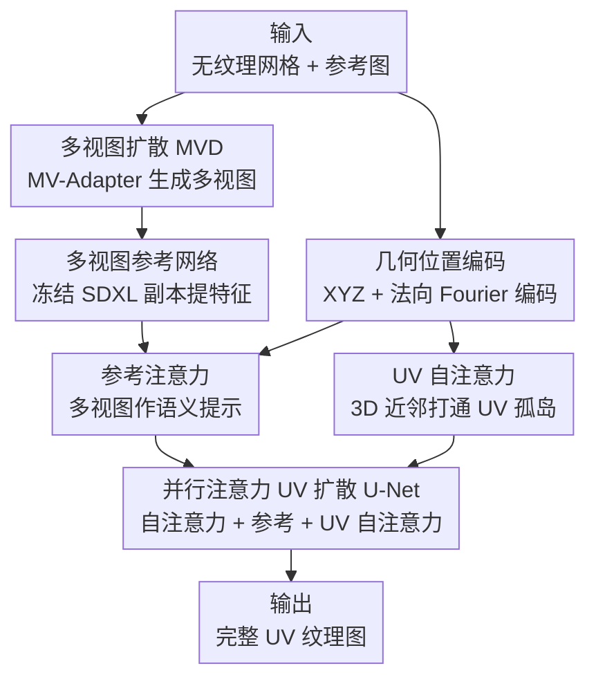

# MV2UV: Generating High-quality UV Texture Maps with Multiview Prompts

**会议**: CVPR 2026  
**论文**: [CVF Open Access](https://openaccess.thecvf.com/content/CVPR2026/html/Zhang_MV2UV_Generating_High-quality_UV_Texture_Maps_with_Multiview_Prompts_CVPR_2026_paper.html)  
**代码**: 未提及  
**领域**: 3D视觉 / 纹理生成  
**关键词**: UV 纹理生成、多视图扩散、几何位置编码、参考注意力、遮挡补全

## 一句话总结
MV2UV 把多视图扩散生成的图像当作"语义提示"，在 UV 空间用一个微调过的 SDXL 扩散模型直接生成纹理图，并用像素对齐的 3D 坐标（XYZ）作为跨注意力的位置编码，从而在补全遮挡区域的同时自动化解多视图不一致，在 GSO/DTC 上把 FID 大幅刷低。

## 研究背景与动机
**领域现状**：给 3D 资产贴纹理是游戏、VR、数字孪生等生产管线里决定视觉质量的关键一环，传统靠美术手工，难以规模化。现有自动纹理生成大致两类：一类**多视图法**（Paint3D、MV-Adapter、Hunyuan3D 等）先从多个视角生成图像再反投影到 UV 图；另一类**UV 法**（如 TEXGen）直接在 UV 图上生成。

**现有痛点**：多视图法有两个硬伤——其一**多视图不一致**，各视角之间错位会在融合处产生模糊或冲突的纹理；其二**遮挡/未见区域处理差**，只能靠平滑外插或缺乏语义的基础 UV inpainting 来填，细节丢失严重。UV 法则缺先验——UV 坐标本身不编码 3D 空间或语义信息，生成的纹理常常对不上物体的结构逻辑，也用不上强大的 2D 图像扩散先验。

**核心矛盾**：多视图语义丰富但不一致、补不全；UV 空间能补全但没语义先验、用不上 2D 扩散先验。两者各有所长却互相错位。

**本文目标**：设计一个两阶段框架，把多视图的语义优势和 UV 生成的补全能力结合起来，同时规避各自的弱点。

**切入角度**：作者的关键洞察是——**不要直接把多视图反投影到 UV，而是把多视图图像当作"语义提示"去引导 UV 空间的生成**；并且在 UV 图与多视图做跨注意力时，用两者像素对齐的 3D 坐标（XYZ）当位置编码，让 UV 上某个像素动态地去关注所有共享相同 XYZ 坐标的多视图区域。

**核心 idea**：用一个 UV 空间生成模型，"一边补全多视图看不到的部分、一边化解多视图之间的不一致"，而 XYZ 坐标编码是把多视图语义可靠地链接到 UV 图的桥梁。

## 方法详解

### 整体框架
输入是一个已知 UV 展开的无纹理网格 + 一张描述纹理的参考图。第一阶段用多视图扩散（采用 MV-Adapter）从参考图生成一组多视图图像；第二阶段不做反投影，而是把这些多视图当作图像提示，喂进一个由 SDXL 微调而来的 UV 纹理扩散模型，直接在 UV 图上生成完整纹理。UV 扩散 U-Net 在每个 block 内并行三类注意力：保留预训练先验的原始**自注意力**、把多视图特征注入的**参考注意力**、以及打通 UV 孤岛的**UV 自注意力**；而几何位置编码贯穿参考注意力和 UV 自注意力，是整套机制的黏合剂。

### 关键设计

**1. 多视图作语义提示而非反投影：用参考注意力把多视图语义注入 UV 生成**

直接把多视图烘焙反投影到网格，会因视图不一致在拼接处产生模糊冲突，遮挡区只能用低语义的均匀色填充。MV2UV 改为把多视图当"提示"。具体做法：复制一份 SDXL 去噪 U-Net 当作**冻结权重的参考网络**，把每个视图的 VAE latent 在时间步 $t=0$ 喂进去（不加噪以保留原图信息），逐 block 提取特征 $f_{view}$；再通过**参考注意力层**把这些特征关联到 UV 图：$\text{ViewRefAttn}(h_{in}, f_{view}, p_{uv}, p_{view}) = \text{Softmax}(\frac{Q_{ref} K_{ref}^\top}{\sqrt d})V_{ref}$，其中 query 来自 UV 特征、key/value 来自多视图特征。这样网络是"学着自主调和视图冲突"而不是被动平均，遮挡区也能从相邻可见的多视图区域拉语义信息来补，而不是粗暴外插。

**2. 几何位置编码（XYZ）：用像素对齐的 3D 坐标让跨注意力找对地方**

参考注意力要起作用，关键在于 UV 像素得知道"该去关注多视图里的哪块"。作者的核心洞察是：UV 图和多视图的每个像素都对应物体表面唯一的 3D 坐标，于是把这个 3D 坐标当作注意力的位置编码 $p_{uv}, p_{view}$，加到 query 和 key 上。实现上先渲染出 mesh 的法向图和位置图，把 3D 坐标（并拼上法向以编码局部几何）过 Fourier 函数位置编码以捕获高频信号，再送入一个**可学习的位置编码器**（一串卷积残差块）生成与各注意力层特征形状对齐的金字塔特征——UV 分支和 view 分支共享同一个编码器。带上 XYZ 编码后，UV 上某像素会动态关注所有共享相同 3D 坐标的多视图区域，带来两个好处：一是**冲突化解**——不再靠投影/平均（那样会糊掉细节），网络能自适应地在 UV 上生成正确且锐利的细节；二是**语义补全**——遮挡区能从几何相邻的可见区域拉信息，让补出的纹理贴合物体整体结构。

**3. UV 自注意力：在 3D 近邻意义上打通断裂的 UV 孤岛**

标准图像扩散在 UV 图上会被"UV 孤岛"困住——同一物体在 3D 上相邻的两块表面，在 UV 展开后可能被切成互不相连的岛，普通 2D 自注意力建立不起它们之间的关联。本文加一个**UV 自注意力层** $\text{UVSelfAttn}(h_{in}, p_{uv}) = \text{Softmax}(\frac{Q_{uv}K_{uv}^\top}{\sqrt d})V_{uv}$，并在 query 和 key 上都加同样的几何位置编码 $p_{uv}$。这样模型会对 3D 空间里更近的像素学到更强的注意力权重，从而跨越 UV 布局上的断裂、把孤岛重新连起来，合成全局一致的纹理。

**4. 并行注意力架构：在保留预训练先验的同时叠加任务专属能力**

把上面三件事组装起来，作者用**并行注意力机制**：从冻结的 SDXL 骨干复制原始自注意力的权重来初始化参考注意力和 UV 自注意力两个新层，block 输出为 $h_{out} = h_{in} + \text{SelfAttn}(h_{in}) + \text{ViewRefAttn}(\cdot) + \text{UVSelfAttn}(\cdot)$。残差并联的设计保证原始自注意力保留了 SDXL 预训练的 2D 图像先验，而两个新分支分别学"用多视图提示引导 UV 生成"和"建模 UV 空间内在关系"两项任务专属能力，三者相加把骨干扩展成能直接合成 UV 纹理、又不丢预训练强项的生成器。

### 损失函数 / 训练策略
骨干从 SDXL 微调，冻结原始自/跨注意力。训练数据用 Material Anything（Objaverse 子集，约 8 万样本）：多部件物体合并为单网格并用 X-atlas 重新展 UV，从 6 个固定视角渲染 albedo/位置/全局法向并烘焙到 UV 图；用点光、环境光、面光等多样光照增强鲁棒性；并用 MV-Adapter 以强度 $[0.1, 0.25, 0.5]$ 对渲染视图做 img-to-img 重绘，按 20% 概率随机采样作为数据增强（专门针对多视图不一致）。多视图分辨率 $768\times768$，纹理图分辨率 $1024\times1024$。

## 实验关键数据

### 主实验
在 GSO（Google Scanned Objects）和 DTC（Digital Twin Catalog）各采 200 个实例，给定单张参考图、先用 MV-Adapter 生成多视图再喂入本网络合成纹理，端到端评估。指标为 FID↓（图像分布距离）和 KID↓（核 Inception 距离，表中为 $\times 10^{-4}$）。

| 数据集 | 指标 | 本文 | 之前最好 | 说明 |
|--------|------|------|----------|------|
| GSO | FID↓ | **24.4** | 24.7 (MV-Adapter) | 优于多视图最强基线 |
| GSO | KID↓ | **43.6** | 47.5 (MV-Adapter) | 分布更贴近真值 |
| GSO | FID↓ (vs TEXGen) | **24.4** | 75.2 (TEXGen) | 比 UV 法领先 50.8 |
| DTC | FID↓ | **26.4** | 28.4 (MV-Adapter) | 领先约 2.0 |
| DTC | KID↓ | **28.7** | 41.8 (MV-Adapter) | 明显领先 |
| DTC | FID↓ (vs TEXGen) | **26.4** | 41.1 (TEXGen) | 比 UV 法领先 14.7 |

相比 UV 法 TEXGen，FID 在 GSO/DTC 分别领先 50.8/14.7；相比多视图法（Hunyuan3D 2.1、UniTEX、MV-Adapter）也全面占优，尤其在遮挡和不一致区域改善最大。

### 消融实验
论文重点验证遮挡补全能力和视图不一致化解能力。

| 配置 / 评测 | 指标 | 结果 | 说明 |
|------|------|------|------|
| 遮挡区补全（vs MV-Adapter） | FID↓ | 67.5 vs 123.6 | 在自遮挡区降 FID 56.1 |
| 遮挡区补全（vs MV-Adapter） | KID↓ | 47.6 vs 157.9 | 降 KID 110.3，约 2 倍补全质量 |
| 视图一致输入（GSO） | PSNR↑/SSIM↑ | 25.7 / 0.855 | 正常多视图下的重建质量 |
| 人为制造视图冲突（GSOc） | PSNR↑ | 仅降 0.2 | 把后视图换成 strength=0.5 重绘 |
| 人为制造视图冲突（GSOc/DTCc） | SSIM↑ | 仅降 0.003 / 0.001 | 对冲突鲁棒，几乎不掉点 |

### 关键发现
- **遮挡区是最大受益点**：在 10 个自遮挡样本上，遮挡区 FID 从 123.6 降到 67.5、KID 从 157.9 降到 47.6，约 2 倍补全质量提升——这正是"多视图当提示 + XYZ 编码拉相邻语义"组合拳的直接体现。
- **对视图不一致几乎免疫**：人为把后视图替换成 MV-Adapter strength=0.5 的重绘以制造冲突后，PSNR 仅降 0.2、SSIM 仅降 0.001~0.003，说明网络确实在 UV 空间自主化解了冲突，而非被动平均。
- **参考注意力是核心**：消融掉参考注意力（退回最小化设置）会破坏"多视图作语义提示"这一核心机制，验证了它对整体效果的决定性作用。

## 亮点与洞察
- **"提示"而非"投影"的范式转变**：把多视图从"待反投影的像素源"重新定位成"语义提示"，让生成模型主动调和而非被动拼接，这个视角对所有跨视图融合任务都有启发。
- **XYZ 当位置编码是点睛之笔**：用像素对齐的 3D 坐标做跨注意力的位置编码，天然解决了"UV 像素该看多视图哪里"的对应问题，同时一举打通遮挡补全和冲突化解两件事。
- **UV 自注意力解 UV 孤岛**：用 3D 近邻意义的位置编码让断裂的 UV 岛重新关联，是把 2D 扩散搬到 UV 空间时一个很实在的工程洞察。
- **并行残差注意力保留预训练先验**：从冻结 SDXL 复制权重初始化新注意力分支、残差并联，既不破坏 2D 图像先验又叠加新能力，是复用大模型先验的干净做法。

## 局限与展望
- **依赖多视图生成质量**：第一阶段用 MV-Adapter 生成多视图，若多视图本身质量差或覆盖不足，提示信息有限，UV 生成上限受制于此。
- **几何先验依赖准确的 UV 展开与渲染**：方法假设已知 UV 映射并能渲染出准确的位置/法向图，对 UV 展开质量差或几何噪声大的网格，几何位置编码可能失准。⚠️ 论文未充分讨论这一敏感性。
- **训练数据局限于 Objaverse 子集**：约 8 万样本、6 固定视角，是否能泛化到更复杂拓扑、半透明/各向异性材质尚待验证；当前只生成 albedo/纹理，未直接处理完整 PBR 材质分解。
- **改进思路**：可把多视图生成与 UV 生成联合优化、或引入更多视角/自适应视角选择来减少遮挡盲区；也可把几何编码扩展到曲率等更丰富的局部几何量。

## 相关工作与启发
- **vs 多视图反投影法（MV-Adapter / Hunyuan3D 2.1 / Paint3D）**：它们生成多视图后直接反投影到 UV，受多视图不一致和遮挡盲区拖累；本文把多视图当提示、在 UV 空间生成，遮挡区 FID 降 56.1、对冲突几乎免疫。
- **vs UV 直接生成法（TEXGen）**：TEXGen 直接在 UV 上生成但缺乏 3D/语义先验、用不上 2D 扩散先验；本文通过参考注意力 + XYZ 编码把多视图语义和 SDXL 先验都注入 UV，FID 在 GSO/DTC 领先 50.8/14.7。
- **vs 优化式纹理生成（DreamFusion/ProlificDreamer 等 SDS 类）**：它们靠预训练扩散做分数蒸馏、推理慢且有 Janus 等伪影；本文是前馈式，一次生成、效率与一致性更好。

## 评分
- 新颖性: ⭐⭐⭐⭐⭐ "多视图作提示 + XYZ 几何位置编码"的组合把两类方法的优点干净地融合，范式新颖。
- 实验充分度: ⭐⭐⭐⭐ GSO/DTC 双数据集 + 遮挡/冲突专项消融充分，但 PBR 材质与更广拓扑覆盖有限。
- 写作质量: ⭐⭐⭐⭐ 动机与三大设计讲得清晰，注意力公式与几何编码流程明确。
- 价值: ⭐⭐⭐⭐⭐ 直击 3D 纹理生成的一致性与遮挡两大痛点，工程可落地性强。

<!-- RELATED:START -->

## 相关论文

- [\[CVPR 2026\] PackUV: Packed Gaussian UV Maps for 4D Volumetric Video](packuv_packed_gaussian_uv_maps_for_4d_volumetric_video.md)
- [\[CVPR 2025\] HOI3DGen: Generating High-Quality Human-Object-Interactions in 3D](../../CVPR2025/3d_vision/hoi3dgen_generating_high-quality_human-object-interactions_in_3d.md)
- [\[CVPR 2026\] CaliTex: Geometry-Calibrated Attention for View-Coherent 3D Texture Generation](calitex_geometry-calibrated_attention_for_view-coherent_3d_texture_generation.md)
- [\[CVPR 2026\] Volumetric Functional Maps](volumetric_functional_maps.md)
- [\[CVPR 2026\] QD-PCQA: Quality-Aware Domain Adaptation for Point Cloud Quality Assessment](qd-pcqa_quality-aware_domain_adaptation_for_point_cloud_quality_assessment.md)

<!-- RELATED:END -->
