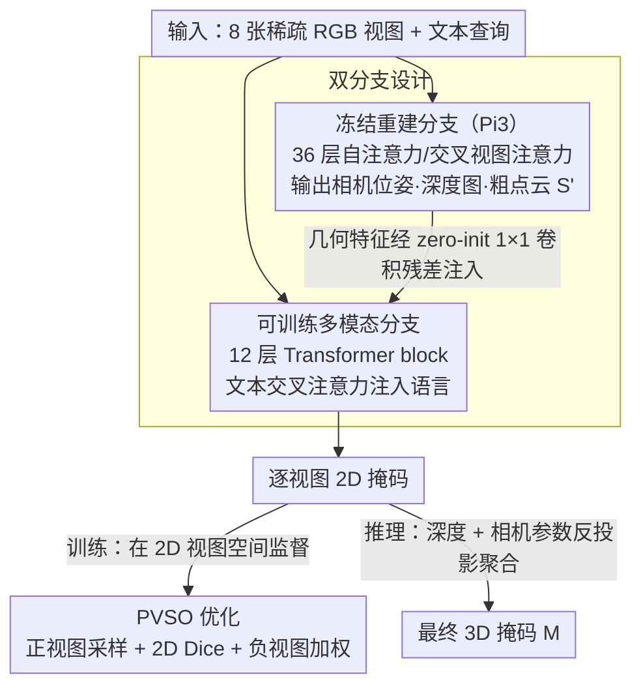

# MVGGT: Multimodal Visual Geometry Grounded Transformer for Multiview 3D Referring Expression Segmentation

**会议**: CVPR 2026  
**arXiv**: [2601.06874](https://arxiv.org/abs/2601.06874)  
**代码**: [https://mvggt.github.io/](https://mvggt.github.io/)  
**领域**: 3D视觉 / 多模态理解  
**关键词**: 3D指代分割, 多视图, 稀疏视图重建, 前景梯度稀释, 语言引导

## 一句话总结

提出 MV-3DRES 新任务（从稀疏多视图 RGB 直接做语言引导的 3D 分割）和 MVGGT 框架（双分支设计融合冻结几何分支 + 可训练多模态分支），通过 PVSO 优化策略解决前景梯度稀释问题，在自建 MVRefer 基准上以 39.9 mIoU 大幅超越基线。

## 研究背景与动机

1. **领域现状**：3D 指代表达分割（3DRES）在稠密高质量点云上已取得很好效果，RG-SAN 等端到端方法可达 44.6 mIoU。
2. **现有痛点**：真实世界的机器人、AR 眼镜、手机等只有几张稀疏 RGB 视图，无法获取稠密点云。现有 3DRES 模型在噪声/不完整的稀疏重建点云上性能崩溃。
3. **核心矛盾**：(a) 纯 2D 方法无法处理深度排序、遮挡和空间关系（"在椅子前面"）；(b) 两阶段"先重建再分割"管线产出的稀疏点云质量差，目标区域退化严重。
4. **本文目标** 定义 MV-3DRES 任务——从稀疏多视图 RGB + 文本直接联合恢复场景结构并分割目标物体。
5. **切入角度**：发现稀疏 3D 监督下 Dice loss 存在**前景梯度稀释（FGD）**问题，提出 PVSO 转移到 2D 视图空间做监督。
6. **核心 idea**：冻结几何分支提供结构先验 + 可训练多模态分支注入语言引导 + PVSO 解决稀疏前景监督不稳定问题。

## 方法详解

### 整体框架

输入 $N=8$ 张 RGB 视图 + 文本查询。两个并行分支：(1) **冻结重建分支**（基于 Pi3）：36 层交替自注意力/交叉视图注意力，输出相机位姿、深度图和粗点云 $S'$；(2) **可训练多模态分支**：12 层 Transformer block，接收重建分支最后 12 层的几何特征注入 + 文本交叉注意力注入，输出语言条件化的视觉特征。最终多模态特征解码为逐视图 2D 掩码，用深度和相机参数反投影聚合到 3D 点云上得到最终 3D 掩码 $M$。训练阶段，PVSO 把监督放在这些 2D 掩码上，规避稀疏 3D 点云的前景梯度稀释。

### 关键设计

**1. 双分支设计：把几何推理和语义理解拆开，互不干扰**

如果让一个网络同时学"场景长什么样"和"哪个物体是被指代的"，两种目标会在训练里互相拉扯——尤其几何先验本身就难学。MVGGT 干脆把几何分支整个冻住，直接用 Pi3 的预训练权重输出稳定的深度和位姿，多模态分支只负责在这套已经成型的空间结构上注入语言。注入的方式刻意做得"无害"：几何特征 $F_l^{\text{geo}}$ 经过一个 zero-initialized 的 $1\times1$ 卷积 $\mathcal{Z}$ 再以残差加进来，

$$F_{l'}^{\text{in}} = F_{l'-1}^{\text{out}} + \mathcal{Z}(F_l^{\text{geo}})$$

由于 $\mathcal{Z}$ 初始为零，训练一开始几何分支对多模态分支的扰动为零，随训练逐渐"长出"有用的连接，避免初期把已经稳定的几何特征打乱。语言则通过每个 block 的标准交叉注意力进入。消融里这种"先把空间建好、再用语言精炼"的后融合（39.9）明显优于早融合（36.1），印证了解耦的价值。

**2. 前景梯度稀释（FGD）分析与 PVSO 优化：把监督从 3D 退回 2D，救活被背景淹没的前景梯度**

这是全文最关键的发现。稀疏视图重建出的点云里，被指代的目标往往只占不到 2% 的点。Dice loss 对单点预测 $p_j$ 的梯度约为 $\partial\mathcal{L}/\partial p_j \approx -2/U$，其中分母 $U$ 由全场点数主导——当背景点压倒性多时，前景点拿到的梯度会被稀释到 $10^{-9}$ 到 $10^{-11}$ 量级，几乎等于不更新，训练直接停滞。PVSO（Positive-View-aware Supervision Optimization）的解法是把监督从稀疏的 3D 点云搬到 2D 视图空间，因为同一个目标投影到某张图像上往往能占到 10–15% 的像素，比 3D 里的 <2% 高出一个数量级，前景梯度随之放大 1–3 个数量级。具体三件事配合：正样本感知采样保证每个 batch 里有足够多包含目标的视图（用最小前景视图比 $\rho_t$ 约束）；2D Dice loss 在这些高前景占比的视图上算；对完全不含目标的负视图施加权重 $w_s = 1/|\mathcal{V}_n|$，既保留必要的负监督又不让负视图把正信号淹掉。消融显示 PVSO 单独就带来 +5.1 mIoU_global（26.9→32.0）。

**3. MVRefer 基准：给"从稀疏视图出发"这件事一把能解耦评分的尺子**

现有 3DRES 评测都默认有一份完美点云，没法衡量"既要重建又要分割"的联合能力。MVRefer 在 ScanRefer + ScanNet 上为每个语言-物体对采样 8 帧，并做可见性验证确保至少 1 帧真的拍到了目标。关键是它把指标拆开看：mIoU_global 在 3D 上评最终掩码，mIoU_view/pos/neg 在 2D 上分别看重建质量和分割质量，这样能区分"是几何没建好"还是"语言没对齐"；再按目标像素占比 <5% / ≥5% 划成 Hard/Easy，单独暴露小目标这个最难的情形。

### 损失函数 / 训练策略

- 总损失：$L_{\text{total}} = L_{\text{BCE}} + \lambda_p L_{\text{PVSO}}$，$\lambda_p = 1$
- PVSO 包含正视图 Dice + 加权负视图 Dice
- AdamW，学习率 $1\times 10^{-4}$，batch size 16，30 epochs，单卡 NVIDIA 4090

## 实验关键数据

### 主实验

**MVRefer 基准**：

| 方法 | Hard mIoU_global | Hard mIoU_view | Easy mIoU_global | Easy mIoU_view | Overall mIoU_global |
|------|-----------------|----------------|-----------------|----------------|---------------------|
| two-stage | 8.1 | 8.6 | 25.8 | 28.2 | 18.5 |
| 2D-Lift | 6.4 | 15.0 | 25.4 | 24.1 | 17.8 |
| **MVGGT** | **24.4** | **67.3** | **50.1** | **70.6** | **39.9** |

**ScanRefer 标准设定 (mIoU)**：

| 方法 | Unique | Multiple | Overall |
|------|--------|----------|---------|
| RG-SAN (GT点云) | 74.5 | 37.4 | 44.6 |
| **MVGGT (仅RGB)** | **65.2** | **33.8** | **39.9** |

### 消融实验

| 配置 | Overall mIoU_global | Overall mIoU_view |
|------|---------------------|-------------------|
| 无 PVSO + 无 MVGGT (2D-Lift) | 17.8 | 20.4 |
| 仅基础网络 | 26.9 | 41.1 |
| + PVSO | 32.0 | 47.5 |
| + PVSO + MVGGT (完整) | **39.9** | **69.3** |

### 关键发现

- PVSO 贡献 +5.1 mIoU_global（26.9→32.0），MVGGT 额外贡献 +7.9（32.0→39.9），两者协同增益最大
- 后融合（Late fusion）效果最好（39.9），优于早融合（36.1）和中融合，验证"先建几何再用语言精炼"的设计直觉
- 最优无目标视图比例 0.5，太少（如0）没有负监督信号、太多（如0.75）正信号被淹没
- 在 Unique 子集上仅用 RGB 就达到 65.2 mIoU，与 GT 点云方法（74.5）的差距只有 9.3

## 亮点与洞察

- **FGD 问题的发现和形式化**非常有价值：这不仅是 MV-3DRES 的问题，任何稀疏 3D 监督场景（如点云补全、稀疏视图语义分割）都可能遇到。PVSO 的"从 3D 退回 2D 做监督"的思路很有借鉴意义
- **冻结几何分支 + zero-init 注入**是一个成本极低但效果显著的设计模式，让大预训练模型的知识"免费"服务于下游任务
- 仅用 8 张 RGB 就能达到 GT 点云方法 90% 的性能（Unique），说明端到端多视图推理的潜力巨大

## 局限与展望

- Overall 39.9 mIoU 与 GT 点云方法（44.6）仍有差距，尤其在 Multiple 场景下差距更大（33.8 vs 37.4）
- Hard 场景（目标 < 5% 像素）的 mIoU_global 仅 24.4，仍不够实用
- 8 帧固定采样策略可能遗漏关键视角，可探索自适应视图选择
- 几何分支完全冻结意味着无法适应特定场景的几何特征

## 相关工作与启发

- **vs 传统 3DRES (TGNN, RG-SAN)**: 这些方法假设 GT 点云可用，效果好但不现实。MVGGT 通道稀疏 RGB 接近它们的性能
- **vs DUSt3R/MASt3R/VGGT**: 这些是多视图重建模型，MVGGT 的几何分支直接复用 Pi3（VGGT 后继），并在其上叠加语言引导的分割能力
- **vs 2D-Lift**: 每视图独立做 2D 分割再反投影，无法处理 3D 一致性和空间关系

## 评分

- 新颖性: ⭐⭐⭐⭐⭐ 定义了新任务、提出新框架、发现新问题（FGD）、建立新基准
- 实验充分度: ⭐⭐⭐⭐ 消融充分但只在 MVRefer 上评测，缺少其他多视图语义理解基准对比
- 写作质量: ⭐⭐⭐⭐⭐ 问题引入清晰，FGD 的数学分析深入浅出，图表设计优秀
- 价值: ⭐⭐⭐⭐⭐ 对 Embodied AI 和 3D 场景理解有重要推动，MV-3DRES 可能成为新的标准任务

<!-- RELATED:START -->

## 相关论文

- [\[CVPR 2026\] GGPT: Geometry-Grounded Point Transformer](ggpt_geometry_grounded_point_transformer.md)
- [\[ICLR 2026\] Quantized Visual Geometry Grounded Transformer](../../ICLR2026/3d_vision/quantized_visual_geometry_grounded_transformer.md)
- [\[CVPR 2025\] VGGT: Visual Geometry Grounded Transformer](../../CVPR2025/3d_vision/vggt_visual_geometry_grounded_transformer.md)
- [\[CVPR 2026\] LongStream: Long-Sequence Streaming Autoregressive Visual Geometry](longstream_long-sequence_streaming_autoregressive_visual_geometry.md)
- [\[CVPR 2026\] FlashVGGT: Efficient and Scalable Visual Geometry Transformers with Compressed Descriptor Attention](flashvggt_efficient_and_scalable_visual_geometry_transformers_with_compressed_descr.md)

<!-- RELATED:END -->
