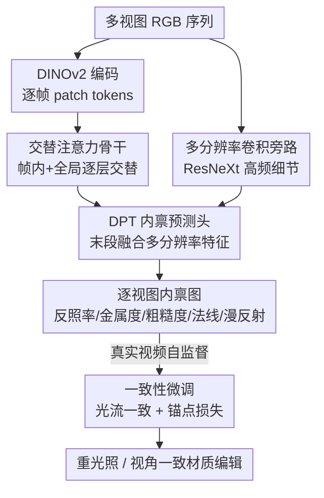

# MVInverse: Feed-forward Multiview Inverse Rendering in Seconds

**会议**: CVPR 2026  
**论文**: [CVF Open Access](https://openaccess.thecvf.com/content/CVPR2026/html/Wu_MVInverse_Feed-forward_Multiview_Inverse_Rendering_in_Seconds_CVPR_2026_paper.html)  
**领域**: 3D视觉 / 逆渲染  
**关键词**: 多视图逆渲染, 前馈预测, 交替注意力, SVBRDF, 一致性微调

## 一句话总结
MVInverse 用一个 VGGT 风格的交替注意力 Transformer，单次前馈就从多视图 RGB 序列里同时预测出逐视图一致的反照率、金属度、粗糙度、法线和漫反射阴影，把过去需要逐场景优化几分钟到几小时的多视图逆渲染压到几秒，并配合自监督一致性微调让模型在真实视频上也稳定不闪烁。

## 研究背景与动机

**领域现状**：逆渲染要从图像里反解出场景的内禀属性——反照率（albedo）、粗糙度（roughness）、金属度（metallic）、法线、光照等，是图形与视觉的基础任务，支撑影视资产重建、AR/VR 虚实融合、机器人材质感知。主流做法分三类：基于可微渲染 / NeRF / 3DGS 的逐场景迭代优化、基于前馈网络的单视图内禀分解、以及基于扩散模型的生成式分解。

**现有痛点**：三类方法各有硬伤。①优化类（NeRF/NeuS/3DGS 逆渲染）虽然高保真，但每个场景都要跑几分钟到几小时的优化，无法实时或规模化。②单视图前馈方法推理快，但天然不管跨视图关系——同一块 3D 表面在不同视角下材质预测会发散，拼成场景就出现明显的视角不一致伪影。③扩散类渲染器质量不错，可生成式的迭代采样同样昂贵，继承了优化方法的速度短板。

**核心矛盾**：速度与一致性/精度难以兼得。要一致就得跨视图联合推理，传统做法只能靠逐场景优化把它"磨"出来；要快就退回单视图前馈，又丢了跨视图约束。

**本文目标**：在单次前馈里既保住跨视图材质一致性，又达到优化级的精度，把多视图逆渲染从"分钟/小时级"做到"秒级"。

**切入角度**：作者注意到前馈 3D 重建（VGGT、Pi3 等 ViT 模型）已经用直接端到端预测取代了冗长优化流程，而多视图逆渲染与多视图重建共享同一结构——都靠反复渲染迭代去求解内禀量（重建求几何、逆渲染求材质）。既然几何可以前馈解，材质也应该能。

**核心 idea**：把前馈重建范式搬进逆渲染——用带交替全局/帧内注意力的 Transformer 直接把多视图输入映射到材质属性，全局注意力隐式关联跨视角的同一 3D 区域来保证一致性，帧内注意力捕捉单图内的长程光照交互，再用多分辨率卷积旁路补回高频细节，最后用真实视频自监督一致性微调补上合成→真实的泛化缺口。

## 方法详解

### 整体框架
给定一段 $N$ 张图像的序列 $S=(I_1,\dots,I_N)$，网络 $f$ 一次前馈就输出每张图对应的五种内禀图：反照率 $A_i$、金属度 $M_i$、粗糙度 $R_i$、相机坐标系法线 $N_i$ 和漫反射阴影 $D_i$，即

$$f\big((I_i)_{i=1}^{N}\big)=(A_i,M_i,R_i,N_i,D_i)_{i=1}^{N}.$$

流程上：每帧先经 DINOv2 编码成 patch tokens，进入一个 VGGT 风格的交替注意力骨干（帧内自注意力与全局自注意力逐层交替），让 token 同时获得"图内长程上下文"和"跨视图一致信息"；同时一条逐帧 ResNeXt 多分辨率卷积旁路抽取高频局部特征，只在解码末段融进 Transformer 流；最后五个 DPT 风格的稠密预测头输出像素对齐的内禀图，漫反射图像由反照率与漫反射阴影相乘得到。整个网络在合成数据上预训练后，再用一段真实视频自监督一致性微调来抑制时序闪烁。

### 关键设计

**1. 交替注意力骨干：用全局注意力隐式对齐跨视角的同一 3D 表面**

痛点直指单视图前馈方法的"各算各的"——同一表面在不同视角材质预测发散。MVInverse 采用一个置换等变的交替注意力 Transformer（结构沿用 VGGT/Pi3 这类前馈重建骨干），把两种互补注意力逐层交替：帧内自注意力（frame-wise）只在单张图内做注意力，捕捉长程空间依赖与局部语义结构；全局自注意力（global）跨所有输入图做注意力，让不同视角的 token 互相引用、互相强化，从而**隐式地把观测到同一底层 3D 表面区域的 token 关联起来，且完全不需要相机位姿监督**。随着两种注意力反复交替，每个 token 既注入了图内上下文推理，又注入了全局一致的跨视图信息，得到结构连贯、视角一致的特征。论文图 2 的注意力热图直接印证了这点：给定第一视图里的查询 patch，第二视图中会高亮出对应的同名表面区域（蓝色：跨视角一致关联）以及空间上很远但光照相关的区域（红色：长程光照交互）。正是这步把"跨视图一致性"从需要逐场景优化磨出来的东西，变成一次前馈里自然涌现的结果。

**2. 多分辨率卷积旁路：给 DPT 头补回高频细节，治住反照率发糊**

逆渲染对空间细节的要求远高于深度/分割——反照率里的高频纹理必须精确还原。作者发现单用 DPT 稠密头会让材质图过度平滑、发糊，尤其是 albedo。为此引入一条辅助的逐帧多分辨率卷积编码器（ResNeXt），从输入图抽取 $\tfrac H4\times\tfrac W4$ 到 $\tfrac H{32}\times\tfrac W{32}$ 等多个分辨率的局部高频结构特征，并**只在解码器最后阶段**通过 skip-connection 注入到各预测头（即 DPT-hybrid 结构）。这样既保住纹理锐度、补回细尺度反射变化，又不打乱前面 Transformer 学到的整体跨视图表示。预测头本身是五个独立的 DPT 风格稠密模块 $P_{i,k}=\text{Head}_k(X_i),\ k\in\{A,M,R,N,D\}$，在输入分辨率上输出像素对齐结果。消融（图 7）显示去掉这条旁路后 albedo 明显变糊，加上后细节与空间连贯性都显著提升。

**3. 一致性微调：用光流一致 + 锚点损失，把合成预训练迁到真实视频且不塌缩**

合成数据上模型已经跨视图一致，但搬到真实视频时同一 3D 区域会出现明显的时序闪烁，根因是真实场景缺少 ground-truth 监督。作者用两阶段方案补这个缺口：合成大规模预训练后，在真实视频上做自监督微调。给定相邻三帧 $(I_0,I_t,I_{t+1})$，用现成光流网络估计 $F_{t+1\to t}$，把预测的材质图 $\hat M_{t+1}$ 按光流 warp 到第 $t$ 帧得到 $\hat M^{\text{warp}}_{t+1\to t}$，再与 $\hat M_t$ 算一致性损失，逼相邻预测在运动下保持一致。但只用一致性约束会塌缩成"时序平滑但语义无意义"的平凡解，于是在第 0 帧加一个锚点损失：让微调模型在该帧的预测去匹配预训练模型的参考输出 $\hat M^{\text{pret}}_0$，把预训练学到的预测能力锚住。总目标为

$$\mathcal L_{\text{finetune}}=\lambda_{\text{anchor}}\,\|\hat M_0-\hat M_0^{\text{pret}}\|_2^2+\|\hat M_t-\hat M^{\text{warp}}_{t+1\to t}\|_2^2,$$

取 $\lambda_{\text{anchor}}=0.1$。一致性项推时序稳定，锚点项防塌缩、保真度，二者配合让模型学到视频稳定的材质预测而不牺牲预训练精度。

### 损失函数 / 训练策略
预训练阶段，反照率、金属度、粗糙度、漫反射阴影都用 MSE 损失 + 多尺度梯度（MSG）损失监督：

$$\mathcal L_{\text{mse}}(P)=\frac1N\sum_{i=1}^N (P_i-P_i^{*})^2,\qquad \mathcal L_{\text{msg}}(P)=\frac1{NM}\sum_{i=1}^N\sum_{l=1}^M (\nabla P_{i,l}-\nabla P^{*}_{i,l})^2,$$

其中 $P\in\{A,M,R,D\}$，$\nabla P_{i,l}$ 是第 $l$ 个尺度上的空间梯度；反照率额外用尺度不变 MSE（细节见原文补充材料）。法线用余弦相似度损失，只约束朝向而非向量模长：$\mathcal L_{\text{normal}}(N_i)=1-\langle \hat N_i,N_i\rangle$。整体目标是各项加权和（论文实测全部权重 $\lambda_*=1$）。训练数据混用 Hypersim、Interiorverse、PRID、Structured3D、Amazon-Berkeley Objects、MatrixCity、CGIntrinsics；由于这些多是合成室内/物体场景、室外泛化弱，作者额外用 DiffusionRenderer 给 Sekai-Drone 的 1,118 段真实视频生成伪反照率标签。

## 实验关键数据

### 主实验

单视图材质估计（Interiorverse 测试集，2672 对图像-材质）：MVInverse 在反照率的 PSNR/SSIM/LPIPS 以及金属度、粗糙度 RMSE 上全面超过扩散类与内禀分解 SOTA。

| 方法 | Albedo PSNR↑ | Albedo SSIM↑ | Albedo LPIPS↓ | Metallic RMSE↓ | Roughness RMSE↓ |
|------|------|------|------|------|------|
| IntrinsicImageDiffusion | 17.4 | 0.80 | 0.22 | 0.21 | 0.26 |
| DiffusionRenderer* | 21.9 | 0.87 | 0.17 | 0.28 | 0.35 |
| **Ours** | **23.0** | **0.92** | **0.09** | **0.14** | **0.17** |

多视图一致性（Hypersim 最后 50 个未见场景，用已知深度+位姿把一视图材质反投影再重投到其他视图，算重叠区 RMSE）：

| 方法 | Albedo RMSE↓ | Metallic RMSE↓ | Roughness RMSE↓ |
|------|------|------|------|
| RGB↔X | 0.1317 | 0.3451 | 0.1813 |
| IntrinsicImageDiffusion | 0.0878 | 0.0734 | 0.0810 |
| DiffusionRenderer | 0.0935 | 0.1250 | 0.1055 |
| **Ours** | **0.0660** | **0.0634** | **0.0259** |

法线估计（零样本，5 个 benchmark）：在 NYUv2 / ScanNet / iBims-1 / Sintel / OASIS 上，MVInverse 在多数指标取得最优，其中四个数据集上拿到最低平均角误差和最高 30° 阈值准确率；少数被反超的情况下也稳居前三，显示跨基准的强泛化。

### 消融实验

| 配置 | 关键现象 | 说明 |
|------|---------|------|
| 完整模型 | 反照率细节锐利、跨视图一致 | 交替注意力 + 多分辨率旁路 + 一致性微调 |
| 去掉多分辨率卷积旁路 | albedo 明显发糊、丢高频纹理（图 7） | DPT 头单独用过度平滑 |
| 微调前 vs 微调后 | 真实视频闪烁显著下降（见下表） | 一致性微调的增益 |

一致性微调效果（DL3DV 100 段真实视频，测相邻帧重投影误差 RMSE）：

| 方法 | Albedo↓ | Metallic↓ | Roughness↓ | Shading↓ |
|------|------|------|------|------|
| Ours（微调前） | 0.0341 | 0.0250 | 0.0119 | 0.0150 |
| Ours（微调后） | **0.0161** | **0.0146** | **0.0084** | **0.0140** |

### 关键发现
- **跨视图一致性是核心卖点**：在专门设计的反投影一致性评测里，MVInverse 在反照率/金属度/粗糙度三个通道 RMSE 全是最低，粗糙度（0.0259）比次优低了一个量级，说明全局注意力确实把"同一表面跨视角材质"约束住了。
- **多分辨率旁路是细节救星**：仅靠 DPT 头会糊，旁路对 albedo 高频纹理恢复贡献最直接——这是逆渲染区别于深度/分割任务、必须强化空间细节的体现。
- **一致性微调把时序闪烁近乎减半**：真实视频上反照率重投影误差 0.0341→0.0161，且靠锚点损失避免了纯一致性约束容易出现的平凡塌缩。
- **效率优势**：整条管线前馈运行，几秒内出全套内禀图并支撑实时 PBR 重光照，相比逐场景优化/扩散采样是数量级的提速。

## 亮点与洞察
- **把前馈重建范式迁到逆渲染**：作者点破"多视图重建求几何、多视图逆渲染求材质，本质都靠反复渲染迭代求解"这一结构同构，于是直接复用 VGGT 式交替注意力骨干——这个类比是全文最漂亮的 motivation，可迁移到任何"传统靠逐场景优化、但其实能端到端预测"的任务。
- **全局注意力当免费的跨视图对齐器**：不需要相机位姿监督，注意力就隐式把同一 3D 区域的 token 关联起来（图 2 热图实证），省掉了显式几何对应这一步。
- **DPT-hybrid 的"末段融合"很务实**：高频卷积特征只在解码末端注入，既补细节又不污染 Transformer 的全局一致表示，是个可复用的稠密预测 trick。
- **锚点损失防塌缩**：自监督一致性训练容易学成"平滑但无意义"，用预训练模型在锚帧的输出当参照把能力钉住，是一个轻量而通用的反塌缩手段。

## 局限与展望
- **作者承认的局限**：受限于材质标注的数量与多样性，模型跨多样场景的泛化仍有天花板；作者寄望于接入更多数据集来突破。
- **真实监督仍是间接的**：真实视频侧的 albedo 标签靠 DiffusionRenderer 生成的伪标签，且一致性微调是自监督——真实场景缺乏 GT，材质精度上限部分受伪标签质量牵制。
- **依赖外部几何/光流**：重光照与材质编辑应用要靠外部深度+位姿（Pi3）和现成光流网络，端到端程度未覆盖到这些环节；一致性评测也用到已知深度与位姿。
- **未报告显式速度数字**：正文只说"几秒"，缺少与优化/扩散基线在统一硬件下的运行时间/显存对照表，"快"的量化论证可以更扎实。
- **法线为相机坐标系**：输出法线定义在相机系而非世界系，下游若需世界系法线仍要额外转换。

## 相关工作与启发
- **vs 单视图内禀分解（IntrinsicImageDiffusion / ColorfulDiffuse / RGB↔X）**：它们前馈快但逐图独立预测，跨视角材质会发散；MVInverse 用全局注意力一次性联合多视图推理，跨视图 RMSE 大幅领先，且单视图精度也更高。
- **vs 扩散类渲染器（DiffusionRenderer）**：扩散方法质量好但迭代采样昂贵，继承优化级速度短板；本文前馈单次出结果，秒级且各项指标更优。
- **vs 优化 / NeRF / 3DGS 逆渲染**：这类逐场景优化精度高但要分钟到小时，且需每个场景重训；MVInverse 无需逐场景优化即可在大相机运动下保持一致分解。
- **vs MAIR / MAIR++**：同样考虑多视图且无需优化，但其适用视角较受限；本文在大相机运动下仍能产出连贯的场景级分解。
- **承袭 VGGT / Pi3**：交替全局-帧内注意力骨干直接借鉴前馈 3D 重建架构，是"重建→逆渲染"范式迁移的具体落点。

## 评分
- 新颖性: ⭐⭐⭐⭐ 把前馈重建范式系统迁到多视图逆渲染、用全局注意力做免位姿跨视图对齐，组合新颖且 motivation 干净，但单组件多为成熟模块的拼装。
- 实验充分度: ⭐⭐⭐⭐ 覆盖单视图/多视图一致性/法线/微调四类评测且自建一致性协议，但缺统一硬件下的速度量化表。
- 写作质量: ⭐⭐⭐⭐ 逻辑链清晰、图 2/图 7 实证到位，类比讲得明白；部分实现细节甩给补充材料。
- 价值: ⭐⭐⭐⭐ 秒级、视角一致的逆渲染对影视/AR-VR/机器人材质获取与实时重光照实用价值高，且开源代码模型。

<!-- RELATED:START -->

## 相关论文

- [\[CVPR 2026\] FUSER: Feed-Forward Multiview 3D Registration Transformer and SE(3)$^N$ Diffusion Refinement](fuser_feed-forward_multiview_3d_registration_transformer_and_se3n_diffusion_refi.md)
- [\[CVPR 2026\] Particulate: Feed-Forward 3D Object Articulation](particulate_feed-forward_3d_object_articulation.md)
- [\[CVPR 2026\] Z-Order Transformer for Feed-Forward Gaussian Splatting](z-order_transformer_for_feed-forward_gaussian_splatting.md)
- [\[CVPR 2026\] PanoVGGT: Feed-Forward 3D Reconstruction from Panoramic Imagery](panovggt_feed-forward_3d_reconstruction_from_panoramic_imagery.md)
- [\[CVPR 2026\] SGS-Intrinsic: Semantic-Invariant Gaussian Splatting for Sparse-View Indoor Inverse Rendering](sgs-intrinsic_semantic-invariant_gaussian_splatting_for_sparse-view_indoor_invers.md)

<!-- RELATED:END -->
