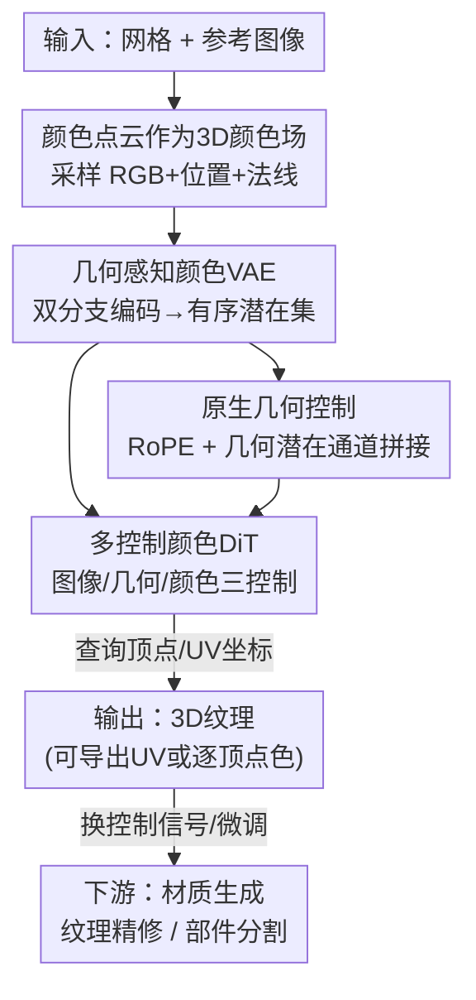

# NaTex: Seamless Texture Generation as Latent Color Diffusion

**会议**: CVPR 2026  
**论文**: [CVF Open Access](https://openaccess.thecvf.com/content/CVPR2026/html/Lai_NaTex_Seamless_Texture_Generation_as_Latent_Color_Diffusion_CVPR_2026_paper.html)  
**代码**: 项目页 https://natex-ldm.github.io （代码待确认）  
**领域**: 3D视觉 / 纹理生成 / 扩散模型  
**关键词**: 3D纹理生成, 颜色点云, 潜在扩散, 几何控制, DiT

## 一句话总结
NaTex 把"给 3D 网格上色"重新定义成在 3D 空间里直接预测颜色场——用一个几何感知的颜色点云 VAE 把纹理压成有序潜在集合，再用多控制 DiT 做潜在颜色扩散，彻底绕开多视图扩散（MVD）烘焙路线在遮挡、对齐和跨视图一致性上的固有缺陷，在纹理连贯性和对齐上显著超过此前方法。

## 研究背景与动机

**领域现状**：当前给 3D 资产自动上色的主流做法是"多视图纹理"（multi-view texturing）。流程很直观：先用几何条件化的多视图扩散模型（MVD）从若干视角生成与几何对齐的 2D 图像，再用相机参数把这些 2D 图反投影、烘焙（baking）回 3D 表面。它的最大好处是能直接复用预训练的强大 2D 图像生成模型，所以质量和多样性都不错，已经是大量研究和商业产品（Rodin、Tripo、Hunyuan3D 等）的事实标准。

**现有痛点**：但 2D 提升（2D lifting）这条路有三个绕不开的硬伤——(1) 遮挡区域缺乏稳健的补全方案，任何视角集合都无法覆盖全部表面，补全（inpainting）做不好就会出现鬼影、错误填充；(2) 纹理特征和精细几何细节难以精确对齐，潜空间扩散本身带来误差、2D 法线控制又不够精确，边界处常常错位；(3) 多视图之间在内容、颜色、光照上的一致性难以维持，连 SOTA 视频模型都搞不定。这些误差会在投影和烘焙阶段层层累积，最终在贴图上显形。

**核心矛盾**：根本原因在于**模态变化（modality change）带来的级联误差**。把 3D 形状投影到 2D 视图天然会丢信息（深度/法线图丢掉遮挡区域和结构细节），再从有限的 2D 视图烘焙回 3D，信息损失和不一致是结构性的、不可避免的。即便有些工作改用 UV 图、点特征、Gaussian Splatting 等代理表示，仍然受困于数据低效和级联误差。

**本文目标**：能不能把 3D 纹理当作"一等公民"，直接在 3D 空间里原生生成颜色，从源头消除模态变化？并且让这个范式像图像/视频/几何生成那样可扩展（scalable）。

**切入角度**：作者观察到潜在扩散（latent diffusion）在图像、视频、3D 形状生成上都极其成功，唯独"纹理生成"还没人用它。如果能把纹理表示成一种可以做扩散的 3D 表示，就能把整个成功范式搬过来。

**核心 idea**：把纹理看成"稠密颜色点云"——也就是 3D 空间里的一个连续颜色场 $f(x)=c$（给定坐标 $x\in\mathbb{R}^3$ 预测颜色 $c\in\mathbb{R}^3$），然后用**潜在颜色扩散**（latent color diffusion）来生成它。配套两件套：几何感知颜色 VAE + 多控制颜色 DiT，全部用 3D 数据从零训练。

## 方法详解

### 整体框架
NaTex 沿用标准的潜在扩散两段式结构，但把作用对象从图像/UV 换成了 3D 颜色点云。输入是一个网格（来自艺术家或 Hunyuan3D 等几何生成器）加一张参考图像，输出是直接长在表面上的纹理（可解码成 UV 贴图，也可直接查询逐顶点/逐面颜色）。

整条管线分两块：(1) **几何感知颜色 VAE** 负责"压缩与重建"——把从带纹理网格上采样的颜色点云（含 RGB、位置、法线，$P_c\in\mathbb{R}^{N\times 9}$）编码成一组有序潜在向量，同时由一个并行的几何分支提取形状线索来引导颜色压缩；解码时在任意坐标查询即可还原颜色场。(2) **多控制颜色 DiT** 在这个潜在空间里做整流流（rectified flow）扩散，灵活接收图像控制、几何控制、颜色控制三类信号，生成纹理潜在集合。推理时先把 UV 坐标/顶点位置转成点云、采法线，经几何分支编码得到几何潜在与对应位置，再连同输入图像喂给生成器采样出纹理。

### 关键设计

**1. 颜色点云作为 3D 原生颜色场：从源头消灭模态变化**

这是全文的范式基石，直接回应"模态变化带来级联误差"这个核心矛盾。以往方法要么在投影 2D 图像空间建模，要么在 UV 空间建模，都需要先把 3D 投影成 2D（丢信息）或依赖 UV 展开质量。NaTex 反其道而行，把纹理定义成 3D 空间里的连续颜色场：从带纹理网格稠密采样颜色点云，目标是学一个映射 $f(x)=c$，给任意 3D 坐标预测 RGB。因为颜色直接长在几何表面上，遮挡区域天然被覆盖、**不再需要 inpainting**；又因为不经过 2D 投影，不存在跨视图一致性问题；相比 UV 空间，它不依赖 UV 质量、表示更结构化连贯，也更适合做生成建模。更妙的是这个表示是"通用容器"——任何能写成类 RGB 的模态都能塞进同一潜空间：PBR 材质把金属度/粗糙度映射成改过的 albedo（蓝通道固定为 0）、语义部件分割把离散标签映射成颜色值，于是材质、外观、语义都能在一套框架里处理。

**2. 几何感知颜色 VAE：用紧耦合几何分支引导颜色压缩，换来 80× 压缩**

直接在稠密颜色点云上做扩散计算量太大，所以需要先压缩；但纹理生成有个独特难题——怎么在生成时注入精细的几何条件。NaTex 借鉴 3DShape2VecSet 的 VecSet 架构，但做了两处关键改造。其一，**有序潜在集**：原版做形状自编码、潜在集是无序的，而 NaTex 的点查询（point queries）在测试时是已知的、从输入几何上采样得到，所以潜在集天然有序，这才使"逐点的几何条件"成为可能。其二，**双分支紧耦合**：不另起一个独立的 ShapeVAE 去编码几何，而是在颜色 VAE 旁并行加一个几何 VAE 分支——几何编码器只吃位置和法线，颜色编码器吃位置+法线+颜色三件套；几何分支产出的几何潜在集被当作 query 去引导颜色编码器，让形状线索深度参与颜色压缩。两个分支共用 Hunyuan3D-VAE 的骨干（多层交叉注意力+自注意力），联合优化。训练损失含三项（式 2）：

$$L = \lambda_{KL}L_{KL} + \lambda_{color}L_{color} + \lambda_{udf}L_{UDF}$$

其中 $L_{color}$ 同时监督**表面上**和**近表面**的查询点（近表面点通过沿法线方向在阈值 $\gamma$ 内随机偏移得到），保证颜色场在表面附近也连续；$L_{UDF}$ 用截断 UDF（式 1，$o(x)$ 在 $udf(x)>s$ 时取 1、否则取 $udf(x)/s$），之所以用 UDF 而非标准 SDF，是因为把颜色点云和水密网格（SDF 所需）对应起来非常麻烦。这套设计让自编码器达成 **80× 以上压缩**，为后续 DiT 扩展铺平了路；且 VAE 支持任意分辨率解码，可灵活输出 UV 贴图或逐顶点/逐面颜色。

**3. 原生几何控制：把表面线索成对注入 DiT，实现近乎完美的几何对齐**

多视图纹理只能用"碎片化"的几何控制（逐视图法线/位置），还得设计复杂的一致性模块去缝合，且单视图投影下许多 3D 结构本就有歧义。NaTex 提出原生几何控制，包含两条互补的注入方式：(1) 在采样点查询的位置上施加 **RoPE** 位置编码，提供粗粒度的结构引导；(2) 把 VAE 几何分支得到的**几何潜在集**作为额外嵌入提供细粒度引导——关键在于几何潜在集与纹理潜在集是**同构（isomorphic）**的（因为来自同一组有序点查询），于是可以沿**通道维直接拼接**到带噪纹理潜在上，实现逐点的几何引导，而且序列长度不变。正是这种"几何 token 与颜色 token 深度交织"的设计，让模型在生成颜色时持续受到精确表面提示约束，从而在几何边界处实现别的方法做不到的对齐。

**4. 多控制颜色 DiT：三类控制信号统一进一个生成器，撑起一整套下游应用**

生成器采用类似整流流 DiT（rectified flow transformer）的架构，配双流块（double stream）+ 单流块（single stream）。它能灵活吃三类控制：**图像控制**用 Dinov2-Giant 取最后一层（去掉 class token）的嵌入，并把输入分辨率提到 1022（比 Hunyuan3D-2 的 518 更高，利于抓细节），同时用二值 mask 裁剪物体以保持原始长宽比、压短 image token；**几何控制**即上面的 RoPE + 几何潜在通道拼接；**颜色控制**则把一张初始纹理也采成颜色点云、过 VAE 得到条件颜色潜在集，同样沿通道维拼接进去，序列长度不变却提供更强引导。训练用流匹配（flow matching）损失；做 albedo 生成时还借鉴 MaterialMVP 加一项光照不变损失（式 3）：

$$L = \|\epsilon_{pred}-\epsilon_{gt}\|_2^2 + \gamma\|\epsilon_{pred}-\epsilon_{pred2}\|_2^2$$

其中 $\epsilon_{pred}$、$\epsilon_{pred2}$ 是对不同光照输入图像的预测，约束模型对光照不敏感。正是"颜色控制"这一开关，让同一个框架在几乎零改动下覆盖纹理生成、材质生成、纹理精修/补全、部件分割与部件上色等多种任务——其中部件分割甚至可以**训练无关（training-free）**：把输入图像的 2D 分割喂进去，模型就能生成与 3D 部件分割对齐的纹理图。

### 损失函数 / 训练策略
VAE 阶段联合优化 KL、颜色回归（表面+近表面双监督）、截断 UDF 三项损失（式 1、2）；DiT 阶段用流匹配损失，albedo 任务额外加光照不变项（式 3）。训练时把颜色点云过 VAE 得到对齐的几何潜在与纹理潜在，每个 token 关联一个位置用于对带噪纹理潜在施加 RoPE。作者训练了 **NaTex-2B**，主攻纹理生成、并适配到上述各应用做初步验证。一个有意思的现象是：模型最多用 6144 token 训练，但推理时支持不同 token 数和采样步数，且**无需蒸馏就能做到一步（one-step）生成**——作者归因于强条件信号。

## 实验关键数据

### 主实验

重建质量随潜在集尺寸增大稳定提升（Table 1），注意模型只用 6144 token 训练，但放大潜在尺寸仍能涨点（指标带 ∗ 表示在六个正交渲染视图上计算）：

| 潜在尺寸 | PSNR↑ | PSNR↑∗ | SSIM↑∗ | LPIPS↓∗ |
|---------|-------|--------|--------|---------|
| 6144 × 64 | 28.74 | 31.70 | 0.980 | 0.0492 |
| 12288 × 64 | 29.95 | 33.19 | 0.984 | 0.0445 |
| 24576 × 64 | 30.86 | 34.30 | 0.987 | 0.0411 |

图像条件纹理生成（仅比 albedo，沿用 MaterialMVP 的测试集与协议）上 NaTex 在 cFID、CMMD、LPIPS 上全面领先（Table 2）：

| 方法 | cFID↓ | CMMD↓ | CLIP↑ | LPIPS↓ |
|------|-------|-------|-------|--------|
| Paint3D | 26.86 | 2.400 | 0.887 | 0.126 |
| TexGen | 28.23 | 2.447 | 0.882 | 0.133 |
| Hunyuan3D-2 | 26.43 | 2.318 | 0.889 | 0.126 |
| RomanTex | 24.78 | 2.191 | 0.891 | 0.121 |
| MaterialMVP | 24.78 | 2.191 | **0.921** | 0.121 |
| **NaTex (Ours)** | **21.96** | **2.055** | 0.908 | **0.102** |

### 消融实验

| 配置 | 现象 | 说明 |
|------|------|------|
| 完整模型 | 纹理与图像、几何均良好对齐 | RoPE + 紧耦合几何嵌入都在 |
| w/o RoPE | 图像-纹理对齐变差（如房屋雨棚条纹、红绿灯颜色错位） | 去掉点查询位置上的 RoPE |
| 用独立 ShapeVAE 的几何嵌入替换紧耦合嵌入 | 纹理-几何对齐变差，颜色有时扩散外溢（如椅背） | 验证"紧耦合"几何分支的必要性 |

### 关键发现
- **几何对齐是 NaTex 最突出的优势**：可视化对比里其他方法（含 Rodin-Gen2、Tripo 3.0 等闭源商业模型）普遍在几何边界处错位，即便在无遮挡区域（如人物角色）也会出现星星、纽扣等错位 artifact，而 NaTex 近乎完美对齐。
- **两条几何条件各司其职**：RoPE 主要改善"图像-纹理"对齐，紧耦合几何嵌入主要改善"纹理-几何"对齐；二者缺一都会掉效果，且独立 ShapeVAE 的嵌入不如与颜色 VAE 紧耦合的嵌入。
- **强条件带来"白送"的高效推理**：token 越多质量/对齐越好，但未经蒸馏就能一步生成；精修/补全任务只需 5 步，非常适合需要快速智能修补的下游场景。
- **神经补全优于传统补全**：在遮挡窗口区域，相比 OpenCV 插值补全，NaTex 的颜色控制能生成更干净、对齐更好的纹理。

## 亮点与洞察
- **范式级的重定义**：把"纹理"从 2D 图像/UV 重新表述为"3D 稠密颜色点云=连续颜色场"，一举消解遮挡补全、跨视图一致性、几何对齐三大结构性难题——这是"换表示"而非"打补丁"，最让人"啊哈"。
- **VecSet 的有序化是关键技巧**：把潜在集从无序改成有序（因点查询测试时已知），看似细节，却是逐点几何条件能成立的前提，可迁移到任何"需要逐点条件的 3D 生成"任务。
- **同构 → 通道拼接**：几何潜在与纹理潜在同构，于是几何引导可以零额外序列开销地"贴"进噪声潜在，这种"让条件与目标共享 token 拓扑再通道拼接"的思路很优雅，可借鉴到其他多条件扩散。
- **一个 VAE 装下外观/材质/语义**：把 PBR、部件标签都映射成类 RGB 值塞进同一潜空间，于是"换控制信号"就能切换任务、甚至 training-free 做部件分割，框架复用度极高。

## 局限与展望
- **依赖输入几何质量**：NaTex 是给定网格上色，几何本身来自 Hunyuan3D 2.5 等外部生成器；几何错误/低质会直接限制纹理上限，论文未深入讨论几何噪声下的鲁棒性。
- **全部从零用 3D 数据训练**：放弃了 2D 提升路线复用海量 2D 预训练模型的红利，纹理多样性/泛化是否能追上"借力 2D 大模型"的方法，长期看取决于 3D 纹理数据规模，论文未给数据量细节。
- **下游应用多为"初步验证"**：材质生成、部件分割等只做了 primary verification，缺乏与各任务专用 SOTA 的系统定量对比。
- **评测仅比 albedo**：主对比聚焦 albedo，完整 PBR（金属度/粗糙度等）下的质量与一致性缺少量化证据。

## 相关工作与启发
- **vs 多视图扩散纹理（Hunyuan3D-2 / RomanTex / MaterialMVP / Paint3D / TexGen）**：它们走"2D 多视图生成→反投影烘焙"，受困于遮挡补全、边界错位、跨视图不一致；NaTex 直接在 3D 颜色场生成，从源头规避这些 2D 提升的级联误差，在 cFID/CMMD/LPIPS 上全面领先，对齐尤其碾压。
- **vs 其他原生 3D 纹理生成（TexGaussian / TexOct / TexGarment / Trellis / UniTEX）**：它们多依赖代理表示（octree、把 UV 当图像、triplane、SLAT），受限于分辨率或数据效率；NaTex 把纹理直接表示为颜色点云并纳入可扩展的潜在扩散范式，是首个用原生潜在扩散做纹理生成的工作。
- **vs SDS / 大重建模型**：早期 SDS、大重建模型也算原生纹理生成，但通常几何+纹理同时生成、质量受限且有 Janus 问题；NaTex 专注高质量纹理、且把范式做得"像普通潜在扩散一样简单"。
- **架构血缘**：VAE 借鉴 3DShape2VecSet / Hunyuan3D-VAE（但改成颜色+有序潜在），DiT 借鉴整流流 Transformer，图像条件用 Dinov2，albedo 光照不变损失来自 MaterialMVP——是把成熟 2D/3D 生成组件迁移重组到"3D 颜色场"这一新表示上的典范。

## 评分
- 新颖性: ⭐⭐⭐⭐⭐ 首个把纹理生成做成 3D 原生潜在颜色扩散，范式级创新而非增量调参
- 实验充分度: ⭐⭐⭐⭐ 重建/生成主对比 + 几何条件消融扎实，但下游应用多为初步验证、缺完整 PBR 量化
- 写作质量: ⭐⭐⭐⭐⭐ 动机推导清晰、把"为什么必须原生 3D"讲透，图文（架构图/对比图）配合到位
- 价值: ⭐⭐⭐⭐⭐ 直击 3D 资产上色的痛点、对齐效果显著、框架可扩展到材质/分割，对工业纹理管线有实用价值

<!-- RELATED:START -->

## 相关论文

- [\[CVPR 2026\] MatLat: Material Latent Space for PBR Texture Generation](matlat_material_latent_space_for_pbr_texture_generation.md)
- [\[CVPR 2026\] CaliTex: Geometry-Calibrated Attention for View-Coherent 3D Texture Generation](calitex_geometry-calibrated_attention_for_view-coherent_3d_texture_generation.md)
- [\[CVPR 2026\] StableMTL: Repurposing Latent Diffusion Models for Multi-Task Learning from Partially Annotated Synthetic Datasets](stablemtl_repurposing_latent_diffusion_models_for_multi-task_learning_from_parti.md)
- [\[CVPR 2026\] Color-Encoded Illumination for High-Speed Volumetric Scene Reconstruction](color-encoded_illumination_for_high-speed_volumetric_scene_reconstruction.md)
- [\[CVPR 2026\] CraftMesh: High-Fidelity Generative Mesh Manipulation via Poisson Seamless Fusion](craftmesh_high-fidelity_generative_mesh_manipulation_via_poisson_seamless_fusion.md)

<!-- RELATED:END -->
