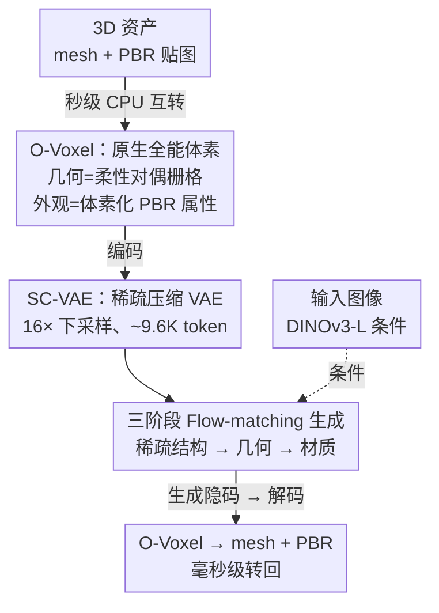

# Native and Compact Structured Latents for 3D Generation

**会议**: CVPR 2026 (Best Student Paper)  
**arXiv**: [2512.14692](https://arxiv.org/abs/2512.14692)  
**代码**: [GitHub](https://github.com/microsoft/TRELLIS.2)（已开源；即 TRELLIS.2，模型 TRELLIS.2-4B 已上 HuggingFace）  
**项目页**: [microsoft.github.io/TRELLIS.2](https://microsoft.github.io/TRELLIS.2/)  
**Demo**: [HuggingFace Spaces - TRELLIS.2](https://huggingface.co/spaces/microsoft/TRELLIS.2)  
**领域**: 3D视觉  
**关键词**: 3D生成, 原生3D隐空间, 稀疏体素, PBR材质, Flow Matching

## 一句话总结

本文是 TRELLIS 原班团队的续作 TRELLIS.2，提出一种从原生 3D 数据直接学习的结构化隐空间表示。其核心是无场（field-free）的全能体素 O-Voxel，用柔性对偶栅格统一编码任意拓扑的几何与 PBR 材质；再配一个稀疏压缩 VAE（SC-VAE）做到 16× 空间下采样，把 1024³ 全纹理资产压成约 9.6K token。最后训练约 4B 参数的三阶段 Flow-matching 模型做图生 3D，在重建保真度、材质质量和生成速度上都大幅超越现有方法。

## 研究背景与动机

**领域现状**：近两年大规模 3D 生成（CLAY、TRELLIS、Dora、Direct3D、SparseFlex 等）发展极快，主流范式是先把 3D 资产编码成紧凑隐空间，再在隐空间里训练 latent 生成模型，重建与生成质量都已接近工业可用。

**现有痛点**：瓶颈卡在「表示」这一层。其一，几何表示几乎都基于等值面场（SDF、Flexicubes 等），天然处理不了开放表面、非流形几何和封闭内部结构，且需要 SDF 求值、flood-fill、迭代优化等昂贵预处理。其二，多数工作只做形状、忽略与形状强相关的外观与材质；即便 TRELLIS 联合建模几何与外观，它依赖多视图 2D 图像特征作为输入、并以纯渲染监督来学，导致复杂结构和材质捕捉不足。其三，基于稀疏体素的结构化隐空间（TRELLIS、SparseFlex）几何精度高，但 token 数巨大（SparseFlex 1024³ 要 22.5 万 token），压缩率低、难扩到高分辨率。

**核心矛盾**：「无结构隐空间」（Perceiver 风格的 3DShape2VecSet/CLAY 系）压缩率高但重建保真度受限；「结构化稀疏隐空间」保真度高但 token 太多、压缩率低。两条路线都没能既紧凑又高保真，而且都绕开了「直接从原生 3D 数据学外观/材质」这件事。

**本文思路**：目标是造一个能忠实承载任意 3D 资产「全谱信息」（任意拓扑几何 + 完整材质）、又能被神经网络高效压成紧凑隐空间的原生 3D 表示，支撑高分辨率、端到端、形状-材质对齐的生成。为此，本文抛弃等值面场，回到「体素 + 对偶栅格」这种显式、可与 mesh 即时互转的离散结构，把几何和材质都「装进」稀疏体素——这就是无场全能体素 O-Voxel；再借 2D 图像 DC-AE 的残差自编码思想配一个高压缩比的稀疏卷积 VAE（SC-VAE）学出紧凑的「原生结构化隐空间」，最后在其上跑三阶段 Flow-matching 直接生成全纹理 3D 资产。

## 方法详解

### 整体框架

方法围绕三件事层层搭起来：先定义一种能装下任意几何与材质的原生 3D 表示（O-Voxel），再学一个把它高度压缩的隐空间（SC-VAE），最后在隐空间里训练生成模型（三阶段 Flow DiT）。输入一张图像，模型在紧凑隐空间里依次生成「占用结构 → 几何 → 材质」三组隐码，解码回 O-Voxel，再毫秒级转回带 PBR 材质的 mesh。这三块也正是论文 Sec 3.1 / 3.2 / 3.3 的顺序。

### 关键设计

**1. O-Voxel：用无场全能体素原生编码任意拓扑几何与 PBR 材质**

针对「场表示处理不了开放/非流形/封闭表面，且只管几何」这个痛点，O-Voxel 把每个活跃稀疏体素表示成一组特征元组 $\boldsymbol{f}=\{(\boldsymbol{f}^{\text{shape}}_i,\boldsymbol{f}^{\text{mat}}_i,\boldsymbol{p}_i)\}_{i=1}^L$，几何和材质同栅格对齐，空体素置为非活跃。

几何侧靠**柔性对偶栅格（Flexible Dual Grid）**，思路源自对偶等值面提取（Dual Contouring），但关键区别是**完全不用任何场**：直接拿 mesh 表面来判定体素边与表面的交点、并赋 Hermite 数据（交点 $\boldsymbol{q}_i$ 与法向 $\boldsymbol{n}_i$），凡与 mesh 相交的边就激活对应对偶面。每个活跃体素的几何特征 $\boldsymbol{f}^{\text{shape}}_i$ 含三样：对偶顶点 $\boldsymbol{v}_i\in\mathbb{R}^3_{[0,1]}$、沿 X/Y/Z 三条预定义边的交点标志 $\boldsymbol{\delta}_i\in\{0,1\}^3$、以及切分权重 $\gamma_i$（三者各自的作用见下文重建部分）。对偶顶点 $\boldsymbol{v}$ 由一个二次误差函数（QEF）闭式求解：

$$\min_{\boldsymbol{v}\in\text{voxel}} e(\boldsymbol{v})=\sum_i d_{\Pi,i}^2 + \lambda_{\text{bound}}\sum_j d_{L,j}^2 + \lambda_{\text{reg}}\, d_{\hat{\boldsymbol{q}}}^2 .$$

第一项 $d_{\Pi,i}^2=(\boldsymbol{n}_i\cdot(\boldsymbol{v}-\boldsymbol{q}_i))^2$ 是原版 DC 就有的点-平面距离；本文新增第二项（顶点到 mesh 开放边界边的距离）专门把对偶顶点拉向边界、改善开放表面表达，第三项（顶点靠近交点均值 $\bar{\boldsymbol{q}}$）做正则、稳住 QEF 求解避免奇异。由此带来三个直接好处：mesh↔O-Voxel **即时双向互转**（无需 SDF 求值/flood-fill/迭代优化，几秒级 CPU 转入、几十毫秒转出）；**任意拓扑**（不受水密/流形约束，能处理自相交和封闭内腔）；**保边保锐**（对偶顶点天然贴合几何特征，且 $\boldsymbol{v}$、$\gamma$ 可被网络用渲染损失进一步微调）。

上面是 mesh → O-Voxel 的「编码」；**反过来 O-Voxel → mesh** 则是把这三样特征「读出来」拼网格：先看每个体素的交点标志 $\boldsymbol{\delta}_i$ 定下哪些相邻对偶顶点该连成四边形面——$\boldsymbol{\delta}$ 编码的正是重建网格的连接拓扑；再把这些对偶顶点 $\boldsymbol{v}_i$ 连起来组成四边形，最后按切分权重 $\gamma_i$ 把每个四边形自适应剖成两个三角形以贴合局部几何，即得三角网格——全程几十毫秒、无迭代无场求值。一句话：$\boldsymbol{v}$ 管顶点放哪、$\boldsymbol{\delta}$ 管谁连谁、$\gamma$ 管怎么三角化，凑齐就能无损还原 mesh。

材质侧是**体素化 PBR 属性**：每个活跃体素存 6 通道 $\boldsymbol{f}^{\text{mat}}_i=(\boldsymbol{c}_i,m_i,r_i,\alpha_i)$——基色、金属度、粗糙度、不透明度，超出「只有纹理颜色」的范畴，尤其 $\alpha$（不透明度）让它能表达半透明材质（玻璃等），这是以往方法没有的。贴图↔O-Voxel 转换是简单快速的投影采样 + 三线性插值，转回的 mesh 直接可渲染、无需任何后处理。

**2. SC-VAE：稀疏卷积 + 残差自编码，把 O-Voxel 压到 16×**

要支撑高分辨率生成，隐空间必须够紧凑。SC-VAE 是一个 U 形、**全稀疏卷积**的 VAE（不同于 TRELLIS/SparseFlex 用 Transformer），在高分辨率下计算高效、跨尺度泛化好，实现了体素类方法少见的 **16× 空间下采样**——把 1024³ 全纹理资产编码成仅约 9.6K token 而几乎无感知损失。它靠三个组件做到「高压缩还不掉质量」：

其一，**稀疏残差自编码层**：把 2D 图像 DC-AE 的残差自编码搬到稀疏体素上，在下/上采样块里加非参数残差捷径，在空间维与通道维之间重排信息来缓解强压缩下的优化难题。下采样（因子 2）把每个体素的 8 个子节点聚到通道维：$F_{\text{coarse}}^{\text{raw}}=\operatorname{stack}(F_{\text{child}_1},\dots,F_{\text{child}_8})\in\mathbb{R}^{8C}$，再 $\operatorname{avg\_groups}$ 成 $\mathbb{R}^{C'}$（缺失体素贡献零向量）；上采样对称地把通道散回邻域。其二，**早剪枝上采样器**：每次上采样前先预测二值掩码 $\boldsymbol{\hat{\rho}}\in\{0,1\}^8$ 指出哪些子体素活跃，非活跃节点直接跳过，大幅省时省显存。其三，**优化残差块**：稀疏卷积在高稀疏数据上算力/参数利用率低，于是仿 ConvNeXt 把「两层卷积」简化为「一层卷积 + 宽 point-wise MLP」（类比 Transformer 的 FFN），在不增加开销的前提下提升非线性表达与重建质量。

此外，为支持「先形状后材质」的顺序生成（也便于给定形状单独生成材质），论文训练**两个解耦的 SC-VAE**：一个建模形状，另一个在形状 VAE 上采样的剖分结构条件下建模材质。

**3. 三阶段 Flow-matching 原生生成：稀疏结构 → 几何 → 材质**

在学好的隐空间里，论文沿用 TRELLIS 的整体设计、用 Flow Matching 训练全 DiT，把生成拆成三个模型、三个阶段：① 稀疏结构生成，预测稀疏体素栅格的占用布局；② 几何生成，在活跃体素内产出几何隐码；③ 材质生成，产出与几何结构对齐的材质隐码。前两阶段基本承袭 TRELLIS，构成资产的几何骨架；**第三阶段是新增的关键**——一个稀疏 DiT 以「输入图像 + 已生成几何隐码」为联合条件，直接在原生 3D 空间里建模 PBR 材质，从而把几何与材质统一到同一个原生 3D 隐空间、保证二者在任意拓扑下都空间对齐，彻底摆脱了以往「生成 mesh 后再多视图烘焙贴图」的视角相关后处理。

实现上，DiT 用 AdaLN-single 调制 + RoPE 提升可扩展性与跨分辨率泛化，图像条件特征取自 DINOv3-L。得益于 SC-VAE 的高压缩，稀疏 DiT 砍掉了 TRELLIS 里的卷积打包与跳连，退化成更简单高效的 vanilla DiT；每个 DiT 约 1.3B 参数（宽 1536、30 层、12 头、MLP 宽 8192），全框架合计约 4B。训练采**渐进式**策略：先用 512×512 条件图学粗占用先验，再把几何/材质生成器从 512³ 输出（32³ 隐分辨率）逐步放大到 1024³ 输出（64³ 隐分辨率），条件图同步升到 1024。

### 损失函数 / 训练策略

SC-VAE 分两阶段训练。第一阶段在低分辨率上用直接的 O-Voxel 重建损失 + KL 快速稳住学习：几何上对对偶顶点 $\boldsymbol{v}$ 用 MSE、对对偶面标志 $\boldsymbol{\delta}$ 用 BCE，材质 $\boldsymbol{f}^{\text{mat}}$ 用 L1、剪枝掩码 $\boldsymbol{\rho}$ 用 BCE：

$$\mathcal{L}_{\text{s1}}=\lambda_{\text{v}}|\hat{\boldsymbol{v}}-\boldsymbol{v}|_2^2+\lambda_{\delta}\operatorname{BCE}(\hat{\boldsymbol{\delta}},\boldsymbol{\delta})+\lambda_{\boldsymbol{\rho}}\operatorname{BCE}(\hat{\boldsymbol{\rho}},\boldsymbol{\rho})+\lambda_{\text{mat}}|\hat{\boldsymbol{f}}^{\text{mat}}-\boldsymbol{f}^{\text{mat}}|_1+\lambda_{\text{KL}}\mathcal{L}_{\text{KL}} .$$

第二阶段在高分辨率上加渲染感知监督 $\mathcal{L}_{\text{s2}}=\mathcal{L}_{\text{s1}}+\mathcal{L}_{\text{render}}$：渲染 mask/深度/法向用 L1 监督、法向额外加 SSIM 与 LPIPS，材质属性也一并渲染并以感知损失监督；相机随机放置且近平面很浅、切过表面，逼模型同时学好外部与内部结构。生成模型用 AdamW（lr $1\times10^{-4}$、weight decay 0.01）+ classifier-free guidance（drop 0.1）训练。

## 实验关键数据

### 主实验

形状重建在 Toys4K 与 Sketchfab Featured 两个未见测试集上对比 Dora、TRELLIS、Direct3D-S2、SparseFlex。论文用三组指标：**MD**（Mesh Distance，双向点-到-mesh 距离 + F1，**含内部结构**，越低越好）、**CD**（Chamfer Distance + F1，只在可见**外表面**采点算，越低越好）、以及渲染**法向图的 PSNR/LPIPS**（衡量表面质量）。下表摘录最直观的法向 PSNR/LPIPS（解码时间在 A100 上测）：

| 方法 | #Token | 下采样 | 解码(s) | Toys4K 法向 PSNR↑ | Toys4K LPIPS↓ | Sketchfab 法向 PSNR↑ | Sketchfab LPIPS↓ |
|------|--------|--------|---------|-------------------|----------------|----------------------|-------------------|
| TRELLIS | 9.6K | 4× | – | 30.29 | 0.067 | 24.31 | 0.110 |
| Direct3D-S2 1024 | 17K | 8× | – | 27.38 | 0.134 | 23.82 | 0.138 |
| SparseFlex 1024 | 225K | 4× | 3.21 | 37.34 | 0.042 | 32.12 | 0.036 |
| **本文 512** | 2.2K | 16× | 0.077 | 39.54 | 0.013 | 31.00 | 0.034 |
| **本文 1024** | 9.6K | 16× | 0.301 | **43.11** | **0.005** | **35.26** | **0.013** |

本文 1024³ 仅用 9.6K token（与 TRELLIS 同量、是 SparseFlex 1024 的 1/23），却在每项指标上大幅领先，解码也快一个数量级（0.301s vs SparseFlex 3.21s）。更关键的是 MD 与 CD 的分工恰好坐实了「能建内部结构」这一卖点：基于场的 baseline 在只算外表面的 CD 上还过得去，可一旦换成含内部结构的 MD 就原形毕露——Toys4K 上 TRELLIS 的 All-Surface F1（@1e-8）只有 0.074，本文 1024 高达 0.971，说明前者根本刻画不了封闭内腔/内部面，而 O-Voxel 的无场表示能。材质重建无可比基线，单报本文：PBR 属性图 38.89 dB / 0.033，着色图 38.69 dB / 0.026，形状-外观对齐良好。

图生 3D 生成对比（CLIP/CLIP-N/ULIP-2/Uni3D 越高越好；Pref 为 ~40 人、100 个 AI 生成提示图的用户偏好率）：

| 方法 | CLIP↑ | CLIP-N↑ | ULIP-2↑ | Uni3D↑ | 偏好%↑ | 偏好-N%↑ |
|------|-------|---------|---------|--------|--------|----------|
| TRELLIS | 0.876 | 0.748 | 0.470 | 0.414 | 6.40% | 2.82% |
| Step1X-3D | 0.875 | 0.738 | 0.464 | 0.411 | 11.8% | 0.47% |
| Hunyuan3D 2.1 | 0.869 | 0.753 | 0.474 | 0.427 | 13.3% | 7.51% |
| **本文** | **0.894** | **0.758** | **0.477** | **0.436** | **66.5%** | **69.0%** |

本文在全部对齐指标上最高，用户偏好以 66.5% / 69.0% 碾压式领先（次高仅 13.3%）。第三阶段还能单独当「给定 mesh + 参考图」的 3D PBR 纹理生成器用，相比多视图烘焙（Hunyuan3D-Paint）和 UV 方法（TEXGen）能原生在 3D 里做外观推理，纹理更锐、跨视图一致、还能给被遮挡/非流形的内部表面上色。

### 消融实验

SC-VAE 架构消融（Sketchfab 资产、256³，MD 越低越好）：

| 配置 | #Token | MD↓ | 法向 PSNR↑ | 说明 |
|------|--------|------|-----------|------|
| SC-VAE f16c32（完整） | 503 | 1.032 | 27.26 | 16× 压缩完整模型 |
| w/o 稀疏残差自编码 | 503 | 1.747 | 26.73 | MD +69%、PSNR −0.5dB |
| w/o 优化残差块 | 503 | 1.198 | 26.67 | MD +16%、PSNR −0.6dB，运行时不变 |
| SC-VAE f32c128（完整） | 118 | 1.405 | 26.65 | 32× 压缩完整模型 |
| w/o 稀疏残差自编码 | 118 | 7.394 | 25.01 | MD +526%、PSNR −1.6dB |

### 关键发现

- **稀疏残差自编码是高压缩的命门**：去掉后 16× 时 MD 涨 69%，到 32× 时直接崩坏（MD +526%、PSNR −1.6dB）；压缩率越高它越关键，正是它撑住了强空间瓶颈下的保真度。
- **优化残差块「白赚」质量**：用「卷积 + point-wise MLP」替标准双卷积，运行时几乎不变却把 MD 降 16%、PSNR 升 0.6dB，说明高稀疏数据下宽 MLP 比堆卷积更划算。
- **紧凑隐空间换来测试时可扩展**：token 少使得能级联复用第二阶段生成器——把生成的 1024³ O-Voxel 降采样成 96³ 稀疏结构再重跑几何生成，可推到训练分辨率之外的 1536³；在训练分辨率内同样可用级联推理纠正局部错误、换取「算力↔质量」的可控权衡。
- **速度**：512³ 约 3s、1024³ 约 17s、1536³ 约 60s（H100），显著快于同体量大模型。

## 亮点与洞察

- **「无场」是关键解绑**：放弃 SDF/等值面后，几何表示一举摆脱水密/流形约束，开放面、非流形、封闭内腔全都能表达，且 mesh 互转从「秒级优化」降到「即时」——表示层的选择直接决定了能装下多少信息、预处理多贵。
- **把 2D 的压缩经验「移植」到 3D**：DC-AE 的残差自编码本是 2D 图像 VAE 的招，作者把它适配到稀疏体素，配合 ConvNeXt 风格的残差块，拿下体素类少见的 16× 压缩——跨模态搬运成熟组件的范例。
- **材质与几何同栅格、同隐空间**：把 PBR（含不透明度）直接体素化、并新增一个材质生成阶段在原生 3D 里建模，天然解决了多视图烘焙的接缝/鬼影/跨视图不一致问题，这个「材质生成阶段」可迁移到任何已有形状生成器上做即插即用的 3D 上色。
- **紧凑性 = 可扩展性**：token 少不仅省算力，还解锁了级联推理／超训练分辨率生成，这条「压缩率→test-time scaling」的因果链对其他生成式 3D 工作很有启发。

## 局限与展望

- **依赖 mesh 质量与相交判定**：O-Voxel 转换直接用 mesh 表面定交点与 Hermite 数据，对破碎/退化/极薄网格、噪声法向可能不稳；论文未充分讨论非 mesh 输入（点云、扫描）的鲁棒性。
- **材质局限于标准 PBR 6 通道**：基色/金属度/粗糙度/不透明度之外的更复杂材质（次表面散射、各向异性、透射 IOR 等）尚未覆盖，半透明也只是单通道 $\alpha$ 近似。
- **算力门槛高**：4B 参数、16/32 张 H100 训练，复现成本不低；虽承诺开源，但下游微调/自定义材质的代价仍可观。
- **解耦双 VAE 与三阶段级联**：形状、材质分两个 VAES、生成分三阶段，链路较长，阶段间误差可能累积（如几何不准会拖累后续材质对齐），端到端联合优化是值得探索的方向。

## 相关工作与启发

- **vs TRELLIS（SLAT）**：同一批作者的前作。TRELLIS 的结构化隐空间从**多视图 2D 图像特征**构建、靠纯渲染监督，且资产提取仍要多视图烘焙融合 mesh 与 3D 高斯；本文改为从**原生 3D 数据**直接学隐空间（O-Voxel），16× 压缩、端到端出全纹理资产、无任何视角相关后处理，几何与材质保真度全面提升。
- **vs SparseFlex / Direct3D-S2**：同属稀疏体素结构化路线、几何精度高，但仍基于场原语（处理不了开放/非流形面）、且 token 数巨大（SparseFlex 1024³ 达 225K）；本文无场、16× 压缩到 9.6K token，既更紧凑又更高保真，还多管了材质。
- **vs CLAY / Dora（无结构隐空间）**：Perceiver/3DShape2VecSet 风格压缩率高但重建保真度受限；本文以结构化稀疏先验在保真度上明显占优，同时通过残差自编码把压缩率也提了上来。
- **vs Hunyuan3D / Step1X-3D（两阶段「形状 + 多视图贴图」）**：它们靠强大的 2D 扩散骨干，但需复杂的多视图渲染/烘焙/对齐，易引入外观不一致；本文原生端到端、在 3D 里直接生成对齐材质。

## 评分

- 新颖性: ⭐⭐⭐⭐⭐ 无场全能体素 O-Voxel + 原生 3D 隐空间，从表示层根上换思路，统一几何与 PBR 材质。
- 实验充分度: ⭐⭐⭐⭐⭐ 重建/生成/纹理三类任务、多基线对比 + 用户研究 + 架构消融 + 测试时扩展，数据扎实。
- 写作质量: ⭐⭐⭐⭐ 结构清晰、图算法详尽；部分符号与表格信息密度高，初读门槛略大。
- 价值: ⭐⭐⭐⭐⭐ 16× 压缩 + 大幅提质 + 高速 + 承诺开源模型/代码/数据，对 3D 生成社区影响可观。

<!-- RELATED:START -->

## 相关论文

- [\[CVPR 2025\] Structured 3D Latents for Scalable and Versatile 3D Generation](../../CVPR2025/3d_vision/structured_3d_latents_for_scalable_and_versatile_3d_generation.md)
- [\[CVPR 2026\] SGI: Structured 2D Gaussians for Efficient and Compact Large Image Representation](sgi_structured_2d_gaussians_for_efficient_and_compact_large_image_representation.md)
- [\[CVPR 2026\] PoseMaster: A Unified 3D Native Framework for Stylized Pose Generation](posemaster_a_unified_3d_native_framework_for_stylized_pose_generation.md)
- [\[CVPR 2026\] M3DLayout: A Multi-Source Dataset of 3D Indoor Layouts and Structured Descriptions for 3D Generation](m3dlayout_a_multi-source_dataset_of_3d_indoor_layouts_and_structured_description.md)
- [\[CVPR 2026\] PointCNN++: Performant Convolution on Native Points](pointcnn_performant_convolution_on_native_points.md)

<!-- RELATED:END -->
