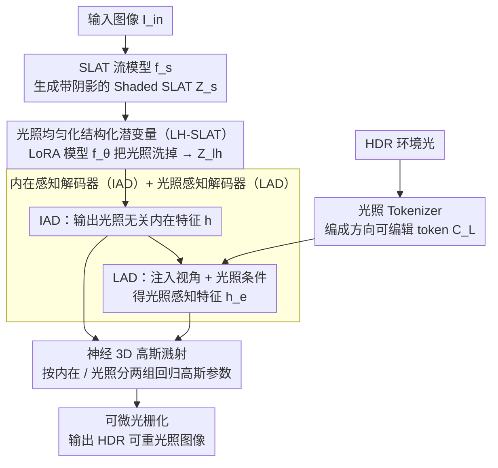

# NeAR: Coupled Neural Asset–Renderer Stack

**会议**: CVPR 2026  
**arXiv**: [2511.18600](https://arxiv.org/abs/2511.18600)  
**代码**: [https://near-project.github.io/](https://near-project.github.io/) (项目页)  
**领域**: 3D视觉 / 扩散模型  
**关键词**: 神经渲染, 光照均匀化, 3D高斯溅射, 可重光照, 资产-渲染器联合设计

## 一句话总结
NeAR 提出将神经资产创作和神经渲染联合设计为一个耦合栈，通过光照均匀化的结构化 3D 潜变量（LH-SLAT）消除输入图像中的烘焙光照，再用光照感知的神经解码器实时合成可重光照的 3D 高斯场，在前向渲染、重建、重光照和新视角重光照四类任务上超越现有方法。

## 研究背景与动机

1. **领域现状**：当前神经图形学有两条独立路线——神经资产创作（用生成模型合成3D资产）和神经渲染（将资产映射到图像）。它们通常独立开发：资产生成假设固定渲染器，渲染器针对静态资产分布训练。

2. **现有痛点**：(a) 基于 PBR 分解的方法（如 Hunyuan3D）容易产生材质误判（如将木头判为金属），分解误差在非线性渲染流程中被放大，导致烘焙阴影和光照不一致；(b) 基于扩散的 2D 重光照方法（如 DiLightNet、IC-Light）缺乏3D一致性，计算开销大；(c) 现有 SLAT 表示盲目编码外观，包含阴影和高光，无法直接用于重光照。

3. **核心矛盾**：资产中的阴影、高光和互反射与几何和材质固有纠缠，脆弱的显式 PBR 逆向分解在实际场景中不可靠；而完全黑盒的神经生成又缺乏可控性。

4. **本文目标** 如何在避免不稳定 PBR 逆向的同时实现高质量、可控的单图像可重光照 3D 生成？

5. **切入角度**：作者提出"先均匀化后合成"（homogenize-then-synthesize）的策略——将资产表示和渲染过程共同设计，让它们通过共享的光照均匀化潜空间建立稳健的"契约"。

6. **核心 idea**：联合设计光照均匀化的 3D 潜变量表示和光照感知的神经渲染器，形成耦合的资产-渲染器栈，替代传统解耦的资产生成+独立渲染范式。

## 方法详解

### 整体框架
NeAR 分两个阶段：**Stage 1** 用 LoRA 微调 rectified-flow 模型，将任意光照下的单张输入图像提升到光照均匀化的 SLAT（LH-SLAT），消除烘焙阴影和不稳定高光；**Stage 2** 用前馈解码器将 LH-SLAT 在目标光照和视角条件下合成可重光照的 3D 高斯溅射场。整个流程无需逐物体优化，支持实时推理。

### 关键设计

**1. 光照均匀化结构化潜变量（LH-SLAT）：用流模型把光照"洗掉"，而不是显式逆 PBR**

资产里的阴影、高光和互反射本就和几何、材质纠缠在一起，逼着模型去显式反解 PBR 材质是个病态问题——Hunyuan3D 之类的方法常把木头错判成金属，误差还会在非线性渲染里被放大。NeAR 绕开这条路：先定义一个标准的"均匀光照" $E_h$（白色均匀环境光），把它当成所有资产共享的中性参照系。具体做法是先用预训练的 SLAT 流模型 $f_s$ 从输入图像生成带阴影的 SLAT $Z_s$，再用一个 LoRA 适配的模型 $f_\theta$ 在稀疏体素空间里把 $Z_s$ 引导到光照均匀化的版本 $Z_{\text{lh}} = f_\theta(Z_s, I_{\text{in}})$。训练这步的真值来自把 3D 资产在均匀光照下多视角渲染，再在随机光照下渲一遍得到输入，于是模型学到的就是"从任意光照退回到中性光照"这个映射。对高反射材质，还可以额外抽一份 Base Color SLAT $Z_{\text{bc}}$ 拼上去补信息。换句话说，去光照不靠脆弱的逆向分解，而是在潜空间里学出来——既稳，又保住了几何-材质-光照交互的本质信息，给下游渲染一个干净的起点。

**2. 光照 Tokenizer：把 HDR 环境光编码成方向可编辑的 token，而非黑盒压缩**

如果像普通做法那样用 VAE 把整张环境光图压成一个潜码，方向信息就被糊掉了，换视角时没法重新摆放光照。NeAR 把环境光图拆成三路显式表示——LDR 色调映射图 $\mathbf{E}_{\text{ldr}}$、归一化对数强度图 $\mathbf{E}_{\text{log}}$、以及相机空间方向编码 $\mathbf{E}_{\text{dir}}$，再用 ConvNeXt 提取视觉特征，用 NeRF 位置编码处理方向图，通过空间交叉注意力把方向信息和视觉特征融合，最后经自注意力得到光照条件 token $C_L \in \mathbb{R}^{4096 \times 768}$。把方向单独显式嵌进来的好处是：切换观察视角时，光照方向是可编辑的，而不是和外观死死绑在一起。

**3. 内在感知解码器（IAD）+ 光照感知解码器（LAD）：把解码拆成光照无关与光照相关两段**

最终渲染既要稳定的几何材质，又要随光照灵活变化的外观，这两件事如果搅在一个解码器里就互相牵制。NeAR 把它们分开：IAD 用 Transformer 加 shifted window attention 处理 LH-SLAT，并引入 16 个 register token 通过全局交叉注意力捕获全局上下文，输出与视角、光照都无关的内在特征 $\boldsymbol{h}$。LAD 接力——先算观察视角嵌入（射线距离加射线方向的 NeRF 位置编码），加到内在特征上得到 $\boldsymbol{h}^v$，再用堆叠的交叉注意力块把光照条件 $C_L$ 注入进去，得到光照感知特征 $\boldsymbol{h}^e$。这里一个值得注意的选择是：放弃了传统的球谐函数，改用显式的视角注入，这样对视角相关的镜面高光建模得更准。

**4. 神经 3D 高斯溅射：高斯参数按内在 / 光照分两组回归**

延续上一步的解耦思路，NeAR 把 3DGS 的参数也分成两组各自回归。内在特征 $\boldsymbol{h}$ 解码出位置偏移、基础颜色、粗糙度、金属度、缩放、旋转、不透明度这些光照无关的参数；光照感知特征 $\boldsymbol{h}^e$ 则解码出 48 维颜色特征、光照缩放和阴影。最后用一个浅层 MLP 结合法线位置编码和颜色特征预测辐射值，经可微光栅化输出 HDR 预测图像。材质和光照在参数层面就是分开的，所以重光照时只换光照那一组、几何材质纹丝不动。

### 一个完整示例

以一张随机光照下拍的木椅照片为例走一遍：输入图先经 $f_s$ 生成带烘焙阴影的 Shaded SLAT $Z_s$，此时椅子表面还印着光照留下的明暗和高光，材质也可能被误读（木头偏向金属感）。接着 LoRA 适配的 $f_\theta$ 把 $Z_s$ 引导到 LH-SLAT $Z_{\text{lh}}$——阴影和不稳定高光被"洗"掉，木头恢复成中性光照下的真实漫反射外观。IAD 从 $Z_{\text{lh}}$ 读出与视角、光照无关的内在特征 $\boldsymbol{h}$（几何、基础颜色、金属度等）。这时给一张新的室内 HDR 环境光，经光照 Tokenizer 编成 $C_L$，连同一个新的观察视角一起喂给 LAD，得到光照感知特征 $\boldsymbol{h}^e$。最后神经 3DGS 把两组特征回归成高斯参数，可微光栅化渲出"这张椅子在这盏新灯、这个新角度下"的 HDR 图像——整条链路前馈一次完成，无需逐物体优化。

### 损失函数 / 训练策略

**Stage 1**：条件流匹配损失 $\mathcal{L}_{\text{stage1}} = \mathbb{E}\|\boldsymbol{v}_\theta(\boldsymbol{z}, Z_s, I_{\text{in}}, t) - (\boldsymbol{\epsilon} - \boldsymbol{z}_0)\|_2^2$。

**Stage 2**：HDR 重建损失（对数空间 L1 + LPIPS + D-SSIM）$\mathcal{L}_{\text{hdr}}$ + PBR 材质辅助监督 $\mathcal{L}_{\text{pbr}}$ + 阴影监督 $\mathcal{L}_{\text{shadow}}$。

训练数据：87K 个带 PBR 纹理的 3D 资产 + 2K 个 4K 分辨率 HDR 环境光图，用 Blender EEVEE Next 渲染。

## 实验关键数据

### 主实验（四项任务 PSNR↑ 对比）

| 任务 | 方法 | ADT | DTC | Objaverse | Glossy Syn. |
|------|------|-----|-----|-----------|-------------|
| G-buffer前向渲染 | DiffusionRenderer | 24.41 | 27.16 | 27.09 | 25.46 |
| | **NeAR** | **29.15** | **31.59** | **32.23** | **30.47** |
| 随机光照重建 | DiLightNet | 21.11 | 23.53 | 25.65 | 24.09 |
| | **NeAR** | **22.89** | **24.68** | **26.53** | **25.32** |
| 未知光照重光照 | DiffusionRenderer | 21.91 | 22.99 | 23.75 | 22.13 |
| | **NeAR** | **21.95** | **23.47** | **24.38** | **22.61** |
| 新视角重光照 | Hunyuan3D-2.1 | 22.30 | 24.89 | 25.47 | 22.26 |
| | **NeAR** | **22.87** | **25.53** | **25.97** | **22.94** |

### 消融实验

| 输入 SLAT 类型 | PSNR↑ | SSIM↑ | LPIPS↓ |
|---------------|-------|-------|--------|
| Shaded SLAT | 28.95 | 0.9281 | 0.0813 |
| Base Color SLAT | 30.38 | 0.9541 | 0.0564 |
| LH-SLAT | 32.02 | 0.9631 | 0.0494 |
| **LH + Base Color** | **32.54** | **0.9649** | **0.0442** |

| LAD 层数 (IAD=12) | PSNR | FPS |
|-------------------|------|-----|
| 1 层 | 31.56 | 48 |
| 3 层 | 32.35 | 38 |
| **6 层** | **32.54** | **30** |
| 9 层 | 32.56 | 23 |

### 关键发现
- LH-SLAT 比 Shaded SLAT PSNR 高 3+ dB，证实光照均匀化的必要性
- LH-SLAT + Base Color SLAT 组合效果最佳，Base Color 补充了高反射材质的信息
- LAD 6 层是性能与速度的最佳权衡点（PSNR 32.54、30 FPS）
- 先注入视角信息再 bake 光照的设计（图9中架构c+d+g）显著优于先 bake 光照再考虑视角
- HY3D-2.1 会将木头错判为金属（金属度图错误），NeAR 的 LH-SLAT 能正确恢复材质

## 亮点与洞察
- **资产-渲染器联合设计范式**：不再把资产生成和渲染看作独立组件，而是通过共享潜空间形成"契约"。这个思路对整个神经图形学栈的设计有启发意义。
- **光照均匀化策略**：不做显式 PBR 分解，而是在潜空间中学习光照去除，巧妙避开了逆渲染的病态性问题。
- **纹理风格迁移应用**：LH-SLAT 可以接受风格化图像输入，实现语义一致的风格迁移 + 真实感重光照，展示了表示的灵活性。

## 局限与展望
- 在透明物体上仍有困难（如头盔），虽然神经渲染器能部分缓解但并未完全解决
- 训练需要大量 3D 资产的多光照渲染，数据准备成本较高
- 仅评估了静态物体，动态场景和人体还未涉及
- 30 FPS 实时性能对于某些应用可能仍不够

## 相关工作与启发
- **vs Trellis**: Trellis 使用 SLAT 但盲目编码光照，NeAR 提出 LH-SLAT 显式消除光照，形成更适合重光照的稳定表示
- **vs DiffusionRenderer**: DiffusionRenderer 基于 G-buffer 做 2D 渲染，缺乏 3D 结构信息，NeAR 的 3D 高斯场在阴影和高光细节上更准确
- **vs HY3D-2.1**: HY3D 解耦PBR分解导致材质误估（如金属度错误），NeAR 避免了显式分解的脆弱性

## 评分
- 新颖性: ⭐⭐⭐⭐ 资产-渲染器耦合设计理念新颖，LH-SLAT 表示有独创性
- 实验充分度: ⭐⭐⭐⭐⭐ 四个子任务、四个数据集、多方法对比、消融实验、应用展示全面
- 写作质量: ⭐⭐⭐⭐ 论文结构清晰，对比分析到位
- 价值: ⭐⭐⭐⭐ 对神经渲染和 3D 生成领域的设计范式有重要启发

<!-- RELATED:START -->

## 相关论文

- [\[CVPR 2026\] Easy3E: Feed-Forward 3D Asset Editing via Rectified Voxel Flow](easy3e_feed-forward_3d_asset_editing_via_rectified_voxel_flow.md)
- [\[CVPR 2026\] Indoor Asset Detection in Large Scale 360° Drone-Captured Imagery via 3D Gaussian Splatting](indoor_asset_detection_in_large_scale_360_drone-captured_imagery_via_3d_gaussian.md)
- [\[CVPR 2026\] Neural Gabor Splatting: Enhanced Gaussian Splatting with Neural Gabor for High-frequency Surface Reconstruction](neural_gabor_splatting.md)
- [\[CVPR 2026\] NTK-Guided Implicit Neural Teaching](ntk-guided_implicit_neural_teaching.md)
- [\[NeurIPS 2025\] PhysX-3D: Physical-Grounded 3D Asset Generation](../../NeurIPS2025/3d_vision/physx-3d_physical-grounded_3d_asset_generation.md)

<!-- RELATED:END -->
