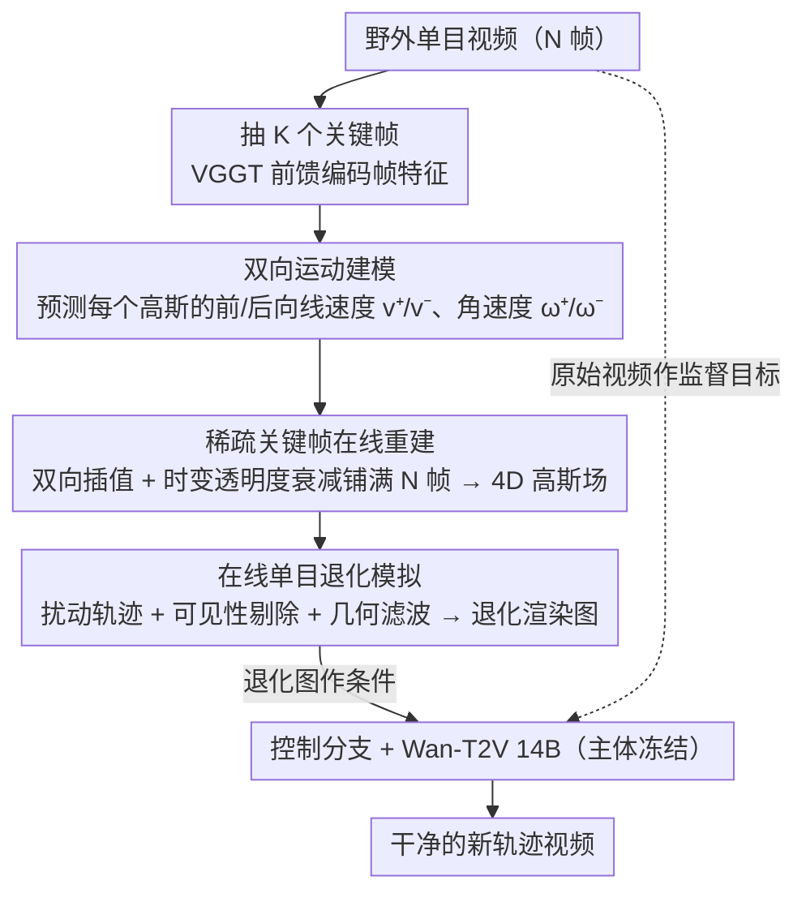

# NeoVerse: Enhancing 4D World Model with in-the-wild Monocular Videos

**会议**: CVPR 2026  
**arXiv**: [2601.00393](https://arxiv.org/abs/2601.00393)  
**代码**: [https://neoverse-4d.github.io](https://neoverse-4d.github.io) (即将开源)  
**领域**:3D视觉
**关键词**: 4D世界模型, 高斯泼溅, 单目视频, 新视角生成, 前馈重建

## 一句话总结

NeoVerse 提出了一个可扩展的 4D 世界模型，通过前馈式无位姿 4DGS 重建和在线单目退化模拟，使整个训练流程可以利用海量野外单目视频（百万级），在 4D 重建和新轨迹视频生成上均达到 SOTA。

## 研究背景与动机

1. **领域现状**：4D 世界建模（重建 + 生成的混合范式）在自动驾驶、数字内容创作等领域潜力巨大。现有方法通常先重建 3D/4D 表示，再用几何先验指导视频生成模型，以实现时空一致性和精确视角控制。

2. **现有痛点**：当前方案的核心瓶颈在于**可扩展性不足**，表现在两个层面：
    - **数据可扩展性差**：如 ViewCrafter 只能处理静态场景，SynCamMaster/ReCamMaster 依赖昂贵的多视角动态视频，数据获取成本高且限制泛化；
    - **训练可扩展性差**：TrajectoryCrafter、FreeSim 等需要离线预处理（重深度估计、离线重建高斯场），计算开销大、存储消耗高、训练方案不灵活。

3. **核心矛盾**：海量廉价的野外单目视频无法被直接利用，因为缺乏多视角监督信号和高效的在线处理流程。

4. **本文目标**：如何让整个 4D 世界模型的训练 pipeline 完全可扩展到多样化的野外单目视频。

5. **切入角度**：作者观察到，如果能实现 (a) 无需位姿的前馈 4D 重建，(b) 在线高效的退化渲染模拟，就可以将任意单目视频变成训练数据。

6. **核心 idea**：通过前馈式 4DGS 重建 + 在线单目退化模拟，让 4D 世界模型的全流程可扩展到百万级野外单目视频。

## 方法详解

### 整体框架

NeoVerse 要解决的问题是：4D 世界模型既要重建又要生成，但现有方法卡在数据和训练都没法规模化——多视角动态视频太贵、离线重建太重。它的破局思路是把"重建"和"生成"两个阶段都做成在线可扩展，从而能直接吃海量野外单目视频。整体怎么转：重建阶段以 VGGT 为骨干，输入一段单目视频，前馈输出一个带运动信息的 4D 高斯场（全程不需要相机位姿）；生成阶段则在这个高斯场上沿一条新相机轨迹渲染出"退化"的图像，把它当条件喂给视频生成模型（Wan-T2V 14B 外加一个控制分支），生成干净的新轨迹视频。训练时最关键的一招是——生成阶段不依赖任何额外标注，而是在线地把同一段单目视频先重建、再退化，最后拿原始视频本身当监督目标，于是任意单目视频都能就地变成训练对。

### 关键设计

**1. 双向运动建模：让稀疏的关键帧能插值出任意时刻的高斯**

前馈网络逐帧推理太慢，所以必须只重建少数关键帧、其余帧靠插值补出来——可插值要准，就得知道每个高斯到底怎么动。NeoVerse 把 VGGT 输出的帧特征 $\{F_t\}$ 沿时间维切成两组，分别做交叉注意力，编码出前向运动特征（$t\to t+1$）和后向运动特征（$t\to t-1$），再据此为每个高斯预测前向/后向的线速度 $v^+, v^-$ 和角速度 $\omega^+, \omega^-$。有了双向速度，关键帧上的高斯就能沿正反两个方向用线性插值传播到任意非关键帧。和 4DGT 的单向运动相比，双向设计的好处是只输入 K 帧就能渲染 N 帧（既能往后推也能往前推），把在线重建的算力开销压下来，顺带也支持时间维度上的可控编辑。

**2. 稀疏关键帧在线重建：用"渲染快、推理慢"的反差把训练效率拉起来**

重建要在训练时反复跑，如果对长视频逐帧前馈，推理就成了瓶颈。这里的关键观察是：前馈网络推理慢，但高斯渲染极快。于是给定 N 帧长视频只取 K 个关键帧做前馈重建，靠上面的双向运动把高斯插值到其余帧，再渲染出来。帧间过渡用一个时变透明度衰减函数来控制：

$$\alpha_i(t_q) = \alpha_i \exp\!\left(-\gamma \cdot d(t_q, t)^{1/(1-\tau_i)}\right)$$

让每个高斯随着查询时刻 $t_q$ 离它所属关键帧时刻 $t$ 越远、透明度衰减得越自然。实际效果是用 11 个关键帧就能重建 81 帧视频，重建只要约 2 秒——把昂贵的前馈次数从 81 次砍到 11 次，质量却几乎不掉。

**3. 在线单目退化模拟：把单目视频凭空造出"退化渲染—原始视频"的训练对**

重建出 4D 高斯场后，还要解决生成阶段的监督难题：多视角数据集天然能取到训练对（换个视角就是 ground truth），但单目视频只有一条轨迹，没法直接监督新视角生成。NeoVerse 的办法是在线地从 4D 高斯场制造退化，造出三种互补的退化模式：(a) **基于可见性的高斯剔除**——对相机轨迹施加随机变换得到一条新轨迹，用深度信息剔除在新轨迹下被遮挡的高斯，再渲染回原视角，模拟视角变化带来的遮挡空洞；(b) **平均几何滤波器**——在新视角深度图上做均值滤波，再按滤波结果挪动高斯中心，模拟深度不连续边缘那些"飞行像素"；(c) 在 (b) 的基础上换一个更大的滤波核，模拟更宽范围的深度估计误差失真。三种退化全都从几何遮挡和深度误差的第一性原理出发，不需要再额外学一个噪声模型，于是任意一段单目视频都能就地变成"残缺输入 + 干净目标"的训练样本。

### 一个完整示例：一段单目视频怎么在训练时变成监督信号

拿一段 81 帧的野外单目视频走一遍训练流程：

1. **重建**：从 81 帧里抽 11 个关键帧送进前馈模型，VGGT 编码出帧特征，双向运动头预测每个高斯的 $v^+, v^-, \omega^+, \omega^-$，靠插值把高斯铺满整段，约 2 秒就得到整段的 4D 高斯场。
2. **选轨迹 + 退化**：对原相机轨迹随机扰动得到一条新轨迹，沿它渲染——可见性剔除制造遮挡空洞、几何滤波制造飞行像素，得到一张"残缺"的退化渲染图。
3. **监督**：把退化图当条件喂给 Wan-T2V 的控制分支，要它还原出干净视频；而干净的监督目标，正是原始那段单目视频本身。

整个过程没用到任何多视角标注或离线预处理，全部在线完成，于是百万级的互联网单目视频都能直接进训练集。

### 损失函数 / 训练策略

- **重建损失**：$\mathcal{L}_{recon} = \mathcal{L}_{rgb} + \lambda_1\mathcal{L}_{camera} + \lambda_2\mathcal{L}_{depth} + \lambda_3\mathcal{L}_{motion} + \lambda_4\mathcal{L}_{regular}$，包括光度损失（L2 + LPIPS）、相机参数损失、深度损失、双向速度监督、透明度正则化
- **生成损失**：采用 Rectified Flow，基于 Wan-T2V 14B，训练控制分支，冻结生成模型主体（兼容蒸馏 LoRA 加速）
- **两阶段训练**：第一阶段 150K iterations 训重建模型，第二阶段 50K iterations 训生成模型，使用 32 张 A800 GPU
- **全局运动追踪**：推理时通过跨帧可见性加权最大速度分离动态/静态高斯，对两类高斯采用不同的时间聚合策略

## 实验关键数据

### 主实验

| 数据集 | 指标 | NeoVerse | AnySplat | NoPoSplat |
|--------|------|----------|----------|-----------|
| VRNeRF (静态) | PSNR↑ | **20.73** | 18.02 | 11.27 |
| VRNeRF (静态) | LPIPS↓ | **0.352** | 0.366 | 0.620 |
| Scannet++ (静态) | PSNR↑ | **25.34** | 22.79 | 8.69 |
| ADT (动态) | PSNR↑ | **32.56** | - | - |
| DyCheck (动态) | PSNR↑ | **11.56** | - | 9.32 |

| 方法 | 推理总时间(s) | Subj. Consist. | Back. Consist. | Imag. Quality |
|------|-------------|----------------|----------------|---------------|
| TrajectoryCrafter | 146 | 83.02 | 88.58 | 54.59 |
| ReCamMaster | 168 | 88.21 | 91.60 | 58.87 |
| NeoVerse (11 key) | **20** | 88.43 | 92.27 | 59.75 |
| NeoVerse (21 key) | **21** | **88.73** | **92.43** | 60.01 |

### 消融实验

| 配置 | DyCheck PSNR↑ | SSIM↑ | LPIPS↓ |
|------|-------------|-------|--------|
| w/o 双向运动 | 11.27 | 0.285 | 0.570 |
| w/o 透明度正则 | 10.86 | 0.244 | 0.576 |
| 完整重建模型 | 11.56 | 0.293 | 0.558 |
| 完整 pipeline (+ 生成) | **14.59** | **0.323** | **0.501** |

### 关键发现

- 双向运动建模贡献显著，去掉后 DyCheck PSNR 下降 0.29
- 生成阶段对最终质量提升巨大（PSNR 从 11.56 → 14.59），验证了重建-生成混合范式的有效性
- 稀疏关键帧（11 帧 vs 全 81 帧）对生成质量影响很小，但推理时间从 28s 降至 20s（7x 快于 TrajectoryCrafter）
- 在 VBench 评估中，NeoVerse 在主观一致性、背景一致性、图像质量上全面超越 TrajectoryCrafter 和 ReCamMaster

## 亮点与洞察

- **核心洞察**：4D 世界模型的瓶颈不是模型架构而是数据和训练的可扩展性。通过在线退化模拟巧妙地将单目视频变成多视角训练对，避免了对昂贵多视角数据的依赖
- **稀疏关键帧重建**的设计非常巧妙——利用高斯渲染远快于网络推理的特性，将前馈推理成本降低数倍而几乎不影响质量
- **控制分支冻结生成模型**的策略使得 NeoVerse 可直接兼容蒸馏 LoRA，推理时生成仅需 18 秒
- 退化模拟基于第一性原理（几何遮挡、深度均值化），无需学习额外的噪声模型

## 局限与展望

- 当前分辨率固定在 336×560，离实际应用的高分辨率需求有距离
- 全局运动追踪基于阈值分离动态/静态，对于缓慢运动物体可能不够精确
- 退化模拟虽然基于第一性原理但仍是近似，真实新视角渲染的退化模式可能更复杂
- 训练需要 32 张 A800 GPU，对于学术实验室来说成本较高

## 相关工作与启发

- **vs TrajectoryCrafter**：同为重建-生成混合方法，但 TrajectoryCrafter 依赖离线预处理，限制数据规模；NeoVerse 全在线流程，可扩展到百万级视频。NeoVerse 推理速度快 7 倍
- **vs ReCamMaster**：纯生成方法视觉质量好但轨迹控制不精确；NeoVerse 兼具生成质量和精确轨迹控制
- **vs AnySplat**：AnySplat 针对静态场景无位姿重建；NeoVerse 扩展到 4D 动态场景，PSNR 高 2.7dB
- 该工作为利用海量互联网视频训练世界模型提供了一条可行路径

## 评分

- 新颖性: ⭐⭐⭐⭐ 双向运动建模 + 在线退化模拟的组合巧妙，但各个模块单独看并非完全创新
- 实验充分度: ⭐⭐⭐⭐⭐ 静态/动态重建、生成质量、推理效率、消融实验全面覆盖
- 写作质量: ⭐⭐⭐⭐ 结构清晰，motivation 论述充分，符号系统一致
- 价值: ⭐⭐⭐⭐⭐ 解决了 4D 世界模型训练的数据瓶颈问题，具有很强的实际影响力

<!-- RELATED:START -->

## 相关论文

- [\[CVPR 2026\] Learning a Particle Dynamics Model with Real-world Videos](learning_a_particle_dynamics_model_with_real-world_videos.md)
- [\[NeurIPS 2025\] 4DGT: Learning a 4D Gaussian Transformer Using Real-World Monocular Videos](../../NeurIPS2025/3d_vision/4dgt_learning_a_4d_gaussian_transformer_using_realworld_mono.md)
- [\[CVPR 2026\] Iris: Bringing Real-World Priors into Diffusion Model for Monocular Depth Estimation](iris_bringing_realworld_priors_into_diffusion_model_for_monocular_depth_estimation.md)
- [\[CVPR 2026\] Recovering Physically Plausible Human-Object Interactions from Monocular Videos](recovering_physically_plausible_human-object_interactions_from_monocular_videos.md)
- [\[CVPR 2026\] RHINO: Reconstructing Human Interactions with Novel Objects from Monocular Videos](rhino_reconstructing_human_interactions_with_novel_objects_from_monocular_videos.md)

<!-- RELATED:END -->
