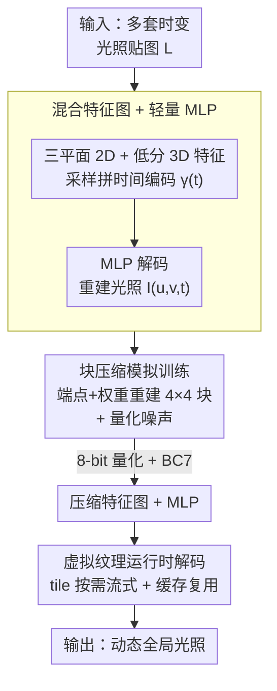

# Neural Dynamic GI: Random-Access Neural Compression for Temporal Lightmaps in Dynamic Lighting Environments

**会议**: CVPR 2026  
**arXiv**: [2604.12625](https://arxiv.org/abs/2604.12625)  
**代码**: https://magicdawnlab.github.io/ (项目主页)  
**领域**: 3D视觉 / 神经渲染 / 纹理压缩  
**关键词**: 全局光照、光照贴图压缩、神经纹理压缩、三平面特征、块压缩

## 一句话总结
针对"动态光照下要存多套光照贴图(lightmap)、体积巨大"这一痛点，NDGI 用一组混合维度的特征图 + 轻量 MLP 把整个时间序列的光照贴图压成一个小模型，再配合块压缩(BC)模拟训练和虚拟纹理(VT)运行时按需解码，在 0.68 BPP 的极低码率下把光照重建 PSNR 做到 46.7 dB，远超传统 GPU 压缩(BC7/ASTC)和现有神经压缩 NTC，且解码延迟只有 NTC 的约四分之一。

## 研究背景与动机
**领域现状**：实时渲染里要拿到高质量全局光照(GI)，主流靠"预计算光照"。其中**光照贴图(lightmap)** 是标准做法：离线把间接光照、静态阴影等烘焙到贴图上，运行时直接采样，几乎零计算开销，且在各种硬件上都稳定可扩展。相比球谐探针(SH probe)，lightmap 的空间分辨率更高、细节更丰富。

**现有痛点**：一旦光照是**动态**的(如一天中太阳/天光渐变、某时刻路灯开关这种 time-of-day 效果)，单张静态 lightmap 就不够了——必须为不同光照条件**各烘焙一套 lightmap**，运行时在相邻两套之间插值。结果是存储和显存爆炸：论文里一个场景的参考数据高达 156 MB，对大规模游戏场景完全不可接受。

**核心矛盾**：现有压缩手段都顾此失彼。传统 GPU 纹理压缩(BC6H/BC7/ASTC)硬件高效、支持随机访问,但**逐张独立处理、压缩比有限**(BC7 仍要 8 BPP),既吃不到多套 lightmap 之间的**时间冗余**,又容易出块状伪影;而近年的神经纹理压缩(如 NTC)压缩比和质量更好,却**依赖较大的解码器**,运行时解码慢,且 NTC 单组最多只支持 16 通道,根本装不下整段时间序列的 lightmap。此前**没有任何工作**专门针对"多套 lightmap"做压缩,更没把它用到动态 GI。

**本文目标**：在一个框架里同时压住三件事——磁盘存储、运行时显存、实时解码开销——让动态 GI 在大规模场景里真正可用。

**切入角度**：与其显式存 $n$ 套 lightmap,不如把整个时空光照场 $I(u,v,t)$ 当作一个连续函数,用紧凑的特征图 + 小网络去**隐式拟合**它;时间维度的高频变化用专门的特征结构去抓,而不是甩给 MLP 硬记。

**核心 idea**：把"一套套光照贴图"换成"混合维度特征图($\mathbf{F}^{2D}$ 三平面 + $\mathbf{F}^{3D}$)+ 轻量 MLP 解码器",并让特征图天然兼容 GPU 块压缩、配合虚拟纹理按需解码,从而在极低码率下保住质量、保住实时性。

## 方法详解

### 整体框架
NDGI 把"压缩动态光照"形式化为:原始要存一组随时间变化的光照贴图 $L=\{L_i \mid i=0,\dots,n-1\}$,每个 $L_i$ 是时刻 $t_i$ 的多通道贴图;目标是用一个带参数 $\Theta$ 的紧凑模型 $\mathbf{H}_\Theta$ 直接表达任意时空点的光照 $I(u,v,t)=\mathbf{H}_\Theta(u,v,t)$,从而绕开显式存储。

整条管线分三步:**(1) 表示**——把整段 lightmap 序列编码成四张不同结构的特征图($\mathbf{F}^{2D}_{uv}$、$\mathbf{F}^{2D}_{ut}$、$\mathbf{F}^{2D}_{vt}$ 三平面 + 一张低分辨率 3D 体 $\mathbf{F}^{3D}_{uvt}$)加一个轻量 MLP 解码器 $G_\Phi$;给定坐标和时间 $(u,v,t)$,从各特征图采样得到向量,拼上时间的位置编码 $\gamma(t)$ 送进 MLP,重建出该点光照。**(2) 压缩**——训练阶段就引入 BC(块压缩)模拟和量化噪声,让最终学到的特征图能直接用 8-bit 量化 + BC7 进一步压,且不掉质量。**(3) 运行时**——把每张 lightmap 切成固定大小 tile、**每个 tile 单独训一个模型**,接入虚幻引擎的虚拟纹理(VT)系统,渲染时只把当前需要的 tile 流式拉进来、用 compute shader 解码写入物理纹理,已驻留的 tile 在短时间内直接复用缓存、不重复推理。

### 关键设计

**1. 混合维度特征图:用三平面 + 低分 3D 体分别接住空间与时间的高频**

痛点在于,一张 lightmap 序列里既有"所有时刻都共享的空间光照结构",又有"随时间剧烈变化的高频亮度"(比如路灯在某帧突然点亮)。如果只用一张和目标贴图同尺寸的 2D 特征图 $\mathbf{F}^{2D}_{uv}$,它只能记住共享的空间信号,**时间变化全甩给 MLP 硬记**,而时间维度的变化比普通材质纹理更高频、更复杂,小 MLP 记不住。作者因此设计混合结构:把 2D 特征扩展成**三平面** $\mathbf{F}^{2D}_{uv}$、$\mathbf{F}^{2D}_{ut}$、$\mathbf{F}^{2D}_{vt}$ 抓细节,再加一张**低分辨率 3D 体** $\mathbf{F}^{3D}_{uvt}$ 专门捕捉光照随时间的亮度变化。

推理时先用 $(u,v,t)$ 在 3D 体里采到 $V_{uvt}$,再把坐标投影到三个平面分别采到 $V_{uv},V_{ut},V_{vt}$,最后把四个向量与时间位置编码 $\gamma(t)$ 拼接送进解码器:

$$\gamma(t)=[\sin(2^0\pi t),\cos(2^0\pi t),\sin(2^1\pi t),\cos(2^1\pi t)]$$
$$I(u,v,t)=G_\Phi(V_{uvt},V_{uv},V_{ut},V_{vt},\gamma(t))$$

于是原始序列被压成参数集 $\Theta=\{\mathbf{F}^{3D}_{uvt},\mathbf{F}^{2D}_{uv},\mathbf{F}^{2D}_{ut},\mathbf{F}^{2D}_{vt},\Phi\}$。各特征图分辨率可调(例如 26 张 $128\times128$ 的 lightmap,$\mathbf{F}^{2D}_{uv}$ 取 $128\times128\times4$,$\mathbf{F}^{3D}_{uvt}$ 取 $32\times32\times12\times4$),且整套表示天然**支持随机访问**——任意位置、任意时刻都能独立解码,不必处理其余区域,这正是实时渲染所需。

**2. BC 模拟训练:让学出来的特征图直接吃得下硬件块压缩**

特征图本身还是太大。直接 8-bit 量化能把 BPP 从 4.62 降到 2.32,但若想再套 GPU 的 BC7 块压缩,**训练完才硬压会有明显信息损失**。作者的做法是把"块压缩"这件事提前塞进训练:对体积较大的 $\mathbf{F}^{3D}_{uvt}$ 和 $\mathbf{F}^{2D}_{uv}$,不直接更新它们的像素值,而是把每张图切成 $4\times4$ 块,块内特征由一对端点 $\mathbf{E}=\{e_1,e_2\}$ 和 16 个权重 $\mathbf{W}=\{w_1,\dots,w_{16}\}$ 参数化,每个像素按端点线性插值重建:

$$f_p=(1-w_p)\,e_1+w_p\,e_2,\quad p=1,\dots,16$$

训练时更新的就是这些端点和权重,用它们重建特征图再采样,这等于让网络从一开始就在 BC 能表达的子空间里学习,收敛后再做一次重建 + 量化 + BC7 即可,几乎不掉质量。对较小的 $\mathbf{F}^{2D}_{ut}$、$\mathbf{F}^{2D}_{vt}$ 则只做 8-bit 量化,并在训练中注入均匀噪声 $V'=V+\mathcal{U}(-0.5,0.5)\cdot\alpha$(取 $\alpha=\tfrac{1}{256}$ 对应 8-bit)来模拟量化误差。两招叠加把 BPP 进一步压到 **0.68**(压缩比 0.7%)。

**3. 虚拟纹理按需解码:把"每帧每像素都解码"摊薄成"只解需要的 tile 并复用缓存"**

即便模型小,运行时**逐帧逐像素解码**仍是重负担,而相邻帧光照变化缓慢、大量推理是冗余的。NDGI 借虚拟纹理(VT)的缓存机制解决:把每张 lightmap 切成固定大小 tile,**训练时就按 tile 切、每个 tile 单独训一个模型**,使训练与运行时对齐。渲染每帧只按需取出所需 tile 的参数,用 compute shader 解码写进物理纹理;着色时先查页表(page table)定位 tile,再采物理纹理拿最终光照。对已驻留物理纹理的 tile,因为短时间内光照变化可忽略,可直接复用缓存、跳过重复推理。这样既大幅降低在线解码成本、避免冗余计算,又因 tile 化天然支持分布式训练和大规模场景扩展。

### 损失函数 / 训练策略
每套 lightmap 单独训练。训练前先做 **gamma 校正**增强暗部细节,并对每个时间步做逐通道均值归一化(均值在渲染时用于还原原始数据)。损失为重建光照与原 lightmap 的 **L2 loss**;优化器 Adam,初始学习率 $10^{-3}$,batch size $2^{12}$。MLP 为两层隐藏层、宽度可调(实验多用 16,也测了 64),隐藏层用 GELU、输出层无激活。**最后阶段冻结特征图、只在模拟量化 + BC 压缩下微调 MLP**。大规模场景里可能要训上千个独立 NDGI 模型,作者用 PyTorch 的批量矩阵运算并行训练;实时渲染端用虚幻引擎的 VT 系统 + compute shader 重建。

## 实验关键数据

数据集为多个真实游戏场景(FarmLand 来自《Arena Breakout: Infinite》、室内天光/日光变化的 Room、路灯定时开关的 City、多局部光源的 Yard)预烘焙的时变 lightmap,覆盖天光、方向光、局部光源的变化。对比对象含传统 GPU 压缩(BC6H、BC7、ASTC)、神经压缩 NTC,以及预计算辐射传输 PRT。L./M./H. 分别表示 Low/Medium/High 三档配置。

### 主实验

各方法在相近码率下的平均重建质量(数据集平均):

| 码率档 | 方法 | BPP | PSNR↑ | 1−SSIM↓ | LPIPS↓ |
|--------|------|-----|-------|---------|--------|
| 低 (<1.0 BPP) | **NDGI L.** | 0.50 | 45.96 | 0.014 | 0.007 |
| 低 | **NDGI M.** | 0.68 | 46.69 | 0.012 | 0.006 |
| 低 | NTC L. | 0.78 | 43.61 | 0.026 | 0.010 |
| 低 | **NDGI M.64** | 0.86 | 47.42 | 0.012 | 0.007 |
| 低 | ASTC 12×12 | 0.89 | 32.50 | 0.069 | 0.057 |
| 高 (>1.0 BPP) | NTC M. | 1.10 | 44.26 | 0.022 | 0.008 |
| 高 | ASTC 10×10 | 1.28 | 34.52 | 0.051 | 0.043 |
| 高 | **NDGI H.** | 1.39 | **48.68** | 0.009 | 0.004 |
| 高 | NTC H. | 1.78 | 45.77 | 0.016 | 0.007 |
| 高 | BC6H | 8 | 44.31 | 0.026 | 0.010 |
| 高 | BC7 | 8 | 42.27 | 0.039 | 0.016 |

要点:在所有码率段 NDGI 都全面领先。最极端的对比是 NDGI M. 用 **0.68 BPP** 就达到 46.69 dB,而传统 BC7/BC6H 要 **8 BPP**(约 12 倍码率)才到 42~44 dB;同档神经方法 NTC L.(0.78 BPP)只有 43.61 dB。FarmLand 场景的存储对比更直观:NDGI M. 仅 **1.10 MB** 即得 49.31/45.73 dB,而参考数据是 **156 MB**、BC7 是 13 MB。

解码延迟(1024×1024 lightmap,RTX 4060,CUDA + Tensor Core):

| 方法 | NDGI L. | NDGI M. | NDGI M.64 | NTC L. | NTC M. |
|------|---------|---------|-----------|--------|--------|
| 解码时间 | 0.201 ms | 0.203 ms | 0.314 ms | 0.886 ms | 0.918 ms |

NDGI 的解码延迟约为 NTC 的 **1/4**,得益于极小的解码器和更低的特征维度带来的低采样开销。

### 消融实验

压缩策略对码率的逐级影响(同一模型):

| 压缩策略 | BPP | 压缩比 |
|----------|-----|--------|
| 原始(未量化) | 4.62 | 4.8% |
| 8-bit 量化 | 2.32 | 2.4% |
| 8-bit 量化 + BC | 0.68 | 0.7% |

不同配置(分辨率 / 解码器宽度)对码率与质量的权衡(对应主表):

| 配置 | $\mathbf{F}^{3D}_{uvt}$ 分辨率 | 隐藏宽度 | BPP |
|------|------|------|-----|
| NDGI L. | 16×16×12×4 | 16 | 0.50 |
| NDGI M. | 32×32×12×4 | 16 | 0.68 |
| NDGI H. | 64×64×12×4 | 16 | 1.39 |
| NDGI M.64 | 32×32×12×4 | 64 | 0.86 |

### 关键发现
- **BC 模拟训练是把码率从 2.32 压到 0.68 BPP 的关键一步**:8-bit 量化只让码率减半,真正的 3.4 倍额外压缩来自"端点+权重"的块压缩,而模拟训练保证了这一步几乎不掉质量。
- **3D 特征体分辨率主导质量-码率曲线**:把 $\mathbf{F}^{3D}_{uvt}$ 从 16×16 提到 64×64,PSNR 从 45.96 升到 48.68,代价是 BPP 从 0.50 涨到 1.39;而把解码器从 16 宽加到 64 宽(NDGI M.64)收益有限(46.69→47.42)——说明**特征图比解码器更值得投入参数**,这也是 NDGI 能用"几百参数的解码器"还保住细节的原因。
- **传统块压缩在动态光照上质量崩得厉害**:ASTC 即便 0.89~1.28 BPP,PSNR 只有 32~34 dB,块状伪影明显;PRT 则有色调偏移。NDGI 在低码率下的优势主要体现在局部光源开关这类高频时间变化的场景。

## 亮点与洞察
- **"把时间维当成一个需要专门特征结构去抓的高频信号"是核心洞察**:不少隐式压缩工作把时间直接喂给 MLP,而 NDGI 用三平面 + 3D 体显式分担时空高频,既减轻了解码器负担,又让解码器能做到极小——这是它解码比 NTC 快 4 倍的根本原因,这一思路可迁移到任意"时变纹理/时变场"的压缩。
- **BC 模拟训练把"硬件压缩格式"变成可微分的训练约束**:与其训练完再压、被动承受信息损失,不如让网络一开始就在 BC7 能表达的端点-权重子空间里学习,等于把硬件解码器纳入训练回路。这套"模拟目标格式"的思路对任何"要落地到固定硬件解码格式"的压缩任务都适用。
- **训练-运行时按 tile 对齐**:每个 tile 单训一个模型看似笨重,但它同时换来了随机访问、虚拟纹理缓存复用、分布式训练扩展三重好处,是一个把"系统约束"反过来当"设计优势"的漂亮取舍。
- 还将**开源一套多场景时变 lightmap 数据集**,填补了"动态光照压缩缺基准"的空白。

## 局限与展望
- **突变光照有延迟**:方法支持平滑时间过渡,但骤变的光照(如瞬间开灯)无法在单帧内反映,常规更新率下会有短暂延迟。
- **训练慢**:当前基于 PyTorch,大规模场景要训上千个模型,吞吐受限;作者计划做专用训练框架并用异步执行/调度更紧地嵌入实时管线。
- (自评)**每 tile 一模型的可扩展性边界未充分量化**:论文强调可分布式训练,但上千模型的训练总成本、显存峰值、以及 tile 边界是否出现接缝伪影,正文给的证据有限。
- (自评)**评测以"光照重建误差"为主而非最终成像**:作者刻意避开渲染管线差异直接比 lighting,这对压缩质量评估更干净,但对玩家最终观感的影响(尤其时间一致性)缺少用户研究层面的验证。

## 相关工作与启发
- **vs NTC(神经纹理压缩)**:NTC 用特征金字塔在多 mipmap 上编码多通道纹理,也支持随机访问和实时解码,但**单组最多 16 通道**装不下整段时间序列(论文里只能把数据切成连续时间段分别压),且解码器较大。NDGI 用混合时空特征 + 极小解码器,在更低码率下质量更高(0.68 BPP/46.7 dB vs NTC 0.78 BPP/43.6 dB)、解码快约 4 倍。
- **vs 传统 GPU 块压缩(BC6H/BC7/ASTC)**:它们硬件高效、支持随机访问,但**逐张独立处理、吃不到时间冗余**,且压缩比有限(BC7 仍 8 BPP)、易出块状伪影。NDGI 借鉴其端点-权重思想做 BC 模拟训练,既保留硬件兼容与随机访问,又跨整段序列联合建模。
- **vs PRT(预计算辐射传输)**:PRT 靠预计算传输数据支持动态光照,但探针式表示空间细节有限、且实验中出现色调偏移。NDGI 在动态光照过渡的时间一致性与重建保真度上明显更好。
- **vs Belcour/Weinreich 等把块压缩塞进特征图的工作**:它们直接优化端点和权重做额外码率削减,NDGI 把这一思路扩展到时变 lightmap,并与三平面/3D 体混合表示、VT 运行时系统整合成完整管线。

## 评分
- 新颖性: ⭐⭐⭐⭐ 首个专门压"多套时变 lightmap"并用于动态 GI 的神经压缩框架,混合时空特征 + BC 模拟训练的组合有新意,但单项技术(三平面、BC 模拟、VT)多为已有思路的整合。
- 实验充分度: ⭐⭐⭐⭐ 覆盖多真实游戏场景,横向比 BC/ASTC/NTC/PRT,质量、存储、解码延迟三维度齐全;但缺大规模场景的训练成本量化与用户研究。
- 写作质量: ⭐⭐⭐⭐ 问题定义清晰、图表到位,方法三步逻辑顺;部分公式(噪声幅度)在缓存里有 OCR 噪声需对照原文。
- 价值: ⭐⭐⭐⭐ 直接面向工业实时渲染痛点,落地虚幻引擎且将开源数据集,对游戏/动态 GI 工程实用价值高。

<!-- RELATED:START -->

## 相关论文

- [\[CVPR 2026\] WildRayZer: Self-supervised Large View Synthesis in Dynamic Environments](wildrayzer_self-supervised_large_view_synthesis_in_dynamic_environments.md)
- [\[CVPR 2026\] RF4D: Neural Radar Fields for Novel View Synthesis in Outdoor Dynamic Scenes](rf4dneural_radar_fields_for_novel_view_synthesis_in_outdoor_dynamic_scenes.md)
- [\[CVPR 2026\] Few-Shot Incremental 3D Object Detection in Dynamic Indoor Environments](few-shot_incremental_3d_object_detection_in_dynamic_indoor_environments.md)
- [\[CVPR 2026\] Neu-PiG: Neural Preconditioned Grids for Fast Dynamic Surface Reconstruction on Long Sequences](neu-pig_neural_preconditioned_grids_for_fast_dynamic_surface_reconstruction_on_l.md)
- [\[CVPR 2026\] MOSAIC-GS: Monocular Scene Reconstruction via Advanced Initialization for Complex Dynamic Environments](mosaic-gs_monocular_scene_reconstruction_via_advanced_initialization_for_complex.md)

<!-- RELATED:END -->
