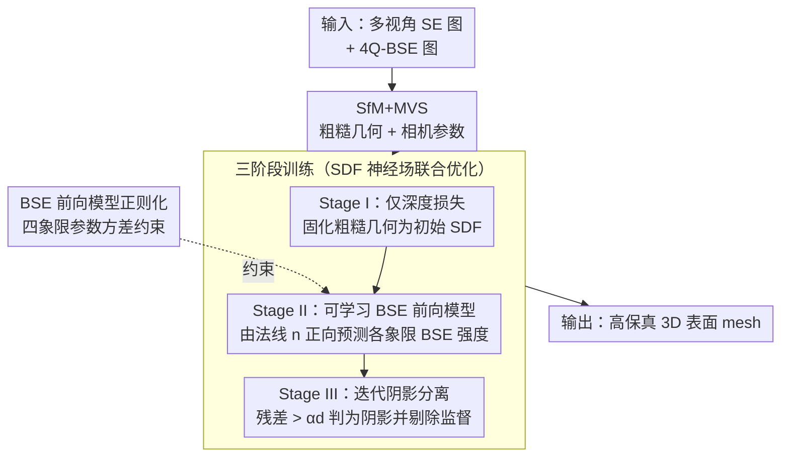

# Neural Field-Based 3D Surface Reconstruction of Microstructures from Multi-Detector Signals in Scanning Electron Microscopy

**会议**: CVPR 2026  
**arXiv**: [2508.04728](https://arxiv.org/abs/2508.04728)  
**代码**: [https://github.com/zju3dv/NFH-SEM](https://github.com/zju3dv/NFH-SEM)  
**领域**: 3D视觉  
**关键词**: 扫描电子显微镜, 3D重建, 神经场, 微观结构, 光度立体

## 一句话总结
本文提出 NFH-SEM，一个基于神经场的混合框架，通过将 SEM 电子散射物理模型嵌入神经场优化过程，从多视角多检测器 SEM 图像重建高保真的微观结构 3D 表面，实现了自标定、抗阴影的纳米级精度重建（478nm 层叠特征、782nm 花粉纹理、1.559μm 断裂台阶）。

## 研究背景与动机

1. **领域现状**：扫描电子显微镜（SEM）是材料科学、生物学和工业制造中广泛使用的成像工具，能产生高分辨率的微/纳米尺度图像。但 SEM 图像本质上只是二次电子（SE）或背散射电子（BSE）的 2D 强度分布，不直接包含 3D 信息。现有 SEM 3D 重建方法主要分为：多视角方法（SfM+MVS）和单视角方法（光度立体 PS）。

2. **现有痛点**：
    - 多视角方法在微观样品常见的弱纹理或重复图案区域容易失败
    - 单视角 PS 方法需要使用参考样品进行检测器标定，且对阴影伪影高度敏感——阴影区域导致梯度估计失真
    - 混合方法虽结合两者优势，但仍受限于标定需求、阴影问题，且使用 2D 高度图表示无法捕获复杂微观结构
    - 基于学习的方法（NeuS、3DGS、前馈重建）要么缺少大规模 SEM 训练数据无法泛化，要么基于 RGB 光学渲染模型无法捕捉 SEM 信号中的几何线索

3. **核心矛盾**：SEM 的信号生成物理（电子散射）与常规 RGB 成像完全不同，但现有 3D 重建方法要么忽略 SEM 物理（多视角方法）、要么依赖简化物理模型且需复杂标定（单视角方法）。

4. **本文目标** 设计一个能自动学习 SEM 成像物理、自标定检测器参数、自动分离阴影区域的神经场重建框架。

5. **切入角度**：将 BSE 信号的散射和检测器响应建模为可学习的前向模型，嵌入到 SDF 神经场的体渲染管线中，与几何共同优化。

6. **核心 idea**：通过将可学习的 BSE 前向模型嵌入神经场优化，实现 SEM 成像物理的自标定和阴影自动分离，从而获得高保真微观 3D 重建。

## 方法详解

### 整体框架
输入为多视角、多检测器 SEM 图像（每个视角一张 SE 图 + 四张 4Q-BSE 图）。流程分两阶段：(1) 用多视角 SE 图像进行 SfM+MVS 获得粗糙初始几何和相机参数；(2) 以粗糙几何为初始化，通过 SDF 神经场融合多视角深度先验和 4Q-BSE 光度信息，联合优化几何和 BSE 前向模型参数；而这第二阶段的优化本身又按"先立几何、再学光度、最后开阴影"分三个训练阶段递进，期间用 BSE 前向模型正则化约束四象限参数。输出为高保真 3D 表面 mesh。

### 关键设计

**1. 可学习的 BSE 前向模型：用可微分物理层取代需标定的解析公式**

传统光度立体（PS）的痛点是必须先标定检测器参数：它用 $I_i(n) = d_i \cos(\varphi_i - \varphi_n)\tan(\theta_n) + c_i$ 直接从 BSE 图像反算表面梯度，而其中的 $c_i/d_i$ 要靠参考样品测出来，繁琐且只对特定设备有效。NFH-SEM 把这个过程倒过来：不再从图像算梯度，而是从神经场预测的法线 $n$ 正向预测每个象限应该看到的 BSE 强度，再用真实 4Q-BSE 图像当监督反传梯度。前向模型写成

$$\mathcal{F}_i(n) = \mathbf{R}(\theta_n)\big[d_i\cos(\varphi_i-\varphi_n)\sin(\theta_n) + c_i\cos(\theta_n)\big] + e_i$$

四个象限各有独立的 $c, d, e$，共享一组多项式系数 $p$，总共 16 个可学习参数。关键改动在发射放大项 $\mathbf{R}(\theta)$——传统模型用 $\sec(\theta)$ 近似掠射角下的强度上扬，但真实 BSE 响应并不严格服从这条曲线，于是这里换成四阶多项式去拟合实测响应。这样做有两个直接好处：一是这 16 个参数和几何一起被优化出来，等于让网络自己完成检测器标定，免掉参考样品；二是把物理模型做成神经场体渲染里的一层，BSE 图像的光度信息就能顺着这层稳定地反传到 SDF 上去校正几何。消融里直接用梯度监督（即去掉这个前向模型）会让 Chamfer 距离恶化近 8 倍，说明"正向预测 + 图像监督"比"反向算梯度"靠谱得多。

**2. 迭代阴影分离：用前向模型的残差自己把阴影找出来**

4Q-BSE 图像里到处是阴影——某个象限的检测器被样品自身挡住时，那片区域的强度就和法线无关了，硬拿它当监督会把几何带歪。作者注意到一个可利用的现象：阴影区域恰好是前向模型预测 $\mathcal{F}(\hat{n};\hat{\Phi})$ 和实测 $b$ 偏差最大的地方，因为阴影本就不是法线函数能解释的。于是阴影掩码直接由残差定义：

$$S = \big(|\mathcal{F}(\hat{n};\hat{\Phi}) - b| < \alpha d\big)$$

残差小于阈值的算可信像素、大于阈值的判为阴影并踢出监督。阈值取成 $\alpha d$ 而不是固定常数是这里的巧思：$d$ 控制 BSE 强度对法线变化的敏感度，强度本身的动态范围随 $d$ 缩放，所以阈值也按 $d$ 等比例走，才不会把"几何起伏引起的正常强度变化"误判成阴影。这个掩码随训练动态更新，于是形成一个正反馈环——掩码更干净 → 监督更纯 → 几何和前向模型更准 → 残差更能区分阴影 → 掩码又更干净，实测阴影检测平均准确率约 81.7%。

**3. 三阶段训练：先立几何骨架，再喂光度，最后开阴影**

把深度先验、4Q-BSE 光度、阴影掩码一股脑塞进同一个优化目标会震荡发散，所以训练拆成递进的三段。Stage I 只用加权深度损失 $\mathcal{L}_d$ 和 SDF 正则 $\mathcal{R}_s$，把 SfM+MVS 给的粗糙几何先固化成一个稳定的初始 SDF。Stage II 加入不带阴影掩码的 BSE 损失 $\mathcal{L}_{BSE}(1)$ 和前向模型正则 $\mathcal{R}_\Phi$，让网络在已有几何骨架上先学会法线到 BSE 强度的映射关系。Stage III 才激活动态阴影掩码 $\mathcal{L}_{BSE}(S)$，在剔除阴影污染的前提下精修几何和前向模型参数。每段各 1000 迭代，三段合计约 3000 迭代、单张 RTX 4090 上约 2 分钟跑完——递进的次序本身就是稳定性的来源，让每个新引入的信号都建立在前一步已经收敛的结果之上。

**4. BSE 前向模型正则化：约束四象限参数别各跑各的**

4Q-BSE 检测器的四个象限在设计上是对称的，理想情况下 $c, d, e$ 应该几乎相同，但加工和安装公差会让它们有小幅差异。正则项对三组参数各取方差再相加

$$\mathcal{R}_\Phi = \text{Var}(c) + \text{Var}(d) + \text{Var}(e)$$

既把四象限往一致里拉、避免可学习参数在优化中发散成毫无物理意义的解，又保留了制造误差应有的小幅自由度，不至于把真实的象限差异硬抹平。

### 损失函数
总损失 $\mathcal{L} = \lambda_1 \mathcal{L}_d + \lambda_2 \mathcal{R}_s + \lambda_3 \mathcal{L}_{BSE} + \lambda_4 \mathcal{R}_\Phi$，其中 $\mathcal{L}_d$ 为加权深度损失（用 MVS 置信度加权），$\mathcal{R}_s$ 为标准 SDF 梯度单位范数约束，$\mathcal{L}_{BSE}$ 为 4Q-BSE 图像的 MAE 损失。

## 实验关键数据

### 主实验（真实数据集定性对比）
在 TPL 微结构（Wukong、Lucy、Lion）、桃花花粉和碳化硅颗粒上：
- 多视角基线仅获得粗糙形状，无法恢复光滑基面和细节（如发丝、层叠台阶、花粉纹理）
- 单视角 PS 基线恢复有限纹理但全局形变严重
- 6 种学习方法（NeuS、2DGS、PGSR、DN-Splatter、VGGT、MapAnything）直接应用均严重失败
- NFH-SEM 精确恢复了 478nm 打印分层（Lucy 样品）、782nm 花粉粘附纹理、1.559μm 断裂台阶

### 消融实验（模拟数据集，单位 nm）

| 配置 | Chamfer ↓ | 法线角度误差 ↓ | BSE 模型误差 ↓ |
|------|----------|-------------|-------------|
| 输入粗糙模型 | 25.11 | 7.85° | - |
| 单视角 PS | 512.22 | 12.99° | - |
| w/o BSE-$\mathcal{F}$（直接梯度监督） | 135.61 | 7.48° | - |
| w/o Poly-$\mathbf{R}$（简化发射模型） | 19.96 | 4.34° | 7.16 |
| w/o 4Q-Var（共享象限参数） | 19.90 | 3.91° | 1.35 |
| w/o S-Mask（无阴影掩码） | 29.38 | 4.36° | 0.61 |
| **完整模型** | **17.48** | **3.70°** | **0.27** |

### 关键发现
- 可学习前向模型是最关键组件——直接用梯度监督（w/o BSE-$\mathcal{F}$）Chamfer 距离恶化 7.75 倍
- 多项式发射项（Poly-$\mathbf{R}$）相比简化 $\sec(\theta)$ 将 BSE 建模误差从 7.16 降至 0.27
- 阴影掩码消除后 Chamfer 距离从 17.48 增至 29.38，证明阴影分离对几何精度至关重要
- 阴影检测平均准确率达 81.7%
- 整个训练仅需约 2 分钟（单 RTX 4090），3000 迭代

## 亮点与洞察
- **物理模型嵌入神经场的范式**：不是直接用物理公式计算梯度去监督，而是将物理模型作为可微分层嵌入优化——这个思路可以推广到其他需要专用成像物理的领域（如 X 射线、超声波）
- **自标定的优雅实现**：通过将检测器参数作为可学习变量联合优化，免去了传统方法需要参考样品标定的繁琐流程，大大降低了使用门槛
- **迭代阴影分离的正反馈机制**：利用前向模型残差定义阴影掩码，并按物理参数 $d$ 自适应调整阈值，形成自增强循环——是一个非常巧妙的工程设计

## 局限与展望
- 假设均质的电子发射系数——对多材料混合样品可能不成立
- 极端遮挡的微孔结构可能所有象限都被阴影覆盖，无法恢复信息
- 低导电性样品的充电效应导致像素漂移，可能影响多视角对齐
- 数据集虽然开创性但规模有限（仅 3 类样品）
- 可扩展：支持异质材料的分段发射系数估计、更多样品类型的验证

## 相关工作与启发
- **vs Agisoft Metashape（多视角基线）**: 多视角方法仅用 SE 图像，在弱纹理区域失败；NFH-SEM 额外利用 4Q-BSE 的光度信息弥补匹配不足
- **vs 单视角 PS**: PS 方法需标定且受阴影影响严重；NFH-SEM 通过可学习前向模型和阴影分离解决这两个根本问题
- **vs NeuS/3DGS**: 这些方法基于 RGB 渲染模型，无法理解 SEM 信号中的几何编码；NFH-SEM 通过嵌入 SEM 物理弥合这一 domain gap

## 评分
- 新颖性: ⭐⭐⭐⭐⭐ 首次将神经场方法完整适配到 SEM 成像物理，自标定和阴影分离策略设计精巧
- 实验充分度: ⭐⭐⭐⭐ 真实和模拟数据均有评估，消融全面，但真实数据缺乏定量 GT 对比
- 写作质量: ⭐⭐⭐⭐⭐ SEM 物理背景介绍清晰，方法推导严谨，图示精美
- 价值: ⭐⭐⭐⭐⭐ 对材料科学和生物学的微观 3D 表征有重要应用价值，开创了 SEM + 神经场交叉领域

<!-- RELATED:START -->

## 相关论文

- [\[CVPR 2026\] EMGauss: Continuous Slice-to-3D Reconstruction via Dynamic Gaussian Modeling in Volume Electron Microscopy](emgauss_continuous_slice-to-3d_reconstruction_via_dynamic_gaussian_modeling_in_v.md)
- [\[CVPR 2026\] Neural Gabor Splatting: Enhanced Gaussian Splatting with Neural Gabor for High-frequency Surface Reconstruction](neural_gabor_splatting.md)
- [\[CVPR 2026\] ManifoldNeuS: Manifold-aware View Optimizability for Pose-Free Neural Surface Reconstruction](manifoldneus_manifold-aware_view_optimizability_for_pose-free_neural_surface_rec.md)
- [\[CVPR 2026\] Seeing through boxes: Non-Line-of-Sight 3D Reconstruction from Radar Signals](seeing_through_boxes_non-line-of-sight_3d_reconstruction_from_radar_signals.md)
- [\[CVPR 2025\] ProbeSDF: Light Field Probes for Neural Surface Reconstruction](../../CVPR2025/3d_vision/probesdf_light_field_probes_for_neural_surface_reconstruction.md)

<!-- RELATED:END -->
