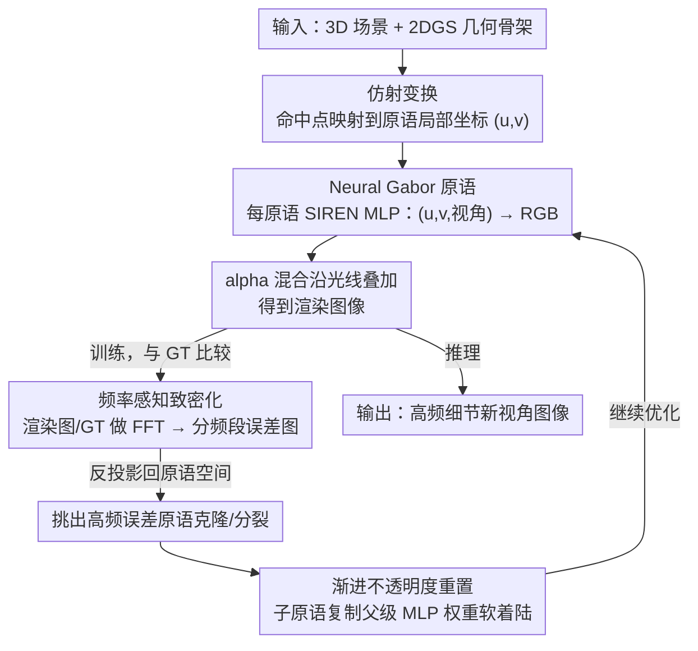

# Neural Gabor Splatting: Enhanced Gaussian Splatting with Neural Gabor for High-frequency Surface Reconstruction

**会议**: CVPR 2026  
**arXiv**: [2604.15941](https://arxiv.org/abs/2604.15941)  
**代码**: [https://github.com/haato-w/neural-gabor-splatting](https://github.com/haato-w/neural-gabor-splatting)  
**领域**: 3D视觉  
**关键词**: 高斯溅射, 高频表面重建, 神经纹理, MLP原语, 频率感知致密化

## 一句话总结

Neural Gabor Splatting 为每个高斯原语嵌入一个轻量级 MLP（SIREN 架构），使单个原语能表示复杂的空间变化颜色模式，配合频率感知致密化策略，在相同数据预算下显著提升高频表面重建质量。

## 研究背景与动机

**领域现状**：3D 高斯溅射（3DGS）因其显式点云表示的优势（快速训练、实时渲染、方便编辑）成为新视角合成的主流方法。但典型场景需要数十万到上百万个高斯原语，内存开销巨大。

**现有痛点**：每个高斯原语只能表示一种颜色（给定视角方向），当场景包含高频细节（如棋盘格纹理、毛发等频繁颜色跳变区域）时，需要大量原语来覆盖每个颜色变化，导致原语数量急剧增长。

**核心矛盾**：原语的表达能力受限是存储开销的根本原因。现有改进方案各有局限：3D Gabor Splatting 受限于 Gabor 噪声函数的性质，纹理化高斯受限于预设纹理分辨率。

**本文目标**：提升单个原语的表达能力，使其能用更少的原语实现更好的高频表面重建。

**切入角度**：受神经纹理/延迟渲染的启发，用一个小型 MLP 来参数化每个原语内部的颜色变化，使单个原语能表示任意复杂的局部图案。

**核心 idea**：为每个 2D 高斯原语嵌入一个独立的轻量级 SIREN MLP，输入局部坐标和视角方向，输出 RGB 颜色。SIREN 的正弦激活天然编码高频信号，无需额外的位置编码。

## 方法详解

### 整体框架

这篇论文想解决的是高斯溅射在高频纹理上"原语爆炸"的问题：标准 3DGS 每个原语只能呈现一种（视角相关的）颜色，遇到棋盘格、毛发这类颜色频繁跳变的区域，就只能靠堆原语来逐块拼出花纹，存储随之膨胀。作者的思路是把"表达能力"塞回原语内部——让每个原语自己会画一小块复杂图案，从而用更少的原语覆盖同样的细节。

整体管线沿用 2D 高斯溅射（2DGS）的几何骨架：每个原语先通过仿射变换把命中它的 3D 点映射到自己的局部 2D 坐标 $(u, v)$。区别在于颜色不再由球谐系数给出，而是把 $(u, v)$ 连同视角方向 $\vec{d}$ 喂给该原语专属的小 MLP，直接吐出 RGB。最终像素颜色照常用 alpha 混合把沿光线的原语叠起来：

$$\mathbf{c} = \sum_k \hat{\boldsymbol{c}}_k(\Theta_k, u, v, \vec{d}) \, \alpha_k \hat{G}_k T_k$$

其中 $\hat{\boldsymbol{c}}_k$ 是第 $k$ 个原语的 MLP 在该交点处预测的颜色。围绕这个核心改动，论文再配一套频率感知的致密化来控制原语该往哪里加。

### 关键设计

**1. Neural Gabor 原语：让单个原语自己画出空间变化的颜色**

痛点很直接——一个原语一种颜色，高频花纹就只能靠原语数量硬铺。作者给每个原语配一个独立的、单隐层 6 神经元的 SIREN MLP，把原语从"一个色块"升级成"一台微型纹理生成器"。输入是 5 维向量 $\mathbf{y} = (u, v, \vec{d})$（局部坐标 + 视角），输出经一次正弦激活和 sigmoid 压到 RGB：

$$\hat{\boldsymbol{c}}_k = \text{Sigmoid}\big[\bar{\mathbf{W}}_k \sin\{\omega_0(\mathbf{W}_k \mathbf{y} + \boldsymbol{b}_k)\} + \bar{\boldsymbol{b}}_k\big]$$

关键在那个正弦激活和频率参数 $\omega_0 = 30$：SIREN 的 $\sin(\omega_0 \cdot)$ 本身就相当于隐式的位置编码，让这个极小的网络也能拟合高频信号，省掉了额外的 Fourier features。相比离散纹素，MLP 是连续、分辨率无关的表示，不会有放大后的纹理锯齿；相比球谐、Gabor 这类固定基函数，它能学任意复杂的局部图案。每个原语各持一套权重，意味着精细建模发生在原语级别，而不是靠全局共享网络去兼顾所有位置。

**2. 频率感知致密化：把新增原语精准投到"高频还没补上"的地方**

引入逐原语 MLP 后，传统基于梯度的致密化会失灵——MLP 学到的颜色变化会让梯度天然偏大，于是到处都被判定"需要加原语"，造成过度致密化。作者改在频域里算"哪儿还欠细节"：对当前渲染图和 GT 分别做 FFT，按预设频段（$0.01$–$0.10$、$0.10$–$0.20$、$0.20$–$0.40$）取出对应分量做 IFFT，再局部平均，得到一张频域误差图。把这张误差图按逐像素反投影回原语空间，误差高的原语才被挑出来克隆/分裂。这样新原语就被定向投放到高频信息缺失的区域，而不是被大梯度误导到处铺。可控性是顺带的好处：因为误差是按频段拆开的，存储受限时可以选择优先补哪个频段，做质量-容量的精细权衡。

**3. 渐进不透明度重置：别让新生原语的 MLP 权重一夜失效**

原始 3DGS 会周期性地把不透明度硬重置，用来清掉冗余原语。但在这里每个原语都背着一套训练好的 MLP，硬重置容易让这些参数瞬间作废、训练抖动。作者改成渐进式重置：克隆/分裂出的子原语直接复制父级的 MLP 权重，并对不透明度做一次校正，让新原语带着已学到的纹理"软着陆"进入后续优化，保持致密化过程的稳定。

### 损失函数 / 训练策略

训练目标是标准的 $\lambda L_1 + (1-\lambda) L_{SSIM}$。MLP 权重按 SIREN 的初始化方案初始化；致密化时每 100 次迭代随机采样 20 个训练视角，在 GPU 上累积它们的频域误差作为克隆/分裂依据，致密化阈值取 0.01，总共训练 20k 迭代。

## 实验关键数据

### 主实验

| 方法 | High-Frequency PSNR/SSIM/LPIPS | Mip-NeRF360 PSNR/SSIM/LPIPS |
|------|-------------------------------|------------------------------|
| 3DGS* | 23.97/0.8335/0.2769 | 27.23/0.8005/0.2931 |
| 2DGS* | 23.91/0.8279/0.2855 | 26.47/0.7804/0.3197 |
| NEST | 22.22/0.8588/0.2220 | - |
| NTS | 23.48/0.8139/0.3026 | 29.49/0.9028/0.2544 |
| **Ours** | **26.49/0.8808/0.2115** | 26.98/0.810/0.2521 |

### 消融实验

| 致密化策略 | High-Frequency PSNR/SSIM/LPIPS |
|-----------|-------------------------------|
| 频率感知（本文） | 25.72/0.8619/0.2352 |
| 误差驱动 | 25.95/0.8619/0.2376 |
| 梯度驱动 | 25.56/0.8534/0.2464 |

### 关键发现

- 在 High-Frequency 数据集上 PSNR 提升 2.5+ dB（vs 2DGS），证明了 neural Gabor 原语在高频场景的巨大优势
- 相同数据预算下，neural Gabor 原语的视觉质量显著锐利，毛发、棋盘格等细节远优于标准方法
- 频率感知致密化与误差驱动致密化精度相当但提供了频段级的可控性
- 低预算场景（1%-5% 数据）下优势更明显，NEST 和 NTS 在严格预算下快速退化
- 训练时间约为 2DGS 的 2 倍，但与 NEST/NTS 的 neural splatting 方法相当

## 亮点与洞察

- **最小化 MLP 设计极致精简**：单隐层 6 神经元的 SIREN，参数量极小但通过正弦激活获得了强大的高频表达能力。这证明了"微型网络+正确的激活函数"的强大组合
- **频率感知致密化的可控性**：可以精确选择在哪个频段上分配更多原语，为存储受限场景提供了精细的质量-容量平衡工具
- **连续 vs 离散表示优势**：与纹理图方案相比，MLP 天然分辨率无关，不会出现纹理锯齿

## 局限与展望

- 每个原语独立 MLP 的 atomicAdd 操作增加了训练时间（约 2x）
- 不直接适用于体积现象（如雾、烟），扩展到动态场景也不平凡
- 对于低频场景 MLP 的表达能力可能未被充分利用，存在参数浪费
- 未来方向：参数共享或 codebook 压缩可进一步减少存储

## 相关工作与启发

- **vs 3D Gabor Splatting**: 3D Gabor 受限于 Gabor 噪声函数的固定形式，neural Gabor 用 MLP 表达更灵活
- **vs NTS/NEST**: 这些方法使用哈希网格或三平面编码，在低预算下表达能力有限；neural Gabor 在低预算下更鲁棒
- **vs 纹理化高斯**: 纹理方案受限于预设分辨率且有方向依赖性，MLP 连续且分辨率无关

## 评分

- 新颖性: ⭐⭐⭐⭐ 逐原语 MLP 的思路直观有效，频率感知致密化设计精巧
- 实验充分度: ⭐⭐⭐⭐ 多数据集对比全面，预算分析和消融详细
- 写作质量: ⭐⭐⭐⭐ 方法描述清晰，数学公式完整
- 价值: ⭐⭐⭐⭐ 在存储受限的高频场景重建中提供了实用的解决方案

<!-- RELATED:START -->

## 相关论文

- [\[CVPR 2026\] 3D Gaussian Splatting with Self-Constrained Priors for High Fidelity Surface Reconstruction](3d_gaussian_splatting_with_self-constrained_priors_for_high_fidelity_surface_rec.md)
- [\[CVPR 2026\] NVGS: Neural Visibility for Occlusion Culling in 3D Gaussian Splatting](nvgs_neural_visibility_for_occlusion_culling_in_3d_gaussian_splatting.md)
- [\[CVPR 2026\] HyperGaussians: High-Dimensional Gaussian Splatting for High-Fidelity Animatable Face Avatars](hypergaussians_high-dimensional_gaussian_splatting_for_high-fidelity_animatable_.md)
- [\[CVPR 2026\] ManifoldNeuS: Manifold-aware View Optimizability for Pose-Free Neural Surface Reconstruction](manifoldneus_manifold-aware_view_optimizability_for_pose-free_neural_surface_rec.md)
- [\[CVPR 2026\] Distilling Unsigned Distance Function for Surface Reconstruction from 3D Gaussian Splatting](distilling_unsigned_distance_function_for_surface_reconstruction_from_3d_gaussia.md)

<!-- RELATED:END -->
