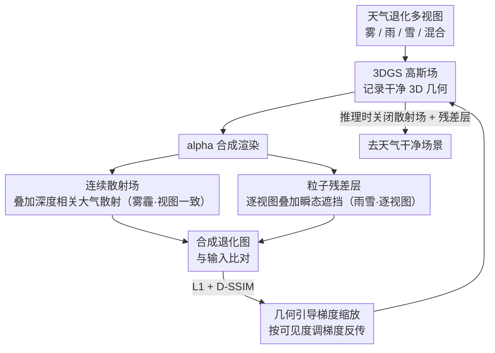

# NimbusGS: Unified 3D Scene Reconstruction under Hybrid Weather

**会议**: CVPR 2026  
**arXiv**: [2603.27228](https://arxiv.org/abs/2603.27228)  
**代码**: [https://github.com/lyy-ovo/NimbusGS](https://github.com/lyy-ovo/NimbusGS)  
**领域**: 3D视觉  
**关键词**: 3D高斯溅射, 恶劣天气, 场景重建, 物理建模, 天气分解

## 一句话总结

NimbusGS 提出统一的3D场景重建框架，通过将天气退化分解为连续散射场（雾/霾）和逐视图粒子残差层（雨/雪），配合几何引导梯度缩放机制，在单一框架内实现跨天气和混合天气条件下的SOTA重建。

## 研究背景与动机

3D场景重建假设输入干净高质量，但实际环境中雾、雨、雪等天气严重影响成像。天气退化有两种机制：(1) 连续介质（雾/霾）——深度相关的光衰减，视图间一致；(2) 离散粒子（雨/雪）——动态高频遮挡，视图间独立。

**现有方法的局限**：预处理恢复+重建的两阶段方案破坏多视图一致性；将天气建模嵌入重建的方案通常只针对单一天气类型。在混合天气（如同时有雾和雨）场景下，现有方法普遍失效。

**本文核心**：基于天气的物理本质，设计统一框架同时建模连续散射和离散粒子两种退化机制。

## 方法详解

### 整体框架

NimbusGS 要回答的问题是：当训练图像同时被雾、雨、雪污染时，如何只用一套模型把干净的 3D 几何从天气干扰里剥离出来。它的做法不是先去天气再重建，而是把"重建"和"建模天气"放在同一个优化目标里同时进行——核心观察是天气退化在物理上分两类，正好对应两种截然不同的建模方式。于是它在标准 3DGS 的高斯场之外挂了两个退化分支：一个**连续散射场**负责雾霾这种视图一致的全局衰减，一个**粒子残差层**负责雨雪这种逐视图的局部遮挡；再加一个**几何引导梯度缩放**让优化在重度遮挡下不跑偏。训练收敛后，干净结构留在高斯场里，天气干扰被吸进两个退化分支，渲染时把它们关掉就得到去天气的场景。

### 关键设计

**1. 连续散射场：把雾霾当成全局物理效应，而不是逐像素噪声**

雾和霾的本质是大气介质对光的散射，它造成的衰减只跟深度有关，且对所有视角是一致的——同一个远处物体，从哪个相机看都被同样浓度的雾遮着。如果像噪声那样逐视图去拟合，反而会破坏多视图几何一致性。NimbusGS 因此用一个场景级的体积消光场来估计透射率和大气光：透射率随深度单调衰减（越远越朦胧），大气光是一个被所有视图共享的全局量。渲染时在 3DGS 的 alpha 合成结果上叠加这层大气散射模型，让"看起来朦胧"这件事由物理参数解释，而不是逼高斯去硬拟合朦胧的颜色。这样高斯场本身仍然记录的是清晰场景，雾的浓淡被单独一组共享参数接管。

**2. 粒子残差层：雨雪是逐视图的瞬态遮挡，用独立残差图兜住**

雨滴和雪花跟雾相反——它们是离散的高频粒子，在每一帧出现的位置都不同，没法用任何视图一致的方式建模。硬把它们塞进 3D 高斯，会让模型为了解释这些"幻影"而生成大量错误的漂浮几何。NimbusGS 的处理是给每个视图单独维护一张残差图，专门捕获该视图特有的动态干扰；这张残差图在渲染之后叠加到结果上，不参与、也不污染底层的 3D 几何。训练时不需要人工标注哪是雨哪是结构，优化会自发地分工：在多个视图里稳定出现的内容归到共享的高斯场，只在单帧闪现的瞬态内容归到该帧的残差层——因为前者用共享几何解释最省参数，后者只能靠逐视图残差兜住。

**3. 几何引导梯度缩放：按可见度调梯度，别让重度退化区主导优化**

天气让画面里的可见度极不均匀：近处清晰、远处被浓雾吞没。问题在于这些远处重度退化区域真正有用的重建信号很弱，但梯度幅度却可能因为天气噪声而异常地大，结果优化被这些噪声大梯度带偏，近处本该学好的几何反而被拖累。NimbusGS 用可见度线索自适应地缩放各区域的梯度：可见度高的区域保留正常梯度照常学习，可见度低的区域按比例压低梯度，避免噪声主导。这一步本质上是给优化器一个"信任度"——清楚的地方多学，看不清的地方少冒进，从而稳住了远处和重度退化区域的几何。

### 损失函数 / 训练策略

采用渐进式优化逐步解耦连续散射与粒子效应，避免两个退化分支在训练早期互相抢功。监督由 L1 重建损失 + D-SSIM 构成，并对散射场和残差层各加正则化约束，防止它们把本属于高斯场的结构也吸走。整个流程不需要配对的干净/退化数据，也不依赖大规模预训练。

## 实验关键数据

### 主实验

| 天气条件 | NimbusGS | 之前SOTA | 提升 |
|---------|----------|---------|------|
| 雾/霾 | SOTA | DehazeGS | 显著提升 |
| 雨 | SOTA | DeRainGS | 显著提升 |
| 雪 | SOTA | WeatherGS | 显著提升 |
| 混合天气 | **新基准** | 无可比方法 | — |

在单一天气和混合天气条件下全面超越各专用方法。

### 消融实验

| 配置 | PSNR | 说明 |
|------|------|------|
| 仅3DGS基线 | 低 | 天气严重影响重建 |
| + 连续散射场 | 提升 | 全局退化去除 |
| + 粒子残差层 | 进一步提升 | 局部干扰去除 |
| + 梯度缩放 | 最优 | 远处几何改善 |

### 关键发现

- 物理驱动的分解比数据驱动的端到端方法更鲁棒，尤其在混合天气下优势明显
- 梯度缩放对远处/重度退化区域的重建质量有关键贡献
- 统一框架的泛化能力：无需针对新天气类型做任何调整

## 亮点与洞察

- **物理驱动的优雅分解**：将天气按物理机制分为连续/离散两类，每类用对应的建模方式处理，既物理合理又工程简洁
- **梯度缩放的通用性**：这种基于可见度的自适应优化策略可以迁移到其他退化场景（如低光照、水下等）
- **统一框架的价值**：一个模型处理所有天气，避免了维护多个专用模型的工程负担

## 局限与展望

- 粒子残差层的容量有限，对极端降水（如暴雨）可能不足
- 连续散射场假设均匀大气，对非均匀雾（如局部浓雾）不够灵活
- 未验证在极端天气组合（如雪+雾+雨）下的表现
- 未来可扩展到动态场景（如移动车辆+天气）

## 相关工作与启发

- **vs WeatherGS**: WeatherGS 分离粒子和透镜伪影但需要2D先验，NimbusGS 在3D空间中统一建模
- **vs DehazeNeRF/ScatterNeRF**: 这些方法只处理雾霾，NimbusGS 同时处理雾+雨+雪
- **vs RainyScape/DeRainGS**: 专用雨天方法，缺乏对其他天气的泛化能力

## 评分

- 新颖性: ⭐⭐⭐⭐ 物理分解思路清晰，梯度缩放设计实用
- 实验充分度: ⭐⭐⭐⭐ 多天气条件覆盖全面
- 写作质量: ⭐⭐⭐⭐ 物理动机阐述清楚
- 价值: ⭐⭐⭐⭐ 对自动驾驶等户外3D重建有直接应用价值

<!-- RELATED:START -->

## 相关论文

- [\[CVPR 2026\] WeatherCity: Urban Scene Reconstruction with Controllable Multi-Weather Transformation](weathercity_urban_scene_reconstruction_with_controllable_multi-weather_transform.md)
- [\[CVPR 2026\] Scene Reconstruction as Mapping Priors for 3D Detection](scene_reconstruction_as_mapping_priors_for_3d_detection.md)
- [\[ICCV 2025\] RobuSTereo: Robust Zero-Shot Stereo Matching under Adverse Weather](../../ICCV2025/3d_vision/robustereo_robust_zero-shot_stereo_matching_under_adverse_weather.md)
- [\[CVPR 2026\] Revisiting Pose Sensitivity in Splat-based Computed Tomography under Sparse-view Reconstruction](revisiting_pose_sensitivity_in_splat-based_computed_tomography_under_sparse-view.md)
- [\[CVPR 2026\] Urban-GS: A Unified 3D Gaussian Splatting Framework for Compact and High-Fidelity Aerial-to-Street Reconstruction](urban-gs_a_unified_3d_gaussian_splatting_framework_for_compact_and_high-fidelity.md)

<!-- RELATED:END -->
