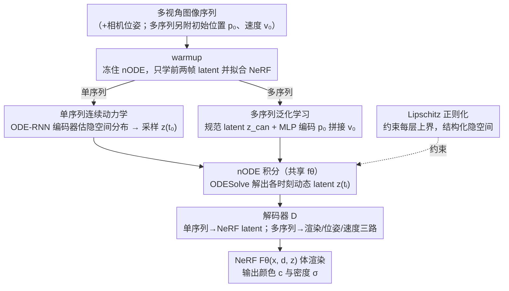

# Node-RF: Learning Generalized Continuous Space-Time Scene Dynamics with Neural ODE-based NeRFs

**会议**: CVPR 2026  
**arXiv**: [2603.12078](https://arxiv.org/abs/2603.12078)  
**代码**: 无（论文称 will be made publicly available）  
**领域**: 3D视觉 / 动态场景重建  
**关键词**: Neural ODE, NeRF, 动态场景, 时空外推, 轨迹泛化

## 一句话总结

Node-RF 将 Neural ODE 与 NeRF 紧密耦合，用连续时间微分方程驱动隐式场景表征的时序演化，实现了远超训练时域的长程外推与跨轨迹泛化，在 Bouncing Balls、Pendulum、Oscillating Ball 等数据集上显著优于 D-NeRF、4D-GS 等基线。

## 研究背景与动机

### 领域现状

从图像序列建模动态 3D 场景是计算机视觉的核心问题。NeRF 成功解决了静态场景的新视角合成后，研究者将其扩展到 4D 时空场景：D-NeRF 和 Nerfies 用形变场将每帧映射到规范空间；HexPlane/K-Planes 用低秩特征分解加速时空建模；4D Gaussian Splatting 则用显式点云实现实时渲染。

### 现有痛点

现有动态 NeRF 方法存在两个根本性缺陷：

**外推能力差**：时间维度被离散化为逐帧参数（如 per-frame latent code 或 deformation field），模型只在训练时域内有效，无法向未来做长程外推——超出几帧就会出现抖动、物体消失或场景崩塌。

**缺乏泛化能力**：形变场是单序列绑定的，换一组初始条件（如物体初始位置/速度）就需要重新训练，无法学到"通用运动规律"。

### 核心矛盾

问题根源在于：这些方法**记忆的是离散状态，而非学习连续动力学**。它们用离散索引查找时间信息，没有对运动的微分结构进行建模，因此无法在时间维度上做外推推理。

### 本文切入角度

Neural ODE 提供了一种用微分方程描述隐状态连续演化的框架——隐状态的变化率由神经网络参数化，ODE solver 可以在任意时刻求解状态。Node-RF 的核心 idea 是：**用 Neural ODE 驱动 NeRF 的 latent code 随时间演化，让场景表征从"逐帧记忆"变为"连续动力学建模"**，从而获得长程外推和跨轨迹泛化能力。

## 方法详解

### 整体框架

Node-RF 要解决的事很明确：让动态 NeRF 不再"逐帧记忆"，而是学到一套随时间连续演化的动力学，从而能在训练时域之外做长程外推、并对没见过的初始条件做泛化。它把一个 Neural ODE 缝进 NeRF 的隐空间——不再为每帧单独存一份时间参数，而是只维护一个隐状态 $z_t$，让它的变化率 $\dot z = f_\theta(z_t, t)$ 由神经网络给出，任意时刻的 latent 都由 ODE solver 从初始状态积分出来。

整条 pipeline 这样转：多视角图像序列（带相机位姿，多序列任务还附带物体初始位置/速度）进来后，先确定一个初始隐状态 $z_{t_0}$，ODE solver 沿时间轴一次性解出所有时刻的 latent，再把每个时刻的 $z_{t_i}$ 连同空间坐标 $x$、视角方向 $d$ 一起喂给 NeRF $F_\Theta$ 渲染出颜色和密度。两步用公式串起来：

$$z_{t_0}, \ldots, z_{t_N} = \text{ODESolve}(f_\theta, z_{t_0}, (t_0, \ldots, t_N))$$
$$F_\Theta(x, d, z_{t_i}) = (c, \sigma)$$

时间在这里是微分方程的自变量，而不是查表的索引——这正是它能外推的根本原因。整个系统端到端训练，并按数据形态拆成两个子任务：单序列任务学一段视频自己的内插与外推，多序列任务从一批不同初始条件的轨迹里抽出共享的运动规律。

### 关键设计

**1. 单序列连续动力学：用 Latent ODE 把一段视频的演化变成可积分的微分方程**

针对的痛点是帧级方法只会在训练帧之间内插、一外推就抖动崩塌。Node-RF 用 Latent ODE（一个 ODE-RNN 变分自编码器）来建模时序，训练分两步走。先是 warmup：冻住 nODE，只学前两帧对应的 latent $z_{t_0}$、$z_{t_1}$，同时让 NeRF 把这两帧拟合好，给后续动力学一个干净的起点。然后联合训练：解冻 nODE，把这两个 latent 送进 ODE-RNN 编码器估出隐空间的正态分布，采样得到初始状态 $z_{t_0}$，由 ODE solver 积分出各时刻的动态 latent $z_{t_i}^{\text{dyn}}$，再经解码器 $\mathcal{D}$ 映射成 NeRF 用的 latent。

之所以有效，是因为 nODE 对微分函数沿时间积分，天然逼着相邻状态平滑过渡，不会像逐帧形变场那样在帧间跳变；而 ODE solver 能在任意时刻求值，外推时只是把积分上限往后推，不需要去外插一个根本不存在的离散索引。和 D-NeRF 的本质区别就在这：D-NeRF 给每帧学一个独立形变场、时间是查找键，Node-RF 的 latent 是同一条微分方程连续演化出来的。

**2. 多序列泛化学习：条件化初始状态 + 共享 nODE，逼模型学"规律"而非"记轨迹"**

这一设计回答的是"换一组初始条件要不要重训"。做法是把静态和动态彻底分开：warmup 阶段先学一个静态 latent $z_{\text{static}}$ 吃下不变的背景；联合训练阶段再优化一个规范 latent $z_{\text{can}}$ 当场景参照，并把初始位置 $p_0^c$ 用 MLP 编码器 $\mathcal{E}$ 编码后，与初始速度 $v_0^c$、$z_{\text{can}}$ 拼接送入 nODE，解出各时刻的动态 latent $z_{t_i,c}^{\text{dyn}}$。这个动态 latent 再分三路解码：一路加回 $z_{\text{static}}$ 送 NeRF 渲染，一路预测物体位姿 $\hat{p}_{t_i}^c$，一路预测物体速度 $\hat{v}_{t_i}^c$。

关键在于 nODE 的参数在所有轨迹间共享、只有初始状态随序列变化——模型没法再去背某一条轨迹，只能把公共的运动规律压进 $f_\theta$。静态/动态 latent 分离让背景不再污染动力学建模，而位姿和速度这两路额外监督给 ODE 注入了纯视觉之外的梯度，让它学到的动力学和真实物理对得上。推理时只要给一组新的 $(p_0, v_0)$，就能积分出一条全新轨迹。

**3. Lipschitz 正则化：约束每层的 Lipschitz 上界，把隐空间整理成有结构的动力系统**

没有约束时，不同轨迹的 latent 在隐空间里乱成一团，看不出任何拓扑结构，动力学也就无从分析。Node-RF 给每个线性层 $y = \sigma(W_i x + b_i)$ 配一个可训练的 Lipschitz bound $c_i$，按 $W_i \leftarrow \text{normalization}(W_i, \text{softplus}(c_i))$ 归一化权重，并把所有层的界连乘起来作为正则项 $\mathcal{L}_{\text{lipschitz}} = \prod_i \text{softplus}(c_i)$ 一起优化。

约束加上之后，隐空间会自己长出和物理系统一致的形状——在 Bifurcating Hill 数据集上能可视化出山顶的不稳定分岔点和两侧谷底的稳定吸引盆。这让 Node-RF 学到的不只是好看的渲染，而是一套可解释、可做临界点分析的动力学表征。

### 一个完整示例

以 Bouncing Balls 的一段序列为例，把上面三块怎么串起来走一遍。先 warmup：模型只盯着前两帧，学出 $z_{t_0}$、$z_{t_1}$ 并让 NeRF 把这两帧渲染对，此时 nODE 还冻着。进入联合训练后，ODE-RNN 编码器吃下这两个 latent 给出隐空间分布，采样得到起点 $z_{t_0}$，dopri5 solver 沿时间轴一路积分出后续每一帧的 $z_{t_i}^{\text{dyn}}$，解码成 NeRF latent 后渲染，和 GT 帧算重建损失回传——梯度同时穿过 NeRF、解码器、nODE 和编码器。训练完做 4× 外推时，只需把 solver 的积分区间从训练时域 $[t_0, t_N]$ 延长到 $[t_0, t_{4N}]$，球继续按学到的动力学弹跳，而不会像 D-NeRF 那样一出训练帧就抖动消失。

### 损失函数 / 训练策略

总损失为加权求和：

$$\mathcal{L} = \lambda_1 \mathcal{L}_{\text{NeRF}} + \lambda_2 \mathcal{L}_p + \lambda_3 \mathcal{L}_v + \lambda_4 \mathcal{L}_{\text{lipschitz}}$$

- $\mathcal{L}_{\text{NeRF}}$：渲染颜色与 GT 的 L2 重建损失（coarse + fine 两级）
- $\mathcal{L}_p$、$\mathcal{L}_v$：物体位姿和速度的 L1 辅助损失（仅多序列任务使用）
- $\mathcal{L}_{\text{lipschitz}}$：Lipschitz 正则项

权重设置：$\lambda_1=1$，$\lambda_2=\lambda_3=10^{-2}$，$\lambda_4=10^{-22}$（正则权重极小，仅起结构化约束作用）。

训练细节：512 维 latent；Adam 优化器（lr=5e-4）；Bouncing Balls 用 dopri5 solver（长程外推更稳定），其余用 Euler solver（step-size=0.05）；训练 300k-500k 迭代；warmup 在 5k 迭代处启动。

## 实验关键数据

### 主实验：长程外推（Bouncing Balls，4× 外推）

| 方法 | X-CLIP Sim↑ | LLaVA-Video Sim↑ | Motion Smoothness↑ | Subject Consistency↑ |
|------|------------|------------------|-------------------|---------------------|
| D-NeRF | 0.1691 | 0.7807 | 0.99473 | 0.97352 |
| 4D-GS | 0.1484 | 0.7230 | 0.99538 | 0.92589 |
| HexPlane | 0.1732 | 0.6673 | 0.99617 | 0.77407 |
| TiNeuVox | 0.1773 | 0.7883 | 0.99468 | 0.96428 |
| MotionGS | 0.1760 | 0.7693 | 0.99465 | 0.97562 |
| **Node-RF** | **0.1775** | **0.7937** | **0.99648** | **0.97775** |

Node-RF 在所有 4 项指标上均取得最优，尤其在 Motion Smoothness 和 Subject Consistency 上优势明显，说明 nODE 驱动的连续演化在长程外推中保持了物理合理的平滑运动和物体一致性。

### Pendulum 数据集（内插+外推）

| 方法 | 内插 SSIM↑ | 内插 LPIPS↓ | 内插 PSNR↑ | 外推 SSIM↑ | 外推 LPIPS↓ | 外推 PSNR↑ |
|------|-----------|-----------|-----------|-----------|-----------|-----------|
| SimVP | - | - | - | 0.617 | 0.0194 | 15.804 |
| D-NeRF | 0.437 | 0.0333 | 13.906 | 0.426 | 0.0374 | 13.295 |
| 4D-GS | 0.455 | 0.0300 | 13.391 | 0.463 | 0.0310 | 12.940 |
| **Node-RF** | **0.531** | **0.0234** | **17.057** | 0.469 | **0.0257** | **15.920** |

Node-RF 内插 PSNR 领先 D-NeRF 超过 3dB。D-NeRF 和 4D-GS 几乎无法捕捉摆锤运动（只学到背景），而 Node-RF 成功建模了动态前景。

### 多序列泛化（IoU）

| 方法 | 3D支持 | Oscillating Ball IoU↑ | Bifurcating Hill IoU↑ |
|------|--------|----------------------|----------------------|
| Vid-ODE | ✗ | - | 0.000 |
| SimVP | ✗ | - | 0.295 |
| D-NeRF(c) | ✓ | 0.0008 | 0.003 |
| **Node-RF** | ✓ | **0.3327** | **0.485** |

Node-RF 在泛化任务上碾压式领先。D-NeRF(c)（条件化版本）几乎完全失败（IoU<0.01），说明简单地将初始条件注入 D-NeRF 并不能实现泛化；而 Node-RF 的 nODE 架构天然支持从初始条件推演完整轨迹。

### 消融实验

| 损失组合 | SSIM↑ | LPIPS↓ | PSNR↑ | IoU↑ |
|---------|------|-------|------|-----|
| $\mathcal{L}_{\text{NeRF}}$ only | 0.630 | 0.4920 | 28.661 | 0.2730 |
| $+ \mathcal{L}_p + \mathcal{L}_v$ | 0.661 | 0.4396 | 29.080 | 0.3253 |
| $+ \mathcal{L}_{\text{lipschitz}}$ (完整) | **0.662** | **0.4364** | **29.091** | **0.3327** |

| Latent 维度 | SSIM↑ | LPIPS↓ | PSNR↑ |
|------------|------|-------|------|
| 256 | 0.976 | 0.0318 | 32.29 |
| **512** | **0.978** | **0.0310** | **33.70** |
| 1024 | 0.975 | 0.0397 | 32.74 |

**关键发现**：
- 仅用 NeRF 重建损失已可实现基本泛化（IoU=0.273），辅助位姿/速度损失将 IoU 提升至 0.325。
- Lipschitz 正则对定量指标影响微小，但对隐空间结构化至关重要——无正则时隐空间混乱，加入后出现清晰的动力学拓扑。
- 512 维 latent 是最优选择，过小（256）欠拟合，过大（1024）反而过拟合。

## 亮点与洞察

1. **连续时间建模的优雅性**：用微分方程替代离散时间索引，是从"记忆状态"到"学习规律"的本质转变。nODE 的平滑积分天然避免了帧级方法的抖动和不连续。
2. **跨轨迹泛化能力**：通过共享 nODE 参数 + 条件化初始状态，首次在 NeRF 框架下实现了"给新初始条件，预测新轨迹"的泛化能力，这是现有动态 NeRF 完全做不到的。
3. **隐空间可解释性**：Lipschitz 正则化后的隐空间呈现出与物理系统一致的拓扑结构（分岔点、吸引子），可用于动力系统分析和临界点识别，超越了单纯的视觉重建。
4. **极简监督**：单序列任务仅需纯视觉监督（无需光流、深度、3D GT），多序列任务也只需少量初始条件标注。

## 局限性与可改进方向

1. **仅验证在合成/简单数据集上**：当前实验数据集规模小、场景简单（弹球、摆锤、球滚山），距真实世界复杂场景差距较大，需要在大规模真实动态场景上验证。
2. **确定性场景假设**：框架本质上假设给定初始条件后动力学是确定的。对于随机性运动（如 DyNeRF 的真实视频），性能退化明显，论文也承认此局限。
3. **训练成本高**：300k-500k 迭代 + ODE solver 的反向传播（adjoint method）计算开销大，效率远不如 4D-GS 等显式方法。
4. **缺乏与 3D Gaussian Splatting 的深度整合**：NeRF 的体渲染本身效率较低，若将 nODE 与 3DGS 结合可能获得更好的效率-质量平衡。
5. **泛化能力的边界未明确**：目前仅测试了位置/速度变化的泛化，对于形状、材质、拓扑变化等更复杂的泛化场景尚无验证。

## 相关工作与启发

- **D-NeRF / Nerfies / HyperNeRF**：形变场系列，擅长短程内插但无外推能力，Node-RF 的 nODE 替代了离散形变场。
- **DONE**：最相关的工作，同样用 Neural ODE + 动态重建，但采用两阶段 mesh-based pipeline（先重建静态 mesh 再学形变）。Node-RF 直接在 NeRF 体渲染框架内端到端训练，无需 mesh scaffold。
- **MonoNeRF**：支持多场景泛化但需要光流、深度图、分割掩码等额外监督，Node-RF 监督更轻量。
- **Vid-ODE**：将 Neural ODE 用于 2D 视频建模，Node-RF 将其扩展到 3D 场景。
- **Latent ODE**：Node-RF 的单序列模块直接继承了其 ODE-RNN VAE 架构。

## 评分

| 维度 | 分数 (1-10) | 说明 |
|------|-----------|------|
| 新颖性 | 7 | nODE + NeRF 的耦合思路清晰优雅，但 DONE 等工作已有类似探索 |
| 技术深度 | 7 | 两阶段训练、多解码器、Lipschitz 正则设计合理，但数学复杂度适中 |
| 实验充分性 | 6 | 多个数据集+消融完整，但数据规模偏小，缺乏真实场景定量评估 |
| 写作质量 | 7 | 结构清晰、动机阐述到位，图示丰富 |
| 实用价值 | 5 | 概念验证阶段，距实际应用有距离 |
| **总分** | **6.4** | 思路优雅、方向正确的概念验证工作，验证了 nODE 驱动动态 NeRF 的可行性 |

<!-- RELATED:START -->

## 相关论文

- [\[CVPR 2026\] ParticleGS: Learning Neural Gaussian Particle Dynamics from Videos for Prior-free Physical Motion Extrapolation](particlegs_learning_neural_gaussian_particle_dynamics_from_videos_for_prior-free.md)
- [\[CVPR 2026\] LumiMotion: Improving Gaussian Relighting with Scene Dynamics](lumimotion_gaussian_relighting_dynamics.md)
- [\[CVPR 2026\] Evidential Neural Radiance Fields](evidential_neural_radiance_fields.md)
- [\[CVPR 2026\] RF4D: Neural Radar Fields for Novel View Synthesis in Outdoor Dynamic Scenes](rf4dneural_radar_fields_for_novel_view_synthesis_in_outdoor_dynamic_scenes.md)
- [\[CVPR 2026\] Point4Cast: Streaming Dynamic Scene Reconstruction and Forecasting](point4cast_streaming_dynamic_scene_reconstruction_and_forecasting.md)

<!-- RELATED:END -->
