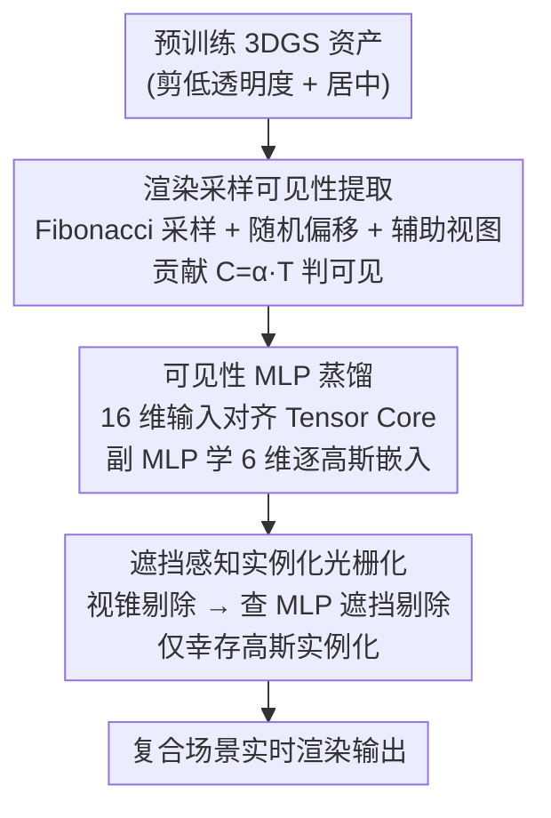

# NVGS: Neural Visibility for Occlusion Culling in 3D Gaussian Splatting

**会议**: CVPR 2026  
**论文**: [CVF Open Access](https://openaccess.thecvf.com/content/CVPR2026/html/Zoomers_NVGS_Neural_Visibility_for_Occlusion_Culling_in_3D_Gaussian_Splatting_CVPR_2026_paper.html)  
**代码**: https://brent-zoomers.github.io/nvgs/ (项目页)  
**领域**: 3D视觉  
**关键词**: 3D高斯泼溅, 遮挡剔除, 神经可见性, 实例化光栅化, 大规模渲染

## 一句话总结
NVGS 把每个 3DGS 资产里所有高斯的"视点相关可见性"蒸馏进一个共享小 MLP，在光栅化前查询它来丢弃被遮挡的高斯，再配上一个只对存活高斯做实例化的光栅化器，让由上亿高斯组成的复合场景在实时帧率下渲染，同时把显存压到 V3DG 的约四分之一、画质反而更高。

## 研究背景与动机
**领域现状**：3DGS 已经成为高质量、可快速训练/渲染的 3D 重建主力。当场景越来越大、越来越复杂（如游戏、影视里由很多独立资产拼起来的复合场景），社区借鉴了图形学里的两类加速手段：视锥剔除（frustum culling）和细节层级（LoD）。LoD 路线（H3DG、LODGE、Octree-GS、FLoD、V3DG 等）通过分块/分层在远处用更少的高斯来省算力。

**现有痛点**：图形学里另一个极其有效的加速手段——遮挡剔除（occlusion culling）——却几乎没法直接搬到 3DGS 上。原因在于高斯是**半透明**的：传统遮挡剔除依赖不透明三角形，可见性是非黑即白的；而高斯的体渲染让"某个高斯到底可不可见"变成了一个连续、视点相关的问题，难以一刀切地剔除。

**核心矛盾**：复合场景里存在大量"渲染时冗余"——很多高斯被前面的高斯挡住、对最终像素零贡献，但现有管线仍然要把它们全部实例化、预处理、排序，白白吃掉显存和带宽。已有的剪枝/压缩工作大多关注**全局冗余**（训练后永久删掉不重要的高斯），而没有利用**逐帧、逐视点**的遮挡冗余。

**本文目标**：在不重训资产、不破坏原始质量的前提下，把"某高斯在某视点下是否可见"这件事低成本地存下来并在渲染时用上，从而在光栅化之前就丢弃被遮挡的高斯。

**切入角度**：作者的关键观察是——标准体渲染其实**隐式编码了一种软遮挡**：一旦某像素的透射率 $T$ 饱和（趋近 0），后续投影到该像素的高斯就可以丢弃而几乎不影响颜色。这天然地把背面高斯（类似网格的 backface culling）以及远距离下被挤到同一批像素上的前景高斯标记为"不可见"，而且随距离自动放大剔除率。

**核心 idea**：用一个轻量共享 MLP 把每个资产所有高斯的视点相关可见性函数"烘焙"下来，渲染时在光栅化前查询它来做高斯级遮挡剔除，并把这一查询深度嵌进一个专为复合场景设计的实例化光栅化器。

## 方法详解

### 整体框架
给定一个已训练好的 3DGS 资产，NVGS 分三步走：先把每个高斯在大量视点下的可见性"渲染采样"出来，再蒸馏进一个轻量 MLP（外加一个学习逐高斯嵌入的副 MLP），最后在一个实例化光栅化器里——每帧先做视锥剔除、再查 MLP 做遮挡剔除、**只对幸存高斯做实例化**——完成渲染。整条管线的精髓是把"昂贵的预处理"挪到只对真正会被看到的高斯上做。

### 关键设计

**1. 渲染采样式可见性提取：用体渲染的软遮挡当监督信号**

痛点是：高斯半透明，没有现成的"可见/不可见"标签，而且 3DGS 自带的 popping、aliasing 等伪影会让标签变脏。NVGS 不去解析推导，而是**直接渲染采样**：先把资产里透明度低于 $\frac{1}{255}$ 的废高斯剪掉并把物体居中，按投影屏幕尺寸算出相机的近/远采样距离（对角线占屏 90% 为近、5% 为远），把屏占比换算成距离用 $d = \frac{r}{\tan(\theta/2)\cdot p}$（$r$ 为包围盒对角线半长，$p$ 为目标屏占比，$\theta$ 为视场角）。然后用 Fibonacci 球面采样均匀取 2000 个方向、在近远距离间均匀采距离生成相机。为了抗伪影，还做两件事：给物体加一个随距离缩放的**随机偏移**（让它不总落在画面正中，抵抗投影不一致）；在锥面与球面交线上额外采一小批**辅助视图**（避免把 popping 误判成不可见）。一个高斯只要对主相机或任一辅助视图有非零贡献就算可见，贡献定义为 $C_{G,p}=\alpha_p\cdot T$（$\alpha_p$ 是该像素处不透明度，$T$ 是累计透射率）。这样得到的标签既无偏又鲁棒，能套用任意 3DGS 系方法。

**2. 轻量可见性 MLP：把可见性烘焙成对 Tensor Core 友好的 16 维查询**

提取出来的原始可见性数据太大、没法在渲染时直接用，所以把它蒸馏进一个用 tiny-cuda-nn 实现的轻量 MLP，**每个资产训一次**就能给该资产所有实例复用（与实例变换、分辨率、FoV 无关）。输入是归一化的高斯均值、归一化方向、到相机距离、相机前向向量，以及一个**嵌入向量**——后者由一个副 MLP 根据高斯的不透明度、缩放、旋转学出 6 维表示。作者特意**不用频率编码**：虽然它能抓细节，但会把输入从 6 维涨到 60 维并引入慢速三角函数；改用学习到的嵌入后，总输入正好凑成 **16 维**，与 Tensor Core 要求的 16 的倍数对齐，推理最优。两个 MLP 都是 2 层 32 神经元 ReLU，可见性 MLP 输出 1 维、嵌入 MLP 输出 6 维。训练用按 batch 内频率加权的 BCE 损失对抗类别不平衡，最终 checkpoint 仅 18 kB（占模型总存储 <0.1%）。

**3. 遮挡感知实例化光栅化器：先剔除后实例化，把显存花在真正可见的高斯上**

普通 3DGS 会把所有高斯都实例化再处理，而 Lee et al. 指出高斯参数本身才是显存大头。NVGS 的做法是：每个独有资产只存一份，外加一串实例变换；**一个实例只有在同时通过视锥剔除和遮挡剔除后才被创建**。每帧先按高斯均值做视锥剔除，再根据资产的最小距离决定是否查 MLP。由于 MLP 是在局部空间训的，查询前要把全局输入转回局部：方向和前向向量做全局→局部旋转，均值做平移+缩放，距离则要补偿训练/渲染相机的焦距差与资产缩放——$d_t = d_r\cdot\frac{f_t}{f_r}\cdot\frac{1}{s}$（下标 $t/r$ 为训练/渲染，$f$ 为焦距，$s$ 为缩放），再按资产最小/最大距离 min-max 归一化到 $[-1,1]$。注意这些计算都在**未实例化**的高斯上完成，只有幸存者才进入逐 tile 实例化和后续的 3DGS 分块光栅化。这样既省去对零贡献高斯的预处理和排序，又把显存大头压了下去；FoV 校正这一步尤其关键，因为训练用 60° FoV、而测试布局 FoV 更小，不校正会系统性低估距离、把物体当成更远来预测可见性。

### 损失函数 / 训练策略
可见性 MLP 用**逐样本按 batch 频率加权的 BCE 损失**对抗可见/不可见类别失衡，Adam 优化器初始学习率 2e-3、衰减到 2e-4，前 20% 迭代做 cosine warmup、之后指数衰减，batch size $2^{19}$（跨视图与高斯采样）。渲染时匹配原始 3DGS 混合行为：跳过 $\alpha<\frac{1}{255}$ 的片元、用 1e-4 作为透射率早停阈值。整套构建时间里约 25% 花在可见性提取、75% 花在训练 MLP。

## 实验关键数据

> 评测指标：PSNR / SSIM（图像质量）、**FLIP**（一种感知图像误差，越低越好）、FPS、显存（VRAM）、高斯数量。实验在单张 RTX 3090 Ti（24GB）上进行，资产取自 RTMV（8 棵合成 LEGO 树）、MVHumanNet（16 个真人 avatar）、以及一个 donut 资产，场景布局由 V3DG 作者提供（球谐系数置零）。

### 主实验
三个约 60M 高斯、1080p 渲染的大型复合场景上与 V3DG / gsplat 对比（指标按全距离平均、显存取峰值）：

| 场景 | 方法 | PSNR↑ | SSIM↑ | FLIP↓ | 显存↓ |
|------|------|-------|-------|-------|-------|
| FOREST | gsplat† | 29.5 | 0.948 | 0.056 | 9.7GB |
| FOREST | V3DG | 42.3 | 0.993 | 0.012 | 17.7GB |
| FOREST | **Ours** | **52.7** | **0.999** | **0.002** | **4.0GB** |
| CROWD | V3DG | 43.2 | 0.991 | 0.013 | 20.4GB |
| CROWD | **Ours** | **48.6** | **0.999** | **0.002** | **4.5GB** |
| DONUTSEA | V3DG | 58.2 | 0.983 | 0.012 | 13.9GB |
| DONUTSEA | **Ours** | 58.3 | **0.999** | 0.006 | **3.1GB** |

（gsplat† 为带半径裁剪的 gsplat；基线 gsplat 与 Ours w/o MLP 因复现 GT 渲染，不列图像质量。）相比 V3DG，NVGS 显存约省 **4×**、画质全面更高。引入 MLP 相对纯实例化光栅化器平均再提 **~10 FPS**，且球谐阶数越高、MLP 带来的提速越明显（因为剔除掉的逐高斯计算更贵）。

构建时间对比（按资产平均）：

| 方法 | Trees(8) | MVHumanNet(16) | Donut(1) |
|------|----------|----------------|----------|
| V3DG | 7m28s | 9m00s | 0m59s |
| **Ours** | **3m57s** | **4m11s** | 2m00s |

多资产场景下 NVGS 构建更快（Donut 单资产时因要训 MLP 略慢）。

### 消融实验
在远距离（max distance）测 FPS 以放大远视点影响，FLIP 全距离平均、显存取峰值：

| 配置 | FPS↑ | FLIP↓ | 显存↓ | 说明 |
|------|------|-------|-------|------|
| LongLat 采样 | 61.04 | 0.0170 | 2.64GB | 经纬度采样基线 |
| Fibonacci 采样 | 61.61 | 0.0168 | 2.63GB | 换更均匀采样，小幅提升 |
| + 随机偏移 | 59.75 | 0.0142 | 2.72GB | 抗投影伪影，FLIP↓ |
| + 辅助视图 | 53.23 | 0.0113 | 2.98GB | 抗 popping，FLIP↓ |
| Full (+ FoV 校正) | 42.02 | 0.0031 | 3.88GB | **FLIP 大幅↓**，质量主力 |
| + 半径裁剪 | 50.59 | 0.0067 | 3.79GB | 远处提速，牺牲少量质量 |

### 关键发现
- **FoV 校正贡献最大**：加上后 FLIP 从 0.0113 骤降到 0.0031，因为训练用 60° FoV、测试布局 FoV 更小，不校正会系统性低估距离从而过度剔除。
- **随机偏移和辅助视图是"鲁棒性税"**：它们让 FPS 下降、显存上升，但换来更多本该可见的高斯被正确预测（FLIP 下降）——作者认为宁可"过预测可见"也不要画质变差。
- **遮挡剔除与 LoD 互补**：NVGS 在近/中距离靠剔除遮挡高斯领先，V3DG 在远距离靠激进减少高斯数追上；二者可结合（近处用 MLP、远处换 LoD bundle）。
- **资产形态影响剔除率**：DONUTSEA 约 75% 高斯在 donut 釉面、FOREST 约 66% 在树冠，且多数视图自上而下俯拍，可剔除的遮挡高斯比 CROWD 这类分布更均衡的场景少。

## 亮点与洞察
- **把"软遮挡"从体渲染里挖出来当监督**：不发明新的可见性定义，而是用 $C=\alpha\cdot T$ 直接采样体渲染本身的透射率饱和现象，使得方法天然兼容任意 3DGS 系资产，无需重训。
- **16 维输入的工程巧思**：放弃频率编码、改用学习嵌入，把输入精确凑到 16 维以吃满 Tensor Core——这是把"网络设计"和"硬件吞吐"绑在一起优化的典型案例，18 kB 的 MLP 几乎零存储开销。
- **"先剔除、后实例化"的顺序很关键**：因为高斯参数才是显存大头，把实例化推迟到所有剔除之后，直接命中了 3DGS 的显存瓶颈，而不是事后再压缩。
- **遮挡剔除与 LoD 正交**：明确指出二者不互斥、可叠加，给大规模场景渲染留出进一步组合优化的空间，这种"互补而非竞争"的定位思路可迁移到其他加速技术的对比中。

## 局限与展望
- 作者承认：MLP 性能随高斯数量和可见性函数复杂度变化，复杂物体可能需要额外开销来保证鲁棒性；方法主要在单个资产上验证（虽声称对完整场景同样成立 ⚠️ 以原文为准），不同采样/场景划分策略仍是开放问题。
- 工程上还有空间：如 CUDA Streams 等优化未做；遮挡剔除与 LoD 的真正联合管线留作 future work。
- 自己发现的局限：可见性是按"对训练视图集合的贡献"离线烘焙的，对训练时未覆盖的极端视点或资产被严重缩放/形变的情况，预测可靠性依赖距离归一化与 FoV 校正是否到位；近平面进入物体内部时（DONUTSEA）会因实例化光栅化器与 gsplat 的数值差出现 FLIP 峰值。

## 相关工作与启发
- **vs V3DG**: 同样针对"由独立资产组成的复合场景"，但 V3DG 走 LoD——按空间邻近建聚类层级、下采样每个聚类来逼近原始，代价是显存大、存储翻倍（要存不同聚类）。NVGS 走遮挡剔除，不依赖 LoD，显存约省 4× 且画质更高；二者被定位为互补。
- **vs OccluGaussian (Liu et al.)**: 它做的是**场景级**遮挡感知分块（occlusion-aware scene partitioning for LoD），NVGS 更细粒度，做的是**高斯级**遮挡剔除。
- **vs 全局剪枝/压缩（EAGLES、Papantonakis 等）**: 这些关注训练中/后永久删掉全局不重要的高斯（全局冗余），NVGS 不在训练时做全局剪枝，而是在**渲染时**按逐帧视点丢弃零贡献高斯（渲染时冗余），因而能在保留原始资产的同时支持更昂贵的逐高斯着色/光照。

## 评分
- 新颖性: ⭐⭐⭐⭐⭐ 首次把图形学的遮挡剔除以"高斯级、神经可见性"的形式落到 3DGS，切入角度（用体渲染软遮挡当监督）很巧。
- 实验充分度: ⭐⭐⭐⭐ 三场景主对比 + 细致消融 + 构建时间齐全，但场景类型偏少、缺少更大规模完整场景的量化（部分放补充材料）。
- 写作质量: ⭐⭐⭐⭐ 动机与管线讲得清楚，公式与工程细节到位；部分结论（如对完整场景同样成立）依赖补充材料。
- 价值: ⭐⭐⭐⭐⭐ 把上亿高斯复合场景的显存压到 1/4 且画质更高，对游戏/影视等实时大场景渲染落地价值很高。

<!-- RELATED:START -->

## 相关论文

- [\[CVPR 2026\] Uncertainty-driven 3D Gaussian Splatting Active Mapping via Anisotropic Visibility Field](uncertainty-driven_3d_gaussian_splatting_active_mapping_via_anisotropic_visibili.md)
- [\[CVPR 2026\] VAD-GS: Visibility-Aware Densification for 3D Gaussian Splatting in Dynamic Urban Scenes](vad-gs_visibility-aware_densification_for_3d_gaussian_splatting_in_dynamic_urban.md)
- [\[CVPR 2026\] Proxy-GS: Unified Occlusion Priors for Training and Inference in Structured 3D Gaussian Splatting](proxy-gs_unified_occlusion_priors_for_training_and_inference_in_structured_3d_ga.md)
- [\[CVPR 2026\] Neural Gabor Splatting: Enhanced Gaussian Splatting with Neural Gabor for High-frequency Surface Reconstruction](neural_gabor_splatting.md)
- [\[AAAI 2026\] Surface-Based Visibility-Guided Uncertainty for Continuous Active 3D Neural Reconstruction](../../AAAI2026/3d_vision/surface-based_visibility-guided_uncertainty_for_continuous_active_3d_neural_reco.md)

<!-- RELATED:END -->
