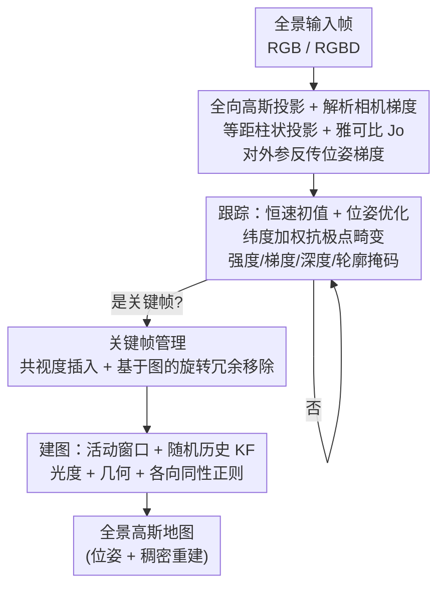

# ODGS-SLAM: Omnidirectional Gaussian Splatting SLAM

**会议**: CVPR 2026  
**论文**: [CVF Open Access](https://openaccess.thecvf.com/content/CVPR2026/html/Spiss_ODGS-SLAM_Omnidirectional_Gaussian_Splatting_SLAM_CVPR_2026_paper.html)  
**代码**: 待确认（作者称源码与数据集将开放，需联系作者获取链接）  
**领域**: 3D视觉  
**关键词**: SLAM, 全向相机, 3D高斯泼溅, 等距柱状投影, 关键帧管理

## 一句话总结
ODGS-SLAM 是首个把 3D 高斯泼溅（3DGS）作为统一表示用于全向（360° 全景）相机 SLAM 的系统：它给 3DGS-SLAM 的反传管线补上等距柱状投影下对相机位姿的解析梯度、用纬度加权抵消赤道-极点畸变、再用一套基于图分析的关键帧移除策略压内存，从而在全景输入上同时完成相机跟踪与稠密建图，跟踪精度（ATE RMSE）统计显著优于现有全向及透视 3DGS-SLAM 方法。

## 研究背景与动机
**领域现状**：SLAM 要在估计传感器位姿的同时建出环境 3D 地图。视觉 SLAM（V-SLAM）因便携、低成本、被动感知受欢迎；近年神经隐式表示（NeRF）和 3DGS 让稠密地图成为可能，3DGS-SLAM（MonoGS、Gaussian-SLAM 等）在建图质量、跟踪精度、运行时间上都有提升，且 3DGS 的可微渲染天然支持用同一套地图表示同时做建图和跟踪。

**现有痛点**：这些 3DGS-SLAM 方法都针对**透视相机**，视场（FoV）有限——会产生盲区、限制跟踪鲁棒性。全向感知能覆盖完整周边、改善避障与场景理解，但已有的全向 SLAM 系统（如 OmniSLAM）大多用传统体素融合做稠密建图，没有一个真正把全向视觉与 3DGS 结合起来。

**核心矛盾**：要把 3DGS 搬到全向输入，光把场景画成全景图不够——3DGS 的整套投影 $\pi$、雅可比 $J$、以及**相机位姿的反传梯度**都是按透视针孔相机推的；全景用的是球面坐标 + 等距柱状投影，几何关系完全不同，直接套会算错梯度、跟不准位姿。此外全景图在两极被严重拉伸、且全景序列帧数大、地图大，内存吃紧。

**本文目标**：(1) 让 3DGS 的建图与位姿估计在等距柱状投影模型下正确可微；(2) 抵消等距柱状投影的极点畸变；(3) 控制内存，使系统能处理更大输入。

**切入角度**：作者基于 MonoGS/GS-SLAM 的框架，集成 ODGS 的"两步投影"全向高斯渲染（先投到切平面、再裹到球面，兼顾精度与算力），并补上它缺的——对相机外参的优化梯度。再利用全向成像的一个独特性质：**同一位置不同朝向拍的全景图内容几乎一样（旋转不变）**，用它来判重、删冗余关键帧。

**核心 idea**：在等距柱状投影下推导相机位姿的解析梯度，把全向几何"接"进 3DGS-SLAM 的可微管线，并用纬度加权 + 旋转不变的图式关键帧剪枝把畸变和内存两个坑一起填上。

## 方法详解

### 整体框架
系统以 3DGS 为统一地图表示、以可微全景渲染器为核心，对每一帧全景图（RGB 或 RGBD）循环跑三步：**跟踪**（用恒速假设给初值，再靠对相机位姿的解析梯度优化外参）→ **关键帧管理**（按共视度选/插关键帧，并用图分析删旋转冗余帧）→ **建图**（在活动窗口 + 随机历史关键帧上优化高斯地图）。所有渲染都走改造过的等距柱状投影，并对损失施加纬度加权与多种掩码。

### 关键设计

**1. 全向高斯投影与对相机外参的解析梯度：把等距柱状几何接进可微 3DGS**

痛点：原始 3DGS 的投影和梯度都是针孔透视的，全景下会错。ODGS-SLAM 用球面坐标 $S^2$ 表示每条光线，方位角 $\phi\in[-\pi,\pi]$、仰角 $\theta\in[-\pi/2,\pi/2]$。先把归一化均值 $\hat\mu=\mu/\|\mu\|$ 投到球面得角坐标 $\phi_\mu=\sin^{-1}(\hat\mu_y),\ \theta_\mu=\tan^{-1}(\hat\mu_x/\hat\mu_z)$，再按图像宽高 $W,H$ 映射到居中像素空间 $\mu_o=\big(\frac{W}{2\pi}\phi_\mu+\frac{W}{2},\ -\frac{H}{\pi}\theta_\mu+\frac{H}{2}\big)^T$。协方差走 ODGS 的两步投影：先用单位焦距的透视相机投到以 $\mu$ 为主光线的切平面（旋转矩阵 $T_\mu$ 由 $\phi_\mu,\theta_\mu$ 决定，雅可比 $J_p=\mathrm{diag}(1/\|\mu\|,1/\|\mu\|)$），因自适应密度控制保证协方差小、忽略切平面到球面的畸变；再用水平缩放 $\sec(\theta)=1/\cos\theta$ 补偿等距柱状横向拉伸，得校正矩阵 $Q_o$ 与角度→像素的缩放 $S_o$，合成更新雅可比 $J_o=S_o Q_o J_p T_\mu$。本文的关键扩展是：在 ODGS 基础上**补出对相机位姿 $T_c$ 的解析梯度**——沿用 GS-SLAM 的链式法则，把光度/几何误差对 $T_c$ 的梯度拆到高斯均值 $\mu'_o$ 与协方差 $\Sigma'_{o,2D}$ 上，为效率忽略视点相关颜色项和协方差项、只保留 $\partial\mu'_o/\partial T_c$ 这一决定性分量，再分拆成旋转 $R_c$ 与平移 $t_c$ 的梯度。这样跟踪和建图共用同一套全景高斯地图与可微渲染。

**2. 纬度加权抵消等距柱状投影畸变：让两极的像素别误导优化**

痛点：等距柱状投影在两极（高纬）区域被严重拉伸，同样的像素误差在极点其实对应很小的真实立体角，若一视同仁会让优化被极点噪声带偏。ODGS-SLAM 给光度误差 $E_{pho}$ 和几何误差 $E_{geo}$ 都乘上一个纬度权重 $w_{lat}(y)=\cos\big((y/H-1/2)\pi\big)$——越靠两极权重越小、越靠赤道越大。它和其它逐像素权重/掩码一起组成 $f(x,y)$：跟踪时 $f=w_{lat}(y)\,s_p(x,y)$（再乘轮廓覆盖），并叠加强度掩码 $M_{int}$（滤掉三通道和 <0.01 的像素）、梯度掩码 $M_{grad}$（保留梯度大于中位数×1.1 的纹理区，用 Scharr 算子）、以及 RGBD 下的深度掩码 $M_{depth}$（滤 $d\notin(0.01,100]$ 的地平线物体）。消融显示去掉纬度加权后系统更快、但跟踪精度大幅变差——它是精度的关键。

**3. 基于图的关键帧移除：用全景旋转不变性删冗余、压内存**

痛点：全景序列帧多、地图大，把每帧都拿去优化会爆内存。ODGS-SLAM 利用一个全向独有性质——**同一位置不同朝向拍的全景图内容几乎相同**，因此空间相近的关键帧可被丢掉。具体做法：除当前跟踪窗口 $W_k$ 外的所有关键帧，先用 KD-tree 找出空间距离 $\le\tau_{dist}$ 的候选对，再对每对做**旋转对齐相似度**评估——对图像 $\tilde I_i$ 每个像素算球面方向 $v_i(\phi,\theta)$，施加两帧相对旋转 $v'=(R_i R_j^{-1})v_i(\phi,\theta)$ 重投回等距柱状坐标，把 $\tilde I_i$ 双线性插值对齐成 $\tilde I_i'$，再与 $\tilde I_j$ 算逐像素 L1 得分 $S(\tilde I_i,\tilde I_j)$。得分 $<\tau_{sim}$ 的对标为冗余，据此建无向图（节点=关键帧、边=互冗余对），用贪心算法按分数 $R_k=0.5A_k+C_k$（$A_k$ 为时间年龄即时序索引、$C_k$ 为冗余图中的连接度）排序，遍历每个未访问节点时删掉它的所有冗余邻居。这样在保留更新、更高连接度观测的同时，把关键帧集压到最小冗余——消融显示该模块几乎不增加运行时开销就显著降了 GPU 内存。

### 损失函数 / 训练策略
跟踪损失：RGB 时 $\mathcal L_{track}=E_{pho}$；RGBD 时按 $\lambda_{pho}=0.95$ 混合 $\mathcal L_{track}=\lambda_{pho}E_{pho}+(1-\lambda_{pho})E_{geo}$，每帧优化至多 50 次或相对位姿变化 $<10^{-5}$，并联优化逐帧曝光参数 $a_k,b_k$（$I_{exp}=e^{a_k}I+b_k$）。建图损失在窗口 $W=W_k\cup W_r$（近期活动窗 + 2 个随机历史关键帧，防遗忘）上对所有高斯参数优化：$\mathcal L_{map}=\frac{1}{N_f}\sum_k E_{pho}^k+\lambda_{iso}E_{iso}$（RGBD 时光度项换成光度+几何混合），各向同性正则 $E_{iso}=\frac{1}{3N}\sum_i\sum_j\|s_{i,j}-\bar s_i\|_1$ 防止高斯过度拉长、$\lambda_{iso}=10$。初始化随机采 $\lfloor WH/k_{init}\rfloor$（$k_{init}=32$）个像素生成高斯，有深度则用深度定距、否则置于单位球面带 ±0.025 抖动，对首帧优化 1050 次；自适应密度控制每 150 次迭代删 $\alpha<0.7$ 的高斯。

## 实验关键数据

> 评测指标：跟踪用**绝对轨迹误差的均方根（ATE RMSE，单位米，越低越好）**；建图用 PSNR / SSIM / LPIPS（及全景版 mSSIM/mLPIPS）。系统配置 RTX 4090 + i7-9700K + ≥32GB RAM，全景输入 1920×960、透视 720×960，每方法报 3–5 次运行均值。作者自建了真实（Insta360 Pro/X4 装在遥控机器人上）+ 合成（Blender 自研鱼眼镜头扩展）、室内外的数据集，含探索(Ex)/定向(ID)/回溯(Rt)/环形(C)等运动序列。基线：透视 3DGS-SLAM 的 MonoGS、Gaussian-SLAM(GASL)，以及传统全向特征法 PatchMatch-Stereo-Panorama(PMSP)。

### 主实验
合成序列跟踪 ATE RMSE（米，O-SLM 即 ODGS-SLAM，∗列不计入均值）：

| 模态 | 方法 | Ex1 | Ex2 | Rt | C | ID-XYZ | Avg |
|------|------|-----|-----|----|----|--------|-----|
| RGB | MonoGS | 1.335 | 0.986 | 0.384 | 0.490 | 0.121 | 0.663 |
| RGB | PMSP | 0.081 | 0.138 | 0.099 | 0.074 | 0.095 | 0.093 |
| RGB | **O-SLM** | **0.008** | 0.355 | **0.004** | **0.006** | **0.012** | **0.068** |
| RGBD | GASL | 0.640 | 0.987 | 0.846 | 8.844 | 0.157 | 2.295 |
| RGBD | MonoGS | 0.845 | 1.159 | 0.339 | 0.447 | 0.105 | 0.579 |
| RGBD | **O-SLM** | **0.013** | **0.025** | **0.002** | **0.001** | **0.002** | **0.029** |

真实 Insta360 Pro（RGB）平均 ATE：MonoGS 0.310、PMSP 0.122、**O-SLM 0.031**；Insta360 X4 直装/延长杆装平均 ATE：PMSP 0.068/0.148、**O-SLM 0.032/0.062**。统计检验（Kruskal-Wallis H 检验 $p<.001$，Dunn's 事后检验 Bonferroni 校正 $\alpha=0.017$；X4 上 Mann-Whitney U=135, $p<.000001$）证实 ODGS-SLAM 的跟踪误差显著低于其它方法。

### 建图与开销
建图质量（各场景均值，节选）：

| 场景/模态 | 方法 | PSNR↑ | SSIM↑ | LPIPS↓ |
|-----------|------|-------|-------|--------|
| 360 Pro RGB | MonoGS | 22.50 | 0.83 | 0.34 |
| 360 Pro RGB | O-SLM | 24.35 | 0.67 | 0.42 |
| Synth RGB | MonoGS | 25.99 | 0.86 | 0.32 |
| Synth RGB | O-SLM | **28.45** | **0.89** | **0.21** |
| Synth RGBD | GASL | 32.36 | 0.96 | 0.09 |
| Synth RGBD | MonoGS | 27.65 | 0.87 | 0.27 |
| Synth RGBD | O-SLM | 29.37 | 0.88 | — |

建图性能总体与其它 3DGS-SLAM **相当**（GASL 在合成 RGBD 上 PSNR 更高，但它需要 GT 深度且跟踪误差很大）。开销上（Table 6）ODGS-SLAM 因处理全景大图，跟踪/建图时间（~1085ms / ~3051ms）和 GPU 内存均高于透视 MonoGS（~300ms / ~872ms），属于全向覆盖换来的代价。

### 关键发现
- **纬度加权是精度命门**：去掉后系统更高效，但跟踪精度大幅下滑，说明极点畸变若不抑制会严重误导位姿优化。
- **关键帧移除几乎"白嫖"**：从 GPU 内存看，该模块以很小的运行时开销换来明显的显存下降。
- **全向 vs 透视**：在大多数序列上 ODGS-SLAM 跟踪显著优于透视 MonoGS/GASL，验证了全景视野对消除盲区、提升跟踪鲁棒性的价值；尤其室外探索序列(Ex-O)只有 ODGS-SLAM(RGBD) 和 PMSP(RGB) 能跑完全程。
- **建图是可比而非碾压**：作者诚实地把建图定位为"comparable"，主要卖点在跟踪精度，而非渲染画质。

## 亮点与洞察
- **把全向几何"接"进可微 3DGS 的工程闭环**：不是简单换个投影，而是补齐了 ODGS 缺的相机外参解析梯度，让跟踪和建图真正共用一套全景高斯地图——这是首个全向 3DGS-SLAM 能成立的关键。
- **用全景旋转不变性做关键帧剪枝**：把"同位置不同朝向内容相同"这一全向独有性质转成旋转对齐相似度 + 冗余图贪心删除，是一个非常贴合传感器特性的内存优化，思路可迁移到任何全景/多相机系统的帧管理。
- **纬度加权的小改动、大效果**：一个 $\cos$ 权重就把等距柱状投影的极点畸变压住，消融证明它对跟踪至关重要，提醒做全景任务时务必处理投影非均匀性。
- **诚实的统计学评估**：用 Shapiro-Wilk 判正态、改用非参数 Kruskal-Wallis/Dunn/Mann-Whitney 做显著性检验，而非只比平均数，结论更可信。

## 局限与展望
- 作者承认：建图质量只是"与基线相当"而非领先，且系统计算开销（时间、GPU 内存）显著高于透视方法，全景大图是主要负担。
- 数据与可复现性：因缺合适公开数据集而自建，源码/数据集"将开放但需联系作者"⚠️ 以原文为准；室外场景甚至要降到半分辨率才跑得动，说明规模扩展性受限。
- 自己发现的局限：跟踪初值依赖恒速运动假设（最近三帧相对运动加权 [0.5,0.3,0.2]），剧烈/非匀速运动下可能失效；视点相关颜色项和协方差梯度项为效率被忽略，理论上会牺牲一点精度/光泽表面表现；缺乏回环闭合（loop closure），长序列累积漂移如何控制未充分讨论。

## 相关工作与启发
- **vs OmniSLAM**: 最接近的全向工作，用四目超广角相机做 360° 覆盖、靠全向立体匹配出深度并做回环，但稠密建图用的是**传统体素融合**而非 3DGS；ODGS-SLAM 用单一全景输入 + 3DGS 统一表示，建图可微、可同时优化位姿。
- **vs MonoGS / GS-SLAM**: 本文框架与梯度推导直接建立在它们之上，但把投影/雅可比/位姿梯度从透视改造到等距柱状，并加纬度加权与全向关键帧剪枝；实验中 ODGS-SLAM 跟踪显著优于这两者，验证全向视野的价值。
- **vs ODGS（全向高斯渲染）**: ODGS 只解决全向高斯的前向渲染（两步投影），ODGS-SLAM 把它扩成可优化相机外参的 SLAM 反传管线——这是从"渲染器"到"SLAM 系统"的关键补全。
- **vs PMSP（特征法全向 SLAM）**: PMSP 用 ORB 特征、只支持 RGB、只出稀疏/稠密点云无法做高质量渲染；ODGS-SLAM 是稠密可微、跟踪统计显著更优。

## 评分
- 新颖性: ⭐⭐⭐⭐⭐ 首个全向 3DGS-SLAM，补齐全向相机位姿解析梯度 + 旋转不变关键帧剪枝，定位清晰且填补空白。
- 实验充分度: ⭐⭐⭐⭐ 自建数据集覆盖真实/合成、室内外、多运动型，并用严谨统计检验；但建图仅"相当"、缺公开数据集横评、室外需降分辨率。
- 写作质量: ⭐⭐⭐⭐ 几何推导与系统模块讲得细致，诚实标注 comparable；公式密集、部分细节需查补充材料。
- 价值: ⭐⭐⭐⭐ 对 AR/自主系统的全周环境理解有实用价值，跟踪精度提升明显；计算开销偏高限制了即时落地。

<!-- RELATED:START -->

## 相关论文

- [\[CVPR 2026\] AERGS-SLAM: Auto-Exposure-Robust Stereo 3D Gaussian Splatting SLAM](aergs-slam_auto-exposure-robust_stereo_3d_gaussian_splatting_slam.md)
- [\[CVPR 2026\] Flow4DGS-SLAM: Optical Flow-Guided 4D Gaussian Splatting SLAM](flow4dgs-slam_optical_flow-guided_4d_gaussian_splatting_slam.md)
- [\[CVPR 2026\] Unblur-SLAM: Dense Neural SLAM for Blurry Inputs](unblur-slam_dense_neural_slam_for_blurry_inputs.md)
- [\[CVPR 2026\] SGAD-SLAM: Splatting Gaussians at Adjusted Depth for Better Radiance Fields in RGBD SLAM](sgad-slam_splatting_gaussians_at_adjusted_depth_for_better_radiance_fields_in_rg.md)
- [\[CVPR 2026\] SCE-SLAM: Scale-Consistent Monocular SLAM via Scene Coordinate Embeddings](sce-slam_scale-consistent_monocular_slam_via_scene_coordinate_embeddings.md)

<!-- RELATED:END -->
