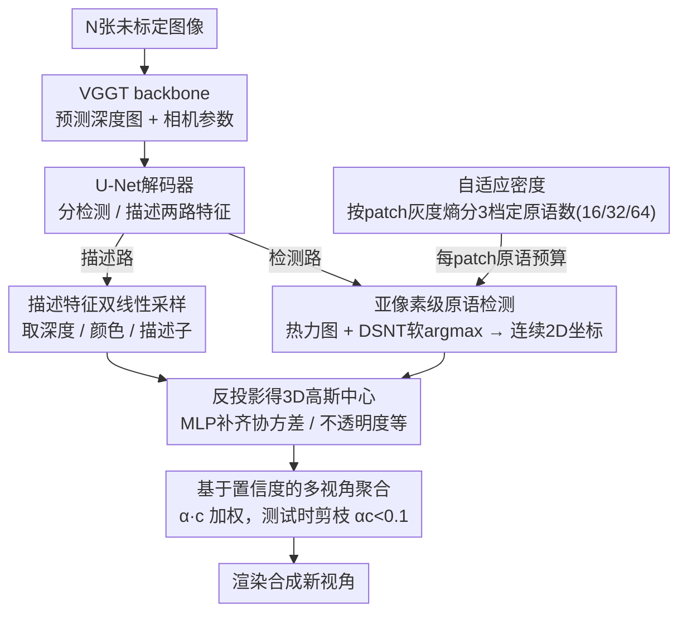

# Off The Grid: Detection of Primitives for Feed-Forward 3D Gaussian Splatting

**会议**: CVPR 2026  
**arXiv**: [2512.15508](https://arxiv.org/abs/2512.15508)  
**代码**: [项目页面](https://arthurmoreau.github.io/OffTheGrid/)  
**领域**: 3D视觉 / 3D高斯泼溅  
**关键词**: 3D高斯泼溅, 前馈式重建, 关键点检测, 自适应密度, 无位姿重建

## 一句话总结

本文提出一种基于关键点检测思路的前馈式3DGS解码器，将高斯原语从像素网格中解放出来，在亚像素级别自适应放置原语，结合自适应密度机制和置信度剪枝，仅使用输入像素数1/7的原语就在新视角合成上超越了SOTA前馈方法。

## 研究背景与动机

**领域现状**：3D高斯泼溅(3DGS)已成为高效三维场景表示的主流方法。传统3DGS需要SfM初始化+逐场景优化（耗时数十分钟至数小时），近年来前馈式方法（如PixelSplat、AnySplat）通过神经网络一次前向传播直接预测高斯原语，将重建时间缩短到秒级。

**现有痛点**：现有前馈方法几乎都采用"像素对齐"或"体素对齐"的原语放置策略——每个输入像素对应一个高斯原语，原语位置被刚性地锁定在规则网格上。这带来两个问题：（1）原语数量等于输入像素数，限制了方法只能在低分辨率（通常256×256）下工作；（2）规则网格无法自适应地在高频细节区域分配更多原语、在平坦区域减少冗余，导致质量和效率的双重损失。

**核心矛盾**：优化式3DGS通过densification/pruning策略动态调整原语分布，但前馈方法缺乏这种能力。像素对齐的设计本质上限制了模型对原语的表达能力——它无法学习"最优放置"。

**本文目标** 如何在前馈式3DGS中实现自适应的、脱离网格的原语放置，同时保持端到端可训练。

**切入角度**：作者受关键点检测启发，将高斯原语的放置视为一个2D检测问题——在图像patch上通过卷积热力图提取连续坐标，使原语可以定位到亚像素级精度。

**核心 idea**：用类似关键点检测的DSNT软argmax替代像素网格对齐，让前馈3DGS模型学会在亚像素精度上自适应放置高斯原语。

## 方法详解

### 整体框架

这篇论文要解决的是前馈式3DGS的一个老毛病：现有方法把每个高斯原语死死钉在输入像素上，原语数量恒等于像素数，既跑不了高分辨率，也没法在细节区域多放、平坦区域少放。作者的破局思路是把"放置原语"重新理解成一个2D关键点检测问题——既然高斯原语在图像上本就没有固定坐标，那就让网络像检测关键点一样，在亚像素精度上把它们"检测"出来。

整条pipeline串起来是这样的：N张未标定图像先送进VGGT这个3D重建backbone，预测出每张图的深度图和相机参数；随后一个U-Net解码器在VGGT特征上分出检测、描述两路特征，前者通过热力图在图像patch上定位原语的连续2D坐标，后者用双线性插值采样出每个原语的深度、颜色和描述子；拿到2D坐标和深度后反投影得到3D高斯中心，再由MLP补齐协方差、不透明度等剩余参数；最后把多个视角预测的原语聚合在一起渲染。整个过程只靠渲染输入图像的光度损失端到端训练，不需要任何3D标注。

### 关键设计

**1. 亚像素级原语检测：让原语脱离整数像素网格**

像素对齐策略把原语锚定在整数坐标上，跨像素的边缘、细线这类结构就没法被准确表达。本文借鉴关键点检测来破这个限制：U-Net解码器的检测特征被reshape成14×14的patch，每个patch带P个通道（P就是这个patch要放的原语数），对每个通道在空间上做softmax得到一张热力图，再用DSNT的软argmax求期望坐标 $x = \sum_{i,j} c_x(i,j) h(i,j)$，把离散的热力图变成连续浮点坐标。这样原语中心可以落在两个像素之间，几何结构表达得更精细。关键在于DSNT全程可微、支持端到端训练——它在人体姿态估计里早已验证有效，这里只是把"关节点"换成了"高斯原语"。

**2. 自适应密度：让复杂区域多放原语、平坦区域少放**

规则网格的另一宗罪是无法因地制宜——平坦区域和高频细节区域分到的原语一样多。本文用一个不需要学习的信号来决定密度：对每个14×14 patch算灰度直方图的Shannon熵 $H = -\sum_k p_k \log_2(p_k + \epsilon)$，熵越高说明纹理越丰富。把所有patch按熵排序后分三档——最低的55%每patch放16个原语，中间35%放32个，最高的15%放64个，每一档配一套独立的检测/描述卷积头。即便最密的64个原语，也远少于一个patch的196个像素，整体始终保持高压缩比；而把更多原语预算集中到高熵区域，等于把表达力花在真正需要的地方。

**3. 基于置信度的多视角聚合：自动去掉重复观测的原语**

朴素地把每个视角预测的原语全堆到一起，会让同一块内容被多个视角各表示一遍，渲染出来发糊。本文给每个高斯额外预测一个置信度 $c \in [0,1]$，乘进不透明度、用 $\alpha \cdot c$ 当最终不透明度。当某块内容在另一个视角看得更清楚时，模型会隐式地学着调低当前视角那批原语的置信度，相当于自己学会了"去重"；测试时再把 $\alpha c < 0.1$ 的原语直接剪掉，进一步省下算力。

### 损失函数 / 训练策略

训练需要四类损失协同工作：（1）**光度损失**：L1 + SSIM + LPIPS，只渲染输入图像（不需要held-out目标视角）；（2）**几何一致性损失**：预测深度与渲染深度的L1损失 + 法线一致性损失，确保高斯方向与局部表面几何对齐；（3）**教师几何损失**：约束微调后的深度和相机参数不偏离原始VGGT预测太远，防止训练崩溃；（4）**正则化损失**：不透明度正则化 $L_{op} = \sum \sin(\alpha \cdot c)$，鼓励不透明度趋向0或1，避免半透明问题。

训练使用单GPU（140GB显存），每次迭代处理最多24张图像，不需要任何3D标注。

## 实验关键数据

### 主实验

| 数据集 | 指标 | Off The Grid | AnySplat | DA3-Giant |
|--------|------|-------------|----------|-----------|
| Average (6 datasets) | PSNR↑ | **21.21** | 17.71 | 18.83 |
| Average | SSIM↑ | **0.647** | 0.508 | 0.543 |
| Average | LPIPS↓ | **0.353** | 0.394 | 0.383 |
| DL3DV | PSNR↑ | **20.48** | 17.31 | 18.46 |
| Tanks&Temples | PSNR↑ | **19.37** | 16.28 | 16.94 |

压缩比：本文方法仅使用 **0.143个原语/像素**（即输入像素的1/7），而像素对齐方法为1.0，AnySplat为0.814。

### 消融实验

| 配置 | PSNR↑ | SSIM↑ | LPIPS↓ |
|------|-------|-------|--------|
| Ours (Off-The-Grid检测) | **19.22** | **0.604** | **0.333** |
| Pixel-aligned基线 | 18.90 | 0.590 | 0.382 |
| SplatterImage式3D偏移 | 18.87 | 0.586 | 0.389 |

几何评估（平均）：

| 模型 | AbsRel↓ | AUC@30↑ | 视场角误差↓ |
|------|---------|---------|-----------|
| Off The Grid | 0.143 | 0.928 | **0.96** |
| DA3-Giant | **0.134** | **0.934** | 3.66 |
| AnySplat | 0.159 | 0.833 | 3.225 |

### 关键发现
- Off-The-Grid相比像素对齐，PSNR提升+0.3dB，LPIPS降低13%，渲染更锐利、伪影更少
- SplatterImage式3D偏移预测不仅没有改善，反而引入孤立点伪影，说明准确放置原语需要更高级的技术
- 自适应密度机制使压缩比达到86%，模型在7倍更少原语下性能更优
- 微调后的VGGT在内参估计上表现最优，对准确反投影至关重要

## 亮点与洞察
- **关键点检测思维迁移到3DGS**：将物理上不存在的高斯原语视为"可检测的关键点"，通过热力图+softmax优雅地实现亚像素精度定位，这是一个巧妙的类比迁移
- **用Shannon熵做自适应密度**：无需学习即可判断patch复杂度，简单但有效的工程设计
- **置信度学习的多视角推理**：模型自动学会"这个区域在另一个视角看得更清楚，所以我降低这个视角的置信度"——无需显式多视角聚合的优雅方案
- 光度损失只渲染输入图像而不需要held-out视角，通过教师几何损失避免几何坍塌，简化了训练流程

## 局限与展望
- 极细结构的几何可能会消失（因为原语数量减少后对薄结构的表达能力有限）
- 未探索更多视角聚合方法的组合，当前置信度剪枝相对简单
- 自适应密度的超参数（55%/35%/15%的比例划分）是手动设定的，或许可以学习最优分配策略
- 训练需要140GB显存的单GPU，对硬件要求较高

## 相关工作与启发
- **vs AnySplat**: 同样基于VGGT微调，但AnySplat使用体素对齐高斯，本文使用检测式亚像素高斯。本文在所有数据集上显著优于AnySplat，且原语数量更少
- **vs PixelSplat**: 像素对齐的先驱工作，限于256×256低分辨率。本文从根本上解决了像素对齐的局限性
- **vs DA3-Giant**: DA3在深度和位姿估计上更强，但内参估计不准导致渲染模糊。本文通过光度监督微调改善了内参估计

## 评分
- 新颖性: ⭐⭐⭐⭐ 将关键点检测思路用于3DGS原语放置是一个新颖且自然的创意
- 实验充分度: ⭐⭐⭐⭐⭐ 6个评估数据集、多种视角设置、几何评估、消融实验非常全面
- 写作质量: ⭐⭐⭐⭐ 动机清晰、方法描述详尽，图表设计好
- 价值: ⭐⭐⭐⭐ 为前馈3DGS提供了一个重要的设计范式转变，从网格对齐到自适应检测

<!-- RELATED:START -->

## 相关论文

- [\[CVPR 2026\] Z-Order Transformer for Feed-Forward Gaussian Splatting](z-order_transformer_for_feed-forward_gaussian_splatting.md)
- [\[CVPR 2026\] AnchorSplat: Feed-Forward 3D Gaussian Splatting with 3D Geometric Priors](anchorsplat_feed-forward_3d_gaussian_splatting_with_3d_geometric_priors.md)
- [\[CVPR 2026\] EcoSplat: Efficiency-controllable Feed-forward 3D Gaussian Splatting from Multi-view Images](ecosplat_efficiency-controllable_feed-forward_3d_gaussian_splatting_from_multi-v.md)
- [\[CVPR 2026\] Learning Compact 3D Representations from Feed-Forward Novel View Synthesis](learning_compact_3d_representations_from_feed-forward_novel_view_synthesis.md)
- [\[CVPR 2026\] Particulate: Feed-Forward 3D Object Articulation](particulate_feed-forward_3d_object_articulation.md)

<!-- RELATED:END -->
