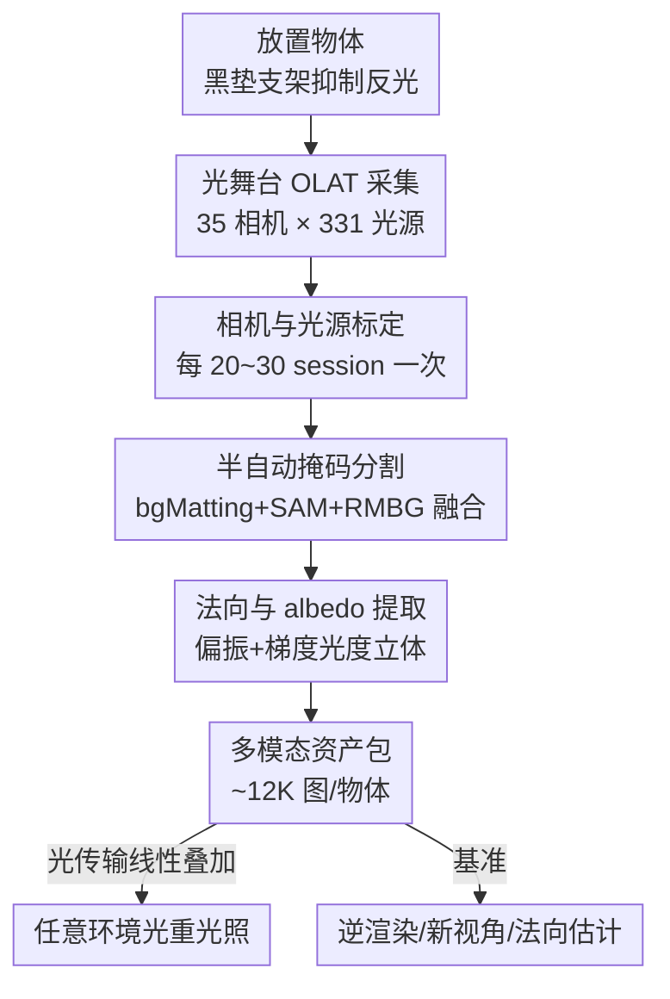

# OLATverse: A Large-scale Real-world Object Dataset with Precise Lighting Control

**会议**: CVPR 2026  
**论文**: [CVF Open Access](https://openaccess.thecvf.com/content/CVPR2026/html/Zhou_OLATverse_A_Large-scale_Real-world_Object_Dataset_with_Precise_Lighting_Control_CVPR_2026_paper.html)  
**领域**: 3D视觉 / 逆渲染 / 重光照 / 数据集  

## 一句话总结
OLATverse 用一个 35 相机 + 331 可控光源的光舞台（lightstage），对 765 个真实物体逐光源拍摄，构建出约 900 万张图像、带精确单光源控制（OLAT, One-Light-At-a-Time）的大规模真实数据集，并附带相机参数、物体掩码、光度法向、漫反射 albedo，第一次为逆渲染 / 新视角合成 / 法向估计提供了「规模又大、光照又精确」的真实世界基准。

## 研究背景与动机

**领域现状**：逆渲染（inverse rendering）、新视角合成、重光照（relighting）这些方向近年进展很快，3DGS、扩散先验都在往里冲。但要训练和评测这些方法，需要「在已知、可控光照下拍到的真实物体外观」作为监督和参照。

**现有痛点**：由于真实采集的硬件和数据处理太复杂，现有物体级数据集总是在三个维度里至少缺一个——**质量**、**规模**、**精确光照控制**。合成数据集（ABO、Objaverse、ShapeNet）规模巨大但缺真实感、物体质量参差；真实数据集要么只有几十个物体（NeROIC 3 个、Stanford-ORB 14 个），要么虽然上千物体（OmniObject3D、OpenIllumination、DTC）却依赖人工标注材质、光照设置受限，没法精确模拟复杂光照。结果是大多数方法只能在合成数据上训练、在小规模真实数据上评测，真实场景下的表现根本无法可靠衡量。

**核心矛盾**：「真实 + 大规模 + 精确光照控制」三者难以兼得。精确光照控制需要昂贵且复杂的逐光源采集硬件（光舞台），而把这套硬件用到几百个尺寸、材质、纹理各异的真实物体上、还要保证标定一致性，工程上极难规模化。

**本文目标**：造一个同时满足三点的真实物体数据集，并把它做成一个能直接跑 baseline 的综合性基准。

**切入角度**：作者用 OLAT（One-Light-At-a-Time，每次只点亮一个光源）的采集范式——逐个光源单独拍摄。基于光传输的线性叠加性质，OLAT 图像可以线性组合出任意环境光下的外观，所以「逐光源拍一遍」等价于「采到了这个物体在任意光照下的完整外观」。

**核心 idea**：用工业级光舞台对 765 个真实物体做 OLAT 全采集，配合一套半自动的标定 / 分割 / 法向提取后处理流水线，把「精确光照控制」从几十个物体的实验规模推到接近 900 万张图、覆盖 18.5% LVIS 类别的数据集规模。

## 方法详解

这是一篇数据集论文，所以「方法」的核心是**怎么采、怎么后处理成可用的多模态标注**，而不是某个网络结构。整条流水线分两段：物理采集（光舞台拍 OLAT）和数据后处理（标定 → 掩码 → 法向/albedo 提取）。

### 整体框架

输入是放在光舞台中心的一个真实物体，输出是这个物体的多模态资产包：约 12K 张多视角多光照图像（含 331 张 OLAT）、标定好的相机参数、干净的物体掩码、光度法向、漫反射 albedo。整体流程是：用光舞台（35 台 RED Komodo 6K 相机 + 331 个 RGBAW 可控 LED）以 30 FPS 同步采集原始视频 → 每隔 20~30 个采集 session 做一次相机标定 → 半自动分割出物体掩码 → 用梯度光照下的图像通过光度立体（photometric stereo）反推法向和 albedo → 利用光传输线性性把 OLAT 组合成任意环境光下的重光照结果。

### 关键设计

**1. OLAT 光舞台采集：用逐光源拍摄换取任意光照下的真实外观**

数据集要支持精确光照控制，痛点是「在任意光照下拍真实物体」组合爆炸——光照条件无穷多，不可能一一拍摄。作者用 OLAT 范式绕开：在一个球形 dome 上布 35 台 RED Komodo 6K 相机和 331 个可发 RGBAW 五色光的可控 LED，360° 环绕物体，以 30 FPS 同步采集。每个物体拍 1 张均匀白光、12 张偏振梯度光、10 张环境光、外加 331 张 OLAT（每次只点一个光源），合计约 12K 张图。之所以这样有效，是因为光传输是**线性**的：任意目标环境光 $E$ 下的重光照图像可由所有 OLAT 图线性加权得到

$$I_{relit} = \sum_{i=1}^{N_{olat}} \big( F(E \odot M_i) \cdot I_i \big)$$

其中 $I_i$ 是第 $i$ 张 OLAT 图、$M_i$ 是对应光源方向的环境掩码、$F$ 是逐通道平均、$\odot$ 是逐像素乘。换句话说，拍完 331 张 OLAT 就等于采到了这个物体在任意光照下的完整外观，把「无穷的光照条件」压缩成「331 次单光源曝光」。为了让不同尺寸（5cm~100cm）的物体都拍得好，中心用不同大小的木质支架托物体、支架蒙黑布或暗哑光纸避免色溢和镜面反光，并手动调焦保证物体在画面里缩放一致。

**2. 间歇式相机标定：靠固定光舞台配置摊薄 765 个物体的标定成本**

逐物体跑特征标定行不通——真实物体尺寸、纹理、材质差异大，直接对每个物体做基于特征的标定会得到不稳定、有歧义的结果。作者利用光舞台**相机位置固定**这一点：每隔 20~30 个常规采集 session 才做一次专门的标定 session，session 里锁定几个纹理丰富、表面接近朗伯（Lambertian）的参考物体作标定参照，用 Metashape 的特征算法恢复相机内外参；之后的采集 session 直接复用上一次估计的相机参数。所有标定采集都在均匀白光下进行，保证特征检测稳健一致。光源位置则通过测量其物理坐标、写进同一个标准坐标系。这样把「每物体标定」降级为「每 20~30 物体标定一次」，并通过三角化关键点的平均重投影误差量化精度，实测平均误差仅 0.86 像素。

**3. 三分割器融合的半自动掩码：把单个分割器各自的短板互相补掉**

大规模物体掩码很难一键搞定：直接用 SAM 加多框提示效率低、难规模化。作者拍一张含物体+支架的前景图 $I_{fg}$ 和一张只含支架的背景图 $I_{bg}$，然后融合三种分割器——bgMatting 能粗分物体但保不住轮廓细节；SAM 在 bgMatting 给的框引导下能把支架和物体分干净但掩码质量一般；RMBG-2.0 轮廓最细但总把支架当成前景。作者取三者之长，先算出支架掩码

$$M_{stup} = \begin{cases} \text{RMBG}(I_{bg}) & \text{(a) 下方视角}\\ \text{RMBG}(I_{bg})\,[1-\text{SAM}(\text{bgMat}(I_{bg},I_{fg}))] & \text{(b) 其他视角}\end{cases}$$

再得到物体掩码 $M_{obj}^* = \text{RMBG}(I_{fg})\,(1-M_{stup})$。其中 (a) 用于下方相机视角（物体可能被支架遮挡），(b) 用于其他视角；之后再用形态学操作和去除孤立连通域得到干净掩码 $M_{obj}$。这套流水线在全数据集所有视角下达到 95% 成功率，剩余失败用一个轻量 UI 手动修正。

**4. 偏振梯度光度立体：在非朗伯真实物体上反推法向与漫反射 albedo**

为支持多模态任务，数据集还要给出法向和 albedo，难点在于真实物体大多非朗伯、有镜面反射会污染法向估计。作者用**光度立体**：分析物体在彩色梯度光照（color gradient illumination）下的辐射变化来反推法向。漫反射 albedo 取正反两个梯度方向图像的平均 $D = 0.5(I_{cg}^+ + I_{cg}^-)$；法向先算 $N^* = \frac{I^+ - I^-}{I^+ + I^-}$ 再归一化 $N = N^*/|N^*|$。关键是为了抵消非朗伯表面上随视角变化的镜面反射，作者给 5 台固定相机装上线偏振滤镜，在偏振梯度全亮光照下采图，用偏振对 $I_\perp^+, I_\perp^-$ 算偏振法向；非偏振法向则用彩色梯度对 $I_{cg}^+, I_{cg}^-$。两种法向都保留在数据集中，实测偏振法向对大多数物体精度更高。需要注意作者明确这是**伪 GT**（pseudo ground truth），不是精确真值，但足以作多模态训练的监督信号。

### 损失函数 / 训练策略
本文不训练模型，无损失函数。后处理涉及的关键参数：相机标定每 20~30 session 一次、平均重投影误差 0.86 像素、掩码流水线成功率 95%、5 台相机加偏振滤镜。

## 实验关键数据

数据集论文的「实验」是用现成 baseline 在 OLATverse 验证集上跑，证明它能当基准、且现有方法在真实数据上还远未饱和。作者精选 42 个纹理丰富、覆盖 14 个材质类别的物体构成验证集，原图降采样到 750×1.4k，按「每第 5 台相机、每第 3 个光照」划分推理集。

### 数据集规模对比

| 数据集 | 物体数 | 是否真实 | 光照条件 | 光照数 | 视角数 | 设备 |
|--------|--------|----------|----------|--------|--------|------|
| Objaverse | 858K | 部分 | – | – | – | – |
| OmniObject3D | 6K | ✓ | – | – | – | 扫描仪 |
| DTC | 2K | ✓ | (ENV) | 2 | 120 | 扫描仪+相机 |
| Stanford-ORB | 14 | ✓ | ENV | 7 | 70 | 扫描仪+相机 |
| OpenIllumination | 千级 | ✓ | OLAT | 多 | 多 | 光舞台 |
| **OLATverse** | **765** | ✓ | **OLAT** | **331** | **35** | **光舞台** |

OLATverse 覆盖 13+ 材质类别、18.5% 的 LVIS 类别（vs OmniObject3D 10.8%、OpenIllumination 4~5%、DTC 3%），物体尺寸跨 5cm~100cm（OpenIllumination 仅 10~20cm），并独家提供法向+albedo 多模态标注。

### 逆渲染 / 新视角合成 baseline（验证集，42 物体）

| 方法 | PSNR ↑ | LPIPS ↓ | SSIM ↑ |
|------|--------|---------|--------|
| Mitsuba+Mshape | 35.91 | 0.026 | 0.976 |
| **GS3** | **38.54** | **0.026** | **0.982** |
| RNG | 32.07 | 0.051 | 0.962 |
| BiGS | 32.98 | 0.045 | 0.940 |

### 法向估计 baseline（角度误差）

| 方法 | Mean↓ | Med↓ | 11.25°↑ | 22.5°↑ | 30°↑ |
|------|-------|------|---------|--------|------|
| SN (StableNormal) | 31.85 | 30.25 | 8.93 | 34.00 | 55.40 |
| RGBX | 51.95 | 49.70 | 6.40 | 22.80 | 35.85 |
| DR (DiffusionRender) | 34.88 | 33.28 | 8.13 | 31.00 | 50.15 |
| GW (GeoWizard) | 34.42 | 32.03 | 10.98 | 34.10 | 50.05 |

### 关键发现
- **逆渲染上 GS3 全面领先**：基于 3DGS 的 GS3 在 PSNR/LPIPS/SSIM 三项都最好，尤其能准确还原西瓜、金属兔子、塑料路障等光泽表面的镜面反射，说明显式高斯表示在精确光照下更能抓高频外观。
- **法向估计现有方法都不够好**：专为法向设计的 SN 和 GW 在角度误差上优于本为图像/视频重光照设计的 RGBX、DR；但 RGBX、DR 在视觉上反而有更细的高频细节。关键结论是——**没有任何一个方法能在复杂几何的真实物体上恢复准确法向**，恰好凸显 OLATverse 作为难基准的价值。
- **偏振法向更可靠**：对大多数物体，加偏振滤镜后提取的法向比非偏振版本精度更高，证明抑制镜面反射对真实非朗伯物体的几何重建很关键。

## 亮点与洞察
- **用光传输线性性把数据集「免费」扩成任意光照重光照库**：只采 331 张 OLAT，靠线性叠加就能渲出任意环境光，等于一次采集解锁无限光照样本——这是 OLAT 范式相比直接拍环境光的根本优势。
- **间歇式标定是规模化的关键工程取巧**：抓住「光舞台相机不动」这一不变量，把标定从「每物体一次」摊薄到「每 20~30 物体一次」，是几百物体级采集能跑通的核心，思路可迁移到任何固定多相机采集系统。
- **三分割器融合而非追求单一最强分割器**：承认每个分割器各有短板（轮廓 / 干净度 / 支架误判），用一组逻辑显式地取长补短，比硬调一个模型更鲁棒、可达 95% 自动成功率。
- **诚实标注伪 GT**：作者明确法向/albedo 是 pseudo GT 而非真值，避免误导下游把它当绝对真值用，这种诚实在数据集论文里很可贵。

## 局限与展望
- **偏振也消不掉所有镜面伪影**：作者承认对光泽材质或低反射率纹理的物体，法向提取仍有明显伪影，源于低反射物体信噪比弱、视角相关反射与法向之间存在歧义——这意味着最难的那批材质上法向标注仍不可靠。
- **法向/albedo 非精确真值**：只能作监督信号，做精确几何评测时需谨慎。
- **验证集偏小**：逆渲染/法向 benchmark 只用了 42 个精选物体，相对 765 的总规模偏少，baseline 排名的统计稳健性有限。
- **改进方向**：作者提到未来可用这个数据集训练数据驱动的生成先验，做真实重光照和外观建模——把数据集从「基准」升级为「训练资源」。

## 相关工作与启发
- **vs OpenIllumination**: 同为光舞台 OLAT 真实数据集，但 OpenIllumination 物体尺寸局限 10~20cm、材质创建依赖人工标注、且不提供法向/albedo 多模态标注；OLATverse 尺寸跨度更大（5~100cm）、LVIS 覆盖率更高（18.5% vs 4~5%）、多模态资产更全。
- **vs OmniObject3D / DTC**: 它们靠扫描仪获取几何、规模上千，但光照条件极有限（DTC 仅 2 种、OmniObject3D 无精确光照），无法支撑逆渲染/重光照这类需要精确光照的任务；OLATverse 用 331 个可控光源补上了「精确光照控制」这一维。
- **vs 合成数据集（Objaverse / ABO / ShapeNet）**: 合成集规模可达百万级但有显著 sim-to-real 域差，真实场景表现无法可靠评估；OLATverse 牺牲规模换真实，专门用来量化真实世界表现、缩小合成与真实之间的差距。

## 评分
- 新颖性: ⭐⭐⭐⭐ 不是新算法，但「真实+大规模+精确光照」三者兼得的物体数据集是真实空白，OLAT 规模化的工程方案有原创性。
- 实验充分度: ⭐⭐⭐⭐ 数据集统计详尽、逆渲染与法向两类 baseline 完整，但验证集仅 42 物体偏小。
- 写作质量: ⭐⭐⭐⭐ 采集与后处理流水线交代清楚，公式和对比表到位。
- 价值: ⭐⭐⭐⭐⭐ 第一个综合性真实物体逆渲染/法向基准，约 9M 图公开，对重光照与逆渲染社区是长期可用的基础设施。

<!-- RELATED:START -->

## 相关论文

- [\[CVPR 2026\] SpatialVID: A Large-Scale Video Dataset with Spatial Annotations](spatialvid_a_large-scale_video_dataset_with_spatial_annotations.md)
- [\[CVPR 2026\] ICTPolarReal: A Polarized Reflection and Material Dataset of Real World Objects](ictpolarreal_a_polarized_reflection_and_material_dataset_of_real_world_objects.md)
- [\[CVPR 2026\] Ego-1K: A Large-Scale Multiview Video Dataset for Egocentric Vision](ego-1k_--_a_large-scale_multiview_video_dataset_for_egocentric_vision.md)
- [\[CVPR 2026\] SceneScribe-1M: A Large-Scale Video Dataset with Comprehensive Geometric and Semantic Annotations](scenescribe-1m_a_large-scale_video_dataset_with_comprehensive_geometric_and_sema.md)
- [\[CVPR 2026\] 3DReflecNet: A Large-Scale Dataset for 3D Reconstruction of Reflective, Transparent, and Low-Texture Objects](3dreflecnet_a_large-scale_dataset_for_3d_reconstruction_of_reflective_transparen.md)

<!-- RELATED:END -->
