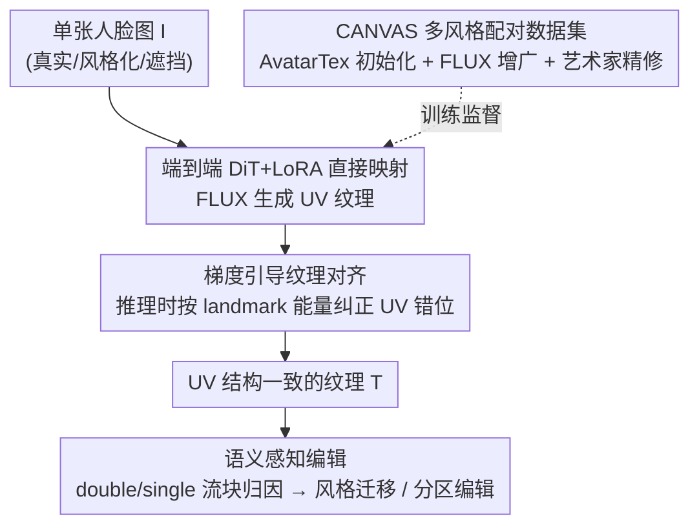

# OMGTex: One-stage Multi-style Facial Texture Reconstruction without Geometry Guidance

**会议**: CVPR 2026  
**arXiv**: [2605.25778](https://arxiv.org/abs/2605.25778)  
**代码**: https://github.com/xxx (待发布)  
**领域**: 3D视觉 / 扩散模型  
**关键词**: 面部纹理重建, UV纹理, 无几何先验, 扩散Transformer, 语义编辑

## 一句话总结
OMGTex 用一个 DiT 扩散模型把任意风格的人脸图像**直接**映射成可编辑的 UV 纹理，靠推理阶段的「梯度引导对齐」修正 UV 结构错位、靠对 attention 块的语义归因实现分区编辑，全程**不依赖 3D 几何先验**，对遮挡和风格化输入鲁棒，单图 7 秒重建并在 LPFF/CANVAS 上达到 SOTA。

## 研究背景与动机

**领域现状**：从单张人脸图重建 UV 纹理的主流做法（UV-IDM、Ultr-Avatar、FreeUV、SOAP）几乎都是「先拟合 3DMM 几何 → 投影出部分 UV 纹理 → 用扩散模型补全」的两阶段管线，把几何当成提供 UV 结构约束的脚手架。

**现有痛点**：这套范式有三个硬伤。其一，**强依赖精确几何**——风格化人脸（夸张造型、抽象阴影、笔触）本身就难拟合出拓扑一致的几何；真实人脸一旦被手、眼镜、口罩遮挡，几何估计也会崩。其二，**投影会把遮挡物的伪影一起带进纹理**，部分投影方法对遮挡敏感，纯多视图投影方法（SOAP）还有多视图不一致问题。其三，**整张纹理被当作一个整体合成**，无法做「只改肤色 / 只换眉形 / 只调嘴部」这类分区编辑和风格迁移，而这恰恰是游戏、VR 头像最常用的需求。

**核心矛盾**：扩散模型本身能生成多样、风格化的纹理，但它**缺乏显式的 UV 结构约束**，自由生成会导致 UV 错位（眼睛该闭却睁、五官竖直方向不对齐）。这正是以往工作非要用几何投影提供部分 UV 图的根本原因——用几何换结构约束，代价是丧失鲁棒性和编辑性。

**本文目标**：造一条**无几何先验**的管线，直接从 2D 人脸图生成多风格、可编辑、UV 结构一致的纹理；同时补齐多风格配对数据的缺口。

**切入角度**：作者的关键观察是——既然扩散模型生成能力强、只是缺 UV 约束，那就别再退回去用几何投影，而是在**推理阶段用梯度显式纠正结构**；并且发现扩散网络的不同 block 天然把不同语义（风格 / 身份 / 局部五官）分散到不同层，可以加以强化来做语义编辑。

**核心 idea**：用「端到端 DiT 直接生成 + 推理时梯度引导对齐 + attention 块语义归因」替代「几何拟合 + 投影补全」，把几何这根拐杖彻底扔掉。

## 方法详解

### 整体框架
OMGTex 要解决的是：给定单张任意风格人脸图 $I$，在没有任何几何引导的情况下重建出高质量、UV 结构一致、且可分区编辑的纹理 $T$。整条路线分三块：先用 FLUX.Kontext + AvatarTex + 艺术家精修**造出配对的多风格数据集 CANVAS**；然后在 DiT 骨干（FLUX.1.DEV）上训一个 **LoRA 条件模块**，让网络学会「人脸图 → UV 纹理」的直接映射；最后在**推理阶段**叠加梯度引导对齐修正 UV 错位，并利用 attention 块的语义分布做风格迁移与分区编辑。

整体是「数据构建 → 条件生成训练 → 推理对齐 / 语义编辑」的串行管线，各贡献组件如下图：

### 关键设计

**1. 无几何·一阶段 DiT 条件生成：把「几何拟合+投影」整条砍掉**

针对「依赖精确几何 → 风格化/遮挡场景崩」这个根本痛点，OMGTex 不再用 3DMM 拟合、投影出部分 UV 图当条件，而是直接把**人脸图本身**当条件，让 DiT 一步生成完整 UV 纹理。具体在 FLUX.1.DEV（DiT 骨干）上改造一个条件图像生成框架、训练一个 LoRA 条件模块，用 flow-matching 损失优化：

$$L_{RF}=\mathbb{E}_{t,\epsilon\sim\mathcal{N}(0,I)}\Big[\big\|v_{\theta}(z,t,c_i)-(\epsilon-x_0)\big\|^2\Big]$$

其中 $c_i$ 是条件人脸图的编码。这样一来，输入端不再需要任何几何、投影或部分纹理，遇到遮挡或夸张风格时也不会因为几何估不准而失败；代价是生成纹理的**布局没有显式 UV 约束**，这个遗留问题交给下面的设计 2 来补。

**2. 梯度引导纹理对齐：用频率洞察论证「不该用 ControlNet」，改在推理时按 landmark 能量纠偏**

设计 1 直接拿人脸图当条件，缺了 UV 结构约束，作者观察到两类错位：眼睛该闭却睁、五官竖直方向错位。一个直觉做法是用 ControlNet 注入结构条件，但实验发现它**纠不干净、还会和已有条件冲突拉低质量**。作者用频率分析解释了为什么：把扩散写成 ODE $\frac{dx_t}{dt}=f(x_t,t),\ x_t=(1-t)x_0+tx_1$，频率分量 $\omega$ 在时刻 $t$ 的信噪比为

$$\text{SNR}(\omega,t)=\frac{(1-t)^2|\hat{x_0}(\omega)|^2}{t^2|x_1(\omega)|^2}$$

自然图像呈低通特性 $|\hat{x_0}(\omega)|^2\propto|\omega|^{-\alpha}$，于是高频（皱纹、眉形等细节）能量低、扩散中 SNR 衰减快，反而在去噪时**对引导更敏感**；而低频结构（肤色、整体布局）对控制信号**不敏感、难精确操纵**。结论是：靠注入条件去控结构注定不准，应当**直接用梯度去引导去噪**。

于是作者训了一个专门用于纹理的 landmark 检测器 $l(\cdot)$，对预测的干净纹理 $\hat{x}_0$ 检测关键点，与标准拓扑关键点 $l^*$ 比，定义能量函数

$$E(\hat{x}_t)=\|l(\hat{x}_t)-l^*\|_2^2$$

并在推理时仿照 classifier guidance 做迭代纠正 $\tilde{x}_t=\hat{x}_t-\eta\nabla_{\hat{x}_t}E(\hat{x}_t)$，$\eta$ 控制结构约束强度。它在推理阶段显式把纹理拉回标准 UV 拓扑，且不引入会冲突的额外条件分支——这是它优于 ControlNet 的关键。

**3. attention 块语义归因 → 风格迁移与分区编辑：把「整张纹理一锅合成」拆成可控的语义单元**

针对「整体合成、无法分区编辑」的痛点，作者做了一个诊断实验：把某层 attention 权重矩阵乘一个小常数 $\tilde{\mathbf{A}}^{(l)}=\varepsilon\cdot\mathbf{A}^{(l)},\ \varepsilon\ll1$ 来「消融」该层，观察纹理退化。发现 FLUX 的 **double stream blocks 决定生成纹理的视觉风格、single stream blocks 决定身份特征**；而且 single 流的退化有规律：鼻子区域先退化、其次眼睛、最后嘴。这说明不同 attention 层天然负责不同纹理成分。

作者据此实现两类编辑。**风格迁移**：分别用 OMGTex 生成身份图 $I_{id}$ 与风格图 $I_{st}$ 的 attention 输出，在重建风格图时把 single 流特征 $F_{st}^{single}$ 替换成 $F_{id}^{single}$，即可保留风格、换上目标身份。**分区编辑**：进一步把 attention 块分成三组——肤色与粗结构 / 嘴及周边 / 眉及周边；训练时每当走到两组层的边界，以固定概率 $p$ 消融后续所有层、直接输出中间特征，并用对应的「分层增广局部纹理」（从 CANVAS 派生的监督数据，见图 5）做监督。这种**强制把不同语义归因到不同 Transformer 块**的训练策略，让模型在推理时只把参考图特征注入指定语义区域，实现真正的局部编辑——相比直接特征混合（$T_{fuse}$ 会改全脸），它能精确锁定眉/嘴区域。

**4. CANVAS：首个多风格配对纹理数据集，解决多风格重建的数据荒**

多风格纹理重建一直缺「风格化人脸图 ↔ ground-truth UV 纹理」的配对数据。作者用优化框架 AvatarTex 先拿到一批配对：它改进 FFHQ-UV，用通用 3D 生成模型出几何、再 NICP 配准到标准拓扑 $M_v$ 得到投影纹理 $T_{proj}$，用微调的纹理 inpainter 补全成 $T_{init}$，再做 StyleGAN 优化得纹理 $T$。但 AvatarTex 仍依赖几何、对像素画/夸张卡通这类难几何风格和遮挡鲁棒性有限，于是再用 FLUX.Kontext 在**风格多样性、空间与遮挡变化**上做增广，最后请专业艺术家精修对齐。最终 CANVAS 含 5,000 对高质量图-纹理，覆盖真实、日漫、欧美漫、像素画、素描、油画、迪士尼等风格，既是训练数据也是评测 benchmark。

### 损失函数 / 训练策略
- **主训练**：flow-matching 损失 $L_{RF}$（式 1），只训 LoRA 条件模块，FLUX 骨干冻结。
- **推理对齐**：基于 landmark 能量 $E$（式 5）的梯度引导迭代（式 6），无需重训，纯推理时生效。
- **编辑训练策略**：分区编辑时按概率 $p$ 在 attention 块组边界处消融后续层、输出中间特征，用 CANVAS 派生的分层增广局部纹理监督，强化语义解耦。

## 实验关键数据

### 主实验
在 FFHQ（真实，1000 张）、LPFF（大姿态，1000 张）、CANVAS（风格化，500 张）三套测试集上，与优化式 AvatarTex、推理式 SOAP / FreeUV 对比（所有结果统一转到 FLAME 标准 UV 布局、同一几何）：

| 数据集 | 指标 | OMGTex | AvatarTex(优化) | SOAP | FreeUV |
|--------|------|--------|------|------|--------|
| FFHQ | PSNR↑ | 29.75 | **30.03** | 24.45 | 29.18 |
| FFHQ | LPIPS↓ | **0.18** | 0.16 | 0.31 | 0.22 |
| LPFF | PSNR↑ | **28.92** | 27.91 | 22.76 | 26.12 |
| LPFF | FID↓ | **36.78** | 38.93 | 60.71 | 45.91 |
| CANVAS | PSNR↑ | **27.22** | 23.93 | 21.28 | 24.46 |
| CANVAS | FID↓ | **43.55** | 60.02 | 68.63 | 50.89 |

在推理式方法中全数据集领先；FFHQ 上略逊于优化式 AvatarTex（几何可用时优化法能更精细，但代价是几何依赖 + 长耗时）；越难（大姿态、风格化、遮挡）OMGTex 优势越明显。

| 方法 | AvatarTex | SOAP | FreeUV | **OMGTex** |
|------|-----------|------|--------|------------|
| 推理时间(s) | 90 | 360 | 20 | **7** |

OMGTex 单步端到端重建，跳过几何拟合，比次快的 FreeUV 还快近 3 倍。

### 消融实验
在 CANVAS 测试集上验证梯度引导对齐：

| 配置 | PSNR↑ | SSIM↑ | LPIPS↓ | FID↓ | L2↓ |
|------|-------|-------|--------|------|-----|
| Full (Ours) | **27.22** | **0.77** | **0.26** | **43.55** | **1.35** |
| w/o Grad Guide | 25.16 | 0.73 | 0.30 | 50.19 | 2.98 |
| ControlNet 替代 | 25.93 | 0.75 | 0.29 | 48.64 | 2.64 |

其中 L2 为重建纹理与标准 UV 布局的结构偏差（关键点对齐误差，越小越对齐）。

### 关键发现
- **梯度引导是 UV 一致性的命门**：去掉它（w/o Grad Guide）L2 结构误差从 1.35 飙到 2.98、FID 从 43.55 涨到 50.19，纹理出现睁眼伪影和五官错位。
- **梯度引导显著优于 ControlNet**：ControlNet 虽能部分纠正结构，但 L2=2.64 仍远逊 1.35，且控制信号冲突会整体拉低质量——印证了频率分析「注入条件控不准低频结构」的判断。
- **难场景才显本事**：FFHQ（简单真实）上略输优化式方法，但 LPFF/CANVAS（大姿态、风格化、遮挡）上全面领先，说明无几何设计专治几何拟合会崩的场景。

## 亮点与洞察
- **「扔掉几何拐杖」的反直觉决断**：以往都把几何当成提供 UV 约束的必需脚手架，本文证明在推理阶段用梯度纠偏就能替代它，从而对遮挡和风格化天然鲁棒——这是范式层面的转变，不只是换骨干。
- **用频率/SNR 分析论证「为什么不用 ControlNet」**：大多数工作直接堆 ControlNet，本文先推导出「低频结构对注入条件不敏感」，再据此选择梯度引导，方法选择有理论支撑而非试错，这个论证本身可迁移到其他「该用引导还是该用条件」的扩散控制问题。
- **attention 块天然语义分布的发现与利用**：double 流管风格、single 流管身份、single 流内部还按鼻→眼→嘴顺序退化——把这个「免费」的语义结构强化成可控编辑，编辑能力几乎是从骨干里「读」出来的而非额外硬塞模块。

## 局限与展望
- **简单真实域略逊优化式方法**：FFHQ 上 PSNR/LPIPS 不及 AvatarTex，几何可靠时优化式仍更精细，OMGTex 的优势集中在难场景。
- **landmark 检测器是新依赖**：梯度引导需要一个专门训练的纹理 landmark 检测器，其精度直接决定纠偏效果，论文未充分讨论它在极端风格下是否稳定。
- **编辑分区是预设的**：分区编辑把脸固定切成肤色/嘴/眉三组，更细粒度或自定义区域的编辑需要重新设计分组与监督数据。
- **CANVAS 含合成与艺术家精修成分**：5000 对中相当部分来自 AvatarTex 初始化 + FLUX 增广，作为 benchmark 评测时与真实分布的差距需注意。

## 相关工作与启发
- **vs UV-IDM / Ultr-Avatar / FreeUV**：它们都先拟合 3DMM、投影出部分 UV 纹理当扩散条件；OMGTex 直接拿人脸图当条件、推理时梯度纠偏，省掉几何依赖与投影伪影，对遮挡/风格化更鲁棒，且快得多（7s vs 20s+）。
- **vs SOAP**：SOAP 靠多视图投影补全完整 UV，遭遇遮挡和多视图不一致会出严重伪影；OMGTex 单图单步，不存在视图一致性问题。
- **vs AvatarTex（优化式）**：AvatarTex 用 StyleGAN 迭代优化 latent，几何可用时质量更高但需 90s 且依赖几何；OMGTex 牺牲简单域的微小精度，换来在难场景的全面领先和 13 倍提速。
- **vs ControlNet 路线**：本文从频率/SNR 角度论证注入结构条件控不准低频结构，改用梯度引导，消融中 L2 误差几乎减半，给「扩散结构控制该选引导还是条件」提供了一个有说服力的判例。

## 评分
- 新颖性: ⭐⭐⭐⭐⭐ 首个无几何先验的一阶段可编辑面部纹理重建框架，频率分析支撑的梯度引导设计有原创性
- 实验充分度: ⭐⭐⭐⭐ 三数据集主对比 + 时间 + 消融齐全，但编辑/风格迁移多为定性展示，缺定量评估
- 写作质量: ⭐⭐⭐⭐⭐ 动机—洞察—设计逻辑链清晰，频率分析与 attention 归因讲得有说服力
- 价值: ⭐⭐⭐⭐⭐ 鲁棒+快速+可编辑+多风格，直击游戏/VR 头像刚需，CANVAS 数据集也有复用价值

<!-- RELATED:START -->

## 相关论文

- [\[CVPR 2026\] Inferring Compositional 4D Scenes without Ever Seeing One](inferring_compositional_4d_scenes_without_ever_seeing_one.md)
- [\[CVPR 2026\] Any Resolution Any Geometry: From Multi-View To Multi-Patch](any_resolution_any_geometry_from_multi-view_to_multi-patch.md)
- [\[CVPR 2026\] Feed-Forward One-Shot Animatable Textured Mesh Avatar Reconstruction](feed-forward_one-shot_animatable_textured_mesh_avatar_reconstruction.md)
- [\[CVPR 2025\] HandOS: 3D Hand Reconstruction in One Stage](../../CVPR2025/3d_vision/handos_3d_hand_reconstruction_in_one_stage.md)
- [\[CVPR 2026\] CaliTex: Geometry-Calibrated Attention for View-Coherent 3D Texture Generation](calitex_geometry-calibrated_attention_for_view-coherent_3d_texture_generation.md)

<!-- RELATED:END -->
