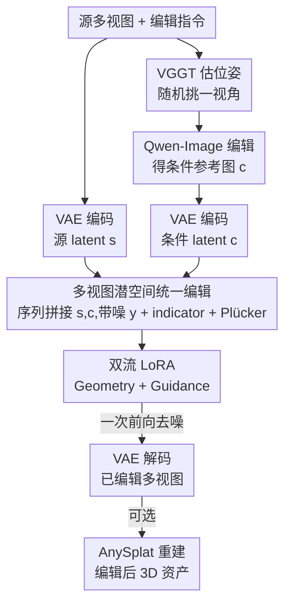

# Omni-3DEdit: Generalized Versatile 3D Editing in One-Pass

**会议**: CVPR 2026  
**论文**: [CVF Open Access](https://openaccess.thecvf.com/content/CVPR2026/html/Chen_Omni-3DEdit_Generalized_Versatile_3D_Editing_in_One-Pass_CVPR_2026_paper.html)  
**代码**: https://github.com/mt-cly/Omni3DEdit  
**领域**: 3D视觉  
**关键词**: 3D编辑, 多视图生成, LoRA, 数据合成, 扩散模型

## 一句话总结
Omni-3DEdit 把指令式 3D 编辑从"显式 3D 表示上的迭代优化"搬到**多视图潜空间的一次前向传播**，用一个基于预训练多视图生成模型 SEVA 的网络 OmniNet 同时支持物体删除/添加/外观编辑，并配一条数据合成管线解决配对数据稀缺，把单次编辑从几十分钟压到约 2 分钟。

## 研究背景与动机

**领域现状**：主流指令式 3D 编辑（如 InstructN2N、GaussianEditor）走的是"2D 模型指导显式 3D 表示迭代优化"的路线——反复采样相机视角、用 2D 编辑/inpainting 模型算梯度，再回灌进 NeRF 或 3D Gaussian，靠几千次迭代来弥补 2D 模型本身缺乏多视图一致性的问题。

**现有痛点**：这条路线有两个硬伤。其一是**缺乏通用性**：不同编辑任务需要不同的显式几何操作规则——外观编辑必须保留源几何，而物体删除却要大幅改动几何并依赖 mask，很难设计一套兼容所有任务的迭代规则。其二是**慢**：迭代上千次导致单次外观编辑就要几十分钟，还容易把纹理细节磨平。

**核心矛盾**：维护并更新一个显式 3D 表示、同时保证一致性，本质上就既慢又难以通用。后来有工作（Tailor3D、CMD）尝试在**物体级 3D 隐空间**里做单次统一编辑，但它们只在 object-centric 数据集（如 ObjaVerse）上训练，被绑死在特定相机位姿分布和无背景的单物体上，**处理不了带背景、任意视角的场景级输入**。

**本文目标**：要一个统一、快速、且能处理场景级任意视角的 3D 编辑模型，覆盖删除/添加/外观三类任务。

**切入角度**：作者把编辑战场从"显式 3D / 物体级隐空间"换到**多视图潜空间**——直接吃任意视角的多视图图像 + 编辑指令，输出一组一致的已编辑多视图，下游再用重建模型（AnySplat）秒级拿回 3D 资产。这样既能借力近年多视图生成、2D 编辑、3D 重建的进展，又天然支持场景级和任意视角。

**核心 idea**：先用现成 2D 编辑器（Qwen-Image）在随机选的一个视角上编辑出"参考视角"，再训一个 OmniNet 把这个编辑信号**隐式传播**到其余所有视角，全程一次前向、不做在线优化。

## 方法详解

### 整体框架
给定源 3D 场景的 $N$ 个任意视角图像 $I_{src}=\{I^1_{src},...,I^N_{src}\}$ 和编辑指令 $P$，Omni-3DEdit 的流程是：先用 VGGT 估出各视角的相对相机位姿 $p$；随机挑一个视角用 Qwen-Image 按指令编辑，得到一张**条件参考图** $I_{cond}$，它携带"该怎么编辑"的信号；把源视图和条件视图经 VAE 编码成源 latent $s$ 和条件 latent $c$。OmniNet（$f(\cdot)$）吃下源 latent、条件 latent 和带噪目标 latent，一次前向去噪出全部目标视角 latent，再经 VAE 解码得到一致的已编辑多视图；这组视图可选地丢给 AnySplat 在几秒内重建出编辑后的 3D 资产。

整条 pipeline 的精髓在于：模型**不预设任何任务先验**，只靠"参考视图 ↔ 源视图"之间的关系来隐式学习传播编辑内容，因此删除/添加/外观三类任务用同一套网络、同一次前向就能搞定。

> 训练数据怎么来是另一条离线管线（见关键设计 3），它产出配对的"编辑前/后多视图"来驱动 OmniNet 训练，不在上面这条推理流程里。

### 关键设计

**1. 多视图潜空间统一编辑范式：把三类任务塞进一次前向**

针对"显式 3D 路线缺通用性 + 慢"的痛点，作者不再维护显式几何，而是让 OmniNet 在序列空间里同时处理三组 latent：源视图 latent $s$、条件视图 latent $c$、带噪目标 latent $y_\sigma$。训练时目标 latent 按 EDM 加噪 $y^n_\sigma = y^n + \sigma\epsilon$，三组 latent **沿序列维拼接**（而非新增模块），从而最大化复用 SEVA 预训练时学到的跨视图几何关系先验。为了让网络分得清三种 latent 的角色，作者在特征空间给 $s$、$c$、$y_\sigma$ 分别打上 $-1$、$1$、$0$ 的 **indicator**；又把源视图位姿转成 **Plücker embedding** 注入条件视图和带噪目标视图，补足透视几何关系。损失只在目标视图 latent 上算：$L = \mathbb{E}\big[\|f(y_\sigma, s, c, \sigma)-y\|^2_2\big]$。这套设计的好处是模型对任务零假设，仅凭参考视图与源视图的关系隐式传播编辑，天然兼容删除/添加/外观，且推理就是一次去噪、无在线优化，把时间从几十分钟降到约 2 分钟。消融显示 indicator 和位姿都不可或缺：去掉 indicator PSNR 从 17.72 掉到 15.20，去掉位姿掉到 14.54。

**2. 双流 LoRA：用解耦参数化解"源视图信息被旁路"的难题**

直接把 SEVA 改造来吃源视图 latent 时，作者发现无论是特征空间拼接还是序列空间拼接，性能都明显退化——模型既丢了目标区域的生成能力，又没法保留源视图里未编辑区域的上下文。根因在于**用同一套共享投影层去处理功能完全不同的输入**：条件视图提供的是某个视角下精确的"编辑信号"，而源视图提供的是跨相机位姿的"原始上下文与纹理"，强迫共享层同时编码这两类截然不同的 latent 会引入学习冲突，源视图信息在前向中容易"消失"。为此，OmniNet 在 SEVA 每个 block 里维护两套独立参数：**Geometry LoRA** 专门处理源 latent $s$、抓取源视图间的几何先验；**Guidance LoRA** 专门把条件 latent $c$ 的编辑指导传播给目标 latent $y_\sigma$。两条流在共享的多视图注意力层里交换几何线索与编辑指导。和 MM-DiT 的两点区别是：其一用参数高效的 LoRA 而非两套完整参数，从而能直接借 SEVA 先验而不必整体复制；其二 MM-DiT 是为跨模态（文本/图像）设计的，而本文证明这种双流范式对**同模态但角色不同**（都是视觉 latent，但一个是源、一个是条件）同样有效。

**3. 配对数据合成管线：靠现有多视图先验批量造训练对**

整个学习范式的最大卡点是缺乏大规模"编辑前/后"配对的场景级多视图数据。作者的关键观察是：逐视图做删除或外观编辑通常只引入轻微的多视图纹理不一致，这种不一致可以被"一致性精修"修掉；而添加任务带来的严重几何不一致修不掉，可以靠**反向生成**绕开。于是基于 CO3Dv2/DL3DV/WildRGB-D 三个开源多视图数据集，搭了一条四阶段管线：① 指令生成（Gemini-2.5pro 分析多视图、挑出边界清晰、不被截断、各视角都可见的理想物体并生成编辑指令）；② 逐视图编辑（Qwen-Image 按指令逐帧前景删除）；③ 一致性精修（受 SDEdit 启发，给所有编辑后视图加 20% 轻噪，再用预训练 SEVA 去噪，抹平逐帧编辑带来的纹理/色彩差异）；④ 质量过滤（用 mLLM 检查是否满足指令、是否跨视图一致、有无明显伪影，Pass/Fail 筛掉失败样本）。外观编辑复用同一条管线。添加任务则**反过来**：把原始多视图当目标视图、把删除管线的输出当源视图，这样目标视图天生多视图一致，且无需额外 mask。最终在三个数据集上构建出约 9 万级别的配对样本（删除 27K、添加 28K、外观 23K 量级）。

### 损失函数 / 训练策略
训练沿用 SEVA 范式：EDM 加噪、损失只在目标视图 latent 上计算（式 2），用 Eps-weighting MSE 并采用 SNR shift。实现上 LoRA rank=8，OmniNet 训练 4000 步、batch 32、16 张 H20、去噪 50 步、分辨率 576×576，AdamW 学习率恒定 $1\times10^{-4}$，相机归一化到 $[-2,2]$、$N=10$。

## 实验关键数据

### 主实验
360° 物体删除（360-USID，7 个场景，指标在 object mask 内计算，PSNR↑/LPIPS↓ 的平均）：

| 方法 | PSNR ↑ | LPIPS ↓ | 备注 |
|------|--------|---------|------|
| SPIn-NeRF | 16.734 | 0.464 | 需 mask |
| Gaussian Grouping | 16.074 | 0.480 | 易破坏相邻物体 |
| Aurafusion360 | 17.661 | 0.388 | 强基线，但约 30min |
| **Omni-3DEdit (Ours)** | **17.722** | 0.395 | mask-free，约 2min |

物体添加（CO3Dv2 验证集，按 MVInpainter 协议评 NVS）：

| 方法 | PSNR ↑ | LPIPS ↓ | CLIP-T ↑ |
|------|--------|---------|----------|
| ZeroNVS | 14.56 | 0.716 | 0.196 |
| MVInpainter | 19.20 | 0.344 | 0.271 |
| **Omni-3DEdit (Ours)** | **20.67** | **0.278** | **0.277** |

复杂 3D 编辑（删除/添加组合 + 多轮编辑，自建 benchmark）：

| 方法 | CLIP-T/I | CLIP-Dir. | Gemini score | 时间 |
|------|----------|-----------|--------------|------|
| DGE | 0.246 | 0.132 | 1.7 | 5min |
| GaussianEditor | 0.253 | 0.146 | 2.0 | 17min |
| ViCANeRF | 0.257 | 0.141 | 2.2 | 28min |
| Nano-banana | 0.281 | 0.165 | 3.8 | - |
| **Omni-3DEdit (Ours)** | **0.286** | **0.170** | **4.0** | **2min** |

### 消融实验
在 360-USID 上拆 OmniNet 的输入信号与架构（SSIM↑/PSNR↑/LPIPS↓）：

| 配置 | SSIM ↑ | PSNR ↑ | LPIPS ↓ | 说明 |
|------|--------|--------|---------|------|
| Omni-3DEdit | 0.925 | 17.72 | 0.395 | 完整模型 |
| SEVA zeroshot | 0.911 | 13.99 | 0.575 | 丢源视图、只喂参考+噪声，位姿对不齐 |
| w/o indicator | 0.917 | 15.20 | 0.545 | 缺区分三类视图的显式信号 |
| w/o pose | 0.903 | 14.54 | 0.565 | 仅凭外观推透视几何太隐式 |

架构消融（可视化对比，Fig.7）：特征空间拼接产生明显伪影、细节模糊；序列空间共享层会**旁路源视图信息**；只有双流 LoRA 能同时抓住几何线索和编辑指导，编辑质量显著改善。

### 关键发现
- **架构选择是成败关键**：源视图与条件视图角色不同，共享投影层会让源视图信息在前向中"消失"，双流 LoRA 的解耦参数化是把性能拉起来的核心。
- **输入信号缺一不可**：indicator 和相机位姿任一缺失都让 PSNR 掉 2–3 个点，说明模型确实是靠"显式区分视图角色 + 透视几何"来工作的。
- **效率优势压倒性**：相比 Aurafusion360（30min）、ViCANeRF（28min），本文 2min 完成且无需 mask，质量还更高。

## 亮点与洞察
- **把"统一 3D 编辑"重新定义为多视图传播问题**：不再纠结显式几何怎么更新，而是让一个网络学"从参考视图把编辑传播到其余视图"，一次前向覆盖删除/添加/外观三类任务，这个换战场的思路很干净。
- **同模态双流 LoRA**：证明了 MM-DiT 式的双流不只适用于跨模态，对"同是视觉 latent 但角色不同（源 vs 条件）"也有效，是一个可迁移到其他"多输入但功能异质"生成任务的 inductive bias。
- **添加任务靠反向生成绕开数据难题**：删除数据正反一调就成了添加数据，且天然多视图一致、无需额外 mask，这个数据构造 trick 很省事。

## 局限与展望
- 作者承认受限于开源场景级数据稀缺（结论段被截断，⚠️ 完整局限以原文为准），数据管线依赖现成 2D 编辑器和质量过滤器的能力上限。
- 外观编辑因缺乏公开 benchmark 只能做定性/Gemini 评测，没有标准数值对比，说服力略弱。
- 强依赖一串现成模型（VGGT 估位姿、Qwen-Image 编辑、SEVA 主干、AnySplat 重建），任一环节失效都会传导到最终结果；参考视图选得不好可能影响传播质量。
- 改进方向：把参考视图的选择从随机改为更智能的策略，或引入多参考视图来缓解单视图指导信息不足的问题。

## 相关工作与启发
- **vs 显式 3D 路线（InstructN2N / GaussianEditor）**：他们在 NeRF/Gaussian 上迭代上千次保一致性，任务专用且慢；本文在多视图潜空间一次前向、任务通用、约 2min，区别在于彻底放弃显式几何更新。
- **vs 物体级隐空间路线（Tailor3D / CMD）**：他们能单次统一编辑但被绑死在 object-centric 数据和特定位姿，处理不了带背景的场景；本文在多视图空间支持任意视角和场景级输入。
- **vs 视频/多视图隐空间路线（DGE / V2Edit / Pro3D-Editor）**：视频模型 3D 一致性先验弱、需连续视角变换且不懂相机位姿；本文显式注入 Plücker 位姿和 indicator，并用双流 LoRA 解耦，效率与质量都更优。

## 评分
- 新颖性: ⭐⭐⭐⭐⭐ 把统一 3D 编辑重构为多视图潜空间传播 + 同模态双流 LoRA，思路新且自洽。
- 实验充分度: ⭐⭐⭐⭐ 删除/添加有定量对比、消融扎实，但外观编辑缺数值 benchmark。
- 写作质量: ⭐⭐⭐⭐ 动机—架构—消融逻辑清晰，图文对应好。
- 价值: ⭐⭐⭐⭐⭐ 把单次编辑从几十分钟压到 2min 且统一三类任务，实用价值高。

<!-- RELATED:START -->

## 相关论文

- [\[CVPR 2026\] Towards Generalized Multimodal Homography Estimation](towards_generalized_multimodal_homography_estimation.md)
- [\[CVPR 2026\] Revisiting 3D Reconstruction Kernels as Low-Pass Filters](revisiting_3d_reconstruction_kernels_as_low-pass_filters.md)
- [\[CVPR 2026\] Easy3E: Feed-Forward 3D Asset Editing via Rectified Voxel Flow](easy3e_feed-forward_3d_asset_editing_via_rectified_voxel_flow.md)
- [\[CVPR 2025\] Fast3R: Towards 3D Reconstruction of 1000+ Images in One Forward Pass](../../CVPR2025/3d_vision/fast3r_towards_3d_reconstruction_of_1000_images_in_one_forward_pass.md)
- [\[CVPR 2026\] UniSH: Unifying Scene and Human Reconstruction in a Feed-Forward Pass](unish_unifying_scene_and_human_reconstruction_in_a_feed-forward_pass.md)

<!-- RELATED:END -->
