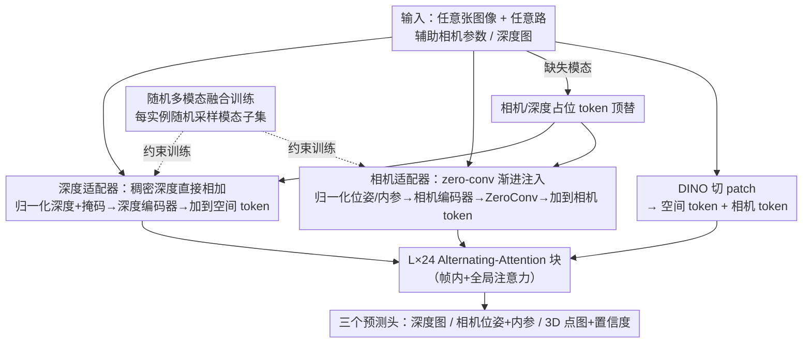

# OmniVGGT: Omni-Modality Driven Visual Geometry Grounded Transformer

**会议**: CVPR 2026  
**论文**: [CVF Open Access](https://openaccess.thecvf.com/content/CVPR2026/html/Peng_OmniVGGT_Omni-Modality_Driven_Visual_Geometry_Grounded_Transformer_CVPR_2026_paper.html)  
**代码**: https://livioni.github.io/OmniVGGT-official/ (项目页)  
**领域**: 3D视觉  
**关键词**: 3D基础模型, 多模态几何先验, 零卷积注入, 随机模态融合, VLA

## 一句话总结
OmniVGGT 在 VGGT 这类前馈 3D 基础模型上加了一个轻量 GeoAdapter，让模型能在训练和推理时灵活吸收**任意数量**的辅助几何模态（深度、相机内参/位姿），即便只给 RGB 也能超过 VGGT，给了辅助信息后还能进一步大幅提升，并把它接到 VLA 模型上改善了机器人操作。

## 研究背景与动机

**领域现状**：以 DUSt3R / MASt3R / VGGT 为代表的"空间基础模型"正在把单目深度、多视立体、相机位姿估计、3D 重建等任务统一进一个前馈网络里，几秒钟就能从一组图像直接回归出点云、深度和相机参数，逐渐取代逐场景优化的 NeRF / 3DGS 和传统 SfM 流水线。

**现有痛点**：这些模型几乎都假设**只吃 RGB**，把现实中唾手可得的几何线索全丢了——VR/AR 设备本来就带 RGB-D，自动驾驶有 LiDAR 点云，机器人往往已知相机内外参。这些先验白白浪费。少数尝试多模态的工作（如 Pow3R）又被卡死在"最多两路输入"（如一对 RGB + 一对深度），无法应对真实场景里**输入数量任意、组合任意**的情况。

**核心矛盾**：不同几何模态的性质天差地别——深度图是**逐像素稠密**的局部线索，而相机位姿是**全局属性**。如果把编码后的相机信息直接硬塞进大规模基础模型的特征空间，会在训练早期破坏其精心学到的表征，导致优化不稳定甚至崩溃。

**本文目标**：(1) 设计一种能不破坏基础模型表征、又几乎零开销的几何注入机制；(2) 让模型在测试时接受任意数量、任意组合的辅助模态，而不是死板地要求固定输入。

**切入角度**：用 ControlNet 式的"零初始化"思想——让注入分支从零开始、渐进地把先验"加"进去，初始时等价于原模型，从而保证训练稳定。再配一个随机采样模态子集的训练机制，逼模型学到**鲁棒的空间表征**而非记住"输入→输出"的捷径。

**核心 idea**：用一个 zero-conv 驱动的 GeoAdapter 把任意几何模态渐进注入 VGGT，再用随机多模态融合训练让推理时支持任意输入组合。

## 方法详解

### 整体框架
OmniVGGT 完全沿用 VGGT 的骨架：一组图像 $I=\{I_i\}_{i=1}^N$ 先被 DINO 切成空间 token，与可学习的相机 token、register token 拼接后送进 $L=24$ 层 Alternating-Attention（AA）块（帧内自注意力抓单图结构、全局自注意力跨视图聚合），最后三个 DPT/注意力 head 分别输出深度图、相机位姿内参、3D 点图及置信度。

OmniVGGT 的改动集中在"如何把辅助几何先验喂进这套骨架"。它额外接受任意数量的相机参数 $C=\{C_j\}_{j=1}^Q$（$Q\le N$）和深度图 $D=\{D_k,M_k\}_{k=1}^O$（$O\le N$，带有效掩码）。缺失辅助信息的图像用**相机占位 token / 深度占位 token** 顶替，所以输入数量天然可任意。先验通过 GeoAdapter 在每个 AA 块前注入：相机分支走 zero-conv 加到相机 token 上，深度分支直接加到空间 token 上。训练时再用随机模态融合让各种"部分信息"组合都被见过。

### 关键设计

**1. 相机适配器：用 zero-conv 渐进注入全局相机先验**

相机位姿是全局属性，直接注入会冲垮基础模型特征空间，这是早期训练崩溃的根因。OmniVGGT 先把相机外参归一化——以第一台相机为坐标原点对齐 $G_j' = G_j G_1^{-1}$，并用其余相机到原点的平均距离 $s=\frac{1}{Q-1}\sum_{j=2}^{Q}\|t_j-t_1\|_2$ 作为尺度因子归一化平移，消除尺度歧义。归一化后的内外参被参数化为 $g=\{q,t,f\}$（旋转四元数、平移、视场角），送进**每层独立**的相机编码器 $\mathcal{E}^{cam}_l$ 得到辅助相机 token。关键一步是把这些 token 过一个 zero-conv 层 $\mathcal{ZC}_l$ 再加回原相机 token：

$$\mathbf{e}^\prime_{c,i,l} = \mathbf{e}_{c,i,l} + \mathcal{ZC}_l\!\left(m_i\,\mathbf{e}^{\mathrm{aux}}_{c,i,l} + (1-m_i)\,\mathbf{e}^{\mathrm{plh}}_{c}\right)$$

其中 $m_i\in\{0,1\}$ 标记第 $i$ 张图是否带相机参数，缺失时用占位 token $\mathbf{e}^{\mathrm{plh}}_c$。zero-conv 初始权重为零，训练初期注入项恒等于 0、模型完全等价于 VGGT，先验随训练**渐进**生效，从而既稳定又只多 26.8M 参数、推理速度与 VGGT 几乎一致。

**2. 深度适配器：稠密深度直接相加，反而不用 zero-conv**

深度图是逐像素稠密线索，性质与相机位姿相反。每张辅助深度先按 batch 内有效像素均值归一化，与掩码沿通道拼成 $X=[D;M]\in\mathbb{R}^{2\times H\times W}$，送进单个卷积层的深度编码器 $\mathcal{E}^{dpt}$ 切成与空间 token 同维的辅助深度 token，**直接加**到对应空间 token 上：$\mathbf{e}^\prime_{f,i} = \mathbf{e}_{f,i} + n_i\,\mathbf{e}^{\mathrm{aux}}_{d,i} + (1-n_i)\,\mathbf{e}^{\mathrm{plh}}_{d}$。论文通过消融发现：给深度分支也加 zero-conv 反而**有害**——模型会把辅助深度当噪声而非有用先验，注入效果被削弱（见消融表 (c) Depth ZeroConv 在满辅助信息下 Abs Rel 从 0.106 退化到 0.505）。这说明"该不该用 zero-conv"取决于模态是全局还是稠密，是个非平凡的设计判断。

**3. 随机多模态融合训练：逼模型学鲁棒表征而非死记辅助线索**

要让推理时接受任意输入组合，训练就得见过各种"部分信息"场景。对长为 $S$ 的图像序列，先均匀采样 $Q\in[0,S]$ 决定多少张图给 GT 相机参数（赋给前 $Q$ 张），再**独立**采样 $O\in[0,S]$ 决定多少张给 GT 深度（随机赋给序列内任意位置）。此外有 $p\%$ 概率整个 batch 只用纯 RGB，保证无辅助场景也稳。这种随机分配不仅简化了训练流程，更关键的是逼模型把辅助线索当成"提升空间表征质量"的手段，而不是过拟合到"有辅助就抄、没辅助就废"。实验证实：注入辅助深度时**相机位姿估计也跟着涨**（100% 深度时 AUC@30° +6.33），说明确实在增强底层空间表征，而非学了一个直接的输入到输出映射。

### 损失函数 / 训练策略
沿用 VGGT 的多任务损失 $L = L_{camera} + L_{depth} + L_{pmap}$：相机损失用 $\ell_1$ 回归监督预测内外参，深度和点图损失用置信度感知回归损失并各加一个基于梯度的项增强局部几何一致性。模型在 19 个公开数据集（ARKitScenes、BlendedMVS、ScanNet++、TartanAir、Waymo 等，覆盖室内外/合成真实/动静态）上端到端训练，32 张 A100 训 10 天，用梯度检查点省显存。

## 实验关键数据

> 指标说明：**Abs Rel** 为深度绝对相对误差（越低越好）；**δ<1.25** 为深度 inlier 占比（越高越好）；**RRA/RTA@5°** 为相机对的相对旋转/平移精度（5° 阈值内的比例）；**AUC@30°** 为 RRA、RTA 取最小后在不同阈值上的精度曲线下面积；3D 重建用 **Acc**（准确度）/ **Comp**（完整度，均越低越好）/ **NC**（法向一致性，越高越好）。"w/ D"=注入 100% 深度，"K/RT"=内参/相对位姿。

### 主实验
单目深度（零样本，未训练数据集）与相机位姿估计上，OmniVGGT 即便纯 RGB 也压过 VGGT，给辅助后大幅领先 Pow3R：

| 任务 / 数据集 | 指标 | VGGT | Pow3R(w/D 或 w/K) | OmniVGGT (RGB) | OmniVGGT (w/辅助) |
|--------|------|------|----------|------|------|
| 单目深度 NYU-v2 | δ<1.25↑ | 94.8 | 99.8 (w/D) | 95.8 | **99.9** (w/D) |
| 单目深度 Sintel | δ<1.25↑ | 67.7 | 54.8 | 68.2 | **90.2** (w/D) |
| 位姿 Re10K-unseen | AUC@30°↑ | 85.3 | 62.5 (w/K) | 85.9 | **88.5** (w/K+RT) |
| 位姿 CO3Dv2 | AUC@30°↑ | 88.2 | 82.2 (w/K) | 88.4 | **93.4** (w/K+RT) |
| 多视深度 4 集均值 | rel↓ | 2.0 | 2.7 (w/K+RT) | 2.1 | **1.0** (w/K+RT+D) |

3D 重建（7-Scenes，每场景 3–5 张稀疏几乎无重叠的帧）上，注入相机参数带来 65.4% 的巨大提升（0.104→0.036），作者归因于该数据集极端稀疏使从零估位姿异常困难：

| 方法 | Acc-Mean↓ | Comp-Mean↓ | NC-Mean↑ |
|------|------|------|------|
| VGGT | 0.087 | 0.091 | 0.787 |
| CUT3R | 0.126 | 0.154 | 0.727 |
| OmniVGGT (RGB) | 0.104 | 0.112 | 0.763 |
| OmniVGGT w/ D | 0.085 | 0.085 | 0.789 |
| OmniVGGT w/ (K+RT) | 0.037 | 0.049 | 0.778 |
| OmniVGGT w/ (K+RT+D) | **0.036** | **0.036** | **0.810** |

效率上 OmniVGGT 是首个支持任意数量辅助输入的模型，却仍保持 ~0.2s 推理（约为 Pow3R 的 30 倍速）。

### 消融实验
GeoAdapter 架构消融（Sintel，满辅助信息 K+RT+D 设定）：

| 架构变体 | Abs Rel↓ | RTA@5°↑ | AUC@30°↑ | 说明 |
|------|---------|---------|---------|------|
| (a) Replace | 0.655 | 57.61 | 77.83 | 直接替换相机 token，最差 |
| (b) One-Layer Adapter | 0.133 | 60.89 | 81.66 | 只在 AA 前注入一次，先验不足 |
| (c) Depth ZeroConv | 0.505 | 71.66 | 84.12 | 深度也加 zero-conv，深度被当噪声 |
| (d) OmniVGGT (完整) | **0.106** | **76.33** | **85.99** | 相机走 zero-conv、深度直接加 |

辅助信息比例扫描（Sintel，逐步注入 GT）显示强可扩展性：仅注入 30% 深度即把 Abs Rel 降 69.71%；注入 100% 相机时位姿 RTA@5° 暴涨（54.01→76.33）。

### 关键发现
- **zero-conv 的"该用不该用"是模态相关的**：全局的相机先验必须靠 zero-conv 渐进注入才稳，而稠密的深度先验直接相加反而最好——加 zero-conv 会让模型把深度误判为噪声，这是最反直觉也最有价值的发现。
- **辅助一个模态能提升另一个任务**：注入深度让位姿估计也涨（AUC@30° +6.33），证明 GeoAdapter 是在增强共享的空间表征，而非学单点映射。
- **稀疏无重叠场景收益最大**：7-Scenes 上相机参数带来 65.4% 提升，正是因为这类极端稀疏视图下从零估位姿最难，辅助先验补上了最缺的那块。

## 亮点与洞察
- **"按模态选注入方式"是核心洞察**：全局属性（相机）需 zero-conv 渐进注入保稳定，稠密线索（深度）直接相加更好——这个区分把"如何往基础模型注入异质先验"讲透了，可迁移到任何想给前馈大模型加可选条件的场景。
- **占位 token + 随机模态采样 = 任意输入组合的优雅解法**：用占位 token 顶替缺失模态让输入数量天然可变，配随机采样训练就免去了为每种输入组合单独训模型，工程上极省事。
- **零开销的实用性**：26.8M 额外参数、推理速度与 VGGT 持平、比 Pow3R 快 30×，再加上能直接接进 VLA 改善机器人操作（CALVIN 上 RGB-only 变体零样本超基线 +0.43 Avg. Len），说明这套设计不只是刷点而是真能落地。

## 局限与展望
- 辅助模态目前只覆盖深度和相机内外参，LiDAR 点云、IMU、语义等其他常见传感模态尚未纳入统一框架，扩展性还有空间。
- 随机模态融合训练里只用了均匀采样和固定 $p\%$ 纯 RGB 概率，⚠️ 论文未深入探讨采样分布对最终鲁棒性的影响，可能存在更优的课程式采样策略。
- 训练成本不低（32×A100 训 10 天），且依赖 19 个数据集的大规模混合，复现门槛较高。
- 评测主要在已有公开 benchmark 上，对真正"in-the-wild"的复杂动态场景（如本会同期 ORBIT 揭示的难点）泛化能力如何，论文未充分检验。

## 相关工作与启发
- **vs VGGT**：VGGT 只吃 RGB，OmniVGGT 在其骨架上加 GeoAdapter，纯 RGB 时已小幅超过它（靠更鲁棒的训练表征），给辅助后大幅领先，且推理速度持平——是 VGGT 的"可选多模态增强版"。
- **vs Pow3R**：Pow3R 也做多模态注入但最多两路输入、且用慢速对齐（>7s）；OmniVGGT 支持任意数量输入、快 30×、注入更有效（Re10K 上领先 16%），核心区别在 zero-conv 渐进注入 + 随机融合训练带来的灵活性与稳定性。
- **vs DUSt3R/MASt3R/CUT3R**：这些前馈模型把统一 3D 表征做到不同效率/精度权衡，但都局限于 RGB；OmniVGGT 的贡献正是补上"如何吸收现成几何先验"这一被忽视的维度。

## 评分
- 新颖性: ⭐⭐⭐⭐ "按模态选注入方式 + 随机融合支持任意输入"是干净且有洞察的设计，但整体仍是 VGGT 上的 adapter 增量。
- 实验充分度: ⭐⭐⭐⭐⭐ 覆盖单目/多视深度、多视立体、位姿、3D 重建、VLA 五大任务，主结果 + 比例扫描 + 架构消融齐全。
- 写作质量: ⭐⭐⭐⭐ 方法和动机讲得清楚，zero-conv 的模态差异分析尤其到位。
- 价值: ⭐⭐⭐⭐⭐ 零开销、可任意组合、能接 VLA 落地机器人，对 3D 基础模型实用化推动明显。

<!-- RELATED:START -->

## 相关论文

- [\[CVPR 2026\] GGPT: Geometry-Grounded Point Transformer](ggpt_geometry_grounded_point_transformer.md)
- [\[CVPR 2026\] MVGGT: Multimodal Visual Geometry Grounded Transformer for Multiview 3D Referring Expression Segmentation](mvggt_multimodal_visual_geometry_grounded_transformer_for_multiview_3d_referring.md)
- [\[ICLR 2026\] Quantized Visual Geometry Grounded Transformer](../../ICLR2026/3d_vision/quantized_visual_geometry_grounded_transformer.md)
- [\[CVPR 2026\] Fast Spatial Tracking with Visual Geometry Transformer](fast_spatial_tracking_with_visual_geometry_transformer.md)
- [\[CVPR 2025\] VGGT: Visual Geometry Grounded Transformer](../../CVPR2025/3d_vision/vggt_visual_geometry_grounded_transformer.md)

<!-- RELATED:END -->
