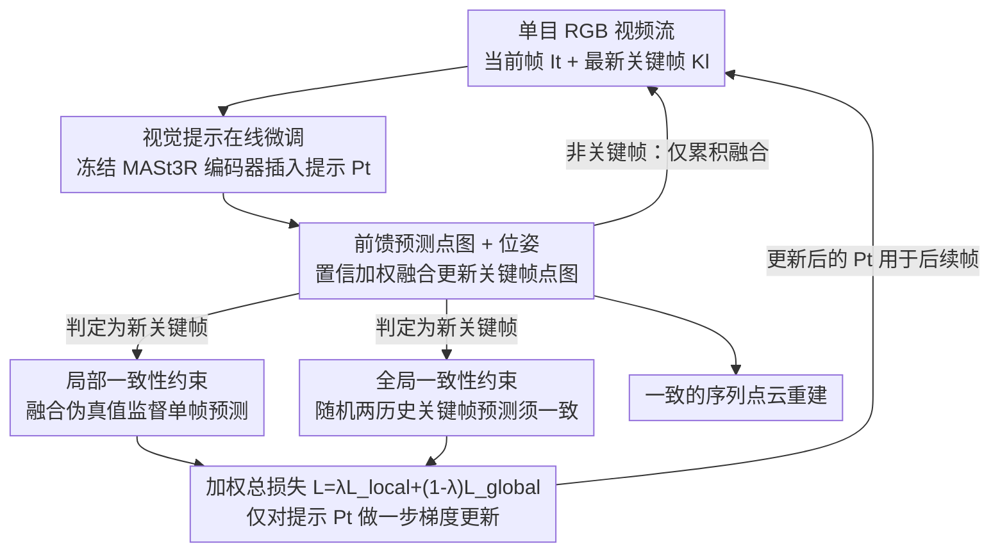

# Online3R: Online Learning for Consistent Sequential Reconstruction Based on Geometry Foundation Model

**会议**: CVPR 2026  
**论文**: [CVF Open Access](https://openaccess.thecvf.com/content/CVPR2026/html/Zhou_Online3R_Online_Learning_for_Consistent_Sequential_Reconstruction_Based_on_Geometry_CVPR_2026_paper.html)  
**代码**: [项目主页](https://shunkaizhou.github.io/online3r-1.0/)  
**领域**: 3D视觉  
**关键词**: 序列重建, 几何基础模型, 视觉提示微调, 测试时自监督, 一致性约束

## 一句话总结
Online3R 给冻结的几何基础模型（MASt3R-SLAM）插一组轻量可学习视觉提示，在测试时用「局部融合伪真值 + 全局参考帧不变性」两个自监督约束在线更新提示，让前馈重建网络边重建边适应新场景，从而消除序列重建的不一致与长程漂移，并在多个位姿/几何基准上超过此前 SOTA。

## 研究背景与动机
**领域现状**：从多视图图像恢复一致几何是机器人、VR/AR 的核心技术。近年的几何基础模型（DUSt3R、MASt3R、VGGT 等）用大规模预训练的前馈网络直接从图像对/多视图预测稠密点图与相机位姿，绕开了传统 Bundle Adjustment 的高复杂度与高算力开销。为了处理视频流，又出现两类序列重建方案：一类专门训练支持时序输入的模型（Spann3R 用记忆机制、CUT3R 用循环网络、Point3R 等）；另一类直接拿预训练基础模型（MASt3R-SLAM、VGGT-SLAM）出初值，再用几何约束做后端优化。

**现有痛点**：这些方法的几何先验全部冻结在预训练权重里——在与训练分布相近的场景里表现不错，但一旦进到完全陌生的新场景，单帧预测精度受限，误差会沿轨迹累积，最终导致位姿漂移、同一区域被重建到错位。MASt3R-SLAM 靠地图融合能缓解一部分不一致，但它的位姿估计仍然依赖网络输出本身的一致性，治标不治本。

**核心矛盾**：作者认为「训练出一个在所有场景都完美工作的模型」本身就不现实；真正缺的是**适应新环境的能力**。而要在测试时适应又撞上两个硬约束——测试时没有真值（GT）做监督，序列重建又要求高效率（不能慢慢全参数微调）。

**本文目标**：在不破坏基础模型通用几何先验的前提下，让模型能从测试时的流式数据里**在线学到当前场景的特定先验**，同时解决「没有真值」和「要够快」两个问题。

**切入角度**：借鉴 NLP/CV 里的提示微调（VPT、Test3R）——只往冻结骨干里塞极少量可学习参数（prompt），不动原权重。提示足够轻，天然适合在线频繁更新；冻结骨干又保住了泛化能力。

**核心 idea**：用「测试时在线微调一组视觉提示」代替「重训模型」，并用历史重建结果自蒸馏出局部+全局两个一致性监督信号来驱动这个在线学习，从而在没有 GT 的情况下保证序列重建一致性。

## 方法详解

### 整体框架
Online3R 建立在 MASt3R-SLAM 这个实时稠密 SLAM 之上：输入是单目 RGB 视频流，逐帧处理；每来一帧 $I_t$ 就和最新关键帧 $K_l$ 配对喂进冻结的 MASt3R 网络 $f_\theta$，输出各自的逐像素点图 $X\in\mathbb{R}^{H\times W\times 3}$、置信图 $C$ 与相机位姿 $T\in\mathrm{Sim}(3)$；当当前帧与关键帧的有效匹配数掉到阈值以下时，就把它升级为新关键帧。

在这套前端之上，Online3R 做了一件关键的事：往 MASt3R 编码器里插入一组可学习的视觉提示 $P_t$，让前馈输出不再只是输入图像对的函数，而是**额外受当前提示状态调制**。这组提示不是静态的——每当产生一个新关键帧，系统就触发一次在线更新：用「局部一致性约束」和「全局一致性约束」组合出的损失对提示做一步梯度下降（只更新提示，不动骨干）。局部约束提供高质量伪真值提升当帧精度，全局约束在稀疏关键帧上强制跨参考帧的几何不变性、压住长程漂移。两者按 $\lambda$ 加权，在关键帧这个「信息显著变化的时刻」更新，既保证了效率，又让模型沿轨迹逐渐学到一个连贯的、场景专属的表示。

### 关键设计

**1. 视觉提示在线微调：用 <1% 参数让冻结基础模型适应新场景**

痛点很直接：基础模型权重冻死了，没法针对当前场景调整几何先验，全参数微调又太贵、还会破坏泛化。Online3R 借鉴 VPT/Test3R，往 MASt3R 编码器（$N_e$ 层标准 ViT）里塞一组可学习提示 $\{P_{i-1}\}_{i=1}^{N_e}$。图像先切 patch 嵌入成 $D$ 维 token $E_0$，每一层把提示拼到 token 前面送进去：

$$[\,\_\,,\ E_i] = E_i([P_{i-1},\ E_{i-1}])$$

其中 $[\cdot,\cdot]$ 是拼接，提示对应的输出嵌入用完即弃。通过后续层的自注意力，提示 token 与图像 token 交互，**调制特征提取过程**去贴合当前场景的几何特性，而骨干权重一字不动。于是输出点图变成对提示状态 $P_t$ 的条件函数：$(X_t^t, X_l^t)=f_\theta(I_t, K_l; P_t)$。实现上提示长度 $N_p=32$、维度 $D=1024$（与 MASt3R 编码器特征维一致），零初始化，用 AdamW（lr $=1\times10^{-4}$）优化。因为参数极少，它能在视频流里以在线方式被反复更新而不拖垮速度——这是后两个约束能「测试时落地」的前提。

**2. 局部一致性约束：把多视融合的高质量几何蒸馏回单帧前馈预测**

没有 GT 怎么监督？作者注意到 MASt3R-SLAM 本身就在不断「融合」——它不会丢掉历史帧的几何，而是用置信加权的滑动平均把后续视角的测量持续融进关键帧点图。每估计出新帧 $I_t$ 与关键帧 $K_l$ 的相对位姿 $T_{lt}$ 后，关键帧规范点图按逐像素更新：

$$\tilde{X}_l^l \leftarrow \frac{\tilde{C}_l^l\,\tilde{X}_l^l + C_l^t\,(T_{lt}X_l^t)}{\tilde{C}_l^l + C_l^t},\qquad \tilde{C}_l^l \leftarrow \tilde{C}_l^l + C_l^t$$

这个融合点图 $\tilde{X}_l^l$ 汇总了多个视角、抑制了噪声与单视歧义，比任何单次前馈预测都更准——于是作者把它当成**伪真值**。每当一帧被升级为新关键帧（旧关键帧 $K_{l-1}$ 的融合也已完成），再用当前提示对 $(K_{l-1}, K_l)$ 做一次前馈，得到 $K_{l-1}$ 的单帧直接预测 $X_{l-1}^{l-1}$，并以 $\ell_1$ 距离逼近伪真值：

$$\mathcal{L}_{\text{local}}(\tilde{X}_{\text{canon}}, X_{\text{pre}}) = \sum_z \left\| \tilde{X}_{\text{canon}}(z) - X_{\text{pre}}(z) \right\|_1$$

梯度只回传到提示 $P_t$，等于把「多视融合后的几何」蒸馏回前馈网络，逼它产出和时序聚合几何一致的重建。

**3. 全局一致性约束：用「参考帧不变性」压住长程漂移**

只用局部约束有个新隐患：模型会过拟合到最近的几何特征，慢慢「忘掉」场景全局结构，造成时序漂移。为此作者加了一个不依赖任何真值的全局约束——**同一个关键帧的几何，不该因为换了哪个历史帧当参考而变**。具体地，新关键帧 $K_l$ 出现时，从位姿图里随机采两个不同的历史关键帧 $K_{h1}, K_{h2}$（$h1,h2<l$），做两次独立前馈：$f_\theta(K_l, K_{h1}; P_t)\to X_l^{l1}$、$f_\theta(K_l, K_{h2}; P_t)\to X_l^{l2}$。理想情况下两者应当完全相同（同一物理几何），任何偏差都说明地图不同部分之间的表示不一致：

$$\mathcal{L}_{\text{global}}(X_l^{l1}, X_l^{l2}) = \sum_z \left\| X_l^{l1}(z) - X_l^{l2}(z) \right\|_1$$

关键巧思在于它选在**跨长距离的稀疏关键帧**上算、而不是逐帧算——既覆盖了长轨迹的全局一致性，又避免了 Test3R 那种「输入分成三元组、强制自一致」带来的指数级算力（那个方案对要求高效的序列重建并不适用）。总目标把两者加权：

$$\mathcal{L}_{\text{total}} = \lambda\,\mathcal{L}_{\text{local}} + (1-\lambda)\,\mathcal{L}_{\text{global}}$$

实验里 $\lambda=0.5$。整个在线优化与关键帧的出现绑定：每出一个关键帧就同时算局部+全局损失更新一次提示（见下方训练策略），保证只在「场景出现显著新信息」的时刻投入算力。

### 损失函数 / 训练策略
在线提示微调的节奏完全由关键帧驱动（Algorithm 1）：提示零初始化 $P_0\leftarrow 0$，首帧设为关键帧；对流中每一帧先前馈 + 融合更新关键帧点图（Eq.3）；一旦判定当前帧为新关键帧，就依次算局部损失（Eq.4，在局部关键帧窗口内）、从关键帧缓冲里随机采两帧算全局损失（Eq.5），再按 $\mathcal{L}_{\text{total}}$（Eq.6）对提示做一步 AdamW 更新，更新后的提示传给后续帧。系统整体在单卡 A100 上约 10 FPS 运行；MASt3R 把图像最长边缩到 512 像素，沿用其全分辨率输出。

## 实验关键数据

### 主实验
位姿估计用 ATE（绝对轨迹误差，RMSE，米，越低越好）；几何评估用 Accuracy / Completion / Chamfer Distance（越低越好），均在单目、未标定（uncalibrated）设定下跑，标 `*` 表示未标定模式。

**相机位姿（TUM RGB-D，avg ATE↓）**

| 设定 | 方法 | avg ATE |
|------|------|---------|
| Calibrated | GO-SLAM | 0.035 |
| Calibrated | DROID-SLAM | 0.038 |
| Calibrated | MASt3R-SLAM | 0.030 |
| Calibrated | **Online3R (本文)** | **0.027** |
| Uncalibrated | CUT3R | 0.058 |
| Uncalibrated | MASt3R-SLAM* | 0.060 |
| Uncalibrated | **Online3R\* (本文)** | **0.056** |

在 NRGBD 上优势更明显：avg ATE 从 MASt3R-SLAM* 的 0.090 降到 0.076；相较 Point3R(0.615)、CUT3R(0.861)、Spann3R(1.444) 这些专门的在线重建模型则是数量级领先。

**稠密几何重建（7-Scenes / NRGBD，avg Chamfer↓）**

| 类型 | 方法 | 7-Scenes Chamf | NRGBD Chamf |
|------|------|----------------|-------------|
| Offline | DUSt3R-GA | 0.164 | 0.149 |
| Offline | MASt3R-GA | 0.183 | 0.074 |
| Offline | Test3R | 0.121 | 0.081 |
| Online | CUT3R | 0.140 | 0.088 |
| Online | Point3R | 0.132 | 0.076 |
| Online | MASt3R-SLAM* | 0.056 | 0.080 |
| Online | **Online3R\* (本文)** | **0.053** | **0.073** |

作者强调 Accuracy 是衡量一致性最重要的指标：在 7-Scenes 上 Acc 从 MASt3R-SLAM* 的 0.068 降到 0.039，甚至超过 DUSt3R-GA、MASt3R-GA 这类离线带全局对齐的方法——说明在线学习真的提升了几何一致性。

### 消融实验

| 配置 | 7-Scenes Acc↓ | 说明 |
|------|---------------|------|
| MASt3R-SLAM*（baseline） | 0.068 | 冻结模型、无在线学习 |
| Local* | 0.042 | 仅局部一致性约束 |
| Global* | 0.044 | 仅全局一致性约束 |
| Full*（本文） | 0.039 | 局部+全局组合 |

**效率（NRGBD）**

| 方法 | ATE↓ | #iter | FPS |
|------|------|-------|-----|
| MASt3R-SLAM* | 0.090 | - | 13.2 |
| Online3R*（本文） | 0.076 | 32 | 10.0 |

### 关键发现
- **两个约束各自有效、组合最优**：单独 Local（0.042）或 Global（0.044）都能把 baseline 的 0.068 拉下来不少，但二者联合（0.039）才最好——局部提精度、全局防漂移，互补而非冗余。
- **在线学习让提示隐式编码场景先验**：在不重叠的图像对（non-overlapping pairs）上，冻结的 MASt3R 只能重建参考帧、对非参考帧几何失败（缺当前 3D 场景先验）；Online3R 能恢复非参考帧几何——说明提示确实学到了场景专属的隐式 3D 表示。
- **算力换一致性是划算的**：在线学习只带来从 13.2 到 10.0 FPS 的有限下降（32 次迭代），换来 ATE 从 0.090 到 0.076 的明显改善，得益于提示轻量 + 仅在关键帧更新的设计。

## 亮点与洞察
- **把「现成的融合结果」直接当伪真值**：局部约束没有引入额外标注或额外网络，而是复用 SLAM 后端本就在做的置信加权多视融合——融合点图天然比单帧准，拿它反过来监督单帧前馈，等于零成本自蒸馏，这个「就地取材」很巧。
- **参考帧不变性是个便宜又对路的全局正则**：同一关键帧换不同历史参考帧应当给出一致几何，这条约束不需要 GT、计算只落在稀疏关键帧上，却直接打中了「长程漂移」这个序列重建的命门；相比 Test3R 三元组自一致的指数级开销，更适合在线场景。
- **测试时适应（TTA）思想迁移到几何基础模型**：把「冻结骨干 + 在线调提示 + 自监督一致性」这套组合拳套到任何前馈几何基础模型上都成立，思路可迁移到深度估计、SLAM、甚至 4D 动态重建。

## 局限与展望
- 作者承认：局部/全局约束计算 + 基于 VPT 的在线优化都带来额外算力开销（FPS 从 13.2 降到 10.0）。
- 当前系统只适用于**静态 3D 场景**的序列重建；扩展到 4D 动态场景、让基础模型持续适应运动物体，是留给未来的方向。
- ⚠️（自己发现的）评测全部在室内 RGB-D 数据集（TUM/NRGBD/7-Scenes），未涉及室外大尺度或快速运动场景；在线更新依赖「关键帧足够多、轨迹足够长」才能让全局约束起效，短序列下收益可能有限。

## 相关工作与启发
- **vs MASt3R-SLAM（基线）**：两者都用冻结 MASt3R + 图优化后端做实时稠密 SLAM，靠地图融合缓解不一致；区别在于 MASt3R-SLAM 网络参数全程冻死、无法适应新场景，Online3R 在它之上加在线提示微调，让前馈网络也能学场景先验——位姿与几何全面更优。
- **vs Test3R**：同样用提示微调强一致性，但 Test3R 面向**离线**重建，把输入分成三元组强制自一致，算力随帧数指数增长，不适合序列任务；Online3R 改用局部融合伪真值 + 稀疏关键帧全局约束，把开销压到可在线运行。
- **vs Spann3R / CUT3R / Point3R**：它们专门训练时序模型（记忆/循环/点级递归）处理在线重建，但仍受限于模型泛化能力，在测试新场景下累积误差大、易漂移；Online3R 不重训模型，而是测试时在线适应，几何与位姿指数级领先这几条基线。
- **vs LoRA3D**：同为基础模型场景适配，LoRA3D 对注意力权重做低秩更新（改内部权重），Online3R 用提示微调完全不动骨干权重，更好地保住通用先验。

## 评分
- 新颖性: ⭐⭐⭐⭐ 「冻结几何基础模型 + 测试时在线提示微调 + 局部融合伪真值/全局参考帧不变性双自监督」组合清晰且对路，虽多为已有思想（VPT、Test3R、MASt3R-SLAM）的巧妙拼装。
- 实验充分度: ⭐⭐⭐⭐ 覆盖 4 个数据集、位姿+几何两类指标、效率分析与组件消融齐全；但局限在室内静态场景。
- 写作质量: ⭐⭐⭐⭐ 动机—约束—算法逻辑顺，公式与 Algorithm 1 把流程交代得清楚。
- 价值: ⭐⭐⭐⭐ 给前馈几何基础模型的「测试时适应」提供了高效可落地的范式，对 SLAM/在线重建社区实用。

<!-- RELATED:START -->

## 相关论文

- [\[CVPR 2026\] Depth Any Panoramas: A Foundation Model for Panoramic Depth Estimation](depth_any_panoramas_a_foundation_model_for_panoramic_depth_estimation.md)
- [\[CVPR 2026\] 2D-LFM: Lifting Foundation Model without 3D Supervision](2d-lfm_lifting_foundation_model_without_3d_supervision.md)
- [\[CVPR 2026\] Tracking-Guided 4D Generation: Foundation-Tracker Motion Priors for 3D Model Animation](tracking-guided_4d_generation_foundation-tracker_motion_priors_for_3d_model_anim.md)
- [\[CVPR 2026\] Velox: Learning Representations of 4D Geometry and Appearance](velox_learning_representations_of_4d_geometry_and_appearance.md)
- [\[CVPR 2026\] VGGT-360: Geometry-Consistent Zero-Shot Panoramic Depth Estimation](vggt-360_geometry-consistent_zero-shot_panoramic_depth_estimation.md)

<!-- RELATED:END -->
