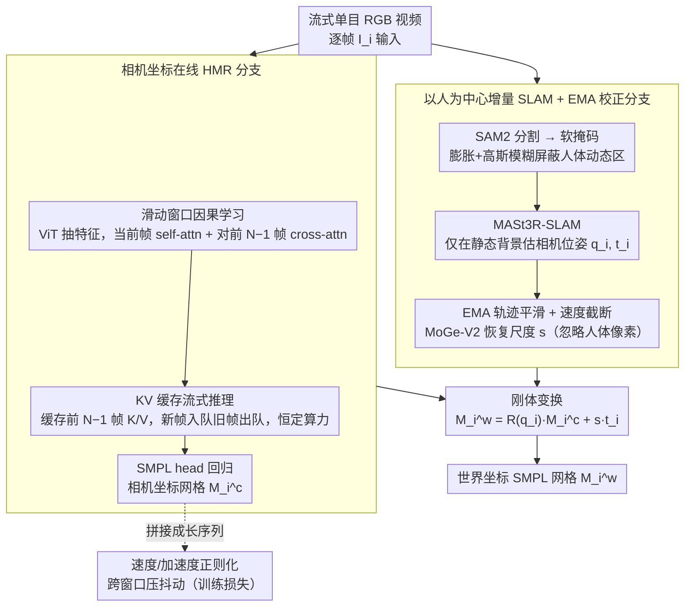

# OnlineHMR: Video-based Online World-Grounded Human Mesh Recovery

**会议**: CVPR 2026  
**arXiv**: [2603.17355](https://arxiv.org/abs/2603.17355)  
**代码**: [GitHub](https://tsukasane.github.io/Video-OnlineHMR/)  
**机构**: Carnegie Mellon University, University of Pennsylvania
**领域**: 3D视觉  
**关键词**: 人体网格恢复, 在线推理, SLAM, 世界坐标, 因果推理, KV缓存

## 一句话总结

提出 OnlineHMR，首个同时满足系统因果性、忠实性、时序一致性和高效性四项准则的在线世界坐标人体网格恢复框架，通过滑动窗口因果学习 + KV 缓存推理实现流式相机坐标 HMR，结合以人为中心的增量 SLAM 和 EMA 轨迹校正实现在线全局定位。

## 研究背景与动机

**领域现状**：人体网格恢复（HMR）从单目视频重建 3D 人体姿态和形状，近年从相机坐标扩展到世界坐标的全局人体轨迹和运动恢复。WHAM、TRAM、GVHMR 等方法取得了显著进展。

**现有痛点**：(a) 大多数方法是**离线**的——TCMR/GLoT 取 16 帧序列估计中间帧、TRAM 依赖全局优化 SLAM；(b) WHAM 声称在线但其全局轨迹模块实际依赖离线 DPVO/DROID-SLAM（用后续帧修正先前相机位姿）；(c) Human3R 支持在线但局部运动质量差、抖动严重（因 4D 场景重建中人体数据远少于场景数据，精度受限）；(d) AR/VR、远程呈现、感知-动作循环等实时交互场景被排除在外。

**核心矛盾**：在严格因果约束下（不看未来帧、不做全局优化），如何同时保证全局轨迹精度和局部运动质量？

**本文方案**：将问题解耦为两个专家分支——相机坐标 HMR（精确局部运动）和增量 SLAM（全局定位），各自因果化后通过物理约束桥接。提出四项在线处理准则：(1) 系统级因果性；(2) 忠实的几何/姿态重建；(3) 时序一致性；(4) 常数时间复杂度推理效率。

## 方法详解

### 整体框架

**输入**：流式单目 RGB 视频逐帧输入。**输出**：每帧世界坐标系下的 SMPL 人体网格 $\mathbf{M}_i^w \in \mathbb{R}^{6890 \times 3}$。

框架包含**两个并行分支**：

- **分支一：相机坐标在线 HMR**——基于 HMR2.0（ViT backbone）初始化，滑动窗口因果注意力融合时序信息，KV 缓存实现流式推理，输出相机坐标下的 SMPL 参数（姿态 $\boldsymbol{\theta}_i \in \mathbb{R}^{23 \times 3}$、形状 $\boldsymbol{\beta}_i \in \mathbb{R}^{10}$、根旋转 $\mathbf{R}_i^{\text{root}}$、根平移 $\mathbf{t}_i^{\text{root}}$），生成相机坐标网格 $\mathbf{M}_i^c$。
- **分支二：以人为中心增量 SLAM**——SAM2 分割人体 → 膨胀+高斯模糊生成软掩码 → 屏蔽人体动态区域 → MASt3R-SLAM 增量估计相机位姿 $\{\mathbf{q}_i^c, \mathbf{t}_i^c\}$ → EMA 平滑校正 → MoGe-V2 度量深度恢复尺度因子 $s$。

**坐标变换**：世界坐标网格通过刚体变换得到：

$$\mathbf{M}_i^w = \mathbf{R}(\mathbf{q}_i^c) \cdot \mathbf{M}_i^c + s \cdot \mathbf{t}_i^c$$

其中 $\mathbf{R}(\mathbf{q}_i^c)$ 是四元数 $\mathbf{q}_i^c \in \mathbb{R}^4$ 对应的旋转矩阵，$s$ 是度量尺度因子。

### 关键设计

**1. 滑动窗口因果学习：用当前帧和过去帧聚合时序，而不是偷看未来帧**

TCMR/MPS-Net/GLoT 这类时序方法之所以离线，是因为它们要取一段 16 帧的序列、输出最中间那帧，等于每估计一帧都要等齐后面 $N/2$ 帧——这直接违背了流式系统的因果性。OnlineHMR 改用大小为 $N$、步长为 1 的重叠滑动窗口，每个窗口只覆盖帧 $i-N+1$ 到当前帧 $i$。窗口内所有帧先过 ViT backbone 抽 patch 级空间特征，当前帧对自身做 self-attention 保留单帧细节，同时作为 query 对前 $N-1$ 帧做 cross-attention 聚合短期时序上下文，融合后的特征送入 SMPL head 回归出这一帧的人体参数，各窗口的单帧输出顺次拼接成完整序列。因为信息只往回看，因果性是结构自带的；又因为窗口之间相互独立，训练时所有窗口能并行算（非在线、吃满 GPU），到推理时再靠下面的 KV 缓存切成逐帧在线模式。

**2. KV 缓存流式推理：把训练时的并行窗口在推理时摊成恒定算力**

光有因果窗口还不够——如果每来一帧都把整窗 $N$ 帧重算一遍，算力会随窗口大小线性涨。借鉴自回归 LLM 的做法，OnlineHMR 把前 $N-1$ 帧的 key/value 特征（$\mathbf{k}_{i-1}\dots\mathbf{k}_{i-N+1}$、$\mathbf{v}_{i-1}\dots\mathbf{v}_{i-N+1}$）缓存下来，新来一帧时只需算当前帧自己的注意力：

$$\mathbf{A}_{\text{self}} = \text{Softmax}\left(\frac{\mathbf{q}_i \mathbf{k}_i^\top}{\sqrt{d}}\right)\mathbf{v}_i, \qquad \mathbf{A}_{\text{cross}} = \text{Softmax}\left(\frac{\mathbf{q}_i \mathbf{k}_{\text{prev}}^\top}{\sqrt{d}}\right)\mathbf{v}_{\text{prev}}$$

其中 $d$ 为特征维度，$\mathbf{k}_{\text{prev}}$、$\mathbf{v}_{\text{prev}}$ 直接从缓存里拼出来；新帧算完后它的 key/value 入队、最旧一帧出队，缓存始终维持 $N-1$ 帧。这样每帧的计算量与历史长度无关，达到常数时间复杂度。关键在于训练和推理用的是同一套权重、同一个窗口语义——训练并行享 GPU 效率，推理 KV 缓存保因果且算力恒定，训练-推理一致性天然成立。

**3. 速度/加速度正则化：在拼接出的长序列上跨窗口压抖动**

单帧回归各管各的，窗口边界处关节容易出现抖动。正因为滑动窗口步长取了 1，连续帧的输出能无缝拼成完整序列，于是损失就可以直接架在跨窗口的长序列上，惩罚相邻帧的关节位移（速度）和位移的二阶差分（加速度）：

$$\mathcal{L}_v = \lambda_5 \frac{\sum_{i,t} c_{i,t} \|\mathbf{p}_{i,t} - \mathbf{p}_{i,t-1}\|_2^2}{\sum_{i,t} c_{i,t} + \epsilon}, \qquad \mathcal{L}_a = \lambda_6 \frac{\sum_{j,i} c_{j,i} \|\mathbf{p}_{j,i+1} - 2\mathbf{p}_{j,i} + \mathbf{p}_{j,i-1}\|_2^2}{\sum_{j,i} c_{j,i} + \epsilon}$$

其中 $\mathbf{p}$ 是相对骨盆的关节位置，$j$ 为关节索引，$c$ 是 GT 给的每关节置信度——用它加权是为了不让不可见关节的噪声拖累正则。消融里这一项把 EMDB-1 的 Jitter 几乎砍半，是局部运动平滑的主力。

**4. 以人为中心增量 SLAM + EMA 校正：在人体占满画面的视频里做因果全局定位**

把相机坐标的人体网格抬进世界坐标，需要逐帧的相机位姿和度量尺度，但以人为中心的视频里人体又大又动，动态纹理和形变直接破坏 SLAM 的静态场景假设。OnlineHMR 用三步把这条全局分支因果化。第一步是软掩码：用 SAM2 分割人体区域 $C_i^h$，再膨胀加高斯模糊得到一张连续的置信掩码，

$$C_i^{\text{soft}} = \frac{G_\sigma * (C_i^h \oplus S_k^{(n)})}{\max_p (G_\sigma * (C_i^h \oplus S_k^{(n)}))}$$

其中 $S_k^{(n)}$ 为膨胀核；相比非黑即白的硬掩码，软掩码不会在人体边界留下被 SLAM 错当特征的锐利边缘，于是 MASt3R-SLAM 只在静态背景上提特征匹配。第二步是 EMA 轨迹平滑：维护一个长度为 $B$ 的历史缓冲区，按指数衰减权重 $w_m = (1-\alpha)^{B-1-m}$（归一化使 $\sum w_m = 1$）算出参考位置并取残差，

$$\bar{\mathbf{t}}_i = \sum_{m=0}^{B-1} w_m \mathbf{t}_{i-m}, \quad \Delta\mathbf{t}_i = \mathbf{t}_i - \bar{\mathbf{t}}_i, \qquad \mathbf{t}_i' = \bar{\mathbf{t}}_i + \alpha \Delta\mathbf{t}_i$$

为防止突变，残差还做速度自适应截断（阈值 $\tau = \lambda_{\text{clamp}} \bar{v}$，超过就缩放更新量）；旋转则用四元数 LERP 近似 SLERP（先翻半球保证内积大于 0）$\mathbf{q}_i' = \text{normalize}((1-\alpha)\mathbf{q}_{i-1}' + \alpha \mathbf{q}_i)$。这里最妙的判断是：不去直接平滑人体运动——那会把体操翻滚之类的极端动作也一并抹平——而是平滑相机轨迹，让世界坐标变换天然平顺，间接正则化人体运动，从而绕开运动先验泛化性差的老问题。第三步恢复度量尺度：用 MoGe-V2 估计每帧度量深度，与 SLAM 深度图比对算出尺度因子 $s$，计算时刻意忽略人体像素——人体在 SLAM 深度图里本就模糊，加上 dolly zoom 效应（摄影师边走近边变焦，人体在画面里大小不变但真实深度在变），算进来只会污染尺度。最终世界坐标网格由刚体变换 $\mathbf{M}_i^w = \mathbf{R}(\mathbf{q}_i^c)\mathbf{M}_i^c + s\mathbf{t}_i^c$ 给出。

**5. 频域抖动评价指标：用 STFT 频谱衡量运动自然度**

传统的 Accel/Jitter 是逐帧差分的标量，对"抖得像不像人"并不敏感。作者改从频域看问题：对运动序列 $\mathbf{y}(i) \in \mathbb{R}^{F \times 3J}$ 做短时傅里叶变换，

$$\mathbf{S}(i,f) = \left|\sum_{k=0}^{L-1} \mathbf{y}(k) w(k-i) e^{-j2\pi fk/N_w}\right|$$

其中 $w(\cdot)$ 为 Hann 窗。自然人体运动的能量主要集中在 10Hz 以下，高频段的能量恰好对应不自然的抖动，所以这个谱比单一标量更贴近人眼对抖动的感知。

### 损失函数

帧级 HMR 损失把标准的几项监督加在一起：

$$\mathcal{L}_f = \lambda_1 \mathcal{L}_{2D} + \lambda_2 \mathcal{L}_{3D} + \lambda_3 \mathcal{L}_{\text{SMPL}} + \lambda_4 \mathcal{L}_V$$

其中 $\mathcal{L}_{2D}$ 为 2D 关键点重投影、$\mathcal{L}_{3D}$ 为 3D 关键点、$\mathcal{L}_{\text{SMPL}}$ 为 SMPL 参数、$\mathcal{L}_V$ 为 3D 顶点监督。叠上设计 3 的跨窗口速度/加速度正则后得到总损失：

$$\mathcal{L} = \mathcal{L}_f + \mathcal{L}_v + \mathcal{L}_a$$

训练数据为 BEDLAM + 3DPW + H3.6M，单卡 H100 约 52K iterations 收敛。

## 实验关键数据

### 主实验：相机坐标 HMR（EMDB-1 数据集，单位 mm）

| 方法 | 类型 | PA-MPJPE $\downarrow$ | MPJPE $\downarrow$ | PVE $\downarrow$ | Accel $\downarrow$ |
|------|------|:------:|:------:|:------:|:------:|
| HMR2.0 | 逐帧 | 60.7 | 98.3 | 120.8 | 19.9 |
| ReFit | 逐帧 | 58.6 | 88.0 | 104.5 | 20.7 |
| TRAM | 离线 | 45.7 | 74.4 | 86.6 | 4.9 |
| GVHMR | 离线 | 44.5 | 74.2 | 85.9 | — |
| PHMR | 离线 | 40.1 | 68.1 | 79.2 | — |
| TRACE | 在线 | 71.5 | 110.0 | 129.6 | 25.5 |
| Human3R | 在线 | 48.5 | 73.9 | 86.0 | — |
| **OnlineHMR** | **在线** | **46.0** | **74.0** | **86.1** | **9.0** |

### 主实验：世界坐标全局轨迹（EMDB-2 数据集）

| 方法 | 类型 | PA-MPJPE $\downarrow$ | WA-MPJPE $\downarrow$ | W-MPJPE $\downarrow$ | RTE(%) $\downarrow$ | ERVE $\downarrow$ |
|------|------|:------:|:------:|:------:|:------:|:------:|
| WHAM+DPVO | 离线 | 38.2 | 135.6 | 354.8 | 6.0 | 14.7 |
| TRAM | 离线 | 38.1 | 76.4 | 222.4 | 1.4 | 10.3 |
| PHMR | 离线 | — | 71.0 | 216.5 | 1.3 | — |
| TRACE | 在线 | 58.0 | 529.0 | 1702.3 | 17.7 | 370.7 |
| Human3R | 在线 | — | 112.2 | 267.9 | 2.2 | — |
| **OnlineHMR** | **在线** | **40.1** | **93.5** | **310.4** | **2.2** | **12.4** |

### 效率对比

| 方法 | 在线 | FPS $\uparrow$ | 平均延迟(s) $\downarrow$ | WA-MPJPE $\downarrow$ |
|------|:------:|:------:|:------:|:------:|
| SLAHMR | ✗ | 0.1 | 2435 | 326.9 |
| TRAM | ✗ | 2.1 | 115.95 | 76.4 |
| WHAM+DPVO | ✗ | 9.3 | 26.18 | 135.6 |
| Human3R | ✓ | 4.8 | 0.21 | 112.2 |
| **OnlineHMR** | **✓** | **3.3** | **0.30** | **93.5** |

### 消融实验

**速度正则化消融（Accel / Jitter 指标）**：

| 设置 | 3DPW Accel $\downarrow$ | 3DPW Jitter $\downarrow$ | EMDB-1 Accel $\downarrow$ | EMDB-1 Jitter $\downarrow$ |
|------|:------:|:------:|:------:|:------:|
| 无速度正则化 | 8.9 | 32.3 | 15.7 | 70.1 |
| **有速度正则化** | **6.4** | **19.5** | **9.0** | **33.7** |

**SLAM 掩码策略消融（ATE 指标，越低越好）**：

| SLAM 方法 | 无掩码 | 硬掩码 | 软掩码 |
|------|:------:|:------:|:------:|
| DROID-SLAM | 2.52 | 1.55 | **1.07** |
| MASt3R-SLAM | 1.22 | 0.96 | **0.83** |

### 关键发现

- **因果推理代价极小**：EMDB-1 上 PA-MPJPE 仅比离线 TRAM（45.7）高 0.3mm，同时 Accel 控制在合理范围
- **在在线方法中全面领先**：相机坐标精度显著优于 TRACE（PA-MPJPE 46.0 vs 71.5），世界坐标 WA-MPJPE 比 Human3R 低 18.7（93.5 vs 112.2）
- **速度正则化有效**：Jitter 从 32.3/70.1 降至 19.5/33.7（3DPW/EMDB-1），约减半
- **软掩码优于硬掩码和无掩码**：MASt3R-SLAM 的 ATE 从 1.22（无掩码）→ 0.96（硬掩码）→ 0.83（软掩码）
- **在线方法延迟极低**：平均延迟 0.30s vs 离线 TRAM 的 115.95s（~400× 加速）
- **W-MPJPE 偏高的原因**：度量尺度恢复不够精确——WA-MPJPE 好但 W-MPJPE 偏高说明全局轨迹形状正确但增量估计的后续帧尺度有漂移

## 亮点与洞察

- **训练非在线、推理在线的 KV 缓存设计**：训练时窗口并行化享受 GPU 效率，推理时 KV 缓存保证因果性和常数时间。这个训练-推理解耦模式可迁移到任何需要在线化的视频理解任务。
- **通过平滑相机来平滑人体**的间接正则化策略——不对人体运动施加运动先验（会限制极端动作），而是平滑 SLAM 相机轨迹让全局变换天然平滑。优雅地绕开了运动先验泛化性差的问题。
- **解耦局部运动和全局定位到两个专家分支**：避免了 Human3R 等端到端方法因训练数据不平衡（4D 场景数据 >> 人体数据）导致的局部运动精度不足。
- **四准则形式化定义**：将在线 HMR 的需求系统化为因果性/忠实性/一致性/效率四个维度，为后续工作提供了清晰的评价框架。
- **频域抖动指标**：基于 STFT 的频谱分析比传统 Accel/Jitter 指标更贴近人眼感知。

## 局限与展望

1. **世界坐标精度仍低于离线方法**：WA-MPJPE 93.5 vs TRAM 76.4 / PHMR 71.0，度量尺度恢复是瓶颈
2. **尺度漂移问题**：W-MPJPE 偏高说明增量估计的后续帧尺度不够稳定，长序列可能累积误差
3. **EMA 参数需手动调优**：$\alpha$、$B$、$\lambda_{\text{clamp}}$ 等超参对不同运动类型敏感，极端运动可能被过度平滑
4. **假设连续视角**：无法处理突然的镜头切换或多相机输入
5. **依赖外部模型**：SAM2（分割）+ MoGe-V2（深度）+ MASt3R-SLAM（轨迹），增加了系统复杂度
6. **多人场景未系统化**：虽然展示了多人可视化但未做定量评估
7. **频域指标社区接受度待验证**

## 相关工作对比

- **vs TRAM**：同为两分支架构但 TRAM 用全局优化 SLAM，离线。OnlineHMR 改为增量 SLAM + EMA，牺牲少量精度（WA-MPJPE +17.1）换取 ~400× 延迟降低。
- **vs Human3R**：端到端在线重建，基于 CUT3R 的隐式约束。局部运动抖动且不准确。OnlineHMR 解耦后局部精度更高（PA-MPJPE 46.0 vs 48.5），全局也更好（WA-MPJPE 93.5 vs 112.2）。
- **vs WHAM**：相机坐标在线但全局离线（DPVO 用未来帧修正过去帧）。OnlineHMR 首次实现全系统在线。

## 评分

- 新颖性: ⭐⭐⭐⭐ 首个严格满足四项在线准则的全局 HMR 系统，KV 缓存在线化设计和间接平滑策略新颖
- 实验充分度: ⭐⭐⭐⭐ 标准 benchmark + 野外视频 + 效率分析 + 消融充分
- 写作质量: ⭐⭐⭐⭐ 问题定义清晰（四准则），系统设计条理分明，动机-方案映射明确
- 价值: ⭐⭐⭐⭐ 对 AR/VR、机器人感知-动作回路等实时应用有直接工程价值

<!-- RELATED:START -->

## 相关论文

- [\[CVPR 2026\] Fall Risk and Gait Analysis using World-Spaced 3D Human Mesh Recovery](fall_risk_gait_analysis_hmr.md)
- [\[CVPR 2026\] Anny-Fit: All-Age Human Mesh Recovery](anny-fit_all-age_human_mesh_recovery.md)
- [\[CVPR 2025\] PromptHMR: Promptable Human Mesh Recovery](../../CVPR2025/3d_vision/prompthmr_promptable_human_mesh_recovery.md)
- [\[CVPR 2026\] ResiHMR: Residual-Limb Aware Single-Image 3D Human Mesh Recovery for Individuals with Limb Loss](resihmr_residual-limb_aware_single-image_3d_human_mesh_recovery_for_individuals_.md)
- [\[ECCV 2024\] Global-to-Pixel Regression for Human Mesh Recovery](../../ECCV2024/3d_vision/global-to-pixel_regression_for_human_mesh_recovery.md)

<!-- RELATED:END -->
