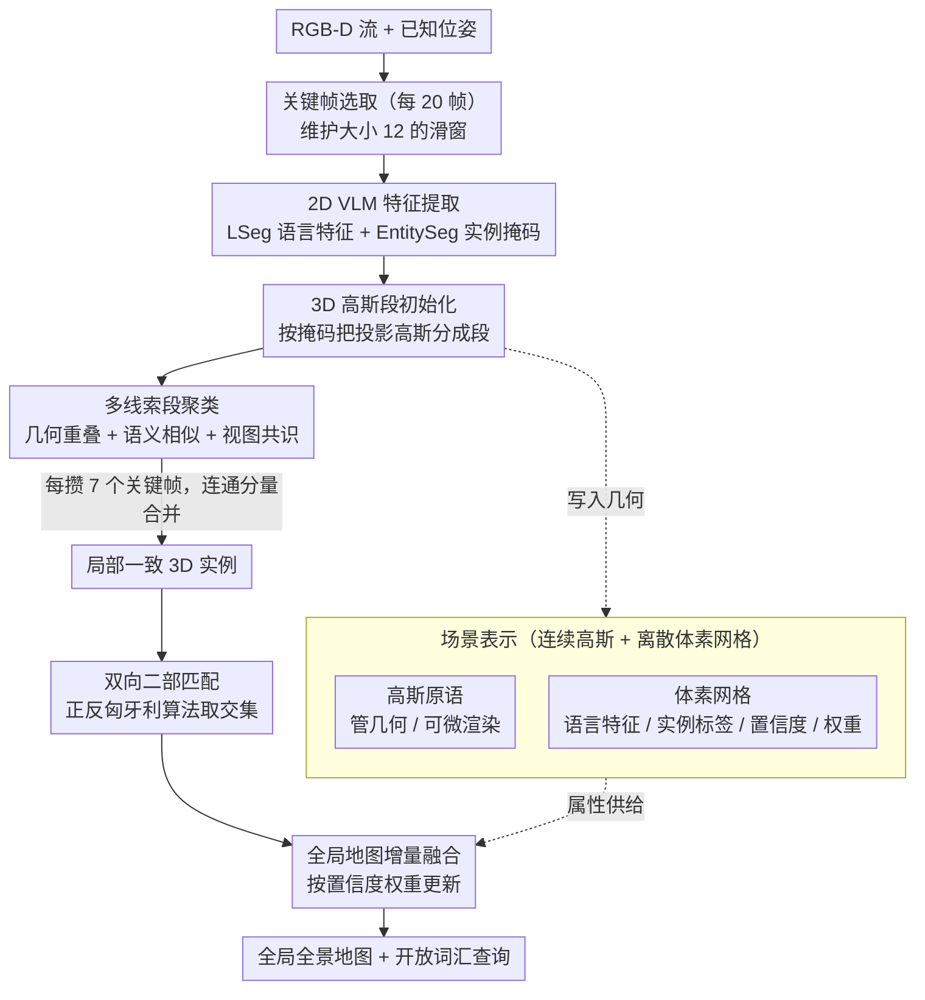

# OnlinePG: Online Open-Vocabulary Panoptic Mapping with 3D Gaussian Splatting

**会议**: CVPR 2026  
**arXiv**: [2603.18510](https://arxiv.org/abs/2603.18510)  
**机构**: 浙江大学 CAD&CG 国家重点实验室, VIVO BlueImage Lab, HKUST
**领域**: 3D视觉  
**关键词**: 全景建图, 开放词汇, 3D高斯溅射, 在线重建, 实例分割

## 一句话总结

提出 OnlinePG，首个基于 3DGS 的在线开放词汇全景建图系统，通过 local-to-global 范式——在滑窗内用多线索聚类图（几何重叠+语义相似+视图共识）构建局部一致 3D 实例，再通过双向二部匹配增量融合到全局地图——实现了在线方法中最优的语义和全景分割性能，ScanNet 上 mIoU 48.48 超越 OnlineAnySeg +17.2，且达到 10-18 FPS 实时效率。

## 研究背景与动机

**领域现状**：开放词汇 3D 场景理解是具身智能的基础。近年通过将 2D VLM（CLIP、LSeg、SAM）特征提升到 3D 空间（NeRF/3DGS），在离线设置下取得了优秀成果（LangSplat、OpenGaussian、PanoGS 等）。

**现有痛点**：
   - **(a) 离线限制**：大多数方法（PanoGS、LangSplat、OpenGaussian）需要预采集完整数据和全局优化，无法用于实时机器人任务
   - **(b) 缺乏实例级理解**：在线方法 O2V-Mapping 只有语义分割但无法区分同类不同实例
   - **(c) 2D 分割噪声**：VLM 产生的 2D 分割在多视图间不一致（过分割、欠分割），直接提升到 3D 导致噪声累积
   - **(d) 对比学习收敛慢**：离线方法（InstanceGaussian、PanoGS）依赖收敛慢的对比特征学习来聚类实例，不适合在线系统

**核心矛盾**：2D VLM 的分割结果跨视图不一致（过分割、欠分割），直接提升到 3D 导致噪声实例。如何在在线流式输入下获得 3D 一致的全景实例和语义？

**本文要解决**：(1) 在线的全景（实例+语义）建图；(2) 从噪声 2D 分割获得一致 3D 实例；(3) 开放词汇查询。

**切入角度**：先在局部（滑窗）内通过多线索聚类解决 2D 不一致问题，再增量融合到全局地图。

**核心 idea**：local-to-global 范式——滑窗内多线索段聚类 → 局部一致实例 → 双向二部匹配 → 全局一致的全景地图。

## 方法详解

### 整体框架

OnlinePG 要解决的是：在 RGB-D 流式输入下实时建一张地图，它既要有几何、又能区分出每个物体实例、还能用任意文本去查询。真正卡脖子的地方在于，2D VLM（如 LSeg、EntitySeg）给出的分割掩码跨视图天生不一致——同一把椅子在不同帧里可能被切成两块、又或和旁边的桌子粘成一团，直接把这些噪声掩码抬到 3D，错误只会越积越多。

OnlinePG 的破局思路是 local-to-global：先在一个小滑窗里把噪声压下去，再把已经干净的局部结果增量地缝进全局地图。具体地，系统每 20 帧取一个关键帧、维护大小为 12 的滑窗；每个关键帧过 VLM 拿到语言特征和实例掩码，按掩码把投影出来的 3D 高斯分成若干「段」；每攒够 7 个关键帧，就在滑窗内用一张多线索聚类图把这些段合并成局部一致的 3D 实例，再通过双向二部匹配把局部实例融进全局地图。贯穿全程的是一套双表示：几何交给连续高斯、语义和实例标签交给离散体素网格。最终产出一张 3D 高斯全景地图，配合体素网格里存的语言特征即可支持开放词汇查询。

### 关键设计

**1. 场景表示：用连续高斯管几何、用离散体素网格管语义和实例**

一个绕不开的矛盾是，3D 高斯是连续表示，适合做几何优化和可微渲染，但并不适合稳定地存储「这块属于第几号实例」这种离散标签——一旦标签也跟着梯度漂移，实例边界就糊了。OnlinePG 干脆把两件事分开：几何交给高斯，语义和实例交给一套独立的体素网格，二者各取所长。

几何侧，每个高斯原语 $\mathcal{G}_i := \{\boldsymbol{\mu}_i, \boldsymbol{\Sigma}_i, \sigma_i, \boldsymbol{c}_i\}$ 由位置 $\boldsymbol{\mu}_i \in \mathbb{R}^3$、协方差 $\boldsymbol{\Sigma}_i \in \mathbb{R}^{3 \times 3}$、不透明度 $\sigma_i$、颜色 $\boldsymbol{c}_i \in \mathbb{R}^3$ 构成，负责重建和渲染。语义侧，则对重建区域做 3cm 体素化，每个占据体素挂四个属性——它们不进入梯度优化，而是随着新观测以离散方式增量更新，这样实例标签既能稳定累积、又能被后续融合机制改写：

| 属性 | 符号 | 维度 | 用途 |
|------|------|------|------|
| 语言特征 | $\mathcal{F}$ | $\mathbb{R}^{512}$ | 存储 VLM 语言特征，支持开放词汇查询 |
| 特征置信度 | $\mathcal{C}$ | $\mathbb{R}$ | 多视图特征加权融合的权重 |
| 实例标签 | $\mathcal{T}$ | $\mathbb{R}$ | 全景实例 ID |
| 实例权重 | $\mathcal{K}$ | $\mathbb{R}$ | 实例标签的置信度，用于全局融合决策 |

**2. 多线索段聚类：把跨视图不一致的 2D 段拧成一致的 3D 实例**

这一步正面回应整体框架里说的核心痛点：滑窗里堆着十几个关键帧投影出来的 3D 段，同一个物体被切成好几份、不同物体又可能被错并到一起。OnlinePG 不靠收敛缓慢的对比学习，而是把所有段当作图的顶点，用三种互补线索决定两段之间该不该连边、进而合并。

先把每个关键帧深度图投影出的高斯按 2D 掩码 ID 分组成段 $\mathcal{S}_i := \{\mathcal{G}_j\}_{j=1}$，滑窗内所有段记为 $\mathcal{S} := \{\mathcal{S}_1, \cdots, \mathcal{S}_n\}$（$n = \sum_{i \in \mathcal{W}} |m_i|$）。两段之间的边由三种线索共同决定。**几何重叠** $\mathcal{O}$ 把段体素化后算双向可见体素重叠比的对称平均，其中 $\text{Cont.}(\mathcal{S}_i, \mathcal{S}_j)$ 是把 $\mathcal{S}_j$ 投回 $\mathcal{S}_i$ 视点时可见体素被包含的比率，取双向平均是为了避免大小悬殊的段被偏向：

$$\mathcal{O}(\mathcal{S}_i, \mathcal{S}_j) = \frac{1}{2} \cdot \left(\frac{|\mathcal{S}_i \cap \mathcal{S}_j|}{\text{Cont.}(\mathcal{S}_i, \mathcal{S}_j)} + \frac{|\mathcal{S}_i \cap \mathcal{S}_j|}{\text{Cont.}(\mathcal{S}_j, \mathcal{S}_i)}\right)$$

**语义相似** $\mathcal{X}$ 按 2D 掩码对 LSeg 特征图做平均池化得到段级语言特征 $z_i = \Phi(\{f(u,v): m(u,v) = i\})$，再算余弦相似度；**视图共识** $\mathcal{V}$ 则看两段在共同可见的关键帧里被标成同一实例的比例：

$$\mathcal{X}(\mathcal{S}_i, \mathcal{S}_j) = \frac{z_i \cdot z_j}{\|z_i\| \cdot \|z_j\|}, \qquad \mathcal{V}(\mathcal{S}_i, \mathcal{S}_j) = \frac{N_{\text{supp}}(\mathcal{S}_i, \mathcal{S}_j)}{N_{\text{vis}}(\mathcal{S}_i, \mathcal{S}_j)}$$

之所以非要三条线索，是因为任何单一线索都有盲区：几何重叠分不清同一位置堆叠的不同语义物体，语义相似分不清同类的多个实例（如并排的两个枕头），视图共识在观测稀疏时又不可靠。最终的合并判据用「或」把它们接起来——几何加语义足够高、**或**视图共识足够高，就连边——这样不同难度的场景都能命中至少一条可靠线索：

$$\Delta_{ij} = \left((\mathcal{O}_{ij} + \mathcal{X}_{ij}) > \lambda_1\right) \cup \left(\mathcal{V}_{ij} > \lambda_2\right)$$

其中 $\lambda_1 = 1.5$、$\lambda_2 = 0.8$，最后跑一遍连通分量算法 $\mathcal{I} = \text{Cluster}(\{\mathcal{S}_i\}, \{\mathcal{E}_{ij}\})$ 即得到局部一致实例。这套图聚类处理一个 12 帧窗口只需约 350ms，比单线索方案高出 8–18 个 PRQ 点，额外延迟却只有约 40ms。

**3. 双向二部匹配：把局部实例鲁棒地缝进全局地图**

局部干净了还不够——滑窗每滑动一次，都要把这批局部实例并进已经积累的全局地图，且不能把同一物体记成两个、也不能把两个物体错并成一个。难点在于局部地图大多是新探索区域、全局地图是历史区域，二者的几何包含关系天然不对称，单向匹配很容易被这种不对称带偏。

OnlinePG 的做法是同时算两个方向的匹配矩阵。正向矩阵 $\mathcal{M}_{l \to g} \in \mathbb{R}^{n_l \times n_g}$ 把语义余弦相似和几何包含比相加，反向矩阵 $\mathcal{M}_{g \to l} \in \mathbb{R}^{n_g \times n_l}$ 则把几何包含的方向翻过来：

$$\mathcal{M}_{l \to g} = \frac{z_l \cdot z_g}{\|z_l\| \cdot \|z_g\|} + \frac{|\mathcal{I}_l \cap \mathcal{I}_g|}{\text{Cont.}(\mathcal{I}_l, \mathcal{I}_g)}$$

两个方向各跑一次匈牙利算法，只保留两边都认可的匹配——一对实例必须正反方向都被指派到一起才算确认，从而过滤掉单向看着像、实则不对称的伪匹配：

$$\mathcal{A} = \text{Hung.}(\mathcal{M}_{l \to g}) \cap \text{Hung.}(\mathcal{M}_{g \to l})^T$$

确认匹配后再更新全局地图，关键是一套基于置信度权重的博弈规则，让高置信度的分割逐步顶替低置信度的：语言特征按置信度加权平均 $\mathcal{F}_g^t(v) = \frac{\mathcal{C}_l^t \cdot \mathcal{F}_l^t + \mathcal{C}_g^{t-1} \cdot \mathcal{F}_g^{t-1}}{\mathcal{C}_g^t}$；已匹配实例保留全局标签并累加权重 $\mathcal{K}_g^t = \mathcal{K}_g^{t-1} + \mathcal{K}_l^t$；未匹配但局部权重不超过全局的，保留全局标签、扣减权重 $\mathcal{K}_g^t = \mathcal{K}_g^{t-1} - \mathcal{K}_l^t$；未匹配且局部权重反超全局的，则直接换成局部标签 $\mathcal{T}_g^t = \mathcal{T}_l^t$、以差额作为新权重。

### 损失函数

3DGS 优化采用外观和几何 L1 损失的加权组合：

$$\mathcal{L} = \alpha \cdot \mathcal{L}_c + (1-\alpha) \cdot \mathcal{L}_d, \quad \alpha = 0.9$$

每次新增关键帧，随机选 5 个历史帧做 20 次优化迭代。语义/实例信息不参与梯度优化，通过体素网格的离散更新机制维护。

## 实验关键数据

### 主实验（3D 语义和全景分割）

| 方法 | 在线 | 全景 | ScanNet mIoU↑ | ScanNet mAcc↑ | ScanNet PRQ(T)↑ | ScanNet PRQ(S)↑ | Replica mIoU↑ | Replica PRQ(T)↑ | Replica PRQ(S)↑ |
|------|:----:|:----:|:---:|:---:|:---:|:---:|:---:|:---:|:---:|
| LangSplat* | ✗ | ✗ | 29.47 | 45.29 | 22.57 | 28.44 | 4.82 | 8.29 | 1.28 |
| OpenGaussian* | ✗ | ✗ | 24.89 | 37.35 | 22.87 | 19.71 | – | – | – |
| OpenScene* | ✗ | ✗ | 47.63 | 69.74 | 43.53 | 40.43 | 49.03 | 33.04 | 11.84 |
| InstanceGaussian | ✗ | ✓ | 34.14 | 54.95 | 39.04 | 27.41 | – | – | – |
| PanoGS | ✗ | ✓ | 50.72 | 70.20 | 33.84 | 36.22 | 54.98 | 43.04 | 30.60 |
| O2V-Mapping | ✓ | ✗ | 33.74 | 55.52 | – | – | 24.35 | – | – |
| OnlineAnySeg | ✓ | ✓ | 31.28 | 52.20 | 35.98 | 26.27 | 37.48 | 34.19 | 9.13 |
| **OnlinePG (Ours)** | **✓** | **✓** | **48.48** | **66.01** | **37.97** | **41.81** | **47.93** | **41.02** | **12.83** |

\* 标灰方法使用监督式 3D 实例分割辅助计算 PRQ

### 消融实验一：匹配策略（ScanNet）

| 匹配策略 | PRQ(T) | PRQ(S) |
|----------|:------:|:------:|
| #1 最近邻匹配 | 24.67 | 22.98 |
| #2 仅正向匹配 $\mathcal{M}_{l \to g}$ | 35.83 | 38.40 |
| #3 仅反向匹配 $\mathcal{M}_{g \to l}$ | 33.71 | 42.72 |
| **#4 双向二部匹配（完整）** | **37.97** | **41.81** |

### 消融实验二：系统组件（ScanNet）

| 设置 | mIoU | PRQ(T) | PRQ(S) |
|------|:----:|:------:|:------:|
| #1 无段聚类（直接融合关键帧段） | 48.48 | 32.25 | 30.68 |
| #2 无特征网格（仅实例级粗特征） | 30.40 | 26.71 | 24.92 |
| **#3 完整系统** | **48.48** | **37.97** | **41.81** |

### 关键发现

- **在线方法全面最优**：mIoU 比 OnlineAnySeg 高 **+17.2**（ScanNet）、**+10.5**（Replica）
- **全景分割大幅领先**：PRQ(S) 比 OnlineAnySeg 高 **+15.5**（ScanNet），Stuff 分割提升显著
- **接近甚至超越离线 SOTA**：与 PanoGS mIoU 差距仅 2.24，PRQ(S) 上超越（41.81 vs 36.22）
- **段聚类关键**：去掉后 PRQ(S) 下降 11.13，对大面积 Stuff 区域一致性至关重要
- **特征网格关键**：去掉后 mIoU 暴跌 18.08，实例级粗特征导致严重语义漂移
- **双向匹配 vs 最近邻**：PRQ 提升 +13.3/+18.8，反向验证对 Stuff 尤其重要（+4.3）
- **多线索聚类**：比单线索提升 8-18 PRQ，额外延迟仅 ~40ms
- **实时性能**：简单场景 18 FPS，复杂场景 10 FPS（不含 VLM 前端）
- **开放词汇优势**：对长尾概念（"bag"）和同语义多实例（"pillow"×N）查询准确率远超 OnlineAnySeg

## 亮点与创新

1. **首个在线全景+开放词汇的 3DGS 系统**：统一了几何重建、实例分割、开放词汇理解三个能力
2. **Local-to-Global 范式**：先在滑窗内解决 2D 不一致（小规模、可控），再只做匹配增量融合（轻量、鲁棒），将困难的全局问题分解为可控的两步
3. **多线索聚类图**：几何+语义+视图共识三线索互补，仅 350ms 处理 12 帧窗口
4. **双向二部匹配**：正反两方向匈牙利算法取交集，比单向更鲁棒，优雅处理局部/全局地图的非对称性
5. **体素空间属性与高斯互补**：高斯做连续渲染优化，体素做离散语义/实例更新——各取所长
6. **在线方法中大幅领先**：mIoU 和 PRQ 均显著超越 OnlineAnySeg 和 O2V-Mapping，部分指标超越离线 PanoGS

## 局限性

1. **不支持动态物体**：仅处理静态场景，动态目标会导致错误重建
2. **依赖深度和位姿输入**：需要 RGB-D 和已知相机位姿，限制了纯 RGB 场景的应用
3. **VLM 前端速度未计入**：10-18 FPS 不含 LSeg 和 EntitySeg 的推理时间，完整系统实时性受前端瓶颈限制
4. **室内场景为主**：仅在 ScanNetV2 和 Replica 室内数据集验证，缺少室外大场景评估
5. **超参数固定**：$\lambda_1$、$\lambda_2$、体素大小、聚类频率等为手动设定，自适应调整可更高效

## 评分

| 维度 | 分数 |
|------|:----:|
| 新颖性 | ⭐⭐⭐⭐ |
| 技术深度 | ⭐⭐⭐⭐ |
| 实验充分性 | ⭐⭐⭐⭐⭐ |
| 写作质量 | ⭐⭐⭐⭐ |
| 实用价值 | ⭐⭐⭐⭐⭐ |

<!-- RELATED:START -->

## 相关论文

- [\[CVPR 2026\] EmbodiedSplat: Online Feed-Forward Semantic 3DGS for Open-Vocabulary 3D Scene Understanding](embodiedsplat_online_feed-forward_semantic_3dgs_for_open-vocabulary_3d_scene_und.md)
- [\[CVPR 2026\] ExtrinSplat: Decoupling Geometry and Semantics for Open-Vocabulary Understanding in 3D Gaussian Splatting](extrinsplat_decoupling_geometry_and_semantics_for_open-vocabulary_understanding_.md)
- [\[CVPR 2026\] LightSplat: Fast and Memory-Efficient Open-Vocabulary 3D Scene Understanding in Five Seconds](lightsplat_fast_and_memory-efficient_open-vocabulary_3d_scene_understanding_in_f.md)
- [\[CVPR 2026\] JOPP-3D: Joint Open Vocabulary Semantic Segmentation on Point Clouds and Panoramas](jopp3d_joint_open_vocabulary_semantic_segmentation.md)
- [\[NeurIPS 2025\] Segment then Splat: Unified 3D Open-Vocabulary Segmentation via Gaussian Splatting](../../NeurIPS2025/3d_vision/segment_then_splat_unified_3d_open-vocabulary_segmentation_via_gaussian_splattin.md)

<!-- RELATED:END -->
