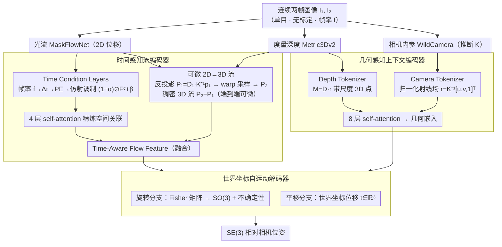

<!-- 由 src/gen_stubs.py 自动生成 -->
# OpenVO: Open-World Visual Odometry with Temporal Dynamics Awareness

**会议**: CVPR2026  
**arXiv**: [2602.19035](https://arxiv.org/abs/2602.19035)  
**代码**: [openvo.github.io](https://openvo.github.io/)  
**领域**: 3D视觉  
**关键词**: 视觉里程计, 时间动态感知, 无标定相机, 3D流场, 自动驾驶

## 一句话总结

提出 OpenVO，一个面向开放世界的单目视觉里程计框架，通过时间感知流编码器和几何感知上下文编码器，在无相机标定、帧率变化的条件下实现鲁棒的真实尺度自车运动估计，跨数据集 ATE 提升超 20%，变帧率场景误差降低 46%-92%。

## 背景与动机

1. **行车记录仪数据丰富但难以利用**：YouTube 等平台的行车记录仪视频包含大量罕见驾驶事件（如碰撞），是构建轨迹数据集的宝贵资源，但这些视频通常是单目、无标定的，相机参数和帧率差异极大
2. **现有 VO 方法假设固定帧率**：TartanVO、XVO、ZeroVO 等方法在固定帧率（如 10Hz、12Hz）上训练和评估，完全忽略时间动态信息，导致帧率不匹配时性能严重下降
3. **经典方法依赖相机标定**：ORB-SLAM、DSO 等几何方法需要已知相机内参，无法处理无标定的开放世界观测
4. **学习方法泛化能力有限**：早期学习方法在相似条件下训练和测试，缺乏对不同相机几何的显式建模，跨域性能差
5. **时间过拟合问题被忽视**：强化学习和世界模型领域已证明固定采样率训练会导致时间过拟合，但 VO 领域几乎未探索这一问题
6. **尺度一致性难题**：单目 VO 天生存在尺度模糊，仅靠外观信息无法恢复真实世界尺度，需要引入几何先验

## 方法详解

### 整体框架

OpenVO 要解决的是开放世界行车视频（单目、无标定、帧率各异）下的真实尺度自车运动估计。它采用两帧位姿回归架构：输入连续两帧图像，输出 SE(3) 相对相机位姿。整条管线先由时间感知流编码器把"当前帧率"显式注入光流、并在其内部用可微 2D→3D 流把光流抬到带尺度的 3D 运动场，再由几何感知上下文编码器从推断的相机内参和度量深度里提取尺度先验，最后交给世界坐标自运动解码器回归旋转和平移。三大模块串起来，让网络既知道"两帧之间隔了多久"，又知道"场景的真实尺度"。

### 关键设计

**1. 时间感知流编码器：把帧率写进光流特征，治时间过拟合**

针对"现有 VO 假设固定帧率、换帧率就崩"的痛点，核心是一组 Time Condition Layers：把帧率 $f$ 换算成时间间隔 $\Delta t = 1/f$，用正弦位置编码展开成高维嵌入 $\text{PE}(\Delta t)$，再经两个线性层生成一对仿射参数 $\alpha, \beta$ 去调制光流相关特征

$$\tilde{F^c} = (1 + \alpha) \odot F^c + \beta$$

调制后的特征再过 4 层 self-attention 精炼空间关联。这样网络在推理运动结构时始终"知道当前帧率"，而不是把某个固定帧率下的运动幅度死记硬背，从根上避开了时间过拟合。

**2. 可微 2D→3D 流：把光流和深度拼成端到端可训练的运动场**

光流（MaskFlowNet）只给出像素级 2D 位移、缺尺度；OpenVO 用度量深度（Metric3Dv2）把它抬到 3D：先按透视反投影把像素变成 3D 点 $P_1 = D_1 \cdot K^{-1} p_1$，再用光流把像素 warp 到第二帧的子像素位置、双线性采样深度后反投影得到 $P_2$，作差得到稠密 3D 流 $(P_2 - P_1)$。整个过程完全可微、可端到端训练，3D 流再过 4 层 self-attention 后与时间调制光流特征融合成 Time-Aware Flow Feature。消融显示可微版本把 KITTI ATE 从 109.01 降到 93.23，比非可微拼接的轨迹更一致。

**3. 几何感知上下文编码器：无标定也能恢复真实尺度**

开放世界视频没有相机内参、单目又天生尺度模糊。这里用 WildCamera 推断内参 $K$，构建归一化射线场 $r(u,v) = K^{-1}[u,v,1]^\top$ 编码每个像素的 3D 观察方向（Camera Tokenizer）；再用 Metric3Dv2 的度量深度 $D$ 把射线乘上深度 $M(u,v) = D(u,v) \cdot r(u,v)$，得到带真实尺度的 3D 点分布（Depth Tokenizer）。把 $[r, M, D]$ 拼成 token 送入 8 层 self-attention，产出统一的几何嵌入——尺度信息就这样从 foundation model 先验里被显式带进来，而不依赖任何标定。

**4. 世界坐标自运动解码器：分开建模旋转不确定性与度量平移**

拼接 Time-Aware Flow Feature 和几何嵌入后，用两个 MLP 分支分别回归：旋转分支预测 Fisher 矩阵 $\mathcal{F} \in \mathbb{R}^{3\times3}$，经 Matrix Fisher 分布映射到 SO(3)，顺带建模方向的不确定性；平移分支直接回归世界坐标位移 $t_i \in \mathbb{R}^3$。把两者解耦，避免旋转噪声污染度量平移的尺度恢复。

### 损失函数 / 训练策略

**多时间尺度训练**是泛化到未见帧率的关键：对原始帧率 $f_0$ 的视频按因子 $k$ 跳帧，合成 $f_0/k$ 的训练样本（如 12Hz → 6Hz/4Hz），把模型暴露在多种时间尺度下；配合时间条件层，模型学到的是"帧率→运动幅度"的映射而非固定常数。训练用梯度裁剪保持稳定。消融里 \{12/6/4\} Hz 组合最优，去掉 Time Condition Layers 后 KITTI ATE 从 93.23 飙到 152.42（+64%），印证显式时间感知不可或缺。

## 实验关键数据

### 跨数据集泛化（仅在 nuScenes Singapore-OneNorth 上训练）

| 方法 | KITTI ATE | nuScenes ATE | Argoverse2 ATE |
|------|-----------|-------------|-----------------|
| TartanVO | 103.07 | 6.26 | 7.03 |
| ZeroVO‡ | 123.42 | 8.40 | 5.71 |
| XVO | 168.43 | 8.30 | 5.70 |
| **OpenVO✓** | **93.23** | **5.91** | **2.39** |

OpenVO 在 KITTI ATE 上较 ZeroVO‡ 提升 24%，在 Argoverse2 上提升 58%。

### 变帧率鲁棒性（Tab.4 选摘）

| 设定 | OpenVO ATE | ZeroVO‡ ATE | 改进 |
|------|-----------|-------------|------|
| KITTI 2.5Hz | 368.47 | 553.52 | -33% |
| nuScenes 6Hz | 6.07 | 21.55 | -72% |
| Argoverse2 20Hz | 6.47 | 36.14 | -82% |

在所有变帧率设置中，OpenVO 将误差降低 46%-92%。

### 消融实验

- **时间编码维度**：$K=8$（PE 维度 17）效果最佳，过小欠拟合时间变化，过大引入高频振荡
- **训练频率组合**：\{12/6/4\} Hz 最优；去掉 Time Condition Layers 后 KITTI ATE 从 93.23 升至 152.42（+64%），证明显式时间感知的必要性
- **可微 vs 不可微 3D 流**：可微版本在 KITTI ATE 上从 109.01 降至 93.23，提供更一致的轨迹预测

## 亮点

- **首次在 VO 中建模时间动态**：通过正弦位置编码+仿射调制将帧率信息注入光流特征，简洁有效地解决了时间过拟合问题
- **完全可微的 2D→3D 流构建**：将 2D 光流、度量深度、推断内参统一在端到端可微管线中，比非可微版本显著更优
- **无需标定的开放世界 VO**：结合 WildCamera 和 Metric3Dv2 的 foundation model 先验，在无真实内参条件下实现度量尺度恢复
- **多时间尺度训练策略**：通过跳帧增强暴露模型于多种帧率，配合时间条件层实现对未见帧率的强泛化
- **变帧率场景压倒性优势**：相比 ZeroVO，在变帧率测试中误差降低最高 92%，实用价值突出

## 局限与展望

- **深度估计和内参推断独立运行**：Metric3Dv2 和 WildCamera 各自推断，误差可能级联传播到最终 VO 结果，缺乏联合优化
- **多时间尺度设置为经验性选择**：\{12/6/4\} Hz 的训练频率组合是手动设定的，自适应采样策略可能更优
- **混合频率训练引入不一致梯度**：在 KITTI 上局部轨迹段误差（$t_{err}$, $r_{err}$）略高于部分基线，因多频率训练导致参数更新不一致
- **训练成本较高**：96 GPU 小时（A6000），对资源受限的场景不友好
- **未验证极端场景**：如极低帧率（<2Hz）、严重遮挡、动态场景密集的情况

## 与相关工作的对比

| 方法 | 需要标定 | 时间感知 | 3D 几何先验 | 额外数据 |
|------|---------|---------|------------|---------|
| ORB-SLAM3 | ✓ | ✗ | ✗ | ✗ |
| TartanVO | ✓(GT内参) | ✗ | ✗ | ✗ |
| XVO | ✗ | ✗ | ✗ | YouTube 伪标签 |
| ZeroVO | ✗ | ✗ | ✓(3D流+语言) | YouTube+文本 |
| **OpenVO** | **✗** | **✓** | **✓(可微3D流)** | **✗** |

OpenVO 是唯一同时具备时间动态感知和几何先验、且不依赖额外数据的无标定 VO 方法。

## 评分

- 新颖性: ⭐⭐⭐⭐ — 首次将时间动态感知引入 VO，Time Condition Layers 的仿射调制设计简洁优雅；可微 2D→3D 流也是有意义的贡献
- 实验充分度: ⭐⭐⭐⭐ — 三大自动驾驶基准、标准帧率+变帧率评估、完整消融，覆盖面广；但缺少更极端帧率和其他传感器类型的测试
- 写作质量: ⭐⭐⭐⭐ — 动机清晰、方法叙述流畅、图表丰富，问题定义明确
- 价值: ⭐⭐⭐⭐ — 解决了开放世界行车视频轨迹重建的实际痛点，对自动驾驶数据采集和 YouTube 规模视频分析有直接应用价值

<!-- RELATED:START -->

## 相关论文

- [\[CVPR 2026\] RayNova: Scale-Temporal Autoregressive World Modeling in Ray Space](raynova_scale-temporal_autoregressive_world_modeling_in_ray_space.md)
- [\[CVPR 2026\] Learning a Particle Dynamics Model with Real-world Videos](learning_a_particle_dynamics_model_with_real-world_videos.md)
- [\[CVPR 2026\] Towards Visual Query Localization in the 3D World](towards_visual_query_localization_in_the_3d_world.md)
- [\[CVPR 2026\] Wanderland: Geometrically Grounded Simulation for Open-World Embodied AI](wanderland_geometrically_grounded_simulation_for_open-world_embodied_ai.md)
- [\[ICCV 2025\] Ross3D: Reconstructive Visual Instruction Tuning with 3D-Awareness](../../ICCV2025/3d_vision/ross3d_reconstructive_visual_instruction_tuning_with_3d-awareness.md)

<!-- RELATED:END -->
