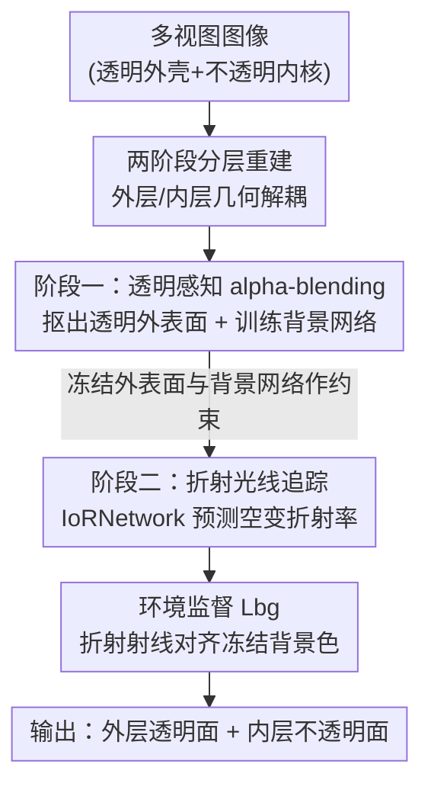

# Opti-NeuS: Neural Reconstruction for Dual-Layered Transparent and Opaque Objects

**会议**: CVPR 2026  
**论文**: [CVF Open Access](https://openaccess.thecvf.com/content/CVPR2026/html/Yang_Opti-NeuS_Neural_Reconstruction_for_Dual-Layered_Transparent_and_Opaque_Objects_CVPR_2026_paper.html)  
**代码**: 无  
**领域**: 3D视觉  
**关键词**: 透明物体重建, 神经隐式曲面, 折射光线追踪, SDF, 多视图重建

## 一句话总结
Opti-NeuS 用「两阶段分层重建 + 可学习的折射率网络（IoRNetwork）」在无受控环境、无额外输入的条件下，把一个既有透明外壳又有不透明内核的双层物体拆成外层透明面和内层不透明面分别重建，先抑制折射重建外表面、再用 Snell 定律追踪折射光线重建内部，Chamfer Distance 比 Alpha-NeuS / NeTO / NU-NeRF 等都更低。

## 研究背景与动机
**领域现状**：多视图 3D 重建在不透明物体上已经被 NeRF、NeuS、3D Gaussian Splatting 等做得很成熟——它们都默认光沿直线传播，用体渲染或显式 splatting 把多视角图像反推成几何。

**现有痛点**：这套假设一旦碰到透明物体就崩了。透明面会发生**折射**，光线在界面处大幅弯折，导致像素射线偏离真实位置、不同折射射线互相无法区分，重建变成高度病态问题；图像里透明面的外观还会随视角剧烈变化。为了拿到先验、简化折射建模，已有透明重建方法（NeTO、ReNeuS、NEMTO 等）普遍依赖特殊采集设备或受控环境，还需要额外输入（mask、光照、IoR、外层几何），实用性受限。

**核心矛盾**：更关键的是，现有方法几乎都只能处理**纯透明**或**纯不透明**单一材质，缺乏「透明感知」的分离能力——一个外面是玻璃球、里面装着不透明小物件的**双层场景**，外层折射会扭曲内层几何，两层边界模糊，无法各自干净地重建出来。

**本文目标**：在不依赖受控环境和额外输入的前提下，同时重建一个物体的透明外层和不透明内层，并且把外层折射造成的视觉畸变正确建模出来。

**切入角度**：作者注意到，外层折射对内层几何的污染是「自上而下」的——只要先把外表面单独立住、冻结它提供的背景信息，再回过头用真实折射光线去约束内层，就能把两层解耦。于是把重建拆成**串行两阶段**，并为每一阶段配一个专门的机制：阶段一负责把透明面从「SDF 不一定为零」的尴尬里提取出来，阶段二负责让折射射线指向正确的背景颜色。

**核心 idea**：用「透明感知阈值的 alpha-blending」抠出透明外壳，再用「可学习空变折射率的折射光线追踪」沿 Snell 定律重建内核，两阶段顺序优化、几何上互相解耦。

## 方法详解

### 整体框架
Opti-NeuS 的输入是一个双层（透明外壳 + 不透明内核）场景的多视图图像，输出是分离开的外层透明曲面和内层不透明曲面。整条管线建立在 NeuS 的神经隐式曲面之上（用 SDF 的零等值面表示几何，靠体渲染优化），但把重建切成两个**串行**阶段，让外层折射不再干扰内层。

阶段一（外层透明重建）：先**压制折射**，用带「透明感知阈值」的 alpha-blending 把透明外表面提取出来，建立不受复杂光线干扰的基础几何，并训练出一个背景网络 $F_{bg}$。阶段二（内层不透明重建）：把阶段一的外表面当作几何约束，**冻结**背景网络，用 IoRNetwork 预测空变折射率、按 Snell 定律追踪折射光线，让折射后射线打到的颜色去匹配冻结背景，从而把内层不透明 SDF 重建出来。

### 关键设计

**1. 两阶段分层重建：把外层折射对内层的污染从源头切断**

针对「外层折射会扭曲内层几何、两层边界模糊」这个核心矛盾，作者不去一次性联合优化两层，而是把重建拆成顺序执行的两阶段，在**光学上和空间上同时解耦**。阶段一只关心外层透明 SDF，刻意抑制折射、不让复杂光线进来捣乱，先把外壳几何立稳，并顺带训练出一个背景网络。阶段二在外层几何已知、背景网络冻结的前提下，才去训练内层不透明 SDF——此时外表面是一个可靠的「折射界面」，内层优化被聚焦在外壳内部。这样做的好处是：外层提供的几何约束和背景监督都是固定的，内层训练不会反过来把外层带歪；相比那些把透明/不透明混在一个场里联合优化的方法，两层各自的 SDF 都更干净。基础几何建立在 NeuS 的隐式曲面上，零等值面定义为 $S=\{\mathbf{x}\in\mathbb{R}^3 \mid f(\mathbf{x})=0\}$，体渲染沿相机射线 $p(t)=\mathbf{o}+\boldsymbol{\omega} t$ 积分颜色 $C=\int_0^{+\infty} w(t)\,c(p(t),\mathbf{v})\,dt$，离散化为 $\hat{C}=\sum_i T_i\alpha_i c_i$。

**2. 透明感知阈值的 alpha-blending：让「SDF 不为零」的透明面也能被抠出来**

这是阶段一的核心。问题在于：透明物体允许光穿过，表面处的 $\Delta\Phi_s$ 和不透明度 $\alpha$ 本身就极小，颜色贡献微弱，常规体渲染根本分不清「真透明面」和「空气」。NeuS 的离散 alpha 为 $\alpha_i=\max\!\left(\frac{\Phi_s(f(p(t_i)))-\Phi_s(f(p(t_{i+1})))}{\Phi_s(f(p(t_i)))},\,0\right)$，其中 $\Phi_s(x)=(1+e^{-sx})^{-1}$ 是 logistic 分布的 CDF。Alpha-NeuS 已证明透明面对应的不是零等值面、而是 SDF 的**局部非负极小值**，并借 HF-NeuS 的 Beer-Lambert 衰减把透明/不透明统一为 $\alpha=1-T(t)=1-\exp(-\rho(t)z(t))$、$\rho(t)=s(1-\Phi_s)\cos\theta$——不透明区（$\Phi_s\approx0.5$）在零等值面出强响应，透明区（$\Phi_s\approx1$）在 SDF 局部极小处被指数放大。但 Alpha-NeuS 仍依赖**固定**的 iso 阈值，当 SDF 在不同场景里取值不可预测时就会失效。

Opti-NeuS 的改法是把阈值变成**自适应**的：既然区分「局部非负极小」与「零等值面」的关键在于 SDF 沿光线的二阶导，作者从渲染权重的曲率出发 $w''(t)=-s\,f''(t)\,\Phi_s'(f(t))\,T(t)$（局部非负极小处 $f''(t)>0$，零等值面处 $f''(t)\approx0$），再用峰值归一化得到一个「锐度」度量 $\mathcal{S}(f)=\frac{w''(t)}{w_{\max}(t)}=\frac{2s\,e^{-sf}}{(1+e^{-sf})^2}\cdot f''$，最后由它给出自适应不透明度 $\alpha(f)=\frac{1}{1+e^{-\mathcal{S}(f)/s}}$。阶段一用这个 Eq.(10) 的自适应 alpha、阶段二用 Eq.(6) 的 Beer-Lambert alpha，于是透明面在阶段一获得**增强的感知**、对最终外观贡献变大，从而能被稳定提取，而不必为每个场景手调 iso 阈值。⚠️ 上述曲率/锐度公式的严格推导原文放在补充材料，细节以原文为准。

**3. 带 IoRNetwork 的折射光线追踪：用可学习的空变折射率把内层「掰正」**

阶段二要解决「内层因折射而偏离真实位置」的视觉畸变。光在不同折射率界面处弯折，所以重建内层必须先算对折射光线路径，而这需要两个量：交点处的法向（取 $\nabla\text{SDF}$）和折射率 IoR。折射方向由 Snell 定律给出：$\eta_{\text{prev}}\sin\theta_{\text{prev}}=\eta_{\text{next}}\sin\theta_{\text{next}}$，折射后方向 $\mathbf{d}_{\text{next}}=\frac{\eta_{\text{prev}}}{\eta_{\text{next}}}\mathbf{d}_{\text{prev}}+\left(\frac{\eta_{\text{prev}}}{\eta_{\text{next}}}\cos\theta_{\text{prev}}-\cos\theta_{\text{next}}\right)\mathbf{n}_{\text{prev}}$，把每个界面的折射段拼起来就得到完整光路 $p^{(k)}=\sum_i \mathbf{o}_i^{(k)}+z_i^{(k)}\mathbf{d}_i^{(k)}$。

关键创新是折射率不再当成已知常数，而是由一个名为 **IoRNetwork** 的 MLP $g_r(x,y,z)\to(\eta,\mathbf{d}_r)$ 预测**空变** IoR：3D 坐标经位置编码升到 39 维，过若干全连接层（含 skip connection），最后输出 $\eta$ 和折射方向。由于没有 IoR 的真值监督，IoRNetwork 完全靠阶段一冻结的背景网络来约束（见设计 4）。为保证物理合理、避免相邻点 IoR 突变，还加了一致性损失 $\mathcal{L}_{\text{consist}}=\frac{\sum_{i,j} w_{ij}\,|\eta_i-\eta_j|}{\sum_{i,j} w_{ij}}$，其中权重 $w_{ij}=\exp(-\|\mathbf{p}_i-\mathbf{p}_j\|^2/2\rho^2)\cdot\frac{1+\cos(f_i,f_j)}{2}$ 把空间邻近度和特征相似度结合起来，让折射率随空间平滑变化。这一设计直接对应论文摘要里强调的 spatially-varying IoR——比起假设全局单一折射率的方法，它能刻画物体内部折射率的非均匀分布。

**4. 环境监督损失 $\mathcal{L}_{bg}$：用冻结背景给折射率一个强梯度信号**

IoRNetwork 既然没有 IoR 真值，怎么知道自己预测得对不对？作者的答案是：让折射后的光线去「对答案」。阶段一训出的背景网络 $F_{bg}$ 在阶段二被**冻结**，作为环境监督。物理直觉是——给定外表面，只有**正确的 IoR** 才能把光线折射到真实的背景颜色上；IoR 错了，射线就会指向错误背景，产生巨大渲染惩罚。形式化为 $\mathcal{L}_{bg}=\|C_{bg}(\mathbf{p}_{\text{out}},\mathbf{d}_{\text{exit}})-F_{bg}(\mathbf{p}_{\text{out}},\mathbf{d}_{\text{exit}})\|_2^2$，其中 $C_{bg}$ 是按预测 IoR 追踪出的射线在出射点处取到的背景色，$F_{bg}$ 是冻结背景网络给出的参考色。交点计算上，作者用最大包围盒算法从阶段一提取最完整的外表面、剔除浮点、减少计算。这个损失之所以关键，是因为它把「重建内层」转成了「让折射射线打到对的背景」，给 IoRNetwork 提供了强而明确的优化方向；消融也显示，如果不用 $\mathcal{L}_{bg}$ 而是在阶段二重新训练 NeRF 学背景，会影响初始化与收敛、丢失几何细节。

### 损失函数 / 训练策略
整体按两阶段顺序优化：阶段一训练外层透明 SDF 与背景网络 $F_{bg}$（自适应 alpha-blending 提取透明面）；阶段二冻结外表面与 $F_{bg}$，以背景监督损失 $\mathcal{L}_{bg}$ 为主、配合 IoRNetwork 的一致性损失 $\mathcal{L}_{\text{consist}}$ 训练内层不透明 SDF。IoRNetwork、$\mathcal{L}_{\text{consist}}$、可学习顶点等更细致的消融原文放在补充材料。

## 实验关键数据

### 主实验
数据集为自建 + 公开混合：7 个合成场景（Blender 自建 Bunny / Spot / Monkey / Jug，加公开的 Pig / Spherepot / Snowglobe）和 6 个真实场景（Ballstatue、Realbottle、Ball、Magician-box、Toy-box、Sunglasses）。评测用 Chamfer Distance（CD）和 Earth Mover's Distance（EMD），baseline 为 NU-NeRF、Alpha-NeuS、NeTO（NeTO 仅用物体 mask 运行）。

合成数据集上整体对比（CD / EMD，单位 $\times10^{-3}$，越低越好）：

| 场景 | NeTO CD | Alpha-NeuS CD | Opti-NeuS CD | Opti-NeuS EMD |
|------|---------|---------------|--------------|---------------|
| Bunny | 2.177 | 0.792 | **0.517** | **7.572** |
| Spot | 3.320 | 2.964 | **1.854** | **3.183** |
| Monkey | 6.727 | 2.391 | **1.542** | **5.616** |
| Jug | 1.584 | 1.278 | **0.884** | **4.239** |
| Spherepot | 2.215 | 1.582 | **1.103** | **7.952** |
| Snowglobe | 6.551 | **5.630** | 6.038 | 11.87 |
| **Mean** | 3.798 | 2.314 | **1.906** | **6.140** |

平均 CD 从 Alpha-NeuS 的 2.314 降到 1.906、EMD 从 8.404 降到 6.140。唯一被反超的是带 mask 的 Snowglobe——此时 Alpha-NeuS 恰好拿到一个很精确的 iso 阈值，CD 略优于本文（5.630 vs 6.038）。

与 NU-NeRF 在外层/内层分别比较（合成场景，CD / EMD，$\times10^{-3}$）：

| 场景 | Ours 外层 CD | NU-NeRF 外层 CD | Ours 内层 CD | NU-NeRF 内层 CD |
|------|-------------|-----------------|-------------|-----------------|
| Bunny | **0.212** | 0.251 | **0.104** | 1.077 |
| Spot | **1.063** | 2.116 | **0.375** | 2.561 |
| Jug | **0.332** | 0.735 | **0.432** | 2.306 |
| **Mean** | **0.536** | 1.034 | **0.304** | 1.981 |

内层重建优势尤其明显（平均 CD 0.304 vs NU-NeRF 1.981）——NU-NeRF 会把内层几何重建得扁塌、细节退化，而本文折射光线追踪能保住准确的球面轮廓和干净的内表面边界。

### 消融实验
（CD / EMD，$\times10^{-3}$，去掉某模块后的退化）

| 场景 | w/o 透明感知 alpha CD | w/o 折射光追 CD | w/o $\mathcal{L}_{bg}$ CD |
|------|----------------------|-----------------|--------------------------|
| Bunny | 156.68 | 113.25 | 10.45 |
| Spot | 32.28 | 65.22 | 13.38 |
| Jug | 21.15 | 184.28 | 12.35 |
| Spherepot | 149.85 | 342.95 | 91.68 |
| **Mean** | 89.99 | 176.43 | 31.97 |

对照完整模型平均 CD 仅 1.906，三个模块去掉任意一个都会让误差暴涨一到两个数量级。

### 关键发现
- **折射光线追踪贡献最大**：去掉后平均 CD 飙到 176.43（完整模型 1.906），因为像素无法对应到真实空间位置，内层几何严重畸变错位。这印证了「正确建模折射」是双层透明重建的命门。
- **透明感知 alpha-blending 不可或缺**：去掉后退回 NeuS 原始 alpha（Eq.4），SDF 不恒为零的透明面根本提取不出完整外壳，平均 CD 89.99。
- **$\mathcal{L}_{bg}$ 影响相对小但仍关键**：去掉后平均 CD 31.97——若改成阶段二重新训 NeRF 学背景，会破坏初始化与收敛、丢几何细节。
- **失败/退化场景**：Monkey、Spherepot 这类光要穿过外壳反复与内层交互的场景，重复折射会把细节磨平；真实场景缺乏 GT 几何，只能做定性对比。

## 亮点与洞察
- **把「重建内层」改写成「让折射射线打到对的背景」**：用阶段一冻结的背景网络作监督，使没有 IoR 真值的 IoRNetwork 也能拿到强梯度——这个「对答案」式的环境监督是很巧的自监督思路，可迁移到其他缺乏物理参数真值的逆向渲染问题。
- **空变折射率 + 一致性损失**：不再假设全局单一 IoR，而是让 MLP 预测逐点折射率、用空间+特征相似度加权约束平滑，更贴近真实非均匀介质。
- **自适应透明阈值**：用 SDF 沿光线的二阶导（曲率/锐度度量）区分「局部非负极小」和「零等值面」，把 Alpha-NeuS 的固定 iso 阈值变成自适应，解决了跨场景 SDF 取值不可预测的问题。
- **顺序解耦的工程化**：两阶段串行 + 冻结外层/背景，让内层优化不反噬外层，是处理多层/嵌套几何的一个可复用范式。

## 局限与展望
- **重复折射磨平细节**：作者承认在 Monkey、Spherepot 等光线穿外壳反复与内层交互的场景，细尺度细节会被平滑掉。
- **真实场景缺 GT**：真实数据无法获得真值几何，只能定性比较，定量优势主要在合成数据上验证。
- **带精确 mask 时未必最优**：Snowglobe 上带 mask 的 Alpha-NeuS 因拿到很准的 iso 阈值反超本文，说明在「先验充分」场景里自适应阈值的优势会被抵消。
- **依赖外层先立稳**：两阶段是串行的，阶段一外表面若重建不佳，会通过几何约束和背景监督一路污染阶段二（⚠️ 这是笔者从管线结构推断的潜在脆弱点，原文未专门讨论）。

## 相关工作与启发
- **vs Alpha-NeuS**：都把透明面对应到 SDF 局部非负极小并统一透明/不透明，但 Alpha-NeuS 用**固定** iso 阈值提取、且不能处理双层透明+不透明混合；本文用自适应锐度阈值，并通过两阶段把内外层分开重建。
- **vs NeTO**：两者都靠精确折射光线追踪，但 NeTO 需要物体 mask 等额外输入、且对光线偏差极敏感（轻微偏差就导致重建严重退化）；本文无需额外输入，且用 IoRNetwork 学空变折射率。
- **vs NU-NeRF**：NU-NeRF 同样无需额外输入、能重建内层，但内层几何扭曲、细节退化（如 Jug 里被压扁的球）；本文折射光追保住了内表面的准确轮廓与干净边界。
- **vs NeuS / NeRF / 3DGS 系**：这些方法都默认光沿直线传播，只适用于不透明物体；本文显式建模折射弯折，把神经隐式曲面扩展到透明+不透明双层场景。

## 评分
- 新颖性: ⭐⭐⭐⭐⭐ 首次在无受控环境、无额外输入下重建双层透明+不透明物体，空变 IoRNetwork + 冻结背景监督的组合很新。
- 实验充分度: ⭐⭐⭐⭐ 13 个场景、3 个 baseline、外/内层分项 + 三项消融较完整，但真实场景只能定性、部分细节消融放补充材料。
- 写作质量: ⭐⭐⭐⭐ 两阶段动机与公式推导清晰，曲率/锐度推导细节外置补充材料略影响自洽。
- 价值: ⭐⭐⭐⭐ 透明物体重建是 VR/真实感渲染的硬需求，去受控环境化与双层处理有实际应用潜力。

<!-- RELATED:START -->

## 相关论文

- [\[CVPR 2026\] 3DReflecNet: A Large-Scale Dataset for 3D Reconstruction of Reflective, Transparent, and Low-Texture Objects](3dreflecnet_a_large-scale_dataset_for_3d_reconstruction_of_reflective_transparen.md)
- [\[ECCV 2024\] PISR: Polarimetric Neural Implicit Surface Reconstruction for Textureless and Specular Objects](../../ECCV2024/3d_vision/pisr_polarimetric_neural_implicit_surface_reconstruction_for_textureless_and_spe.md)
- [\[CVPR 2026\] DuoMo: Dual Motion Diffusion for World-Space Human Reconstruction](duomo_dual_motion_diffusion_for_world-space_human_reconstruction.md)
- [\[CVPR 2026\] ManifoldNeuS: Manifold-aware View Optimizability for Pose-Free Neural Surface Reconstruction](manifoldneus_manifold-aware_view_optimizability_for_pose-free_neural_surface_rec.md)
- [\[CVPR 2026\] JRM: Joint Reconstruction Model for Multiple Objects without Alignment](jrm_joint_reconstruction_model_for_multiple_objects_without_alignment.md)

<!-- RELATED:END -->
