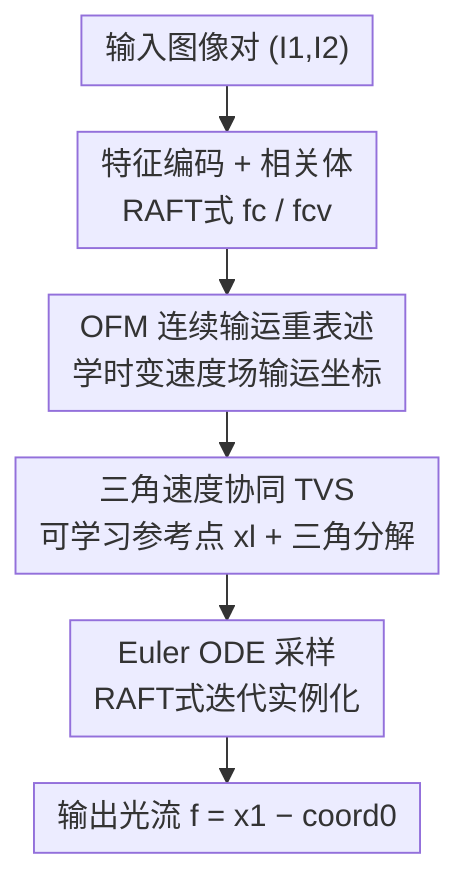

# Optical Flow Matching: Reframing Optical Flow as Continuous Transport Dynamics

**会议**: CVPR 2026  
**论文**: [CVF Open Access](https://openaccess.thecvf.com/content/CVPR2026/html/Luo_Optical_Flow_Matching_Reframing_Optical_Flow_as_Continuous_Transport_Dynamics_CVPR_2026_paper.html)  
**代码**: https://github.com/LA30/OFM （有）  
**领域**: 3D视觉 / 光流估计  
**关键词**: 光流估计, Flow Matching, 连续输运, ODE 求解, 速度场  

## 一句话总结
把光流从"两帧间离散位移回归"重新表述成"沿时间连续输运像素坐标的速度场学习"，并用一个三角速度协同（TVS）技巧把 Flow Matching 的理论目标和光流网络能用的监督信号对齐，在 Sintel / KITTI / Spring 上同时拿到 SOTA 精度和更强的跨数据集泛化。

## 研究背景与动机
**领域现状**：现代光流估计虽然换上了深度网络（PWC-Net、RAFT、GMFlow、FlowFormer 等），但骨子里仍沿用从经典视觉继承下来的"离散对应"范式——网络在两帧之间做特征匹配、回归逐像素位移，本质是"找对应点"。

**现有痛点**：这种做法只恢复了运动的**结果**（像素位移 where），却没建模运动**怎样随时间连续演化**（how）。物理世界的运动是由底层速度场支配的平滑动力学（流体力学、输运理论早有定论），离散位移回归把运动和产生它的物理过程割裂开，在遮挡、大位移、光照变化下时序一致性容易崩。

**核心矛盾**：光流网络的架构（cost volume、注意力匹配）是为"建立像素到像素对应"这个有明确物理含义的目标量身定制的；而生成式的连续输运（Flow Matching）目标量却是抽象的"速度场"，两者目标对不上——直接把 Flow Matching 套到光流上会让网络去预测"光流减高斯噪声"这种没有几何含义的量，训练高度不稳定。

**本文目标**：(1) 给光流一个物理上站得住脚的连续表述；(2) 让这套连续表述能直接用现成光流真值 $f_{gt}$ 监督、无缝塞进 RAFT 系架构。

**切入角度**：从 Flow Matching 借"学一个时变速度场把样本沿连续轨迹输运过去"的思想，但把输运对象从"高斯噪声→数据"换成"像素坐标 $x_0 \to x_1$"——这样速度和位移的物理关系被恢复了，网络可以推理运动"如何发展"而不只是"在哪里发生"。

**核心 idea**：用"在图像坐标域里学时变速度场 + ODE 积分"替代"直接回归两帧位移"，并用三角几何变换把抽象的 Flow Matching 速度目标转换成等价于标准光流真值的代理监督。

## 方法详解

### 整体框架
OFM 把光流估计重写成一个连续输运过程：给定图像对 $(I_1,I_2)$ 和 $I_1$ 中的像素坐标 $x_i$，目标是预测它在 $I_2$ 中的落点 $x_1$，光流即位移 $f = x_1 - x_i$。整个流程套在 RAFT 式骨架里：先抽上下文特征 $f_c$ 和相关体特征 $f_{cv}$，由网络先预测一个**可学习的粗全局光流参考点 $x_l$**，从它附近采样得到扰动起点 $x_0 = x_l + \alpha\epsilon$；然后用网络在每个时刻 $t$ 估计速度场 $v_t = v_\theta(x_t, t \mid f_{cv}, f_c)$，通过 Euler 法数值积分 ODE 把坐标从 $x_0$ 演化到 $x_1$。训练时关键是用**三角速度协同（TVS）**把网络要拟合的代理速度恰好对齐成光流真值，从而能用标准监督。

### 关键设计

**1. 把光流重表述为连续坐标输运（OFM formulation）：让网络学"运动怎么演化"而非"位移是多少"**

针对"离散位移回归割裂了运动与物理过程"这个痛点，OFM 借 Flow Matching 把概率轨迹 $x_t = a_t x + b_t \epsilon$ 改写到坐标域：$x_t = a_t x_1 + b_t x_0$，其中 $x_1$ 是由光流真值导出的目标坐标分布、$x_0$ 是先验坐标分布。采用经典的条件最优输运线性路径 $x_t = t x_1 + (1-t) x_0$，使条件速度退化为常量 $v_t(x_t \mid x_1) = x_1 - x_0$，让条件 Flow Matching 损失 $L_{CFM} = \mathbb{E}\,\|V^{OF}_\theta(x_t,t\mid I_1,I_2) - v_t(x_t\mid x_1)\|^2$ 可算。起点用尺度化高斯扰动 $x_0 = x_i + \alpha\epsilon$ 模拟 Flow Matching 的噪声初始化，但落在真实图像几何里而非抽象隐空间。推理时用 Euler 法离散 ODE $\mathrm{d}x_t/\mathrm{d}t = v(x_t,t)$ 积分出落点。这样速度与位移的物理耦合被恢复，flow 场在时间上更平滑、几何上更一致。

**2. 三角速度协同（TVS）：把抽象 Flow Matching 目标转换成等价于光流真值的可监督代理**

这是全文的核心 trick，专治"直接套 Flow Matching 训练不稳"。朴素版（OFM-Naive）要网络预测 $x_1 - x_0 = f - \alpha\epsilon$，即"光流减噪声"，没有几何含义、收敛崩溃（消融里 1-NFE 时 KITTI Fl-all 飙到 77.3%）；若令 $\alpha=0$ 又让先验退化成 Dirac，所有轨迹同起点、目标退化。TVS 的做法是引入一个常量参考点 $x_l$ 重定义起点 $x_0 = x_l + \alpha\epsilon$，并围绕原轨迹补两条辅助路径 $y_t = t x_1 + (1-t)x_i$、$z_t = t x_0 + (1-t)x_i$，对应两条常量边际速度 $v_t(y_t\mid x_1)=x_1-x_i$、$v_t(z_t\mid x_0)=x_0-x_i$。由于条件最优输运下每条边际速度对给定 $x_1$ 都是常量，三个常量向量几何上构成一个三角形，满足

$$v_t(x_t\mid x_1) = v_t(y_t\mid x_1) - v_t(z_t\mid x_0).$$

关键洞察是代理速度 $\hat v_t = v_t(y_t\mid x_1) = x_1 - x_i$ **本身就是光流场**，于是训练时网络直接被标准光流真值 $f_{gt}$ 监督（$L(\theta)=\|\hat v_t - f_{gt}\|^2$），完全兼容现有监督范式；推理时再用三角关系 $v_t = \hat v_t - \bar v_t$（$\bar v_t = x_0 - x_i$）还原出真正用于 ODE 步进的速度。这一步把"理论保证"和"能用的训练信号"严丝合缝地接上了。

**3. RAFT 式实例化 + 可学习参考点 + Euler 采样：算法层抽象，可即插进整族迭代光流网络**

TVS 框架完全在算法层、不绑定具体网络参数化，因此能无缝实例化进 RAFT 系迭代优化骨架。$x_l$ 不取固定常量，而是作为**可学习变量**由模型预测（即粗全局光流），因为大位移误差大、$x_l$ 应尽量靠近 $x_1$ 但其方向事先未知；据此 $x_0$ 服从以 $x_l$ 为中心的高斯混合先验。实现上沿用 Twins-SVT 编码器、用 softmax 特征匹配产生全局流（仅用无参全局匹配算 $x_l$，省掉传播与精修模块以省算力），解码器按 FlowDiffuser 加时间相关组件，且解码器以 $x_t$（而非 coord1）为状态输入、保留 RAFT 的迭代精修。采样 $K$ 步 Euler 积分，最终 $f_{pred} = x_{pred} - \text{coord}_0$。NFE 步只占解码的一部分，所以推理开销是部分增加而非成倍。

### 损失函数 / 训练策略
训练目标即条件 Flow Matching 损失在 TVS 下落地为对代理速度的标准光流监督 $L(\theta)=\|\hat v_t - f_{gt}\|_2^2$。采用光流领域通行的多阶段训练：Stage 1 FlyingChairs 120k iter，Stage 2 加 FlyingThings3D 150k（C+T），Stage 3 在 C+T+S+K+H 混合集训 150k，Stage 4 在 KITTI 微调 5k；可选 Stage 0 在 TartanAir 做刚性流预训练。唯一需调的超参是尺度因子 $\alpha$（默认 10），默认采样步数 $K=3$。

## 实验关键数据

### 主实验
C+T 协议下的泛化评测（Sintel/KITTI train）与在线测试，OFM 平均排名 1.1，显著优于近期方法：

| 数据集 / 指标 | OFM | DPFlow (CVPR'25) | FlowDiffuser (CVPR'24) | SEA-RAFT(L) |
|--------------|-----|------|------|------|
| Sintel train Clean (EPE↓) | **0.81** | 1.02 | 0.86 | 1.19 |
| Sintel train Final (EPE↓) | **2.16** | 2.26 | 2.19 | 4.11 |
| KITTI train Fl-epe↓ | **3.32** | 3.37 | 3.61 | 3.62 |
| KITTI train Fl-all↓ | **10.9** | 11.1 | 11.8 | 12.9 |
| Sintel test Clean / Final | **0.94 / 1.85** | 1.04 / 1.97 | 1.02 / 2.03 | 1.31 / 2.60 |
| 平均排名 | **1.1** | 2.9 | 2.7 | 8.0 |

Sintel 在线测试上 OFM 的 EPE 较 SEA-RAFT(L) 与 DPFlow 分别提升 28.5% / 8.4%；KITTI 在线 Fl-all 3.78 排第二（略逊 DPFlow）。Spring 基准（零样本）上 OFM 全面刷新：1px=3.660、EPE=0.468、Fl=1.477、WAUC=94.462，甚至优于部分多帧方法（较 StreamFlow / MemFlow 平均提升 18.6% / 23.6%）。

参数量/速度（KITTI 376×1248）：OFM(3-NFE) 15.6M / 270ms，比 FlowFormer++（16.2M / 375ms）更轻更快，与 FlowDiffuser（16.3M / 260ms）相当。

### 消融实验
| 配置 | Sintel Clean | Sintel Final | KITTI EPE | KITTI Fl-all | 说明 |
|------|------|------|------|------|------|
| OFM-baseline | 0.96 | 2.45 | 4.01 | 13.8 | 纯光流骨架，无输运组件 |
| OFM-Naive (1-NFE) | 15.73 | 15.67 | 35.35 | 77.3 | 直接套理论目标，**不收敛** |
| OFM-Model (1-NFE) | 1.49 | 2.88 | 7.14 | 17.0 | 仅加时间嵌入，反而低于 baseline |
| OFM-TVS (1-NFE) | 0.84 | 2.25 | 3.85 | 12.5 | 单步采样即超多数已发表方法 |
| OFM-TVS (3-NFE) | **0.82** | **2.16** | **3.32** | **10.9** | 默认完整配置 |

### 关键发现
- **TVS 是成败关键**：去掉它（OFM-Naive）直接训练崩溃，加时间嵌入但保持判别式（OFM-Model）还不如裸 baseline——三者（架构设计、Flow Matching 设置、TVS）必须协同，缺一不可。
- **对超参鲁棒**：$\alpha\in\{5,10,15\}$ 性能几乎不变（KITTI Fl-all 11.5/10.9/11.3），方法不靠精调。
- **采样步数收益递减**：$K$ 从 1 加到 4 持续小幅提升（Fl-all 11.6→10.8），默认 $K=3$ 平衡精度与开销；单步已超多数两帧方法。
- **强兼容性**：作为模块插进 RAFT / SKFlow 均稳定涨点（RAFT Fl-all 17.4→15.8，SKFlow 15.5→14.6），且未精调基模型。
- **额外数据**：TartanAir 刚性流预训练带来额外增益，尤其利好 KITTI（Fl-all 11.7→10.9），不用也已很强。

## 亮点与洞察
- **三角速度分解把"理论目标"和"能监督的信号"对齐**，是最漂亮的一招：它不让网络去拟合没物理含义的"flow 减噪声"，而是巧妙地让代理速度 $\hat v_t = x_1 - x_i$ 恰好等于光流真值，于是现成监督管线零改动可用。这种"换个等价目标绕开难训量"的思路可迁移到其他想借生成式输运、却被抽象目标卡住训练的回归任务。
- **把参考点 $x_l$ 设成可学习的粗全局流**，既给输运一个靠近目标的好起点（降大位移误差），又顺手复用了 GMFlow 的全局匹配能力，一举两得。
- **算法层与网络解耦**：OFM-TVS 不依赖具体参数化，能即插进整族 RAFT 式网络，工程落地友好。
- 最"啊哈"的点：光流这个看似与生成无关的判别任务，被重新框成连续输运 ODE 后，反而拿到了更好的时序稳定性和跨域泛化——视角切换本身就是贡献。

## 局限与展望
- 作者承认：基于条件最优输运 + Euler ODE 求解只是经典解而非最优解；Flow Matching 领域已有 MeanFlow、Shortcut Models 等更高效方法，未来可借鉴以改进 OFM。
- 自己发现的局限：KITTI 在线 Fl-all 仍略逊 DPFlow，说明在真实驾驶大位移场景上还有差距；⚠️ 多帧方法只作灰色参考、与两帧方法不可直接比大小。Euler 一阶积分精度有限，更高阶 ODE 求解器的收益未充分探索。
- 改进思路：把可学习参考点 $x_l$ 升级为多假设/不确定性建模，或引入直线化/一致性路径（Rectified Flow）减少采样步数同时保精度。

## 相关工作与启发
- **vs RAFT / GMFlow / FlowFormer**: 它们都在离散对应范式里做特征匹配回归位移；OFM 改成学时变速度场 + ODE 积分，显式耦合位移与底层运动动力学，时序更一致；代价是引入了采样步数。
- **vs FlowDiffuser / DDVM（生成式扩散光流）**: 它们引入不确定性建模但仍困在离散位移分布、缺速度-位移显式耦合；OFM 在坐标域学连续速度场，物理含义更明确。
- **vs Flow Matching / Rectified Flow（原生成式）**: 原始 Flow Matching 从高斯噪声输运到数据、活在抽象隐空间；OFM 把输运对象换成图像坐标、起点是局部扰动的真实像素位置，并用 TVS 解决了坐标域里目标与监督错配的问题——是 Flow Matching 到光流域的首次落地。

## 评分
- 新颖性: ⭐⭐⭐⭐⭐ 首次把 Flow Matching 连续输运引入光流估计，TVS 三角分解是巧妙且非平凡的对齐技巧
- 实验充分度: ⭐⭐⭐⭐ Sintel/KITTI/Spring 全覆盖 + 充分消融 + 兼容性验证，但 KITTI 在线仍非第一
- 写作质量: ⭐⭐⭐⭐ 动机与公式推导清晰，TVS 几何图示直观；部分符号（$x_l$ 高斯混合先验）需对照算法才好理解
- 价值: ⭐⭐⭐⭐⭐ 提供"从对应推断到连续动力学推理"的新视角，且可即插进主流架构，落地价值高

<!-- RELATED:START -->

## 相关论文

- [\[CVPR 2026\] Rethinking Dense Optical Flow without Test-Time Scaling](rethinking_dense_optical_flow_without_test-time_scaling.md)
- [\[CVPR 2026\] Flow4DGS-SLAM: Optical Flow-Guided 4D Gaussian Splatting SLAM](flow4dgs-slam_optical_flow-guided_4d_gaussian_splatting_slam.md)
- [\[CVPR 2026\] GeodesicNVS: Probability Density Geodesic Flow Matching for Novel View Synthesis](geodesicnvs_probability_density_geodesic_flow_matching_for_novel_view_synthesis.md)
- [\[NeurIPS 2025\] E-MoFlow: Learning Egomotion and Optical Flow from Event Data via Implicit Regularization](../../NeurIPS2025/3d_vision/e-moflow_learning_egomotion_and_optical_flow_from_event_data_via_implicit_regula.md)
- [\[CVPR 2026\] UniPixie: Unified and Probabilistic 3D Physics Learning via Flow Matching](unipixie_unified_and_probabilistic_3d_physics_learning_via_flow_matching.md)

<!-- RELATED:END -->
