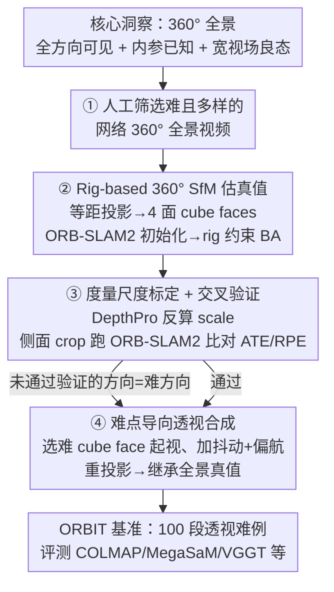

# ORBIT: Benchmarking SfM in the Wild with 360° Video

**会议**: CVPR 2026  
**论文**: [CVF Open Access](https://openaccess.thecvf.com/content/CVPR2026/html/Sabour_ORBIT_Benchmarking_SfM_in_the_Wild_with_360deg_Video_CVPR_2026_paper.html)  
**代码**: 无（Google Research / DeepMind）  
**领域**: 3D视觉  
**关键词**: SfM基准, 相机位姿估计, 360°全景视频, 真实场景动态, 失败模式诊断

## 一句话总结
ORBIT 用网上的 360° 全景视频做"可靠真值来源"——因为全景相机看全方向、内参已知、稳定特征藏不住，所以对它跑定制的 rig-based SfM 能得到可信轨迹，再把全景裁剪重投影成"专挑难点"的透视视频，构成 100 段真实野外难例，结果 COLMAP / MegaSaM / VGGT 等 SOTA 在上面无一不大量失败，揭示 SfM 远未解决。

## 研究背景与动机

**领域现状**：从视频恢复相机位姿和 3D 几何（SfM）是空间推理、AR/VR、机器人、可控 3D/4D 世界模型的核心组件。当前方法在**短视频 + 静态场景**上表现很好，传统 COLMAP / ORB-SLAM 和新的学习式 MegaSaM / VGGT / MonST3R 都不断刷新成绩。

**现有痛点**：可一旦碰到复杂真实视频——大量运动物体、复杂运动区域（飘动树叶、流水）、镜面反射——这些方法仍会大幅出错甚至完全失败。更糟的是**没有能反映这些难点的真值基准**：现有基准要么是合成的（Sintel、TartanAir）、要么场景太简单（RealEstate10k、ETH3D 几乎纯静态），无法衡量方法在真实复杂场景上的真实进展。

**核心矛盾**：给野外复杂视频拿到高质量相机真值轨迹**本身就极难**。大量前人工作直接拿 COLMAP 当真值，但 COLMAP 在很多真实视频上自己就会失败；GPS/IMU/深度传感器虽能在受限环境下采到真值，但野外数据几乎拿不到这些仪器。于是"想评测难场景"和"难场景拿不到真值"成了死结。DynPose-100K、SpatialVID 这类用 COLMAP/MegaSaM 预测位姿来标注的数据集，真值本身就不可验证，只能当训练集、不能当 benchmark。

**本文目标**：(1) 找到一种能在野外难场景上拿到**可验证**相机真值的途径；(2) 用它构建一个专门暴露当前 SfM 失败模式、且难点多样的评测基准。

**切入角度**：作者注意到 360° 全景视频有三个对 SfM 极其友好的性质——① 相机看**全方向**，即使部分视野被动态物/模糊污染，总有别处的静态区域提供稳定特征，"稳定特征藏不住相机"；② 全景设备**内参已知**，省去了野外视频焦距未知的难题；③ 宽视场本身让位姿估计在数学上更良态。所以**对全景跑 SfM 远比对窄视场视频可靠**，可以拿它的结果当伪真值，再裁出难的透视片段去考其他方法。

**核心 idea**：用"对 360° 全景可靠估位姿"反推出难透视片段的真值，把真值估计和待评测任务解耦开。

## 方法详解

### 整体框架
ORBIT 不是一个新算法，而是一条**真值构建 + 难例合成**流水线，产出一个 100 段视频的基准。整条管线分四步走：先从网上人工筛选出运动充分、内容有挑战的 360° 全景视频；再用专门为全景设计的 rig-based SfM 估计可靠相机轨迹当伪真值；接着把任意尺度的轨迹标定到近似度量尺度、并交叉验证过滤掉不可信片段；最后把全景重投影成"专挑难方向"的透视视频，让它继承全景的真值位姿。最终 100 段片段选自 80 个独立全景视频，每段 150–1000 帧、30fps，分辨率 671×377 到 3356×1888 不等。

### 关键设计

**1. 核心洞察：用 360° 全景反推可验证真值，把真值估计与待测任务解耦**

野外难场景拿不到真值的死结，本文用"换个相机看"破开。360° 全景对 SfM 远比窄视场友好：相机看全方向，即使前方全是动态物或低纹理，背后/侧面总有静态结构提供稳定特征——稳定特征"藏不住"；全景内参已知，免去焦距估计；宽视场让位姿估计数学上更良态。于是对全景跑 SfM 得到的轨迹足够可信、可当伪真值；再把这个全景裁出**只看难方向**的窄透视片段去考其他方法。关键在于：评测算法看到的是"单一投影、有限视场"的难片段，而真值是用"全视场 + 已知标定"算出来的——两者用**不同视点**，所以真值不会因为难片段难就跟着错，这正是 ORBIT 比 DynPose-100K（真值和测试输入用同一单目视点，无法验证）更可靠的根本原因。

**2. Rig-based 360° SfM：把全景当多相机刚性 rig 来估位姿**

直接给 COLMAP 套等距矩形（equirectangular）相机模型有两个麻烦：投影高度各向异性（赤道处一个像素偏移对应的 3D 射线偏移远大于极点处），且左右边界环绕相连、边界附近 3D 点要特殊处理。本文绕开这些，把每个全景帧视为一个**刚性绑定的多透视相机 rig**：将球面投影重投到 cube map，取前/后/左/右四个面（为鲁棒用 120° 而非 90° 视场，让相邻面重叠；丢掉常含水印/纯天空的上下面）当作四路时间同步的透视子视频。先在前向面上跑改进版 ORB-SLAM2 引导初始化（用其关键帧选择和丢轨重启逻辑，每次丢轨就重启从而切出多段），取前 $k=32$ 个位姿初始化 bundle adjustment；BA 阶段用 SIFT 重算各面内/面间对应，做类 COLMAP 的增量 SfM，并施加 **rig 约束**——四个 cube face 共享投影中心、相对朝向固定，作为刚性相机组联合优化。之所以不用 VGGT/MegaSaM 这类新方法，是因为它们不易扩展到 360° 且需重训。

**3. 度量尺度标定 + 交叉验证过滤**

SfM 因 gauge 歧义只能输出**任意尺度**轨迹，而 ATE 这类 RMSE 指标对尺度敏感。本文用零样本单目度量深度模型 DepthPro 给每帧子视频预测度量深度，把 rig-based SfM 算出的可见 3D 点重投影回各子视频算其 $z$ 深度，二者之比即把重建映到度量尺度的尺度因子；每帧取像素中位数为帧尺度，再对全片帧尺度求均值方差，**只保留方差小于均值**的鲁棒片段，用其平均尺度统一缩放。随后做交叉验证：在偏离前向面 [90°,180°,270°] 的透视 crop 上**独立**跑 ORB-SLAM2（避开用于初始化的前向面），用 Umeyama 对齐后看与 360° rig 轨迹的 ATE / RPE 是否吻合，吻合才认可。其中 $\mathrm{ATE}(g,e)=\big(\sum_i\|g_i-e_i\|_2^2\big)^{1/2}$ 衡量绝对轨迹误差，RPE-T / RPE-R 分别衡量相邻帧的相对平移/旋转误差。该真值管线在 360Loc（LiDAR 真值）上 ATE 仅 0.07±0.04m、合成 360 上近乎 0，比基线失败时常 >4m 的误差小几个数量级。

**4. 难点导向的透视视频合成：专门把难方向裁出来考人**

为让基准视频像手持相机那样运动，不取固定朝向而是**变化视点方向**。若某 cube face 在第 3 步交叉验证里失败（ORB-SLAM2 在该方向跑挂），就把它当"难方向"信号、选作初始帧视角以最大化挑战；否则从前向面起。后续帧叠加两种运动：模拟手抖的小幅逐帧旋转，和模拟"环顾四周"的绕竖直 y 轴缓变旋转——每 30 帧从 $\mathcal{N}([0,0,0],[1,20,2])$ 采一次旋转角再球面插值。视场在 120° 附近小扰动（视频本身已够难，不再用小视场加难；ORBIT 2 才引入 30°–120° 的视场变化）。最终透视视频从原全景继承真值位姿（旋转按逐帧扰动相应变换）。

## 实验关键数据

> 指标说明：**ATE**=绝对轨迹误差（m，越低越好）；**RPE-T / RPE-R**=相对平移/旋转误差；**Success**=严格阈值（ATE<0.5、RPE-R<0.4、RPE-T<2.0，是交叉验证阈值的 2 倍）下判成功的片段占比；**R-Success**=阈值再翻倍的宽松成功率。对 COLMAP 这类可能完全无输出的方法，丢帧时沿用上一帧位姿，整段无输出直接记失败。

### 主实验
六种代表性方法在 ORBIT 100 段上的结果——**没有一个方法不在至少 20% 片段上失败**，且 ATE 标准差极大，说明均值已不具参考性、必须看成功率：

| 方法 | 类型 | ATE↓ | RPE-R↓ | Success↑ | R-Success↑ |
|------|------|------|--------|----------|------------|
| COLMAP | 优化 | 5.40±12.58 | 2.07±3.17 | 25.27% | 32.96% |
| ORB-SLAM | 优化 | 4.61±6.39 | 1.08±0.78 | 1.09% | 2.19% |
| MegaSaM | 混合 | 3.90±11.50 | 0.59±0.87 | **38.46%** | 51.64% |
| MegaSaM+RoMo | 混合 | **3.42±10.75** | 0.62±0.85 | **38.46%** | 50.54% |
| MonST3R | 前馈 | 4.46±8.54 | 1.10±1.02 | 0.0% | 6.59% |
| VGGT-Long | 前馈 | 2.58±4.80 | 1.11±1.20 | 3.29% | 10.98% |

最好的 MegaSaM 严格成功率也只有 38.46%，差距巨大。有趣的是按指标排名会"打架"：COLMAP 平均 ATE 最差，但严格成功率（25.27%）却高于前馈方法，说明它在不那么难的场景里仍是好选择；前馈方法（MonST3R/VGGT-Long）很少精确匹配真值，但误差上界更低。

### 真值管线保真度验证 / 失败相关性分析
真值管线在两个有已知真值的数据集上验证，误差远小于基线失败量级，证明 ORBIT 真值足以区分算法优劣：

| 验证集 | ATE↓ | RPE-R↓ | 说明 |
|--------|------|--------|------|
| 360Loc（LiDAR 真值） | 0.07±0.04 m | 0.13±0.07 | 真实室内外 |
| Synthetic 360（Blender） | 0.0±0.0 m | 0.02±0.005 | 含动态物的合成全景 |

### 关键发现
- **失败相关性低 = 基准在诊断而非单纯刁难**：各方法在 ORBIT 上成功/失败的相关矩阵普遍很低（除 MegaSaM 与 RoMo+MegaSaM 因同源高达 0.80），说明不同方法栽在**不同**片段上，ORBIT 是个能暴露各自失败模式的诊断工具，而非一堆无脑超难片段的堆砌。
- **难点是结构化、可分类的**：>90% 片段含运动物体，作者进一步归纳出低纹理静态区（雪/沙/水下，约 10%）、暗场景（夜间/洞穴，约 10%）、高速相机（漂流/滑雪）、大幅相机旋转（MegaSaM 尤其怕）、与相机同速平移的物体（COLMAP 多失败）、拥挤人群（约 10%）、流体纹理（水面噪声匹配）等七类挑战。
- **RoMo 运动掩码能救高误差片段**：把 RoMo 的运动分割掩码喂给 MegaSaM，在高误差片段上改善明显、又不伤简单片段，但代价是与 COLMAP/MonST3R 的结果相关性升高。

## 亮点与洞察
- **"换个更好观测的相机来造真值"是极聪明的解耦**：把"难以评测的任务"（窄视场野外 SfM）和"可靠的真值来源"（全视场已知内参 SfM）拆开，用不同视点保证真值可验证，这个思路可迁移到任何"测试输入受限但存在更强观测形式"的基准构造问题。
- **rig 化处理 360° 绕开等距投影所有坑**：把全景拆成四个重叠 cube face 当刚性相机组，既复用了成熟的透视 SfM/SLAM 工具链，又用 rig 约束保住了全景的全方向信息，是工程上很干净的折中。
- **难点导向合成 + 失败相关性度量**：用"哪个方向 ORB-SLAM2 跑挂"自动定位难方向去裁片段，再用方法间失败相关性证明基准的诊断价值，这套"造难例 + 证明难得有意义"的方法论值得做 benchmark 的工作借鉴。

## 局限与展望
- 伪真值依赖 rig-based SfM 本身的正确性，虽有交叉验证和人工目检（靠稳定后看竖线弯曲/背景漂移），但**仍非传感器级硬真值**，极端场景下可能有未被过滤掉的系统误差。
- 当前 ORBIT 假设**内参固定**（120° 附近小扰动），未覆盖焦距随片段内/片段间变化的情况——作者把变内参列为未来扩展（ORBIT 2 才引入 30°–120° 视场变化）。
- 数据来源是人工筛选的网络 360° 视频，筛选标准（运动充分、单镜头连续）带主观性，且受限于公开 360° 视频的题材分布。
- 只有 100 段，规模偏小、不适合训练，定位纯粹是评测/诊断基准；⚠️ 论文未给出代码/数据公开的明确链接，复现细节（如交叉验证阈值）部分放在补充材料。

## 相关工作与启发
- **vs DynPose-100K / SpatialVID**：它们用 COLMAP/MegaSaM 预测位姿当标注，真值与测试输入同视点、无法独立验证，只能当训练集；ORBIT 用全景全视场反推、再裁窄视场难片段，真值可验证，定位是 benchmark 而非训练集。
- **vs Princeton365**：同样基于 360° 视频，但 Princeton365 用 IMU/标记物标定真值，受限于受控环境；ORBIT 完全从野外网络视频构建，多样性更强（漂流、人群、雪地等）。
- **vs Sintel / TartanAir / RealEstate10k / ETH3D**：传统 SfM 基准要么合成、要么近乎纯静态，轨迹简单不反映真实复杂度；ORBIT 专门覆盖动态物 + 复杂相机运动的真实难场景，填补了"野外难例 + 可信真值"的空白。

## 评分
- 新颖性: ⭐⭐⭐⭐⭐ "用 360° 全景反推可验证真值"是个真正巧妙、此前未被充分利用的洞察。
- 实验充分度: ⭐⭐⭐⭐ 评测了 6 类代表方法 + 真值管线双数据集验证 + 失败相关性分析，但方法数和规模可更大。
- 写作质量: ⭐⭐⭐⭐⭐ 动机、管线、难点分类、失败模式都讲得清晰透彻。
- 价值: ⭐⭐⭐⭐⭐ 揭示 SOTA SfM 在真实难场景上成功率不足 40%，为该领域指出明确改进方向，诊断价值高。

<!-- RELATED:START -->

## 相关论文

- [\[CVPR 2026\] HumanOrbit: 3D Human Reconstruction as 360° Orbit Generation](humanorbit_3d_human_reconstruction_as_360_orbit_generation.md)
- [\[CVPR 2026\] GaussFusion: Improving 3D Reconstruction in the Wild with A Geometry-Informed Video Generator](gaussfusion_improving_3d_reconstruction_in_the_wild_with_a_geometry-informed_vid.md)
- [\[CVPR 2026\] Scene Grounding In the Wild](scene_grounding_in_the_wild.md)
- [\[CVPR 2026\] VGGT-360: Geometry-Consistent Zero-Shot Panoramic Depth Estimation](vggt-360_geometry-consistent_zero-shot_panoramic_depth_estimation.md)
- [\[CVPR 2026\] GeoCodeBench: Benchmarking PhD-Level Coding in 3D Geometric Computer Vision](benchmarking_phd-level_coding_in_3d_geometric_computer_vision.md)

<!-- RELATED:END -->
