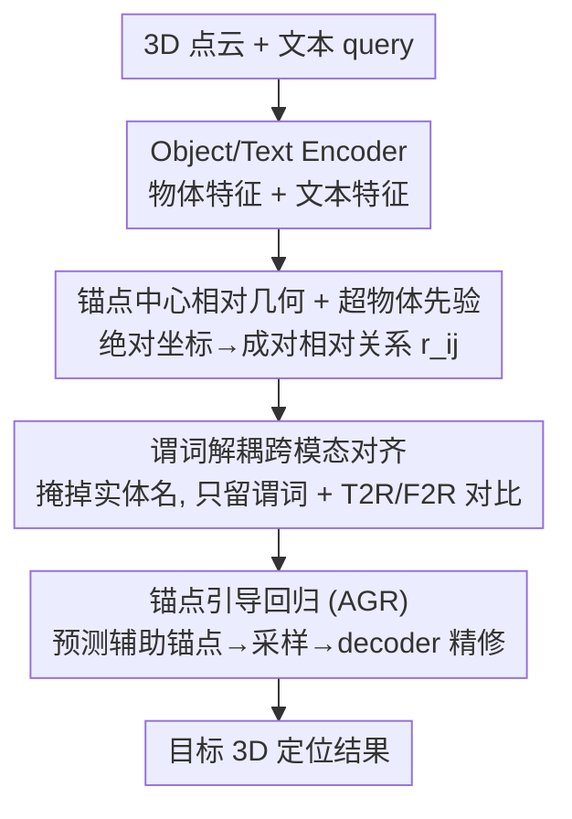

# ORD: Object-Relation Decoupling for Generalized 3D Visual Grounding

**会议**: CVPR 2026  
**论文**: [CVF Open Access](https://openaccess.thecvf.com/content/CVPR2026/html/Huang_ORD_Object-Relation_Decoupling_for_Generalized_3D_Visual_Grounding_CVPR_2026_paper.html)  
**代码**: 待确认  
**领域**: 3D视觉  
**关键词**: 3D 视觉定位、目标-锚点关系、谓词解耦、相对几何、对比对齐

## 一句话总结
ORD 提出"物体-关系解耦"框架，把目标-锚点的空间关系当作一等几何/语义原语显式建模——用锚点中心的相对几何 + 谓词解耦的跨模态对齐 + 锚点引导回归，切断"从实体名走捷径"的依赖，在 NR3D/SR3D 等多个 3D 视觉定位基准上稳超 SOTA。

## 研究背景与动机
**领域现状**：文本引导的 3D 视觉定位（3DVG）要根据自然语言在 3D 场景里框出目标物体，主流做法靠强化跨模态对齐——多视角投影、实体驱动注意力、多步推理等。

**现有痛点**：这些方法主要盯着"绝对位置"和"全局匹配"，缺乏对物体间**相对关系**和局部几何约束的显式建模，在关系结构复杂、含多锚点语义的真实场景里就力不从心。即使有方法用语言条件 Transformer 显式编码距离/朝向等相对线索，它们也**没有把语言语义和几何关系解耦**。

**核心矛盾**：把句子级文本嵌入直接和相对空间特征融合，会鼓励模型走"语义捷径"——靠词面语义（实体名）去猜关系，而不是真的从几何里推关系。结果是相对关系模块反而对定位贡献变小、整体性能下降。一句话：**文本语义与相对几何的紧耦合**阻碍了真正的关系理解，削弱了跨视角/跨组合的泛化与鲁棒性。图 1 给的例子很直观——训练集"离墙最近的垃圾桶"和测试集"离窗最近的显示器"都含谓词"closest to"，但指代物体不同；若模型把"closest"和"垃圾桶"绑死，换到"显示器"就废了。

**本文目标**：把目标-锚点关系从实体语义里剥离出来，作为一等公民显式建模，让模型学到**谓词级、可泛化**的关系知识。

**切入角度**：作者的核心假设是——相对几何应该对齐到"承载关系的语言（谓词）"，而不是对齐到物体名或属性；同时相对几何要在**锚点中心坐标系**里编码，才能对视角和尺度变化稳健。

**核心 idea**：物体-关系解耦（Object-Relation Decoupling）——锚点中心相对几何编码 + 谓词解耦掩码对齐 + 锚点引导回归，三招合力切断语义捷径。

## 方法详解

### 整体框架
ORD 是锚点驱动的 3DVG 框架。输入是 3D 点云 + 自然语言 query，先用 Object Encoder 和 Text Encoder 抽出物体特征与文本特征。然后**空间关系建模模块**把绝对坐标转成成对的相对物体-关系特征，经相对位置编码器嵌入；这些相对关系一路与物体特征融合（Spatial/Absolute Information Enhancement Module），一路与"只保留谓词"的文本表示做跨模态对齐（谓词解耦对齐 + 全局对齐）。最后**锚点引导回归模块**预测辅助锚点、采样其特征送进 Transformer decoder，输出精修后的目标/锚点定位结果。

### 关键设计

**1. 锚点中心相对几何 + 超物体先验：让关系编码对视角和尺度都稳**

大多数 3DVG 用绝对坐标或成对距离/角度建模空间关系，一旦坐标系或视角变了就漂移。作者借鉴"bone/ultra-bone"思路，对场景里每对物体只刻画**单位方向 + 归一化长度**。给定物体提议集 $V=\{O_i\}$，每个有中心 $c_i$ 和尺寸 $z_i$，构建有向图；对有向边 $e=(i\to j)$ 定义 $len_{ij}=\lVert c_i-c_j\rVert_2$、$dir_{ij}=(c_i-c_j)/len_{ij}$。为了给全场景一个统一的方向与尺度参照，把所有边平均成一个"**超物体（ultra-object）**"：$len_{avg}=\frac{1}{|E|}\sum len_{ij}$、$dir_{avg}=\frac{1}{|E|}\sum dir_{ij}$，拼成场景级全局几何 token $g_{global}=[dir_{avg}^\top, len_{avg}]^\top \in \mathbb{R}^4$，充当软锚点校准尺度、抑制因参照系变化导致的关系漂移。每个物体再聚合其关联边 $r_{ij}=C([b^x_{ij}],[b^y_{ij}],[b^z_{ij}],[len_{ij}],g_{global})$（$C$ 为拼接，$b$ 是方向三分量），经相对位置编码器投影成 $R\in\mathbb{R}^{N_{obj}\times N_{obj}\times d_{in}}$。这套"相对 + 全局参照"的编码比纯绝对坐标更视角无关、更尺度鲁棒。

**2. 谓词解耦跨模态对齐：掩掉实体名，只让"关系词"和几何对齐**

这是切断语义捷径的核心。空间关系应该对齐到"承载关系的语言"，而不是物体名/属性。已有工作常把实体 token 换成角色标签（target/anchor），但仍泄漏词面先验、把关系理解和实体语义缠在一起。作者改用**谓词解耦掩码**：给定指代句 $S_i=\{w_k\}$，构造 $S_i^{rel}=M_{pred}(S_i;C_{rel})$，其中 $C_{rel}$ 是空间谓词类别集（left of / right of / in front of / on / above / between / closest / farthest 及比较级、最高级等）；所有不属于 $C_{rel}$ 的 token（含物体名和属性）一律替换成 MASK，文本编码器只看见纯谓词片段。再对谓词位置做 masked-mean 池化得到紧凑谓词表示 $T_i^{rel}=\text{MaskedMean}(E_{text}(S_i^{rel}))$。例如"The target is on the right side of the anchors"，编码器只看到"is on the right side of"。在此基础上做两路 InfoNCE 对比对齐：**文本-关系（T2R）**用谓词表示对齐相对关系 $s^{t2r}_{ij}=\cos(T_i^{rel},R_j)$，**特征-关系（F2R）**用跨模态融合后的场景物体特征对齐关系 $s^{f2r}_{ij}=\cos(F_i,R_j)$，分别经温度 $\tau$ 的 softmax 转成分布 $Q^{t2r},Q^{f2r}$。前者强制"关系词↔成对几何"细粒度对齐，后者兜住"全局物体-文本语义"，从而既抑制实体名的词面泄漏、又保住全局语义。

**3. 锚点引导回归（AGR）：显式注入目标-锚点先验来消歧**

空间关系里的关键线索既包括目标位置、也包括锚点位置。为把目标-锚点先验注入回归、在复杂多物体场景里消歧，作者设计辅助锚点定位策略。设聚合特征 $F_{fuse}\in\mathbb{R}^{N_{obj}\times d_{in}}$，先用线性投影 $FC_{obj}$ 映到锚点数 $N_A$ 维得辅助锚点 logits $L_{aux}\in\mathbb{R}^{N_{obj}\times N_{A}T}$；对锚点维取 argmax 得候选锚点回归索引 $P_{anc}$，据此检索并采样预测锚点特征 $F_{sampled}\in\mathbb{R}^{N_A\times d}$。再把聚合特征 $F_{agg}$ 与采样锚点特征一起送进 Transformer decoder 做跨模态交互融合，输出 $F_{ref}\in\mathbb{R}^{(N_A+1)\times d}$（即 $N_A$ 个锚点槽 + 1 个目标槽）。最后全连接头 $FC_o$ 给出锚点引导回归预测 $L_{ref}$。这样 decoder 显式输出专门的锚点槽与目标槽、再由回归头精修，在多物体场景里能更好地区分谁是锚点谁是目标，避免指代漂移。

### 损失函数 / 训练策略
总目标是多项损失之和：$L = L_{Object} + L_{ref} + L_{Sent} + L_c + L_{TA}$。其中——

- **目标-锚点关系损失** $L_{TA}=L_r+L_{sym}$：$L_r$ 是学习目标→锚点对应的主监督；$L_{sym}=\lambda\cdot\text{MSE}(FR^\top, FR)$（$\lambda=0.1$）是辅助正则，对关系特征矩阵加对称约束，抑制噪声诱发的单向虚假高响应、平滑优化轨迹、加速收敛，但不改主目标。
- **对比损失** $L_c=L_{t2r}+L_{f2r}$：对配对的（场景物体, 文本, 关系）三元组用 InfoNCE，正样本为配对组合、负样本为非配对，同时抓全局（场景-文本）与局部（关系-结构）对应。
- **定位损失** $L_{ref}$：用辅助锚点索引 $y_{anchor}$ 与目标索引 $y_{target}$ 拼成统一参照标签 $y_{ref}$，对每个空间槽（$k$ 个锚点 + 1 个目标）做行 softmax 交叉熵，鼓励语言通路产出能区分锚点槽与目标槽的判别性特征。
- 另有句子级交叉熵 $L_{Sent}$（沿用 CoT3DRef）监督文本模块、物体类别交叉熵 $L_{Object}$ 对齐物体特征与语义类别。

训练细节：每个场景点云切成物体实例、每物体均匀下采样 1,024 点；NR3D/SR3D 按场景 70%/30% 无重叠切分；PyTorch + 2×RTX 4090，训 110 epoch，batch 18，初始学习率 5e-4，隐维 768，每场景至多 52 物体、最大 token 长 24。

## 实验关键数据

### 主实验
在 NR3D / SR3D（ReferIt3D）上对比绝对坐标派与"绝对+相对"派方法（准确率 acc，预测物体身份匹配 GT 即算对）。

| 数据集 | 方法 | 空间线索 | Overall | Easy | Hard | View-Dep. | View-Indep. |
|--------|------|---------|---------|------|------|-----------|-------------|
| SR3D | CoT3DRef (ICLR'24) | Absolute | 73.2 | 75.2 | 67.9 | 67.6 | 73.5 |
| SR3D | ViewSRD (ICCV'25) | Absolute | 76.0 | 78.3 | 70.6 | 69.0 | 76.2 |
| SR3D | MiKASA (CVPR'24) | Abs.+Rel. | 75.2 | 78.6 | 67.3 | 70.4 | 75.4 |
| SR3D | **Ours** | Abs.+Rel. | **76.2** ⚠️ | 78.4 | 71.0 | 64.2 | 76.8 |
| NR3D | CoT3DRef (ICLR'24) | Absolute | 64.4 | 70.0 | 59.2 | 61.9 | 65.7 |
| NR3D | ViewSRD (ICCV'25) | Absolute | 69.9 | 75.3 | 64.8 | 68.6 | 70.6 |
| NR3D | MA2TransVG (CVPR'24) | Abs.+Rel. | 65.2 | 71.1 | 57.6 | 62.5 | 65.4 |
| NR3D | **Ours** | Abs.+Rel. | **71.6** | 76.4 | 67.0 | 69.8 | 72.5 |

> ⚠️ 缓存正文称"SR3D 上 76.8% overall、Easy +5.3%、View-Dep 分支 +7.3%"，但 Table 2 里 Ours 行 Overall=76.2、View-Indep=76.8——正文那个 76.8 应是 View-Indep 列、表头排列与正文口径有出入，**以原文表格为准**。

细粒度关系上 ORD 也全面占优：**视角相关关系**（left/right/front/behind）达 71.5/70.6/71.7/70.5，对 ViewSRD 在"behind"上 +7.2；**视角无关关系**（closest/farthest/between/above/under）达 73.4/59.7/74.7/70.5/83.0，对 CoT3DRef 在"between" +7.8、"under" +19.8。排序指标上 MRR=0.81、MR=1.85、MedR=1.01，均为最佳，说明 GT 目标几乎总排在最前。

### 消融实验
NR3D 上逐模块消融（Overall）：

| 配置 | Overall | Hard | View-Dep | 说明 |
|------|---------|------|----------|------|
| w/o Anchors & ROR | 62.2 | 56.1 | 60.1 | 去掉锚点 + 相对关系，掉最多 |
| w/o SFAM (G & P) | 69.1 | 64.3 | 69.1 | 同时禁用全局/谓词对齐 |
| w/o SFAM G | 69.8 | 64.0 | 68.0 | 去全局对齐 |
| w/o SFAM P | 70.8 | 65.1 | 69.5 | 去谓词对齐 |
| w/o SIEM & AIEM | 70.9 | 65.1 | 70.4 | 去空间/绝对信息增强 |
| w/o AGRM | 71.0 | 65.0 | 67.0 | 去锚点引导回归 |
| **Ours (Full)** | **71.6** | **67.0** | **69.8** | 完整模型 |

### 关键发现
- 贡献最大的是"锚点 + 相对关系"本身：去掉后 Overall 从 71.6 暴跌到 62.2（−9.4），且 Hard 和 View-Dep 分支掉幅最大，印证锚点线索与相对几何是关系密集场景的命脉。
- 谓词解耦对齐（SFAM 的 G/P）也很关键：同时禁用掉到 69.1，尤其 Hard 分支受影响大，说明它是空间特征对齐的中枢。
- AGRM 去掉只小幅掉到 71.0，但它对多视角/复杂场景的消歧有正向作用；损失侧 $L_{sym}$ 作为辅助正则加速收敛、稳定优化。
- ORD 在"绝对+相对"派里同时把绝对与相对坐标用足，相比只用绝对坐标的方法（3D-SPS/BUTD-DETR/CoT3DRef）在复杂空间关系上优势明显。

## 亮点与洞察
- **"谓词解耦掩码"是最锋利的一招**：把句子里除空间谓词外的 token 全掩成 MASK，直接从输入层面掐断"靠物体名走捷径"，让对齐被迫聚焦几何语义——这个思路对任何"语言-几何/空间"对齐任务都可迁移。
- **超物体（ultra-object）当软锚点很优雅**：把全场景所有边平均成一个 4 维全局几何 token 来校准尺度与方向，用极小代价提供视角/尺度参照，是相对几何建模里轻量又有效的设计。
- **把锚点显式建成可回归的槽**：AGR 让 decoder 输出专门的锚点槽 + 目标槽，把"谁是锚点"从隐式注意力变成显式监督，复杂多锚点场景的消歧更可控。
- **双路对比（T2R + F2R）分工清晰**：T2R 管谓词↔几何的细粒度对齐、F2R 管全局物体-文本语义，互补地同时压住词面泄漏又不丢全局信息。

## 局限与展望
- **依赖锚点标注**：方法吃 CoT3DRef/SR3D 提供的锚点级标注（NR3D+CoT3DRef、SR3D+anchors）来做辅助锚点监督，缺锚点标注的数据集上能否直接用、退化多少，文中未充分讨论。
- **谓词类别集是手工定义的** $C_{rel}$：谓词解耦掩码依赖预定义的空间谓词词表，遇到词表外的新关系表达或隐式空间描述可能掩错或失效，开放世界关系组合的覆盖度受限。
- **部分模块细节在补充材料**：绝对/空间信息增强模块（AIEM/SIEM）、$L_r$、$L_{Sent}$ 等的具体实现都放到 supplementary，正文可复现性打折。
- 评测集中在 NR3D/SR3D，未见在 ScanRefer 等其他主流基准上的结果，跨基准泛化仍待验证。

## 相关工作与启发
- **vs 仅编码绝对位置的方法（3D-SPS / BUTD-DETR / CoT3DRef）**：它们靠物体质心的绝对坐标 + 全局匹配，标准设置有效但复杂关系场景吃力；ORD 显式建相对几何 + 锚点，NR3D 上对 CoT3DRef 等有明显增益。
- **vs 注入几何偏置但不解耦的方法（ViL3DRel 等）**：它们在单一通路里同时融合语义与几何，仍鼓励捷径、强依赖绝对布局；ORD 用谓词解耦掩码把语义与几何彻底分流。
- **vs 表示层解耦但用统一融合/全局坐标的方法**：这类工作没在锚点中心坐标系里显式参数化目标-锚点相对几何；ORD 的锚点中心相对编码 + 超物体先验正是补上这一点。
- **vs 用手工损失约束相对关系的方法**：那类靠手工设计的 loss、关系类型有限、骨干特征仍纠缠；ORD 把关系当一等原语建模 + 对比对齐，对未见关系组合的迁移更友好。

## 评分
- 新颖性: ⭐⭐⭐⭐ "物体-关系解耦 + 谓词掩码"角度新颖且切中 3DVG 的捷径痛点，但相对几何/对比对齐的零件多是已有思想的组合。
- 实验充分度: ⭐⭐⭐⭐ NR3D/SR3D 主表 + 细粒度关系分解 + 排序指标 + 逐模块/逐损失双消融，较全；但缺 ScanRefer 等跨基准。
- 写作质量: ⭐⭐⭐ 思路清晰、公式完整，但关键模块细节外放补充材料，且缓存里 SR3D 总分口径有出入需对照原文。
- 价值: ⭐⭐⭐⭐ 谓词解耦掩码是可迁移的通用思路，对 3DVG 乃至语言-空间对齐任务有启发价值。

<!-- RELATED:START -->

## 相关论文

- [\[CVPR 2026\] MonoVLM: Monocular 3D Visual Grounding with Vision Language Models](monovlm_monocular_3d_visual_grounding_with_vision_language_models.md)
- [\[CVPR 2026\] Scalable Object Relation Encoding for Better 3D Spatial Reasoning in Large Language Models](scalable_object_relation_encoding_for_better_3d_spatial_reasoning_in_large_langu.md)
- [\[CVPR 2026\] PV-Ground: Text-Guided Point-Voxel Interaction for 3D Visual Grounding](pv-ground_text-guided_point-voxel_interaction_for_3d_visual_grounding.md)
- [\[CVPR 2026\] UZ3DVG: Unaided Zero-Shot 3D Visual Grounding with Generated Language Conditions](uz3dvg_unaided_zero-shot_3d_visual_grounding_with_generated_language_conditions.md)
- [\[CVPR 2026\] S$^2$-MLLM: Boosting Spatial Reasoning Capability of MLLMs for 3D Visual Grounding with Structural Guidance](s2-mllm_boosting_spatial_reasoning_capability_of_mllms_for_3d_visual_grounding_w.md)

<!-- RELATED:END -->
