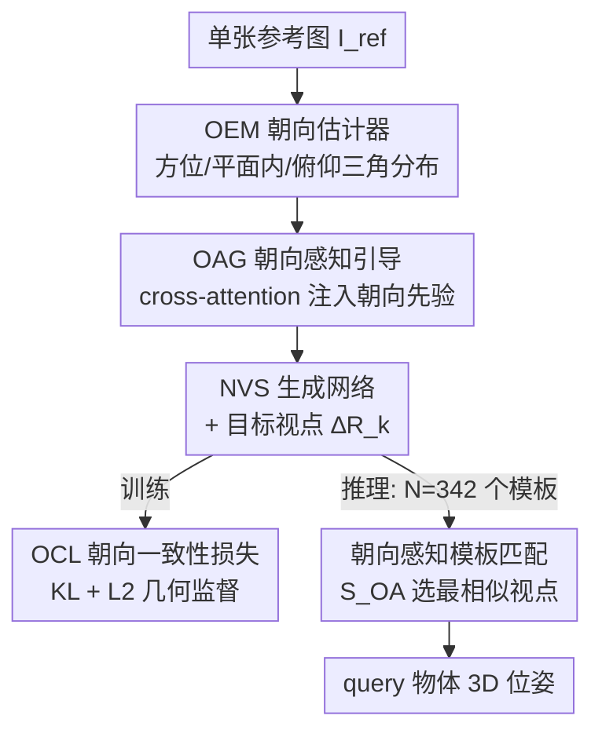

# OrienPose: Orientation-Guided Novel View Synthesis for Single-Image Unseen Object Pose Estimation

**会议**: CVPR 2026  
**论文**: [CVF Open Access](https://openaccess.thecvf.com/content/CVPR2026/html/Liu_OrienPose_Orientation-Guided_Novel_View_Synthesis_for_Single-Image_Unseen_Object_Pose_CVPR_2026_paper.html)  
**代码**: https://github.com/pubyLu/OrienPose  
**领域**: 3D视觉  
**关键词**: 物体位姿估计、新视角合成、朝向先验、未见物体、生成-比较

## 一句话总结
OrienPose 把物体的"朝向先验"显式注入到新视角合成（NVS）的参考潜变量里、并用朝向一致性损失在几何层面监督视角变换，把单张图、无 CAD 模型的未见物体位姿估计从"凭像素瞎猜变换"变成"有定义起点的几何变换"，在 ShapeNet 上 ACC30 较前 SOTA NOPE 提升 7.3%、中位误差降低 7.3°。

## 研究背景与动机
**领域现状**：从单张/少量 RGB 图估计未见物体的 3D 旋转，最有前景的一支是"生成-比较"（generate-and-compare, G&C）范式：用生成模型从参考图合成一组已知视点下的新视角模板，再把模板和查询图做匹配，取最相似模板对应的视点作为位姿。它相比依赖 CAD 模型渲染模板的"渲染-比较"（render-and-compare）更灵活，也不需要多视角重建出显式/隐式 3D 模型，因此天然适合单图、未见物体场景。代表作是 NOPE（CVPR'24）。

**现有痛点**：NVS 本质是个病态（ill-posed）变换问题——它要学参考视角到目标视角的几何变换 "? + ∆R = ?"，但**起始朝向是没定义的**。现有 NVS 网络大多只靠像素级监督（L2 loss），没有任何显式几何约束去验证"预测出来的变换对不对"，于是合成出来的新视角经常结构几何畸变、局部纹理糊成一团，导致模板匹配不可靠、位姿估计次优。NOPE 注意到了这个问题，引入了从参考到目标的显式旋转信息，能生成轮廓大致正确的新视角，但对各向同性（isotropic）的物体仍然经常翻转、出错。

**核心矛盾**：变换 "? + ∆R = ?" 缺一个**有定义的起点朝向**。没有起点，∆R 就没有锚，整个变换在隐空间里是漂的；像素级 loss 又只看外观相似度，给不出几何层面的"对错"判据。

**本文目标**：把这个病态变换变成有定义的变换 $O_{Ref} + \Delta R = O_{Syn}$，即在变换的**起点注入朝向、终点监督朝向**，形成一个几何自洽的学习闭环。

**切入角度**：作者观察到物体的**内在朝向**是一个对退化（模糊、遮挡）鲁棒的几何线索，恰好能用来定义变换的起点。一个自然的反问是"那为什么不直接拿朝向估计器去预测位姿？"——因为朝向估计器的语义坐标系和物体的标准位姿坐标系并不对齐，直接拿它的输出做绝对位姿恢复并不可靠；但它在欧拉角空间里建模"一致的朝向分布"是稳的，哪怕视角变化很大。所以朝向被用作**先验**而非最终答案。

**核心 idea**：用"在 NVS 起点注入朝向先验 + 在终点用朝向一致性监督"替代"只靠像素 L2 监督"，给病态视角变换一个有定义的几何起点和几何判据。

## 方法详解

### 整体框架
OrienPose 沿用 G&C 范式：给定单张参考图 $I_{ref}$，用一个**朝向引导的 NVS 网络**在一组预定义视点 $\Delta R_k$ 下生成多视角模板，再把模板和查询图 $I_{qry}$ 比对，取最相似模板对应的位姿作为估计。关键在于，NVS 不再是"裸"的视角生成，而是被朝向先验"夹"在起点和终点两头：起点处朝向感知引导（OAG）把参考图的朝向分布注入潜变量，终点处朝向一致性损失（OCL）在几何层面监督合成视角，从而把病态变换收敛成有定义的变换。

### 关键设计

**1. 朝向感知引导 OAG：给病态变换一个有定义的起点**

针对"NVS 起始朝向没定义、变换在隐空间里漂"这个痛点，OAG 把参考图的物体朝向显式注入到它的潜变量表示里。为避免像 NOPE 那样在像素空间注入带来的纹理畸变和生成伪影，注入完全在**潜空间**完成：参考图经预训练编码器得到嵌入 $E_{ref}$，朝向先验由一个朝向估计模块 OEM（用在本任务数据上重训过的 Orient-Anything 模型）给出。OEM 用三组离散一维概率分布刻画一个 3D 朝向——方位角 $\alpha$、平面内旋转 $\theta$、俯仰角 $\omega$，例如方位角分布写成 $P^{\alpha}_{ref}(x|\alpha,\sigma_\alpha)\propto e^{\cos(x-\alpha)/\sigma_\alpha^2}$（环形分布，$\sigma$ 为各角的方差）。注意这些角定义在一个标准坐标系（CCS）里，**不一定和绝对位姿坐标系重合**——这正是不能拿 OEM 直接当位姿用的原因。朝向分布经 MLP 嵌入成 $E_{orien}$ 后，通过 cross-attention 注入 $E_{ref}$，让朝向嵌入和图像嵌入深度交互、对齐，输出朝向感知嵌入 $E'_{ref}$。这样 NVS 一开始就拿到了"我现在朝哪"，变换 $\Delta R$ 有了锚点。

**2. 朝向一致性损失 OCL：在几何层面而非像素层面验证变换对错**

针对"像素 L2 给不出几何对错判据"的痛点，OCL 在变换的终点加一道几何监督。总损失为 $L=\lambda_1 L_2+\lambda_2 L_{OC}$，其中 $L_2$ 是传统像素级监督，$L_{OC}$ 是朝向损失。关键在于 $L_{OC}$ 用合成视角与目标视角朝向分布之间的 **KL 散度**而非交叉熵来构造（作者发现 KL 对分布学习的监督更有效）：

$$L_{OC}=\mu_1 D_{KL}(P^{\alpha}_{gt},P^{\alpha}_{ref})+\mu_2 D_{KL}(P^{\theta}_{gt},P^{\theta}_{ref})+\mu_3 D_{KL}(P^{\omega}_{gt},P^{\omega}_{ref})$$

三项分别对方位、平面内、俯仰角监督，$\mu_i$ 为权重。一个巧妙之处是：这个 loss 让网络可以**估计参考朝向**而不是用其真值位姿——因为注入端和监督端都用 OEM 的朝向（同一坐标域），从而保证"注入的先验"和"被监督的先验"坐标域一致，形成 $O_{Ref}+\Delta R=O_{Syn}$ 的几何自洽闭环。NVS 本身把目标视角的生成建模为条件分布 $p(\Delta R|I_{ref},I_{tgt})$，用一个 U-Net 式骨干 $F$ 近似 $E'_{tgt}=F(E_{ref},\Delta R)$。

**3. 朝向感知相似度 $S_{OA}$ 模板匹配：比"外观像不像"更可靠的选模板判据**

推理时，预训练 NVS 从参考图生成 $N=342$ 个模板（在正二十面体上细分两次采样视点）。匹配阶段，作者不只比外观相似度，而是构造朝向感知相似度 $S_{OA}$：把模板潜特征与查询特征的 L2 距离、和它们朝向分布之间的 KL 散度结合起来：

$$S^k_{OA}=-\|E^k_{tmp}-E_{qry}\|_2^2-D_{KL}(O_{qry}\|O^k_{tmp})$$

取 $S_{OA}$ 最高的模板对应位姿作为最终估计。直觉上，外观项管"长得像不像"，朝向项管"朝向对不对"，两者结合避免了纯外观匹配在各向同性物体上"形状像但朝向翻了"的歧义。

### 损失函数 / 训练策略
总目标 $L=\lambda_1 L_2+\lambda_2 L_{OC}$，像素级 L2 与朝向 KL 散度加权。训练沿用 NOPE 的协议与训练集（ShapeNet 渲染图）。OEM 在本任务训练集上重训以适配位姿估计；NVS 骨干为带位姿条件机制的 U-Net 式网络。视点采样在正二十面体细分两次得到 $N=342$ 个候选视点。

## 实验关键数据

### 主实验
训练用 ShapeNet 渲染图（同 NOPE）；测试集是 ShapeNet 的 10 个类 + 真实数据集 NAVI 的 5 个实例，**测试类别/实例训练时全未见**。指标：ACC30（旋转误差 ≤30° 的比例，越高越好）、Median（中位旋转误差，越低越好）。

| 数据集 | 指标 | OrienPose | NOPE（前 SOTA） | 变化 |
|--------|------|-----------|-----------------|------|
| ShapeNet | ACC30 ↑ | 59.6 | 52.3 | +7.3% |
| ShapeNet | Median ↓ | 20.4° | 27.7° | −7.3° |
| NAVI（真实，sim2real） | ACC30 ↑ | 50.9 | 36.8 | +14.1% |
| NAVI（真实，sim2real） | Median ↓ | 35.7° | 49.1° | −13.4° |

在 ShapeNet 上 OrienPose 在两个指标上都拿到最佳（不计需要 CAD 的 GigaPose）。一个值得注意的对照：作者把 NOPE 里的 NVS 换成更强的扩散式 Free3D 做基线，反而没比 NOPE 更好（ACC30 40.4 < 52.3）——因为扩散模型会改纹理、编造细节，这反衬出"注入朝向线索"比"堆更强生成模型"更有效。在 NAVI 上几乎所有方法迁移到真实物体都明显掉点（NOPE ACC30 掉 >10%、中位误差涨 >20°），而 RelPose、PIZZA 因学到可泛化先验反而较鲁棒；OrienPose 仍以平均最佳超过它们。

### 消融实验
在 ShapeNet 的 bus 类上拆解 OAG 与朝向一致性损失 $L_{OC}$（即 OCL）的贡献：

| 配置 | ACC30 ↑ | Median ↓ | 说明 |
|------|---------|----------|------|
| w/o OAG | 53.3 | 27.9° | 去掉朝向注入，起点又变"无定义" |
| w/o $L_{OC}$ | 55.1 | 24.7° | 去掉几何监督，只剩像素 L2 |
| 完整（OAG + $L_{OC}$） | 58.7 | 18.3° | 注入 + 监督的闭环 |

两者单独都不如合起来，确认了"起点注入 + 终点监督"这个闭环的必要性；去掉 OAG 掉得比去掉 $L_{OC}$ 更狠，说明给变换一个有定义的起点是更根本的一环。

### 关键发现
- **朝向注入 > 换更强的生成模型**：Free3D（更强扩散 NVS）替换后并未超过 NOPE，说明几何病态问题靠"显式朝向线索"解，而不是靠生成能力堆。
- **对退化鲁棒**：在 bus 上施加 10%–40% 的高斯模糊，ACC30 掉幅 <3%（40% 重模糊下仍有 56%）；遮挡下 10%–20% 仍稳，但 40% 重遮挡掉到 ACC30 53.3%/Median 29.0°——因为大面积遮挡破坏结构完整性、引入形状歧义。鲁棒性来自把退化图投影进朝向感知潜空间后仍能保留足够先验。
- **失败模式**：大视角变化（参考与查询夹角 [45°, 90°]）下会有明显误差，但仍优于近乎随机猜测的 NOPE。

## 亮点与洞察
- **把"病态"显式形式化为 $O_{Ref}+\Delta R=O_{Syn}$**：很多 NVS 工作默认病态、然后靠数据和容量硬扛；本文把病态的根源（起点朝向未定义）点破，并用"起点注入 + 终点监督"两头夹的方式把它变成有定义变换——这是最让人"啊哈"的地方。
- **朝向当先验而非答案**：作者明确论证了为什么不能拿朝向估计器直接出位姿（坐标系不对齐），转而用它建模稳定的朝向分布，这个"用得对、用在哪"的判断很关键，可迁移到其他"基础模型输出坐标系和任务坐标系不一致"的场景。
- **潜空间注入避免纹理畸变**：刻意不在像素空间注入朝向，规避了生成伪影，这个工程取舍值得复用。
- **匹配判据也升级**：$S_{OA}$ 把朝向 KL 加进相似度，专治各向同性物体"形似而朝向翻"的老问题。

## 局限与展望
- **大视角变换仍弱**：作者承认 [45°, 90°] 大视角间隔下误差明显，未来计划引入多视角先验或物体底层 3D 几何来更好控制大视角变换。
- **重遮挡退化**：40% 大面积遮挡会破坏结构完整性、引入形状歧义，导致明显位姿误差——本文方法只能给出"最可能"的解。
- **依赖朝向估计器质量**：整套闭环建立在 OEM（重训的 Orient-Anything）给出的朝向分布上；若 OEM 在某些极端形状/纹理上估计失准，注入与监督都会被带偏（⚠️ 这是笔者的推断，原文未量化 OEM 误差对最终位姿的传播）。
- **N=342 模板的开销**：推理需生成数百个模板再做最近邻匹配，时间/显存开销与模板密度直接相关，原文未给出与回归式方法的效率对比。

## 相关工作与启发
- **vs NOPE（CVPR'24）**: 同属 G&C、用生成模型造模板；NOPE 引入了参考→目标的显式旋转，但只在像素级监督下学变换，对各向同性物体易翻转。OrienPose 进一步注入**内在朝向先验**并加几何级 KL 监督，把病态变换定死起点和判据，ShapeNet 上 ACC30 +7.3%、Median −7.3°。
- **vs Free3D 基线（CVPR'24）**: 把 NOPE 的 NVS 换成更强扩散 NVS，本意是测"更强生成"的上限；结果反而不如 NOPE，印证几何病态不靠生成能力解。OrienPose 的朝向线索是更对症的药。
- **vs RelPose / RelPose++ / PIZZA**: 这些回归/概率式方法学的是类别相关先验，在 sim2real 上反而较鲁棒，但缺 3D 先验、精度天花板低；OrienPose 在 ShapeNet 与 NAVI 上均超过它们。
- **vs GigaPose / OnePose++ / BoxDreamer**: 前者需 CAD 模型（不参与排名），后两者需多视角输入，在本文的稀疏/单视角设定下显著退化；OrienPose 只需单张参考图、无 CAD、无需重训即可泛化到未见物体。

## 评分
- 新颖性: ⭐⭐⭐⭐⭐ 把"NVS 病态"显式形式化为起点注入+终点监督的几何闭环，朝向当先验而非答案的判断很到位。
- 实验充分度: ⭐⭐⭐⭐ ShapeNet + NAVI 双测、退化鲁棒性、OAG/OCL 消融齐全，但消融只在单一 bus 类、缺与回归式方法的效率对比。
- 写作质量: ⭐⭐⭐⭐ 动机推导清晰，"为什么不直接用朝向估计器"这种反问式论证很提神；部分符号（如 $E_{ref}$/$E_{tgt}$ 对应关系）原文略绕。
- 价值: ⭐⭐⭐⭐ 单图、无 CAD、未见物体位姿估计的实用方向，对机器人/AR 有价值，朝向先验的用法可迁移。

<!-- RELATED:START -->

## 相关论文

- [\[CVPR 2026\] SmokeSVD: Smoke Reconstruction from A Single View via Progressive Novel View Synthesis and Refinement with Diffusion Models](smokesvd_smoke_reconstruction_from_a_single_view_via_progressive_novel_view_synt.md)
- [\[CVPR 2026\] PR-IQA: Partial-Reference Image Quality Assessment for Diffusion-Based Novel View Synthesis](pr-iqa_partial-reference_image_quality_assessment_for_diffusion-based_novel_view.md)
- [\[CVPR 2026\] From None to All: Self-Supervised 3D Reconstruction via Novel View Synthesis](from_none_to_all_self-supervised_3d_reconstruction_via_novel_view_synthesis.md)
- [\[CVPR 2026\] GeodesicNVS: Probability Density Geodesic Flow Matching for Novel View Synthesis](geodesicnvs_probability_density_geodesic_flow_matching_for_novel_view_synthesis.md)
- [\[CVPR 2026\] RF4D: Neural Radar Fields for Novel View Synthesis in Outdoor Dynamic Scenes](rf4dneural_radar_fields_for_novel_view_synthesis_in_outdoor_dynamic_scenes.md)

<!-- RELATED:END -->
