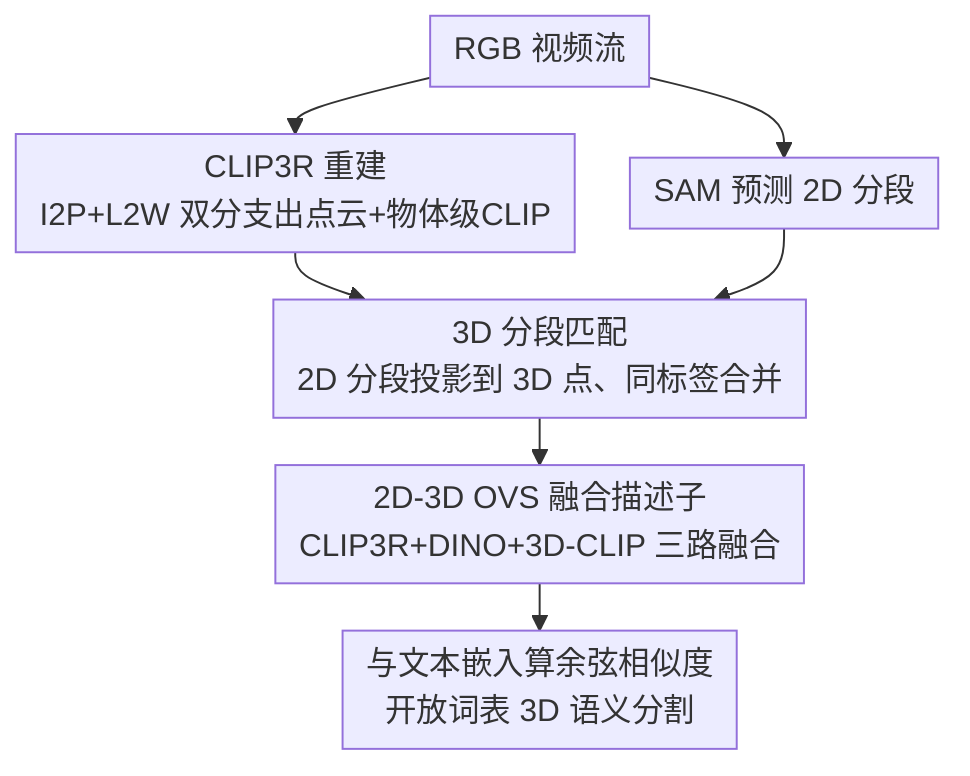

# Ov3R: Open-Vocabulary Semantic 3D Reconstruction from RGB Videos

**会议**: CVPR 2026  
**论文**: [CVF Open Access](https://openaccess.thecvf.com/content/CVPR2026/html/Gong_Ov3R_Open-Vocabulary_Semantic_3D_Reconstruction_from_RGB_Videos_CVPR_2026_paper.html)  
**代码**: 项目页 https://zorangong.github.io/Ov3R_page/  
**领域**: 3D视觉  
**关键词**: 开放词表分割、3D重建、CLIP、Spatial AI、RGB 视频

## 一句话总结
Ov3R 只用 RGB 视频流，就能同时做稠密 3D 重建和开放词表 3D 语义分割：一个把 CLIP 语义直接灌进重建网络的 CLIP3R 负责出几何 + 物体级语义，一个融合 CLIP3R/DINO/3D-CLIP 三路特征的 2D-3D OVS 负责把 2D 语义"抬"到 3D，在 Replica/7Scenes 重建和 Replica/ScanNet 开放词表分割上都刷到 SOTA，且保持约 15 FPS。

## 研究背景与动机
**领域现状**：Spatial AI 系统要让智能体实时理解环境的几何与语义，其核心是稠密 3D 重建。重建这条线近年被两类方法重塑：一类是 NeRF/3DGS 驱动的 SLAM，能出稠密重建和准确跟踪，但需要场景级训练、算力开销大；另一类是"3R"模型（如 DUSt3R 开创的端到端点图预测），绕过显式相机位姿估计，首次做到实时，但跟踪精度偏弱。与此并行，CLIP 催生了开放词表 3D 语义理解。

**现有痛点**：两条线各有死角。重建侧的 SLAM/3R 几乎都**只管几何、不管语义**，少数带语义的也被限制在预定义闭集类别上；开放词表语义侧则**严重依赖离线预处理**——OpenScene/Open3DIS 要预先重建好的 3D 点云做输入，HOV-SG 要 RGB-D 序列，OVO 虽是首个在线开放词表映射但仍需主动深度传感器和并行跑的 SLAM 显式估计位姿，且 CLIP 描述子只从 2D 图算、丢掉了 3D 几何信息。

**核心矛盾**：现有 SLAM 与"理想 Spatial AI"之间有一道鸿沟——一边是"只有 RGB、要在线、要开放词表、要 3D 几何感知"，另一边的方法总要砍掉其中某几个条件（要么要深度、要么要离线、要么闭集、要么 2D-only）。

**本文目标**：分解为两个子问题——(i) 怎么让重建网络本身就带语义、且语义与几何强对齐；(ii) 怎么把 2D 语义可靠地抬到 3D、并让语义带上 3D 几何感知。

**切入角度**：作者主张把 CLIP 语义**直接嵌进重建过程**（而不是事后再贴），并在做开放词表分割时**显式补上 3D 几何特征**（而不是只靠 2D CLIP）。

**核心 idea**：用"CLIP-informed 的 3R 重建（CLIP3R）+ 三路 2D-3D 融合描述子（2D-3D OVS）"替代"先离线重建再贴 2D 语义"，从 RGB-only 视频一步到位拿到几何一致 + 细粒度语义对齐的 3D 场景。

## 方法详解

### 整体框架
Ov3R 由两个松耦合模块组成：(i) CLIP3R——一个被 CLIP 语义"灌注"的 3R 重建模型，从重叠的视频片段预测稠密点图，同时带出物体级语义；(ii) 2D-3D OVS——把 2D 特征抬到 3D 的开放词表语义模块，学习融合空间、几何、语义三种线索的描述子。流程上，给定 RGB 视频，CLIP3R 先产出场景点云、SAM 同时预测 2D 分段；每个 2D 分段被投影匹配到对应的 3D 点得到 3D 分段；再由 2D-3D OVS 抽取融合描述子，和一组语义类别的文本嵌入算余弦相似度，取最高者作为该 3D 分段的类别。两模块通过 CLIP 特征松耦合，可联合也可独立运行（只重建、或只分割）。

### 关键设计

**1. CLIP3R：把 CLIP 语义直接灌进重建网络，而不是事后再贴**

针对"重建网络只管几何、语义靠离线后处理"的痛点，CLIP3R 在一个 3R 重建模型里同时学几何和物体级语义。它形式化为 $\Phi_{3R}(I_i^{N\times H\times W\times 3})\to P_i^{H\times W\times 3}$，沿用两分支结构：**I2P（Image-to-Points）**是一个 DUSt3R 式 ViT，在局部窗口内预测对齐到中心关键帧坐标系的点图（共享编码器 $E_{img}$ + 关键帧解码器 $D_{key}$ + 支持帧解码器 $D_{sup}$，不做显式位姿估计、位姿可作为点图副产物导出）；**L2W（Local-to-World）**把局部点图对齐到场景级，用点图编码器、配准解码器、场景解码器，借"蓄水池-检索"策略找相关关键帧、预测全局场景点。两分支本身缺高层语义推理，CLIP3R 在两处补上：I2P 端把物体级 CLIP 特征 $F_{oCLIP}$ tokenize 后与 ViT token 做 cross-attention 融合再相加，$F_{fuse}=F_{ViT}+\mathrm{softmax}(F_{ViT}F_{oCLIP}^T/\sqrt{d})F_{oCLIP}$；L2W 端额外加一个 DPT 预测头输出物体级 CLIP3R 特征 $F_{CLIP3R}$，把细粒度语义直接嵌进最终 3D 重建并强制场景内语义一致。训练用置信度感知的点图 L1 损失 $L_{I2P}$、$L_{L2W}$，外加特征对齐损失 $L_{oCLIP}=\|F_{CLIP3R}-F_{oCLIP}\|_1$。这样几何和语义在同一网络里互相约束，学到更强的语义-几何对齐。

**2. 物体级 CLIP3R 特征：用 SAM 掩码把"图像级 CLIP"细化到"物体级"**

CLIP 嵌入虽富语义，但是**图像级**的，建模不了场景里单个物体的细粒度语义。针对这点，CLIP3R 不用原始 CLIP，而是抽物体级特征 $F_{oCLIP}$：先用 SAM 得到 $M$ 个物体掩码 $m^{H\times W\times 1}$，据此造 $M$ 张掩码图、分别抽 CLIP patch 嵌入、平均并上采样到图像分辨率 $F_{CLIP}$，最后把 $M$ 张掩码图的 CLIP 特征按掩码归并进一张特征图：$F_{oCLIP}=\sum_{i=0}^{M} m_i\cdot F_{CLIP_i}$。这一步是 CLIP3R 能"分物体"理解场景的前提，也是后续语义一致性监督的来源。消融显示，用原始 vanilla CLIP 替换物体级特征会带来次优结果（见 Table 5 配置 C）。

**3. 2D-3D 融合描述子：给开放词表分割补上 3D 几何感知**

针对"开放词表语义只靠 2D CLIP、丢掉 3D 几何"的痛点，2D-3D OVS 把三路互补特征融合起来：CLIP3R 给语义、DINO 给清晰的物体间边界、一个蒸馏过的 3D-CLIP 点编码器给 3D 几何特征。CLIP3R 与 DINO 特征都在**场景级和实例级**两层抽取（实例级靠 SAM 的 2D 掩码裁剪），先各自拼接再线性投影：$F_{cat}^{scene}=\mathrm{Linear}([\mathrm{Linear}(F_{DINO}^{scene}),F_{CLIP3R}^{scene}])$，然后与原 CLIP3R 特征做 cross-attention 并相加得 $D_{scene}$、$D_{inst}$。3D-CLIP 分支在物体点云上抽几何特征（该编码器用"点云-图像-文本"三元组以自然语言监督预训练，天然与 CLIP 隐空间对齐），与掩码物体级 CLIP3R 特征 cross-attention 后相加得 $D_{mask}$。最后用一个含 cross-attention+MLP+softmax 的浅层模型学权重，按 Hadamard 积加权合并：$D=w_{scene}\odot D_{scene}+w_{inst}\odot D_{inst}+w_{mask}\odot D_{mask}$。融合模型用 sigmoid 余弦相似度损失 $L_{sim}$ 预训练（成对 2D 分段-文本标签的二分类对比）。推理时算融合描述子与各类别文本嵌入的相似度、取最高类。消融证明只融 3D 或只融 DINO 都掉点（Table 6），三路齐全才最优。

### 损失函数 / 训练策略
CLIP3R：I2P/L2W 各用置信度感知 L1 点图损失（含 $-\alpha\log C$ 置信正则）+ 物体级 CLIP 特征对齐损失 $L_{oCLIP}$。2D-3D OVS：sigmoid 余弦相似度损失 $L_{sim}=-\frac{1}{|B|}\sum_i\sum_j\log\frac{1}{1+e^{z_{ij}(-kd_i\cdot t_j+b)}}$（$z_{ij}\in\{1,-1\}$ 标注是否配对，$t_j$ 为 CLIP 文本嵌入，$k,b$ 可学习）。实现上 4×A100 训练、单张 3090 可推理；CLIP3R 24 编码块 + 12 解码块、窗口长 $L=5$（初始化）/$L=11$（增量）；2D-3D OVS 训 15 epoch、batch 512；用 SAM 2.1、SigLip ViT-SO400 CLIP、ViTS-16 DINO、PointMLP-1024 点特征。

## 实验关键数据

### 主实验
重建训练集 ScanNet++/Aria/CO3D-v2，评测 Replica 与 7Scenes；分割模块训练 ScanNet++，评测 Replica 与 ScanNetv2。指标：重建用 Accuracy（cm，越低越好）/Completion（cm，越低越好）、跟踪用 ATE RMSE、效率用 FPS；分割用 mIoU/mAcc（及频率加权 f-mIoU/f-mAcc）。

| 任务 / 数据集 | 方法 | 关键指标 | 备注 |
|---------------|------|----------|------|
| Replica 重建（均值） | Ov3R(CLIP3R) | Acc 3.05 / Comp 2.12，ATE 6.00，**15 FPS** | 实时 3R 中最佳 |
| Replica 重建 | SLAM3R | Acc 3.57 / Comp 2.62，ATE 6.61，24 FPS | 上一代实时 3R |
| Replica 重建 | Spann3R | Acc 10.32 / Comp 13.33，>50 FPS | 快但重建很差 |
| Replica 重建 | DUSt3R | Acc 3.49 / Comp 2.48，ATE 4.76，<1 FPS | 离线 3R，慢 |
| 7Scenes 重建（均值） | Ov3R(CLIP3R) | Acc 1.98 / Comp 2.08，17 FPS | 平均超所有基线 |

重建侧 Ov3R 在保持约 15 FPS 的同时精度/完整度全面超过两个实时 3R 同行（Spann3R、SLAM3R），把与慢速稠密 SLAM 的差距大幅收窄；7Scenes 上仅 VGGT-SLAM 因模型外做了 SL(4) 优化而个别更好。

| 任务 / 数据集 | 方法 | All mIoU / mAcc | 备注 |
|---------------|------|-----------------|------|
| Replica 分割（GT 几何） | Ov3R(2D-3D OVS) | **31.9 / 42.3** | 各类别最佳折中 |
| Replica 分割（GT 几何） | OVO-mapping | 26.5 / 35.8 | 此前在线最佳 |
| Replica 分割（GT 几何） | Open3DIS | 25.6 / 38.7 | Head 强、Tail 崩 |
| Replica 分割（CLIP3R 几何） | Ov3R | 30.4 / 41.2 | 全 RGB 在线设定仍最佳 |

分割侧在 Replica 的 All mIoU/mAcc 上均超全部基线（含离线方法），尤其在低频 Tail 类别上（22.8/31.5）远好于在 Head 上更强但 Tail 崩盘的 Open3DIS（4.9/9.4）。ScanNetv2 上 Ov3R 在 ScanNet200 全面领先、在 ScanNet20 的 f-mIoU/f-mAcc 上领先；OVO 在线设定下两数据集均被超过。

### 消融实验
| 模块 | 配置 | 关键指标 | 说明 |
|------|------|----------|------|
| CLIP3R | (A) w/o CLIP-insert | Acc 3.31 / Comp 2.35 / ATE 6.46 | 去掉 I2P 端 CLIP 注入，重建与跟踪都明显掉 |
| CLIP3R | (B) w/o CLIP head | Acc 3.20 / Comp 2.21 / ATE 6.32 | 去掉 L2W 端语义监督头 |
| CLIP3R | (C) 用 vanilla CLIP | Acc 3.18 / Comp 2.20 / ATE 6.28 | 不用物体级特征也次优 |
| CLIP3R | 完整 | **Acc 3.05 / Comp 2.12 / ATE 6.00** | 注入 + 监督 + 物体级 |
| 2D-3D OVS | (D) w/o DINO | mIoU 28.05 / f-mIoU 53.46 | 缺物体边界线索 |
| 2D-3D OVS | (E) w/o 3D encoder | mIoU 28.46 / f-mIoU 52.81 | 缺 3D 几何线索 |
| 2D-3D OVS | 完整 | **mIoU 30.65 / f-mIoU 54.64** | 三路融合最优 |

### 关键发现
- **CLIP 线索对几何也有用**：去掉 I2P 端 CLIP 注入（配置 A）连重建精度和相机跟踪都明显掉，说明语义不是"附赠品"，而是反过来帮了几何——这是 CLIP-informed 设计最有说服力的证据。
- **物体级 > 图像级 CLIP**：用 vanilla CLIP（C）次优，证明 SAM 掩码细化到物体级是必要的。
- **2D 与 3D 缺一不可**：分割只融 DINO（缺几何）或只融 3D（缺边界）都掉点，三路齐全才最优。
- **效率瓶颈在 SAM2**：CLIP3R 与 2D-3D OVS 各约 15 FPS，整框架（SAM2+CLIP3R+OVS 串行）受 SAM2 拖累；作者认为换更快的 SAM 变体即可逼近实时。

## 亮点与洞察
- **"语义灌进重建"而非"重建后贴语义"**：把 CLIP 直接嵌进 3R 网络，结果连几何都变好（消融 A 掉点），打破了"语义只是下游任务"的惯性，这是最让人"啊哈"的点。
- **三路特征各司其职**：CLIP3R 管语义、DINO 管边界、3D-CLIP 管几何，且用预训练对齐到 CLIP 隐空间的 3D 编码器把"几何"也塞进语言对齐空间——这个"用 3D-CLIP 补几何感知"的思路可迁移到任何 2D 语义抬 3D 的任务。
- **松耦合模块化**：两模块通过 CLIP 特征松耦合，可只重建或只分割，工程上很灵活。
- **RGB-only 且在线**：不需要深度传感器、不需要并行 SLAM 显式估位姿，把开放词表 3D 语义理解的门槛降到只要一段普通视频。

## 局限与展望
- **位姿精度偏弱（继承 3R 通病）**：作者承认 3R 模型导出的相机位姿精度次优，计划引入 SLAM 的全局 BA 等技术来补。
- **实时性受 SAM2 拖累**：整框架串行跑时 SAM2 是主瓶颈，当前总体并非严格实时，需换快变体。
- **依赖多个基础模型**：SAM、CLIP(SigLip)、DINO、3D-CLIP 一大串外部模型叠加，任一在 out-of-domain 场景退化都会传导到最终结果（⚠️ 笔者推断，原文未做基础模型替换的鲁棒性分析）。
- **跟踪在 7Scenes 个别场景仍逊于做了 SL(4) 优化的 VGGT-SLAM**：纯前馈、无模型外优化的代价。

## 相关工作与启发
- **vs OVO（首个在线开放词表映射）**: OVO 需 RGB-D 主动深度 + 并行 SLAM 显式估位姿，且 CLIP 描述子只从 2D 算、丢 3D 几何。Ov3R 从 **RGB-only** 视频出 3D 分段、无需显式相机跟踪，并用三路融合补上 3D 几何感知，Replica/ScanNet 在线设定全面超过 OVO。
- **vs SLAM3R / Spann3R（实时 3R 重建）**: 它们只管几何、无语义；Spann3R 缺全局对齐漂移严重、重建差。Ov3R 在相近实时速度下重建更准更全，且额外带语义。
- **vs DUSt3R / MASt3R（离线 3R）**: 精度尚可但 <1 FPS、无语义；Ov3R 在线、带语义、精度可比。
- **vs OpenScene / Open3DIS / HOV-SG（离线开放词表）**: 它们要预重建好的 3D 点云或 RGB-D 输入做离线后处理；Open3DIS 在 Head 类强但 Tail 类崩。Ov3R 在线、RGB-only，且在低频 Tail 类显著更稳。

## 评分
- 新颖性: ⭐⭐⭐⭐ "语义灌进重建"+三路融合补几何感知的组合很扎实，但每个组件多为已有方法的巧妙拼装（SAM/CLIP/DINO/3D-CLIP/3R）。
- 实验充分度: ⭐⭐⭐⭐⭐ 重建（Replica/7Scenes）+ 分割（Replica/ScanNet20/200）+ 跟踪 + 两模块消融 + 运行时分析，覆盖很全。
- 写作质量: ⭐⭐⭐⭐ 模块职责与融合逻辑讲得清楚，公式标注规范；三路融合的符号较密，初读需对照图 4。
- 价值: ⭐⭐⭐⭐⭐ RGB-only、在线、开放词表的 Spatial AI 重建-分割一体框架，实用性强、可迁移点多。

<!-- RELATED:START -->

## 相关论文

- [\[CVPR 2026\] JOPP-3D: Joint Open Vocabulary Semantic Segmentation on Point Clouds and Panoramas](jopp3d_joint_open_vocabulary_semantic_segmentation.md)
- [\[CVPR 2026\] EmbodiedSplat: Online Feed-Forward Semantic 3DGS for Open-Vocabulary 3D Scene Understanding](embodiedsplat_online_feed-forward_semantic_3dgs_for_open-vocabulary_3d_scene_und.md)
- [\[CVPR 2026\] OnlinePG: Online Open-Vocabulary Panoptic Mapping with 3D Gaussian Splatting](onlinepg_online_open-vocabulary_panoptic_mapping_with_3d_gaussian_splatting.md)
- [\[CVPR 2026\] ExtrinSplat: Decoupling Geometry and Semantics for Open-Vocabulary Understanding in 3D Gaussian Splatting](extrinsplat_decoupling_geometry_and_semantics_for_open-vocabulary_understanding_.md)
- [\[CVPR 2026\] Rewis3d: Reconstruction Improves Weakly-Supervised Semantic Segmentation](rewis3d_reconstruction_improves_weaklysupervised_s.md)

<!-- RELATED:END -->
