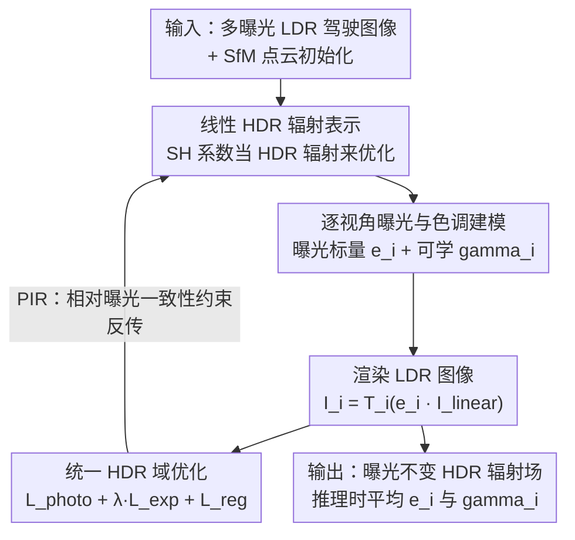

# P2GS: Physical Prior-guided Gaussian Splatting for Photometrically Consistent Urban Reconstruction

**会议**: CVPR 2026  
**论文**: [CVF Open Access](https://openaccess.thecvf.com/content/CVPR2026/html/Shimomura_P2GS_Physical_Prior-guided_Gaussian_Splatting_for_Photometrically_Consistent_Urban_Reconstruction_CVPR_2026_paper.html)  
**代码**: 无  
**领域**: 3D视觉  
**关键词**: 高斯泼溅、HDR辐射场、曝光解耦、自动驾驶仿真、光度一致性

## 一句话总结
P2GS 把 3DGS 的优化从 LDR 像素空间搬到线性 HDR 域，仅靠 LDR 图像就联合解出"视角无关的 HDR 辐射 + 逐视角曝光 + 逐视角色调映射"，从而消除多相机驾驶数据里的曝光接缝和光度不一致，得到适合自动驾驶仿真的曝光不变重建。

## 研究背景与动机

**领域现状**：3DGS 凭借显式、可微、实时光栅化，已成为自动驾驶闭环仿真和感知模型的有力底座。StreetGS、DrivingGaussian 把场景拆成静态背景与动态车辆，PVG 用周期性时间分量统一建模时变辐射场，这些工作把重心放在动态物体上。

**现有痛点**：3DGS 隐式假设所有视角的曝光和色调映射一致，直接把渲染颜色拟合到观测的 LDR 像素。但真实驾驶数据里每台相机有不同的 ISP 流水线、各自的曝光控制，户外光照又随时在变。结果是相机间的曝光差异和传感器噪声被"烤进"辐射场，在对仿真至关重要的静态背景区域（墙面、路面、植被）产生接缝、色偏和不均匀的明暗——图像右半边常常明显偏暗就是典型症状。

**核心矛盾**：3DGS 在 LDR 域拟合颜色时，把"场景本征辐射"和"相机相关的曝光/色调响应"纠缠在了一起（entangled）。已有的缓解办法要么需要多曝光输入和静态场景（GaussHDR），要么没有 HDR 监督时不稳定（Se-HDR），要么只在 2D 做逐视角颜色校正、缺乏物理一致性（Luminance-GS），都依赖受控或稠密视角，无法推广到大规模、稀疏采样的驾驶场景。

**本文目标**：在显式 3DGS 框架里、不依赖 HDR 监督和多曝光数据的前提下，把辐射、曝光、色调三者解耦，做到跨视角光度一致。

**切入角度**：作者从图像形成的物理过程出发——如果回到线性 HDR 域，"场景辐射"本身是视角无关的，相机间的差异只体现在一个曝光标量和一条色调曲线上。于是只要在 HDR 域里把这三者当作可分离、可联合优化的量，就能把畸变剥离出去。

**核心 idea**：提出"辐射不变原理（PIR）"——在线性 HDR 域，跨视角的辐射比只由曝光比决定；以此为物理约束，在 HDR 域统一优化辐射场、曝光和色调，把相机相关的光度畸变从真实场景辐射中解耦出来。

## 方法详解

### 整体框架
P2GS 在标准 3DGS 上加三件套：(i) 线性 HDR 域的辐射表示，(ii) 逐视角的曝光 + 色调（亮度）模块，(iii) 一个强制跨视角辐射一致的统一优化框架。前向流程是一条清晰的物理图像形成链：每个高斯的球谐系数被当作**线性 HDR 辐射**来学，渲染出像素级 HDR 辐射 $\hat{I}^i_{\text{linear}}$ 后，先乘上该视角的曝光标量 $e_i$，再过一条可学的色调（gamma）曲线 $T_i$，得到该视角的 LDR 图像，与观测 LDR 求光度损失；同时在 HDR 域施加相对曝光一致性约束和正则项做反向传播。推理时把所有训练视角的曝光和 gamma 取平均，得到稳定、不闪烁的渲染。

### 关键设计

**1. 辐射不变原理（PIR）：把"跨视角辐射比只由曝光决定"当物理约束**

这是全文的支点，直接针对"LDR 域拟合把辐射和曝光纠缠在一起"的根本矛盾。PIR 声称：在线性 HDR 域，同一场景点在两个视角下观测到的辐射之比，只取决于两个视角的曝光之比，即 $\frac{I^{(i)}_{\text{linear}}}{I^{(j)}_{\text{linear}}} = \frac{e_i}{e_j}$。这条不变性把一个本来纠缠的优化问题变成了可施加的硬约束——一旦在 HDR 域强制辐射比等于曝光比，场景本征辐射就被自然地从相机相关的光度畸变里剥离出来。相比把光照变化放在 LDR 空间处理的 HDR-NeRF 变体，PIR 保留的是线性 HDR 域里辐射的物理不变性，因此不需要 HDR 监督。

**2. 线性 HDR 辐射表示：让球谐系数直接表达 HDR 辐射**

常规 3DGS 把渲染颜色 $\hat{C}$ 拟合到 LDR 像素，等于把曝光和色调非线性吸收进了 SH 颜色系数。P2GS 改成把每个系数 $c_k$ 当作**线性 HDR 辐射**来优化，得到物理上有意义的辐射场 $\hat{I}^i_{\text{linear}}$，其像素级合成方式与 3DGS 的 α-blending 一致：$\hat{I}^i_{\text{linear}}(u)=\sum_{k\in K(u)} c_k(u)\,\alpha'_k\prod_{j<k}(1-\alpha'_j)$。视角 $i$ 的成像模型被显式写成 $I_i = T_i(e_i\cdot \hat{I}^i_{\text{linear}})$，把场景相关的辐射和逐相机的光度因子 $(e_i, T_i)$ 干净地分开，使整条链路可微、可解释。

**3. 逐视角曝光与色调建模：用一个标量加一条 gamma 曲线吸收相机差异**

针对"每台相机曝光控制和 ISP 响应都不同"，作者给每个视角配两个轻量参数。曝光是一个正标量 $e_i\in\mathbb{R}^+$，直接缩放 HDR 辐射 $I^i_{\text{exposed}}=e_i\cdot\hat{I}^i_{\text{linear}}$，初始化为 $e_i\sim\mathcal{N}(1.0,0.05^2)$ 以避免训练初期过曝/欠曝；与需要多曝光监督的方法不同，$e_i$ 是在 HDR 域约束下与辐射联合学出来的，实现无监督的曝光解耦。色调映射用一条可学 gamma 曲线近似：$T_i(x)=\mathrm{clamp}(x^{1/\gamma_i},0,1)$，其导数 $\partial T/\partial\gamma_i=-(\ln x/\gamma_i^2)x^{1/\gamma_i}$ 支持高效梯度优化，$\gamma_i$ 初始化在 sRGB 先验 $\gamma\approx 2.2$ 附近；色调前还会把 $I^i_{\text{exposed}}$ 截断到 $[10^{-6},10]$ 防数值溢出。

**4. 统一 HDR 域优化：PIR 约束 + 正则化稳住欠定问题**

总损失为 $L_{\text{total}}=L_{\text{photo}}+\lambda_{\text{exp}}L_{\text{exp}}+L_{\text{reg}}$。光度重建 $L_{\text{photo}}=(1-\lambda_{\text{dssim}})L_1+\lambda_{\text{dssim}}L_{\text{DSSIM}}$ 把合成 LDR 拉向观测 LDR。相对曝光一致性 $L_{\text{exp}}=\frac{1}{M}\sum_{(i,j)\in P}\lVert \alpha_{ij}\hat{I}^i_{\text{linear}}-\hat{I}^j_{\text{linear}}\rVert_1$（$\alpha_{ij}=e_j/e_i$）正是 PIR 的可微实现，强制 HDR 域里渲染强度的线性一致。但 $L_{\text{exp}}$ 只约束相对比例，存在全局尺度歧义 $\{e_i\}\to\{c\,e_i\}$，会让 HDR 辐射被任意缩放、破坏可辨识性，所以 $L_{\text{reg}}$ 三项分别处理：$\lambda_{\text{escale}}\mathbb{E}_i[(e_i-1)^2]$ 把绝对尺度软锚定到 1.0 消歧义；$\lambda_{\text{evar}}\mathrm{Var}(e_i)$ 抑制视角间曝光方差（过大方差会模仿色调非线性、产生脆弱解）；$\lambda_\gamma\mathbb{E}_i[(\gamma_i-\gamma_{\text{prior}})^2]$ 把 gamma 拉向 sRGB 先验防止非物理色调曲线。作者取 $\lambda_{\text{evar}}=\lambda_\gamma=0.1$、$\lambda_{\text{escale}}=0.01$，使全局尺度被弱锚定、视角间扩散被强正则，从而优化更稳。

### 损失函数 / 训练策略
P2GS 沿用标准 3DGS 优化流程，曝光正则权重 $\lambda_{\text{exp}}=0.01$，其余训练超参全部照搬官方 3DGS 配置；不需要任何 HDR 监督或多曝光数据。推理渲染时用全训练视角平均的 $e_{\text{render}}=\frac1N\sum_i e_i$ 和 $\gamma_{\text{render}}=\frac1N\sum_i\gamma_i$，稳住视频/新视角序列中的时序亮度闪烁。

## 实验关键数据

### 主实验
Waymo Open Dataset（真实大规模驾驶）上的图像重建任务，引入两个自定义光度指标：**HIS（HDR Inconsistency Score）**衡量曝光补偿的时序稳定性，**Std-Luminance**衡量视角间亮度一致性，两者越低越好。

| 数据集 | 指标 | P2GS（本文） | PVG | 3DGS | 说明 |
|--------|------|------|----------|------|------|
| Waymo（重建） | SSIM ↑ | **0.939** | 0.858 | 0.928 | 比 PVG 提升约 6.9% |
| Waymo（重建） | LPIPS ↓ | **0.209** | 0.336 | 0.230 | 比 PVG 提升约 37.7% |
| Waymo（重建） | HIS ↓ | **0.092** | 0.365 | 0.102 | 比 PVG 降 74.7%，甚至低于 GT 的 0.096 |
| Waymo（重建） | Std-Luminance ↓ | **0.034** | 0.042 | 0.041 | 比 PVG 降 19.0% |
| Waymo（重建） | PSNR ↑ | 31.02 | 30.68 | 33.62 | PSNR 偏好复现像素噪声，故非最高 |

PSNR 上 3DGS 反而最高，作者解释为 PSNR 奖励复现真实数据里的像素级噪声，而 P2GS 优先追求辐射一致性，牺牲了对噪声的逐像素拟合，换来更好的感知与光度保真。HIS/Std-Luminance 甚至低于原始 GT，说明 P2GS 还顺带消除了数据集本身的相机间曝光噪声。新视角合成（NVS）上 P2GS 同样在除 PSNR 外的指标领先（SSIM 0.896 / LPIPS 0.246）。

CARLA 受控实验（只改 ISO 曝光、几何与位姿固定）进一步验证抗噪：

| 设置 | 任务 | P2GS SSIM/PSNR/LPIPS | 3DGS+AT | Luminance-GS |
|------|------|------|------|------|
| ISO std2 | 重建 | **0.851 / 23.76 / 0.241** | 0.844 / 22.28 / 0.262 | 0.770 / 17.36 / 0.331 |
| ISO std4 | 重建 | **0.847 / 22.91 / 0.250** | 0.807 / 19.11 / 0.293 | 0.387 / 11.43 / 0.612 |
| ISO std2 | NVS | **0.836 / 22.72 / 0.255** | 0.812 / 19.63 / 0.295 | 0.756 / 16.99 / 0.364 |

从 std2 到更噪的 std4，P2GS 的 SSIM/PSNR 仅轻微下降（重建 PSNR 23.76→22.91），而仿射补偿在 std4 下因色调/曝光畸变变非线性而失效，Luminance-GS 在大规模稀疏室外场景退化严重。

### 消融实验
Waymo 上的损失分量消融：

| 配置 | SSIM ↑ | PSNR ↑ | LPIPS ↓ | 说明 |
|------|--------|--------|---------|------|
| Full model | **0.941** | **33.61** | **0.214** | 完整 P2GS |
| w/o $L_{\text{exp}}$ | 0.920 | 27.88 | 0.237 | 去掉相对曝光一致性，PSNR 掉约 5.7 |
| w/o $L_{\text{reg}}$ | 0.920 | 27.47 | 0.234 | 去掉正则，PSNR 掉约 6.1 |

### 关键发现
- 去掉 $L_{\text{exp}}$ 或 $L_{\text{reg}}$ 任意一项，PSNR 都会从 33.61 跌到 27～28，说明 PIR 约束和正则化是相互依赖、共同支撑辐射-曝光解耦的，缺一不可。
- HIS/Std-Luminance 低于 GT 是个有意思的现象：P2GS 不只是重建，还主动消除了数据集里固有的相机间曝光不一致，相当于把"数据噪声"也清掉了。
- 场景层面，P2GS 在静态背景（墙、路、植被）上的接缝抑制和明暗一致最明显，这恰是闭环仿真最看重的区域。

## 亮点与洞察
- **把物理图像形成过程显式写进 3DGS 优化**：用一个曝光标量 + 一条 gamma 曲线就把相机差异参数化，结构极简却可微、可联合优化，且完全兼容标准 3DGS 的实时光栅化，没有牺牲速度（Waymo 上 90 FPS）。
- **PIR 是一条"免监督"的物理先验**：跨视角辐射比=曝光比这条约束不需要任何 HDR ground truth，把一个本来欠定的解耦问题变得可解，思路可迁移到其他需要从混杂传感器数据里剥离设备响应的重建任务。
- **指出 PSNR 在带噪驾驶数据上会"奖励错误"**：PSNR 高未必好，因为它鼓励复现传感器噪声；论文为此专门设计 HIS 和 Std-Luminance 来度量光度一致性，提醒了驾驶仿真重建的评测应换一套指标。

## 局限与展望
- 作者承认 P2GS 重建的是视角无关的线性 HDR 辐射场，但**没有把本征材质属性与外部光照分离**，无法做完全可重光照（relightable）渲染，这是明确的未来方向。
- 实验主要针对**静态背景**，动态物体重建留待后续；作者声称 P2GS 与动态高斯扩展兼容，但本文未验证。⚠️ 动态场景下 PIR 约束是否仍成立（运动物体表面辐射随时间变化）值得存疑。
- 评测依赖自定义指标 HIS/Std-Luminance，其完整定义放在附录、正文未给公式，⚠️ 具体计算以原文附录为准；这也使得与其他工作的横向对比需要谨慎（不同指标口径不可直接比大小）。

## 相关工作与启发
- **vs PVG**：PVG 用统一时变辐射场建模背景、不分静/动，是闭环仿真常用的背景表示，但它和 StreetGS/DrivingGaussian 一样隐式假设光度一致；P2GS 正是补上了它们忽略的"跨视角光度不一致"这一核心问题，在 SSIM/LPIPS/HIS 上全面领先。
- **vs GaussHDR / Se-HDR**：这两者也想处理 HDR/曝光，但 GaussHDR 需要多曝光输入和静态场景，Se-HDR 没 HDR 监督时不稳定；P2GS 仅用单曝光 LDR、靠 PIR 物理约束实现无监督曝光解耦。
- **vs Luminance-GS / 仿射曝光补偿**：它们在 2D 或仿射层面做逐视角校正，缺乏物理一致性，在大规模稀疏室外（CARLA std4）严重退化；P2GS 把校正放进 3D 物理优化，对强曝光噪声更鲁棒。

## 评分
- 新颖性: ⭐⭐⭐⭐ 把 PIR 物理先验显式嵌入 3DGS 优化、无监督解耦曝光/色调，角度清晰；但单个组件（HDR 域、gamma 色调）多有前作影子。
- 实验充分度: ⭐⭐⭐⭐ 真实（Waymo）+ 受控（CARLA）双数据集、含 NVS 与抗噪曲线；但消融只测了损失项，缺对曝光/色调建模本身的拆解。
- 写作质量: ⭐⭐⭐⭐ 物理动机和 PIR 推导讲得清楚，图 2 把前向链路交代明白；自定义指标定义放附录略影响自洽阅读。
- 价值: ⭐⭐⭐⭐ 直击自动驾驶闭环仿真最在意的静态背景光度一致性，实用性强且兼容标准 3DGS 速度。

<!-- RELATED:START -->

## 相关论文

- [\[CVPR 2026\] WeatherCity: Urban Scene Reconstruction with Controllable Multi-Weather Transformation](weathercity_urban_scene_reconstruction_with_controllable_multi-weather_transform.md)
- [\[CVPR 2026\] ParticleGS: Learning Neural Gaussian Particle Dynamics from Videos for Prior-free Physical Motion Extrapolation](particlegs_learning_neural_gaussian_particle_dynamics_from_videos_for_prior-free.md)
- [\[CVPR 2026\] PhysGS: Bayesian-Inferred Gaussian Splatting for Physical Property Estimation](physgs_bayesian-inferred_gaussian_splatting_for_physical_property_estimation.md)
- [\[CVPR 2026\] Urban-GS: A Unified 3D Gaussian Splatting Framework for Compact and High-Fidelity Aerial-to-Street Reconstruction](urban-gs_a_unified_3d_gaussian_splatting_framework_for_compact_and_high-fidelity.md)
- [\[CVPR 2026\] SplatSuRe: Selective Super-Resolution for Multi-view Consistent 3D Gaussian Splatting](splatsure_selective_super-resolution_for_multi-view_consistent_3d_gaussian_splat.md)

<!-- RELATED:END -->
