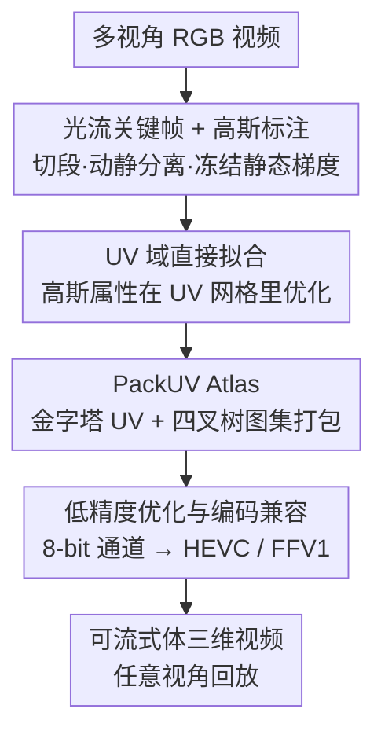

# PackUV: Packed Gaussian UV Maps for 4D Volumetric Video

**会议**: CVPR 2026  
**论文**: [CVF Open Access](https://openaccess.thecvf.com/content/CVPR2026/html/Rai_PackUV_Packed_Gaussian_UV_Maps_for_4D_Volumetric_Video_CVPR_2026_paper.html)  
**代码**: [项目主页](https://ivl.cs.brown.edu/packuv)  
**领域**: 3D视觉  
**关键词**: 体三维视频, 3D高斯, UV图集, 视频编码, 时序一致性

## 一句话总结
PackUV 把 4D 高斯（3DGS 序列）的全部属性"打包"成一段结构化的多尺度 2D UV 图集，再配上一个直接在 UV 域里拟合、用光流关键帧+动静分离稳住长序列的方法 PackUV-GS，让体三维视频第一次可以无损地用 HEVC / FFV1 等标准视频编码器存储和流式传输，在最长 30 分钟、大运动、频繁遮挡消失的场景里渲染质量超过现有所有 baseline。

## 研究背景与动机
**领域现状**：体三维视频（volumetric video）要从多相机视角重建出可任意视角观看的动态 4D 场景。3D Gaussian Splatting（3DGS）凭借高质量、实时渲染成了主流表示，后续一批工作（Deformable3DGS、4DGS、RealTime4DGS、3DGStream 等）把它扩展到动态场景。

**现有痛点**：这些方法卡在三处。基于变形场（deformation field）的方法只能处理几秒的短序列，显存开销大、扩展不到长视频，更没法建模"新物体进入画面"这类遮挡消失（disocclusion）。在线/流式方法（3DGStream、ATGS）虽支持更长序列，但长程时序一致性差、遇到大运动会退化甚至梯度爆炸。更关键的是，这些方法产出的 4D 高斯属性是**非结构化、置换不变的点集**，体积巨大且需要自定义压缩，**完全无法接入现成的视频编解码基础设施**——这等于挡死了实际的存储与流式分发。

**核心矛盾**：3DGS 的强项（无序点集、置换不变）正是它接不进视频编码的根因——视频编码器吃的是结构化、空间排序好、时序连贯的 2D 图像帧。已有的"3DGS 转 2D"思路（UVGS、SOG）要么只针对静态场景，要么是**先优化好 3DGS 再做事后 UV 投影**——这种后处理只投影了高斯中心、丢掉了表面细节，本身有损且对预训练好的 4D 序列会造成画面缺失与时序抖动。

**本文目标**：找到一种既保留 UV 映射的结构优势、又不损失 3DGS 重建质量、还能覆盖任意时长动态场景的 4D 表示，并让它原生兼容标准视频编码。

**核心 idea**：不要"先训 3DGS 再投影"，而是**直接在 UV 域里拟合高斯**，把所有高斯属性组织成一段递进的多尺度 UV 图集（PackUV），再用光流关键帧+动静标注的流式拟合（PackUV-GS）稳住长序列，最后用低精度优化让每个通道落到 8-bit，从而直接喂给 HEVC / FFV1。

## 方法详解

### 整体框架
PackUV 包含两部分：**PackUV** 是表示（怎么把 4D 高斯排成可编码的图集），**PackUV-GS** 是拟合方法（怎么从多视角视频直接长出这种表示）。

预备知识：3DGS 把场景表示为一组高斯基元，每个有位置 $\mu\in\mathbb{R}^3$、协方差 $\Sigma$、球谐颜色 $c$、不透明度 $o$。UVGS 则把每个中心 $\mu_i=(x_i,y_i,z_i)$ 转成球坐标 $(\rho_i,\theta_i,\phi_i)$，再把方位角/极角离散化到 $M\times N$ 的 UV 图：

$$u_i=\left\lfloor\frac{\pi+\theta_i}{2\pi}\times M\right\rfloor,\quad v_i=\left\lfloor\frac{\phi_i}{\pi}\times N\right\rfloor.$$

多个高斯可能落到同一 UV 像素，UVGS 用 $K$ 层、按不透明度排序在每个像素存最靠表面的若干个，得到映射 $f(u,v,k)=\{\rho,r,s,o,c\}\in\mathbb{R}^D$。PackUV 沿用这个"点→图"的离散化，但把它从一次性后处理变成**贯穿优化全程的约束**，并在存储侧做金字塔+图集打包。

运行管线：多视角 RGB 视频 → 光流切关键帧分段 → 逐相机算光流、标注动态/静态高斯 → 在 UV 域直接优化高斯属性 → 收敛后把 $K$ 层金字塔打包进单张图集 → 低精度量化使每通道为 8-bit → 用标准视频编码器存成可流式的体三维视频。

### 关键设计

**1. 光流关键帧 + 高斯标注：用动静分离稳住长序列与遮挡消失**

这一步针对的痛点是：变形场方法撑不住长序列、流式方法在大运动/新物体进入时会退化抖动。PackUV-GS 把每段多视角视频切成 $m$ 个时间分段——对某一路视频逐帧算光流幅度 $M(t)$，取幅度最高的 $m-1$ 个峰值（峰间最小间隔 $\theta$）作为分段边界，每段首帧设为**关键帧**；关键帧从上一关键帧初始化以保证时空连贯，段内的过渡帧从前一帧初始化、只做少量迭代精修。出现高漂移、遮挡/遮挡消失、外观突变的帧会被"提拔"成新关键帧。这种分段流式调度既能处理任意长度，又能并行拟合，还在关键帧处重置梯度防止质量随时间累积退化。

在此之上叠加**高斯标注**做动静分离：逐相机用 RAFT 估前向光流 $F^c_{(t-1)\to t}$，对幅度阈值化并膨胀得到二值运动掩码 $M^c_t(p)=\mathbb{1}[\,\|F^c_{t-1\to t}(p)\|_2>\tau\,]$（再 dilate 半径 $r$ 补上下文）。判断某个高斯是否动态时不是只看中心像素，而是用**协方差感知**的投影——按 EWA splatting 把 3D 协方差投到图像得 $\Sigma^{2D}_{i,c}=J_c\Sigma^{3D}_{i,cam}J_c^\top$，再用马氏距离 $d^2(p)=(p-m_{i,c})^\top(\Sigma^{2D}_{i,c})^{-1}(p-m_{i,c})\le 9$ 框出该高斯覆盖的椭圆区域；只要椭圆内任一像素落在运动掩码里，这个高斯就在该相机下标为动态，跨相机做 OR 聚合 $D_i=\bigvee_c D_{i,c}$。整套用自定义 CUDA kernel 做到实时。标注完后**冻结静态高斯的梯度** $\nabla_{\theta_i}L\leftarrow D_i\,\nabla_{\theta_i}L$，并周期性重置静态高斯的优化器动量防漂移；致密化时子高斯继承父的动静标签，保持训练中的动态比例。这样既稳住了静态背景、又把算力集中到真正在动的区域，是它能在大运动+遮挡消失下保持时序一致的核心。

**2. UV 域直接拟合：把"先训后投影"换成原生在 UV 里优化**

针对 UVGS 那种事后投影有损、丢表面细节的问题，PackUV-GS 不再先拟合 3DGS 再投到 UV，而是**直接在 UV 空间优化高斯**。用固定的空间分辨率和预设层数 $K$，令 UV 张量 $U\in\mathbb{R}^{M\times N\times K\times D}$ 在 $U[u_i,v_i,k]=g_i=\{\rho_i,r_i,s_i,o_i,c_i\}$ 处存高斯属性。直接优化既保留了结构化的下游友好性，又通过离散 UV 网格**天然强制了高斯稀疏性**。为配合这个离散约束，引入两条 UV 剪枝：**有效 UV 投影剪枝**——致密化后重算每个子高斯的 UV 坐标，不满足离散映射的直接剪掉，让高斯更贴合场景几何；**Max-K UV 剪枝**——每个像素只保留按不透明度排名前 $K$ 的高斯 $G_{uv}\leftarrow\text{TopK}(G_{uv},K)$，防止单像素过度堆积。消融里去掉直接 UV 优化（退回事后投影）PSNR 从 27.41 掉到 23.81，是掉点第二大的组件。

**3. PackUV Atlas：金字塔 UV + 四叉树图集打包，省存储又对编码器友好**

如果把全部 $K$ 层都按 $M\times N$ 全分辨率存，对高分辨率动态序列内存开销巨大。作者的关键观察是：按不透明度排序后，**越深的层（K 越大）可见高斯越少**（遮挡+排序所致）。于是改用**金字塔式递进分辨率**——交替对两个维度减半：$k=0$ 用 $M_0\times N_0$，奇数层减 $N$、偶数层减 $M$，得到 $\{M_0\times N_0,\ M_0\times N_0/2,\ M_0/2\times N_0/2,\dots\}$ 的递减序列，匹配深层的稀疏性。再把这些金字塔层用类似**四叉树的递归细分**打包进单张图集 $A$：第 0 层占右侧全分辨率区，L1（逆时针转 90°）和 L2（水平）细分左侧区，更深层继续向右递归、奇偶层交替朝向、分辨率逐级变细。图集宽 $W_A=N_0+\sum_{k=1}^{K-1}N_k$、高 $H_A=\max_k M_k$。这种打包达到 **88.5% 的像素利用率**，远高于网格布局（约 60%）和纯金字塔（约 75%）。最后把每帧一张这样的 UV 图集排成连续序列就构成体三维视频；训练时各层维持各自的递进分辨率，收敛后才打包成图集存储/流式。

**4. 低精度优化与编码兼容：让每通道落到 8-bit，直接喂给标准视频编码器**

这是"接进视频基础设施"的临门一脚。以往方法是**训练后再量化**（有损的后处理量化），PackUV-GS 改成**训练中的低精度优化（LPO）**：每次迭代渲染器吃的是均匀量化的 $K$-bit 代理 $\tilde\theta$，梯度通过 straight-through estimator 回流、FP32 主权重照常更新，损失（L1+SSIM）和优化器（Sparse Adam）都不变。这样在训练里就把量化误差"补偿"掉了，几乎无损还不掉训练速度。具体用 8-bit 存 $s,r,\alpha,c$、16-bit 存 $x$（再拆成两个 8-bit 通道存储）。因为整段 PackUV 全是 8-bit 图像，就能把层分组成 8-bit 三元组、用 FFmpeg 接 FFV1 / HuffYUV 等无损编码器直接编码；每通道按全序列的 min/max 全局归一化，再传一个紧凑的归一化参数 sidecar 保证 bit-exact 可逆解码。实测在 FFV1 无损设置下重建零误差——这是第一个能把标准视频编码**直接应用到全部 3DGS 属性、且转换零质量损失**的统一表示。

### 损失函数 / 训练策略
光度损失混合 L1 与 SSIM：$L_{photo}=(1-\lambda_{ssim})\|\hat I^c_t-I^c_t\|_1+\lambda_{ssim}(1-\text{SSIM}(\hat I^c_t,I^c_t))$。再加尺度正则 $L_{scale}=\mathbb{E}_i[\max\{0,\max(s_i)-s_{max}\}]^2$ 和不透明度正则 $L_{opacity}=\mathbb{E}_i\,\alpha_i(1-\alpha_i)$（可只施加在动态高斯上）抑制 floater 和过大基元，总损失 $L=L_{photo}+L_{depth}+\lambda_{scale}L_{scale}+\lambda_{opacity}L_{opacity}$。配置：图集分辨率 $M_0=N_0=1024$、UV 层数 $K=8$、关键帧 $\theta=30$、$\lambda_{scale}=\lambda_{opacity}=0.0001$；所有实验在单张 RTX 3090 上完成。

## 实验关键数据

### 主实验
在 PackUV-2B、SelfCap、N3DV 三个数据集上，按 60 帧窗口报告 PSNR/SSIM/LPIPS，并标注是否支持流式（Stream）与是否兼容视频编码（Codec）。

| 方法 | PackUV-2B PSNR↑ | SelfCap PSNR↑ | N3DV PSNR↑ | Stream | Codec |
|------|------|------|------|------|------|
| 3DGStream | 23.17 | 19.77 | 31.17 | Full | No |
| 4DGS | 23.11 | 19.56 | 29.81 | No | No |
| RealTime4DGS | 21.37 | 19.46 | 32.29 | No | No |
| ATGS | 21.42 | 15.48 | 30.99 | Pseudo | No |
| GIFStream | 21.92 | 19.78 | 31.10 | Pseudo | Partial |
| **PackUV-GS（本文）** | **27.41** | **22.52** | **32.81** | Full | Full |

在最具挑战的 PackUV-2B（大运动、遮挡消失、360° 覆盖）上，PackUV-GS 比次优的 3DGStream 高出 **4.2 dB PSNR**；在 SelfCap 长序列上比 GIFStream 高约 2.7 dB；N3DV（前向、运动较小）上也略优。同时它是唯一**既 Full 流式、又 Full 编码兼容**的方法，训练时长（约 1.05 h）与最快的流式方法相当。论文还展示可扩展到最长 **30 分钟**的序列且质量保持一致。

### 消融实验
在 PackUV-2B 上逐组件消融（PSNR / SSIM / LPIPS）：

| 配置 | PSNR↑ | SSIM↑ | LPIPS↓ | 说明 |
|------|------|------|------|------|
| Full（完整模型） | 27.41 | 0.84 | 0.28 | — |
| w/o Keyframe | 20.95 | 0.77 | 0.38 | 去掉关键帧，掉 6.46 dB（最致命） |
| w/o UV Optim | 23.81 | 0.79 | 0.33 | 退回事后 UV 投影，掉 3.60 dB |
| w/o Labeling | 25.42 | 0.82 | 0.31 | 去掉动静标注，掉约 2 dB |
| No Atlas | 27.43 | 0.84 | 0.28 | 不打包图集，质量几乎不变 |
| No LPO | 27.52 | 0.85 | 0.27 | 不做低精度优化，质量基本持平 |
| w/o Codec | 27.41 | 0.84 | 0.28 | 编码无损，与原始一致 |

### 关键发现
- **关键帧贡献最大**：去掉后 PSNR 从 27.41 暴跌到 20.95，证明在关键帧处重置梯度是阻止长序列质量随时间退化的关键。
- **直接 UV 域优化是质量第二大来源**：退回事后投影掉 3.60 dB，印证了"先训后投影有损"的判断。
- **图集打包与 LPO 几乎无损**：No Atlas（27.43）和 No LPO（27.52）甚至与 Full 持平——说明这两步是在**不牺牲质量**的前提下换来了存储压缩和编码兼容，正是它们的设计目标（省存储 / 接编码器，而非提质量）。
- **编码零损失**：FFV1 无损设置下 PackUV 重建零误差，把 4DGS 当成普通视频内容存取成立。
- **数据集 PackUV-2B**：100 个序列、超 20 亿帧、55–88 台同步相机、1920×1200@90FPS、360° 覆盖，序列平均 10 分钟、最长 30 分钟，是迄今在序列长度/相机数/运动复杂度上规模最大的多视角 4D 数据集。

## 亮点与洞察
- **"接进现成基础设施"是最务实的创新**：很多 4DGS 工作追求更高 PSNR，PackUV 真正稀缺的价值是让 4D 高斯**第一次能直接用 HEVC/FFV1 无损编码**——把研究成果从"实验室能跑"推到"能流式分发"，这个系统视角比单纯刷点更有工程意义。
- **"深层更稀疏"这个观察被一层层吃干净**：从按不透明度排序 → 金字塔递减分辨率 → 四叉树图集打包（88.5% 利用率），同一个观察既省了存储又没掉质量（No Atlas 消融几乎不掉点），是很干净的"观察驱动设计"。
- **协方差感知的动态判定可迁移**：用马氏距离 $d^2\le 9$ + 椭圆覆盖判断高斯是否落在运动区域，比只看中心像素鲁棒得多，这套思路可迁移到任何需要"高斯级别动静分离 / 选择性更新"的动态 3DGS 任务。
- **训练中低精度（LPO）替代训练后量化**：straight-through + FP32 主权重让量化误差在训练里被补偿，几乎无损又直接产出 8-bit 可编码图像，是把"压缩"前移进优化的好范式。

## 局限与展望
- **重度依赖光流质量**：关键帧切分和动静标注都建立在 RAFT 光流上，光流在反光、透明、极快运动下若失效，动静分离和分段会跟着出错——而这些恰恰是 PackUV-2B 标榜的难场景。⚠️ 论文未给出光流失败时的退化分析。
- **球面 UV 投影的固有约束**：把高斯按球坐标投到 UV 图，对单中心、近似凸的场景友好，但对**多个分散主体、强自遮挡的复杂拓扑**是否会出现 UV 拥挤/冲突，正文未深入讨论。
- **数据集与方法强绑定**：最亮眼的 4.2 dB 增益来自自采的 PackUV-2B，而在前向、小运动的 N3DV 上优势收窄到 < 0.6 dB——说明增益主要体现在长序列/大运动场景，普通短序列下相对优势有限。
- **改进思路**：可探索把光流换成更鲁棒的运动估计（或多线索融合）、对多主体场景做自适应多球面/分块 UV 布局，以及把 LPO 推到更低 bit 配合有损编码探索质量-码率曲线。

## 相关工作与启发
- **vs UVGS / UV 投影类（事后投影）**：它们先优化好 3DGS 再投到 UV，只投影中心、丢表面细节、对 4D 序列有损且时序抖；本文**直接在 UV 域优化**并用 UV 剪枝强制结构，从源头避免后处理损失——消融里这一项值 3.6 dB。
- **vs 变形场方法（Deformable3DGS / 4DGS / Grid4D）**：它们用变形网络把规范高斯映到各时刻，显存大、扩展不到长序列、建模不了新物体进入；本文用流式关键帧+动静分离，支持任意时长且能处理遮挡消失。
- **vs 流式方法（3DGStream / ATGS / GIFStream）**：它们能跑长序列但时序一致性差（3DGStream 大运动退化、ATGS 梯度爆炸、GIFStream 分段闪烁），且高斯属性非结构化、接不进标准编码（最多 Partial）；本文是唯一 Full 流式 + Full 编码兼容，且 PSNR 全面更高。
- **vs 静态 Gaussian 压缩（SOG / 各类剪枝量化）**：它们只针对静态 3D 场景，naively 堆成 4D 序列体积仍然爆炸；本文把时序连贯性和图集结构一起设计，使图集序列具备强时空局部性，才让视频编码器真正吃得动。

## 评分
- 新颖性: ⭐⭐⭐⭐⭐ 第一个让全部 3DGS 属性零损失直接接入标准视频编码的统一 4D 表示，系统视角的创新很扎实。
- 实验充分度: ⭐⭐⭐⭐⭐ 三数据集对比 + 7 组消融 + 自建 20 亿帧大规模数据集，覆盖质量、流式、编码三个维度。
- 写作质量: ⭐⭐⭐⭐ 方法与公式清晰、观察驱动设计讲得明白；个别图集打包细节需配图才完全看懂。
- 价值: ⭐⭐⭐⭐⭐ 把 4D 高斯推到"可用现成基础设施流式分发"，对 AR/VR、体三维内容落地有直接工程价值。

<!-- RELATED:START -->

## 相关论文

- [\[CVPR 2026\] Volumetric Functional Maps](volumetric_functional_maps.md)
- [\[CVPR 2026\] V-DPM: 4D Video Reconstruction with Dynamic Point Maps](v-dpm_4d_video_reconstruction_with_dynamic_point_maps.md)
- [\[CVPR 2026\] MV2UV: Generating High-quality UV Texture Maps with Multiview Prompts](mv2uv_generating_high-quality_uv_texture_maps_with_multiview_prompts.md)
- [\[CVPR 2026\] GP-4DGS: Probabilistic 4D Gaussian Splatting from Monocular Video via Variational Gaussian Processes](gp-4dgs_probabilistic_4d_gaussian_splatting_from_monocular_video_via_variational.md)
- [\[CVPR 2026\] Vista4D: Video Reshooting with 4D Point Clouds](vista4d_video_reshooting_with_4d_point_clouds.md)

<!-- RELATED:END -->
