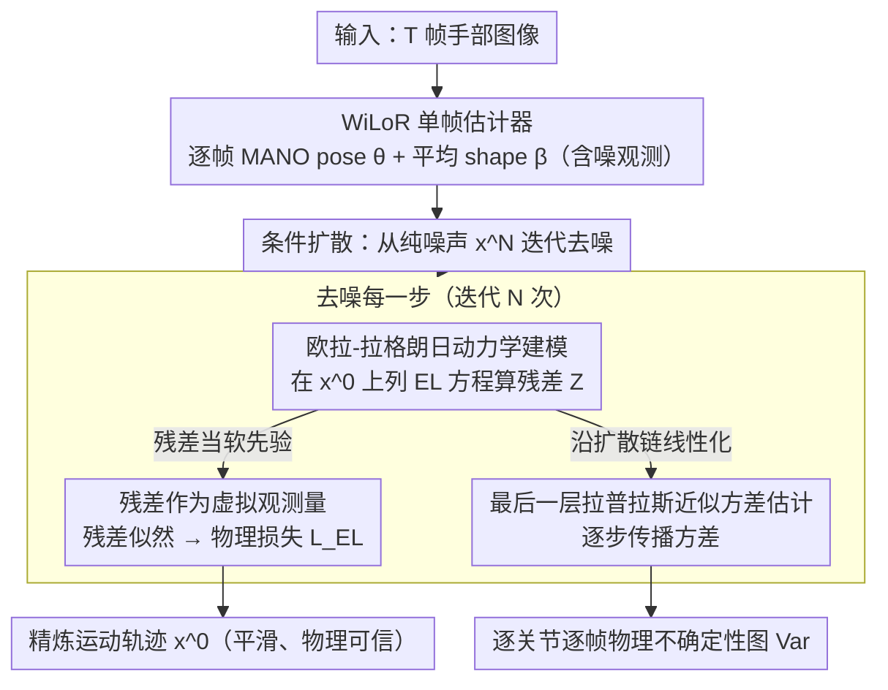

# PAD-Hand: Physics-Aware Diffusion for Hand Motion Recovery

**会议**: CVPR 2026  
**arXiv**: [2603.26068](https://arxiv.org/abs/2603.26068)  
**代码**: 无  
**领域**: 3D视觉  
**关键词**: 手部运动恢复, 物理感知扩散模型, 欧拉-拉格朗日动力学, 拉普拉斯近似, 不确定性估计

## 一句话总结

提出 PAD-Hand，一个物理感知的条件扩散框架，将欧拉-拉格朗日动力学残差建模为虚拟观测量融入扩散过程，同时通过最后一层拉普拉斯近似估计逐关节、逐帧的动态方差，实现了兼具物理可信度和不确定性感知的手部运动恢复，在 DexYCB 上加速度误差降低 50.1%。

## 研究背景与动机

1. **领域现状**：单目手部3D重建取得了显著进展，大规模预训练模型（如 WiLoR）提高了单帧精度，但时序不一致性仍然存在。现有方法主要捕获手部运动学模式，对动力学不敏感。

2. **现有痛点**：(1) 基于图像的估计缺乏时序一致性，帧间存在抖动；(2) 现有物理约束方法（如直接将 EL 残差强制为零）是确定性的——假设观测运动能完全满足物理方程，忽略了估计噪声和物理模型近似性带来的不确定性；(3) 确定性物理约束可能导致困难的优化景观或次优解。

3. **核心矛盾**：3D 手部估计本身含噪且物理模型只是近似，强制零残差的假设与现实不符。需要一种概率化的物理集成方式，允许模型在运动数据流形上推理并产生分布式的解空间。

4. **本文目标** (1) 概率化地将物理动力学集成到扩散模型中，替代硬约束；(2) 提供可解释的物理一致性度量（方差），指示哪些帧/关节的估计不可靠。

5. **切入角度**：将 EL 动力学残差视为从某分布采样的"虚拟观测量"，其似然与视觉数据项耦合来引导反向扩散过程。

6. **核心 idea**：用概率物理（虚拟观测量 + 拉普拉斯近似方差）替代确定性物理约束来做扩散手部运动恢复。

## 方法详解

### 整体框架

这篇论文要解决的是单目手部重建里时序抖动、且现有物理约束「一刀切强制残差为零」的问题。整个流程分两段：先用现成的单帧图像估计器（如 WiLoR）从 T 帧图像里拿到逐帧 MANO pose $\theta_{1:T}$ 和一个平均 shape $\beta_{avg}$，作为含噪的初始观测；再把这些观测喂给一个条件扩散模型，从纯噪声状态 $x^N_{1:T}$ 出发迭代去噪，逐步逼近平滑、物理可信的清洁运动 $x^0_{1:T}$。与普通扩散不同的是，去噪每一步都会顺带把动力学残差的方差 $\text{Var}(\mathcal{F}^n_{1:T})$ 也传播下来，所以最终不仅输出精炼后的轨迹 $x^0_{1:T}$，还给出一份逐关节、逐帧的物理不确定性图 $\text{Var}(\mathcal{F}^0_{1:T})$，告诉你哪些帧"物理上靠不住"。

### 关键设计

**1. 欧拉-拉格朗日手部动力学建模：给铰接手一套从第一原理出发的物理方程**

时序抖动的根源是网络只学到了运动学模式、对动力学不敏感，所以作者不靠数据隐式学物理先验，而是直接把手当成一个刚体连杆系统来列动力学方程。以广义坐标 $\mathtt{q} = \{R, t, \theta\}$（腕部旋转、平移、15 个关节角）写出欧拉-拉格朗日方程

$$M\ddot{q} + C + g = \mathcal{F}$$

其中 $M$ 是广义质量矩阵、$C$ 是科里奥利/离心力、$g$ 是重力项、$\mathcal{F}$ 是净广义力。这里 $M$ 和 $g$ 不是拍脑袋设的：每个手部部件的质量和惯性张量是把 MANO 网格四面体化算出体积、再乘以文献给的密度 $\rho$ 得到的。有了这套方程，任何一段运动是否符合物理就有了可计算的标尺。

**2. 动力学残差作为虚拟观测量的概率物理集成：把物理从硬约束改成软先验**

旧方法（包括本文要对比的确定性 baseline）直接把上面方程的残差强制压到零，等于假设"观测到的运动完美满足物理"——但 3D 估计本身有噪、物理模型也只是近似，这个假设站不住，硬压反而会把优化景观弄崎岖。作者的做法是先在去噪结果上算 EL 残差

$$Z_t = M_t\ddot{q}_t + C_t + g_t - \hat{\mathcal{F}}_t$$

然后不把它当作"必须为零的约束"，而当作一个**从 $\mathcal{N}(Z(x^0_{1:T}), \sigma^2 I)$ 采样出来的虚拟观测量**：物理上越合理的运动残差越接近 0、似然越高。取这个似然的负对数就得到物理损失 $\mathcal{L}_{EL} = \frac{1}{2\sigma_n}\|Z_{1:T}(x^0_{1:T})\|^2$，它和视觉数据项一起耦合进扩散目标，让模型在"贴合图像"和"符合物理"之间自己权衡，而不被近似的物理模型带偏。一个容易忽略但关键的细节：残差必须在反向扩散真正采样得到的 $x^0_{1:T}$ 上算，而不是网络一步直接预测的 $\hat{x}_{1:T}$——因为 $Z$ 是非线性的，由 Jensen 不等式 $Z(\mathbb{E}[x^0]) \neq \mathbb{E}[Z(x^0)]$，在预测均值上算残差会算错。

**3. 最后一层拉普拉斯近似方差估计（LLLA）：让模型说出"这帧我有多不确定"**

既然物理被当成概率项，那不确定性就应该是可量化、可输出的，而不只是个隐含状态。作者只对 backbone 最后一层参数做后验拉普拉斯近似（LLLA，开销远小于对全网络做贝叶斯），得到预测的高斯后验 $p(\hat{x}_{1:T}|x^n_{1:T},n,D) \approx \mathcal{N}(f_\phi, \text{diag}(\gamma^2_\phi))$。难点在于这只是单步的方差，要拿到最终轨迹的不确定性得让方差"穿过"整条反向扩散链，所以每一步按下式递推传播：

$$\text{Var}(x^{n-1}_{1:T}) = A_n^2\text{Var}(x^n_{1:T}) + B_n^2\text{Var}(\hat{x}_{1:T}) + \Sigma_n^2 + 2A_nB_n\text{Cov}(x^n, \hat{x})$$

传到 $x^0$ 后，再用雅可比线性化把状态方差映射成力的方差 $\text{Var}(\mathcal{F}_{1:T}) \approx J_{\mathcal{F}} \text{Var}(x^0_{1:T}) J^\top_{\mathcal{F}}$。最终得到的就是逐关节、逐帧的动力学方差图——方差高的地方正对应物理一致性弱、估计不可靠的帧/关节，可以直接当下游任务的可信度信号用。

### 损失函数 / 训练策略

- 总损失：$\mathcal{L}_{total} = \lambda_1 \mathcal{L}_{data} + \lambda_2 \mathcal{L}_{EL}$，其中 $\lambda_1 = 2000, \lambda_2 = 500$
- 数据损失：$\mathcal{L}_{data} = \mathbb{E}_{n}\|x_{1:T} - f_\phi(x^n_{1:T}, y_{1:T}, n)\|^2$
- Backbone: Transformer encoder-decoder（4层encoder+4层decoder，8头，dim=512），MeshCNN 提取空间特征
- 序列长度 T=16，扩散步数 N=4，蒙特卡洛样本 S=20
- AdamW，lr=$2\times10^{-4}$，每10个epoch衰减0.8

## 实验关键数据

### 主实验

DexYCB 结果（从 WiLoR 初始化）：

| 方法 | 输入 | 类型 | PA-MPJPE↓ | MPJPE↓ | ACCEL↓ |
|------|------|------|-----------|--------|--------|
| WiLoR | 图像 | D | 4.88 | 12.75 | 6.70 |
| Deformer | 序列 | D | 5.22 | 13.64 | 6.77 |
| TCMR | 序列 | D | 6.28 | 16.03 | - |
| MaskHand | 图像 | P | 5.0 | 11.70 | - |
| **PAD-Hand** | 序列 | P | **4.63** | **10.56** | **3.34** |

HO3D 结果：

| 方法 | PA-MPJPE↓ | ACCEL↓ |
|------|-----------|--------|
| WiLoR | 7.50 | 4.98 |
| Deformer | 9.40 | 6.37 |
| **PAD-Hand** | **7.43** | **2.71** |

### 消融实验

DexYCB 上各组件消融：

| 配置 | PA-MPJPE↓ | MPJPE↓ | ACCEL↓ |
|------|-----------|--------|--------|
| WiLoR (baseline) | 4.88 | 12.75 | 6.70 |
| 仅 $\mathcal{L}_{data}$ | 4.65 | 10.62 | 3.36 |
| $\mathcal{L}_{data} + \mathcal{L}^D_{EL}$ (确定性物理) | 4.66 | 10.61 | 3.35 |
| $\mathcal{L}_{data} + \mathcal{L}_{EL}$ (概率物理, Ours) | **4.63** | **10.56** | **3.34** |

### 关键发现

- **加速度误差降低 50.1%**：从 6.70 降至 3.34 mm/frame²，说明物理约束极大改善了运动平滑性
- **PA-MPJPE 下降 5.1%，MPJPE 下降 17.2%**：在不牺牲甚至提升重建精度的前提下改善物理合理性
- **概率物理优于确定性物理**：概率方式在所有指标上一致优于确定性惩罚 $\mathcal{L}^D_{EL}$，验证了将残差建模为虚拟观测量的必要性
- **方差与 EL 残差高度对齐**：高方差区间与高物理残差（即物理不合理运动）重合，证明方差估计是可靠的不确定性指标
- **在 HO3D 上 ACCEL 从 4.98 降至 2.71（降 45.6%）**：跨数据集一致的改善证明方法泛化性好

## 亮点与洞察

- **虚拟观测量思路将物理从硬约束变为软先验**：不强制物理残差为零，而是将其似然融入扩散目标，允许物理模型的近似性和观测噪声共存。这个思路可迁移到任何需要物理约束的生成模型
- **方差传播贯穿整个扩散过程**：从最后一步的 Dirac delta 开始，每步通过公式传播方差，最终得到 $x^0$ 的方差。这种贯穿式的不确定性传播在扩散模型中较为少见
- **MeshCNN + Transformer 结合拓扑感知空间特征和时序依赖**：用 MeshCNN 提取手部网格的拓扑特征再送入 Transformer 做时序建模，是一种精巧的设计

## 局限与展望

- 物理模型未显式建模物体几何和接触力，限制了手-物交互场景的精度
- 方差估计依赖 LLLA 近似和蒙特卡洛采样（S=20），计算开销较高
- 仅在 MANO 模型上验证，未扩展到全身或其他铰接体
- 扩散步数仅为 4 步，虽高效但可能限制了复杂运动的建模能力

## 相关工作与启发

- **vs Zhang et al. (2025)**: 前作也用扩散模型+物理正则化，但依赖手-物接近度作为条件且是确定性物理，本文用概率化 EL 残差且不依赖物体信息
- **vs BioPR**: 确定性物理约束方法，MPJPE 12.81 vs 本文 10.56，差距明显
- **vs Rixner et al./Bastek et al.**: 将虚拟观测量概念从物理信息扩散模型的一般框架引入3D手部领域，并首次加入方差估计
- 方差估计可直接用于主动学习（标注高方差序列）或后续手-物交互建模的信心度权重

## 评分

- 新颖性: ⭐⭐⭐⭐ 概率物理集成+扩散方差传播的组合是新的，但各子组件有前期工作基础
- 实验充分度: ⭐⭐⭐⭐ DexYCB+HO3D 两个数据集，消融设计清晰，定性方差可视化有说服力
- 写作质量: ⭐⭐⭐⭐ 数学推导严谨，但公式密集度较高
- 价值: ⭐⭐⭐⭐ 为手部运动恢复引入了物理一致性量化指标，对AR/VR和具身AI有实用价值

<!-- RELATED:START -->

## 相关论文

- [\[CVPR 2026\] HandDreamer: Zero-Shot Text to 3D Hand Model Generation using Corrective Hand Shape Guidance](handdreamer_zero-shot_text_to_3d_hand_model_generation_using_corrective_hand_sha.md)
- [\[CVPR 2026\] UST-Hand: An Uncertainty-aware Spatiotemporal Point Cloud Interaction Network for 3D Self-supervised Hand Pose Estimation](ust-hand_an_uncertainty-aware_spatiotemporal_point_cloud_interaction_network_for.md)
- [\[ICML 2026\] PhysHanDI: Physics-Based Reconstruction of Hand-Deformable Object Interactions](../../ICML2026/3d_vision/physhandi_physics-based_reconstruction_of_hand-deformable_object_interactions.md)
- [\[CVPR 2026\] TokenHand: Discrete Token Representation for Efficient Hand Mesh Reconstruction](tokenhand_discrete_token_representation_for_efficient_hand_mesh_reconstruction.md)
- [\[CVPR 2026\] Glove2Hand: Synthesizing Natural Hand-Object Interaction from Multi-Modal Sensing Gloves](glove2hand_synthesizing_natural_hand-object_interaction_from_multi-modal_sensing.md)

<!-- RELATED:END -->
