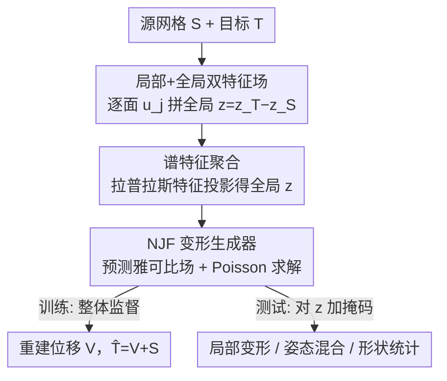

# PaNDaS: Learnable Shape Interpolation Modeling with Localized Control

**会议**: CVPR 2026  
**论文**: [CVF Open Access](https://openaccess.thecvf.com/content/CVPR2026/html/Besnier_PaNDaS_Learnable_Shape_Interpolation_Modeling_with_Localized_Control_CVPR_2026_paper.html)  
**代码**: 无（项目页 https://daidedou.sorpi.fr/publication/pandas ）  
**领域**: 3D视觉  
**关键词**: 网格变形, 非刚性形状插值, 局部控制, 神经雅可比场, 三角网格

## 一句话总结
PaNDaS 用「源网格上的逐面局部特征 + 目标网格的全局编码」拼出一个变形特征场，喂给基于神经雅可比场的变形生成器，只用整体变形监督训练，却能在测试期通过对全局特征做二值掩码实现任意区域的局部非刚性插值，在手/身体/脸三类网格上同时刷新整体与局部插值精度。

## 研究背景与动机
**领域现状**：3D 形状插值（给定源网格 $S$ 和目标 $T$，求一条自然、近等距的非刚性运动轨迹 $\gamma:[0,1]\to D(S)$）是动画、动作建模、角色生成的基石。主流做法分两类：一类是几何优化（ARAP、各种弹性/黎曼度量下的测地线），另一类是用自编码器把形状压进一个全局 latent，再在 latent 空间插值（ARAPReg、LIMP、3D-CODED、NJF 等）。

**现有痛点**：① 基于手柄（handle）的方法（ARAP、Neural Shape Deformation Prior）只给最终目标变形，给不出中间帧——直接线性插值源/目标会得到穿模、不物理的中间姿态；② 把变形塞进一个**全局** latent 向量的方法，难以做**局部控制**，因为单个向量牵一发动全身；③ 已有的局部控制方法要么把 latent 点和顶点的对应关系在训练前写死（VCMC，细节受限、拓扑固定），要么依赖纹理图/用户 prompt/骨骼关节等额外先验并需要昂贵的测试期优化；④ SMPL/MANO 这类参数化模板能局部控制，但要人工绑定 rig 和 skinning，且把几何投影到低维粗模板，手指、脸、衣物的高频细节会被抹平。

**核心矛盾**：「局部可控」和「无需匹配/无需模板/无额外先验」之间的矛盾——想要顶点级的局部编辑，传统路线要么牺牲泛化（写死对应），要么牺牲易用性（要 rig、要纹理、要优化）。

**本文目标**：在纯数据驱动、不算对应图、不依赖模板与纹理的前提下，对源网格的**任选区域**预测出完整、近等距、物理合理的非刚性运动轨迹，并能跨未配准的原始扫描泛化。

**切入角度**：与其用一个全局 latent 表示整个形状，不如**同时学一个全局形状 latent 和一个逐点的局部 latent**——把变形信息摊到每个三角面上，局部控制就变成了对局部特征的直接操作（掩码）。

**核心 idea**：用「逐面局部特征场 + 全局编码」替代单一全局 latent，配合神经雅可比场生成变形；训练只用整体变形，掩码只在测试期作用于全局特征，从而零成本地把整体变形模型变成局部可控的插值器。

## 方法详解

### 整体框架
PaNDaS 的核心是一个变形模型：输入中性姿态源网格 $S$ 和目标变形 $T$，输出 $S$ 的逐顶点位移 $V=(v_i)$，使 $\hat T = V + S \simeq T$。它由三个模块串成。先在源网格 $S$ 上用 DiffusionNet 抽取每个三角面 $t_j$ 的**局部变形特征** $u_j=g_{\theta_2}(S)_j\in\mathbb{R}^l$；再用一个全局编码器 $f_{\theta_1}$ 把目标 $T$ 压成**全局特征** $z=f_{\theta_1}(T)\in\mathbb{R}^r$。两者拼成逐面的变形特征场 $\omega_j=(u_j,z)$，喂给**变形生成器** $h_{\theta_3}$：它先从特征预测逐面雅可比矩阵，再通过 Poisson 求解恢复光滑位移场。

关键之处在于：训练时**完全不需要掩码**，只用成对 $(S,T)$ 的整体变形监督；而 $\omega_j=(u_j,0)$ 恰好对应 $(S,S)$（不变形）这一情形，于是测试时只要把全局部分 $z$ 按区域置零（掩码），就能让没被选中的面留在原位、被选中的面变形到目标——一个仅在整体数据上训练的模型，由此泛化出局部变形与姿态混合的能力。

### 关键设计

**1. 局部+全局双 latent 变形特征场：把局部控制从「改全局向量」变成「改每个面」**

针对「单一全局 latent 难以局部控制」的痛点，PaNDaS 不再用一个向量代表整个形状，而是给源网格的每个三角面 $t_j$ 配一份特征 $\omega_j=(u_j,z)$：$u_j$ 是 DiffusionNet 在源网格上抽的逐面局部特征（顶点特征再聚合到面），编码「这块面在源形状里长什么样」；$z$ 是目标网格的全局变形编码，编码「整体要怎么变形」。全局编码用差值形式 $z=z_T-z_S$（$z_S=f(S),\,z_T=f(T)$），保证当 $S=T$ 时 $z=0$、对应不变形。因为局部信息已经摊在每个面上，要做局部控制就不必重训或重新设计 latent 结构，只要在测试期对 $z$ 这一段动手脚即可——这正是后面掩码能生效的根。作者试过更复杂的特征融合策略，重建虽更好，但对新姿态/局部变形泛化变差，所以最终选了最朴素的拼接。

**2. 谱特征聚合：用拉普拉斯特征投影替代 max-pooling，得到对重网格鲁棒的全局编码**

如何把一堆逐面局部特征 $(b_j)_j$ 汇成一个全局向量 $z$，作者提出了一个不同于 max-pooling / 质量加权和的新聚合器。设 $e^k$ 为目标网格 cotangent 拉普拉斯 $\Delta_T$ 的第 $k$ 个特征向量（每个面上取标量 $e^k_j$），把局部特征按特征向量展开 $b_j=p_1 e^1_j + p_2 e^2_j + \cdots$，其中第 $k$ 个特征投影系数为面积加权平均：

$$p_k = \frac{1}{\mathrm{Area}(T)}\sum_{j=1}^{m_T}\mathrm{Area}(t_j)\,b_j\,e^k_j$$

取前 $s$ 个投影系数拼起来过一层线性层得到 $z\in\mathbb{R}^r$（其中 $p_1$ 就是面积加权平均）。用谱基投影而非 max-pooling 的好处是：只要特征抽取器（这里 $f,g$ 都用 DiffusionNet）本身对重网格不变，整套全局编码就对网格连通性/分辨率不敏感，这对处理未配准扫描至关重要。

**3. 神经雅可比场变形生成器：预测雅可比再 Poisson 积分，天然抗重网格**

直接回归顶点位移容易在非线性大形变上失真，PaNDaS 沿用 Neural Jacobian Fields 的思路：生成器先从特征场预测每个面的雅可比矩阵 $J_j$，再求最接近该雅可比场的位移 $V$，即最小化 Poisson 方程

$$\min_V \sum_j \lVert J_j-(\nabla V)_j\rVert^2,\qquad \nabla_S v = \nabla_T M J$$

其中 $M$ 是 $S$ 的质量矩阵，该解可微且可高效求出。与原始 NJF 把三角形质心坐标拼到全局编码不同，PaNDaS 已经有逐面局部特征 $u_j$，所以**直接从 $\omega_j$ 预测雅可比**，省掉了质心拼接。由于预测雅可比所用特征对重网格不变，最终变形也对重网格不变，整套方法因此 by design 鲁棒于重网格。

**4. 测试期掩码：只训整体变形，靠掩码零成本解锁局部插值与姿态混合**

这是把「整体变形模型」变「局部可控插值器」的关键。训练只见过整体 $(S,T)$ 对，掩码只在测试期对全局变形量 $z_T$ 施加一个逐面二值掩码 $M=(M_j)\in\{0,1\}^m$，构造局部特征场 $\omega_j^{\text{partial}}=(u_j,\,M_j\odot z_T)$，再对中性姿态与该局部变形做线性插值即得局部运动：

$$\gamma(t)=h\big((1-t)\,\omega_S + t\,\omega^{\text{partial}}\big)$$

整体插值同理 $\gamma(t)=h\big((1-t)\,\omega_{j,S}+t\,\omega_{j,T}\big)$。姿态混合则更进一步：取 $k$ 个姿态的全局编码 $z_1,\dots,z_k$，各配掩码 $M_1,\dots,M_k$，解码 $z_{\text{new}}=\frac{1}{k}\big(M_1\odot z_1+\cdots+M_k\odot z_k\big)$ 即可拼出全新姿态。由于有 Poisson 求解，变形并不严格限制在掩码内，但作者观察到位移范数离掩码边界越远衰减越快（Fig. 7），因此局部性在实践中成立。⚠️ 边界处偶有局部 artifact，作者把加权掩码/学习式混合留作未来工作。

### 损失函数 / 训练策略
训练时输入中性姿态 $S$ 与其配准目标 $T$，预测重建 $\hat T$。重建损失用 MSE：

$$\mathcal{L}^{\text{rec}}(T,\hat T)=\frac{1}{n_S}\sum_{i=1}^{n_S}\lVert y_i-(x_i+v_i)\rVert_2^2$$

为得到更光滑的变形，额外加一个**法向正则**：由雅可比 $J_j$ 叉积算出变形面的法向 $\vec n_{j,J}$，最小化它与目标法向的余弦距离

$$\mathcal{L}^n(T,\hat T)=\frac{1}{m_T}\sum_{j=1}^{m}\big[1-\vec n_{j,T}\cdot\vec n_{j,J}\big]$$

总损失 $\mathcal{L}=\mathcal{L}^{\text{rec}}+\lambda^n\mathcal{L}^n$。消融显示去掉法向项后中间帧会出现明显抖动/失真（Fig. 5）。

## 实验关键数据

### 主实验
在 MANO（手）、DFAUST（身体）、COMA（脸）三个数据集上评测，整体插值用 MSE 与法向余弦距离 Cosd，扫描用 Hausdorff(HD)/Chamfer(CD)。整体插值对比 ARAPReg、SMS、NJF：

| 数据集 | 指标 | 本文 | ARAPReg | SMS / NJF |
|--------|------|------|---------|-----------|
| DFAUST（均值） | MSE ↓ | **4.1** | 6.2 | 7.2 (SMS) |
| DFAUST（均值） | Cosd ↓ | **0.10** | 0.17 | 0.14 (SMS) |
| COMA（均值） | MSE ↓ | **0.06** | 0.08 | 0.27 (NJF) |
| COMA（均值） | Cosd ↓($10^{-2}$) | **1.3** | 1.4 | 2.5 (NJF) |

整体插值在两个指标上几乎全面领先（DFAUST 的 jumping 这类大幅非线性运动提升最明显，MSE 5.8 vs ARAPReg 10.6 / SMS 14.5）。

### 局部变形与扫描泛化
局部插值（DFAUST 只变左半身）对比 VCMC、局部 ARAP；扫描局部插值对比 NJF、ARAP：

| 任务 | 指标 | 本文 | ARAP | 其他 |
|------|------|------|------|------|
| DFAUST 局部插值（均值） | MSE ↓ | **3.4** | 4.4 | 6.0 (VCMC) |
| DFAUST 局部插值（均值） | Cosd ↓ | 0.09 | **0.08** | 0.15 (VCMC) |
| DFAUST 扫描局部插值 | CD ↓($10^{-3}$) | **4.80** | 6.03 | 6.67 (NJF) |
| DFAUST 扫描局部插值 | HD ↓ | **0.65** | 0.71 | 0.79 (NJF) |

局部 MSE 大幅优于 VCMC 和 ARAP；扫描上 CD/HD 明显超过 NJF 和 ARAP——NJF 把全局变形码拼到顶点坐标，PaNDaS 纯靠特征空间，局部几何表达更好。Cosd 上 ARAP 在配准数据上略优（局部 ARAP 对接近线性的变形本就强），但 ARAP 在大幅偏离线性的运动上会失败。

### 关键发现
- **大幅非线性变形是 PaNDaS 的强项**：DFAUST jumping、扫描局部插值这类 ARAP/线性插值会穿模的场景，提升幅度最大；近线性小变形上 ARAP 仍有竞争力。
- **法向正则贡献明显**：去掉后中间帧出现可见失真，是保证插值序列光滑的关键。
- **抗重网格 + 无需对应/纹理/骨骼**：测试期可直接处理未配准扫描，且局部性来自特征场而非显式约束。
- **掩码局部性是「软」的**：Poisson 求解不保证严格限制在掩码内，但位移随离边界距离快速衰减，实践中局部性足够好。

## 亮点与洞察
- **「训练只见整体、测试靠掩码解锁局部」这一招很巧**：把局部控制从「需要局部监督/写死对应」彻底解耦——只要特征场是逐面的，局部就是全局的一个置零特例，几乎零额外代价。这个思路可迁移到任何「整体编码 → 想要局部编辑」的生成任务。
- **谱投影聚合器**：用拉普拉斯特征基替代 max-pooling 做全局池化，天然继承重网格不变性，是处理未配准扫描的关键 trick，可复用到其他网格全局编码场景。
- **特征场上的算术即语义操作**：在 $\omega$ 上做线性插值、掩码加权求和，就对应插值、姿态混合、偏均值/主成分等统计操作——一个具欧氏结构的特征张量把「形状统计」变成了简单线代。

## 局限与展望
- 作者承认：虽对网格拓扑不变，但**训练仍需配准网格**；未来可探索未配准训练策略（如 [19,58]）直接在原始扫描上训。
- 简单的 latent 掩码会在选区**边界产生局部 artifact**；加权掩码或学习式 latent 混合是改进方向。
- ⚠️ 自评：局部性靠 Poisson 求解的衰减性质保证，缺乏硬约束；对需要严格区域隔离的编辑（如刚性配件）可能不够；论文也未给训练/推理时间与 $\lambda^n$ 的敏感性分析。

## 相关工作与启发
- **vs NJF（Neural Jacobian Fields）**：两者都预测逐面雅可比 + Poisson 积分，但 NJF 把全局变形码拼到顶点坐标、做局部变形会失真；PaNDaS 改为从逐面局部特征 $\omega_j$ 直接预测雅可比、纯靠特征空间，局部几何更准、扫描插值 CD/HD 全面优于 NJF。
- **vs ARAP / 手柄类方法**：ARAP 实时但只给目标变形、给不出中间帧，线性插中间帧会穿模；近线性小变形上 ARAP 的 Cosd 略优，但大幅非线性运动上失败，PaNDaS 用学习的 latent 轨迹补上中间运动。
- **vs ARAPReg / VCMC / SMS**：ARAPReg/SMS 学的是全局形状码插值，局部控制难；VCMC 把 latent 点与顶点关系训练前写死、受限于固定拓扑且细节有限。PaNDaS 的逐面特征场既保证局部细节又不绑定拓扑。
- **vs SMPL/MANO 等参数化模板**：模板能局部控制但要人工 rig/skinning 且抹平高频细节，PaNDaS 在表面域上纯数据驱动，无需模板投影即可保留细节。

## 评分
- 新颖性: ⭐⭐⭐⭐ 「逐面双特征场 + 测试期掩码」把局部控制从需要局部监督彻底解耦，谱聚合器也有新意。
- 实验充分度: ⭐⭐⭐⭐ 覆盖手/身体/脸三域、整体+局部+扫描三类任务，但缺时间成本与超参敏感性分析。
- 写作质量: ⭐⭐⭐⭐ 动机、问题形式化、方法推导清晰，公式完整。
- 价值: ⭐⭐⭐⭐ 无模板/无纹理/无骨骼的局部网格变形，对动画与形状统计实用，思路可迁移。

<!-- RELATED:START -->

## 相关论文

- [\[CVPR 2026\] LoG3D: Ultra-High-Resolution 3D Shape Modeling via Local-to-Global Partitioning](log3d_ultra-high-resolution_3d_shape_modeling_via_local-to-global_partitioning.md)
- [\[ECCV 2024\] ShapeFusion: A 3D Diffusion Model for Localized Shape Editing](../../ECCV2024/3d_vision/shapefusion_a_3d_diffusion_model_for_localized_shape_editing.md)
- [\[CVPR 2026\] OLATverse: A Large-scale Real-world Object Dataset with Precise Lighting Control](olatverse_a_large-scale_real-world_object_dataset_with_precise_lighting_control.md)
- [\[CVPR 2026\] CUBE: Representing 3D Faces with Learnable B-Spline Volumes](cube_bspline_3d_faces.md)
- [\[CVPR 2026\] Solving Minimal Problems Without Matrix Inversion Using FFT-Based Interpolation](solving_minimal_problems_without_matrix_inversion_using_fft-based_interpolation.md)

<!-- RELATED:END -->
