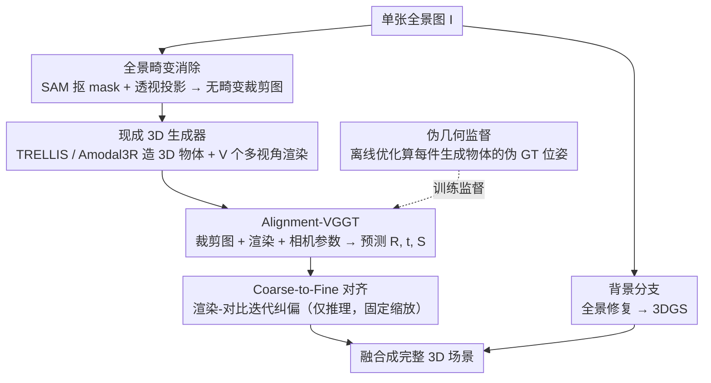

# Pano3DComposer: Feed-Forward Compositional 3D Scene Generation from Single Panoramic Image

**会议**: CVPR 2026  
**arXiv**: [2603.05908](https://arxiv.org/abs/2603.05908)  
**代码**: 有（项目页面）  
**领域**: 3D视觉  
**关键词**: 全景图3D重建, 组合式场景生成, 前馈式变换预测, VGGT, 3D高斯溅射

## 一句话总结
提出 Pano3DComposer，一个从单张全景图出发的模块化前馈式组合3D场景生成框架，通过即插即用的 Object-World Transformation Predictor（基于 Alignment-VGGT）将生成的3D物体从局部坐标转换到世界坐标，约20秒即可在 RTX 4090 上生成高保真3D场景。

## 研究背景与动机
**领域现状**：3D场景生成是 VR/AR 和数字孪生的基础。当前方法主要依赖透视图像，视野有限；全景图能提供360°完整空间上下文，但引入了严重的畸变问题。

**现有痛点**：
   - 前馈式场景理解方法（Total3D、InstPIFu）受限于缺乏精确3D mesh监督和泛化能力不足
   - 前馈式多实例生成模型（MIDI、SceneGen）需要昂贵的微调，且物体生成和布局耦合度高
   - 组合式优化方法（GALA3D、LayoutYour3D）需要耗时的迭代优化，难以满足效率需求
   - 针对全景图的方法（DeepPanoContext、PanoContext-Former）只能生成无纹理的mesh

**核心矛盾**：如何在保持高效率的同时，实现物体生成与布局估计的解耦，并处理全景图的畸变问题

**本文目标**：(a) 耗时的迭代优化 → 前馈式推理；(b) 物体-布局耦合 → 解耦设计；(c) 全景畸变 → 透视投影预处理

**切入角度**：将物体-世界坐标变换问题从困难的3D空间转移到更鲁棒的2D图像空间，利用多视角渲染与目标裁剪图之间的对应关系

**核心 idea**：用 Alignment-VGGT 在一次前馈中预测3D物体从局部坐标到世界坐标的旋转、平移和各向异性缩放

## 方法详解

### 整体框架
这篇论文要解决的问题是：给一张 360° 的全景图，直接前馈式地重建出一个由独立 3D 物体和背景拼起来的可编辑场景，而不靠耗时的逐物体迭代优化。整条流水线接收一张等距柱形全景图 $\mathbf{I} \in \mathbb{R}^{H \times W \times 3}$，先在预处理阶段检测出每个物体并用透视投影把它从扭曲的全景里"摆正"成普通裁剪图；接着物体分支用现成生成器造出 3D 资产、再由核心的 Object-World Transformation Predictor 一次前馈算出把它放回世界坐标的变换；同时背景分支把修复后的全景图转成 3DGS；最后把所有对齐好的物体和背景融合成完整场景。整个解耦设计让"造物体"和"摆物体"两件事互不绑死，生成器可随意替换。

### 关键设计

**1. 全景畸变消除：先把扭曲的物体投影成普通透视图，才喂给现成 3D 生成器**

等距柱形投影会把全景里的物体严重拉扯变形，通用的 image-to-3D 模型见到这种畸变图根本没法正常工作。预处理阶段为每个物体先用 SAM 抠出 mask $\mathbf{M}_i$，再根据它在球面上的经纬度 $(\theta_i, \phi_i)$ 和视野角 $\alpha_i$ 做一次透视投影，得到一张无畸变的裁剪图：

$$\mathbf{I}_i^{\text{crop}} = \Pi_{\text{persp}}(\mathbf{I} \odot \mathbf{M}_i;\ \theta_i, \phi_i, \alpha_i)$$

这样做的好处是把全景特有的麻烦挡在生成器之外——投影完得到的就是一张普通透视图，后面可以接任何现成 3D 生成器（TRELLIS、Amodal3R 等），不必为全景单独训练或微调生成模型。

**2. Alignment-VGGT：把"物体摆回世界坐标"从 3D 难题搬到 2D 图像空间求解**

生成出来的 3D 物体待在自己的局部坐标系里，要摆回场景需要一套旋转 $\mathbf{R}$、平移 $\mathbf{t}$ 和各向异性缩放 $\mathbf{S}$。如果直接在 3D 空间对齐，就得依赖单目全景深度估计，而它本身就不准。本文的做法是把对齐问题搬进 2D：改造 VGGT 架构，输入序列的第一张放目标裁剪图 $\mathbf{I}_i^{\text{crop}}$，后面接生成物体的 $V$ 个多视角渲染 $\{\mathbf{I}_{i,v}^{\text{gen}}\}_{v=1}^V$，并同时喂入已知的相机参数以消除内外参歧义；在 VGGT 原有的相机头之外再加一个缩放头，输出各向异性缩放因子 $\hat{\mathbf{S}} = \text{diag}(\hat{s}_x, \hat{s}_y, \hat{s}_z)$。预测出的相对位姿沿位姿链推回未知的局部外参 $\mathbf{E}_0^{\text{obj}}$，再与世界坐标外参组合，就得到最终的非刚性变换 $\mathbf{T}_i$。之所以有效，是因为多视角渲染和目标裁剪图之间天然存在视觉对应关系，在 2D 图像空间里建立这种对应远比硬啃单目深度鲁棒，而且整个估计一次前馈就完成。

**3. 伪几何监督：给每件生成物体量身算一套"伪 GT 位姿"，避免用 GT 几何的标注误导网络**

监督这件事有个隐患：GT mesh 上标注的位姿对应的是 GT 几何，可生成器造出来的物体形状和 GT 必然有差异，直接拿 GT 位姿当标签会把网络往错的地方带。解决办法是对每个生成物体离线跑一个可微优化器（有 GT mesh 时用双向 Chamfer，否则用单向 Chamfer + Mask），为这件**具体的生成几何**量身求出一套伪 GT 变换 $(\mathbf{R}^\star, \mathbf{t}^\star, \mathbf{S}^\star)$，再用 L1 损失去监督网络的预测。这样监督信号就和实际要对齐的几何对上了号，不会因为形状错位而误导训练。总损失由三项加权而成：

$$\mathcal{L} = \lambda_{\text{CD}}\mathcal{L}_{\text{CD}} + \lambda_{\text{PGD}}\mathcal{L}_{\text{PGD}} + \lambda_{\text{MASK}}\mathcal{L}_{\text{MASK}}$$

**4. Coarse-to-Fine 对齐：用渲染反馈把分布外样本上的偏差迭代收回来**

前馈预测器在训练分布之外可能不够准。为此额外训练一个同样基于 Alignment-VGGT 的 C2F Refiner，在推理时迭代微调位姿：每一步渲染当前位姿下的物体图像，与目标裁剪图对比，预测一个相对位姿更新 $\Delta\mathbf{T}^{(k)}$——这里固定缩放，只更新旋转和平移；用 Chamfer 距离监控收敛，当相邻两步的改善低于阈值 $\mathcal{L}_{\text{CD}}^{(k)} - \mathcal{L}_{\text{CD}}^{(k+1)} < \tau$ 时停止。它不依赖梯度优化，靠渲染-对比的反馈闭环一步步纠偏，因此能在不重新训练的情况下提升对未见域输入的精度。

### 一个完整示例：一把椅子从全景到世界坐标
以一张客厅全景图为例走一遍单个物体的流程：预处理阶段 SAM 检测出若干家具，对其中一把椅子按它在球面上的经纬度做透视投影，得到一张无畸变的椅子裁剪图；现成生成器（如 TRELLIS）从这张裁剪图造出局部坐标系下的 3D 椅子，并渲染出 $V$ 个视角；把裁剪图当序列第一张、$V$ 张渲染接在后面，连同相机参数一起送进 Alignment-VGGT，一次前馈就吐出旋转 $\mathbf{R}$、平移 $\mathbf{t}$ 和各向异性缩放 $\mathbf{S}$；用组合出的 $\mathbf{T}$ 把椅子从局部坐标搬进世界坐标，正好卡回全景里它原本的位置。若输入属于未见域，再让 C2F Refiner 渲染-对比迭代几步把位姿磨准。背景分支同时把修复后的全景图转成 3DGS，最后所有对齐好的物体和背景融合成完整场景——整套流程约 20 秒在 RTX 4090 上跑完。

### 损失函数 / 训练策略
- Chamfer 损失 $\mathcal{L}_{\text{CD}}$：有GT mesh 时用双向，否则用单向 + 深度反投影点云
- PGD 损失 $\mathcal{L}_{\text{PGD}}$：四元数旋转 + 平移 + 缩放的 L1 回归
- Mask 损失 $\mathcal{L}_{\text{MASK}}$：渲染 mask 与实例 mask 的 MSE + IoU
- 冻结 DINOv2 backbone 和 VGGT 帧注意力层，学习率 $1 \times 10^{-4}$，单卡 4090 训练约2天

## 实验关键数据

### 主实验

| 方法 | CD-S↓ | CD-O↓ | F-Score-S↑ | F-Score-O↑ | IoU-B↑ | 训练资源 | 推理时间 |
|------|-------|-------|-----------|-----------|--------|---------|---------|
| OPT（可微优化） | 0.1059 | 0.1128 | 0.5535 | 0.5640 | 0.4010 | — | 120s |
| ICP | 0.2483 | 0.2305 | 0.4524 | 0.4896 | 0.2830 | — | 1s |
| DeepPanoContext | 0.7851 | 0.1657 | 0.3101 | 0.3822 | 0.0021 | — | 14s |
| SceneGen | 0.1765 | 0.0914 | 0.4575 | 0.4827 | 0.1124 | 56 GPU days | 63s |
| **Pano3DComposer** | **0.0787** | **0.0765** | **0.6923** | **0.6926** | **0.5679** | 2 GPU days | 20s |
| Pano3DComposer-C2F | **0.0784** | **0.0762** | **0.6930** | **0.6937** | **0.5699** | 4 GPU days | 24s |

### 消融实验

| 配置 | CD-S↓ | CD-O↓ | F-Score-S↑ | F-Score-O↑ | IoU-B↑ |
|------|-------|-------|-----------|-----------|--------|
| 仅 $\mathcal{L}_{\text{CD}}$ | 0.8688 | 0.9027 | 0.1980 | 0.1888 | 0.0906 |
| + $\mathcal{L}_{\text{PGD}}$ | 0.1266 | 0.1219 | 0.5675 | 0.5670 | 0.4670 |
| + $\mathcal{L}_{\text{MASK}}$ | 0.1120 | 0.1063 | 0.5788 | 0.5850 | 0.4818 |
| w/o 相机信息 | 0.1850 | 0.1705 | 0.4673 | 0.4691 | 0.3830 |

### 关键发现
- 仅用 Chamfer 损失训练效果极差（CD-S 0.87），加入伪几何蒸馏 PGD 损失后大幅提升至 0.13
- 去掉相机参数输入后性能明显下降，验证了相机先验的重要性
- 相比 SceneGen，训练资源减少 28 倍（2 vs 56 GPU days），推理快 3 倍（20s vs 63s）
- C2F 机制仅增加 4s 推理时间但在真实场景上泛化效果显著改善

## 亮点与洞察
- **伪几何监督策略非常巧妙**：生成物体与GT物体形状必然不同，直接用GT位姿监督会误导网络。用离线可微优化器为每个生成物体量身定制"伪GT"参数，既解决了形状差异问题，又为前馈预测器提供了高质量监督。这个思路可以迁移到所有"生成-对齐"范式的任务中
- **从3D对齐转向2D对齐**：避开了不准确的单目全景深度，转而利用多视角渲染在2D空间建立对应关系，是一个实用且有效的设计决策
- **模块化设计的灵活性**：3D生成器可以随时替换（TRELLIS、Amodal3R等），不需要联合训练

## 局限与展望
- 依赖 SAM 分割质量，重度遮挡或小物体可能分割失败
- 当前只在室内场景（3D-FRONT、Structured3D）上训练和评估，室外场景泛化能力未验证
- 每个物体需要独立生成3D资产（~4s/物体），当场景物体数量多时总时间线性增长
- C2F 机制仍需要深度估计来构建参考点云，深度估计不准可能限制改善空间

## 相关工作与启发
- **vs SceneGen**：SceneGen 端到端联合生成多实例但在全景图上需要大量微调（56 GPU days），本文解耦设计更灵活且训练代价低 28 倍
- **vs GALA3D / DreamScene**：它们用 SDS 优化外观（30-60min/物体），且依赖 LLM 布局规划容易违反物理约束；本文从全景图直接推导布局，更高效更合理
- **vs CAST**：CAST 也预测对齐参数但物体生成和对齐耦合，不支持即插即用更换生成器

## 评分
- 新颖性: ⭐⭐⭐⭐ 伪几何监督和 Alignment-VGGT 是有创意的设计，但整体框架是模块拼装
- 实验充分度: ⭐⭐⭐⭐ 合成+真实场景，消融充分，但缺少更多真实场景的定量评估
- 写作质量: ⭐⭐⭐⭐ 方法描述清晰，数学推导完整
- 价值: ⭐⭐⭐⭐ 高效实用的全景3D场景生成方案，对 VR/AR 应用有直接价值

<!-- RELATED:START -->

## 相关论文

- [\[CVPR 2026\] PanoVGGT: Feed-Forward 3D Reconstruction from Panoramic Imagery](panovggt_feed-forward_3d_reconstruction_from_panoramic_imagery.md)
- [\[CVPR 2026\] UniSH: Unifying Scene and Human Reconstruction in a Feed-Forward Pass](unish_unifying_scene_and_human_reconstruction_in_a_feed-forward_pass.md)
- [\[CVPR 2026\] Particulate: Feed-Forward 3D Object Articulation](particulate_feed-forward_3d_object_articulation.md)
- [\[CVPR 2026\] InstantHDR: Single-forward Gaussian Splatting for High Dynamic Range 3D Reconstruction](instanthdr_singleforward_gaussian_splatting_for_hi.md)
- [\[CVPR 2026\] EmbodiedSplat: Online Feed-Forward Semantic 3DGS for Open-Vocabulary 3D Scene Understanding](embodiedsplat_online_feed-forward_semantic_3dgs_for_open-vocabulary_3d_scene_und.md)

<!-- RELATED:END -->
