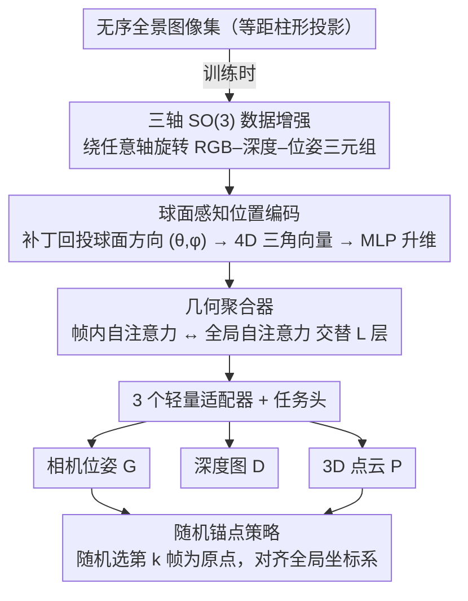

# PanoVGGT: Feed-Forward 3D Reconstruction from Panoramic Imagery

**会议**: CVPR 2026  
**arXiv**: [2603.17571](https://arxiv.org/abs/2603.17571)  
**代码**: 有（即将发布）  
**领域**: 3D视觉  
**关键词**: 全景3D重建, 前馈式多视图重建, 球面位置编码, SO(3)数据增强, 大规模全景数据集

## 一句话总结
提出 PanoVGGT，一个置换等变的 Transformer 框架，能从一张或多张无序全景图像中在单次前馈中联合预测相机位姿、深度图和全局一致3D点云；同时贡献了 PanoCity——一个包含超过12万张室外全景图像的大规模数据集。

## 研究背景与动机
**领域现状**：DUSt3R、VGGT、$\pi^3$ 等前馈式3D重建模型在透视图像上取得了巨大成功，可以在单次前馈中联合推断深度、位姿和3D结构

**现有痛点**：
   - 这些模型本质上基于针孔投影假设，直接处理等距柱形全景图时会出现接缝、视差不一致和几何漂移
   - 将全景图分割为多个透视裁剪再拼接的做法会引入伪影
   - 现有全景数据集存在规模不足、标注不完整、视点重叠不够等问题

**核心矛盾**：全景图具有非针孔畸变和球面几何特性，现有前馈模型的位置编码、数据增强和几何推理都不适用

**本文目标**：(a) 将前馈3D重建范式扩展到全景图像域；(b) 构建足够大规模的全景数据集支持训练

**切入角度**：通过球面感知位置编码和 $SO(3)$ 旋转增强，使 Transformer 学会在球面域进行有效几何推理

**核心 idea**：用球面位置编码 + 三轴旋转增强 + 随机锚点策略，将 VGGT/$\pi^3$ 的前馈重建范式扩展到全景图像

## 方法详解

### 整体框架
输入无序全景图像集 $\{I_i\}_{i=1}^N$，经过编码-聚合-解码结构，输出相机位姿 $G = \{g_i\}$、深度图 $D = \{D_i\}$ 和世界坐标系3D点云 $P = \{P_i\}$。训练时先对每个全景三元组施加三轴 $SO(3)$ 旋转增强，再把补丁经球面感知位置编码送入几何聚合器（帧内/全局交替注意力），最后由三个任务头分别预测位姿、深度和点云，并用随机锚点把位姿与点云对齐到统一全局坐标系。模型具有置换等变性——输入顺序不影响输出。

### 关键设计

**1. 球面感知位置编码：让 ViT 的位置先验适配等距柱形投影的畸变**

针孔模型的痛点在于，等距柱形（equirectangular）投影把球面摊平成矩形后，纬度越靠近两极、横向采样越被拉伸，标准 ViT 那套按行列均匀排布的位置编码完全对不上这种空间变化的采样密度。PanoVGGT 不再按补丁在图上的像素行列编码，而是先把每个补丁映射回它在球面上的中心方向 $(\theta, \phi)$，再编码成 4D 循环对称向量 $p_{\text{vec}} = [\sin\theta, \cos\theta, \sin\phi, \cos\phi]$，最后用一个 MLP 升到高维嵌入 $p_{\text{embed}} \in \mathbb{R}^C$。用三角函数而非原始角度，是为了天然保住经度接缝 $\theta=\pm\pi$ 处的缠绕连续性——左右边界其实是同一条经线，不该在编码上被撕开。

这个设计真正巧妙的地方要和下面的 $SO(3)$ 增强一起看：位置编码只绑定补丁的**几何朝向**、不随图像内容旋转而变，于是当增强把全景内容整体转了一个角度，固定的位置编码和被旋转的内容之间就产生了解耦。网络为了对齐两者，被迫学会把"投影畸变带来的形变"和"语义内容本身"区分开，而不是把畸变误当成物体结构。这样就绕开了昂贵的球面卷积，却拿到了类似的畸变不变性。

**2. 几何聚合器：在帧内与跨帧之间交替推理，统一吐出位姿、深度和点云**

拿到带球面嵌入的 token 后，需要一个模块同时完成"看清单张全景里的局部结构"和"在多张全景之间找对应"两件事。聚合器堆叠 $L$ 层交替注意力块，每块先做**帧内自注意力**——同一张全景内部的 token 互相关注，吸收局部几何和投影畸变；再做**全局自注意力**——把所有全景的 token 混在一起，建立跨视角的对应关系。聚合后的特征再与球面嵌入经 3 个轻量适配器融合，分别送进相机位姿头、局部点云头和全局点云头。这种帧内/全局交替的安排，让模型既不丢单帧细节，又能在前馈一遍里把多视角拼成一致的全局结构。

**3. 随机锚点策略：在保持置换等变的前提下钉死全局坐标系**

置换等变是这套模型想要的好性质——输入图像换个顺序，输出不该变。但它带来一个副作用：既然没有"第一帧"这种特殊地位，全局坐标系到底以谁为原点就变得歧义。VGGT 那样固定第一帧当原点，等于偷偷引入了排序偏差，面对无序输入时并不稳定。PanoVGGT 的做法是每次训练迭代**随机**挑一张全景图 $k$ 当锚点，把所有位姿和点云对齐到以第 $k$ 帧为中心的坐标系。随机性让任何一帧都不享有固定特权，置换等变性得以完整保留；而每个 batch 内又确实有一个明确的中心，于是形成稳定的"中心—辐射"几何参照，训练不再因坐标系漂移而发散。

**4. 全景专属的三轴 $SO(3)$ 数据增强：把球面这块免费的几何红利吃满**

全景数据天生稀缺，而透视图像的增强又被平面几何卡死——稍微大幅旋转就会转出画框、破坏几何有效性。全景图没有这个限制：它覆盖整个球面，可以绕任意轴任意角度旋转而内容不丢、几何依旧自洽。PanoVGGT 据此对每个 RGB–深度–位姿三元组采样一个随机旋转 $R_{\text{aug}} \in SO(3)$，把位姿更新为 $g_i' = R_{\text{aug}} \cdot g_i$，并将全景图和深度图先投影到球面、旋转后再重采样回等距柱形格式。这等于凭空把训练视角扩张到三轴无界，极大缓解了数据量不足；而且正如设计 1 所说，旋转后的内容配上不动的球面位置编码，恰好又给"畸变与内容解耦"的学习提供了监督信号。

### 损失函数 / 训练策略
- **尺度一致的局部/全局几何损失**：$\mathcal{L}_{\text{lp}} + \mathcal{L}_{\text{gp}}$，通过闭式解估计的最优缩放 $s^*$ 保证度量一致性
- **法线一致性正则化**：$\mathcal{L}_{\text{nor}}$，惩罚表面法线角度差异
- **相对位姿监督**：旋转 $\mathcal{L}_{\text{rot}}$（角度距离）+ 平移 $\mathcal{L}_{\text{trans}}$（L1）
- 总损失：$\mathcal{L} = \mathcal{L}_{\text{lp}} + \mathcal{L}_{\text{gp}} + \mathcal{L}_{\text{nor}} + 0.1(100 \cdot \mathcal{L}_{\text{trans}} + \mathcal{L}_{\text{rot}})$
- 8×A100 GPU 训练约10天

## 实验关键数据

### 主实验——相机位姿估计

| 方法 | Matterport3D AUC@30↑ | PanoCity AUC@30↑ | PanoCity 旋转误差↓ | PanoCity 平移误差↓ |
|------|---------------------|-----------------|------------------|------------------|
| BiFuse++ | 0.007 | 0.833 | 1.655° | 5.044° |
| VGGT | 0.034 | 0.205 | 7.659° | 35.867° |
| $\pi^3$ | 0.047 | 0.571 | 7.669° | 16.780° |
| $\pi^3$*（全景重训） | 0.305 | 0.682 | — | — |
| **PanoVGGT** | **0.459** | **0.949** | **0.873°** | **2.168°** |

### 单目深度估计

| 方法 | Matterport3D Abs Rel↓ | Stanford2D3D Abs Rel↓ | PanoCity Abs Rel↓ |
|------|---------------------|----------------------|------------------|
| EGFormer | 0.0987 | 0.0929 | 0.0363 |
| BiFuse++ | 0.1076 | 0.1120 | 0.0200 |
| PanoVGGT（单目） | 0.0884 | 0.0711 | 0.0312 |
| PanoVGGT（多视图） | **0.0840** | 0.0778 | **0.0196** |

### 关键发现
- PanoVGGT 在位姿估计上全面碾压：Matterport3D 上 AUC@30 从次优的 0.305（$\pi^3$*）提升至 0.459，PanoCity 上达到 0.949
- 在单目深度估计上超越专门的深度估计模型，并且是在多任务联合设置下的单一统一模型
- BiFuse++ 在 Matterport3D/Stanford2D3D 上表现差，因为其自监督训练依赖有序窄基线帧，与这些稀疏无序全景不匹配
- PanoCity 数据集规模（12万帧）远超现有全景数据集（Matterport3D 1万、Structured3D 1.2万），且提供完整多视图重叠

## 亮点与洞察
- **球面位置编码与 $SO(3)$ 增强的协同设计非常巧妙**：固定位置编码下旋转内容，迫使网络学会将投影畸变效应与语义内容解耦。这避免了复杂的球面卷积，却达到了类似的效果
- **随机锚点策略**：简单但有效地解决了置换等变模型中的全局坐标系歧义问题，比固定第一帧策略更稳健
- **PanoCity 数据集的贡献同样重要**：提供了首个大规模室外全景数据集，有连续轨迹、完整6DoF位姿和高精度深度，填补了关键空白
- **过完备监督**：同时回归深度和3D点云（虽然理论上可以互推），实验证明这种冗余监督显著提升了所有预测的准确性

## 局限与展望
- 训练分辨率限制在 $336 \times 672$（远低于原始 $4096 \times 2048$），高频细节可能丢失
- 室内数据集（Matterport3D、Stanford2D3D）中有效多视图样本很少且重叠差，限制了室内评估的充分性
- 模型规模较大（DINOv2 backbone），在边缘设备上的推理效率未讨论
- PanoCity 是合成数据集，与真实世界全景图的域差距未充分分析

## 相关工作与启发
- **vs VGGT / $\pi^3$**：这两个模型基于针孔假设，直接用于全景图时性能急剧下降。PanoVGGT 通过球面位置编码+旋转增强有效弥合了这一差距
- **vs BiFuse++**：BiFuse++ 针对全景设计但依赖有序窄基线自监督，在稀疏无序视点上崩溃；PanoVGGT 的置换等变设计天然适配无序输入
- **vs 传统全景方法**：大多数全景方法只做单任务（深度或位姿），PanoVGGT 是首个在全景域实现联合位姿-深度-点云的统一前馈模型

## 评分
- 新颖性: ⭐⭐⭐⭐ 球面位置编码和 $SO(3)$ 增强的协同设计有创意，但整体架构沿用 VGGT/$\pi^3$
- 实验充分度: ⭐⭐⭐⭐⭐ 多个数据集、多任务评估、跨域泛化、消融完整，且贡献了高质量数据集
- 写作质量: ⭐⭐⭐⭐ 结构清晰，数据集构建和方法设计都描述得很充分
- 价值: ⭐⭐⭐⭐⭐ PanoCity 数据集 + 全景前馈重建范式对社区影响大

<!-- RELATED:START -->

## 相关论文

- [\[CVPR 2026\] Pano3DComposer: Feed-Forward Compositional 3D Scene Generation from Single Panoramic Image](pano3dcomposer_feed-forward_compositional_3d_scene_generation_from_single_panora.md)
- [\[CVPR 2026\] VGG-T3: Offline Feed-Forward 3D Reconstruction at Scale](vgg-t3_offline_feed-forward_3d_reconstruction_at_scale.md)
- [\[CVPR 2026\] AMB3R: Accurate Feed-forward Metric-scale 3D Reconstruction with Backend](amb3r_accurate_feed-forward_metric-scale_3d_reconstruction_with_backend.md)
- [\[CVPR 2026\] MoRe: Motion-aware Feed-forward 4D Reconstruction Transformer](more_motion-aware_feed-forward_4d_reconstruction_transformer.md)
- [\[CVPR 2026\] UniSH: Unifying Scene and Human Reconstruction in a Feed-Forward Pass](unish_unifying_scene_and_human_reconstruction_in_a_feed-forward_pass.md)

<!-- RELATED:END -->
