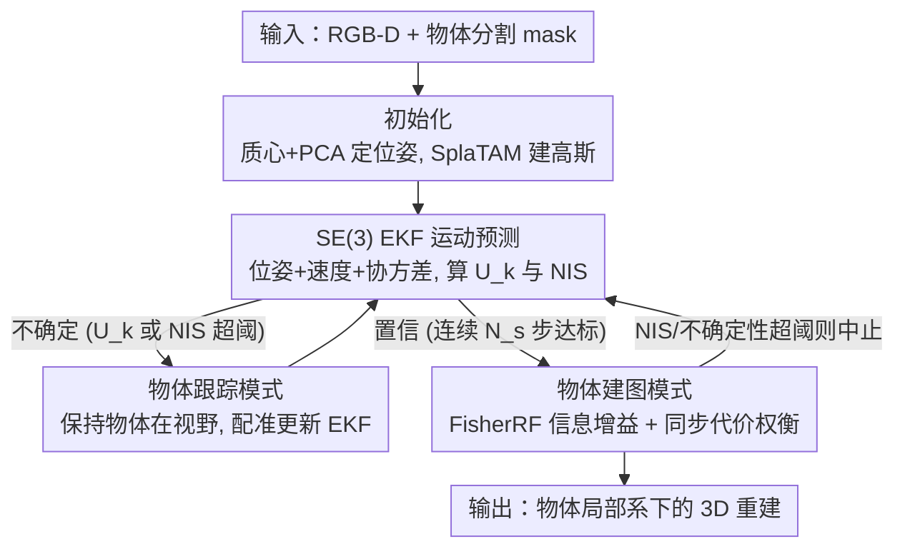

# Paparazzo: Active Mapping of Moving 3D Objects

**会议**: CVPR 2026  
**论文**: [CVF Open Access](https://openaccess.thecvf.com/content/CVPR2026/html/Allegro_Paparazzo_Active_Mapping_of_Moving_3D_Objects_CVPR_2026_paper.html)  
**代码**: [项目页](https://davidea97.github.io/paparazzo-page/)  
**领域**: 3D视觉  
**关键词**: 主动建图、运动物体重建、扩展卡尔曼滤波、Fisher信息、高斯泼溅

## 一句话总结
Paparazzo 提出"主动重建运动物体"这一新任务，并给出一个免训练的双模框架：用扩展卡尔曼滤波预测非合作运动目标的轨迹、用 FisherRF 信息增益选最优观测视角，并在"信息量高但够不着"与"信息量低但好同步"之间做权衡，从而比被动/随机基线更完整高效地重建移动中的 3D 物体。

## 研究背景与动机

**领域现状**：场景探索与主动建图在视觉和机器人领域研究已久，无人机、数字孪生等应用又带来新热度。主流做法分两类：传统方法靠启发式（frontier 探索、next-best-view 选点）配体素/点云表示；学习类方法（MACARONS、NextBestPath、NARUTO、ActiveGS）用神经网络或 NeRF/3DGS 作为中间场景状态，靠覆盖增益、置信度或 Fisher 信息选下一个最优位姿。

**现有痛点**：据作者所知，**所有主动建图工作都假设场景是静态的**——任务目标是用尽量短的轨迹把一个不动的环境覆盖完。这个假设在很多真实场景失效：建筑工地的卡车、移动设备本身就是场景的关键组成、不停重塑工作空间，而工地又不能停工让你"静态拍摄"。

**核心矛盾**：要重建一个**非合作（non-cooperative）**、独立于建图活动自行运动的物体，智能体既要去采集能露出物体新表面的视角，又要在自己导航的过程中补偿物体未来的运动。于是视角质量不再只看几何信息量，还取决于"能不能在正确的时刻到达那个视角"——信息量最高的视角未必最优，因为视角随物体一起移动，一个信息量略低但路程短得多的视角可能更划算。

**本文目标**：(1) 定义"主动重建运动物体"新任务；(2) 给出一个无需训练、能泛化到新场景新物体的求解框架；(3) 建立第一个针对该任务的基准。

**切入角度**：把问题拆成"预测物体怎么动"和"在能同步的前提下选信息最大的视角"两半——前者用 EKF（既能融合历史观测预测轨迹，又能检测预测何时不可靠），后者用 FisherRF 量化视角对高斯模型参数的细化贡献。

**核心 idea**：一个免训练的双模框架——运动估计不确定时进"跟踪模式"稳住 EKF，置信时进"建图模式"在信息增益与时间同步代价之间权衡选下一最优视角，两模式靠 EKF 置信度反应式切换。

## 方法详解

### 整体框架
智能体装一个固定前向的 RGB-D 相机，在已知自身位姿的前提下重建一个位姿未知、自行运动的物体。Paparazzo 根据对物体运动估计的置信度，在两个模式间交替：**物体跟踪模式**（运动估计不确定时，把物体保持在视野中心、用配准更新 EKF 来稳住运动估计）和**物体建图模式**（足够置信时，预测物体未来位姿、生成随物体一起移动的候选视角、在信息增益与同步代价间选最优并执行）。物体被首次检测时完成初始化（质心定平移、地平面 PCA 定旋转、SplaTAM 在物体参考系里初始化高斯），之后整个系统就是一个"预测→判置信→跟踪或建图→更新重建→再判置信"的反应式闭环，在线运行约 8 FPS、无需任何训练数据。

### 关键设计

**1. SE(3) 上的 EKF 运动预测与双指标置信判别**

针对"非合作物体怎么动事先不知道、还会突然变向"，作者在 $SE(3)$ 上定义扩展卡尔曼滤波，状态包含物体位姿 $T^W_{O_k}$、线速度、角速度及其协方差 $P_k$。EKF 的第一个价值是融合历史观测预测轨迹；第二个价值是**检测预测何时不可靠**，用两个互补指标量化置信度：状态不确定度 $U_k=\mathrm{tr}(P_k)$，以及归一化新息平方 $\text{NIS}_k=y_k^\top S_k^{-1}y_k$，其中 $y_k=\log((T^W_{O_k|k-1})^{-1}T^{W,\text{meas}}_{O_k})$ 是 $SE(3)$ 上的新息、$S_k=HP_{k|k-1}H^\top+R$ 是新息协方差。只有当 $U_k<\theta_u$ 且 $\text{NIS}_k<\theta_n$ **连续 $N_s$ 步**都成立，才认为估计可靠、切到建图模式；否则切回跟踪模式重新稳住 EKF。这套"用滤波自身的协方差和新息当切换触发器"是双模反应式控制的关键。

**2. 物体跟踪模式：优先稳住运动估计**

当 EKF 不确定（比如物体突然改向），这一模式优先频繁观测物体来细化运动估计。智能体每步旋转使分割 mask 移向图像中心，平移调整与物体距离，让物体在画面里大约占一半大小，始终把目标稳稳框住。同时估计物体测量位姿 $T^{W,\text{meas}}_{O_k}$：把当前分割点云 $P^{C_k}_{O_k}$ 与截至 $k-1$ 步累积的物体重建对齐——先用 KISS-Matcher 做对大位移/外点鲁棒的粗配准，再用 Colored ICP 精修。得到的测量位姿既用来更新 EKF 改进物体状态估计，又用来把新观测点云并入重建；高斯模型 $G_O$ 则通过 SplaTAM 优化在线增量稠密化。等状态不确定度稳定下来，就把重心从"重定位"转向"信息驱动的探索"。

**3. 物体建图模式：在信息增益与同步代价之间权衡选视角**

EKF 稳定后进入此模式，目标是把智能体移到能显著改善重建、同时又赶得上物体运动的位姿。作者在物体参考系里采样一组**随物体一起移动的、围绕物体的 foveated（中央凹）候选视角** $V$。若物体静止，直接按 FisherRF 选信息量最高的视角即可；但物体在动，必须在"视角信息量"和"智能体与物体的时间同步性"间折中，于是定义代价 $B(x,i)=-w_{\text{eig}}\,\text{EIG}(x)+w_{\text{sync}}\,C_{\text{sync}}(x,i)$。其中 $\text{EIG}(x)$ 是 FisherRF 算出的、视角 $x$ 对细化高斯模型参数 $\theta$ 的信息贡献（可从 $G_O$ 解析高效计算）；同步代价 $C_{\text{sync}}(x,i)=\big|\hat{s}_{\text{agent}}(x,i)-(i-k)\big|$ 度量时间错配——$\hat{s}_{\text{agent}}(x,i)$ 是智能体经 A* 规划走到"物体在未来 $i$ 时刻位姿对应的相机位姿 $T^W_{O_i}\cdot x$"所需步数，$i-k$ 是物体从当前位姿演化到预测位姿所需步数。最终在 $N_h$ 步预测视界内选 $(x^*,i^*)=\arg\min_{x\in V,\,(i-k)\le N_h} B(x,i)$。执行移动途中持续融合 RGB-D、更新 $G_O$ 并监视 EKF 一致性，一旦 NIS 或不确定度超阈就中止建图、退回跟踪模式——这种"信息驱动建图"与"运动感知预测"的动态耦合正是 Paparazzo 的核心新意。

### 一个完整示例
以一次典型回合为例：物体首次被检测，系统用质心+PCA 初始化其位姿、用 SplaTAM 建好初始高斯，EKF 开始跟踪。起初协方差大、$U_k$/NIS 超阈 → 进跟踪模式，智能体旋转平移把物体框在画面中央、不断配准更新 EKF。连续 $N_s$ 步 $U_k$、NIS 都达标后 → 切建图模式：在物体参考系采一圈 foveated 候选视角，EKF 预测物体未来 $N_h=60$ 步的位姿，对每个候选 $(x,i)$ 算信息增益 EIG 和同步代价 $C_{\text{sync}}$，选出"信息高且赶得上"的 $(x^*,i^*)$ 并用 A* 规划过去，途中持续补点更新重建。若物体此时突然变向、NIS 飙升超阈 → 立即中止建图退回跟踪模式重新稳住。如此反复，逐步把运动物体的完整表面补齐。

## 实验关键数据

### 主实验
基准建在 Habitat 3.0 仿真器，选 6 个室内场景（3 个 Matterport3D + 3 个 Gibson），向每个场景注入合成运动目标，共 4 个目标物体、4 种运动模式（Bouncing Ball / Curved Bouncing Ball / Forward & Backward / Stop & Go）。物体每步平移 5 cm、旋转 10°；智能体动作离散（前进 15 cm、左右偏航 10°）。三项指标：**3D Coverage（%）**真值点中有重建点落在 $\delta=1$ cm 内的比例（越高越完整）、**Completeness（cm）**真值点到最近重建点的平均距离（越低越少漏）、**AUC**覆盖率对智能体步数的曲线下面积（越高越快达成覆盖）。基线：随机游走（RW）、随机信息选择（RIS，本文消融——在候选里随机选可达位姿、忽略同步与可行性）、纯跟踪（TO，只跟踪不主动选视角，作为重建完整度下界）。

Bouncing Ball（BB）运动下，6 场景平均（每条结果在 5 次、各 500 步运行上平均，$N_h=60$）：

| 方法 | Coverage (%) ↑ | Completeness (cm) ↓ | AUC ↑ | 说明 |
|------|------|------|------|------|
| Random Walk (RW) | 51.50 | 2.08 | 0.51 | 完全无视物体位置 |
| Random Informative Selection (RIS) | 67.07 | 1.12 | 0.60 | 选信息位姿但不与轨迹同步 |
| Tracking-Only (TO) | 75.89 | 0.90 | 0.70 | 被动跟踪、无主动选点（下界） |
| **Paparazzo** | **81.51** | **0.77** | **0.75** | 双模主动建图 |

Paparazzo 在覆盖率、完整度、AUC 三项上全面优于所有基线，单个 Greigsville 等场景下覆盖率超过 80%、并在几乎所有场景的 AUC 上领先，说明它不仅重建更完整、达成覆盖也更快。

### 消融实验
RIS 本身就是 Paparazzo 去掉"同步代价 + 可行性推理"的消融版；TO 是去掉"主动视角选择"的下界。

| 配置 | 关键能力 | BB 平均 Coverage | 说明 |
|------|---------|------|------|
| Paparazzo（完整） | 运动感知选点 + 时间可行性 | 81.51 | 完整双模 |
| w/o 同步代价（≈RIS） | 只选信息位姿、忽略同步 | 67.07 | 掉约 14.4 个点，常赶不到可行观测点 |
| w/o 主动选点（≈TO） | 只被动跟踪 | 75.89 | 缺乏视角多样性 |
| w/o 物体感知（≈RW） | 随机游走 | 51.50 | 几乎不可用 |

### 关键发现
- **同步代价是最关键的组件**：RIS（有信息选点但无同步）只有 67% 覆盖，比纯跟踪 TO 的 76% 还低——光选信息量高的视角而赶不到位，反而不如老老实实跟着物体；这印证了"信息量高但够不着的视角未必最优"的核心论点。
- **运动模式难度排序**：BB 反而最易（频繁撞墙变向让物体从多角度被看到，连 TO 都能到 75%）；CBB（曲线+变速）和 FB（不旋转、需主动绕到新视角）更难；**Stop & Go 最难**——物体中途停在不可见区域时，智能体已朝预期出现位姿移动却扑空，运动估计被打断。
- 在狭窄场景（如 Ribera）下，CBB 运动时 Paparazzo 偶尔比 TO 低约 5%，因为空间受限、来不及在下次反弹前重新就位；但全场景平均仍明显领先。

## 亮点与洞察
- **定义了一个被整领域忽略的新任务**：所有已有主动建图都假设静态场景，本文第一个正面处理"非合作运动物体"的主动重建，并配套第一个基准，开辟了一个清晰的新方向。
- **免训练却能泛化**：EKF + FisherRF + A* 全是解析/经典模块、无需任何训练数据，因此天然泛化到新场景新物体，避免了学习类 NBV 方法的数据依赖。
- **"同步代价"$C_{\text{sync}}$ 是最可迁移的点子**：把"视角信息量"和"智能体能否在物体到达预测位姿的同一时刻赶到"统一进一个可优化代价，这个"时空联合选点"的思路可推广到任何追拍/护航/动态目标观测任务。
- **用滤波器自身的不确定度做模式切换**：以 $U_k$ 和 NIS 当触发器，让系统在"该稳运动估计"和"该去采信息"之间自适应切换，是一个干净的反应式控制范式。

## 局限与展望
- 全部实验在 **Habitat 仿真器**中、用合成注入的运动物体完成，未在真实机器人/真实运动目标上验证；⚠️ sim-to-real 差距（真实分割噪声、深度噪声、运动更不规则）下的表现存疑。
- 方法**假设目标 mask 可得**（已知静态场景时背景减除，否则用运动物体分割），mask 质量直接影响位姿估计与重建，论文未充分分析分割失败的影响。
- 在狭窄空间 + 快速曲线运动（CBB/Ribera）下会败给被动跟踪，说明当环境严重限制智能体机动时，主动规划的优势会被预测误差和可达性吞掉。
- 运行约 8 FPS，对实时性要求更高或物体运动更快的场景可能不够；⚠️ 完整运行时与内存细节作者放在补充材料，正文未给。

## 相关工作与启发
- **vs 静态主动建图（MACARONS / NARUTO / ActiveGS）**：它们用神经网络或 NeRF/3DGS + Fisher 信息选 NBV，但都假设场景不动；Paparazzo 借用 FisherRF 的信息增益思路，却必须额外估计并补偿物体运动，把"几何信息量"和"时间可达性"一起纳入选点。
- **vs 移动物体被动重建 / 手持扫描**：手持扫描里用户主动移动物体来方便重建（"合作"运动），有的也用高斯基元表示物体；Paparazzo 的区别在于物体"非合作"地自行运动，智能体必须主动规划移动去采集新的相对位姿，同时跟踪并重建。
- **vs Tracking-Only 下界**：纯跟踪能稳住运动估计但视角单一；Paparazzo 在置信后切到主动建图、靠 $B(x,i)$ 权衡，证明"主动选点 + 时间同步"相比被动跟踪能实打实提升覆盖与完整度。

## 评分
- 新颖性: ⭐⭐⭐⭐⭐ 提出并形式化一个全新任务（运动物体的主动建图）+ 配套首个基准，方向上是开拓性的。
- 实验充分度: ⭐⭐⭐⭐ 6 场景×4 物体×4 运动模式、3 指标、5 次平均，基线设计能干净拆解各组件贡献；但全为仿真、无真实验证。
- 写作质量: ⭐⭐⭐⭐ 任务动机、双模切换、$B(x,i)$ 权衡都讲得清楚，图 2 把闭环交代明白；部分运行细节外推到补充材料。
- 价值: ⭐⭐⭐⭐ 直指数字孪生/工地等真实动态场景需求，"时空联合选点"思路可迁移到追拍类任务，实用潜力大（但需 sim-to-real 验证）。

<!-- RELATED:START -->

## 相关论文

- [\[CVPR 2026\] Uncertainty-driven 3D Gaussian Splatting Active Mapping via Anisotropic Visibility Field](uncertainty-driven_3d_gaussian_splatting_active_mapping_via_anisotropic_visibili.md)
- [\[CVPR 2026\] MAGICIAN: Efficient Long-Term Planning with Imagined Gaussians for Active Mapping](magician_efficient_long-term_planning_with_imagined_gaussians_for_active_mapping.md)
- [\[CVPR 2025\] ActiveGAMER: Active GAussian Mapping through Efficient Rendering](../../CVPR2025/3d_vision/activegamer_active_gaussian_mapping_through_efficient_rendering.md)
- [\[CVPR 2026\] Scene Reconstruction as Mapping Priors for 3D Detection](scene_reconstruction_as_mapping_priors_for_3d_detection.md)
- [\[CVPR 2026\] SunFaded: Illumination-Aware Gaussian Splatting for Dark Scenes with Camera-Mounted Active Lighting](sunfaded_illumination-aware_gaussian_splatting_for_dark_scenes_with_camera-mount.md)

<!-- RELATED:END -->
