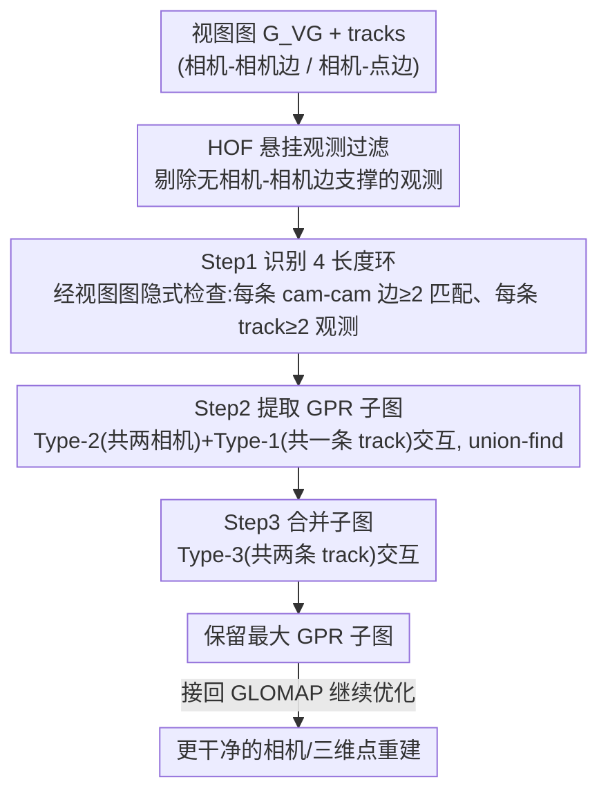

# Parallel Rigidity Matters for Bundle Adjustment

**会议**: CVPR 2026  
**论文**: [CVF Open Access](https://openaccess.thecvf.com/content/CVPR2026/html/Manam_Parallel_Rigidity_Matters_for_Bundle_Adjustment_CVPR_2026_paper.html)  
**代码**: 无  
**领域**: 3D视觉  
**关键词**: 光束法平差, 平行刚性, 结构从运动, 唯一可解性, 视图图

## 一句话总结
本文用「平行刚性（parallel rigidity）」理论第一次系统回答了「光束法平差（BA）的解何时唯一」这个被长期忽视的基础问题——把相机平移与三维点的联合优化看成一个二部图上的方向约束问题，设计 GPRBA 算法通过相机间视图图高效提取「通用平行刚性」子图，接进全局 SfM 流水线 GLOMAP 后能干净地剔除被独立缩放而摆错位置的相机与三维点。

## 研究背景与动机

**领域现状**：光束法平差是三维重建的基石，被广泛用在 SfM 和 SLAM 里，从二维观测同时求解相机内外参与三维点坐标。几十年来文献几乎都在打磨它的「怎么解」——适配不同相机模型、融合 GPS/IMU、加光度约束、改优化器（LM、共轭梯度、Schur 补技巧）、抗外点、做分布式，等等。

**现有痛点**：几乎没人认真问过一个更基础的「解存不存在、唯不唯一」的问题。Triggs 等人的经典综述只给了一些关于相机覆盖场景的经验法则（thumb rules）来「间接」保证可靠估计，但 BA 这张二部图本身从未被放到平行刚性的框架下分析过。后果很实在：重建里会出现一整片被「独立缩放」摆错位置的相机和三维点（论文 Fig.1 里那块飞到错误位置的立面墙），它们和主体重建用的是不同的尺度，肉眼看就是脏的。

**核心矛盾**：BA 把每个像素观测都当成相机本地坐标系下的一个方向（小孔相机是射影映射），而要恢复的是世界坐标系下的三维向量——输入在单位球 $S^2$ 上、输出在 $\mathbb{R}^3$ 里，二者维度不匹配，必须额外估计每条边的尺度 $\alpha_{ij}$。一旦某个子图的尺度可以脱离其余部分独立伸缩，解就不唯一了。这正是平行刚性要刻画的事，但它原本要求所有方向都在统一全局坐标系下给出，而 BA 里相机的旋转和内参也是待优化的，方向只在本地坐标系已知。

**本文目标**：（1）把平行刚性的理论和 BA 严格对接起来，说清楚它到底约束的是「相机平移 + 三维点坐标」的唯一可解性（在 Sim(3) 规范自由度下），而非别的相机参数；（2）在不知道相机旋转/内参的前提下，只靠二部图拓扑判定「通用平行刚性（generically parallel rigid, GPR）」，并高效地把图拆成最大的 GPR 子图。

**切入角度**：作者注意到二部图里最短的环是 4 长度环（两台相机 + 两个三维点），而长度 ≤4 的环在 $\mathbb{R}^3$ 里天然是 GPR 的。于是判定整张图是否 GPR，可以转化为「找 4 长度环 + 看它们之间怎么交叠」的组合问题；又因为三维点数量巨大，作者改从相机-相机关系（视图图）这个小得多的图上间接做。

**核心 idea**：把「BA 解是否唯一」化归为「二部 BA 图是否通用平行刚性」，再借相机间视图图高效提取最大 GPR 子图，从重建里切掉那些会被独立缩放的部分。

## 方法详解

### 整体框架
方法叫 **GPRBA**（Generically Parallel Rigid Bundle Adjustment）。它不改 BA 的优化目标，而是作为一个「拓扑体检 + 清洗」模块插进现成的全局 SfM 流水线（论文用 GLOMAP）。前提是一条理论结论：当 BA 同时优化相机平移 $T_i$ 和三维点 $P_j$、以二维观测 $o_{ij}$ 为输入时，一致性关系 $(P_j - T_i) \parallel (R_i^\top K_i^{-1}\tilde{o}_{ij})$ 与平行刚性的标准式同构，因此「解是否唯一」等价于「二部图 $G_{BA}$ 是否 GPR」。

整条管线是：从视图图 $G_{VG}$（相机为节点、相机间匹配观测为边）构造出 tracks（每个三维点连着的相机-点子图），先用 **HOF** 去掉没有相机-相机边支撑的「悬挂观测」，再用 **GPRBA 三步算法**——隐式找 4 长度环、按三类交互合并出 GPR 子图、最后只保留最大的那个 GPR 子图——把它喂回 GLOMAP。由于 GLOMAP 在重建过程中会多次过滤 tracks（一次运行过滤 5 次），每次 tracks 被改动后都会重新调用 HOF+GPRBA。

### 关键设计

**1. 把平行刚性引入 BA：揭示「平移+三维点」联合优化的唯一可解性**

这是全文的理论支点。对图 $G=(V,E)$，节点是待估三维向量 $x_i\in\mathbb{R}^3$、边是相对方向 $u_{ij}\in S^2$，一致性关系写成 $(x_j-x_i)=\alpha_{ij}u_{ij}$，即 $u_{ij}\times(x_j-x_i)=0$。收集所有边得 $S_U(B\otimes I_3)x=0$，其中 $B$ 是关联矩阵、$S_U$ 是由各 $[u_{ij}]_\times$ 组成的块对角阵。图在 $\mathbb{R}^3$ 中**平行刚（PR）** 当且仅当 $\mathrm{rank}(S_U(B\otimes I_3))=3|V|-4$（4 来自原点 + 全局尺度的规范自由度）；秩低于此则有无穷多解，意味着某些 $\alpha_{ij}$ 可以独立于其它边缩放。作者把小孔相机投影 $K_iR_i(P_j-T_i)=\beta_{ij}\tilde{o}_{ij}$ 整理为 $(P_j-T_i)\parallel(R_i^\top K_i^{-1}\tilde{o}_{ij}/\|\cdot\|)$，发现它与上式同构、未知量恰是 $P_j,T_i\in\mathbb{R}^3$，右端在 $S^2$。结论：只要 BA 同时优化相机平移和三维点，平行刚性问题就必然存在；而且因为旋转/内参也在优化、右端方向未知，只能退而用「通用平行刚性 GPR」——仅凭图拓扑 + 空间维度判定。这个洞察本身就是贡献：它和优化代价无关，连 GLOMAP 那种用非重投影代价的方法也照样受此约束（而 GLOMAP 原文没处理）。

**2. Viewgraph 间接分析：用小得多的相机-相机图代理判定 4 长度环**

直接在二部图上分析 GPR 太贵——朴素做法要对所有 track 对求交集，是 $O(|V_P|^2)$，而大规模问题的三维点数 $|V_P|$ 巨大。作者的关键观察是：一张 track 是由相邻相机-相机边上的匹配观测拼接而成的，所以二部图的拓扑可以通过**视图图** $G_{VG}=(V_C,E_{VG})$ 间接推断。每条相机-相机边（cam-cam edge）携带很多匹配观测，每个匹配观测又贡献两条相机-点边。这样判定 4 长度环就不必枚举三维点，而是检查 cam-cam 边的条件，规模从 $|V_P|$ 降到 $|E_{VG}|$，实测 $|E_{VG}|\ll|V_P|\ll|E_{BA}|$，把组合爆炸压成可处理的量级——这是整套方法能 scale 到约 9000 台相机数据集的核心原因。

**3. GPRBA 三步合并算法：用三类交互把 4 长度环拼成最大 GPR 子图**

理论依据是「两个至少共享 2 个节点的 GPR 子图合起来仍是 GPR」。在二部图里两个 4 长度环的交叠只有三类：Type-1 共一条相机-点边（共一台相机 + 一个三维点）、Type-2 共两台相机、Type-3 共两个三维点。算法据此分三步：**Step 1** 在视图图上隐式找 4 长度环——递归删掉「匹配观测 <2 的 cam-cam 边」和「观测 <2 的 track」，直到剩下的都满足成环条件；**Step 2** 提取子图——同一条 cam-cam 边发出的所有环天然是 Type-2 交互，故每条 cam-cam 边上的匹配观测合成一个 GPR 子图；再看相邻 cam-cam 边是否共享 track（Type-1 交互）来连接，用并查集（union-find）维护这些子图；**Step 3** 合并——对 Step 2 得到的子图，若两两之间有 ≥2 条公共 track（Type-3 交互）则合并。作者指出 Step 2 后的子图数很少（含约 9000 相机的数据集也 <20 个），所以 Step 3 两两检查可行。需要注意：提取最大 GPR 子图本身是 NP-hard，本方法可能漏掉高阶交互、子图未必真·最大，但实测够用；每次调用后只保留最大子图以维持流水线效率。

**4. HOF 悬挂观测过滤：剔除没有相机-相机边支撑的孤立观测**

由于流水线会在不同阶段修改 track（删高残差观测、抗外点、删三角化角度不够的点），可能出现一种观测：它在某条 track 里，但已经没有任何 cam-cam 边支撑它（论文 Fig.4，删掉 $P\!-\!C_3$、$P\!-\!C_5$ 后 $P\!-\!C_4$ 就悬空了）。作者把这类叫**悬挂观测（hanging observation）**。因为整套分析都建立在 cam-cam 边上，这些观测不被考虑、留着只会污染估计，于是直接删除。实验显示 HOF 单独使用就能显著增加被重建的三维点数（尤其在 GLOMAP 不做重三角化时）——说明去掉悬挂观测后，剩下的低重投影误差观测能被更可靠地估计。

## 实验关键数据

数据集为 IMC 2022 与 1DSfM；基线流水线为全局 SfM 方法 GLOMAP。之所以选全局而非增量式管线，是因为增量式在每个增量阶段只纳入有重建三维点的 cam-cam 边，$G_{BA}$ 本就大概率是 GPR 的，体现不出本方法价值。报告 BA 输出处「不做重三角化（w/o retri）」与「做重三角化（w/ retri）」两种结果。

### 主实验：HOF 涨点 + HOF+GPRBA 清除错位相机

| 数据集 | 配置 | 相机数 | 三维点(×10³, w/o retri) | 三维点(×10³, w/ retri) |
|--------|------|--------|-------------------------|------------------------|
| Brandenburg Gate (IMC) | GLOMAP | 349 | 0.5 | 31 |
| Brandenburg Gate (IMC) | +HOF | 349 | 16 | 29 |
| Brandenburg Gate (IMC) | +HOF+GPRBA | 346 | 15 | 29 |
| Alamo (1DSfM) | GLOMAP | 1117 | 4.4 | 132 |
| Alamo (1DSfM) | +HOF | 1111 | 100 | 150 |
| Alamo (1DSfM) | +HOF+GPRBA | 724 | 73 | 119 |
| Yorkminster (1DSfM) | GLOMAP | 2014 | 10.8 | 318 |
| Yorkminster (1DSfM) | +HOF+GPRBA | 585 | 131 | 410→131 |

> 解读：① **HOF 大幅涨三维点**——尤其在不做重三角化时，Brandenburg 从 0.5K→16K、Alamo 从 4.4K→100K，意味着删掉悬挂观测后大量低误差观测得以可靠重建，甚至能在「不重三角化」下就得到合理重建（GLOMAP 单独做不到）。② **HOF+GPRBA 剔除错位相机/点**——1DSfM 上常有大批相机/点不构成 GPR 图（Alamo 相机 1117→724，Yorkminster 2014→585），它们的尺度可独立于已得重建、无法合并，只能切除。被删相机在 GLOMAP 里的平均误差很高（如 Brandenburg「Removed cam. errs」=1081.28 m），印证它们确属错位。

### 消融 / 误差分析

| 指标 | 含义 | 典型现象 |
|------|------|----------|
| 相机平移中位误差(m) | 对齐 GT 后未错位相机的精度 | 多数场景 HOF+GPRBA 改善（如 Buckingham 0.69→0.17、Colosseum 0.60→0.40），少数略增 |
| 误差 >5m 的相机数 | 错位/外点相机数量 | HOF+GPRBA 普遍减少（Brandenburg 13→6、Buckingham 13→9） |
| HOF vs HOF+GPRBA（视觉） | 谁负责清场 | 仅 HOF **不**移除错位相机/点；必须 GPRBA 才能切掉飞错位置的部分 |
| 计算耗时 $t_{GPR}/t_R$ | 5 次调用 HOF+GPRBA 占重建时间 | 全数据集 <2%，相机 >1000 时降到 <1% |

### 关键发现
- **GPRBA 是「清场」的关键**：去掉 GPRBA 只留 HOF，错位的相机和三维点仍在；只有提取 GPR 子图才能把 ELS、NYC、VNC、YKM 这类「场景被错误边连成多个强连通簇」的情况切开，得到与 1DSfM 原论文/近年 COLMAP 输出相当的干净重建。
- **方法只解尺度独立问题、不抗外点**：高相机误差可能来自独立缩放（平行刚性）或匹配外点两类原因，本方法只切除前者，故剩余相机里仍可能有高误差者——作者诚实地标注了这一点。
- **几乎零额外开销**：5 次调用 <2% 重建时间，因为分析搬到了远小于三维点数的视图图上。

## 亮点与洞察
- **问对了一个被忽视几十年的基础问题**：所有人都在优化「怎么解 BA」，本文回头问「BA 解唯不唯一」，并给出可计算的判据——这种「换一层抽象重新提问」的思路本身极有价值。
- **维度不匹配的精准刻画**：把「输入方向在 $S^2$、输出向量在 $\mathbb{R}^3$」的错配点破，直接命中「为什么会有独立缩放」的根因，比经验法则（相机覆盖率）深刻得多。
- **用小图代理大图的工程智慧**：把 NP-hard 的 GPR 子图提取，通过「4 长度环 + 三类交互 + 视图图代理 + 并查集」化成 <2% 开销的可扩展算法，是理论落地的范本。
- **可迁移性**：平行刚性分析对优化代价无关，原则上可挂到任何同时优化平移与三维点的重建/SLAM 管线（增量式因结构特点收益小，全局式收益大）。

## 局限与展望
- **不处理外点**：作者明说方法只移除尺度独立的部分，匹配外点导致的高误差相机仍残留，重建里可能有伪影。
- **子图未必最大**：提取最大 GPR 子图是 NP-hard，本方法可能漏掉高阶交互，得到的 GPR 子图不保证极大；每次只留最大子图也可能丢掉本可保留的次大结构。
- **依赖视图图质量**：整套分析建立在 cam-cam 匹配上，若视图图本身匹配稀疏或错误，HOF/GPRBA 的判定会受影响。
- **改进方向（自己看）**：把外点剔除与平行刚性分析联合建模，或在「保留最大子图」之外设计多子图融合策略，可能进一步减少误删的有效相机/点。

## 相关工作与启发
- **vs GLOMAP（被增强对象）**：GLOMAP 同时优化 $T_i,P_j$ 但用非重投影代价，并未意识到其结果受平行刚性约束。本文把 GPRBA+HOF 挂进它的 track 过滤环节，得到显著更干净的重建——是「给现成强 SfM 管线补一个理论缺口」的关系。
- **vs 平移平均（translation averaging）里的平行刚性**：平行刚性此前在计算机视觉里主要用于平移平均的可解性分析（相机-相机层面），本文首次把它搬到二部「相机-三维点」BA 图上，并解决了「方向只在本地坐标系已知」带来的 GPR（而非 PR）判定问题。
- **vs BA 的经验覆盖法则（Triggs 等）**：经典综述用相机覆盖场景的 thumb rules 间接保证可靠估计，本文给出基于图拓扑的可计算判据，把「经验」升级为「可验证的唯一可解性条件」。

## 评分
- 新颖性: ⭐⭐⭐⭐⭐ 首次把平行刚性理论严格对接二部 BA 图，提出被长期忽视的「唯一可解性」判据，问题与视角都很原创。
- 实验充分度: ⭐⭐⭐⭐ IMC 2022 + 1DSfM 两套标准数据集、含 ~9000 相机大场景，有相机/点统计、平移误差与耗时分析；但只在 GLOMAP 单一管线验证，缺与其它清洗策略的横向对比。
- 写作质量: ⭐⭐⭐⭐ 理论推导清晰、图示（4 长度环三类交互）到位；但平行刚性符号偏重，对不熟刚性理论的读者门槛较高。
- 价值: ⭐⭐⭐⭐ 给三维重建补上一块基础理论 + 近乎零开销的实用清洗模块，对 SfM/SLAM 社区有长期参考价值。

<!-- RELATED:START -->

## 相关论文

- [\[CVPR 2026\] HumanBA: Human-Aware Bundle Adjustment via Global Human-Camera Decoupling](humanba_human-aware_bundle_adjustment_via_global_human-camera_decoupling.md)
- [\[ECCV 2024\] Event-based Mosaicing Bundle Adjustment](../../ECCV2024/3d_vision/event-based_mosaicing_bundle_adjustment.md)
- [\[ECCV 2024\] Power Variable Projection for Initialization-Free Large-Scale Bundle Adjustment](../../ECCV2024/3d_vision/power_variable_projection_for_initialization-free_large-scale_bundle_adjustment.md)
- [\[ICCV 2025\] Back on Track: Bundle Adjustment for Dynamic Scene Reconstruction](../../ICCV2025/3d_vision/back_on_track_bundle_adjustment_for_dynamic_scene_reconstruction.md)
- [\[CVPR 2026\] Order Matters: 3D Shape Generation from Sequential VR Sketches](order_matters_3d_shape_generation_from_sequential_vr_sketches.md)

<!-- RELATED:END -->
