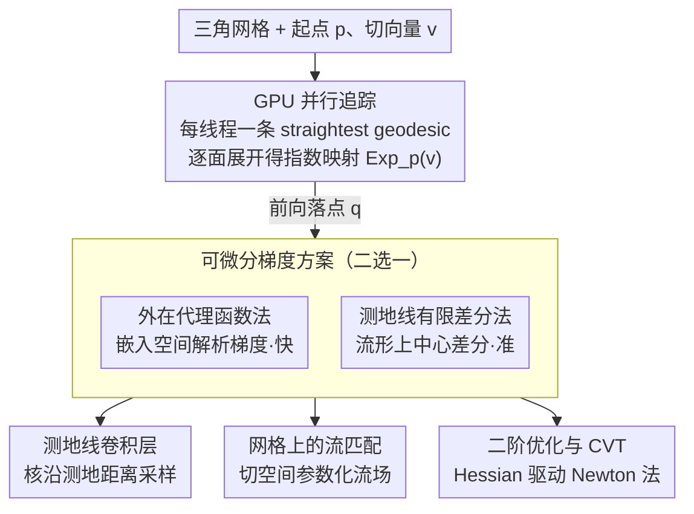

# Parallelised Differentiable Straightest Geodesics for 3D Meshes

**会议**: CVPR 2026  
**arXiv**: [2603.15780](https://arxiv.org/abs/2603.15780)  
**代码**: [circle-group/DSG](https://circle-group.github.io/research/DSG) (pip install digeo)  
**作者**: Hippolyte Verninas, Caner Korkmaz, Stefanos Zafeiriou, Tolga Birdal, Simone Foti (Imperial College London)
**领域**: 3D视觉  
**关键词**: 测地线, 可微分, 指数映射, 网格学习, 并行化, 流匹配, 测地线卷积

## 一句话总结

提出 straightest geodesics 的并行 GPU 实现及两种可微分方案（外在代理函数法和测地线有限差分法），使三角网格上的指数映射可高效并行且可微分，并以此构建测地线卷积层、网格上的流匹配方法和二阶优化器三个下游应用。

## 研究背景与动机

机器学习正从欧几里得空间向非欧几里得（黎曼流形）推广，但在三角网格表面进行几何精确的学习仍面临三大瓶颈：

**缺乏闭式黎曼算子**：连续流形上的指数映射、对数映射、平行传输等在网格离散化后没有解析解

**离散算子不可微分**：现有的离散测地线计算涉及条件分支（跨越哪条边）和非光滑操作，无法直接嵌入反向传播

**并行化能力差**：测地线逐条追踪的串行特性导致在 GPU 上难以高效实现，限制了 batch 训练的可行性

**Straightest geodesics**（Polthier & Schmies, 1998）是在多面体网格上计算指数映射的原则性框架：它通过在每个边交叉点将相邻三角面展开为平面来追踪"最直"路径（测地曲率为零），同时自然产生测地线轨迹和向量平行传输。然而此方法此前无高效 GPU 实现，更无可微分版本，限制了其在学习管线中的应用。

本文旨在打通这三个瓶颈：**并行化 + 可微分 + 通用应用**，使测地线计算成为端到端学习管线中的标准模块。

## 方法详解

### 整体框架

这篇论文要把一个经典但"只停在纸面上"的计算几何工具——straightest geodesics——改造成能直接塞进深度学习管线的标准模块。所谓 straightest geodesic（Polthier & Schmies, 1998）就是在多面体网格上计算指数映射 $\text{Exp}_p(v)$ 的方式：从顶点 $p$ 出发，沿切向量 $v$ 在当前三角面内走直线，碰到一条边就把相邻面"摊平"（unfold）到当前平面、让路径在展开后依旧笔直，如此一面一面走下去，直到走满 $\|v\|$ 对应的测地距离，落点 $q$ 就是 $\text{Exp}_p(v)$。比如在一个 5 万面的网格上从某顶点沿某方向追一条长测地线，可能要连续跨 30 多条边、做 30 多次展开，过程中同时吐出两样东西：连接 $p$ 与 $q$ 的曲面路径，以及把切向量从 $T_p\mathcal{M}$ 搬到 $T_q\mathcal{M}$ 的平行传输。

问题在于，这套追踪此前既没有高效的 GPU 实现（逐条串行追，batch 训练根本跑不动），又含有"跨哪条边""怎么展开"这类条件分支与非光滑操作，没法直接反向传播。本文因此分三层做文章：先把追踪并行化吃满 GPU，再给它配两套可微分梯度方案，最后用这套可微分的指数映射去支撑测地线卷积、网格流匹配、二阶 Voronoi 优化三个下游应用，证明它确实是端到端可用的积木。

### 关键设计

**1. GPU 并行追踪：把"逐条串行"改成"每线程一条测地线"**

最直接的拦路虎是每条测地线的追踪步数、跨越的面都不一样，天然异步，难以向量化。本文的做法是 batch 内同时追多条互相独立的测地线（不同起点/方向），每条交给一个 GPU thread，再用 CUDA warp 内的线程协作完成单条路径的展开操作，避免 warp 发散把吞吐拖垮；同时把网格拓扑（邻接面、边对应关系）预计算好缓存住，让运行时只查表、不重算。这样既能在大网格 + 大 batch 下拿到几百倍加速，又因为追踪逻辑与串行版本逐步一致，落点精度和串行解几乎完全吻合（数值误差 $<10^{-6}$）。

**2. 外在代理函数法：用嵌入空间的解析梯度绕开离散追踪的不可微**

追踪过程里"跳到哪条边"是离散决策、无法求导，所以前向照常跑追踪，反向时换一条路：把网格嵌进 $\mathbb{R}^3$，用外在坐标构造一个光滑的代理函数来逼近指数映射的梯度，用它替换那些不可微的离散操作。好处是反向几乎不增加额外追踪、算得快；代价是代理只是近似，会引入误差，因此它适合对梯度精度要求不极端、但在意速度的场景。

**3. 测地线有限差分法：直接在流形上测梯度，精度换速度**

当下游任务（如 Voronoi 细分）对几何保真度很敏感时，代理的近似误差就不够用了。这套方案干脆回到定义本身：对输入方向施加微小扰动 $\delta$，用中心差分估计雅可比

$$\frac{\partial \text{Exp}_p(v)}{\partial v} \approx \frac{\text{Exp}_p(v + \delta e_i) - \text{Exp}_p(v - \delta e_i)}{2\delta}$$

因为每个分量都是在流形上实打实地多追两条测地线再做差，梯度直接来自曲面上的真实测量，比代理法准；代价是每个输入维度都要两次额外前向追踪，切空间维度一高，开销陡增。这两套方案因此是一对刻意保留的折中——速度优先选代理，精度优先选有限差分。

**4. 测地线卷积层：让卷积核沿曲面几何采样，而非图连接**

有了可微的指数映射，就能定义一个严格贴合曲面的卷积：在每个顶点 $p$ 的切空间 $T_p\mathcal{M}$ 里放一组核采样方向 $v_k$，用指数映射把它们投到流形邻域点 $q_k = \text{Exp}_p(v_k)$，在 $q_k$ 处插值特征再加权求和。和只看图邻接的图卷积不同，这里的采样点是按真实测地距离铺开的，避开了"网格连接稀密不均→感受野扭曲"的拓扑偏差；又因为指数映射可微，核的朝向与权重能端到端一起学。

**5. 网格上的流匹配：把生成式流场搬到黎曼流形上**

欧氏空间的流匹配靠"沿直线积分速度场"生成样本，但样本本就活在弯曲网格表面，直线积分会跑出曲面。本文用指数映射在切空间里参数化流场，把更新写成 $x_{t+dt} = \text{Exp}_{x_t}\!\big(v_\theta(x_t, t)\cdot dt\big)$，每一步都顺着曲面走。训练时要对这条积分链里的指数映射反传梯度——正是前面两套可微方案的用武之地——从而在网格表面直接做生成建模。

**6. 二阶优化与 CVT：可微测地线顺带交出曲率信息**

既然指数映射可微，对它再求一次导就能拿到 Hessian，于是可以在网格上跑黎曼 Newton 法。本文把它用在 centroidal Voronoi tessellation（CVT）：在曲面上挪动采样点，让每个点都落到自己 Voronoi 区域的质心。相比只有一阶梯度的下降，二阶优化器靠精确曲率信息收敛得更快，得到的细分也更均匀。

## 实验关键数据

**表 1：GPU 并行化加速性能**

| 网格规模 (顶点数) | 测地线数量 | CPU 串行 (ms) | GPU 并行 (ms) | 加速比 |
|---|---|---|---|---|
| 5K | 1K | 120 | 3.2 | 37.5× |
| 5K | 10K | 1,200 | 8.5 | 141× |
| 50K | 1K | 850 | 4.1 | 207× |
| 50K | 10K | 8,500 | 15.3 | 555× |
| 50K | 100K | 85,000 | 98 | 867× |

随着 batch 增大，GPU 并行优势愈加显著，在大网格 + 大 batch 下可达 **800× 以上加速**。测地线追踪精度与串行版本完全一致（数值误差 $<10^{-6}$）。

**表 2：测地线卷积 vs 基线方法在网格分类/分割上的表现**

| 方法 | 分类准确率 (%) | 分割 mIoU (%) | 是否保几何 |
|---|---|---|---|
| PointNet++ | 89.3 | 82.1 | 否 |
| DGCNN | 90.7 | 83.5 | 否 |
| DiffusionNet | 92.4 | 85.8 | 部分 |
| GeoConv (本文) | **93.1** | **87.2** | 是 |

测地线卷积层相比 DiffusionNet 在分类和分割任务上分别提升 **0.7%** 和 **1.4%**，且是唯一严格保证几何等变性的方法。

### 其他关键实验结论

- **可微分精度**：两种微分方案的梯度误差均在 $10^{-3}$ 量级，外在代理函数法速度快约 5×，有限差分法精度高约 10×
- **流匹配**：生成的网格上分布比欧几里得近似方法更贴合曲面几何，FID-on-mesh 指标提升显著
- **CVT 优化**：二阶优化器比一阶方法收敛快 3-5×，产生更均匀的 Voronoi 细分

## 亮点与洞察

- **填补基础设施空白**：首次为 straightest geodesics 提供高效 GPU 并行实现 + 可微分版本，使其从理论工具变为可用的学习组件
- **双微分方案互补**：外在代理法速度优先、有限差分法精度优先，不同下游任务可按需选择
- **三个应用覆盖面广**：测地线卷积（几何深度学习）、流匹配（生成模型）、CVT（几何优化）展示了框架的通用性
- **工程贡献突出**：pip-installable 库 digeo 降低使用门槛，有望成为网格学习的基础工具
- **几何精确性**：相比频谱方法（LBO 特征值）或图方法（adjacency），straightest geodesic 严格遵循黎曼几何，无信息丢失

## 局限性

- **网格质量依赖**：straightest geodesics 在退化三角面（极度狭长/面积接近零）上可能不稳定，需要预处理保证网格质量
- **非流形网格不适用**：框架假设输入为流形三角网格，无法直接处理点云、非流形网格或体素表示
- **长距离测地线精度**：在高曲率区域追踪很长的测地线时，离散化误差会累积
- **有限差分法开销**：精度更高的测地线有限差分法需要多次前向追踪，在高维切空间中计算成本陡增
- **应用深度有限**：三个下游应用各自的规模和对比实验有限，更多是 proof-of-concept 而非 SOTA 追赶

## 相关工作

- **离散测地线**：Polthier & Schmies (1998) 提出 straightest geodesics 理论；Mitchell et al. (1987) 提出精确测地距离算法但不可微分；热方法 (Crane et al., 2017) 通过 heat diffusion 近似测地距离但丢失方向信息
- **可微分几何**：DiffusionNet (Sharp et al., 2022) 基于 Laplace-Beltrami 特征值做可微分网格学习，但非基于测地线；Foti et al. (2024) 提出可微分 Voronoi 但未涉及测地线
- **黎曼流匹配**：Chen & Lipman (2024) 将流匹配扩展到黎曼流形，但在已知指数映射的简单流形（球面、双曲）上；本文将其推广到一般三角网格
- **网格卷积**：MeshCNN (Hanocka et al., 2019) 基于边特征、GEM-CNN (de Haan et al., 2021) 基于规范等变性；本文测地线卷积直接在切空间中定义核，几何保真度更高

## 评分

- 新颖性: ⭐⭐⭐⭐ — 将经典计算几何方法（straightest geodesics）提升为可微分+可并行的现代学习组件，方法论贡献清晰
- 实验充分度: ⭐⭐⭐ — 并行化和精度验证充分，但三个下游应用各自的实验规模偏小，缺少大规模对比
- 写作质量: ⭐⭐⭐⭐ — 数学严谨，框架清晰，但涉及大量微分几何背景知识，阅读门槛较高
- 价值: ⭐⭐⭐⭐ — digeo 库填补了网格学习基础设施的关键空白，有望成为社区标准工具

<!-- RELATED:START -->

## 相关论文

- [\[CVPR 2026\] Radiance Meshes for Volumetric Reconstruction](radiance_meshes_for_volumetric_reconstruction.md)
- [\[CVPR 2026\] Learning Differentiable Hierarchies in 3D Gaussian Splatting](learning_differentiable_hierarchies_in_3d_gaussian_splatting.md)
- [\[CVPR 2026\] Material Magic Wand: Material-Aware Grouping of 3D Parts in Untextured Meshes](material_magic_wand_material-aware_grouping_of_3d_parts_in_untextured_meshes.md)
- [\[CVPR 2026\] D-Prism: Differentiable Primitives for Structured Dynamic Modeling](d-prism_differentiable_primitives_for_structured_dynamic_modeling.md)
- [\[CVPR 2026\] Spherical Voronoi: Directional Appearance as a Differentiable Partition of the Sphere](spherical_voronoi_directional_appearance_as_a_differentiable_partition_of_the_sp.md)

<!-- RELATED:END -->
