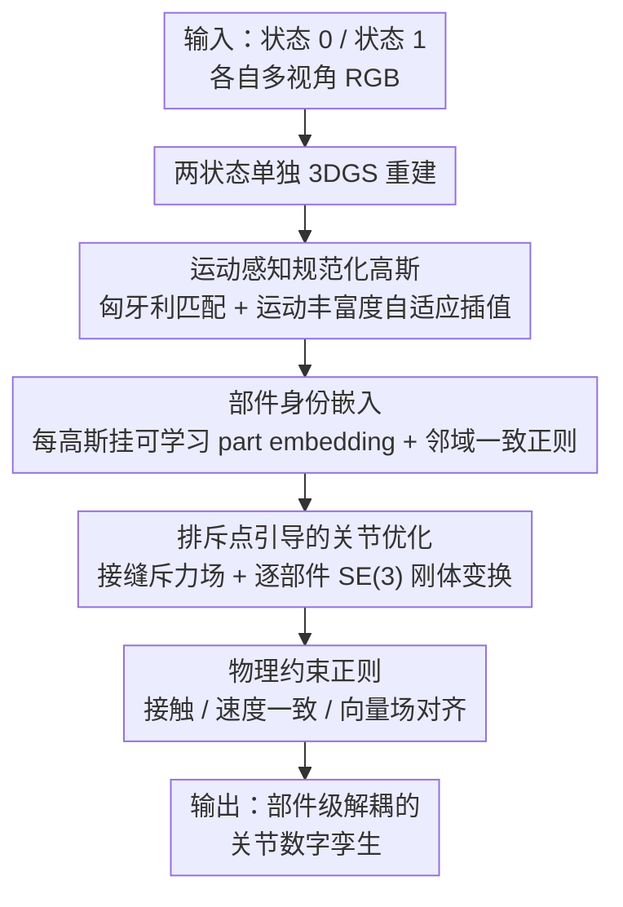

# Part$^{2}$GS: Part-aware Modeling of Articulated Objects using 3D Gaussian Splatting

**会议**: CVPR 2026  
**论文**: [CVF Open Access](https://openaccess.thecvf.com/content/CVPR2026/html/Yu_Part2GS_Part-aware_Modeling_of_Articulated_Objects_using_3D_Gaussian_Splatting_CVPR_2026_paper.html)  
**代码**: https://plan-lab.github.io/part2gs （项目页）  
**领域**: 3D视觉  
**关键词**: 3D高斯泼溅, 关节物体, 数字孪生, 部件分解, 物理约束  

## 一句话总结
Part$^{2}$GS 给每个 3D 高斯挂上一个可学习的「部件身份嵌入」，配合运动感知规范化、排斥点和物理约束，从多视角图像里同时重建出关节物体的高保真几何与物理一致的运动，在 Chamfer Distance 上比 SOTA 最多降低约 10 倍（运动部件）。

## 研究背景与动机
**领域现状**：关节物体（抽屉、橱柜、剪刀这类带可动部件的物体）在交互和操作任务里无处不在，但高质量的关节 3D 资产大多靠人工建模。近年的做法转向用 3D 高斯泼溅（3DGS）或 NeRF 从真实多视角观测里重建关节物体，把"物体在两个关节状态之间怎么动"建出来。

**现有痛点**：这些方法基本把关节运动当成**纯几何插值**问题——直接在两个状态之间做状态到状态的对应/聚类，既不考虑物理可行性，也没有语义层面的部件理解。结果就是重建里经常出现漂浮的碎块、关节穿模、运动轨迹不合物理的伪影，尤其在多部件复杂物体上更明显。

**核心矛盾**：问题的根本在于「几何插值」与「刚体物理一致性」之间脱节。现有方法要么靠无监督聚类切部件（边界糊、易塌缩），要么依赖预定义部件库 / 运动学图 / 类别模板这类外部结构先验；同时它们死板地在两个固定状态间插值，没有意识到两个状态里哪个"运动信息更丰富"。

**本文目标**：在统一的 3DGS 框架里，从原始多视角观测**同时**恢复三件事——可微的部件发现、高保真几何、物理一致的关节运动，且不依赖任何外部部件模板。

**切入角度**：作者的观察是，如果把"部件归属"直接做成高斯的一个可学习属性，让部件结构从几何、运动、物理约束里**自发涌现**，就能摆脱聚类和模板先验；再用排斥力和物理损失把运动拉回物理可行域。

**核心 idea**：给每个高斯加一个部件身份嵌入 + 运动感知规范化空间 + 排斥点 + 物理正则，让部件分解和关节运动从数据里联合学出来，而不是后处理聚类。

## 方法详解

### 整体框架
Part$^{2}$GS 的输入是同一关节物体在两个不同关节状态 $t\in\{0,1\}$ 下各自的多视角 RGB 图像，输出是一个**部件级解耦、运动物理一致**的关节数字孪生：物体被建成一个静态基座 $G_{\text{static}}$ 加 $K$ 个可动部件 $\{G_k\}$ 的高斯集合。整条流水线分四步：先用两个单状态重建对齐融合出一个「运动感知规范化高斯场」当作公共坐标系；再给每个高斯学一个部件身份嵌入，让部件无监督地分出来；然后用「排斥点」沿部件接缝施加局部斥力，把每个可动部件的 SE(3) 刚体运动优化到不穿模；最后叠加接触/速度/向量场三个物理约束，保证运动符合刚体动力学。

### 关键设计

**1. 运动感知规范化高斯：让规范空间偏向"动得多"的那个状态**

直接对两个状态做对应建模会被遮挡、视角不一致折磨，且很难一边学关节形变一边保持刚体几何。Part$^{2}$GS 不去硬学两状态对应，而是先把两个单状态重建对齐融合成一个公共的规范化高斯场。具体做法：用匈牙利匹配按高斯中心两两距离建立 $G^0_{\text{single}}$ 与 $G^1_{\text{single}}$ 的对应；对每对匹配高斯，不是简单取平均，而是用「运动丰富度」加权插值。它给每个状态估一个运动丰富度分数 $D_{t\to\bar t}=\mathbb{E}_i[\min_j \|\mu_i^{(t)}-\mu_j^{(1-t)}\|_2]$，即一个状态里每个高斯到另一状态最近邻的平均最小距离——这个值越大说明该状态里部件位移越显著、运动信息越丰富。规范高斯中心取 $\mu^c_i=\lambda\mu^0_i+(1-\lambda)\mu^1_i$，其中 $\lambda=\frac{D_{0\to1}}{D_{0\to1}+D_{1\to0}}$。这样初始化就把运动信息编码进了规范空间，给后续部件分解一个干净起点（消融与定性图都显示这是部件边界不糊的关键）。

**2. 部件身份嵌入：用高斯属性让部件自发涌现，替代启发式聚类**

标准 3DGS 只有几何，没有部件语义。本文给 Eq.(1) 里每个高斯额外挂一个紧凑可学习的部件身份嵌入 $\rho_i$，编码潜在的部件归属与几何亲和度。为了让同一表面上相邻高斯拿到一致的部件标签，作者加了一个邻域一致性正则：把 $\rho_i$ 经共享线性层 $f$ 投到 $K$ 个部件类别再 softmax 得到分布 $F(G_i)$，然后用 KL 散度把每个高斯的分布拉向它在 3D 空间 $k$ 近邻分布的均值，$L_{\text{part}}=\frac{1}{M}\sum_i D_{\mathrm{KL}}\big(F(G_i)\,\|\,\frac{1}{|N(G_i)|}\sum_{j\in N(G_i)}F(G_j)\big)$。和 ArtGS 那种启发式高斯聚类相比，这里部件边界是和物理约束**联合优化**出来的软分配，所以边界更干净、几乎没有部件漂移（CD$_{\text{movable}}$ 相对 ArtGS 降低 4–10 倍主要靠这个）。

**3. 排斥点引导的关节优化：在接缝处施加局部斥力防穿模**

可动部件相对静态基座运动时容易和基座/邻部件互相穿插。本文在静态与可动部件初始相邻的区域放一组排斥点 $R=\{r_j\}$，每个排斥点产生一个局部斥力场 $F^k_{\text{repel},i}=\sum_{r_j\in R}\frac{k_r\,(r_j-\mu^k_i)}{\|r_j-\mu^k_i\|^3}$（类似库仑力，随距离三次方衰减）。每个可动部件被建成一个 SE(3) 刚体变换 $T_k=(R_k,t_k)$，从随机初始化开始迭代细化：第 $t$ 步高斯位置先按当前变换 $\mu^{k,(t)}_i=R^{(t)}_k\mu^{k,0}_i+t^{(t)}_k$ 算，再叠加排斥力修正 $\mu^{k,(t)}_i\leftarrow\mu^{k,(t)}_i+F^k_{\text{repel},i}$。关节损失 $L_{\text{art}}$ 同时约束位置对齐和旋转一致（含 $\lambda_{\text{rot}}\,\text{Angle}(R^{(t)}_k,\hat R_k)$ 项），把每个部件的运动轨迹优化到既贴合观测又不穿模。

**4. 物理约束正则：三个物理损失把运动钉在刚体可行域**

为保证关节运动物理合理，本文叠加三个辅助损失。**接触损失** $L_{\text{contact}}=\frac{1}{|G_k|}\sum_i\max(0,-\cos\theta_i)$ 惩罚穿模：对每个可动部件高斯，令 $d_i$ 为它指向最近静态高斯的向量、$d_k$ 为指向静态基座质心的向量，当两向量夹角变钝（$\cos\theta_i<0$，意味着部件穿进了基座内侧）时受罚。**速度一致损失** $L_{\text{velocity}}=\sum_k \mathrm{Var}(\{\Delta\mu_i\mid i\in G_k\})$ 用逐高斯位移 $\Delta\mu_i=\mu^1_i-\mu^0_i$ 的部件内方差，逼同一刚体部件整体一致运动。**向量场对齐损失** $L_{\text{vector}}=\sum_k\sum_{i\in G_k}\|R_k\mu^0_i+t_k-\mu^1_i\|^2$ 把部件变换当成作用在规范高斯上的 SE(3) 向量场，要求预测变换与观测运动一致。三者合成 $L_{\text{phys}}=L_{\text{contact}}+L_{\text{velocity}}+L_{\text{vector}}$。

### 损失函数 / 训练策略
总损失整合渲染保真、部件正则、关节学习与物理一致：$L_{\text{Part2GS}}=L_{\text{render}}+\lambda_{\text{part}}L_{\text{part}}+\lambda_{\text{art}}L_{\text{art}}+\lambda_{\text{phys}}L_{\text{phys}}$，其中 $L_{\text{render}}$ 是 3DGS 标准的 $\ell_1$ + D-SSIM 渲染损失（Eq.4）。各项系数 $\lambda_{\text{part}},\lambda_{\text{art}},\lambda_{\text{phys}}$ 为权重超参。

## 实验关键数据

### 主实验
在三个关节物体数据集上对比 Ditto、PARIS、ArtGS、DTA：PARIS（10 个单部件合成物体）、ARTGS-MULTI（5 个 3–6 部件物体）、DTA-MULTI（2 个 2 部件物体）。几何用 Chamfer Distance（整体 CD$_{\text{whole}}$ / 静态 CD$_{\text{static}}$ / 可动部件 CD$_{\text{movable}}$，越低越好），关节精度用关节轴角度误差 Ang Err、旋转关节位置误差 Pos Err、部件运动误差 Motion Err。

| 数据集 | 指标（节选） | Ditto | PARIS | DTA | ArtGS | Part$^{2}$GS |
|--------|------|------|------|------|------|------|
| PARIS·Real-Fridge | Ang Err ↓ | 1.71 | 9.92 | 2.08 | 2.09 | **0.03** |
| PARIS·Real-Storage | Ang Err ↓ | 5.88 | 77.83 | 13.64 | 3.47 | **1.24** |
| PARIS·Real-Storage | CD$_{\text{movable}}$ ↓ | 20.35 | 528.83 | 30.78 | 6.28 | **5.01** |
| DTA-MULTI·Storage(7部件) | CD$_{\text{movable}}$ ↓ | — | — | 476.91 | 3.70 | **1.83** |
| ARTGS·Table(5部件) | CD$_{\text{movable}}$ ↓ | — | — | 230.38 | 3.09 | **1.85** |

在 PARIS 上几乎所有合成物体的平均角度误差低于 $0.01^\circ$，比 Ditto / PARIS 低两个数量级；旋转关节位置误差接近零。多部件的 DTA-MULTI / ARTGS-MULTI 上，最难指标 CD$_{\text{movable}}$ 相比 DTA 最多降 10 倍、相比 ArtGS 降约 3 倍。作者还做了 t 检验（n=3）：111 个"物体×指标"对里，83 对相对 ArtGS 显著更好（p<0.05），25 对无显著差异，仅 3 对更差。

### 消融实验
在两个最复杂物体（Table 5 部件、Storage 7 部件）上**累加式**消融三个组件：

| 配置 | Ang Err ↓ | Motion Err ↓ | CD$_{\text{movable}}$ ↓ | 说明（Table 5 部件） |
|------|---------|---------|---------|------|
| Vanilla | 17.32 | 27.64 | 132.21 | 裸 3DGS，几乎不可用 |
| + 部件参数 | 0.28 | 2.35 | 28.35 | 角度/运动误差降 >90%，CD 降约 4.6× |
| + 排斥点 | 0.05 | 0.18 | 4.47 | 运动误差再降约 92%，CD 再降约 84% |
| + 物理约束（完整） | **0.03** | **0.01** | **1.85** | 运动误差再降约 94% |

### 关键发现
- **部件身份嵌入贡献最大**：单独加部件参数就把角度/运动误差砍掉 90%+，CD$_{\text{movable}}$ 在 7 部件 Storage 上从 497.17 降到 15.68（约 32 倍）。说明准确的部件分割是几何与关节精度的地基。
- **排斥点专治穿模**：在它之上运动误差和 CD$_{\text{movable}}$ 再大幅下降（5 部件 Table 运动误差 2.35→0.18），印证局部斥力能有效阻止互相穿插。
- **物理约束做最后的正则**：进一步把运动误差压到 0.01、几何继续改善，保证跨状态运动的刚体一致性。
- 定性上，把运动信息编码进规范初始化对获得干净的部件感知规范空间很关键；ArtGS 在中间配置下部件分组会糊掉/塌缩，Part$^{2}$GS 仍能干净隔离抽屉、门这类运动部件。

## 亮点与洞察
- **把"部件"做成高斯属性**：让部件分解从几何 + 运动 + 物理里自发涌现，绕开了启发式聚类和类别模板，这是相对 ArtGS 最本质的区别，也是边界干净的根源。
- **运动丰富度自适应插值**很巧：用"到对侧最近邻平均距离"度量哪个状态动得多，再据此偏置规范空间，简单却直接改善了部件解耦——一个几乎零成本的初始化技巧。
- **库仑式排斥点**把"防穿模"从软约束变成可微的局部力场，思路可迁移到任何需要部件间隔离的动态 3DGS / 4D 重建任务。
- 三个物理损失（接触/速度一致/向量场对齐）都很轻量，但组合起来把纯几何插值拉回刚体可行域，是"物理感知重建"一个可复用的损失模板。

## 局限与展望
- 方法需要同一物体**两个关节状态**各自的多视角图像，且每个状态都要先做单状态重建——对采集要求不低，难以从单状态或视频片段直接学。
- 部件数 $K$ 与排斥点数 $N_R$ 等是预设/超参，论文未充分讨论 $K$ 设错（过分割/欠分割）时的鲁棒性；⚠️ 排斥系数 $k_r$ 等关键超参的敏感性也未在正文给出。
- 评测主要是合成数据集 + 少量真实物体（Real-Fridge / Real-Storage），真实世界大规模、纹理复杂或柔性部件场景的泛化仍待验证。
- 改进方向：把两状态需求放宽到任意多状态/连续视频；让部件数自适应；引入碰撞检测的物理仿真器做更强的物理监督。

## 相关工作与启发
- **vs ArtGS**：ArtGS 靠启发式高斯聚类切部件，本文用可学习部件嵌入 + 物理约束联合优化，区别在于部件边界是"涌现"而非"后聚类"，因此 CD$_{\text{movable}}$ 降 3–10 倍、几乎无部件漂移。
- **vs PARIS / DTA**：它们重度依赖两状态间固定几何插值，本文用运动感知规范化自适应偏向运动丰富状态，关节精度高两个数量级。
- **vs Ditto / 监督方法**：Ditto 等依赖预定义部件库或类别模板，本文不需要任何外部结构先验，直接从原始多视角观测恢复部件分解与关节参数。
- **vs 动态/4D 高斯（如可动 avatar）**：那类方法面向连续非刚体形变（软体、场景流），本文显式把运动绑到自动发现的部件结构上，专攻部件级刚体关节运动。

## 评分
- 新颖性: ⭐⭐⭐⭐ 把部件做成高斯可学习属性 + 运动丰富度规范化 + 排斥点，组合新颖且动机具体，但各组件多为已有思路的巧妙嫁接。
- 实验充分度: ⭐⭐⭐⭐ 三数据集 + 累加消融 + t 检验，较扎实；真实世界样本偏少、超参敏感性分析欠缺。
- 写作质量: ⭐⭐⭐⭐ 三大挑战梳理清晰，公式与图配合到位。
- 价值: ⭐⭐⭐⭐ 关节数字孪生对具身/机器人很实用，物理感知损失与排斥点可复用性强。

<!-- RELATED:START -->

## 相关论文

- [\[ICLR 2026\] PD²GS: Part-Level Decoupling and Continuous Deformation of Articulated Objects via Gaussian Splatting](../../ICLR2026/3d_vision/pd2gs_part-level_decoupling_and_continuous_deformation_of_articulated_objects_vi.md)
- [\[CVPR 2026\] Clay-to-Stone: Phase-wise 3D Gaussian Splatting for Monocular Articulated Hand-Object Manipulation Modeling](clay-to-stone_phase-wise_3d_gaussian_splatting_for_monocular_articulated_hand-ob.md)
- [\[CVPR 2026\] SPARK: Sim-ready Part-level Articulated Reconstruction with VLM Knowledge](spark_sim-ready_part-level_articulated_reconstruction_with_vlm_knowledge.md)
- [\[CVPR 2026\] VAD-GS: Visibility-Aware Densification for 3D Gaussian Splatting in Dynamic Urban Scenes](vad-gs_visibility-aware_densification_for_3d_gaussian_splatting_in_dynamic_urban.md)
- [\[CVPR 2026\] Learning Hierarchical Hyperbolic Mixture Model for Part-aware 3D Generation](learning_hierarchical_hyperbolic_mixture_model_for_part-aware_3d_generation.md)

<!-- RELATED:END -->
