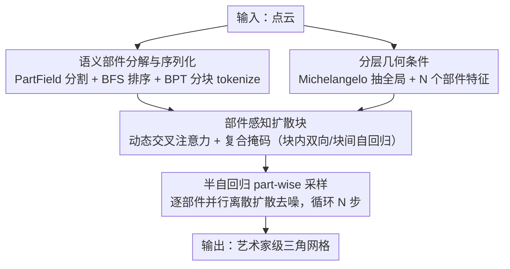

# PartDiffuser: Part-wise 3D Mesh Generation via Discrete Diffusion

**会议**: CVPR 2026  
**论文**: [CVF Open Access](https://openaccess.thecvf.com/content/CVPR2026/html/Yang_PartDiffuser_Part-wise_3D_Mesh_Generation_via_Discrete_Diffusion_CVPR_2026_paper.html)  
**代码**: 待确认  
**领域**: 3D视觉  
**关键词**: 艺术家网格生成, 离散扩散, 半自回归, 部件级生成, 点云到网格  

## 一句话总结
PartDiffuser 把"逐 token 自回归生成网格"换成"部件间自回归、部件内并行离散扩散"的半自回归框架，用部件感知交叉注意力注入分层几何条件，从而在保证全局拓扑的同时精修局部高频细节，在 Objaverse 上 Chamfer Distance 比次优方法降低约 27%。

## 研究背景与动机
**领域现状**：三角网格是游戏、VR、影视的事实标准 3D 格式。受大语言模型启发，"艺术家级"网格生成的主流范式已转向**自回归（AR）序列建模**：MeshGPT、MeshAnything 等把网格当成一维 token 序列（顶点+面），逐 token 生成，能学出结构化拓扑、产出连贯流形网格。

**现有痛点**：逐 token 串行生成有两个根本瓶颈。其一，**长序列依赖导致误差累积**——序列早期一个错误会沿着生成链条传播、污染后续。其二，模型被迫在**全局结构一致性**和**局部高频细节**之间做取舍：为了保证全局拓扑正确，它倾向于把细粒度高频几何特征过度平滑或简化。

**核心矛盾**："全局 vs 局部"的冲突叠加误差累积，本质来自把"维持全局拓扑"和"刻画局部细节"这两个目标耦合在同一条 token 串行链上——它们对生成顺序和并行度的需求是矛盾的。

**本文目标**：解耦这两个任务——全局结构靠"部件级"依赖来保证，局部细节靠"部件内"建模来精修，同时把自回归步数从 token 级降到部件级以缓解误差累积。

**切入角度**：作者注意到扩散语言模型里的**半自回归（block-wise）采样**（如 BD3-LM）正好能化解这种 trade-off：块间自回归、块内并行扩散。把"块"换成"语义部件"就天然契合艺术家按部件建模的工作流。

**核心 idea**：部件之间用自回归保全局拓扑，部件内部用并行离散扩散保高频细节——一次生成一个完整语义部件。

## 方法详解

### 整体框架
PartDiffuser 输入一个点云（条件），输出一个艺术家级三角网格，整条流水线是"先分部件、再半自回归逐部件扩散生成"。先用 PartField 对网格/点云做语义分割得到 $N$ 个部件，按邻接关系做 BFS 遍历把部件排成保局部性的 1D 序列，再用 BPT 把每个部件序列化成 token 块并补齐到统一长度；同时用预训练 Michelangelo 点云编码器抽出**分层几何条件**（一个全局特征 + $N$ 个部件特征）。生成时基于 DiT 的离散扩散逐部件进行：生成第 $i$ 个部件时，部件感知扩散块里的交叉注意力只看「全局特征 + 第 $i$ 个部件特征」，自注意力用复合掩码做到"块内双向、块间自回归"，对该部件的所有 token 并行去噪；一个部件去噪完再切换条件生成下一个，循环 $N$ 步拼出整网格。

### 关键设计

**1. 语义部件分解与序列化：把网格切成保局部性的部件 token 块**

要让离散扩散学好"部件内局部双向上下文"，得先把全局网格切成内部一致的语义部件。本文用 PartField 做语义分割，目标簇数在预定义区间里随机采（增数据多样性），采样点云沿用与网格相同的分割。切完后按部件邻接关系建邻接矩阵，并**随机选一个起点做 BFS 遍历**把部件排成 1D 序列——BFS 逐层探索的特性天然保留局部性，让空间上相邻的部件在序列里也靠得近，方便模型捕捉物理相邻部件间的强依赖。每个部件再用 BPT（Blocked and Patchified Tokenization）序列化：BPT 把相邻面分组成 patch，每个 patch 由一个中心顶点 + 邻居表示，靠双块词表用"中心顶点的独特 token 类型"隐式标记新 patch 起点，避免特殊分隔符。最后把每个部件序列 padding 到统一长度再拼装。

**2. 分层几何条件：全局特征定结构、部件特征精局部**

为了同时指导"装配"和"细节"，本文用预训练 Michelangelo 点云编码器从输入点云导出一个**分层**条件 $C_{\text{pc}}$：一个全局特征向量 $C_{\text{global}}$ 抓整体形状，外加 $N$ 个部件特征 $\{C_{\text{part}_1},\dots,C_{\text{part}_N}\}$，每个 $C_{\text{part}_i}$ 编码第 $i$ 个语义部件的局部几何。$C_{\text{pc}}$ 由全局向量与 $N$ 个部件向量拼接而成，把几何上的部件分解直接绑到生成输出的结构上。消融显示这两级缺一不可（见下）：只用全局会丢局部细节，只用部件会丢全局装配能力。

**3. 部件感知扩散块：动态交叉注意力 + 复合掩码实现部件级控制**

本文在标准 DiT 块里插入一个交叉注意力模块。前向是 $Z'=\text{SelfAttn}(\text{LN}(Z))+Z$，$\hat Z=\text{CrossAttn}(Q=\text{LN}(Z'),K=C_{\text{dyn}},V=C_{\text{dyn}})+Z'$，再过 FFN+残差。关键在 $C_{\text{dyn}}$ 的**动态选择**：处理第 $i$ 个部件时，$C_{\text{dyn}}=[C_{\text{global}},C_{\text{part}_i}]$——交叉注意力只看全局 + 当前部件特征，强制 token 块与其对应部件几何精确对齐。自注意力则用一个**复合掩码**实现半自回归：块内允许完全双向注意力（充分建模部件内上下文），块间强制自回归（部件 $i$ 只能注意已生成的 $X_{<i}$）；另配一个 Block-Aware Padding Mask 协同管理 padding token 的可见性。这套"块内双向、块间因果"正是把全局拓扑与局部细节解耦的执行机制。

**4. 半自回归 part-wise 采样：训练并行、推理逐部件**

整个生成被形式化为半自回归条件扩散：网格似然按部件分解 $p_\theta(X|C_{\text{pc}})=\prod_{i=1}^N p_\theta(X_i|X_{<i},C_{\text{pc}})$，每个部件分布用离散扩散建模，$p_\theta$ 学的是给定带噪 $X^t_i$、前序部件 $X_{<i}$（自注意力处理）和动态几何条件 $C_{\text{dyn},i}$（交叉注意力处理）去预测干净 token $X^0_i$。沿用掩码扩散的简化目标，第 $i$ 部件损失 $L_i=\mathbb{E}_{t,X^t_i}\big[w(t)(-\log p_\theta(X^0_i|X^t_i,X_{<i},C_{\text{dyn},i}))\big]$，$w(t)$ 是噪声调度导出的时间权重。训练时（仿 BD-LM）走并行模式，整条序列划成噪声块/干净块，高效教模型把 token 块和部件级几何特征关联起来；**推理时**走半自回归，逐部件在 $N$ 个 stride 上重建，块内用 LLaDA 的采样策略迭代预测并选择性 remask 低置信 token，一个部件去噪完更新条件再生成下一个。

### 损失函数 / 训练策略
训练数据是 Objaverse + 3DFront 过滤组合，先用 PartField 分割，丢弃任何单个部件编码序列超过 1024 token 的样本，最终约 81K 样本。模型 0.3B 参数，最大序列长 4096 token，半自回归块大小 1024（对齐过滤阈值）。两阶段训练：8×H100 预训练 3 天 + 4×H100 微调两周。

## 实验关键数据

### 主实验
点云条件生成，对比三个开源 SOTA：MeshAnythingV2、BPT、TreeMeshGPT；测试集从 Objaverse、HSSD、3DFront 各随机取 300 样本。指标：Chamfer Distance（CD，×$10^3$）、Hausdorff Distance（HD）、Earth Mover's Distance（EMD）越低越好，F1-Score 越高越好。

| 数据集 | 指标 | MeshAnythingV2 | BPT | TreeMeshGPT | PartDiffuser |
|--------|------|------|------|------|------|
| Objaverse | CD ×$10^3$ ↓ | 24.402 | 86.837 | 36.938 | **17.813** |
| Objaverse | F1 ↑ | 0.285 | 0.138 | 0.279 | **0.343** |
| HSSD | EMD ↓ / F1 ↑ | 0.077 / 0.383 | 0.093 / 0.369 | 0.061 / 0.441 | **0.059 / 0.471** |
| 3DFront | CD ×$10^3$ ↓ | 10.406 | 15.652 | 7.793 | **6.461** |

在最复杂多样的 Objaverse 上，PartDiffuser **四项指标全面最优**：CD 17.813 比次优 MeshAnythingV2 提升约 27%，F1 0.343 比次优 0.285 高近 20%。在偏规则家具的 HSSD/3DFront 上也高度有竞争力（3DFront 上 CD/HD/EMD 三项第一，F1 0.453 略低于 TreeMeshGPT 的 0.462）。定性上 BPT 在 Objaverse 上几乎产不出连贯网格，MeshAnythingV2/TreeMeshGPT 全局尚可但常有局部过繁/过简伪影且因 AR 误差累积偏离输入。

### 消融实验
在 Objaverse 测试集上消融分层几何条件（变体用完整模型权重初始化后再训 30% 步数以公平比较）：

| 配置 | CD ×$10^3$ ↓ | HD ↓ | EMD ↓ | F1 ↑ | 说明 |
|------|---------|------|------|------|------|
| Full（全局+部件） | **17.813** | **0.238** | **0.115** | **0.343** | 完整分层条件 |
| w/ Global only | 29.125 | 0.297 | 0.144 | 0.281 | 去掉部件特征，细节变差 |
| w/ Parts only | 54.728 | 0.356 | 0.205 | 0.239 | 去掉全局特征，装配崩坏，最差 |

### 关键发现
- **全局与部件特征协同且缺一不可**：只用全局，缺细粒度指导、局部几何重建不准（CD 29.125）；只用部件，缺全局上下文、装配不起来，掉点最严重（CD 54.728）。证明全局负责"结构完整 + 正确装配"，部件负责"高保真局部细节"。
- **效率—质量可调**：引入加速因子 $k$ 按比例减少每块扩散步 $T$。$k{=}4$（$T{=}256$）相对默认 $k{=}1$（$T{=}1024$）提速约 3.7×（63.8s→17.1s），但 CD 从 17.813 升到 44.720——全局拓扑仍在、高频细节变得不规则/破碎。说明要高保真就得保留足够采样预算。
- 部件级（而非 token 级）自回归把误差累积限制在部件边界，避免 AR 方法那种拓扑错误沿长序列传播。

## 亮点与洞察
- **把扩散语言模型的半自回归搬到网格生成**：用"语义部件"当 block，既保全局拓扑又能块内并行精修，这是对"全局 vs 局部" trade-off 一个干净的结构性解法，思路清晰可迁移。
- **动态交叉注意力条件 $C_{\text{dyn}}=[C_{\text{global}},C_{\text{part}_i}]$**很巧：同一套权重靠"换条件"就让每个部件块只对齐自己的几何，几乎零额外结构成本就实现了部件级控制。
- **BFS 部件排序**是个容易忽视但有效的 trick：用图遍历保证序列局部性，让相邻部件在 1D 序列里也相邻，降低模型学跨部件依赖的难度。
- 复合掩码"块内双向 + 块间因果"是把"并行扩散"和"自回归全局一致性"缝在一个注意力里的关键执行细节，可复用到其他结构化序列的半自回归生成。

## 局限与展望
- **依赖上游分割**：整个流程建立在 PartField 分割质量上，分割错了会直接传导到生成；作者也承认这点，并提出端到端联合训练为未来方向。
- **规模/上下文受限**：0.3B 参数 + 1024 块大小 / 4096 序列长，限制了可生成 3D 资产的整体规模与复杂度；训练样本被"单部件≤1024 token"硬过滤掉一部分。
- **采样慢**：默认高保真设置每网格约 63.8s，加速则明显掉质量，效率—保真权衡尚未很好解决。
- ⚠️ 论文未给纯自回归基线在相同部件分割下的对照（即"半自回归"增益里有多少来自部件先验本身），消融只针对几何条件这一维。
- 改进方向：扩大模型与上下文窗口、研究更优并行采样策略、端到端联合分割+生成、扩展到多模态输入。

## 相关工作与启发
- **vs MeshGPT / MeshAnything / TreeMeshGPT（逐 token AR）**：它们 token 级串行，受误差累积和"全局 vs 局部"取舍困扰；本文把自回归降到部件级、部件内并行扩散，Objaverse 上 CD 提升约 27%、细节更锐。
- **vs TSSR（全并行离散扩散）**：TSSR 把全并行扩散拆成拓扑雕刻+形状精修两阶段来救拓扑准确性；本文不走全并行，而用半自回归在部件粒度兼顾全局拓扑与局部细节。
- **vs BD3-LM / LLaDA（扩散语言模型）**：本文借用其块级半自回归与块内采样策略，把"block"具象成 3D 语义部件并配上分层几何条件，是该范式向 3D 网格的一次成功迁移。
- **vs PartCrafter / PartPacker / 连续 DiT 部件生成**：那些方法多依赖连续隐空间/中间表示，转最终网格时有信息损失、难保部件间拓扑一致；本文直接在离散 token 上做部件生成，拓扑更可控。

## 评分
- 新颖性: ⭐⭐⭐⭐ 把半自回归扩散范式迁到艺术家网格生成 + 动态部件条件，组合新颖；底层 block 思想借自扩散语言模型。
- 实验充分度: ⭐⭐⭐⭐ 三数据集对比 + 条件消融 + 效率分析较完整；缺"部件先验 vs 半自回归"解耦的对照，真实评测主要离线指标。
- 写作质量: ⭐⭐⭐⭐ 动机—解耦思路—执行机制讲得清楚，复合掩码细节略压到附录。
- 价值: ⭐⭐⭐⭐ 艺术家级网格生成是高需求方向，部件级半自回归框架对缓解误差累积有普适启发。

<!-- RELATED:START -->

## 相关论文

- [\[CVPR 2026\] ActionMesh: Animated 3D Mesh Generation with Temporal 3D Diffusion](actionmesh_animated_3d_mesh_generation_with_temporal_3d_diffusion.md)
- [\[CVPR 2026\] TokenHand: Discrete Token Representation for Efficient Hand Mesh Reconstruction](tokenhand_discrete_token_representation_for_efficient_hand_mesh_reconstruction.md)
- [\[CVPR 2026\] MeshFlow: Efficient Artistic Mesh Generation via MeshVAE and Flow-based Diffusion Transformer](meshflow_efficient_artistic_mesh_generation_via_meshvae_and_flow-based_diffusion.md)
- [\[CVPR 2026\] Learning Hierarchical Hyperbolic Mixture Model for Part-aware 3D Generation](learning_hierarchical_hyperbolic_mixture_model_for_part-aware_3d_generation.md)
- [\[CVPR 2026\] DICArt: Advancing Category-level Articulated Object Pose Estimation in Discrete State-Spaces](dicart_advancing_category-level_articulated_object_pose_estimation_in_discrete_s.md)

<!-- RELATED:END -->
