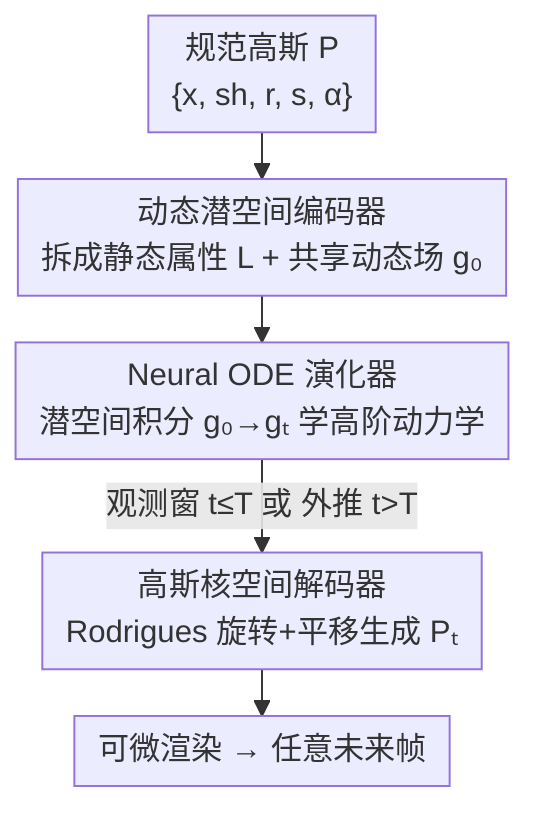

# ParticleGS: Learning Neural Gaussian Particle Dynamics from Videos for Prior-free Physical Motion Extrapolation

**会议**: CVPR 2026  
**论文**: [CVF Open Access](https://openaccess.thecvf.com/content/CVPR2026/html/Quan_ParticleGS_Learning_Neural_Gaussian_Particle_Dynamics_from_Videos_for_Prior-free_CVPR_2026_paper.html)  
**代码**: 无  
**领域**: 3D视觉  
**关键词**: 动态3DGS, 运动外推, Neural ODE, 物理建模, 粒子动力学

## 一句话总结
ParticleGS 把每个 3D 高斯当作一个受物理规律驱动的"粒子"，用一组共享的潜在动态场 + Neural ODE 学习其连续时间演化规律，从而在观测时间窗之外做出物理一致的运动外推，在 4 个动态场景数据集上的外推 PSNR 比时间条件方法高 5 dB 以上、比速度场方法高约 2.5 dB。

## 研究背景与动机

**领域现状**：动态 3D 重建（NeRF / 3DGS 系）目前的主流做法是学一个**时间条件的形变场** $D(P, t) = P_t$：先有一组规范（canonical）高斯 $P$，再用一个以时间戳 $t$ 为输入的网络把它们形变到任意时刻的状态。这套范式在**观测时间窗内插值**渲染上已经做到很高保真度。

**现有痛点**：把形变写成"时间的函数"，本质上是让网络**死记**每个离散时刻对应的形变长什么样，并没有学到驱动运动的底层物理规律。后果是：一旦要外推到没观测过的未来帧（$t > T$），时间条件模型就只能瞎猜，给出物理上不合理的运动——物体飞散、停滞、或穿模。

**核心矛盾**：真正的运动是被**物理状态**（速度、加速度、受力场……）连续驱动的，而时间戳 $t_1$、$t_2$ 之间是相互独立的、不携带系统历史信息。用 $t$ 当条件，从根上就丢掉了"当前状态决定下一刻"的马尔可夫结构，自然学不出可外推的规律。

**已有补救及其不足**：往动态 3D 里注入物理有两条路。一是显式注入物理先验（仿真器、PINN 把 Navier–Stokes 写进 loss、内置刚体/弹簧约束），但要靠手工指定外力或受限假设，泛化差；二是依赖几何先验（预处理好的点云/网格），没法直接从原始 RGB 观测学动力学，且常需多阶段优化。更近的工作用**速度场/加速度场**建模刚体运动，但这种**低阶动力学**不足以刻画复杂形变。

**核心 idea**：把动态 3D 场景重新表述成一个**物理粒子系统**——每个高斯就是一个粒子，其时间演化由一个潜在**物理状态向量**驱动；用 Neural ODE 学习该状态在潜空间里的**连续时间高阶演化规律**，而不是记忆形变轨迹。这样就能"遵循学到的物理定律积分到未来"，实现 prior-free（无需预定义物理方程或结构化几何输入）的运动外推。

## 方法详解

### 整体框架

ParticleGS 是一个 **Encoder–Evolver–Decoder** 三段式框架。和时间条件方法 $R(D(P, t), v)$ 不同，它的渲染写成 $R(D(P, Z_t), v) = \hat{I}_t^v$：驱动高斯形变的不再是时间戳 $t$，而是物理状态集合 $Z_t$。$Z_t$ 由初始状态 $Z_0$ 演化而来，$Z_0$ 又由规范高斯 $P$ 编码得到。作者强调这套"以状态为条件"相比"以时间为条件"有三个本质优势：① 时空感知——$Z_t$ 隐式编码了 $0\to t$ 的整段系统历史，而 $t$ 只编码了时间顺序；② 物理合理性——以状态为条件更符合真实粒子系统；③ 马尔可夫性——从 $Z_t$ 的演化只依赖当前状态，足以预测下一刻。

整条 pipeline 是：规范高斯 $P$ →（Encoder）初始物理状态 $Z_0$ →（Neural ODE Evolver 在潜空间积分）任意时刻 $Z_t$ →（Decoder）每个高斯的形变参数 $P_t$ → 可微渲染。其中只有 Encoder 把状态拆成**静态属性 + 共享动态场**、Evolver 用 Neural ODE 学高阶演化、Decoder 用 Rodrigues 旋转做物理形变这三处是本文真正的贡献，输入编码和渲染是脚手架。

### 关键设计

**1. 因子化潜空间编码：把 N×G 个状态压成静态属性 + F 个共享动态场**

直接给每个高斯一个独立、随时间演化的状态向量，计算量是 $O(NG)$（$N$ 是高斯数，可达几十万），演化器根本扛不住。作者借鉴 Material Point Method 的物理直觉：粒子各自保留**静态属性**（质量、材质），而其运动由**跨粒子共享的动态场**（如重力场）驱动。于是把状态因子化为两部分——$N$ 个粒子级静态特征 $L \in \mathbb{R}^{N \times S}$，以及 $F$ 个系统级、所有高斯共享的动态场 $g_t \in \mathbb{R}^{F \times G}$。完整物理状态集合通过把动态场广播给每个粒子拼出来：

$$Z_t = \text{concat}[L,\ \mathbf{1}_N \otimes g_t^{\text{flat}}], \quad Z_t \in \mathbb{R}^{N \times (S + F\cdot G)}$$

其中 $g_t^{\text{flat}}$ 是展平的动态场，$\mathbf{1}_N \otimes g_t^{\text{flat}}$ 用 Kronecker 积把全局场复制到全部 $N$ 个粒子。关键在于：演化阶段**只演化 $F$ 个动态场而非全部 $N$ 个状态**，把动力学演化的复杂度从 $O(NG)$ 降到 $O(FG)$（$F \ll N$，实验里 $F=8$）。这 $F$ 个动态场可解读为动力学的一组**基分解**，每个场捕捉一种运动模态。具体编码器 $f_{\text{encoder}}$ 先用线性层把高斯特征转成静态特征 $L$，再用 Mini-PointNet++（最远点采样 + kNN）构造邻域 patch 以适配可变的高斯数，最后用带 $F$ 个可学习 query 的交叉注意力 + 自注意力**层级聚合**出初始动态场 $g_0$，即 $f_{\text{encoder}}(P) = Z_0$。

**2. Neural ODE 动力学演化器：学高阶连续动力学而非记忆轨迹**

低阶建模（只学速度场）刻画不了复杂形变，但真实物理场往往受**高阶微分方程**（如牛顿定律）支配，而 RNN/MLP 这类离散步进模型很难无痛地捕捉连续时间、高阶动力学。作者的解法基于一个经典等价：任意 $n$ 阶微分方程 $\frac{d^n x}{dt^n} = f(x, \frac{dx}{dt}, \dots, \frac{d^{n-1}x}{dt^{n-1}}, t)$，都可以通过把状态**增广**为它的各阶导数 $X = (x, \frac{dx}{dt}, \dots, \frac{d^{n-1}x}{dt^{n-1}})$ 改写成一阶系统 $\frac{dX}{dt} = F(X, t)$——也就是说，定义在增广潜空间上的一阶系统**足以表达任意高阶动力学**。于是直接让动态场 $g_t$ 充当这个增广状态，用一个 Neural ODE 网络 $f_{\text{evolver}}$ 建模其导数：

$$\frac{d g_t}{dt} = f_{\text{evolver}}(g_t, t)$$

未来任意时刻 $t+\delta t$ 的动态场通过数值积分得到：

$$g_{t+\delta t} = g_t + \int_t^{t+\delta t} f_{\text{evolver}}(g_\tau, \tau)\, d\tau = \text{ODESolver}(f_{\text{evolver}}, g_t, t, t+\delta t)$$

数值求解器用常见的四阶 Runge–Kutta（RK4）。与"记忆一条轨迹"相反，$f_{\text{evolver}}$ 学的是支配动态场的**局部高阶导数**（即物理定律本身），因此外推时只要继续积分这个学到的导数场就能得到稳定、物理一致的未来状态——这正是它能外推、而时间条件模型不能的根本原因。注意演化只作用在 $F$ 个动态场上，所以一次前向只需评估 $F$ 个场，而不是对全部 $N$ 个高斯算速度，效率上很省。

**3. 高斯核空间物理解码：用 Rodrigues 旋转把状态翻译成形变**

光有演化好的潜状态还不能渲染，得把它翻译回每个高斯的形变。作者把高斯核运动**分解为平移 + 旋转**，并用物理上有意义的 Rodrigues 旋转公式来生成旋转，从而保持运动的物理可解释性。解码器是一个多头 MLP $f_{\text{decoder}}$，把每个粒子的物理状态 $z_t$ 映射成平移向量 $T$、运动旋转向量 $R$ 以及形变项 $\{\delta r, \delta s\}$，再用它们更新高斯参数：

$$x_t = \text{Rod}(R)\, x + T, \quad r_t = r \circ \delta r, \quad s_t = s + \delta s$$

其中 $\text{Rod}(R)$ 是由 $R$ 经 Rodrigues 公式生成的旋转矩阵，$\circ$ 是四元数乘法。这种"平移 + 旋转"的运动因子化让模型能学到有物理含义的运动分量（消融里去掉 Rodrigues 形变后外推精度明显下降），而不是把形变当成一团无结构的偏移量去拟合。

### 损失函数 / 训练策略

渲染损失沿用动态 3DGS 的标准组合，对高斯核与 ParticleGS 网络联合优化：$\mathcal{L} = \mathcal{L}_1 + \mathcal{L}_{\text{D-SSIM}}$。为避免 ODE 求解器在早期把误差一路传播导致训练不稳，作者用**渐进式训练**三段走：① 几何热身——冻结 ParticleGS，只在 $t=0$ 优化高斯核；② 动力学热身——冻结高斯核，逐步扩大时间窗，让网络先学到形变趋势；③ 联合优化——同时优化高斯核与 ParticleGS。此外，由于训练中会周期性 densification/pruning 导致高斯数 $N$ 变化，作者提出**在线邻域正则化**：不一次性算好邻域图缓存到底，而是周期性重新生成邻域 patch，相当于一种数据增强，提升编码器对不同局部粒子结构的鲁棒性。Encoder/Decoder 把 $N$ 个粒子当 batch 逐个处理，Mini-PointNet++ + 交叉注意力则把可变大小输入 $N$ 映射成固定大小输出 $F$。

## 实验关键数据

### 主实验

外推任务（训练用视频前 75% 帧、测试后 25%）在合成 + 真实四个数据集上全面领先。下表为外推（Extrapolation）指标对比，加粗为本文：

| 数据集 | 指标 | ParticleGS | FreeGave | TRACE | DeformGS |
|--------|------|------------|----------|-------|----------|
| Dynamic Object | PSNR↑ | **39.78 / 36.47** | 38.64 / 33.63 | 38.01 / 33.36 | 37.38 / 26.16 |
| Dynamic Object | LPIPS↓ | **0.009 / 0.012** | 0.011 / 0.012 | 0.011 / 0.013 | 0.034 / 0.038 |
| Dynamic Indoor | PSNR↑ | **25.50 / 31.10** | 19.68 / 28.98 | 22.85 / 29.48 | 20.02 / 21.98 |
| Dynamic Multipart | PSNR↑ (外推) | **36.14** | 33.53 | 33.46 | 27.99 |
| FreeGave-GoPro（真实） | PSNR↑ (外推) | **26.79** | 26.51 | 25.92 | 21.67 |

> 注：Dynamic Object / Indoor 两列为"重建 / 外推" PSNR。本文在外推上相对时间条件方法领先 5 dB 以上，相对速度场方法（TRACE / FreeGave）平均领先约 2.5 dB，且在真实世界 GoPro 数据集上同样最优。

速度方面（FPS，Table 3）：ParticleGS 在 Dynamic Object 上 44.3 FPS、Indoor 上 37.1 FPS，虽引入 Neural ODE 但因只前向评估 $F$ 个动态场（而非对全部 $N$ 个高斯算速度），渲染速度与速度场方法相当（FreeGave 仅 32.3 / 32.1 FPS）。

### 消融实验

在 Dynamic Object / Indoor 上逐组件消融（外推 PSNR，完整模型 36.47 / 31.10）：

| 配置 | Object PSNR↑ | Indoor PSNR↑ | 说明 |
|------|------|------|------|
| Full（$F=8$） | **36.47** | **31.10** | 完整模型 |
| w/o 因子化编码 (FE) | 36.39 | — | 性能不升反微降，且显存暴涨 |
| $F=1$ | 35.21 | 28.03 | 动态场太少，明显掉点 |
| $F=4$ | 36.24 | 30.98 | 接近最优 |
| $F=16$ | 36.55 | 31.07 | 再增收益有限 |
| w/o Neural ODE（换 MLP） | 34.55 | 27.46 | **掉点最多** |
| w/o 物理解码 (PD, Rodrigues) | 35.34 | 28.65 | 外推精度明显下降 |
| w/o 渐进训练 (PT) | 35.44 | 29.17 | 训练不稳，掉点 |
| w/o 邻域正则 (NR) | 35.99 | 30.23 | 鲁棒性下降 |

### 关键发现
- **Neural ODE 是命脉**：把演化器换成同参数量 MLP 后掉点最严重（Indoor 31.10→27.46），印证高阶连续动力学就该用 Neural ODE 建模，离散步进模型学不出可外推的规律。
- **因子化编码主打效率不主打精度**：去掉它精度几乎不变（36.47→36.39）但显存暴涨，说明它的价值是在不损精度的前提下把演化复杂度从 $O(NG)$ 压到 $O(FG)$；运动本身有相关性，给每粒子独立状态反而略降性能。
- **动态场数 $F$ 存在甜区**：$F=1$ 明显不足，$F=4\to8$ 显著提升，$F=16$ 收益饱和——少量但充分的动态场就足以刻画规律运动模态。
- **物理一致的解码确有用**：去掉 Rodrigues 旋转形变后外推精度可见下降，说明把运动拆成"物理上有意义的平移 + 旋转"帮助模型学到真实动态。

## 亮点与洞察
- **"状态条件"替代"时间条件"是观念级的转变**：把渲染从 $D(P, t)$ 改成 $D(P, Z_t)$，一行公式就把"记忆形变"变成"遵循物理状态演化"，外推能力的来源被讲得很清楚——$Z_t$ 携带系统历史且满足马尔可夫性，$t$ 不携带。
- **用高阶→一阶增广的经典技巧支撑 Neural ODE 选型**：作者没有空喊"用 ODE 更物理"，而是用"任意 $n$ 阶方程可增广成一阶系统"论证了为什么定义在动态场潜空间上的一阶 Neural ODE 足以表达高阶动力学，理论动机扎实。
- **因子化（静态属性 + 共享动态场）是可迁移的设计**：把"每粒子独立状态"换成"少数共享场 + 逐粒子静态属性"，本质是用 MPM 式物理直觉做降维，这个 $O(NG)\to O(FG)$ 的思路可迁移到任何粒子/点云级的时序建模。
- **prior-free 的实用价值**：不需要预定义物理方程，也不需要预处理点云/网格，直接从多视角 RGB 视频学，比 PINN 和几何先验类方法更易落地。

## 局限与展望
- 作者承认：ParticleGS **学不会训练中没见过、且偏离已观测物理动态的运动**（如物体突然断裂/碎裂）——因为它学的是"延续观测到的规律"，对突变事件无能为力。
- ⚠️（自己发现）评测高度集中在 NVFi/FreeGave 设定下的"前 75% 训练、后 25% 外推"协议，外推时长相对较短；对**更长时程**外推时 ODE 积分误差是否累积、物理一致性能维持多久，论文未充分展示。
- 共享动态场 $g_t$ 假设运动由**全局少数模态**驱动，对存在大量**局部独立运动**（多主体各自为政、强非刚体局部细节）的场景，$F$ 个全局场是否够用、是否需要分层/分区动态场，是值得展开的方向。
- 物理状态 $Z_t$ 的可视化只是定性显示"运动相似的高斯特征相近、随时间平稳变化"，并未与真实物理量（真实速度/受力）做定量对照，"学到的是否真是物理规律"更多是间接论证。

## 相关工作与启发
- **vs 时间条件动态 3DGS（DeformGS / Grid4D / TiNeuVox）**：它们学 $D(P, t)$，把形变当时间的函数，只能在观测窗内插值；ParticleGS 学状态演化 $D(P, Z_t)$，能外推，外推 PSNR 领先 5 dB 以上。
- **vs 注入物理先验（NVFi 的 PINN / GaussianPrediction 的 GCN 刚体约束）**：它们要把 Navier-Stokes 等方程或刚体邻域关系显式写进模型，受限于"物理定律well-defined"的场景；ParticleGS 无需预定义方程，直接从视频学动力学。
- **vs 速度场方法（FreeGave / TRACE）**：它们用（无散度）速度场建模低阶运动；ParticleGS 用 Neural ODE 学更一般的高阶粒子动力学，外推平均高约 2.5 dB，且因只演化 $F$ 个共享场，速度仍与之相当。
- **启发**：核心方法论是把"时序拟合"问题改写成"潜空间动力系统的状态演化"问题——凡是现有方法靠"以时间/索引为条件死记输出"的任务（轨迹预测、可控生成的时序维度等），都可以借鉴"状态条件 + Neural ODE 积分"来换取外推/泛化能力。

## 评分
- 新颖性: ⭐⭐⭐⭐⭐ 把动态 3DGS 重构为"粒子物理状态 + Neural ODE 演化"，从根上解决时间条件方法不能外推的问题，观念与方法都新。
- 实验充分度: ⭐⭐⭐⭐ 4 个数据集（含真实 GoPro）+ 三类 baseline + 6 组消融，外推/重建/速度全覆盖；外推时程偏短、缺长时程与物理量定量对照。
- 写作质量: ⭐⭐⭐⭐⭐ 用三条"状态优于时间"的论证 + 高阶→一阶增广理论把动机讲得非常清楚，公式与框架自洽。
- 价值: ⭐⭐⭐⭐⭐ prior-free、不依赖预定义物理或几何先验，面向游戏/自动驾驶/机器人等预测建模，落地性强。

<!-- RELATED:START -->

## 相关论文

- [\[CVPR 2026\] Learning a Particle Dynamics Model with Real-world Videos](learning_a_particle_dynamics_model_with_real-world_videos.md)
- [\[CVPR 2026\] Node-RF: Learning Generalized Continuous Space-Time Scene Dynamics with Neural ODE-based NeRFs](node-rf_learning_generalized_continuous_space-time_scene_dynamics_with_neural_od.md)
- [\[CVPR 2026\] Learning Explicit Continuous Motion Representation for Dynamic Gaussian Splatting from Monocular Videos](learning_explicit_continuous_motion_representation_for_dynamic_gaussian_splattin.md)
- [\[CVPR 2026\] P2GS: Physical Prior-guided Gaussian Splatting for Photometrically Consistent Urban Reconstruction](p2gs_physical_prior-guided_gaussian_splatting_for_photometrically_consistent_urb.md)
- [\[ICCV 2025\] TRACE: Learning 3D Gaussian Physical Dynamics from Multi-view Videos](../../ICCV2025/3d_vision/trace_learning_3d_gaussian_physical_dynamics_from_multi-view_videos.md)

<!-- RELATED:END -->
