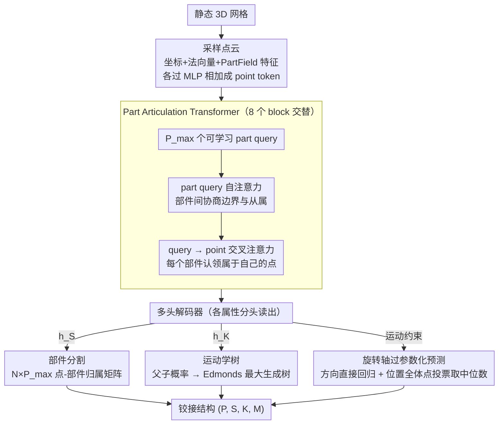

# Particulate: Feed-Forward 3D Object Articulation

**会议**: CVPR 2026  
**arXiv**: [2512.11798](https://arxiv.org/abs/2512.11798)  
**代码**: [https://ruiningli.com/particulate](https://ruiningli.com/particulate)  
**领域**: 3D视觉  
**关键词**: 铰接物体, 3D部件分割, 运动约束预测, 前馈推理, Transformer

## 一句话总结
Particulate 提出了一个前馈式模型，给定静态 3D 网格即可在数秒内推断出完整的铰接结构（部件分割、运动学树、运动约束），基于 Part Articulation Transformer 在公开数据集上端到端训练，显著优于需要逐物体优化的现有方法，并能与 3D 生成模型结合实现从单张图像到铰接 3D 物体的生成。

## 研究背景与动机

1. **领域现状**：大多数现实物体不仅有形状，还有运动能力（如柜门旋转、抽屉滑动）。理解物体的铰接结构对于机器人操作、游戏仿真、数字孪生至关重要。现有方法要么依赖规则式程序生成难以覆盖长尾物体，要么需要逐物体多视角优化耗时极长（10-20分钟以上）。

2. **现有痛点**：学习式方法分三类——(a) 3D 部件分割方法只预测语义分割不建模铰接关系；(b) 3D 铰接物体生成方法仅覆盖少数类别且假设运动学结构已知；(c) 基于 VLM 的方法（如 Articulate AnyMesh）虽然泛化性好但需要逐物体优化十几分钟且无法处理内部/遮挡部件。

3. **核心矛盾**：如何在保持泛化性的同时实现快速前馈推理，且能处理内部不可见部件？

4. **本文目标** 从静态 3D 网格直接前馈式预测完整铰接结构（部件分割 + 运动学树 + 运动参数），支持多关节、多类别、AI 生成的 3D 资产。

5. **切入角度**：利用 Transformer 的灵活性和可扩展性，在大规模多类别铰接数据集上端到端训练，用 learnable part query 和多头解码器分别预测各铰接属性。

6. **核心 idea**：用标准 Transformer + learnable part queries 在点云上做端到端训练，一次前馈推理即可预测所有铰接属性，包括部件分割、运动学树和运动约束。

## 方法详解

### 整体框架
这篇论文要解决的是：给一个静态 3D 网格，怎么不做任何逐物体优化，一次前馈就把它"会怎么动"全部说清楚。所谓"说清楚"被形式化成一个四元组 $\mathcal{A} = (P, S, K, M)$——部件数 $P$、每个网格面归属哪个部件的分割映射 $S$、谁带动谁的运动学树 $K$、以及每个关节的运动约束 $M$（旋转还是平移、方向、旋转轴、运动范围）。整条 pipeline 很直：网格先采样成点云，送进一个 Transformer backbone 同时编码出"点的表示"和"部件的表示"，再由几个并行的解码头分头把分割、运动学树、运动参数各自读出来。因为所有属性是同一次前馈里并行产出、不再逐物体迭代，推理只需约 10 秒，而此前基于 VLM 的方法要十几分钟。

### 关键设计

**1. Part Articulation Transformer：用 DETR 风格的 part query 应对"部件数量事先不知道"**

铰接预测最棘手的一点是部件数因物体而异——柜子两三个门、机械臂十几节，模型不能假定一个固定数目。这里借了 DETR 的思路：预先放 $P_{max}$ 个可学习的 part query $\mathcal{Q}$（数量取得远大于任何物体的真实部件数），让网络自己决定哪些 query 被"激活"成真实部件。点这一侧，每个点 $\mathbf{p}_i$ 把坐标、法向量、以及 PartField 的语义特征分别过一个 MLP 再相加，得到 point token $\tilde{\mathbf{p}}_i$；引入 PartField 特征等于把 2D 学到的语义部件先验灌进来，是模型能泛化到训练没见过的类别（包括 AI 生成资产）的关键。Backbone 由 $B=8$ 个 attention block 串成，每个 block 交替做两件事：part query 之间的自注意力（让部件互相协商边界与从属关系）、part query 到 point token 的交叉注意力（让每个部件去点云里"认领"属于自己的点）。注意它刻意不在 point token 之间做自注意力——点数 $N$ 远大于 $P_{max}$，全点自注意力的显存开销吃不消，而部件信息其实通过 query 这个瓶颈就够汇聚了。

**2. 多头解码器：把铰接结构拆成几个可独立读出的属性，各派一个 MLP**

Backbone 给出 point/part token 之后，不同属性各走各的解码头，互不纠缠。部件分割由 $h_S(\tilde{\mathbf{p}}_i, \tilde{\mathbf{q}}_j)$ 输出一个 $N \times P_{max}$ 的 logit 矩阵，相当于让每个点在所有候选部件里选一个归属。运动学树由 $h_K(\tilde{\mathbf{q}}_i, \tilde{\mathbf{q}}_j)$ 输出 $P_{max} \times P_{max}$ 的父子概率矩阵——它本质是一张有向图的边权，推理时用 Edmonds 最大生成树算法把它收敛成一棵合法的运动学树，保证每个部件只有一个父节点、整体无环。运动类型、运动范围、棱柱（平移）方向则各由一个独立 MLP 从对应的 part token 读出。这样拆分的好处是每个头面对的是一个干净的子问题（分类、找父节点、回归一个标量/向量），比让一个头同时吐出整套结构好学得多。

**3. 旋转轴的过参数化预测：方向直接回归，位置改成"全体点投票取中位数"**

旋转轴是铰接里最难标准、也最考验精度的量。它分方向和位置两部分：方向 $\tilde{\mathbf{d}}_{ra}^i$ 由 MLP 从 part token 直接预测再归一化即可，因为现实物体的旋转轴大多沿着坐标轴方向，相对好学。位置则是个坑——如果也让一个 MLP 直接回归轴上一点，很容易过拟合到训练物体的具体坐标。这里换了个过参数化的做法：不直接预测轴位置，而是让属于该部件的每一个 3D 点 $\mathbf{p}_j$ 各自通过 $h_{cp}(\tilde{\mathbf{p}}_j, \tilde{\mathbf{q}}_i)$ 预测"我到旋转轴的正交投影落点在哪"，推理时把同一部件所有点的投票取中位数当作最终轴位置。这等于用上了"轴位置必须让全体点的正交投影自洽"这个几何约束：成百上千个点共同约束一条轴，远比单点回归稳；中位数聚合又天然抗住少数离谱的投票，比取均值更鲁棒。消融里去掉这一设计会让轴明显偏移。

### 损失函数 / 训练策略

多任务损失 $\mathcal{L} = \mathcal{L}_S + \mathcal{L}_K + \mathcal{L}_M$。部件分割用交叉熵损失，运动学树用二值交叉熵。运动约束损失包括运动类型的交叉熵、棱柱/旋转范围和方向的 L1 损失、旋转轴方向和位置的 L1 损失。训练时用 Hungarian 算法将 $P_{max}$ 个预测 part query 与 $P$ 个 GT 部件匹配（类似 DETR）。训练数据来自 PartNet-Mobility（3800 个物体, 50 类）和 GRScenes，每次迭代随机采样铰接状态并在线计算 PartField 特征。使用 AdamW 优化器，全局 batch size 128，在 8 张 H100 上训练 100K 迭代。

## 实验关键数据

### 主实验（铰接部件分割）

| 方法 | Lightwheel gIoU↑ | Lightwheel PC↓ | PartNet gIoU↑ | PartNet PC↓ |
|-----|------------------|----------------|---------------|-------------|
| Naive Baseline | 0.018 | 0.285 | 0.296 | 0.210 |
| PartField† | 0.079 | 0.106 | 0.183 | 0.123 |
| SINGAPO (1@10)† | -0.050 | 0.221 | 0.271 | 0.117 |
| Articulate AnyMesh† | 0.172 | 0.190 | 0.383 | 0.104 |
| **Particulate†** | **0.332** | **0.168** | **0.880** | **0.003** |

†: 使用 mesh 连通分量优化

### 铰接运动预测（全铰接几何比较）

| 方法 | Lightwheel gIoU↑ | Lightwheel OC↓ | PartNet gIoU↑ | PartNet OC↓ |
|-----|------------------|----------------|---------------|-------------|
| SINGAPO (1@10)† | -0.056 | 0.019 | 0.264 | 0.041 |
| Articulate AnyMesh† | 0.158 | 0.010 | 0.378 | 0.022 |
| **Particulate†** | **0.305** | **0.009** | **0.843** | **0.003** |

### 消融实验

| 配置 | gIoU↑ | 说明 |
|------|-------|------|
| Full model | 0.332 | 完整模型（Lightwheel, 带 connectivity） |
| w/o PartField features | 较低 | 去掉语义特征后泛化性下降 |
| w/o connected comp. refinement | 0.183 | 不用 mesh 连通分量优化后大幅下降 |
| w/o over-parameterized axis | 较低 | 直接预测轴位置导致偏移 |

### 关键发现
- Particulate 在 PartNet-Mobility 上 gIoU 达到 0.880，远超第二名 Articulate AnyMesh 的 0.383
- 在更具挑战性的 Lightwheel 数据集上优势依然明显（0.332 vs 0.172）
- PartField 和 P3SAM 预测的是语义部件，与铰接部件定义不同，导致预测不匹配
- 基于 VLM 的方法（Articulate AnyMesh）无法处理内部不可见部件（如微波炉内部托盘）
- Particulate 能很好泛化到 AI 生成的 3D 资产（Hunyuan3D 生成的物体）

## 亮点与洞察
- **旋转轴的过参数化投票机制非常精巧**：让每个点投票轴位置再取中位数，巧妙利用了"轴位置必须在所有点的正交投影平面上一致"这个几何约束，避免了直接回归的过拟合问题
- **DETR 风格的 part query 适配铰接预测**：用可学习的 part query 优雅地处理"部件数量未知"的问题，且能同时预测部件间的运动学关系
- **数据增强策略可迁移**：每次迭代随机采样不同铰接状态训练，等价于做了大量数据增强，使模型能理解各种姿态

## 局限与展望
- $P_{max}=16$ 限制了能处理的最大部件数，对于非常复杂的铰接物体（如机器人手臂）可能不够
- 仅考虑部分刚性铰接（revolute/prismatic），不支持柔性形变
- 训练数据仅 3800 个物体，规模较小，扩大数据可能进一步提升泛化
- 推理时需要 PartField 特征计算，增加了一定开销
- 新引入的 Lightwheel 基准仅 243 个物体，规模有限

## 相关工作与启发
- **vs SINGAPO**: SINGAPO 用 part retrieval 组装铰接物体，受限于 part 库覆盖范围且仅训练少数类别。Particulate 直接端到端预测，不依赖检索
- **vs Articulate AnyMesh**: 后者用 VLM 推理铰接，通用性好但需 15min/物体且无法处理内部部件。Particulate 10s 完成且能处理内部结构
- **vs PartField**: PartField 做语义分割而非铰接分割，二者定义不同。Particulate 将 PartField 作为输入特征使用，取长补短

## 评分
- 新颖性: ⭐⭐⭐⭐ 首个从静态 3D mesh 前馈预测完整铰接结构的方法，旋转轴过参数化设计有创意
- 实验充分度: ⭐⭐⭐⭐⭐ 两个数据集、详细消融、新评估协议、丰富可视化，比较非常全面
- 写作质量: ⭐⭐⭐⭐⭐ 形式化定义清晰，方法描述详尽，Related Work 表格总结到位
- 价值: ⭐⭐⭐⭐ 在 3D 铰接理解这个实用场景有重要意义，结合 3D 生成模型可实现端到端物体创建

<!-- RELATED:START -->

## 相关论文

- [\[CVPR 2026\] ForeHOI: Feed-forward 3D Object Reconstruction from Daily Hand-Object Interaction Videos](forehoi_feed-forward_3d_object_reconstruction_from_daily_hand-object_interaction.md)
- [\[CVPR 2026\] FUSER: Feed-Forward Multiview 3D Registration Transformer and SE(3)$^N$ Diffusion Refinement](fuser_feed-forward_multiview_3d_registration_transformer_and_se3n_diffusion_refi.md)
- [\[CVPR 2026\] Feed-Forward One-Shot Animatable Textured Mesh Avatar Reconstruction](feed-forward_one-shot_animatable_textured_mesh_avatar_reconstruction.md)
- [\[CVPR 2026\] PanoVGGT: Feed-Forward 3D Reconstruction from Panoramic Imagery](panovggt_feed-forward_3d_reconstruction_from_panoramic_imagery.md)
- [\[CVPR 2026\] PhysGM: Large Physical Gaussian Model for Feed-Forward 4D Synthesis](physgm_large_physical_gaussian_4d_synthesis.md)

<!-- RELATED:END -->
