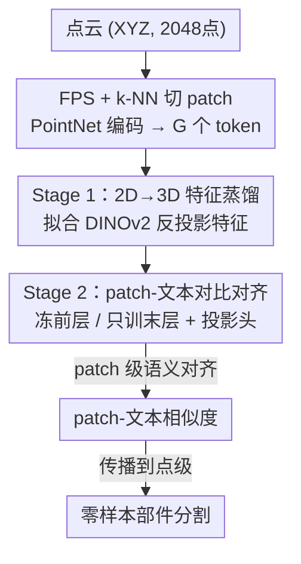

# PatchAlign3D: Local Feature Alignment for Dense 3D Shape Understanding

**会议**: CVPR 2026  
**论文**: [CVF Open Access](https://openaccess.thecvf.com/content/CVPR2026/html/Hadgi_PatchAlign3D_Local_Feature_Alignment_for_Dense_3D_Shape_Understanding_CVPR_2026_paper.html)  
**代码**: 无（仅项目页 souhail-hadgi.github.io/patchalign3dsite）  
**领域**: 3D视觉  
**关键词**: 3D 部件分割, 零样本, 点云 Transformer, 特征蒸馏, 多正样本对比学习

## 一句话总结
PatchAlign3D 是第一个直接在点云上输出「语言对齐的 patch 级特征」的纯编码器 3D 模型，通过「DINOv2 特征蒸馏 + patch-文本对比」两阶段预训练，在单次前馈、无需多视角渲染的情况下做零样本 3D 部件分割，ShapeNetPart 上 mIoU 比此前最强的渲染式方法 COPS 高出 +31.3%。

## 研究背景与动机
**领域现状**：当前的 3D 基础模型（OpenShape、Uni3D 等）在全局任务（检索、分类）上很强，但碰到「部件级」的稠密预测（3D part segmentation）就吃力。主流做法是「多视角渲染管线」：把点云渲染成多张图，用 DINOv2 / CLIP 这类 2D 大模型抽特征，再把 2D 预测融合回 3D（代表作 COPS、PointCLIPv2、PartSLIP）。

**现有痛点**：这套多视角范式有三个硬伤。① **没有几何接地**——预测主要靠 2D 外观线索，而不是真正的 3D 结构；② **推理昂贵**——要渲染多视角、逐视角推理、再做复杂的几何融合，COPS 每个 shape 要 1.38 秒、SATR 要 111 秒；③ **依赖 prompt 工程**——严重依赖在测试集上用 LLM 调 caption，一旦换成现实里常见的简单部件名（leg、wing、lid）性能就大幅下降。

**核心矛盾**：要么走「监督式前馈 3D 模型」拿到几何接地和高速度，但只能闭集；要么走「2D 基础模型 + 多视角」拿到开放词表，但牺牲几何、速度和鲁棒性。两者一直没法兼得。另一个底层难题是：能直接训 3D 编码器的部件标注数据（如 Find3D 用 SAM+VLM 自动标的 30K shape）**天生有噪声**——同一个 3D patch 可能被打上多个部件名，分割掩码经常碎裂或残缺，直接在 point 级监督上学会被噪声带偏。

**本文目标**：训一个纯编码器的 3D 模型，直接吃点云、输出与语言对齐的局部特征，一次前馈就完成开放世界部件分割，同时绕开多视角的几何缺失、推理慢、prompt 依赖三个问题，并且能从噪声标注里稳健地学。

**切入角度**：作者的关键观察是——既然 point 级标注不可靠，那就**不要在 point 级学，改在 patch 级做语义对齐**。把一个局部 patch 内的标注做聚合平均，能把标注噪声抹平，对不一致的边界也更鲁棒。

**核心 idea**：用「2D→3D 特征蒸馏」给点云编码器灌入 DINOv2 的稠密视觉先验作为几何初始化，再用「patch-文本多正样本对比」把这些 patch 特征对齐到文本空间，全程在 patch 粒度操作以对抗噪声。

## 方法详解

### 整体框架
PatchAlign3D 的输入是一个 2048 点的纯坐标点云（只用 XYZ，不用 RGB/法向量），输出是每个 patch token 的语言对齐特征；推理时拿这些特征和目标部件名的文本特征算相似度，最大相似度的部件标签再传播回点级，就得到零样本部件分割。

整个 pipeline 先把点云用最远点采样（FPS）切成 $G{=}128$ 个 patch、每个 patch 含 $k{=}32$ 个最近邻点，每个 patch 用一个轻量 PointNet 编成一个 token，patch 中心经 MLP 嵌入后作为位置编码加进去，再过一个 12 层标准 Transformer 编码器。核心是绕着这个编码器做的**两阶段预训练**：Stage 1 让编码器去拟合 DINOv2 蒸馏来的稠密视觉特征（自监督，打好几何底子），Stage 2 从 Stage 1 初始化、冻住前面的层、只训最后一个 Transformer block 和文本投影头，把 patch 特征对齐到文本空间。推理时直接丢掉 Stage 1，只用 Stage 2 的模型单次前馈。

### 关键设计

**1. Patch 级语义对齐：在噪声 point 标注上学的正确姿势**

Find3D 数据引擎用 SAM 切区域、用 Gemini 给每个 masked 区域打一个单词标签（leg、wing、lid），再反投影到 3D 得到逐点伪标签。问题是这些伪标签噪声极大：一个点可能在多个视角里被打上互相冲突的多个标签，掩码还经常碎裂。直接在 point 级做监督会把这些噪声全吃进去。PatchAlign3D 的破解办法是**把语义对齐的粒度从 point 抬到 patch**——一个 patch 聚合 32 个点，标注噪声在局部平均后被抹平，对不一致的边界也更稳。这个设计是贯穿全文的核心思路，后面两个阶段都建立在「patch 粒度」之上。代价是部件边界精度受 patch 划分限制，但实验显示即便在更粗的 patch 特征上，预测边界依然比 point 级的 Find3D 更干净、更连贯（Find3D 常出现相邻点标签突变的噪声）。

**2. Stage 1：把 DINOv2 稠密特征蒸馏进 3D patch**

这一步解决「3D 编码器缺乏细粒度视觉先验」的痛点。先用 DINOv2 对每个渲染视角抽稠密特征场 $F_r(u,v)$，双三次插值上采样到原图分辨率后反投影到 3D 表面：每个可见点继承它在各视角的特征均值

$$d(x) = \frac{1}{|\mathcal{V}(x)|}\sum_{r\in\mathcal{V}(x)} F_r\big(u_r(x), v_r(x)\big)$$

其中 $\mathcal{V}(x)$ 是观测到点 $x$ 的视角集合，没被任何视角看到的点用最近邻插值补特征。再把逐点特征聚合成 patch 级目标 $d_i = \frac{1}{k}\sum_{m=1}^{k} d(x_m^{(i)})$ 并缓存下来。Transformer 编码器 $f_\theta$ 把每个 patch 映成 token $z_i = f_\theta(P_i)$，经线性头 $h_{2D}$ 投到 2D 特征空间，用余弦相似度回归损失去拟合缓存的目标特征：

$$\mathcal{L}_{2D} = \frac{1}{G}\sum_{i=1}^{G}\Big[1 - \frac{h_{2D}(z_i)^\top d_i}{\|h_{2D}(z_i)\|_2\,\|d_i\|_2}\Big]$$

这步是自监督的（监督信号来自 2D 模型而非人工标注），把 DINOv2 的丰富细粒度表征转入 3D 编码器，给 Stage 2 那个更粗、基于语言的监督打好几何初始化。消融显示这个初始化能带来明显增益。

**3. Stage 2：用 fractional label 的多正样本 sigmoid 对比对齐**

这一步把 patch 特征对齐到文本空间，难点在于如何在「一个 patch 可能横跨多个部件、且标注本身模糊」的情况下做对齐。作者从 Stage 1 checkpoint 初始化、冻住前面所有层（防止灾难性遗忘、保住几何表征），只训最后一个 Transformer block 和文本头 $h_{text}$。patch-文本相似度采用 SigLIP 式的可学习温度和偏置：

$$s_{i,j} = \frac{1}{\tau}\big\langle h_{text}(z_i),\, t_j\big\rangle + b$$

其中 $\tau$、$b$ 初始化为 $0.1$ 和 $-10$，$t_j$ 是部件 $j$ 的文本嵌入。关键创新有两点。其一是 **fractional label**：每个 patch-部件对的标签 $y_{i,j}\in[0,1]$ 等于 patch $P_i$ 里属于部件 $j$ 的点的比例——全属于则 $y_{i,j}{=}1$，部分重叠则 $0<y_{i,j}<1$，这天然容纳了「一个 patch 可挂多个部件名」的多正样本情形，对模糊边界更鲁棒。损失用 sigmoid 二元交叉熵（而非 softmax 归一化，后者在负样本少时更弱）：

$$\mathcal{L}_{text} = \sum_{i=1}^{G}\sum_{j=1}^{C_s}\big[-y_{i,j}\log\sigma(s_{i,j}) - (1-y_{i,j})\log(1-\sigma(s_{i,j}))\big]$$

其二是 **样本内负样本**：负样本只取本 shape 内 $y_{i,j}{=}0$ 的部件，而不是跨 batch 取。因为不同 shape 里的「同名部件」（两把椅子的 leg）不该互为负样本，跨样本取负会损害开放世界泛化。训练时还加随机旋转、平移、缩放、抖动等几何增强。

### 损失函数 / 训练策略
两阶段分别训 100 epoch、batch size 32，用同一份训练集（28,827 训练 shape，2M+ 部件标注，761 类）。Stage 1 用余弦回归损失 $\mathcal{L}_{2D}$ 训整个编码器；Stage 2 用 sigmoid BCE 损失 $\mathcal{L}_{text}$ 只训末层 block + 投影头。作者特意验证了「两阶段解耦」的必要性：把两个损失联合训练反而比 Stage 2 单独训还差，因为稠密特征蒸馏和文本对齐两个目标本质不同，并发时会互相干扰——这佐证了「先蒸馏几何、再对齐语言」分开做才对。文本编码器用 OpenCLIP ViT-bigG-14，文本模板统一为「{part}」「a {part}」「{part} part」以避免 prompt 工程偏置。

## 实验关键数据

### 主实验
五个零样本部件分割基准（ShapeNetPart、PartNetE、ScanObjectNN、FAUST、Objaverse-General），覆盖合成/扫描、刚性/非刚性、可见/不可见类别。ShapeNetPart 上 PatchAlign3D 全面刷新 SOTA，16 类里 15 类领先：

| 数据集 | 指标 | PatchAlign3D | COPS（渲染式） | Find3D（前馈） | 提升 vs 最强 |
|--------|------|------|------|------|------|
| ShapeNetPart | mIoU | **56.9** | 25.6 | 23.3 | +31.3 |
| ShapeNetPart | cIoU | **53.1** | 32.2 | 23.9 | +20.9 |
| FAUST（非刚性人体） | mIoU | **67.8** | 30.4 | 63.2 | +4.6 |
| PartNetE | mIoU | **41.4** | 27.0 | 16.4 | +14.4 |
| ScanObjectNN（真实扫描） | mIoU | **22.7** | 17.7 | 18.8 | +3.9 |
| Objaverse-General | Unseen mIoU | **35.61** | — | 34.6 | +1.0 |

值得注意的是 PatchAlign3D 和 Find3D 用**完全相同的数据**训练，但前者大幅领先，说明增益来自训练管线（patch 级 + 两阶段对比）而非数据优势。

推理速度上，单次前馈的优势明显：

| 方法 | 类型 | 推理时间 (s) |
|------|------|------|
| SATR（mesh 渲染） | Rendering | 111 |
| COPS | Rendering | 1.38 |
| PointCLIPv2 | Rendering | 1.20 |
| Find3D | Feed-forward | 0.4 |
| PatchAlign3D | Feed-forward | ~0.4 ⚠️（原表数值被截断，与前馈基准同量级） |

### 消融实验
两阶段策略的贡献（ShapeNetPart）：

| 配置 | mIoU | cIoU | 说明 |
|------|------|------|------|
| Stage 2 only | 50.5 | 50.0 | 仅对比对齐，已超此前所有基准 |
| Joint training | 50.2 | 48.6 | 两损失联合训，反而更差 |
| 2-Stage（完整） | **56.9** | **53.1** | 先蒸馏后对齐，+6.4 mIoU |

### 关键发现
- **Stage 2 单独已是 SOTA（50.5 mIoU）**：说明 patch 级多正样本对比这一招本身就足够强，即使没有 Stage 1 的稠密 2D 监督也能学到有意义的局部特征；但 Stage 1 的几何初始化能再加 +6.4 mIoU。
- **联合训练反而掉点**：稠密特征蒸馏和文本对齐两个目标互相干扰，必须解耦——这是「为什么分两阶段」最直接的证据。
- **特征可视化（PCA→RGB）**：DINOv2 反投影特征噪声大、表面不一致；Stage 1 把它细化成几何连贯的聚类（沙发的座面 vs 靠背、狼头的鼻/耳/颈清晰分簇）；Stage 2 保住这种结构组织、再叠加开放词表语义。
- **非刚性鲁棒**：FAUST 上渲染式 COPS 在形变下大幅退化（30.4 mIoU），而 PatchAlign3D 对姿态变化稳定（67.8 mIoU），印证几何接地优于纯外观线索。

## 亮点与洞察
- **「噪声标注就降粒度」是个可迁移的朴素 trick**：当 point 级伪标签不可靠时，把监督粒度抬到 patch 做局部聚合平均，是对抗弱监督噪声的简单有效手段，可迁移到任何「2D 模型自动标注 3D」的场景。
- **fractional label 优雅地处理多正样本**：用「patch 内属于某部件的点比例」当软标签，把「一个 patch 跨多部件」自然建模成多正样本对比，比硬分配更贴合边界模糊的真实情况。
- **样本内负样本**这个细节很关键：跨 batch 把同名部件当负样本会毁掉开放世界泛化，只在样本内取负是开放词表任务里容易忽略却很重要的设计。
- **「先蒸馏几何、再对齐语言」的解耦**被消融实证：两个异质目标分阶段做远优于联合做，对其他「视觉先验 + 语言对齐」的多目标预训练有借鉴意义。

## 局限与展望
- 作者承认：预训练用的是 Objaverse 一个 curated 子集（32K shape），只覆盖 800K+ 物体的一小部分，且伪部件标注（SAM+LM）本身不完美。
- **固定 patch 划分**是结构性限制：$G{=}128$、$k{=}32$ 写死，对不同大小/密度的点云不自适应，部件边界精度也被 patch 粒度上限卡住。作者提到未来想用更自适应的划分策略。
- ⚠️ 在 PartNetE 上因为只靠 patch-文本相似度，未标注点被强行赋「body」标签，这在细粒度部件定义的数据集上可能引入系统偏差，横向比较需留意。
- 当前只做局部部件理解，缺全局形状理解能力；作者展望把编码器泛化成同时具备全局认知的 3D 基础模型。

## 相关工作与启发
- **vs 多视角渲染管线（COPS / PointCLIPv2 / PartSLIP）**：它们渲染多视角、用 2D 模型抽特征再融合回 3D，几何接地弱、推理慢（1.2~111s）、依赖 prompt 工程。本文纯前馈直接吃点云，单次推理 ~0.4s，几何接地强，ShapeNetPart 上比最强的 COPS 高 31.3 mIoU。
- **vs Find3D（同款前馈基准）**：Find3D 是 encoder-decoder、在 point 级对齐语言，用同一份数据训练但产生碎裂噪声边界。本文改成纯编码器 + patch 级对齐 + 两阶段蒸馏，在相同数据下大幅领先（+33.6 mIoU on ShapeNetPart），且边界更干净。
- **vs DITR / OV3D / PartDistill（2D→3D 蒸馏）**：它们主要做场景分割或单类别蒸馏、跨类泛化有限。本文把蒸馏当作 Stage 1 的几何初始化，再叠加 Stage 2 的语言对比，做到跨类别的开放世界部件分割。

## 评分
- 新颖性: ⭐⭐⭐⭐ 首个 patch 级语言对齐的纯编码器 3D 模型，"降粒度抗噪 + 两阶段解耦"组合干净有效，但各组件（蒸馏、SigLIP 对比）均有前人基础。
- 实验充分度: ⭐⭐⭐⭐⭐ 五个基准覆盖合成/真实/刚性/非刚性/见过未见，主结果、速度、两阶段消融、特征可视化齐全。
- 写作质量: ⭐⭐⭐⭐ 动机清晰、公式完整，pipeline 易懂。
- 价值: ⭐⭐⭐⭐ 把开放世界 3D 部件分割从"慢且依赖 prompt 的多视角"推进到"快且前馈"，对实时 3D 理解有实用意义。

<!-- RELATED:START -->

## 相关论文

- [\[CVPR 2026\] LoG3D: Ultra-High-Resolution 3D Shape Modeling via Local-to-Global Partitioning](log3d_ultra-high-resolution_3d_shape_modeling_via_local-to-global_partitioning.md)
- [\[CVPR 2026\] Selfi: Self-improving Reconstruction Engine via 3D Geometric Feature Alignment](selfi_self-improving_reconstruction_engine_via_3d_geometric_feature_alignment.md)
- [\[CVPR 2026\] TextFM: Robust Semi-dense Feature Matching with Language Guidance](textfm_robust_semi-dense_feature_matching_with_language_guidance.md)
- [\[CVPR 2026\] 3D-Aware Multi-Task Learning with Cross-View Correlations for Dense Scene Understanding](3d-aware_multi-task_learning_with_cross-view_correlations_for_dense_scene_unders.md)
- [\[CVPR 2026\] Cross-Instance Gaussian Splatting Registration via Geometry-Aware Feature-Guided Alignment](cross-instance_gaussian_splatting_registration_via_geometry-aware_feature-guided.md)

<!-- RELATED:END -->
