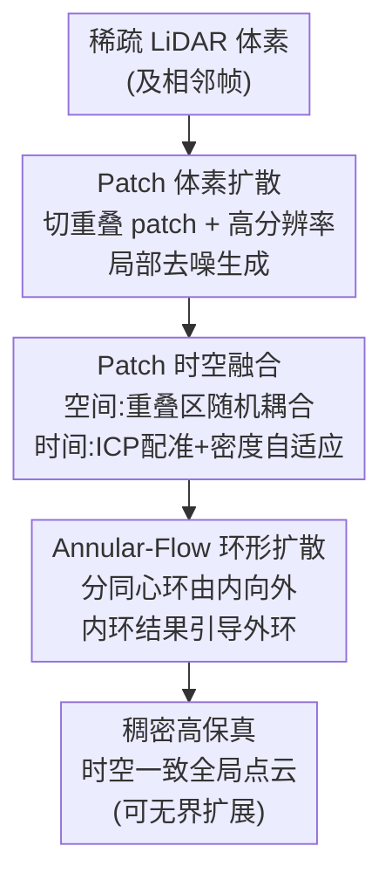

# PatchScene: Patch-based Voxel Diffusion Model for Large-Scale Scene Completion

**会议**: CVPR 2026  
**论文**: [CVF Open Access](https://openaccess.thecvf.com/content/CVPR2026/html/Xu_PatchScene_Patch-based_Voxel_Diffusion_Model_for_Large-Scale_Scene_Completion_CVPR_2026_paper.html)  
**代码**: 未公开  
**领域**: 3D视觉 / 扩散模型  
**关键词**: LiDAR场景补全, 体素扩散, 分块生成, 时空融合, 自动驾驶

## 一句话总结
PatchScene 把大规模 LiDAR 场景补全拆成一堆互相重叠的小体素 patch、各自跑显式体素扩散，再用置信度引导的时空融合把它们拼成一致的全局点云，并用一个"由内向外、环形推进"的扩散顺序把致密信息从近处传到远处，从而在 SemanticKITTI 上刷到 SOTA，且 20m 训练能零样本泛化到 50m。

## 研究背景与动机

**领域现状**：自动驾驶里 LiDAR 给出绝对尺度的 3D 几何，但点云在远处迅速变稀、且因遮挡留下大片空洞，所以"稀疏到稠密"的场景补全是刚需。主流做法分两类——判别式模型（学一个 partial→完整 voxel/SDF 的回归映射）和近年的扩散式生成模型（point-based / voxel-SDF-based / latent-based）。

**现有痛点**：判别式方法是一次性回归，只靠 regression loss，抓不住几何的不确定性与多样性，补出来要么有伪影要么过度平滑、丢失锐利结构。扩散式里 point-based（如 LiDiff）直接预测点偏移，点云无序导致结构不一致、有洞、细节糊；显式体素/SDF 方法内存随分辨率立方增长，扛不住大场景；latent-based（如 XCube）把体素压进低维隐空间做扩散，但多级 VAE 编解码会累积信息损失、退化几何细节。

**核心矛盾**：大场景补全里"高几何保真度"和"可承受的算力"天然冲突——想保真就要高体素分辨率，但全场景高分辨率体素的算力立方爆炸；而绕开算力去压隐空间又会损失细节。此外几乎所有方法都只做单帧补全，忽略了 LiDAR 序列里的帧间时序相关性，导致动态场景下闪烁、不连续。

**本文目标**：在不爆算力的前提下做到高保真、空间无界、且时序一致的大规模点云补全。

**切入角度**：作者用"分而治之"——既然全场景高分辨率体素扩散扛不住，那就把场景切成固定尺寸、互相重叠的小 patch，每个 patch 退化成"物体级"补全，就能用高分辨率体素扩散；难点转移到"怎么把独立生成的 patch 无缝拼回去"和"按什么顺序生成"。

**核心 idea**：在显式体素空间做 patch 级扩散，再用随机耦合的空间融合 + 密度自适应的时间融合保证全局一致，并按 LiDAR 近密远疏的物理特性设计"由内向外环形推进"的生成顺序，让近处高质量补全去引导远处稀疏区域。

## 方法详解

### 整体框架
PatchScene 的输入是单帧稀疏 LiDAR 占据体素 $\tilde{X}$（及相邻帧），输出是稠密、高保真、时空一致的全局点云。整条流水线围绕"分块补全 → 融合 → 环形扩散"的循环：先把整个体素空间切成互相重叠、预定义尺寸 $(h,w,d)$ 的规则 patch，每个 patch 独立跑一个 3D U-Net 扩散去噪、生成局部点云；去噪过程中在重叠区做空间融合、跨相邻帧做时间融合，把零散 patch 合并成统一的全局稠密点云；最后按到传感器的径向距离把 patch 分成一圈圈同心环 $\{R_1,\dots,R_L\}$，从最内圈开始逐环向外做条件扩散，让近处稠密区的高保真信息一路流向远处稀疏区，从而支持无界扩展。

### 关键设计

**1. Patch 体素扩散：把大场景补全降维成 patch 级物体补全**

针对"高分辨率全场景体素算力立方爆炸"这一痛点，作者不在整张场景上做扩散，而是把完整稠密占据帧 $X_0\in\{0,1\}^{H\times W\times D}$ 用预定义尺寸 $(h,w,d)$ 和带步长（保证充分重叠）的起始索引切成 $N$ 个局部 patch：$x_0^{(k)}=\text{Patch}(X_0,k)$、$\tilde{x}^{(k)}=\text{Patch}(\tilde{X},k)$。每个 patch 独立加噪 $x_t^k=\sqrt{\bar\alpha_t}\,x_0^k+\sqrt{1-\bar\alpha_t}\,\epsilon$，再训一个网络 $f_\theta(x_t^k,t,p_k)$ 直接预测干净数据 $\hat{x}_0^k$（直接预测 $x_0$ 而非噪声以提升稳定性），其中 $p_k$ 是可学习的位置编码、让网络对空间上下文敏感；由预测的 $\hat{x}_0^k$ 反推噪声 $\hat\epsilon$ 后再走标准 DDPM 反向采样得到 $x_{t-1}^k$。训练时随机抽 patch $k$ 和时间步 $t$，最小化预测与 GT 占据体素的 MSE：$L_{\text{patch}}(\theta)=\mathbb{E}_{k,t}\big[\lVert x_0^k-\hat{x}_0^k\rVert_2^2\big]$。因为每个 patch 只覆盖局部区域，任务难度退化到物体级，于是可以用高体素分辨率而不爆显存——这是整个方法能"既高保真又扛大场景"的根。

**2. Patch 时空融合：用随机耦合 + 密度自适应权重把独立 patch 拼成一致全局点云**

独立去噪各 patch 会在重叠区留下边界不连续和伪影，所以这一步做两件事。**空间融合**用"随机扰动耦合"：在第 $t$ 步拿到当前 patch 的预测噪声 $\hat\epsilon_k$ 后，把所有相邻 patch 的预测投影聚合成全局噪声场 $\hat\epsilon_{\text{global}}$，仅在重叠区 $O_k$ 内对每个点 $p$ 按二值随机掩码融合：$\hat\epsilon_{\text{fused}}^k(p)=B(p)\cdot\hat\epsilon_{\text{global}}(p)+(1-B(p))\cdot\hat\epsilon_k(p)$，其中 $B(p)\sim\text{Bernoulli}(0.5)$。也就是重叠区里当前 patch 有 50% 概率改用全局上下文的估计，这种随机耦合恰好契合扩散模型的统计特性，比确定性平均更能避免融合处的模糊。**时间融合**则跨帧：对相邻帧 $\tilde{X}_\tau$、$\tilde{X}_{\tau+1}$ 先做 ICP 配准得到刚体变换 $T_{\tau\to\tau+1}$，把上一帧缓存的去噪结果变换到新坐标系，再在生成 $\tau+1$ 帧时融合 $\hat{x}_t^{\tau+1}=\lambda\cdot\hat{x}_t^{\tau}+(1-\lambda)\cdot\hat{x}_t^{\tau+1}$。关键是权重 $\lambda$ 不是常数，而在 BEV 体素网格上按局部密度一致性自适应：$\lambda(p)=\min\big(\frac{\rho_{\tau+1}(p)}{\rho_\tau(p)+\epsilon},\,1.0\big)$，$\rho(p)$ 为体素 $p$ 处的局部点密度。这样在几何一致的区域多继承上一帧信息、在结构变化或稀疏区更信当前帧预测，从而压住单帧法常见的帧间闪烁。

**3. Annular-Flow 环形扩散补全：按 LiDAR 近密远疏的物理特性由内向外引导生成**

因为 patch 重叠，生成顺序很关键——用已补好的 patch 去引导邻居时，先补哪块直接决定质量。作者抓住 LiDAR 的物理特性：近传感器点密、远处随径向距离迅速变稀，所以近处体素稠密且相对完整、补全质量天然更高。于是把场景体素空间里的 patch 按到传感器中心的距离分成一系列同心环 $\{R_1,\dots,R_L\}$（$R_1$ 是近处高密圈、$R_L$ 是远处稀疏圈），从最内圈开始向外逐环做 patch 条件扩散采样：环 $R_\ell$ 中 patch 的去噪在每个时间步都受相邻内环 $R_{\ell-1}$ 已补全结果的引导。这种"中心向外"的引导让高保真信息持续从核心流向外围，使稀疏的外圈能借用内圈丰富的语义上下文，原理上可一直外推到无界场景——这正是它能"20m 训练泛化到 50m"的机制来源。

### 损失函数 / 训练策略
训练目标即 patch 级占据体素的 MSE 重建损失 $L_{\text{patch}}$（式 6），直接预测 $x_0$。实现上在 SemanticKITTI 上训练，LiDAR 范围 50m、体素分辨率 0.15625m，学习率 $4\times10^{-4}$、AdamW、100 epoch；扩散用 cosine 噪声调度（$\beta_{10}=0.0001$、$\beta_T=0.02$）、$T=1000$；每个 patch 覆盖 20m×20m，去噪后再 2× 上采样，最终每帧约 90 万点。推理实际只用 10 个去噪步即可（见消融）。

## 实验关键数据

### 主实验
在 SemanticKITTI 上与现有点云补全方法对比（baseline / 指标 / GT 沿用 LiDPM 协议；本文单帧、不用额外时序信息）。评测指标：CD（Chamfer Distance，越低越好，反映局部几何精度）、JSD-3D / JSD-BEV（3D 与鸟瞰下全局分布的 Jensen–Shannon 散度，越低越好，反映结构合理性）、Voxel IoU（@0.5/0.2/0.1 三个阈值，越高越好，反映体积一致性与大尺度完整度）。

| 方法 | CD↓ | JSD-3D↓ | JSD-BEV↓ | IoU@0.5↑ | IoU@0.2↑ | IoU@0.1↑ |
|------|-----|---------|----------|----------|----------|----------|
| LiDiff(refine) | 0.376 | 0.573 | 0.416 | 32.4 | 23.0 | 13.4 |
| LiDPM(refine) | 0.377 | 0.542 | 0.403 | 36.6 | 25.8 | 14.9 |
| ScoreLidar(refine)† | 0.342 | 0.590 | 0.399 | 32.0 | 19.9 | 9.4 |
| **PatchScene（本文）** | **0.319** | **0.444** | **0.371** | **45.3** | **38.2** | **19.7** |

PatchScene 在全部指标上一致领先：CD 从最优 baseline 的 0.342 降到 0.319，JSD-3D 从 0.532（LiDPM）大幅降到 0.444，Voxel IoU@0.5 从 36.6 提到 45.3。值得注意的是它甚至不用时序信息、仅单帧就拿到 SOTA。

### 消融实验
**空间融合策略**（Table 4，对比重叠区四种处理方式）：

| 配置 | CD↓ | JSD-3D↓ | JSD-BEV↓ | IoU@0.5↑ |
|------|-----|---------|----------|----------|
| w/o fusion（无融合） | 0.348 | 0.451 | 0.383 | 43.9 |
| average addition（直接平均） | 0.351 | 0.439 | 0.381 | 44.6 |
| weight addition（内层加权） | 0.345 | 0.438 | 0.379 | 44.9 |
| **random coupling（随机耦合，本文）** | **0.319** | 0.444 | **0.371** | — |

无融合或确定性平均都会导致过渡突兀或过度平滑；随机保留 50% 重叠体素的随机耦合在 CD、JSD-BEV 上最好、JSD-3D 也有竞争力。

**时间融合**（Table 2，相邻帧双向 RMSE）：

| 配置 | CD↓ | JSD-3D↓ | JSD-BEV↓ | RMSE t0→t1↓ | RMSE t1→t0↓ |
|------|-----|---------|----------|-------------|-------------|
| w/o temporal | 0.319 | 0.444 | 0.371 | 0.155 | 0.159 |
| temporal fusion | 0.309 | 0.432 | 0.372 | 0.086 | 0.081 |

时间融合把双向 RMSE 几乎砍半（0.155→0.086、0.159→0.081），帧间一致性显著提升，且 CD/JSD-3D 还略有改善、JSD-BEV 仅微涨，说明跨帧传播没牺牲单帧保真度。

### 关键发现
- **去噪步数不是越多越好**（Table 3）：timestep=5 在量化指标上最高（CD 0.310），但太少会让 patch 间融合不充分、留下可见边界；timestep 增大反而因过多随机性把点推离条件输入而退化（timestep=50 时 CD 升到 0.357）。作者折中取 **10 步**，在精度与跨 patch 一致性间取得最佳平衡。
- **20m 训练 → 50m 推理零样本泛化**：在 20m 范围训练后直接用于 50m 补全，开阔与狭窄场景都能保持几何保真和清晰物体边界，甚至在右边界稀疏区生成出比 GT 更连续完整的结构，印证了 Annular-Flow 的无界扩展能力。
- **贡献最大的是分块体素扩散本身**：它让方法既能上高分辨率又不爆算力，是 SOTA 的地基；时空融合主要补的是"拼接一致性 + 帧间稳定"。

## 亮点与洞察
- **"分而治之"把算力难题转成拼接难题**：高分辨率全场景体素扩散不可行，但拆成物体级 patch 后高分辨率就可行了——这是一个把硬约束（立方算力）换成软问题（边界融合）的漂亮转化，且软问题用随机耦合就解决了。
- **随机 Bernoulli 耦合而非确定性平均**：用 50% 概率随机采纳全局上下文，恰好匹配扩散的随机统计特性，避免了平均融合的模糊——这个"用随机性对抗模糊"的 trick 可迁移到任何需要拼接扩散 patch 的任务（如大图 outpainting、大尺度体素生成）。
- **把传感器物理先验编进生成顺序**：Annular-Flow 不是任意顺序，而是顺着"近密远疏"由内向外，让高质量区域引导低质量区域——这种"按数据可靠度排生成序"的思路对任何带空间质量梯度的生成都有启发。
- **密度自适应的时间权重**：$\lambda$ 在 BEV 上按局部密度比自适应，几何稳定区多继承历史、变化区信当前帧，比固定权重的时序融合更稳。

## 局限与展望
- **依赖 ICP 配准做时间融合**：跨帧用 ICP 估刚体变换，在大幅动态/退化几何场景下配准可能失败，论文未讨论配准误差对融合的影响。
- **patch 尺寸与重叠是预定义的超参**：$(h,w,d)$、步长、环的划分都需人工设定，对不同传感器/场景尺度的鲁棒性未充分分析。⚠️ 论文未给这些超参的敏感性实验。
- **逐 patch + 逐环 + 多帧缓存的推理开销**：虽然单 patch 算力可控，但 $N$ 个 patch 串行 + 环形逐圈引导 + 帧间缓存的整体推理时间/吞吐未报告，实时性存疑（这对自动驾驶很关键）。
- **仅在 SemanticKITTI 上验证**：未在 nuScenes 等其他 LiDAR 数据集或不同线束传感器上验证泛化。

## 相关工作与启发
- **vs XCube（latent-based）**：XCube 把体素压进低维隐空间做 latent diffusion + 多级精化，本文直接在显式体素空间做 patch 扩散。区别在于本文避开了多级 VAE 编解码的信息损失与误差累积，几何细节更锐利；代价是要自己解决 patch 拼接问题。
- **vs LiDiff / ScoreLiDAR（point-based）**：它们在原始点空间预测点偏移，本文在规则体素空间生成。点空间保留原始结构但无序、易出洞和过平滑、结构不一致；本文用规则体素 + 时空融合换来更一致的结构（IoU 大幅领先），且天然支持帧间时序融合。
- **vs LiDPM / 各类单帧扩散补全**：它们局限于独立单帧补全，忽略时序相关性；本文显式做密度自适应的跨帧时间融合，把双向 RMSE 近乎减半，压住了单帧法的帧间闪烁。

## 评分
- 新颖性: ⭐⭐⭐⭐ patch 体素扩散 + 随机耦合融合 + 物理先验环形生成序，三个点都具体且互相支撑，分而治之的角度新颖。
- 实验充分度: ⭐⭐⭐⭐ 主表全指标领先 + 空间/时间/步数三组消融 + 跨范围泛化，较完整；但只在 SemanticKITTI、缺推理效率与跨数据集验证。
- 写作质量: ⭐⭐⭐⭐ 动机—方法—实验逻辑清晰，公式与图配合好，三个设计与框架对得上。
- 价值: ⭐⭐⭐⭐ 对自动驾驶大场景 LiDAR 补全有实用价值，20m→50m 零样本泛化尤其吸引人；代码未公开略减分。

<!-- RELATED:START -->

## 相关论文

- [\[CVPR 2026\] CoLoR: The Devil is in Scene Coordinate Regression for Large-Scale Visual Localization](color_the_devil_is_in_scene_coordinate_regression_for_large-scale_visual_localiz.md)
- [\[CVPR 2026\] OLATverse: A Large-scale Real-world Object Dataset with Precise Lighting Control](olatverse_a_large-scale_real-world_object_dataset_with_precise_lighting_control.md)
- [\[CVPR 2026\] SpatialVID: A Large-Scale Video Dataset with Spatial Annotations](spatialvid_a_large-scale_video_dataset_with_spatial_annotations.md)
- [\[CVPR 2026\] iLRM: An Iterative Large 3D Reconstruction Model](ilrm_an_iterative_large_3d_reconstruction_model.md)
- [\[CVPR 2026\] Zero-Shot Depth Completion with Vision-Language Model](zero-shot_depth_completion_with_vision-language_model.md)

<!-- RELATED:END -->
