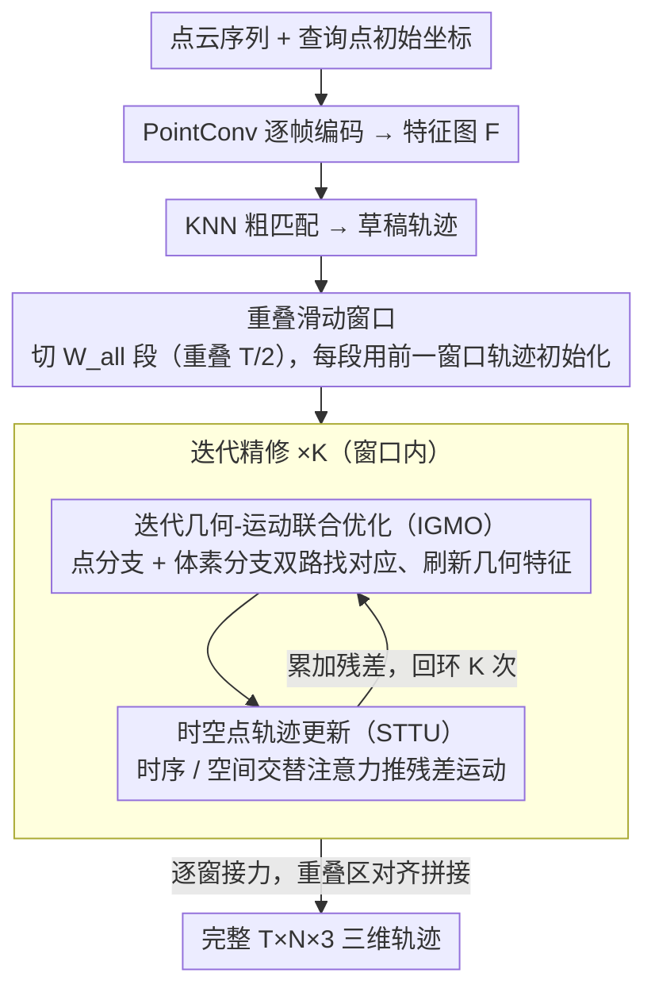

# PCSTracker: Long-Term Scene Flow Estimation for Point Cloud Sequences

**会议**: CVPR 2026  
**arXiv**: [2603.19762](https://arxiv.org/abs/2603.19762)  
**代码**: [https://github.com/MinLin2022/PCSTracker](https://github.com/MinLin2022/PCSTracker)  
**领域**: 3D视觉 / 场景流估计  
**关键词**: 点云场景流, 长序列轨迹估计, 时空Transformer, 滑动窗口, 三维运动分析

## 一句话总结

PCSTracker 是首个端到端的点云序列长程场景流估计框架，通过迭代几何-运动联合优化、时空轨迹更新和重叠滑动窗口策略，在合成数据集 PointOdyssey3D 上将 EPE_3D 降低 57.9%，并以 32.5 FPS 实时运行。

## 研究背景与动机

1. **领域现状**：从点云序列理解长程精细 3D 运动对自动驾驶、机器人导航和 AR/VR 至关重要。现有方法分为两条路线：目标跟踪（仅关注物体级运动，无法恢复精细运动）和场景流估计（局限于相邻帧对，无法维持长序列时序一致性）。

2. **现有痛点**：将短期方法直接串联到长序列（数十到数百帧）会导致灾难性错误：
    - 视角变化和物体变形引起点特征的时序动态变化，破坏点对应关系一致性
    - 频繁遮挡和出界运动中断点对应关系
    - 微小误差不可避免地随时间累积，最终导致严重漂移

3. **核心矛盾**：逐帧估计的场景流方法缺乏对长时间跨度内几何演化、遮挡处理和误差累积的建模能力，而目标跟踪方法又无法提供点级精细运动。

4. **本文目标** 如何直接从原始点云序列中鲁棒且高效地预测长程场景流（完整的 $T \times 3$ 三维轨迹矩阵），同时处理几何变化、遮挡和误差累积三大挑战。

5. **切入角度**：将场景流估计从两帧扩展到长序列，可以看作是物体跟踪的点级细化——结合场景流的精细运动估计和目标跟踪的长程时序建模优势。

6. **核心 idea**：通过三个专门设计——迭代几何-运动联合优化应对几何变化、时空 Transformer 推断遮挡点位置、重叠滑动窗口抑制误差累积——实现端到端的长程点云场景流估计。

## 方法详解

### 整体框架

PCSTracker 要回答的问题是：给定一段原始点云序列 $\mathbf{S} = \{S_t\}_{t=1}^T$（第 $t$ 帧有 $N_t$ 个点）和 $N$ 个查询点的初始坐标 $P_{xyz}$，如何端到端地吐出每个查询点完整的 $T \times N \times 3$ 三维轨迹，同时扛住几何变化、遮挡和误差累积。

整体上它先用 PointConv 把每帧点云编码成特征图，并用 KNN 把查询点的初始位置粗略匹配进序列，得到一份"草稿轨迹"。接下来进入一个迭代精修的内核：每一轮里，IGMO 模块拿当前轨迹去特征图里重新找对应、更新几何特征；STTU 模块再把这一轮的相关信息当成 token 喂进时空 Transformer，跨时间和跨点地推断出残差运动，叠回轨迹。这个"找对应→推运动→更新"的循环跑 $K$ 次，轨迹越精修越准。最外层再套一个重叠滑动窗口，把上百帧的长序列切成可处理的短段、逐段传递，最终拼出整条长程轨迹。

### 关键设计

**1. 迭代几何-运动联合优化（IGMO）：让查询点特征跟着时间一起变**

逐帧场景流方法默认查询点的"长相"不变，可在数十上百帧里，同一个点的几何外观会因视角变化和物体变形而显著漂移——特征一旦过时，匹配就会找错。IGMO 的做法是在每次迭代里都重新建立对应关系并刷新特征。它先算当前轨迹特征 $Q_{feat}^{k-1}$ 与预计算特征图 $\mathbf{F}$ 之间的局部几何相似度 $C_g^k$，取 top-$M$ 最高相关性构成截断相关体，避免在全空间上做无谓的稠密匹配。

真正的关键是双分支结构，让局部和长程信息互补。点相关分支盯住细粒度匹配，选 KNN 邻居把相似度和相对位置偏移一起聚合：

$$C_{point}^k = \max\big(\text{MLP}(\text{concat}(C^k(\mathcal{N}_{M_k}),\; \mathcal{N}_{M_k} - Q_{xyz}^k))\big)$$

体素相关分支则负责长程结构，把局部空间离散成不同尺度的 $a \times a \times a$ 立方体，对每个子立方体内点的相关值取平均，得到多尺度长程特征 $C_{voxel}^{k,r}$。两分支融合后同时回写运动和几何特征——这一步刷新特征正是它和"两帧场景流硬串联"的本质区别，也是后面消融里去掉它 EPE 直接恶化 34% 的原因。

**2. 时空点轨迹更新（STTU）：用整段时间窗推断被遮挡那几帧的位置**

遮挡和出界会让某些帧里查询点直接消失，逐帧独立估计在这些帧上只能瞎猜。STTU 换一个思路：把时间窗内所有查询点的完整运动放在一起联合估计，这样可见帧的信息就能顺着注意力流向不可见帧。它先把融合相关体 $C_{fuse}^k$、轨迹特征 $Q_{feat}^{k-1}$ 和正弦编码的光流信息拼成运动特征，再叠上位置编码 $\eta_p(Q_{xyz}^{k-1})$ 和时间戳编码 $\eta_t(t)$，构成运动 token。

这些 token 送进 $2 \times M$ 个 Transformer 块，关键是交替做帧间（时序）和帧内（空间）自注意力：时序注意力让一个点在不同时刻彼此约束、补全被遮挡帧，空间注意力让同一帧内的点互相参考、保持局部刚性。最后预测器 $\Psi$ 输出这一轮的残差运动和特征更新，累加回上一轮结果：

$$(\Delta Q_{xyz}^k,\; \Delta Q_{feat}^k) = \Psi(\mathbf{F}_{token}^o)$$

消融显示只留时序注意力（6×1）远不如时空交替（3×2），说明空间一致性这条约束不能省。

**3. 重叠滑动窗口推理：把上百帧切短，又不在接缝处断开**

一次性把几百帧塞进显存和注意力里并不现实，但简单地切成互不重叠的段，又会在窗口边界处轨迹突然不连续。这个策略折中：把总长 $T'$ 的序列切成 $W_{all} = \lceil 2T'/T - 1 \rceil$ 个长度为 $T$ 的子序列，相邻窗口刻意重叠 $T/2$。每个新窗口不从零开始，而是拿前一窗口已经精修好的轨迹来初始化，再在本窗口内迭代 $K$ 次。

$T/2$ 的重叠量保证每个时间步至少被两个窗口覆盖，前一窗口的上下文就能稳稳传给后一窗口，把误差"摊"在重叠区里抑制传播，而不是任其在接缝处突变。消融里窗口从 2 帧拉到 16 帧、EPE 降 35%，正说明更长的时序上下文确实在帮忙。

### 一个完整示例：一条 40 帧序列怎么被处理

假设输入一段 40 帧的点云序列，窗口长 $T=16$、重叠 $T/2=8$。按 $W_{all} = \lceil 2\times40/16 - 1 \rceil = 4$ 切出 4 个窗口，覆盖区间约为帧 1–16、9–24、17–32、25–40。

第一个窗口（帧 1–16）从 KNN 草稿轨迹起步，IGMO+STTU 迭代 $K$ 次把这 16 帧的轨迹精修好；其中第 9–16 帧落在重叠区。第二个窗口（帧 9–24）不重新初始化，而是直接继承上一窗口在帧 9–16 的轨迹估计当起点，于是哪怕某个查询点在帧 11–13 被遮挡，STTU 也能借着已经传进来的上下文和窗口内可见帧把它补全，再继续精修帧 17–24。后两个窗口同理逐段接力。最终四段在重叠区对齐拼接，输出一条平滑、误差不在接缝处跳变的 40 帧完整轨迹——这也对应实验里"40 帧时 EPE 0.205 vs SF-baseline 0.543"的慢漂移表现。

### 损失函数 / 训练策略

- 监督损失：$Loss = \sum_{w=0}^{W_{all}} \sum_{t=1}^{T} \sum_{k=1}^{n} \gamma^{n-k} \|Q_{xyz}^{k,t,w} - Q_{xyz}^{GT}\|_2$
- 指数衰减权重 $\gamma = 0.8$，越后面的迭代步权重越大
- 在 PointOdyssey3D 上训练 200K 步，batch size 4，每个样本 24 帧 256 查询点 8192 点/帧
- AdamW 优化器 + OneCycle 学习率调度，初始 lr=2e-4
- 推理时支持局部辅助点（KNN）和全局辅助点（FPS/随机采样），默认添加 1024 个辅助点

## 实验关键数据

### 主实验

PointOdyssey3D 数据集（合成）：

| 方法 | 输入 | EPE_3D↓ | δ_3D^avg↑ | Survival_3D^0.50↑ |
|------|------|---------|-----------|-------------------|
| SpatialTracker | RGB-D | 0.924 | 42.25 | 49.54 |
| SceneTracker | RGB-D | 0.204 | 79.48 | 87.98 |
| SF-baseline | Point | 0.330 | 61.65 | 77.78 |
| **PCSTracker** | **Point** | **0.133** | **86.37** | **93.65** |

ADT3D 数据集（真实世界）：

| 方法 | 输入 | EPE_3D↓ | δ_3D^avg↑ | Survival_3D^0.50↑ |
|------|------|---------|-----------|-------------------|
| SceneTracker | RGB-D | 0.601 | 68.99 | 80.40 |
| SF-baseline | Point | 0.945 | 40.49 | 51.61 |
| **PCSTracker** | **Point** | **0.372** | **74.44** | **87.74** |

### 消融实验

| 实验 | 变量 | EPE_3D↓ | δ_3D^avg↑ |
|------|------|---------|-----------|
| 几何特征更新 | w/o | 0.202 | 75.85 |
| 几何特征更新 | w/ | **0.133** | **86.37** |
| 窗口大小 | T=2 | 0.206 | 78.33 |
| 窗口大小 | T=8 | 0.166 | 83.06 |
| 窗口大小 | T=16 | **0.133** | **86.37** |
| Transformer 块 | 6×1 (仅时序) | 0.202 | 75.84 |
| Transformer 块 | 3×2 (时空交替) | **0.133** | **86.37** |
| 辅助点 (one) | 无 | 0.852 | 47.49 |
| 辅助点 (one) | KNN+FPS | **0.119** | **87.64** |

### 关键发现

- **几何特征更新至关重要**：去掉后 EPE_3D 增加 34.2%（0.133→0.202），说明长序列必须显式建模特征的时序变化
- **时序上下文越长越好**：窗口从 2 帧扩展到 16 帧，EPE_3D 降低 35.4%（0.206→0.133）
- **空间注意力不可或缺**：仅用时序注意力（6×1）性能大幅下降，空间-时序交替（3×2）最优
- **辅助点的巨大加成**：单查询点模式下加入 KNN+FPS 辅助点后 EPE_3D 从 0.852 降至 0.119（86% 下降），FPS 全局采样优于随机采样
- **时序漂移分析**：40 帧时 PCSTracker 的 EPE 为 0.205 vs SF-baseline 的 0.543，误差增长速率显著更慢
- **效率**：仅 3.48M 参数 vs SceneTracker 24.2M 和 SpatialTracker 34.0M，推理速度 32.5 FPS（最快）

## 亮点与洞察

- **问题定义的先驱性**：作为首个系统研究点云长程场景流估计的工作，明确了三大核心挑战（几何变化、遮挡、误差累积），并给出了针对性的解决方案。与 RGB-D 方法相比，仅用点云就能获得更好的 3D 运动理解
- **双分支相关体设计**：点分支捕获局部精细匹配、体素分支捕获多尺度长程结构，互补性强。这一设计来自 PV-RAFT 但在长序列场景中验证了其重要性
- **辅助点策略的实用价值**：点云离散不规则无法构建规则网格的辅助点，KNN+FPS 的组合是一个简洁有效的解决方案，在单点跟踪场景下效果提升极为显著
- **数据集贡献**：构建了 PointOdyssey3D（合成训练） 和 ADT3D（真实评估）两个基准，填补了这一方向的数据空白

## 局限与展望

- 对几何尺度和场景距离变化敏感，从合成数据迁移到具有不同空间分布的真实场景（如自动驾驶）时性能可能下降
- 模型仅在合成数据上训练，真实世界点云的噪声和稀疏性可能带来额外挑战
- 当前每帧 8192 点的设置在密集点云（如 LiDAR 数万点）场景下计算效率待验证
- 改进方向：引入场景特定数据或自适应训练策略缓解分布偏移；探索更高效的相关体计算和 Transformer 注意力机制；扩展到户外大场景

## 相关工作与启发

- **vs SceneTracker (RGB-D)**: SceneTracker 是最强 RGB-D 基线，在 PointOdyssey3D 上 EPE 0.204 vs PCSTracker 0.133，说明纯点云方法在 3D 运动理解上有天然优势（不受 2D 外观驱动框架的局限）
- **vs PV-RAFT (SF-baseline)**: PV-RAFT 的双分支相关体设计被继承，但缺乏长序列专用设计的简单串联方案 EPE 高达 0.330（+148%），充分说明了长序列专用设计的必要性
- **vs SpatialTracker/DELTA**: 这些 RGB-D 方法受限于 2D 外观特征，在 3D 轨迹恢复上表现不佳（EPE 0.924/0.780），丰富的 3D 几何信息优势明显

## 评分

- 新颖性: ⭐⭐⭐⭐⭐ 首次系统定义并解决点云长程场景流估计问题，三个设计模块针对性强且配合紧密
- 实验充分度: ⭐⭐⭐⭐⭐ 两个数据集（合成+真实）、多维度消融、时序漂移分析、效率对比，非常全面
- 写作质量: ⭐⭐⭐⭐ 问题动机清晰，方法层次分明，实验分析深入
- 价值: ⭐⭐⭐⭐⭐ 开创性工作+数据集贡献+实时运行，对3D运动分析领域有重要推动作用

<!-- RELATED:START -->

## 相关论文

- [\[CVPR 2026\] LTGS: Long-Term Gaussian Scene Chronology From Sparse View Updates](ltgs_long-term_gaussian_scene_chronology_from_sparse_view_updates.md)
- [\[CVPR 2026\] MAGICIAN: Efficient Long-Term Planning with Imagined Gaussians for Active Mapping](magician_efficient_long-term_planning_with_imagined_gaussians_for_active_mapping.md)
- [\[CVPR 2026\] Neu-PiG: Neural Preconditioned Grids for Fast Dynamic Surface Reconstruction on Long Sequences](neu-pig_neural_preconditioned_grids_for_fast_dynamic_surface_reconstruction_on_l.md)
- [\[NeurIPS 2025\] Rectified Point Flow: Generic Point Cloud Pose Estimation](../../NeurIPS2025/3d_vision/rectified_point_flow_generic_point_cloud_pose_estimation.md)
- [\[ECCV 2024\] milliFlow: Scene Flow Estimation on mmWave Radar Point Cloud for Human Motion Sensing](../../ECCV2024/3d_vision/milliflow_scene_flow_estimation_on_mmwave_radar_point_cloud_for_human_motion_sen.md)

<!-- RELATED:END -->
