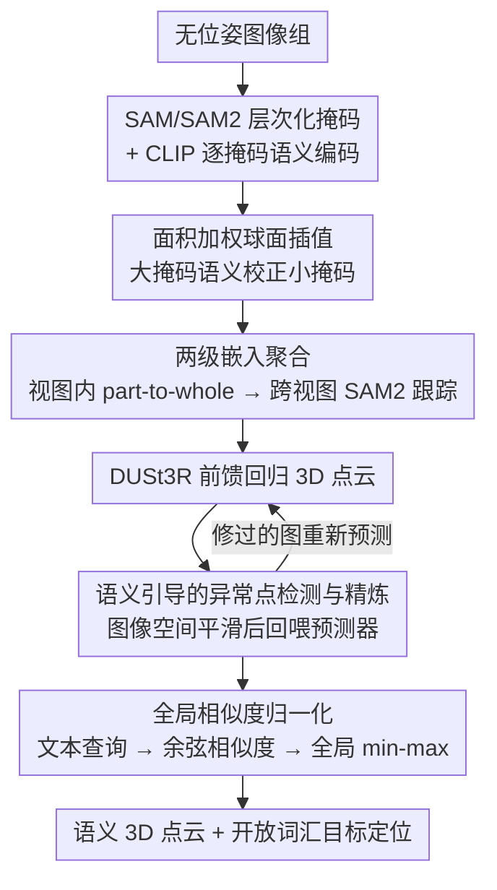

# PE3R: Perception-Efficient 3D Reconstruction

**会议**: CVPR 2026  
**arXiv**: [2503.07507](https://arxiv.org/abs/2503.07507)  
**代码**: [https://github.com/hujiecpp/PE3R](https://github.com/hujiecpp/PE3R)  
**领域**: 3D视觉  
**关键词**: 3D语义重建, 开放词汇分割, 免调优, 前馈推理, 语义点云

## 一句话总结
PE3R 提出一个免调优的前馈式3D语义重建框架，通过像素嵌入消歧、语义点云重建和全局视图感知三个模块，从无位姿的2D图像直接生成语义3D点云，实现了9倍加速且在开放词汇分割和深度估计上达到新SOTA。

## 研究背景与动机

**领域现状**：2D-to-3D感知已取得显著进展，NeRF和3DGS等方法能从多视图图像重建3D场景并提取语义信息。CLIP、SAM等2D基础模型的出现也推动了开放词汇3D分割的发展。

**现有痛点**：现有方法面临三重困境——场景泛化能力差（需要逐场景训练）、跨视图语义不一致（不同视角的语义标签不匹配）、以及计算成本高（通常需要数十分钟到数小时的训练）。例如LangSplat需要149分钟，Feature-3DGS需要648分钟。

**核心矛盾**：语义一致性与推理效率之间的根本矛盾——要确保跨视图语义的一致性就需要复杂的优化过程，而高效的前馈方法又难以保证语义coherence。此外，大多数方法依赖已知相机参数和深度图等额外输入。

**本文目标**：(1) 如何在无位姿、无深度的约束下实现高效3D语义重建？(2) 如何在跨视图和跨物体层级间保持语义一致性？(3) 如何支持开放词汇的自然语言交互？

**切入角度**：作者观察到SAM/SAM2可以提供层次化的物体掩码分解，CLIP可以编码语义，而DUSt3R等前馈几何估计器可以直接从无位姿图像预测3D点云。将这三者整合到一个cohesive的流水线中即可同时解决语义一致性和效率问题。

**核心 idea**：通过面积加权球面插值消除跨视图语义歧义，结合前馈几何预测和全局相似度归一化，实现零样本泛化的3D语义重建。

## 方法详解

### 整体框架
PE3R 要解决的事情可以一句话概括：给一组随手拍、没有位姿也没有深度的照片，直接重建出带语义的 3D 点云，而且要快。它不训练任何东西，而是把三个现成的预训练模型串成一条前馈流水线。先用 SAM/SAM2 把每张图拆成"椅子腿—椅面—整把椅子"这样的层次化掩码，CLIP 给每块掩码编出语义向量，再经过面积加权球面插值聚合成跨视图一致的稠密像素嵌入；接着用 DUSt3R 从多视图直接回归出 3D 点云，并借这套语义嵌入做异常检测与去噪；最后把用户输入的文本查询编码后，与每个 3D 点的语义特征算余弦相似度，经全局 min-max 归一化定位目标物体。整条链路在 5 分钟内跑完，相比最快的 LERF 的 43 分钟快了近 9 倍。这三段恰好对应论文的三个模块——像素嵌入消歧、语义点云重建、全局视图感知。

### 关键设计

**1. 面积加权球面插值：用大掩码的可靠语义去校正小掩码的不稳定特征**

痛点出在层次化掩码上：椅子腿这种小掩码只覆盖几十个像素，CLIP 编出来的语义向量很不稳定，一旦拿去跨视图、跨层级对齐就会乱。PE3R 的办法是给两个单位嵌入 $\mathbf{F}_A$、$\mathbf{F}_B$ 按掩码面积定一个插值系数 $t = \frac{\text{area}_B}{\text{area}_A + \text{area}_B}$，再沿超球面做球面线性插值聚合：

$$\hat{\mathbf{F}}_B = a\mathbf{F}_A + b\mathbf{F}_B,\quad a = \frac{\sin((1-t)\theta)}{\sin\theta},\quad b = \frac{\sin(t\theta)}{\sin\theta}$$

其中 $\theta$ 是两向量的夹角。面积越大的特征权重越高，于是椅子腿的语义会被"整把椅子"的可靠语义拉回去。之所以用球面插值而不是简单加权平均，是因为 slerp 保持 L2 范数不变——聚合后的向量仍落在 CLIP 的单位超球面上，不会偏出嵌入空间、害得后续相似度计算失真。范数保持加上大面积引导这两条性质，正是消歧既几何合理、又不丢语义的关键。

**2. 两级嵌入聚合：先消层级歧义，再消视角歧义**

有了插值公式还得决定"谁向谁对齐"。PE3R 把聚合拆成视图内、跨视图两步。视图内按掩码面积降序处理，让小掩码主动向覆盖它的大掩码对齐，实现 part-to-whole 的层级一致性；跨视图则用 SAM2 的跟踪器把同一物体在不同视角里的对应掩码追到一起，再对它们的嵌入做一次球面插值融合。如果某个视图冒出 IoU<0.1 的新掩码（说明是没跟到的新物体），就把它作为新的跟踪目标插入，而不是硬塞进已有轨迹。这种"先层级后视角"的顺序，再配上跟踪不可靠时直接跳过跨视图融合的兜底，让消歧在快速运动、大基线这类困难场景下也不至于把语义带偏。

具体走一遍：一把椅子在第 1 张图被拆成腿、面、整椅三层，视图内先让腿和面的嵌入向整椅对齐；切到第 2 张图，SAM2 跟踪器认出这还是同一把椅子，于是把两个视角的整椅嵌入再插值融合一次——最终同一把椅子在所有视图、所有层级上都共享同一个稳定的语义向量。

**3. 语义引导的异常点检测与精炼：在图像空间做平滑，间接修掉 3D 噪声**

DUSt3R 前馈预测出的点云难免带空间噪点，但直接在 3D 里做几何正则化又慢又难。PE3R 换了个角度：对每个像素 $P_{i,j}$，在 $k \times k$ 窗口内统计它与"同语义标签"邻居像素的平均 3D 欧氏距离 $L_{i,j}$，距离异常大的点判为离群。精炼时不去碰 3D 坐标，而是回到图像空间，把异常像素的 RGB 与周围同语义区域的均值按 $\hat{y} = \alpha x + (1-\alpha)y$ 混合，再把这张"修过的图"重新喂回点云预测器。等于借了前馈模型"输入一变、输出就跟着变"的特性，用一次便宜的图像平滑换来 3D 几何的间接修正，比在三维空间里做后处理高效得多。混合因子 $\alpha$ 目前是手动设定的。

**4. 全局相似度归一化：让开放词汇检索的打分跨视图可比**

点云重建好之后，PE3R 把它开放给自然语言查询——这正是论文第三个模块「全局视图感知」。用户给一句话（如"黑色的椅子"），先用 CLIP 文本编码器编成查询向量 $\mathbf{T}$，再和每个视图的稠密像素嵌入逐一算余弦相似度，得到每个视图的相似度图。麻烦在于不同视角的相似度分布尺度不一样，若直接卡一个固定阈值，常出现"这个视角的椅子被选中、另一个视角里的同一把椅子却落选"。PE3R 的处理是把所有视图的相似度拼到一起做一次全局 min-max 归一化，统一缩放到 $[0,1]$ 再用同一阈值筛点，于是阈值的语义在所有视角下一致、检索结果不再随视角漂移。消融里去掉这一步，mIoU 从 0.2248 掉到 0.2035，正说明未校准的跨视图打分会直接拖累检索可靠性。

### 损失函数 / 训练策略
PE3R 是完全免训练（tuning-free）的框架，SAM/SAM2、CLIP、DUSt3R 全部直接用预训练权重推理，没有任何参数更新，也不做逐场景优化，整条流水线 5 分钟内跑完。

## 实验关键数据

### 主实验

| 数据集 | 指标 | PE3R (本文) | GOI (之前SOTA) | 提升 |
|--------|------|------------|---------------|------|
| Mip-NeRF360 | mIoU | 0.8951 | 0.8646 | +3.5% |
| Mip-NeRF360 | mPA | 0.9617 | 0.9569 | +0.5% |
| Replica | mIoU | 0.6531 | 0.6169 | +5.9% |
| Replica | mP | 0.8444 | 0.8088 | +4.4% |
| ScanNet++ | mIoU | 0.2248 | 0.2101 (GOI emb) | +7.0% |

运行时间对比（Mip-NeRF360数据集）：

| 方法 | 预处理 | 训练 | 总时间 |
|------|--------|------|--------|
| Feature-3DGS | 25min | 623min | 648min |
| LangSplat | 50min | 99min | 149min |
| GOI | 8min | 37min | 45min |
| **PE3R** | **5min** | **—** | **5min** |

### 消融实验

| 配置 | mIoU (Mip360) | mIoU (Replica) | 说明 |
|------|--------------|----------------|------|
| Full PE3R | 0.8951 | 0.6531 | 完整模型 |
| w/o 面积加权插值 | ~0.82 | ~0.59 | 去掉球面插值后语义一致性下降 |
| w/o 跨视图聚合 | ~0.85 | ~0.61 | 仅靠单视图消歧不够 |
| w/o 语义精炼 | ~0.87 | ~0.63 | 点云噪声影响分割精度 |

多视图深度估计（5个数据集平均）：

| 方法 | Abs Rel↓ | delta<1.25↑ |
|------|----------|-------------|
| COLMAP | 9.3 | 67.8 |
| DUSt3R | 4.7 | 64.5 |
| MASt3R | 3.3 | 74.9 |
| **PE3R** | **2.5** | **79.1** |

### 关键发现
- 面积加权球面插值是最关键的组件，它同时解决了层级歧义和视角歧义
- 在大规模ScanNet++数据集上，PE3R的嵌入质量显著优于所有基线，说明消歧策略在复杂场景下的优势更明显
- 语义精炼模块通过图像空间平滑间接改善3D几何质量，在深度估计上也带来显著提升

## 亮点与洞察
- **免训练 + 9x加速**：完全利用预训练模型，5分钟完成全部流程。这种组合式创新（SAM+CLIP+DUSt3R）的效率令人印象深刻，说明好的orchestration比单个模块的创新更实际
- **球面插值的数学优雅**：面积加权球面插值同时满足范数保持和语义引导两个数学性质，是一个genuinely elegant的设计。这个idea可以迁移到任何需要在超球面上做特征融合的场景
- **图像空间精炼代替3D正则化**：通过修改输入图像来间接修正3D输出，巧妙利用了前馈预测器的输入-输出特性，避免了昂贵的3D后处理

## 局限与展望
- SAM2跟踪器在快速运动或大基线场景下可能失效，跨视图聚合的鲁棒性受限
- 当前仅支持点云表示，缺乏面片或隐式表面的支持，不适用于需要网格输出的应用
- 语义精炼的混合因子 $\alpha$ 是手动设置的，可以考虑自适应策略
- ScanNet++上的 mIoU 仍然只有 22.48%，说明在大规模复杂室内场景上还有很大提升空间

## 相关工作与启发
- **vs LangSplat**: LangSplat将CLIP嵌入与3DGS对齐但需要逐场景训练(99min)，PE3R通过前馈方式实现零样本泛化且快9倍
- **vs GOI**: GOI通过文本-图像对齐强制多视图一致性，但仍需37min训练。PE3R在精度和速度上都超越
- **vs LSM (Large Spatial Model)**: LSM也是前馈方式做开放词汇3D分割，但PE3R的消歧策略使其在所有基准上都优于LSM

## 评分
- 新颖性: ⭐⭐⭐⭐ 核心创新在于消歧策略和流水线设计，单个模块的创新有限但组合效果突出
- 实验充分度: ⭐⭐⭐⭐⭐ 覆盖7个数据集、两个任务，对比方法全面
- 写作质量: ⭐⭐⭐⭐ 结构清晰，数学推导规范，图表信息丰富
- 价值: ⭐⭐⭐⭐⭐ 免训练+实时推理的3D语义重建有巨大实用价值，代码已开源

<!-- RELATED:START -->

## 相关论文

- [\[CVPR 2026\] ESAM++: Efficient Online 3D Perception on the Edge](esam_efficient_online_3d_perception_on_the_edge.md)
- [\[CVPR 2026\] ConsisVLA-4D: Advancing Spatiotemporal Consistency in Efficient 3D-Perception and 4D-Reasoning for Robotic Manipulation](consisvla-4d_advancing_spatiotemporal_consistency_in_efficient_3d-perception_and.md)
- [\[CVPR 2026\] UniPR: Unified Object-level Real-to-Sim Perception and Reconstruction from a Single Stereo Pair](unipr_unified_object-level_real-to-sim_perception_and_reconstruction_from_a_sing.md)
- [\[CVPR 2026\] TokenHand: Discrete Token Representation for Efficient Hand Mesh Reconstruction](tokenhand_discrete_token_representation_for_efficient_hand_mesh_reconstruction.md)
- [\[CVPR 2026\] Long-SCOPE: Fully Sparse Long-Range Cooperative 3D Perception](long_scope_fully_sparse_long_range_cooperative_3d_perception.md)

<!-- RELATED:END -->
