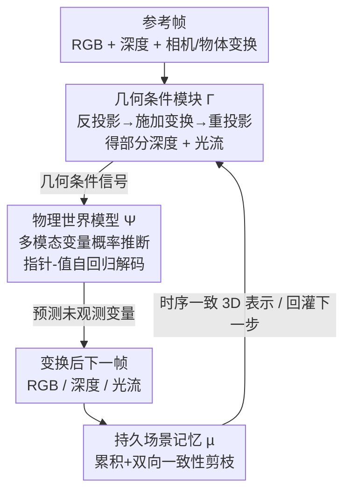

# P3Sim：基于物理世界建模的感知式 3D 模拟

**会议**: CVPR 2026  
**论文**: [CVF Open Access](https://openaccess.thecvf.com/content/CVPR2026/html/Lee_Perceptual_3D_Simulation_With_Physical_World_Modeling_CVPR_2026_paper.html)  
**代码**: 无  
**领域**: 3D视觉 / 世界模型  
**关键词**: 感知式3D模拟, 世界模型, 概率图模型, 自回归序列建模, 几何条件

## 一句话总结
P3Sim 把"从单张图像预测 3D 场景变换后会变成什么样"建模成对多模态场景变量（RGB / 深度 / 光流）的概率推断，用一个带指针-值序列的 7B 自回归 Transformer 做随机访问解码，再配上几何条件模块与持久场景记忆，统一支持新视角合成、刚体/形变操作、碰撞与多智能体预测等任务，并在 NVS 与 3D 物体操作两个 benchmark 上超过专用基线。

## 研究背景与动机

**领域现状**：在游戏引擎这类理想模拟器里，预测"做一个 3D 变换后场景会怎么演化"很简单——系统完整掌握几何、材质和物理动力学。而真实世界里要从原始图像做同样的事，是 vision / graphics / robotics 的核心目标，催生了可控视频生成、交互式场景编辑、具身推理等一批应用。

**现有痛点**：现有方法各自为政且都有硬伤。新视角合成（NVS）的扩散模型（Zero-1-to-3、ViewCrafter、SEVA 等）相机控制不稳、3D 变换不灵活；拖拽式物体编辑（DragAnything、Diffusion Handles）依赖把真实图反演到 Stable Diffusion 隐空间，真实图常常反演失败；基于轨迹/世界模型的方法（Genie、GAIA-1、OpenVLA）动作条件偏语义、不强制几何一致。

**核心矛盾**：真实世界的感知**天生是局部且不完整的**——大片区域被遮挡或没观测到，物体/相机一动就无法直接算出完整 3D 结构；局部动作（掀起布的一角、推一个物体）也只透露了全局后果的一小部分信息。于是有三个绕不开的难点：① 几何和变换都只部分已知，必须**在不确定性下推理**；② 有些先验（投影几何、运动约束）该硬编码，有些（场景常识）该从数据学，需要**平衡内置几何结构与学习知识**；③ 感知-预测要**在线运行**，随新观测持续更新，需要持久记忆机制。

**本文目标**：造一个统一系统，在"几何不完整 + 变换信号不完整"两种缺失同时存在时，仍能模拟物理上自洽的场景演化。

**核心 idea**：把感知和模拟都看成对一个多模态场景变量图（PGM）的概率推断——任给一部分变量当条件，预测其余变量；再用指针-值序列把这个 PGM 转成 GPT 式自回归训练，从而把"结构化概率推理"嫁接到"大规模生成模型"上。

## 方法详解

### 整体框架
P3Sim 由三个相互配合的组件构成：**物理世界模型 Ψ**、**几何条件模块（geometrizer）Γ**、**持久场景记忆 µ**。流程上，给定参考帧图像与深度、加上用户/agent 指定的相机位姿与物体 3D 变换，Γ 先把这些变换"翻译"成显式的几何证据（目标帧的部分深度 + 光流）；Ψ 把这些证据连同已观测的场景变量一起当条件，概率式地预测出未观测/不受控的那部分场景，渲染出变换后的下一帧；µ 则把每一帧的预测沿时间累积进一个全局坐标系，剪掉与新观测矛盾的几何，维持一个时序一致的 3D 表示。这样，数据驱动的 Ψ 提供灵活性，硬编码几何的 Γ 提供归纳偏置，µ 提供在线一致性。

### 关键设计

**1. 物理世界模型 Ψ：把 3D 模拟转成"任给一部分变量、预测其余变量"的概率推断**

痛点很直接：真实观测永远残缺，没法像引擎那样确定性地推下一帧。P3Sim 把一个场景表示成一组随机变量 $\{x_p\}_{p\in P}$，其中指针 $p$ 索引一个局部场景元素（空间位置 + 时间 + 模态），取值 $v\in V$ 编码 RGB / 深度 / 光流内容；当前已观测状态是一个偏函数 $X:\mathrm{dom}(X)\subseteq P\to V$。世界模型 Ψ 的目标就是推断任一未观测变量的条件分布 $\Psi:(X,\,p\notin\mathrm{dom}(X))\mapsto\{\Pr[(p,v)\mid X]\mid v\in V\}$。这本质上定义了一个场景变量上的概率图模型（PGM），推断 = 预测缺失节点的条件分布，从 Ψ 采样就得到与已观测一致的合理补全。

直接在所有变量上训练 PGM 因为条件子集是组合爆炸而不可行。关键一招是把它**重写成自回归序列预测**：把数据 $X$ 序列化成交错的指针-值序列 $p_0,v_0,\dots,p_k,v_k$，训练一个因果 Transformer 去建模任意 $p$ 的下一指针分布 $\Psi(X\circ p)\equiv\Pr[v_k\mid p_0,v_0,\dots,p_k,v_k,p]$。和栅格顺序图像生成不同，**指针 token 让遍历顺序本身变成可控变量**，于是支持随机访问解码——通过选不同模态子集（RGB / 深度 / 光流）当条件，同一套公式就把几何重建、新视角合成、运动预测统一进一个随机访问解码过程。模型是 7B 自回归 Transformer，用 next-token 交叉熵只监督内容 token（不监督指针 token）。

**2. 几何条件模块 Γ（geometrizer）：把用户指定的相机/物体变换"翻译"成可喂给 Ψ 的显式几何证据**

光有概率模型还不够——它需要具体的 3D 证据才能确定该往哪个方向推。Γ 是一个确定性模块，给定历史深度、相机内参 $K$、目标位姿 $P_t$、每个物体的目标变换 $\{\mathcal{T}_t^{(o)}\}$，产出目标帧的光流与稀疏深度条件：$(F_{t-1\to t},\,D_t^{\text{sparse}})=\Gamma(\{D_{0:t-1}\},K,P_t,\{\mathcal{T}_t^{(o)}\})$。做法是把 $D_{t-1}$ 的 3D 点施加变换后重投影到目标帧得到光流，$D_t^{\text{sparse}}$ 只保留有可靠几何证据的区域。它先把场景分成可观测/不可观测区，并按表面法向与视线夹角 $\theta=\cos^{-1}(n\cdot(-v))<\theta_{th}$ 判定表面"有效/无效"（掠射角表面不可靠就剔除）。静态场景（NVS）只投影有效表面并保留进入遮挡前命中的射线；已知运动的动态场景把分割出的物体连同"底面网格"一起按 3D 变换位移以保持遮挡一致；只知道部分运动时，未知动态区域被 mask 掉、不进部分深度。这样 Ψ 拿到的是物理自洽的条件，而非语义级的模糊提示。

**3. 持久场景记忆 µ：把逐帧预测沿时间融成全局一致的 3D 表示**

单帧推断会随时间漂移、互相矛盾。µ_t 是 t 时刻整合后的 3D 场景估计，在全局坐标系里存表面元素、未观测体积、相机信息和 3D 运动场，只保留与所有已观测帧一致的结构；查询 $\mu_t(t')$ 返回用 $[0,t]$ 全部记忆推得的第 $t'$ 帧几何。每步先反投影出该帧几何 $\mathcal{G}_t=\text{BackProject}(D_t,T_t)$（含可见表面 + 遮挡隐含的未观测体积），再用运动场 $\mathcal{M}_t$ 把它对齐进记忆坐标系（单物体稀疏运动时按 3.2 mask），记忆更新为 $\mu_t=\text{Update}_\mu(\mu_{t-1},\mathcal{G}_t,\mathcal{M}_t,D_t,T_t)$。更新做**双向一致性检查**：把旧记忆投到当前视角、删掉投得比观测深度更近的未观测体积；再把新几何投回过去视角、删掉被历史观测否定的未观测体积；两边幸存元素合并成 µ_t。正是这个机制支撑了把多帧预测拼成 scene-level 全局地图、object-centric 形状补全，以及对遮挡结构的 amodal completion。

> **灵活推断路径**：Ψ 的条件能力由两个轴组织——光流密度（动态已知多少）和深度稀疏度（变换后几何已知多少）。稠密光流 + 较密目标深度对应"已知动态"，如 NVS（$D_1\sim\Psi(I_0,D_0,F_{0\to1},D_1^{sparse})$，再 $I_1\sim\Psi(I_0,D_0,F_{0\to1},D_1)$）、刚体操作；稀疏光流 + 极稀疏几何对应"未知/部分动态"（$D_1\sim\Psi(I_0,F_{0\to1}^{sparse},D_1^{sparse})$），如形变操作、物体碰撞、多智能体预测。同一个模型因此能从"几何驱动的确定性预测"一路覆盖到"部分观测下的开放式推断"。

### 损失函数 / 训练策略
7B 自回归 Transformer，next-token 预测交叉熵，**只监督内容 token、不监督指针 token**。训练数据为 300 万段 RGB 视频片段、约 1.4 万亿 token；batch size 512、训 1.5M 步，采用 Warmup-Stable-Decay 调度，学习率峰值 3e-4 并在最后 100K 步衰减到 0；序列长 4096，最后 20K 步增到 8192。训练时深度/光流由估计得到（含噪声），推断时变换按任务定义视为已知。

## 实验关键数据

作者只在两个有标准 benchmark 的核心任务上做定量评估——新视角合成（NVS）和 3D 物体运动，论文其余能力（碰撞、多智能体、amodal 等）被视为这两者的自然延伸、缺乏标准化评测。

### 主实验

NVS：在 SEVA benchmark 的小视角 Reconfusion split 上，跨 RE10K / LLFF / DTU 三个数据集比 PSNR（越高越好）。

| 数据集 | ViewCrafter | SEVA | P3Sim (本文) |
|--------|-------------|------|--------------|
| RE10K | 20.88 | 18.11 | **21.54** |
| LLFF | 10.53 | 14.03 | **15.18** |
| DTU | 12.66 | 14.47 | **15.50** |

3D 物体操作：在 3DEditBench 上比重建质量（PSNR↑ / LPIPS↓）与编辑保真度（Edit Adherence, EA↑）。

| 模型 | PSNR ↑ | LPIPS ↓ | EA ↑ |
|------|--------|---------|------|
| DragAnything | 15.13 | 0.443 | 0.517 |
| Diffusion Handles | 17.82 | 0.344 | 0.619 |
| LightningDrag | 19.52 | 0.184 | 0.722 |
| P3Sim (本文) | **23.12** | **0.121** | **0.827** |

### 关键发现
- 在三个 NVS 数据集上 PSNR 全面领先，且在 ViewCrafter 表现很差的 LLFF（10.53）/ DTU（12.66）上把分数拉到 15+，说明自回归 + 显式几何条件的组合在全局场景连贯性与相机控制稳定性上明显强于纯扩散方案。
- 3D 物体操作上对最强基线 LightningDrag 的 EA 从 0.722 提到 0.827、PSNR 从 19.52 提到 23.12，表明模型不仅图像质量更高，对指定 3D 变换的"服从度"也更忠实——这正是避开 SD 隐空间反演带来的收益。

## 亮点与洞察
- **把"任意条件子集 → 预测其余"做成随机访问解码**：用指针 token 让遍历顺序成为可控变量，是把组合爆炸的 PGM 推断塞进 GPT 训练范式的关键 trick，一个模型自然统一了重建/NVS/运动预测，可迁移到任何"多模态、需灵活条件"的预测任务。
- **几何该硬编码就硬编码**：Γ 用确定性投影几何生成条件、Ψ 用学习补不确定部分，把"projective geometry 等先验硬编码 + 其余从数据学"这条原则落到了模块边界上，比纯端到端学几何更稳。
- **双向一致性的记忆剪枝**很巧：同时用"旧记忆投到现在"和"新几何投回过去"两个方向裁掉矛盾的未观测体积，使 amodal completion / 全局地图自然涌现，而不需要额外的重建网络。

## 局限与展望
- 评测面偏窄：定量结果只有 NVS 与 3D 物体操作两表，碰撞、形变、多智能体等论文主打的"难"能力只有定性图示，缺标准 benchmark 支撑，说服力打折。⚠️
- 依赖训练时估计的深度/光流（含噪），且推断时假定变换"按任务定义已知"，在真正未知相机/物体运动、需要自己估变换的开放场景下表现如何未充分验证。
- 7B 模型 + 1.4T token 的训练成本高；指针-值序列与随机访问解码在长时序、密集多物体场景下的推断效率/序列长度（4096→8192）是否够用，论文未深入。

## 相关工作与启发
- **vs 扩散式 NVS（ViewCrafter / SEVA / Zero-1-to-3）**：它们靠扩散采样补未观测区，但相机控制不稳、3D 变换不灵活；本文用自回归 + 随机访问条件，支持更鲁棒、更广的 3D 条件，定量 PSNR 更高。
- **vs 拖拽式 3D 编辑（DragAnything / Diffusion Handles / LightningDrag）**：它们多需把真实图反演进 SD 隐空间、真实图常失败；本文不做隐空间反演，用同一套自回归概率推断做局部编辑，EA 与 PSNR 全面更好。
- **vs 世界模型（Dreamer / Genie / GAIA-1 / OpenVLA）**：它们动作条件偏语义、不强制几何一致；本文以感知驱动、用深度+光流强制几何自洽，从部分视觉证据生成物理连贯的演化。

## 评分
- 新颖性: ⭐⭐⭐⭐⭐ 把 PGM 概率推断、指针-值随机访问自回归、显式几何条件与持久记忆统一成一个感知式 3D 模拟器，框架很新。
- 实验充分度: ⭐⭐⭐ 两个 benchmark 上确实领先，但主打的形变/碰撞/多智能体能力只有定性结果。
- 写作质量: ⭐⭐⭐⭐ 三组件分工与三大挑战对应清晰，公式与流程讲得明白。
- 价值: ⭐⭐⭐⭐ 朝"通用物理世界模型"迈了一步，对可控视频生成、具身与机器人数据增广有实用潜力。

<!-- RELATED:START -->

## 相关论文

- [\[CVPR 2026\] 3D-IDE: 3D Implicit Depth Emergent](3d-ide_3d_implicit_depth_emergent.md)
- [\[CVPR 2026\] ActionMesh: Animated 3D Mesh Generation with Temporal 3D Diffusion](actionmesh_animated_3d_mesh_generation_with_temporal_3d_diffusion.md)
- [\[CVPR 2026\] Nope-SGS：从无位姿脉冲流重建 3D 高斯](3d_gaussian_splatting_from_unposed_spike_stream.md)
- [\[CVPR 2026\] AnchorSplat: Feed-Forward 3D Gaussian Splatting with 3D Geometric Priors](anchorsplat_feed-forward_3d_gaussian_splatting_with_3d_geometric_priors.md)
- [\[CVPR 2026\] 3D-Fixer: Coarse-to-Fine In-place Completion for 3D Scenes from a Single Image](3d-fixer_coarse-to-fine_in-place_completion_for_3d_scenes_from_a_single_image.md)

<!-- RELATED:END -->
